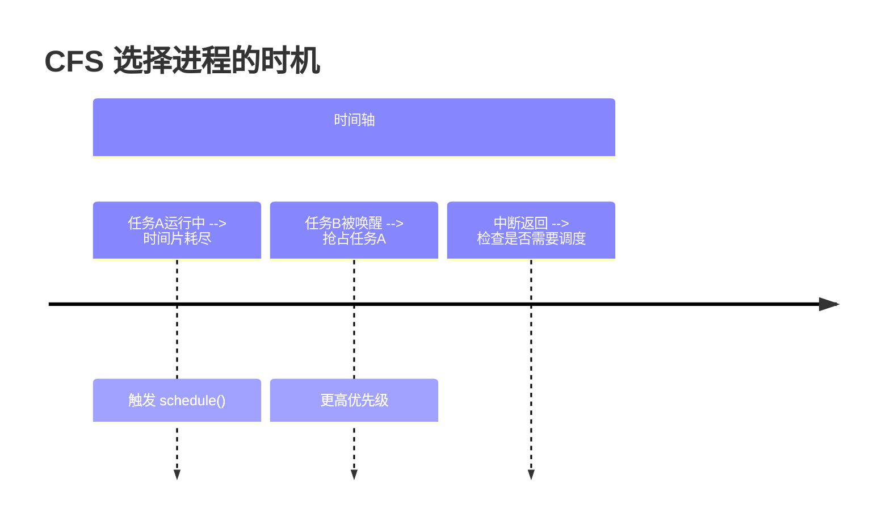
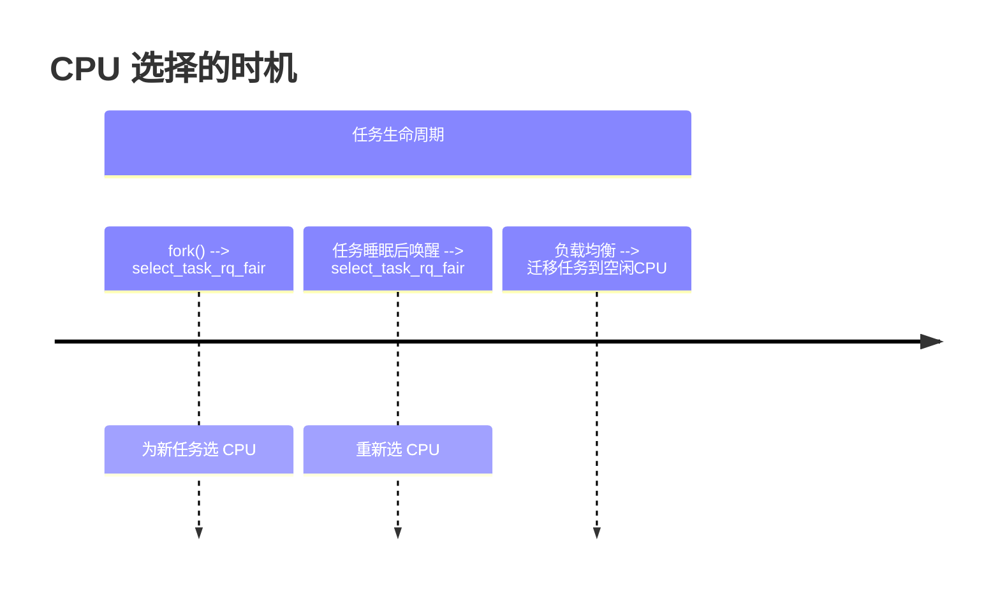

​​EAS (Energy Aware Scheduling)​​ 是 Linux 内核的一种调度策略，旨在 ​​优化 CPU 能效​​，在保证性能的同时 ​​降低功耗​​。它主要应用于 ​​ARM big.LITTLE 架构​​ 和 ​​异构多核处理器​​（如手机 SoC），通过智能调度任务到合适的 CPU 核心，实现 ​​性能与功耗的最佳平衡​​。


是的，CFS 选择进程（线程）和选择 CPU 的时机是完全分离的，两者发生在任务生命周期的不同阶段，且由不同的机制负责。以下是关键区别和协作流程：

---

**1. 选择进程（线程）的时机**
**(1) 发生时机**
• 在 `schedule()` 函数中触发，当以下事件发生时：

  • 任务主动让出 CPU（如调用 `sched_yield()` 或睡眠）。

  • 时间片耗尽（`vruntime` 超过最小阈值）。

  • 更高优先级任务被唤醒（如通过 `wake_up_new_task`）。


**(2) 核心函数**
```c
// kernel/sched/fair.c
struct task_struct *pick_next_task_fair(struct rq *rq) {
    // 从 CFS 红黑树中选择 vruntime 最小的任务
    struct sched_entity *se = __pick_first_entity(cfs_rq);
    return se->task;
}
```
• 决策依据：纯粹基于 `vruntime` 的公平性，不考虑 CPU 拓扑或能耗。


**(3) 典型场景**


---

**2. 选择 CPU 的时机**
**(1) 发生时机**
• 在任务首次创建或唤醒时（如 `fork()`、`wake_up_process()`）。

• 负载均衡时（由 `load_balance` 周期触发）。


**(2) 核心函数**
```c
// kernel/sched/fair.c
int select_task_rq_fair(struct task_struct *p, int prev_cpu) {
    if (energy_aware()) {
        return find_energy_efficient_cpu(p, prev_cpu); // EAS 介入
    }
    return default_cpu_selection(p, prev_cpu); // 默认 CFS 逻辑
}
```
• 决策依据：

  • EAS：能耗模型 + PELT 利用率。

  • 非 EAS：CPU 负载、NUMA 亲和性等。


**(3) 典型场景**


---

**3. 关键区别对比**
| 特性         | 选择进程（CFS）               | 选择 CPU（EAS/CFS）         |
|------------------|----------------------------------|----------------------------------|
| 触发时机     | 每次调用 `schedule()` 时          | 任务创建/唤醒、负载均衡时         |
| 决策频率     | 高频（微秒级）                    | 低频（毫秒级）                   |
| 决策目标     | 公平性（`vruntime` 最小）         | 能效/性能平衡（EAS）或负载均衡    |
| 依赖数据     | 运行队列中的 `vruntime`           | PELT 利用率、CPU 拓扑、能耗模型   |
| 可抢占性     | 立即生效（触发抢占）              | 异步生效（下次调度时生效）         |

---

**4. 协作流程示例**
以 一个新任务被创建 为例：
1. 用户调用 `fork()`  
   → 内核通过 `copy_process()` 复制任务。
2. 选择 CPU（EAS 介入）  
   → `wake_up_new_task()` → `select_task_rq_fair()` → `find_energy_efficient_cpu()`。
3. 加入目标 CPU 的运行队列  
   → 任务被插入对应 CFS 红黑树。
4. 触发调度  
   → 目标 CPU 的 `schedule()` 调用 `pick_next_task_fair()` 选择该任务运行。

---

**5. 设计意义**
• 解耦关注点：  

  • CFS 专注公平性：确保每个任务按权重获得 CPU 时间。  

  • EAS 专注能效：在任务放置阶段优化 CPU 选择，不影响实时调度。  

• 性能优化：  

  • CPU 选择是开销较大的操作（需遍历所有 CPU），因此仅在必要时触发。  

  • 进程选择是轻量级操作（仅查询红黑树），适合高频执行。


---

**6. 验证方法**
**(1) 跟踪 CPU 选择**
```bash
echo 1 > /sys/kernel/debug/tracing/events/sched/sched_select_task_rq_fair/enable
cat /sys/kernel/debug/tracing/trace_pipe
```

**(2) 跟踪进程选择**
```bash
echo 1 > /sys/kernel/debug/tracing/events/sched/sched_pick_task/enable
cat /sys/kernel/debug/tracing/trace_pipe
```

**(3) 强制分离测试**
```bash
# 禁用 EAS，观察纯 CFS 行为
echo 0 > /proc/sys/kernel/sched_energy_aware
```

---

通过这种分离设计，Linux 内核实现了 公平调度与能效优化的完美平衡。

select_task_rq_fair

```c
static int
select_task_rq_fair(struct task_struct *p, int prev_cpu, int wake_flags)
{
	int sync = (wake_flags & WF_SYNC) && !(current->flags & PF_EXITING);
	struct sched_domain *tmp, *sd = NULL;
	int cpu = smp_processor_id();
	int new_cpu = prev_cpu;
	int want_affine = 0;
	/* SD_flags 和 WF_flags 共享第一个半字节 */
	int sd_flag = wake_flags & 0xF;

	/*
	 * 确保稳定的 ->cpus_allowed
	 */
	lockdep_assert_held(&p->pi_lock);
	if (wake_flags & WF_TTWU) {
		record_wakee(p);

		/* 如果当前 CPU 是允许的并且符合条件，则直接返回当前 CPU */
		if ((wake_flags & WF_CURRENT_CPU) &&
			cpumask_test_cpu(cpu, p->cpus_ptr))
			return cpu;

		/* 如果根域未过载，尝试选择能效最优的 CPU */
		if (!is_rd_overutilized(this_rq()->rd)) {
			new_cpu = find_energy_efficient_cpu(p, prev_cpu);
			if (new_cpu >= 0)
				return new_cpu;
			new_cpu = prev_cpu;
		}

		/* 判断是否需要亲和性调度 */
		want_affine = !wake_wide(p) && cpumask_test_cpu(cpu, p->cpus_ptr);
	}

	rcu_read_lock();
	for_each_domain(cpu, tmp) {
		/*
		 * 如果 'cpu' 和 'prev_cpu' 都属于当前域，
		 * 则 'cpu' 是一个有效的 SD_WAKE_AFFINE 目标。
		 */
		if (want_affine && (tmp->flags & SD_WAKE_AFFINE) &&
			cpumask_test_cpu(prev_cpu, sched_domain_span(tmp))) {
			if (cpu != prev_cpu)
				new_cpu = wake_affine(tmp, p, cpu, prev_cpu, sync);

			sd = NULL; /* 优先选择 wake_affine 而非平衡标志 */
			break;
		}

		/*
		 * 通常仅对 WF_EXEC 和 WF_FORK 为真，因为调度域通常没有设置 SD_BALANCE_WAKE。
		 * 这意味着唤醒通常会走快速路径。
		 */
		if (tmp->flags & sd_flag)
			sd = tmp;
		else if (!want_affine)
			break;
	}

	if (unlikely(sd)) {
		/* 慢路径 */
		new_cpu = sched_balance_find_dst_cpu(sd, p, cpu, prev_cpu, sd_flag);
	} else if (wake_flags & WF_TTWU) { /* XXX 总是？ */
		/* 快路径 */
		new_cpu = select_idle_sibling(p, prev_cpu, new_cpu);
	}
	rcu_read_unlock();

	return new_cpu;
}
```

wake_up_new_task/try_to_wake_up select_task_rq select_task_rq_fair find_energy_efficient_cpu
try_to_wake_up

sched_balance_rq