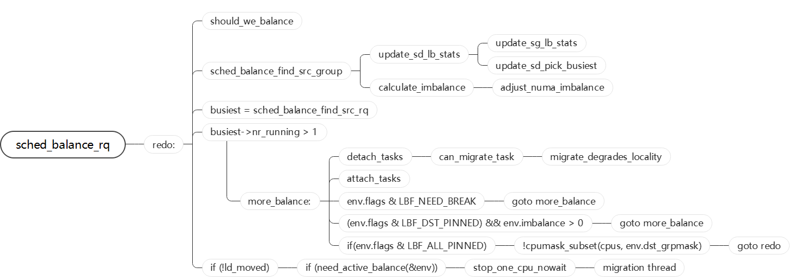
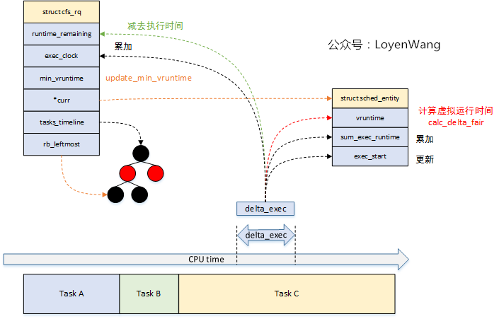
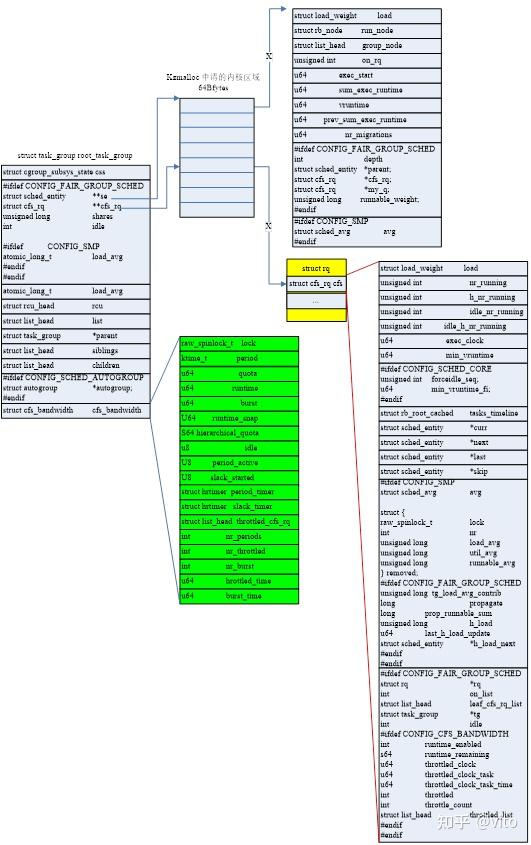
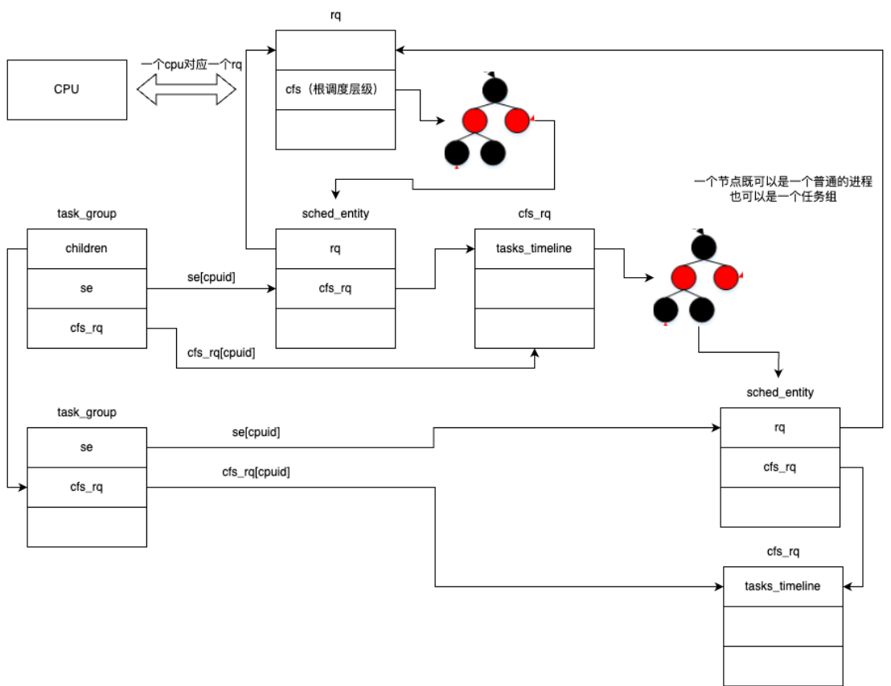
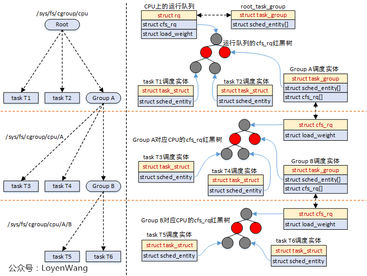
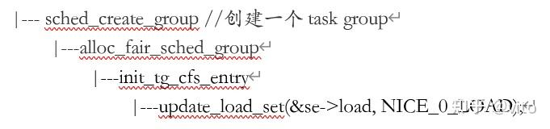

# PELT算法

PELT（Per-Entity Load Tracking）算法​​ 是 Linux 内核调度器（CFS，Completely Fair Scheduler）用于​​任务负载跟踪​​的核心机制，主要用于优化 CPU 调度决策。传统调度器可能以​​整个 CPU 或运行队列​为单位计算负载，这样的计算方式对于cpu调度算法来说不够精准，于是后来引入了 PELT 算法。该算法对负载的跟踪计算以进程线程为单位，对比起原先的模式更加细致。

## 对比起传统负载算法的好处

| 传统负载计算 | PELT 算法 |
| ------ | ------ |
| 采用简单历史平均，响应慢 | ​​指数衰减加权​​，更关注近期负载|
| 粗粒度（整个 CPU/队列）| Per-Entity 粒度​​（每个任务独立计算）|
| 难以适应突发任务 | 快速检测负载变化，提高响应速度 |
| 不适用于节能调度 | 支持 EAS，优化功耗 |
| 多核负载均衡不精确 | 更精准的负载数据，提升多核调度效率 |


## 核心公式

瞬时负载（Li）：表示进程对cpu需要的程度,用于优先级敏感的负载均衡（如CFS的vruntime计算）

$$loadweight\times\big(\cfrac{runnabletime}{1024}\big)$$

* load_weight​​：任务的负载权重，由优先级（nice值）决定。
  * 高优先级任务（如nice=-20）的权重更大，对系统负载的“贡献”更高。
  * 权重值通过查表获得（如内核的sched_prio_to_weight数组）

* runnable_time​​：任务在最近周期（1024微秒）内​​可运行但未实际运行的时间​​（即等待CPU的时间）。

任务优先级越高（load_weight越大）或等待时间越长（runnable_time越大），其负载Li越大。相同的等待时间，优先级越高，li值约大，更需要cpu.

瞬时利用率（Ui）：反映任务实际消耗的CPU算力​，用于 CPU 频率调节（CPUFreq）、能效管理（EAS）

$$MaxCPUcapacity\times\big(\cfrac{runingtime}{1024}\big)$$

* Max_CPU_capacity​​：CPU最大算力，归一化为1024（如手机大核最高频时capacity=1024）。
* running_time​​：任务在最近周期（1024微秒）内​​实际运行的时间​​。

瞬时运行负载（RLi）：反映任务对CPU算力的需求​，用于判断CPU是否过载，触发任务迁移

$$MaxCPUcapacity\times\big(\cfrac{runnabletime}{1024}\big)$$

任务的瞬时负载和瞬时利用率都是一个快速变化的计算量，但是它们并不适合直接调整调度算法，对于调度器来说需要一个保持平滑的变化。例如，在迁移算法中，在上一个1024us窗口中，是满窗运行，瞬时利用率是1024，立刻将任务迁移到大核，下一个窗口，任务有3/4时间在阻塞状态，利用率急速下降，调度器会将其迁移到小核上执行。这样频繁核间调度也容易引起缓存失效等问题。这并不是我们所期望的。

因此这里又引入了求平均值的公式，提供平滑的历史趋势：

load_avg = Σ (Li * y^i)   // 加权负载的衰减和
util_avg = Σ (Ui * y^i)   // 利用率的衰减和
runnable_avg = Σ (RLi * y^i) // 可运行时间的衰减和

在 Linux 调度器中，`load_avg`、`util_avg` 和 `runnable_avg` 这三个 PELT 指标分别用于不同层级的调度决策。

---

**1. `load_avg`（加权负载平均值）**
**作用**
• 表示调度实体（任务或运行队列）的长期加权负载，考虑了任务优先级（`nice` 值）和 CPU 占用时间。  

• 公式：  

  ```
  load_avg = (weight * runnable_time) / time_decay
  ```
  • `weight`：任务优先级权重（如 `nice` 值影响）。  

  • `time_decay`：几何衰减因子（`y^32=0.5`，32ms 前负载贡献减半）。


**触发的调度行为**
1. CFS 负载均衡（CPU 核间任务迁移）  
   • 当不同 CPU 的 `load_avg` 差异超过阈值时，触发负载均衡（`load_balance()`），将任务从高负载 CPU 迁移到低负载 CPU。  

   • 示例：  

     ◦ CPU0 的 `load_avg = 2000`，CPU1 的 `load_avg = 500` → 迁移部分任务到 CPU1。  


2. 任务放置（新任务唤醒时）  
   • 在 `try_to_wake_up()` 中，选择 `load_avg` 最低的 CPU 放置新唤醒的任务（如 `find_idlest_cpu()`）。  


3. 优先级调整（CFS 公平性）  
   • 高 `load_avg` 的任务可能被降低调度优先级（避免独占 CPU）。


---

**2. `util_avg`（CPU 利用率平均值）**
**作用**
• 表示 CPU 的实际使用率（0~1024，或按 CPU 算力缩放），直接反映 CPU 的繁忙程度。  

• 公式：  

  ```
  util_avg = (running_time) / time_decay
  ```
  • 仅统计任务 实际运行时间（不包括就绪未运行的时间）。


**触发的调度行为**
1. CPU 频率调整（DVFS，如 `schedutil` 调速器）  
   • `schedutil` 根据 `util_avg` 动态调整 CPU 频率：  

     ```
     target_freq = (util_avg / max_capacity) * max_freq
     ```
   • 示例：  

     ◦ `util_avg = 800`（`max_capacity=1024`）→ CPU 频率提升至 ~80% 最大频率。  


2. 能效调度（EAS，Energy Aware Scheduling）  
   • 在异构 CPU（如 Arm big.LITTLE）中，选择 `util_avg` 最低的小核运行任务以省电。  


3. 实时任务抢占决策  
   • 高 `util_avg` 的 CPU 可能更快触发实时任务（RT/DL）的抢占。


---

**3. `runnable_avg`（可运行状态平均值）**
**作用**
• 表示调度实体的可运行压力（无论是否实际运行），反映 CPU 就绪队列的竞争强度。  

• 公式：  

  ```
  runnable_avg = (runnable_time) / time_decay
  ```
  • 统计任务在 就绪队列中的时间（包括等待运行的时间）。


**触发的调度行为**
1. CPU 过载检测（Throttling）  
   • 如果 `runnable_avg` 持续高于阈值，可能触发调度限流（如 CFS Bandwidth Control）。  


2. 负载均衡辅助指标  
   • 结合 `load_avg` 判断是否需要迁移任务（高 `runnable_avg` 表示 CPU 竞争激烈）。  


3. 容器/虚拟机资源分配  
   • 在 cgroup 或 K8s 中，`runnable_avg` 用于判断是否需扩容 CPU 配额。

## 常用的结构体

### 计算负载sched_avg


内核用struct sched_avg 来抽象一个 se 或者 cfs rq 的平均调度负载：

```c
struct sched_avg {
	u64				last_update_time;
	u64				load_sum;
	u64				runnable_sum;
	u32				util_sum;
	u32				period_contrib;
	unsigned long			load_avg;
	unsigned long			runnable_avg;
	unsigned long			util_avg;
	unsigned int			util_est;
} ____cacheline_aligned;
```

* last_update_time​​：记录最后一次更新时间，用于计算时间差（delta = now - last_update_time），结合 PELT 公式更新负载。
* ​load_sum / runnable_sum / util_sum​​：这些是 ​​加权累计值​​，用于计算 load_avg、runnable_avg 和 util_avg。PELT 采用 ​​指数衰减加权​​，使得近期负载比历史负载影响更大。
* ​period_contrib​​:处理跨周期的时间计算，确保 PELT 的衰减计算正确（避免时间片跨越多个周期导致误差）。
* util_est​​:用于快速估算利用率（如唤醒任务时），避免实时计算带来的延迟。

### task_group

```c
struct task_group {
	struct cgroup_subsys_state css; // cgroup 子系统状态

#ifdef CONFIG_GROUP_SCHED_WEIGHT
	/* 一个正值表示这是一个 SCHED_IDLE 组 */
	int			idle; // 表示任务组是否为 SCHED_IDLE 组
#endif

#ifdef CONFIG_FAIR_GROUP_SCHED
	/* 此组在每个 CPU 上的可调度实体 */
	struct sched_entity	**se;
	/* 此组在每个 CPU 上“拥有”的运行队列 */
	struct cfs_rq		**cfs_rq;
	unsigned long		shares; // 任务组的权重
#ifdef	CONFIG_SMP
	/*
	 * load_avg 在时钟滴答时间可能会被大量争用，
	 * 因此将其放在自己的缓存行中，与上面的字段分开，
	 * 这些字段也将在每个滴答时访问。
	 */
	atomic_long_t		load_avg ____cacheline_aligned; // 任务组的平均负载
#endif
#endif

#ifdef CONFIG_RT_GROUP_SCHED
	struct sched_rt_entity	**rt_se; // 实时调度实体
	struct rt_rq		**rt_rq; // 实时运行队列

	struct rt_bandwidth	rt_bandwidth; // 实时带宽
#endif

#ifdef CONFIG_EXT_GROUP_SCHED
	u32			scx_flags;	/* SCX_TG_* 标志 */
	u32			scx_weight;	/* SCX 权重 */
#endif

	struct rcu_head		rcu; // RCU 头
	struct list_head	list; // 任务组列表

	struct task_group	*parent; // 父任务组
	struct list_head	siblings; // 兄弟任务组
	struct list_head	children; // 子任务组

#ifdef CONFIG_SCHED_AUTOGROUP
	struct autogroup	*autogroup; // 自动任务组
#endif

	struct cfs_bandwidth	cfs_bandwidth; // CFS 带宽

#ifdef CONFIG_UCLAMP_TASK_GROUP
	/* 用户空间请求的两位小数精度的 [%] 值 */
	unsigned int		uclamp_pct[UCLAMP_CNT]; // 用户空间请求的利用率限制百分比
	/* 为任务组请求的限制值 */
	struct uclamp_se	uclamp_req[UCLAMP_CNT]; // 任务组的请求限制值
	/* 任务组使用的有效限制值 */
	struct uclamp_se	uclamp[UCLAMP_CNT]; // 任务组的有效限制值
#endif

};
```

task_group 中依赖 se 成员来联系到一个调度实体。一个 task_group 在每一个 cpu 都对应一个 sched_entity 结构并被挂在 cfs_rq 中的红黑树节点上。同时一个 task_group 在每一个 cpu 上都有对应的 cfs_rq 结构体，在该结构体中记录了该调度组内进程的优先级。

### struct sched_entity

sched_entity 用来描述一个调度实例，该结构作为一个节点被挂在 cfs_rq 中的红黑树上。一个调度实例既可以对应一个进程，也可以对应一个进程组。



```c
struct sched_entity {
	/* 用于负载均衡: */
	struct load_weight		load;           // 负载权重
	struct rb_node			run_node;       // 红黑树节点
	u64				deadline;       // 截止时间
	u64				min_vruntime;   // 最小虚拟运行时间
	u64				min_slice;      // 最小时间片

	struct list_head		group_node;     // 组节点
	unsigned char			on_rq;          // 是否在运行队列中
	unsigned char			sched_delayed;  // 调度是否延迟
	unsigned char			rel_deadline;   // 相对截止时间
	unsigned char			custom_slice;   // 自定义时间片
					/* hole */

	u64				exec_start;     // 执行开始时间
	u64				sum_exec_runtime; // 总执行时间
	u64				prev_sum_exec_runtime; // 上一次总执行时间
	u64				vruntime;       // 虚拟运行时间
	s64				vlag;           // 虚拟滞后
	u64				slice;          // 时间片

	u64				nr_migrations;  // 迁移次数

#ifdef CONFIG_FAIR_GROUP_SCHED
	int				depth;          // 调度实体的深度
	struct sched_entity		*parent;        // 父调度实体
	/* 调度实体所在的运行队列: */
	struct cfs_rq			*cfs_rq;        // 关联的CFS运行队列
	/* 调度实体拥有的运行队列: */
	struct cfs_rq			*my_q;          // 自己的CFS运行队列
	/* my_q->h_nr_running的缓存值 */
	unsigned long			runnable_weight; // 可运行权重
#endif

#ifdef CONFIG_SMP
	/*
	 * 每个调度实体的负载平均值跟踪。
	 *
	 * 放入单独的缓存行以避免与上面的只读值冲突。
	 */
	struct sched_avg		avg;            // 平均负载
#endif
};

```



### struct cfs_rq

cfs_rq 记录了这个调度组内的调度实例的优先级。在调度时会选取 cfs_rq 中最左边的节点上 cpu。



### struct rq

一个 cpu 对应一个 rq ，在一个 rq 结构体中又记录了不同调度类的根调度层级。

```c
struct rq {
	// ......
	/* 调度相关 */
	struct cfs_rq		cfs; // 完全公平调度类
	struct rt_rq		rt; // 实时调度类
	struct dl_rq		dl; // 截止期调度类
#ifdef CONFIG_SCHED_CLASS_EXT
	struct scx_rq		scx; // 扩展调度类
#endif
	// ......
	unsigned int		clock_update_flags; // 时钟更新标志
	u64			clock; // 当前时钟
	/* 确保所有时钟在同一缓存行中 */
	u64			clock_task ____cacheline_aligned; // 任务时钟
	u64			clock_pelt; // PELT 时钟
	unsigned long		lost_idle_time; // 丢失的空闲时间
	u64			clock_pelt_idle; // PELT 空闲时钟
	u64			clock_idle; // 空闲时钟
#ifndef CONFIG_64BIT
	u64			clock_pelt_idle_copy; // PELT 空闲时钟副本
	u64			clock_idle_copy; // 空闲时钟副本
#endif
}
```

### 结构体之间的关系

在该 cfs 调度中有多个结构体，其中 task_group 用来记录调度组。在进程管理初始化时会初始化 root_task_group 在该结构中记录了所有的进程和进程组。而 rq 则是与 cpu 核一一对应，在 rq 中会记录处在顶层的 cfs_rq 。通过 task_group 和 cfs_rq 来记录调度层级。



多层级的调度：



## 计算权重

### nice 值

​​nice 值​​ 用于调整进程的优先级，影响其在 CPU 时间分配中的权重。以下是关于 nice 值的详细解析，包括其作用、计算方式、与 shares 的关系，以及实际应用示例。

nice 值的作用​​：nice 值是一个 ​​-20 到 19​​ 的整数（默认 0），数值越小，优先级越高（占用更多 CPU 时间）。

​​nice = -20​​：最高优先级（抢占更多 CPU）。

​​nice = 19​​：最低优先级（让出 CPU 时间）。

Linux 内核使用 ​​静态映射表​​（sched_prio_to_weight）将 nice 值转换为权重：

```c
/*
 * nice 值是乘法关系，每改变一个 nice 等级，CPU 时间分配会有一个温和的 10% 变化。
 * 例如，当一个 CPU 密集型任务从 nice 0 变为 nice 1 时，它将比另一个保持在 nice 0 的
 * CPU 密集型任务少获得约 10% 的 CPU 时间。
 *
 * 这种“10% 效应”是相对且累积的：从任意 nice 等级开始，如果上升 1 个等级，
 * CPU 使用率减少约 10%；如果下降 1 个等级，CPU 使用率增加约 10%。
 * （为了实现这一点，我们使用了 1.25 的乘数。如果一个任务增加约 10%，
 * 而另一个任务减少约 10%，那么它们之间的相对差距约为 25%。）
 */
const int sched_prio_to_weight[40] = {
 /* -20 */     88761,     71755,     56483,     46273,     36291,
 /* -15 */     29154,     23254,     18705,     14949,     11916,
 /* -10 */      9548,      7620,      6100,      4904,      3906,
 /*  -5 */      3121,      2501,      1991,      1586,      1277,
 /*   0 */      1024,       820,       655,       526,       423,
 /*   5 */       335,       272,       215,       172,       137,
 /*  10 */       110,        87,        70,        56,        45,
 /*  15 */        36,        29,        23,        18,        15,
};
```

### 计算 Task se 权重

对于task se而言，load weight是明确的，该值是和se的nice value有对应关系。通过下面的公式获得：schd_prio_to_weight[nice]

设置权重：

```
sched_fork set_load_weight 
```

```c
void set_load_weight(struct task_struct *p, bool update_load)
{
	// 获取任务的优先级，静态优先级减去实时优先级的最大值
	int prio = p->static_prio - MAX_RT_PRIO;
	struct load_weight lw;

	// 如果任务具有空闲策略
	if (task_has_idle_policy(p)) {
		// 设置权重为空闲优先级的权重
		lw.weight = scale_load(WEIGHT_IDLEPRIO);
		// 设置反权重为空闲优先级的反权重
		lw.inv_weight = WMULT_IDLEPRIO;
	} else {
		// 根据优先级设置权重和反权重
		lw.weight = scale_load(sched_prio_to_weight[prio]);
		lw.inv_weight = sched_prio_to_wmult[prio];
	}

	/*
	 * 如果需要更新负载，并且调度类支持重新设置任务权重，
	 * 则调用调度类的 reweight_task 方法更新任务的负载。
	 * 否则，直接设置任务的负载权重。
	 */
	if (update_load && p->sched_class->reweight_task)
		p->sched_class->reweight_task(task_rq(p), p, &lw);
	else
		p->se.load = lw;
}
```

### 计算 Task group se 权重


**负载权重计算公式演进**

**1. 理想情况下的精确公式**
```math
ge\text{->load.weight} = \frac{tg\text{->weight} \times grq\text{->load.weight}}{\sum grq\text{->load.weight}} \quad \text{(1)}
```
• 问题：计算总和（Σ）开销过大。


---

**2. 近似替代方案**
用慢速变化的平均值（`grq->avg.load_avg`）替代实时权重：
```math
grq\text{->load.weight} \rightarrow grq\text{->avg.load\_avg} \quad \text{(2)}
```
得到近似公式：
```math
ge\text{->load.weight} = \frac{tg\text{->weight} \times grq\text{->avg.load\_avg}}{tg\text{->load\_avg}} \quad \text{(3)}
```
其中：  
`tg->load_avg ≈ Σ grq->avg.load_avg`（即 `shares_avg`）。

• 优点：计算更高效稳定。  

• 缺点：平均值响应慢，导致边界条件（如空闲组启动任务时）出现瞬态延迟。


---

**3. 特殊情况（UP 场景）**
当其他 CPU 均空闲时，总和坍缩为当前 CPU 的权重：
```math
ge\text{->load.weight} = \frac{tg\text{->weight} \times grq\text{->load.weight}}{grq\text{->load.weight}} = tg\text{->weight} \quad \text{(4)}
```

---

**4. 改进的混合公式**
结合 (3) 和 (4)，在接近 UP 场景时动态调整：
```math
ge\text{->load.weight} = \frac{tg\text{->weight} \times grq\text{->load.weight}}{tg\text{->load\_avg} - grq\text{->avg.load\_avg} + grq\text{->load.weight}} \quad \text{(5)}
```

• 问题：`grq->load.weight` 可能为 0 导致除零错误。


---

**5. 最终修正公式**
使用 `grq->avg.load_avg` 作为下限：
```math
ge\text{->load.weight} = \frac{tg\text{->weight} \times grq\text{->load.weight}}{tg\text{->load\_avg'}} \quad \text{(6)}
```
其中：  
`tg->load_avg' = max(tg->load_avg - grq->avg.load_avg, grq->avg.load_avg) + grq->load.weight`

---

**关键设计思想**
1. 性能与精度平衡  
   用平均值（`load_avg`）替代实时值（`load.weight`）降低计算开销。
2. 边界条件处理  
   在 UP 场景下回归精确计算，避免瞬态延迟。
3. 数值安全  
   通过下限保护防止除零错误。

---

**应用场景**

* CPU 负载均衡：在 CFS 调度器中动态分配任务权重。  
* 低延迟优化：快速响应新任务启动（如从空闲状态唤醒）。

初始化过程：



## 计算负载

