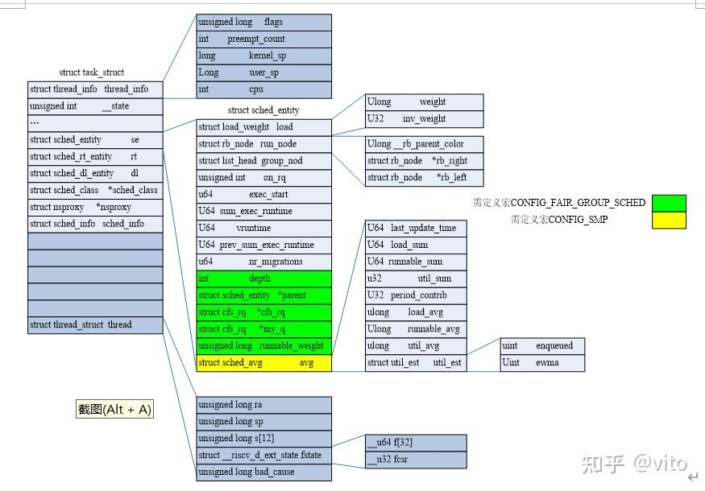

# PELT算法

PELT（Per-Entity Load Tracking）算法​​ 是 Linux 内核调度器（CFS，Completely Fair Scheduler）用于​​任务负载跟踪​​的核心机制，主要用于优化 CPU 调度决策。传统调度器可能以​​整个 CPU 或运行队列​为单位计算负载，这样的计算方式对于cpu调度算法来说不够精准，于是后来引入了 PELT 算法。该算法对负载的跟踪计算以进程线程为单位，对比起原先的模式更加细致。

## 对比起传统负载算法的好处

| 传统负载计算 | PELT 算法 |
| ------ | ------ |
| 采用简单历史平均，响应慢 | ​​指数衰减加权​​，更关注近期负载|
| 粗粒度（整个 CPU/队列）| Per-Entity 粒度​​（每个任务独立计算）|
| 难以适应突发任务 | 快速检测负载变化，提高响应速度 |
| 不适用于节能调度 | 支持 EAS，优化功耗 |
| 多核负载均衡不精确 | 更精准的负载数据，提升多核调度效率 |


## 核心公式

瞬时负载（Li）：表示进程对cpu需要的程度,用于优先级敏感的负载均衡（如CFS的vruntime计算）

$$loadweight\times\big(\cfrac{runnabletime}{1024}\big)$$

* load_weight​​：任务的负载权重，由优先级（nice值）决定。
  * 高优先级任务（如nice=-20）的权重更大，对系统负载的“贡献”更高。
  * 权重值通过查表获得（如内核的sched_prio_to_weight数组）

* runnable_time​​：任务在最近周期（1024微秒）内​​可运行但未实际运行的时间​​（即等待CPU的时间）。

任务优先级越高（load_weight越大）或等待时间越长（runnable_time越大），其负载Li越大。相同的等待时间，优先级越高，li值约大，更需要cpu.

瞬时利用率（Ui）：反映任务实际消耗的CPU算力​，用于 CPU 频率调节（CPUFreq）、能效管理（EAS）

$$MaxCPUcapacity\times\big(\cfrac{runingtime}{1024}\big)$$

* Max_CPU_capacity​​：CPU最大算力，归一化为1024（如手机大核最高频时capacity=1024）。
* running_time​​：任务在最近周期（1024微秒）内​​实际运行的时间​​。

瞬时运行负载（RLi）：反映任务对CPU算力的需求​，用于判断CPU是否过载，触发任务迁移

$$MaxCPUcapacity\times\big(\cfrac{runnabletime}{1024}\big)$$

任务的瞬时负载和瞬时利用率都是一个快速变化的计算量，但是它们并不适合直接调整调度算法，对于调度器来说需要一个保持平滑的变化。例如，在迁移算法中，在上一个1024us窗口中，是满窗运行，瞬时利用率是1024，立刻将任务迁移到大核，下一个窗口，任务有3/4时间在阻塞状态，利用率急速下降，调度器会将其迁移到小核上执行。这样频繁核间调度也容易引起缓存失效等问题。这并不是我们所期望的。

因此这里又引入了求平均值的公式，提供平滑的历史趋势：

load_avg = Σ (Li * y^i)   // 加权负载的衰减和
util_avg = Σ (Ui * y^i)   // 利用率的衰减和
runnable_avg = Σ (RLi * y^i) // 可运行时间的衰减和

在 Linux 调度器中，`load_avg`、`util_avg` 和 `runnable_avg` 这三个 PELT 指标分别用于不同层级的调度决策。

---

**1. `load_avg`（加权负载平均值）**
**作用**
• 表示调度实体（任务或运行队列）的长期加权负载，考虑了任务优先级（`nice` 值）和 CPU 占用时间。  

• 公式：  

  ```
  load_avg = (weight * runnable_time) / time_decay
  ```

  • `weight`：任务优先级权重（如 `nice` 值影响）。  

  • `time_decay`：几何衰减因子（`y^32=0.5`，32ms 前负载贡献减半）。

**触发的调度行为**

1. CFS 负载均衡（CPU 核间任务迁移）  
   • 当不同 CPU 的 `load_avg` 差异超过阈值时，触发负载均衡（`load_balance()`），将任务从高负载 CPU 迁移到低负载 CPU。  

   • 示例：  

     ◦ CPU0 的 `load_avg = 2000`，CPU1 的 `load_avg = 500` → 迁移部分任务到 CPU1。  

2. 任务放置（新任务唤醒时）  
   • 在 `try_to_wake_up()` 中，选择 `load_avg` 最低的 CPU 放置新唤醒的任务（如 `find_idlest_cpu()`）。  

3. 优先级调整（CFS 公平性）  
   • 高 `load_avg` 的任务可能被降低调度优先级（避免独占 CPU）。

---

**2. `util_avg`（CPU 利用率平均值）**
**作用**
• 表示 CPU 的实际使用率（0~1024，或按 CPU 算力缩放），直接反映 CPU 的繁忙程度。  

• 公式：  

  ```
  util_avg = (running_time) / time_decay
  ```
  • 仅统计任务 实际运行时间（不包括就绪未运行的时间）。

**触发的调度行为**
1. CPU 频率调整（DVFS，如 `schedutil` 调速器）  
   • `schedutil` 根据 `util_avg` 动态调整 CPU 频率：  

     ```
     target_freq = (util_avg / max_capacity) * max_freq
     ```
   • 示例：  

     ◦ `util_avg = 800`（`max_capacity=1024`）→ CPU 频率提升至 ~80% 最大频率。  


2. 能效调度（EAS，Energy Aware Scheduling）  
   • 在异构 CPU（如 Arm big.LITTLE）中，选择 `util_avg` 最低的小核运行任务以省电。  


3. 实时任务抢占决策  
   • 高 `util_avg` 的 CPU 可能更快触发实时任务（RT/DL）的抢占。

---

**3. `runnable_avg`（可运行状态平均值）**
**作用**
• 表示调度实体的可运行压力（无论是否实际运行），反映 CPU 就绪队列的竞争强度。  

• 公式：  

  ```
  runnable_avg = (runnable_time) / time_decay
  ```
  • 统计任务在 就绪队列中的时间（包括等待运行的时间）。

**触发的调度行为**

1. CPU 过载检测（Throttling）  
   • 如果 `runnable_avg` 持续高于阈值，可能触发调度限流（如 CFS Bandwidth Control）。  


2. 负载均衡辅助指标  
   • 结合 `load_avg` 判断是否需要迁移任务（高 `runnable_avg` 表示 CPU 竞争激烈）。  


3. 容器/虚拟机资源分配  
   • 在 cgroup 或 K8s 中，`runnable_avg` 用于判断是否需扩容 CPU 配额。

## 常用的结构体

### 计算负载sched_avg



内核用struct sched_avg 来抽象一个 se 或者 cfs rq 的平均调度负载：

```c
struct sched_avg {
	u64				last_update_time;
	u64				load_sum;
	u64				runnable_sum;
	u32				util_sum;
	u32				period_contrib;
	unsigned long			load_avg;
	unsigned long			runnable_avg;
	unsigned long			util_avg;
	unsigned int			util_est;
} ____cacheline_aligned;
```

* last_update_time​​：记录最后一次更新时间，用于计算时间差（delta = now - last_update_time），结合 PELT 公式更新负载。
* ​load_sum / runnable_sum / util_sum​​：这些是 ​​加权累计值​​，用于计算 load_avg、runnable_avg 和 util_avg。PELT 采用 ​​指数衰减加权​​，使得近期负载比历史负载影响更大。
* ​period_contrib​​:处理跨周期的时间计算，确保 PELT 的衰减计算正确（避免时间片跨越多个周期导致误差）。
* util_est​​:用于快速估算利用率（如唤醒任务时），避免实时计算带来的延迟。

## 时间计算

在上面的公式中很多值的计算都用到了时间，这里使用 struct rq 结构体中的 clock 变量用来记录。

### 时钟源

### 归一化处理

对于CPU而言，算力处于比较低的水平的时候，同样的任务量要比高算力状态下花费更多的时间。这样，同样的任务量在不同CPU算力的情况下，PELT会跟踪到不同的结果。为了能达到一致性的评估效果，PELT的时间采用归一化时间，即把执行时间归一化到超大核最高频率上去。

例如：

* CPU 算力降为 50%：delta 缩放为 2 倍（实际耗时更长）
* CPU 频率降为 70%：delta 缩放为 1/0.7≈1.43 倍

_update_idle_rq_clock_pelt：专门处理 idle 状态的 PELT 时钟更新，通常直接同步到 rq_clock_task。
时间增量缩放（Delta Scaling）

delta = cap_scale(delta, arch_scale_cpu_capacity(cpu_of(rq)));
delta = cap_scale(delta, arch_scale_freq_capacity(cpu_of(rq)));

缩放层级：

|缩放类型|               函数 应用场景|
| ------ | ------ |
|CPU 算力缩放 |arch_scale_cpu_capacity() big.LITTLE 架构、CPU hotplug|
|CPU 频率缩放 |arch_scale_freq_capacity() DVFS 调频（如 cpufreq|

数学关系：

  缩放后的 delta 反映 等效于最大算力下的时间：

  $$\text{delta\_scaled} = \text{delta} \times \frac{\text{max\_capacity}}{\text{current\_capacity}} \times \frac{\text{max\_frequency}}{\text{current\_frequency}}$$

clock_pelt 的作用：  

* 作为 PELT 负载跟踪的时间基准，用于计算任务的 util_avg 和 load_avg。缩放后确保：
低算力 CPU 上运行的任务：负载增长更慢（因为 delta 被放大）。

* 高算力 CPU 上运行的任务：负载增长更快（因为 delta 被缩小）。

实际案例假设一个场景：

CPU 当前算力：最大算力的 50%（arch_scale_cpu_capacity() 返回 512，假设最大为 1024）。

CPU 当前频率：最大频率的 80%（arch_scale_freq_capacity() 返回 819，假设最大为 1024）。

实际运行时间（delta）：10ms。

算力缩放：  

$$\text{delta} = 10 \times \frac{1024}{512} = 20 \text{ms}$$
频率缩放：  

$$\text{delta} = 20 \times \frac{1024}{819} ≈ 25 \text{ms}$$

最终效果：

虽然任务实际运行了 10ms，但 PELT 会按 25ms 等效时间 更新负载，反映低算力/频率下的真实负载。

设计意义：

* 跨 CPU 一致性：确保不同算力/频率的 CPU 上，相同任务的负载信号可比。
* DVFS 友好性：频率动态调整时，负载跟踪自动适应。
* 节能与性能平衡：低算力 CPU 的任务负载增长更慢，避免不必要的迁移。

代码实现：

```c
/**
 * update_rq_clock_pelt - 更新运行队列的 PELT 时钟（考虑 CPU 算力和频率变化）
 * @rq:   目标运行队列（runqueue）
 * @delta: 实际经过的物理时间增量（单位：纳秒）
 *
 * 功能：在考虑 CPU 算力（capacity）和频率（frequency）动态变化的情况下，
 *       更新运行队列的 PELT 时钟（clock_pelt），确保负载跟踪（load tracking）
 *       的准确性。
 *
 * 核心逻辑：
 * 1. 若当前 CPU 处于 idle 状态，调用 _update_idle_rq_clock_pelt 特殊处理。
 * 2. 对时间增量 delta 进行两层缩放：
 *    - CPU 算力缩放（arch_scale_cpu_capacity）
 *    - CPU 频率缩放（arch_scale_freq_capacity）
 * 3. 将缩放后的时间累加到 rq->clock_pelt。
 */
static inline void update_rq_clock_pelt(struct rq *rq, s64 delta)
{
    /* 1. 处理 idle 状态：跳过常规缩放逻辑 */
    if (unlikely(is_idle_task(rq->curr))) {
        _update_idle_rq_clock_pelt(rq);// 专门处理 idle 状态的 PELT 时钟更新，通常直接同步到 rq_clock_task。
        return;
    }

    /*
     * 2. 时间增量缩放说明：
     * --------------------------------------------
     * 当 CPU 运行在低于最大算力（max capacity）的状态时，
     * 完成相同工作量需要更长时间。为保证负载跟踪的准确性，
     * 需对 delta 进行缩放，反映实际完成的工作量。
     *
     * 例如：
     * - CPU 算力降为 50%：delta 缩放为 2 倍（实际耗时更长）
     * - CPU 频率降为 70%：delta 缩放为 1/0.7≈1.43 倍
     *
     * 这种缩放确保 PELT 负载信号在不同算力/频率下具有可比性。
     */

    /* 2.1 CPU 算力缩放（考虑 big.LITTLE 架构或 CPU hotplug） */
    delta = cap_scale(delta, arch_scale_cpu_capacity(cpu_of(rq)));

    /* 2.2 CPU 频率缩放（考虑 DVFS 调频） */
    delta = cap_scale(delta, arch_scale_freq_capacity(cpu_of(rq)));

    /* 3. 更新 PELT 时钟 */
    rq->clock_pelt += delta;
}
```

### 计算 runnable_time 和 running_time

通过 PELT 时钟计算任务的 runnable_time 和 running_time：

|任务状态| 时间增量归属| 更新逻辑 |
| ------ | ------ | ------ |
| ​正在运行​​ |running_time|任务在 CPU 上执行时，物理时间直接计入 running_time。|
| 可运行 |runnable_time| 任务在运行队列中等待时，时间计入 runnable_time（通过 update_rq_clock_pelt 间接统计）。|
|​​阻塞/睡眠​|无（不统计）|时间不归属任何任务，但可能触发 util_avg 的衰减。|

```c
static s64 update_curr_se(struct rq *rq, struct sched_entity *curr)
{
	u64 now = rq_clock_task(rq);
	s64 delta_exec;

	delta_exec = now - curr->exec_start;
	if (unlikely(delta_exec <= 0))
		return delta_exec;

	curr->exec_start = now;
	curr->sum_exec_runtime += delta_exec;

	if (schedstat_enabled()) {
		struct sched_statistics *stats;

		stats = __schedstats_from_se(curr);
		__schedstat_set(stats->exec_max,
				max(delta_exec, stats->exec_max));
	}

	return delta_exec;
}
```

## 计算负载

## PELT 如何影响 CFS 调度决策​

### 动态调整任务权重

场景：任务优先级（nice 值）或 CGroup 的 cpu.shares 被修改时。  

PELT 通过 calc_group_shares() 基于 load_avg 动态调整任务组的权重。  

调用 reweight_entity() 更新任务的 vruntime 和 deadline，保持公平性。  

代码路径：  

> reweight_task_fair() -> calc_group_shares() -> reweight_entity() -> reweight_eevdf()

### 唤醒任务时的补偿

场景：任务从睡眠状态唤醒时。  

PELT 根据 runnable_avg（反映历史活跃性）决定是否补偿 vruntime。  

避免长时间睡眠的任务因 vruntime 过小而垄断 CPU。  

公式：  

    if (se->avg.runnable_avg < sysctl_sched_min_granularity)
      vruntime -= compensation;  // 补偿滞后量

### 时间片分配

场景：CFS 分配任务的时间片（time slice）。  

PELT 参与时间片长度与任务权重成正比，权重由 load_avg 间接影响。  

公式：

$$\text{slice} = \frac{\text{schedperiod} \times \text{weight}}{\text{总权重}}$$
代码路径：

> sched_slice() -> calc_delta_fair()
  