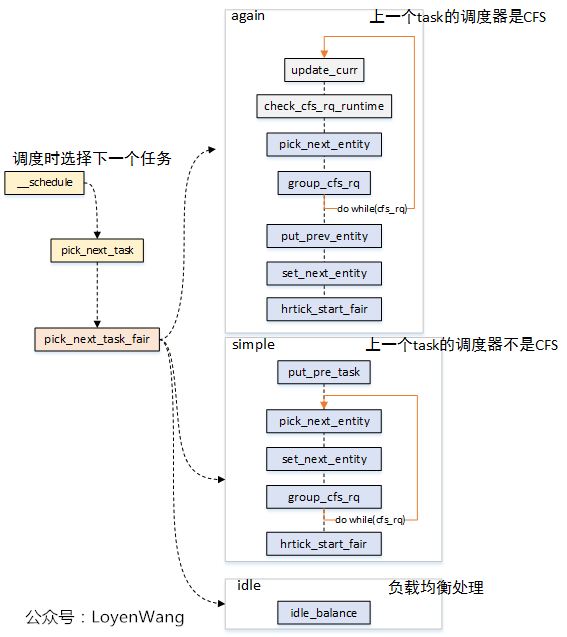

# PELT算法

PELT（Per-Entity Load Tracking）算法​​ 是 Linux 内核调度器（CFS，Completely Fair Scheduler）用于​​任务负载跟踪​​的核心机制，主要用于优化 CPU 调度决策。传统调度器可能以​​整个 CPU 或运行队列​为单位计算负载，这样的计算方式对于cpu调度算法来说不够精准，于是后来引入了 PELT 算法。该算法对负载的跟踪计算以进程线程为单位，对比起原先的模式更加细致。

## 对比起传统负载算法的好处

| 传统负载计算 | PELT 算法 |
| ------ | ------ |
| 采用简单历史平均，响应慢 | ​​指数衰减加权​​，更关注近期负载|
| 粗粒度（整个 CPU/队列）| Per-Entity 粒度​​（每个任务独立计算）|
| 难以适应突发任务 | 快速检测负载变化，提高响应速度 |
| 不适用于节能调度 | 支持 EAS，优化功耗 |
| 多核负载均衡不精确 | 更精准的负载数据，提升多核调度效率 |


## 核心公式

瞬时负载（Li）：表示进程对cpu需要的程度,用于优先级敏感的负载均衡（如CFS的vruntime计算）

$$loadweight\times\big(\cfrac{runnabletime}{1024}\big)$$

* load_weight​​：任务的负载权重，由优先级（nice值）决定。
  * 高优先级任务（如nice=-20）的权重更大，对系统负载的“贡献”更高。
  * 权重值通过查表获得（如内核的sched_prio_to_weight数组）

* runnable_time​​：任务在最近周期（1024微秒）内​​可运行但未实际运行的时间​​（即等待CPU的时间）。

任务优先级越高（load_weight越大）或等待时间越长（runnable_time越大），其负载Li越大。相同的等待时间，优先级越高，li值约大，更需要cpu.

瞬时利用率（Ui）：反映任务实际消耗的CPU算力​，用于 CPU 频率调节（CPUFreq）、能效管理（EAS）

$$MaxCPUcapacity\times\big(\cfrac{runingtime}{1024}\big)$$

* Max_CPU_capacity​​：CPU最大算力，归一化为1024（如手机大核最高频时capacity=1024）。
* running_time​​：任务在最近周期（1024微秒）内​​实际运行的时间​​。

瞬时运行负载（RLi）：反映任务对CPU算力的需求​，用于判断CPU是否过载，触发任务迁移

$$MaxCPUcapacity\times\big(\cfrac{runnabletime}{1024}\big)$$

任务的瞬时负载和瞬时利用率都是一个快速变化的计算量，但是它们并不适合直接调整调度算法，对于调度器来说需要一个保持平滑的变化。例如，在迁移算法中，在上一个1024us窗口中，是满窗运行，瞬时利用率是1024，立刻将任务迁移到大核，下一个窗口，任务有3/4时间在阻塞状态，利用率急速下降，调度器会将其迁移到小核上执行。这样频繁核间调度也容易引起缓存失效等问题。这并不是我们所期望的。因此这里又引入公式：


## 常用的结构体


### 计算负载sched_avg


内核用struct sched_avg 来抽象一个 se 或者 cfs rq 的平均调度负载：

```c
struct sched_avg {
	u64				last_update_time;
	u64				load_sum;
	u64				runnable_sum;
	u32				util_sum;
	u32				period_contrib;
	unsigned long			load_avg;
	unsigned long			runnable_avg;
	unsigned long			util_avg;
	unsigned int			util_est;
} ____cacheline_aligned;
```

* last_update_time​​：记录最后一次更新时间，用于计算时间差（delta = now - last_update_time），结合 PELT 公式更新负载。
* ​load_sum / runnable_sum / util_sum​​：这些是 ​​加权累计值​​，用于计算 load_avg、runnable_avg 和 util_avg。PELT 采用 ​​指数衰减加权​​，使得近期负载比历史负载影响更大。
* ​period_contrib​​:处理跨周期的时间计算，确保 PELT 的衰减计算正确（避免时间片跨越多个周期导致误差）。
* load_avg：平均负载。load_avg = runnable% * scale_load_down(load)
* runnable_avg：平均可运行时间。runnable_avg = runnable% * SCHED_CAPACITY_SCALE
* util_avg​​: ​最重要的字段之一​​，表示任务的 CPU 利用率（范围 0~1024）。例如 util_avg = 512 表示任务平均占用 ​​50% 的单个 CPU​​。
  util_avg = running% * SCHED_CAPACITY_SCALE
* util_est​​:用于快速估算利用率（如唤醒任务时），避免实时计算带来的延迟。

### task_group

```c
struct task_group {
	struct cgroup_subsys_state css; // cgroup 子系统状态

#ifdef CONFIG_GROUP_SCHED_WEIGHT
	/* 一个正值表示这是一个 SCHED_IDLE 组 */
	int			idle; // 表示任务组是否为 SCHED_IDLE 组
#endif

#ifdef CONFIG_FAIR_GROUP_SCHED
	/* 此组在每个 CPU 上的可调度实体 */
	struct sched_entity	**se;
	/* 此组在每个 CPU 上“拥有”的运行队列 */
	struct cfs_rq		**cfs_rq;
	unsigned long		shares; // 任务组的权重
#ifdef	CONFIG_SMP
	/*
	 * load_avg 在时钟滴答时间可能会被大量争用，
	 * 因此将其放在自己的缓存行中，与上面的字段分开，
	 * 这些字段也将在每个滴答时访问。
	 */
	atomic_long_t		load_avg ____cacheline_aligned; // 任务组的平均负载
#endif
#endif

#ifdef CONFIG_RT_GROUP_SCHED
	struct sched_rt_entity	**rt_se; // 实时调度实体
	struct rt_rq		**rt_rq; // 实时运行队列

	struct rt_bandwidth	rt_bandwidth; // 实时带宽
#endif

#ifdef CONFIG_EXT_GROUP_SCHED
	u32			scx_flags;	/* SCX_TG_* 标志 */
	u32			scx_weight;	/* SCX 权重 */
#endif

	struct rcu_head		rcu; // RCU 头
	struct list_head	list; // 任务组列表

	struct task_group	*parent; // 父任务组
	struct list_head	siblings; // 兄弟任务组
	struct list_head	children; // 子任务组

#ifdef CONFIG_SCHED_AUTOGROUP
	struct autogroup	*autogroup; // 自动任务组
#endif

	struct cfs_bandwidth	cfs_bandwidth; // CFS 带宽

#ifdef CONFIG_UCLAMP_TASK_GROUP
	/* 用户空间请求的两位小数精度的 [%] 值 */
	unsigned int		uclamp_pct[UCLAMP_CNT]; // 用户空间请求的利用率限制百分比
	/* 为任务组请求的限制值 */
	struct uclamp_se	uclamp_req[UCLAMP_CNT]; // 任务组的请求限制值
	/* 任务组使用的有效限制值 */
	struct uclamp_se	uclamp[UCLAMP_CNT]; // 任务组的有效限制值
#endif

};
```

task_group 中依赖 se 成员来联系到一个调度实体，又通过 se 来连接到 cfs_rq 与 rq。

### struct sched_entity

sched_entity 用来描述一个调度实例:

```c
struct sched_entity {
	/* 用于负载均衡: */
	struct load_weight		load;           // 负载权重
	struct rb_node			run_node;       // 红黑树节点
	u64				deadline;       // 截止时间
	u64				min_vruntime;   // 最小虚拟运行时间
	u64				min_slice;      // 最小时间片

	struct list_head		group_node;     // 组节点
	unsigned char			on_rq;          // 是否在运行队列中
	unsigned char			sched_delayed;  // 调度是否延迟
	unsigned char			rel_deadline;   // 相对截止时间
	unsigned char			custom_slice;   // 自定义时间片
					/* hole */

	u64				exec_start;     // 执行开始时间
	u64				sum_exec_runtime; // 总执行时间
	u64				prev_sum_exec_runtime; // 上一次总执行时间
	u64				vruntime;       // 虚拟运行时间
	s64				vlag;           // 虚拟滞后
	u64				slice;          // 时间片

	u64				nr_migrations;  // 迁移次数

#ifdef CONFIG_FAIR_GROUP_SCHED
	int				depth;          // 调度实体的深度
	struct sched_entity		*parent;        // 父调度实体
	/* 调度实体所在的运行队列: */
	struct cfs_rq			*cfs_rq;        // 关联的CFS运行队列
	/* 调度实体拥有的运行队列: */
	struct cfs_rq			*my_q;          // 自己的CFS运行队列
	/* my_q->h_nr_running的缓存值 */
	unsigned long			runnable_weight; // 可运行权重
#endif

#ifdef CONFIG_SMP
	/*
	 * 每个调度实体的负载平均值跟踪。
	 *
	 * 放入单独的缓存行以避免与上面的只读值冲突。
	 */
	struct sched_avg		avg;            // 平均负载
#endif
};

```


### struct cfs_rq

用于记录多个层级间



### rq

```c
struct rq {
	......
	/* 调度相关 */
	struct cfs_rq		cfs; // 完全公平调度类
	struct rt_rq		rt; // 实时调度类
	struct dl_rq		dl; // 截止期调度类
#ifdef CONFIG_SCHED_CLASS_EXT
	struct scx_rq		scx; // 扩展调度类
#endif
}
```

一个 cpu 对应一个 rq ，在一个 rq 结构体中又记录了不同调度类的根调度层级


设置权重：

```
sched_fork set_load_weight 
```

```c
void set_load_weight(struct task_struct *p, bool update_load)
{
	// 获取任务的优先级，静态优先级减去实时优先级的最大值
	int prio = p->static_prio - MAX_RT_PRIO;
	struct load_weight lw;

	// 如果任务具有空闲策略
	if (task_has_idle_policy(p)) {
		// 设置权重为空闲优先级的权重
		lw.weight = scale_load(WEIGHT_IDLEPRIO);
		// 设置反权重为空闲优先级的反权重
		lw.inv_weight = WMULT_IDLEPRIO;
	} else {
		// 根据优先级设置权重和反权重
		lw.weight = scale_load(sched_prio_to_weight[prio]);
		lw.inv_weight = sched_prio_to_wmult[prio];
	}

	/*
	 * 如果需要更新负载，并且调度类支持重新设置任务权重，
	 * 则调用调度类的 reweight_task 方法更新任务的负载。
	 * 否则，直接设置任务的负载权重。
	 */
	if (update_load && p->sched_class->reweight_task)
		p->sched_class->reweight_task(task_rq(p), p, &lw);
	else
		p->se.load = lw;
}
```