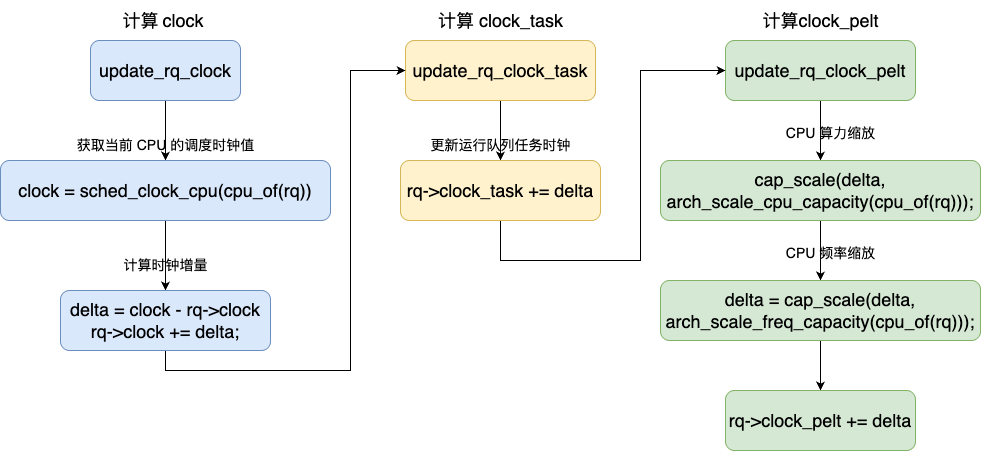

# PELT算法

PELT（Per-Entity Load Tracking）算法​​ 是 Linux 内核调度器（CFS，Completely Fair Scheduler）用于​​任务负载跟踪​​的核心机制，主要用于优化 CPU 调度决策。传统调度器可能以​​整个 CPU 或运行队列​为单位计算负载，这样的计算方式对于cpu调度算法来说不够精准，于是后来引入了 PELT 算法。该算法对负载的跟踪计算以进程线程为单位，对比起原先的模式更加细致。

## 对比起传统负载算法的好处

| 传统负载计算 | PELT 算法 |
| ------ | ------ |
| 采用简单历史平均，响应慢 | ​​指数衰减加权​​，更关注近期负载|
| 粗粒度（整个 CPU/队列）| Per-Entity 粒度​​（每个任务独立计算）|
| 难以适应突发任务 | 快速检测负载变化，提高响应速度 |
| 不适用于节能调度 | 支持 EAS，优化功耗 |
| 多核负载均衡不精确 | 更精准的负载数据，提升多核调度效率 |

## 核心公式

瞬时负载（Li）：表示进程对cpu需要的程度,用于优先级敏感的负载均衡（如CFS的vruntime计算）

$$loadweight\times\big(\cfrac{runnabletime}{1024}\big)$$

* load_weight​​：任务的负载权重，由优先级（nice值）决定。
  * 高优先级任务（如nice=-20）的权重更大，对系统负载的“贡献”更高。
  * 权重值通过查表获得（如内核的sched_prio_to_weight数组）

* runnable_time​​：任务在最近周期（1024微秒）内​​可运行但未实际运行的时间​​（即等待CPU的时间）。

任务优先级越高（load_weight越大）或等待时间越长（runnable_time越大），其负载Li越大。相同的等待时间，优先级越高，li值约大，更需要cpu.

瞬时利用率（Ui）：反映任务实际消耗的CPU算力​，用于 CPU 频率调节（CPUFreq）、能效管理（EAS）

$$MaxCPUcapacity\times\big(\cfrac{runingtime}{1024}\big)$$

* Max_CPU_capacity​​：CPU最大算力，归一化为1024（如手机大核最高频时capacity=1024）。

  CPU capacity 原始定义：Linux 内核中，每个 CPU 会有一个 capacity 值，表示其最大计算能力，存储在 cpu_capacity_orig 或 capacity_orig_of(cpu) 中。它通常按以下方式归一化：
  
  将最强的 big 核设为 基准（通常为 1024）其他核的 capacity 以此为参考进行线性缩放
  
  | 核类型      | 原始频率    | 归一化 `capacity_orig` |
  | -------- | ------- | ------------------- |
  | big 核    | 2.4 GHz | 1024                |
  | little 核 | 1.2 GHz | 512                 |
  
  这意味着在同样的 runningtime 下，big 核的执行能力是 little 核的两倍。

* running_time​​：任务在最近周期（1024微秒）内​​实际运行的时间​​。

瞬时运行负载（RLi）：反映任务对CPU算力的需求​，用于判断CPU是否过载，触发任务迁移

$$MaxCPUcapacity\times\big(\cfrac{runnabletime}{1024}\big)$$

任务的瞬时负载和瞬时利用率都是一个快速变化的计算量，但是它们并不适合直接调整调度算法，对于调度器来说需要一个保持平滑的变化。例如，在迁移算法中，在上一个1024us窗口中，是满窗运行，瞬时利用率是1024，立刻将任务迁移到大核，下一个窗口，任务有3/4时间在阻塞状态，利用率急速下降，调度器会将其迁移到小核上执行。这样频繁核间调度也容易引起缓存失效等问题。这并不是我们所期望的。

因此这里又引入了求平均值的公式，提供平滑的历史趋势：

load_avg = Σ (Li * y^i)   // 加权负载的衰减和
util_avg = Σ (Ui * y^i)   // 利用率的衰减和
runnable_avg = Σ (RLi * y^i) // 可运行时间的衰减和

在 Linux 调度器中，`load_avg`、`util_avg` 和 `runnable_avg` 这三个 PELT 指标分别用于不同层级的调度决策。

## 常用的结构体

### 计算负载sched_avg


内核用struct sched_avg 来抽象一个 se 或者 cfs rq 的平均调度负载：

```c
struct sched_avg {
	u64				last_update_time;
	u64				load_sum;
	u64				runnable_sum;
	u32				util_sum;
	u32				period_contrib;
	unsigned long			load_avg;
	unsigned long			runnable_avg;
	unsigned long			util_avg;
	unsigned int			util_est;
} ____cacheline_aligned;
```

* last_update_time​​：记录最后一次更新时间，用于计算时间差（delta = now - last_update_time），结合 PELT 公式更新负载。
* ​load_sum / runnable_sum / util_sum​​：这些是 ​​加权累计值​​，用于计算 load_avg、runnable_avg 和 util_avg。PELT 采用 ​​指数衰减加权​​，使得近期负载比历史负载影响更大。
* ​period_contrib​​:处理跨周期的时间计算，确保 PELT 的衰减计算正确（避免时间片跨越多个周期导致误差）。
* util_est​​:用于快速估算利用率（如唤醒任务时），避免实时计算带来的延迟。

## 计算负载

在 PELT 算法中对于负载的计算中，时间被划分为固定长度的周期,每个周期为 1024 微秒。每个周期内的负载贡献会被记录，并随着时间的推移逐渐衰减。

历史负载贡献可以表示为一个几何级数：

u_0 + u_1*y + u_2*y^2 + u_3*y^3 + ...

* u_i 表示调度实体在第 i 个时间段内的负载贡献。
* y 是指数衰减因子，满足 y^32 ≈ 0.5，即 32 毫秒前的负载贡献会减半。

较新的负载贡献权重更高，而较旧的贡献逐渐衰减。

例如：
* 当前周期的贡献 (u_0) 权重为 1。
* 1 毫秒前的贡献 (u_1) 权重为 y。
* 2 毫秒前的贡献 (u_2) 权重为 y^2。

load_avg = u_0` + y*(u_0 + u_1*y + u_2*y^2 + ...)

### 初始化load avg

Load avg的初始化分成两个阶段，第一个阶段在创建sched entity的时候（对于task se而言就是在fork的时候，对于group se而言，发生在创建cgroup的时候），调用init_entity_runnable_average函数完成初始化，第二个阶段在唤醒这个新创建se的时候，可以参考post_init_entity_util_avg函数的实现。Group se不可能被唤醒，因此第二阶段的se初始化仅仅适用于task se。

在第一阶段初始化的时候，sched_avg对象的各个成员初始化为0是常规操作，不过task se的load avg初始化为最大负载值，即初始化为se的load weight。随着任务的运行，其load avg会慢慢逼近其真实的负载情况。对于group se而言，其load avg等于0，表示没有任何se附着在该group se上。

一个新建任务的util avg设置为0是不合适的，其设定值应该和该task se挂入的cfs队列的负载状况以及CPU算力相关，但是在创建task se的时候，我们根本不知道它会挂入哪一个cfs rq，因此在唤醒一个新创建的任务的时候，我们会进行第二阶段的初始化。具体新建任务的util avg的初始化公式如下：

util_avg = cfs_rq->util_avg / (cfs_rq->load_avg + 1) * se.load.weight

当然，如果cfs rq的util avg等于0，那么任务初始化的util avg也就是0了，这样不合理，这时候任务的util avg被初始化为cpu算力的一半。

完成了新建task se的负载和利用率的初始化之后，我们还会调用attach_entity_cfs_rq函数把这个task se挂入cfs---se的层级结构。虽然这里仅仅是给PELT大厦增加一个task se节点，但是整个PELT hierarchy都需要感知到这个新增的se带来的负载和利用率的变化。因此，除了把该task se的load avg加到cfs的load avg中，还需要把这个新增的负载沿着cfs---se的层级结构向上传播。类似的，这个新增负载也需要加入到task group中。具体请参考attach_entity_cfs_rq函数的实现。

### 更新负载

负载更新的入口点函数为 update_load_avg。在该函数中主要做了以下这几步。

1. 更新本层级的 sched_entity 负载（__update_load_avg_se）​
2. 更新该 se 所属的 cfs_rq 负载（update_cfs_rq_load_avg）
3. 如果是 group se，处理向上传播的负载（仅在结构性变化时）​​
4. 更新任务组（task_group）的负载（update_tg_load_avg）​​

```c
/* 更新任务及其 cfs_rq 的负载平均值 */
static inline void update_load_avg(struct cfs_rq *cfs_rq, struct sched_entity *se, int flags)
{
	u64 now = cfs_rq_clock_pelt(cfs_rq); // 获取当前时间
	int decayed;

	/*
	 * 跟踪任务的负载平均值，以便在迁移后将其携带到新 CPU，
	 * 并跟踪组调度实体的负载平均值，以便在迁移中计算 task_h_load。
	 */
	if (se->avg.last_update_time && !(flags & SKIP_AGE_LOAD))
		__update_load_avg_se(now, cfs_rq, se); // 更新调度实体的负载平均值

	decayed  = update_cfs_rq_load_avg(now, cfs_rq); // 更新 cfs_rq 的负载平均值
	decayed |= propagate_entity_load_avg(se); // 传播调度实体的负载平均值

	if (!se->avg.last_update_time && (flags & DO_ATTACH)) {
		/*
		 * DO_ATTACH 表示我们从 enqueue_entity() 调用此函数。
		 * !last_update_time 表示我们已经通过 migrate_task_rq_fair()，
		 * 这表明任务已迁移。
		 *
		 * 换句话说，我们正在将任务加入到新 CPU。
		 */
		attach_entity_load_avg(cfs_rq, se); // 将调度实体的负载平均值附加到 cfs_rq
		update_tg_load_avg(cfs_rq); // 更新任务组的负载平均值

	} else if (flags & DO_DETACH) {
		/*
		 * DO_DETACH 表示我们从 dequeue_entity() 调用此函数，
		 * 并且我们正在将任务从 CPU 中迁移出去。
		 */
		detach_entity_load_avg(cfs_rq, se); // 从 cfs_rq 中分离调度实体的负载平均值
		update_tg_load_avg(cfs_rq); // 更新任务组的负载平均值
	} else if (decayed) {
		cfs_rq_util_change(cfs_rq, 0); // 通知 cfs_rq 的负载发生变化

		if (flags & UPDATE_TG)
			update_tg_load_avg(cfs_rq); // 更新任务组的负载平均值
	}
}
```

**触发负载计算的时机**


**计算单个任务的负载**


accumulate_sum 是负载计算的核心，在该函数中会先对历史的负载进行衰减，再对当前的的负载进行计算。

```c
static __always_inline u32
accumulate_sum(u64 delta, struct sched_avg *sa,
		   unsigned long load, unsigned long runnable, int running)
{
	u32 contrib = (u32)delta; /* p == 0 -> delta < 1024 */
	u64 periods;

	delta += sa->period_contrib;
	periods = delta / 1024; /* 一个周期为 1024 微秒（约 1 毫秒） */

	if (periods) {
		// 计算旧周期的衰减（历史的负载）
		sa->load_sum = decay_load(sa->load_sum, periods);
		sa->runnable_sum =
			decay_load(sa->runnable_sum, periods);
		sa->util_sum = decay_load((u64)(sa->util_sum), periods);

		// 计算当前运行时间的负载
		delta %= 1024;// d3
		if (load) {
			/*
			 * 依赖于以下条件：
			 *
			 * if (!load)
			 *	runnable = running = 0;
			 *
			 * 来自 ___update_load_sum() 的条件会导致
			 * 下方对 @contrib 的使用完全消失，因此无需计算。
			 */
			contrib = __accumulate_pelt_segments(periods,
					1024 - sa->period_contrib, delta);// 先计算完整的周期，
		}
	}
	sa->period_contrib = delta;

	if (load)
		sa->load_sum += load * contrib;
	if (runnable)// 任务是否可以运行
		sa->runnable_sum += runnable * contrib << SCHED_CAPACITY_SHIFT;
	if (running)// 任务是否在运行中
		sa->util_sum += contrib << SCHED_CAPACITY_SHIFT;

	return periods;
}
```

在这里的计算中我们将任务当前的运行的时间段划分为3段，分别是上个的不完整的周期 d3 ，完整的历史周期 d2 ，和当前不完整的周期。


```c
/*
 * 累积 PELT 段的贡献值
 *
 * @periods: 跨越的周期数
 * @d1: 上一个周期的剩余部分
 * @d3: 当前周期的剩余部分
 *
 * 返回累积的贡献值
 */
static u32 __accumulate_pelt_segments(u64 periods, u32 d1, u32 d3)
{
	u32 c1, c2, c3 = d3; /* y^0 == 1 */

	/*
	 * c1 = d1 y^p
	 * 计算d1上一个周期剩余部分的贡献值，并进行衰减
	 */
	c1 = decay_load((u64)d1, periods);

	/*
	 *            p-1
	 * c2 = 1024 \Sum y^n
	 *            n=1
	 *
	 *              inf        inf
	 *    = 1024 ( \Sum y^n - \Sum y^n - y^0 )
	 *              n=0        n=p
	 *
	 * 计算d2完整周期的贡献值，使用预定义的最大值减去衰减后的值
	 */
	c2 = LOAD_AVG_MAX - decay_load(LOAD_AVG_MAX, periods) - 1024;

	/*
	 * d3是最新的负载贡献，不需要进行衰减
	 */
	return c1 + c2 + c3;
}
```

**更新调度组的负载**

在更新单个任务的负载时，如果该任务不再根cfs组，那么在更新完任务的负载后也会更新父调度组的load。这里的更新通过函数 update_tg_load_avg 来实现。

但是这里如果存在多层级的 cfs_rq 即:

```c
​​task_se → group_B_cfs_rq → group_B_se → group_A_cfs_rq → group_A_se → root_cfs_rq
```
1. 隐式递归聚合​（tick 场景）

	此时 ​​task_se 的改变只会影响上一层级的 group_B_cfs_rq 对应的负载。在更新了 group_B_cfs_rq 对应的负载后同时也会更新 group_B_cfs_rq 对应的权重。在下次有和 group_B_cfs_rq 同一层级的任务负载发生变化时会触发计算 group_A_cfs_rq 的负载，之后也会更新 group_A_cfs_rq 对应的权重。
	
	这样做的好处是
   * ​避免高频跨层更新​​：若每次子级变化都触发父级更新，在深层次结构中会导致大量冗余计算（如 100 个任务触发 100 次根 cfs_rq 更新）。
	* ​批量处理​​：通过等待同级更新或 Tick 事件，将多次子级变化合并到一次父级更新中。

2. 显式传播（非 tick 场景）
   
   cfs---se层级结构有了调度实体的变化（新增或者移除），那么需要处理向上传播的负载。

## 时间计算

在上面的公式中很多值的计算都用到了时间，这里使用 struct rq 结构体中的 clock 变量用来记录。

```c
u64			clock; // 当前时钟
u64			clock_task; // 任务时钟
u64			clock_pelt; // PELT 空闲时钟
```

sched_avg 结构体中的 last_update_time 成员就来自于 rq 中记录的时间。

```c
/**
 * rq_clock_pelt - 获取 rq 的 PELT 时钟值
 * @rq: 指向运行队列 (runqueue) 的指针
 *
 * 此函数返回 rq 的 PELT 时钟值，减去丢失的空闲时间。
 * 在调用此函数之前，必须确保运行队列已被锁定，并且时钟已更新。
 *
 * 返回值:
 * rq 的 PELT 时钟值，减去丢失的空闲时间。
 */
static inline u64 rq_clock_pelt(struct rq *rq)
{
	lockdep_assert_rq_held(rq); // 确保运行队列已被锁定
	assert_clock_updated(rq);  // 确保时钟已更新

	return rq->clock_pelt - rq->lost_idle_time; // 返回调整后的 PELT 时钟值
}
```



### update_rq_clock_pelt 归一化处理

对于CPU而言，算力处于比较低的水平的时候，同样的任务量要比高算力状态下花费更多的时间。这样，同样的任务量在不同CPU算力的情况下，PELT会跟踪到不同的结果。为了能达到一致性的评估效果，PELT的时间采用归一化时间，即把执行时间归一化到超大核最高频率上去。

例如：

* CPU 算力降为 50%：delta 缩放为 2 倍（实际耗时更长）
* CPU 频率降为 70%：delta 缩放为 1/0.7≈1.43 倍

_update_idle_rq_clock_pelt：专门处理 idle 状态的 PELT 时钟更新，通常直接同步到 rq_clock_task。
时间增量缩放（Delta Scaling）

delta = cap_scale(delta, arch_scale_cpu_capacity(cpu_of(rq)));
delta = cap_scale(delta, arch_scale_freq_capacity(cpu_of(rq)));

缩放层级：

|缩放类型|               函数 应用场景|
| ------ | ------ |
|CPU 算力缩放 |arch_scale_cpu_capacity() big.LITTLE 架构、CPU hotplug|
|CPU 频率缩放 |arch_scale_freq_capacity() DVFS 调频（如 cpufreq|

数学关系：

  缩放后的 delta 反映 等效于最大算力下的时间：

  $$\text{delta\_scaled} = \text{delta} \times \frac{\text{max\_capacity}}{\text{current\_capacity}} \times \frac{\text{max\_frequency}}{\text{current\_frequency}}$$

clock_pelt 的作用：  

* 作为 PELT 负载跟踪的时间基准，用于计算任务的 util_avg 和 load_avg。缩放后确保：
低算力 CPU 上运行的任务：负载增长更慢（因为 delta 被放大）。

* 高算力 CPU 上运行的任务：负载增长更快（因为 delta 被缩小）。

实际案例假设一个场景：

CPU 当前算力：最大算力的 50%（arch_scale_cpu_capacity() 返回 512，假设最大为 1024）。

CPU 当前频率：最大频率的 80%（arch_scale_freq_capacity() 返回 819，假设最大为 1024）。

实际运行时间（delta）：10ms。

算力缩放：  

$$\text{delta} = 10 \times \frac{1024}{512} = 20 \text{ms}$$
频率缩放：  

$$\text{delta} = 20 \times \frac{1024}{819} ≈ 25 \text{ms}$$

最终效果：

虽然任务实际运行了 10ms，但 PELT 会按 25ms 等效时间 更新负载，反映低算力/频率下的真实负载。

设计意义：

* 跨 CPU 一致性：确保不同算力/频率的 CPU 上，相同任务的负载信号可比。
* DVFS 友好性：频率动态调整时，负载跟踪自动适应。
* 节能与性能平衡：低算力 CPU 的任务负载增长更慢，避免不必要的迁移。

代码实现：

```c
/**
 * update_rq_clock_pelt - 更新运行队列的 PELT 时钟（考虑 CPU 算力和频率变化）
 * @rq:   目标运行队列（runqueue）
 * @delta: 实际经过的物理时间增量（单位：纳秒）
 *
 * 功能：在考虑 CPU 算力（capacity）和频率（frequency）动态变化的情况下，
 *       更新运行队列的 PELT 时钟（clock_pelt），确保负载跟踪（load tracking）
 *       的准确性。
 *
 * 核心逻辑：
 * 1. 若当前 CPU 处于 idle 状态，调用 _update_idle_rq_clock_pelt 特殊处理。
 * 2. 对时间增量 delta 进行两层缩放：
 *    - CPU 算力缩放（arch_scale_cpu_capacity）
 *    - CPU 频率缩放（arch_scale_freq_capacity）
 * 3. 将缩放后的时间累加到 rq->clock_pelt。
 */
static inline void update_rq_clock_pelt(struct rq *rq, s64 delta)
{
    /* 1. 处理 idle 状态：跳过常规缩放逻辑 */
    if (unlikely(is_idle_task(rq->curr))) {
        _update_idle_rq_clock_pelt(rq);// 专门处理 idle 状态的 PELT 时钟更新，通常直接同步到 rq_clock_task。
        return;
    }

    /*
     * 2. 时间增量缩放说明：
     * --------------------------------------------
     * 当 CPU 运行在低于最大算力（max capacity）的状态时，
     * 完成相同工作量需要更长时间。为保证负载跟踪的准确性，
     * 需对 delta 进行缩放，反映实际完成的工作量。
     *
     * 例如：
     * - CPU 算力降为 50%：delta 缩放为 2 倍（实际耗时更长）
     * - CPU 频率降为 70%：delta 缩放为 1/0.7≈1.43 倍
     *
     * 这种缩放确保 PELT 负载信号在不同算力/频率下具有可比性。
     */

    /* 2.1 CPU 算力缩放（考虑 big.LITTLE 架构或 CPU hotplug） */
    delta = cap_scale(delta, arch_scale_cpu_capacity(cpu_of(rq)));

    /* 2.2 CPU 频率缩放（考虑 DVFS 调频） */
    delta = cap_scale(delta, arch_scale_freq_capacity(cpu_of(rq)));

    /* 3. 更新 PELT 时钟 */
    rq->clock_pelt += delta;
}
```

### 计算 runnable_time 和 running_time

通过 PELT 时钟计算任务的 runnable_time 和 running_time：

|任务状态| 时间增量归属| 更新逻辑 |
| ------ | ------ | ------ |
| ​正在运行​​ |running_time|任务在 CPU 上执行时，物理时间直接计入 running_time。|
| 可运行 |runnable_time| 任务在运行队列中等待时，时间计入 runnable_time（通过 update_rq_clock_pelt 间接统计）。|
|​​阻塞/睡眠​|无（不统计）|时间不归属任何任务，但可能触发 util_avg 的衰减。|

```c
static s64 update_curr_se(struct rq *rq, struct sched_entity *curr)
{
	u64 now = rq_clock_task(rq);
	s64 delta_exec;

	delta_exec = now - curr->exec_start;
	if (unlikely(delta_exec <= 0))
		return delta_exec;

	curr->exec_start = now;
	curr->sum_exec_runtime += delta_exec;

	if (schedstat_enabled()) {
		struct sched_statistics *stats;

		stats = __schedstats_from_se(curr);
		__schedstat_set(stats->exec_max,
				max(delta_exec, stats->exec_max));
	}

	return delta_exec;
}
```

## PELT 如何影响 CFS 调度决策​

### 动态调整任务权重

场景：任务优先级（nice 值）或 CGroup 的 cpu.shares 被修改时。  

PELT 通过 calc_group_shares() 基于 load_avg 动态调整任务组的权重。  

当任务组的 load_avg 更新后（通过 update_tg_load_avg），​​必须调用 update_cfs_group 重新计算其 group_se 的权重​​。

这里以 enqueue_entity 为例：

```c
// enqueue_entity
    update_load_avg(cfs_rq, se, UPDATE_TG | DO_ATTACH);
	se_update_runnable(se);
	update_cfs_group(se);
```

代码路径：  

update_cfs_group -> calc_group_shares()

在 calc_group_shares 函数中会使用 cfs_rq 的 load_avg 来作为负载对任务权值进行调整，确保让对 CPU 需要更多的任务在 CPU 上运行更长的时间。

calc_group_shares 中的实现：


这里的权重变更由父级向子级传播时的逻辑和负载的向上传播是类似的。