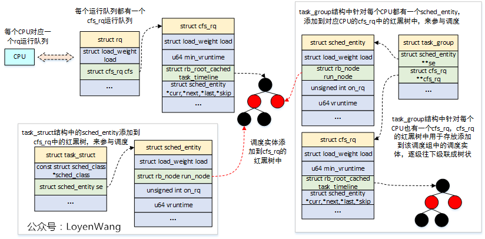

# cfs调度器

## 概念

CFS调度器，完全公平调度器，采用完全公平调度算法，引入虚拟运行时间概念。cfs 调度的理念为让所有任务在cpu上运行的虚拟时间趋于一致。在这里所有的进程会被赋予相同的虚拟时间，而实际运行的时间则取决于任务的权重。

### nice 值

​​nice 值​​ 用于调整进程的优先级，影响其在 CPU 时间分配中的权重。

nice 值的作用​​：nice 值是一个 ​​-20 到 19​​ 的整数（默认 0），数值越小，优先级越高（占用更多 CPU 时间）。

​​nice = -20​​：最高优先级（抢占更多 CPU）。

​​nice = 19​​：最低优先级（让出 CPU 时间）。

nice 值可以由用户态进行设置。

### 任务权重

任务权重计算公式：

$${任务权重} += \cfrac{1024}{1.25^{nice}} $$

Linux 内核使用 ​​静态映射表​​（sched_prio_to_weight）将 nice 值转换为权重：

```c
/*
 * nice 值是乘法关系，每改变一个 nice 等级，CPU 时间分配会有一个温和的 10% 变化。
 * 例如，当一个 CPU 密集型任务从 nice 0 变为 nice 1 时，它将比另一个保持在 nice 0 的
 * CPU 密集型任务少获得约 10% 的 CPU 时间。
 *
 * 这种“10% 效应”是相对且累积的：从任意 nice 等级开始，如果上升 1 个等级，
 * CPU 使用率减少约 10%；如果下降 1 个等级，CPU 使用率增加约 10%。
 * （为了实现这一点，我们使用了 1.25 的乘数。如果一个任务增加约 10%，
 * 而另一个任务减少约 10%，那么它们之间的相对差距约为 25%。）
 */
const int sched_prio_to_weight[40] = {
 /* -20 */     88761,     71755,     56483,     46273,     36291,
 /* -15 */     29154,     23254,     18705,     14949,     11916,
 /* -10 */      9548,      7620,      6100,      4904,      3906,
 /*  -5 */      3121,      2501,      1991,      1586,      1277,
 /*   0 */      1024,       820,       655,       526,       423,
 /*   5 */       335,       272,       215,       172,       137,
 /*  10 */       110,        87,        70,        56,        45,
 /*  15 */        36,        29,        23,        18,        15,
};
```

### 虚拟运行时间

​​vruntime 的定义​​：
任务在 CPU 上运行的​​加权虚拟时间​​，计算公式为：

$${vruntime} += \cfrac{实际执行时间\times NICELOAD}{任务权重} $$

* 实际执行时间​​：任务在 CPU 上运行的实际物理时间（纳秒级精度）。
* ​NICE_0_LOAD​​：优先级为 nice=0 的任务的基准权重（通常为 1024）。
* ​任务权重​​：根据任务的 nice 值动态计算的权重值

​​任务权重​​：由任务的优先级（nice 值）决定，优先级越高（nice 值越小），权重越大（例如 nice=0 时权重=1024，nice=-5 时权重≈2048）。当两个任务运行在cpu上的时间相同时，权重越大任务的虚拟运行时间越少，更容易再次被调度上cpu,同时也能获得更多的实际cpu使用时间。

在这里最终会调用到 __calc_delta 函数进行计算。该函数会在时钟中断，任务出队入队，任务唤醒等时刻。

update_curr -> calc_delta_fair -> 

```c
/*
 * delta_exec * weight / lw.weight
 *   或者
 * (delta_exec * (weight * lw->inv_weight)) >> WMULT_SHIFT
 *
 * 如果 weight := NICE_0_LOAD 并且 lw \e sched_prio_to_wmult[]，那么我们可以保证 shift 保持为正值，
 * 因为 inv_weight 保证适合 32 位，并且 NICE_0_LOAD 提供了额外的 10 位；因此 shift >= 22。
 *
 * 或者，weight <= lw.weight（因为 lw.weight 是运行队列的权重），因此 weight/lw.weight <= 1，
 * 因此我们的 shift 也将是正值。
 */
static u64 __calc_delta(u64 delta_exec, unsigned long weight, struct load_weight *lw)
{
	u64 fact = scale_load_down(weight); // 将权重缩放到较小范围
	u32 fact_hi = (u32)(fact >> 32);    // 获取高位部分
	int shift = WMULT_SHIFT;            // 初始移位值
	int fs;

	__update_inv_weight(lw); // 更新 lw 的逆权重

	// 如果 fact 的高位部分非零，调整移位值
	if (unlikely(fact_hi)) {
		fs = fls(fact_hi); // 找到最高有效位
		shift -= fs;       // 减去移位值
		fact >>= fs;       // 右移 fact
	}

	fact = mul_u32_u32(fact, lw->inv_weight); // 计算 fact 和逆权重的乘积

	fact_hi = (u32)(fact >> 32); // 再次获取高位部分
	if (fact_hi) {
		fs = fls(fact_hi); // 找到最高有效位
		shift -= fs;       // 减去移位值
		fact >>= fs;       // 右移 fact
	}

	// 计算最终结果并返回
	return mul_u64_u32_shr(delta_exec, fact, shift);
}
```

## 常用的结构体

### cfs的多层级调度

在该 cfs 调度中有多个结构体，其中 task_group 用来记录调度组。在进程管理初始化时会初始化 root_task_group 在该结构中记录了所有的进程和进程组。而 rq 则是与 cpu 核一一对应，在 rq 中会记录处在顶层的 cfs_rq 。通过 task_group 和 cfs_rq 来记录调度层级。


多层级的调度：


### task_group

```c
struct task_group {
	struct cgroup_subsys_state css; // cgroup 子系统状态

#ifdef CONFIG_GROUP_SCHED_WEIGHT
	/* 一个正值表示这是一个 SCHED_IDLE 组 */
	int			idle; // 表示任务组是否为 SCHED_IDLE 组
#endif

#ifdef CONFIG_FAIR_GROUP_SCHED
	/* 此组在每个 CPU 上的可调度实体 */
	struct sched_entity	**se;
	/* 此组在每个 CPU 上“拥有”的运行队列 */
	struct cfs_rq		**cfs_rq;
	unsigned long		shares; // 任务组的权重
#ifdef	CONFIG_SMP
	/*
	 * load_avg 在时钟滴答时间可能会被大量争用，
	 * 因此将其放在自己的缓存行中，与上面的字段分开，
	 * 这些字段也将在每个滴答时访问。
	 */
	atomic_long_t		load_avg ____cacheline_aligned; // 任务组的平均负载
#endif
#endif

#ifdef CONFIG_RT_GROUP_SCHED
	struct sched_rt_entity	**rt_se; // 实时调度实体
	struct rt_rq		**rt_rq; // 实时运行队列

	struct rt_bandwidth	rt_bandwidth; // 实时带宽
#endif

#ifdef CONFIG_EXT_GROUP_SCHED
	u32			scx_flags;	/* SCX_TG_* 标志 */
	u32			scx_weight;	/* SCX 权重 */
#endif

	struct rcu_head		rcu; // RCU 头
	struct list_head	list; // 任务组列表

	struct task_group	*parent; // 父任务组
	struct list_head	siblings; // 兄弟任务组
	struct list_head	children; // 子任务组

#ifdef CONFIG_SCHED_AUTOGROUP
	struct autogroup	*autogroup; // 自动任务组
#endif

	struct cfs_bandwidth	cfs_bandwidth; // CFS 带宽

#ifdef CONFIG_UCLAMP_TASK_GROUP
	/* 用户空间请求的两位小数精度的 [%] 值 */
	unsigned int		uclamp_pct[UCLAMP_CNT]; // 用户空间请求的利用率限制百分比
	/* 为任务组请求的限制值 */
	struct uclamp_se	uclamp_req[UCLAMP_CNT]; // 任务组的请求限制值
	/* 任务组使用的有效限制值 */
	struct uclamp_se	uclamp[UCLAMP_CNT]; // 任务组的有效限制值
#endif

};
```

task_group 中依赖 se 成员来联系到一个调度实体。一个 task_group 在每一个 cpu 都对应一个 sched_entity 结构并被挂在 cfs_rq 中的红黑树节点上。同时一个 task_group 在每一个 cpu 上都有对应的 cfs_rq 结构体，在该结构体中记录了该调度组内进程的优先级。

### struct sched_entity

sched_entity 用来描述一个调度实例，该结构作为一个节点被挂在 cfs_rq 中的红黑树上。一个调度实例既可以对应一个进程，也可以对应一个进程组。



```c
struct sched_entity {
	/* 用于负载均衡: */
	struct load_weight		load;           // 负载权重
	struct rb_node			run_node;       // 红黑树节点
	u64				deadline;       // 截止时间
	u64				min_vruntime;   // 最小虚拟运行时间
	u64				min_slice;      // 最小时间片

	struct list_head		group_node;     // 组节点
	unsigned char			on_rq;          // 是否在运行队列中
	unsigned char			sched_delayed;  // 调度是否延迟
	unsigned char			rel_deadline;   // 相对截止时间
	unsigned char			custom_slice;   // 自定义时间片
					/* hole */

	u64				exec_start;     // 执行开始时间
	u64				sum_exec_runtime; // 总执行时间
	u64				prev_sum_exec_runtime; // 上一次总执行时间
	u64				vruntime;       // 虚拟运行时间
	s64				vlag;           // 虚拟滞后
	u64				slice;          // 时间片

	u64				nr_migrations;  // 迁移次数

#ifdef CONFIG_FAIR_GROUP_SCHED
	int				depth;          // 调度实体的深度
	struct sched_entity		*parent;        // 父调度实体
	/* 调度实体所在的运行队列: */
	struct cfs_rq			*cfs_rq;        // 关联的CFS运行队列
	/* 调度实体拥有的运行队列: */
	struct cfs_rq			*my_q;          // 自己的CFS运行队列
	/* my_q->h_nr_running的缓存值 */
	unsigned long			runnable_weight; // 可运行权重
#endif

#ifdef CONFIG_SMP
	/*
	 * 每个调度实体的负载平均值跟踪。
	 *
	 * 放入单独的缓存行以避免与上面的只读值冲突。
	 */
	struct sched_avg		avg;            // 平均负载
#endif
};

```


### struct cfs_rq

cfs_rq 记录了这个调度组内的调度实例的优先级。在调度时会选取 cfs_rq 中最左边的节点上 cpu 即虚拟时间比较小的值。

cfs_rq 结构中的 load 和对应的 se 结构是


### struct rq

一个 cpu 对应一个 rq ，在一个 rq 结构体中又记录了不同调度类的根调度层级。

```c
struct rq {
	// ......
	/* 调度相关 */
	struct cfs_rq		cfs; // 完全公平调度类
	struct rt_rq		rt; // 实时调度类
	struct dl_rq		dl; // 截止期调度类
#ifdef CONFIG_SCHED_CLASS_EXT
	struct scx_rq		scx; // 扩展调度类
#endif
	// ......
	unsigned int		clock_update_flags; // 时钟更新标志
	u64			clock; // 当前时钟
	/* 确保所有时钟在同一缓存行中 */
	u64			clock_task ____cacheline_aligned; // 任务时钟
	u64			clock_pelt; // PELT 时钟
	unsigned long		lost_idle_time; // 丢失的空闲时间
	u64			clock_pelt_idle; // PELT 空闲时钟
	u64			clock_idle; // 空闲时钟
#ifndef CONFIG_64BIT
	u64			clock_pelt_idle_copy; // PELT 空闲时钟副本
	u64			clock_idle_copy; // 空闲时钟副本
#endif
}
```

## 计算权重

### 计算 Task se 权重

对于task se而言，load weight是明确的，该值是和se的nice value有对应关系。通过下面的公式获得：schd_prio_to_weight[nice]

设置权重：

```
sched_fork set_load_weight 
```

```c
void set_load_weight(struct task_struct *p, bool update_load)
{
	// 获取任务的优先级，静态优先级减去实时优先级的最大值
	int prio = p->static_prio - MAX_RT_PRIO;
	struct load_weight lw;

	// 如果任务具有空闲策略
	if (task_has_idle_policy(p)) {
		// 设置权重为空闲优先级的权重
		lw.weight = scale_load(WEIGHT_IDLEPRIO);
		// 设置反权重为空闲优先级的反权重
		lw.inv_weight = WMULT_IDLEPRIO;
	} else {
		// 根据优先级设置权重和反权重
		lw.weight = scale_load(sched_prio_to_weight[prio]);
		lw.inv_weight = sched_prio_to_wmult[prio];
	}

	/*
	 * 如果需要更新负载，并且调度类支持重新设置任务权重，
	 * 则调用调度类的 reweight_task 方法更新任务的负载。
	 * 否则，直接设置任务的负载权重。
	 */
	if (update_load && p->sched_class->reweight_task)
		p->sched_class->reweight_task(task_rq(p), p, &lw);
	else
		p->se.load = lw;
}
```

### 计算 Task group se 权重

**负载权重计算公式演进**

**1. 理想情况下的精确公式**

$$ge\text{->load.weight} = \frac{tg\text{->weight} \times grq\text{->load.weight}}{\sum grq\text{->load.weight}} \quad \text{(1)}$$
• 问题：计算总和（Σ）开销过大。

---

**2. 近似替代方案**
用慢速变化的平均值（`grq->avg.load_avg`）替代实时权重：

$$grq\text{->load.weight} \rightarrow grq\text{->avg.load\_avg} \quad \text{(2)}$$

得到近似公式：

$$ge\text{->load.weight} = \frac{tg\text{->weight} \times grq\text{->avg.load\_avg}}{tg\text{->load\_avg}} \quad \text{(3)}$$

其中：  
`tg->load_avg ≈ Σ grq->avg.load_avg`（即 `shares_avg`）。

• 优点：计算更高效稳定。  

• 缺点：平均值响应慢，导致边界条件（如空闲组启动任务时）出现瞬态延迟。

---

**3. 特殊情况（UP 场景）**
当其他 CPU 均空闲时，总和坍缩为当前 CPU 的权重：

$$ge\text{->load.weight} = \frac{tg\text{->weight} \times grq\text{->load.weight}}{grq\text{->load.weight}} = tg\text{->weight} \quad \text{(4)}$$


---

**4. 改进的混合公式**
结合 (3) 和 (4)，在接近 UP 场景时动态调整：

$$ge\text{->load.weight} = \frac{tg\text{->weight} \times grq\text{->load.weight}}{tg\text{->load\_avg} - grq\text{->avg.load\_avg} + grq\text{->load.weight}} \quad \text{(5)}$$

• 问题：`grq->load.weight` 可能为 0 导致除零错误。

---

**5. 最终修正公式**
使用 `grq->avg.load_avg` 作为下限：

$$ge\text{->load.weight} = \frac{tg\text{->weight} \times grq\text{->load.weight}}{tg\text{->load\_avg'}} \quad \text{(6)}
$$
其中：  
`tg->load_avg' = max(tg->load_avg - grq->avg.load_avg, grq->avg.load_avg) + grq->load.weight`

---

**关键设计思想**

1. 性能与精度平衡  
   用平均值（`load_avg`）替代实时值（`load.weight`）降低计算开销。
2. 边界条件处理  
   在 UP 场景下回归精确计算，避免瞬态延迟。
3. 数值安全  
   通过下限保护防止除零错误。

---

**应用场景**

* CPU 负载均衡：在 CFS 调度器中动态分配任务权重。  
* 低延迟优化：快速响应新任务启动（如从空闲状态唤醒）。

这里是动态权重的一个计算的代码实现：

```c
/**
 * calc_group_shares - 计算任务组（Task Group）在SMP系统中的动态权重份额
 * @cfs_rq: 需要计算权重的CFS运行队列
 *
 * 返回值: 计算出的动态权重份额（保证在[MIN_SHARES, tg_shares]范围内）
 *
 * 功能：在SMP系统中，根据任务组的配置份额（tg->shares）和实际负载（load_avg），
 *       动态计算该组在某个CPU上的权重份额。核心逻辑包括：
 *       1. 基于任务组全局负载和本地负载的比例分配权重。
 *       2. 确保计算结果不低于MIN_SHARES且不超过配置份额。
 *       3. 支持CPU间的负载均衡（如per-CPU分区场景）。
 */
static long calc_group_shares(struct cfs_rq *cfs_rq)
{
    // tg_shares: 任务组的静态配置份额（从tg->shares读取）
    // load: 取运行队列的当前负载和平均负载的最大值（避免低估）
    // tg_weight: 任务组的全局负载（需扣除当前队列的历史贡献）
    long tg_weight, tg_shares, load, shares;
    struct task_group *tg = cfs_rq->tg;

    /* 1. 读取任务组的静态配置份额 */
    tg_shares = READ_ONCE(tg->shares);

    /* 2. 计算本地负载（考虑瞬时负载和长期负载） */
    load = max(scale_load_down(cfs_rq->load.weight), cfs_rq->avg.load_avg);

    /* 3. 计算任务组的全局负载（原子操作保证一致性） */
    tg_weight = atomic_long_read(&tg->load_avg);

    /* 4. 更新全局负载：扣除当前队列的历史贡献，加上当前负载 */
    tg_weight -= cfs_rq->tg_load_avg_contrib;
    tg_weight += load;

    /* 5. 按比例计算动态份额：shares = (tg_shares * load) / tg_weight */
    shares = (tg_shares * load);
    if (tg_weight)
        shares /= tg_weight;

    /*
     * 6. 结果限幅处理（关键设计思想）：
     *    - MIN_SHARES是最小保障值（如2），避免空队列权重归零。
     *    - 在per-CPU分区场景中，即使tg->shares很小（如15），
     *      也需按CPU数量均分（例：15 * 1024/8=1920而非直接取MIN_SHARES=2048）。
     *    - 最终结果不超过静态配置份额tg_shares。
     */
    return clamp_t(long, shares, MIN_SHARES, tg_shares);
}

```

初始化过程：


| 来源   | 说明                               |
| ---- | -------------------------------- |
| 默认值  | 没有手动设置时使用 `NICE_0_LOAD = 1024`   |
| 手动设置 | 来自 `cgroup v2` 的 `cpu.weight` 接口 |
| 动态变化 | 某些场景下内核会重新计算或继承                  |

## cfs 调度类的方法

在不同的调度类中都会注册自己的方法集，下面是 cfs 调度器注册的方法。

```c
DEFINE_SCHED_CLASS(fair) = {

	.enqueue_task		= enqueue_task_fair,       // 将任务加入就绪队列
	.dequeue_task		= dequeue_task_fair,       // 从就绪队列中移除任务
	.yield_task		= yield_task_fair,         // 当前任务主动让出 CPU
	.yield_to_task		= yield_to_task_fair,      // 当前任务让出 CPU 给指定任务

	.wakeup_preempt		= check_preempt_wakeup_fair, // 检查是否需要抢占当前任务

	.pick_task		= pick_task_fair,          // 从就绪队列中选择任务
	.pick_next_task		= __pick_next_task_fair,   // 选择下一个要运行的任务
	.put_prev_task		= put_prev_task_fair,      // 保存当前任务的状态
	.set_next_task          = set_next_task_fair,     // 设置下一个要运行的任务

#ifdef CONFIG_SMP
	.balance		= balance_fair,            // 负载均衡
	.select_task_rq		= select_task_rq_fair,     // 选择任务运行的 CPU
	.migrate_task_rq	= migrate_task_rq_fair,    // 迁移任务到其他 CPU

	.rq_online		= rq_online_fair,          // 处理运行队列上线
	.rq_offline		= rq_offline_fair,         // 处理运行队列下线

	.task_dead		= task_dead_fair,          // 处理任务结束
	.set_cpus_allowed	= set_cpus_allowed_fair,   // 设置任务允许运行的 CPU 集合
#endif

	.task_tick		= task_tick_fair,          // 时钟中断处理
	.task_fork		= task_fork_fair,          // 处理任务创建

	.reweight_task		= reweight_task_fair,      // 调整任务权重
	.prio_changed		= prio_changed_fair,       // 处理任务优先级变化
	.switched_from		= switched_from_fair,      // 从其他调度类切换到当前调度类
	.switched_to		= switched_to_fair,        // 从当前调度类切换到其他调度类

	.get_rr_interval	= get_rr_interval_fair,    // 获取任务的时间片长度

	.update_curr		= update_curr_fair,        // 更新当前任务的运行时间

#ifdef CONFIG_FAIR_GROUP_SCHED
	.task_change_group	= task_change_group_fair,  // 处理任务组的变化
#endif

#ifdef CONFIG_SCHED_CORE
	.task_is_throttled	= task_is_throttled_fair,  // 检查任务是否被限制
#endif

#ifdef CONFIG_UCLAMP_TASK
	.uclamp_enabled		= 1,                      // 启用任务的 uclamp 功能
#endif
};
```

### 对中断进行处理

task_tick_fair 函数主要用于处理中断函数。

* 更新运行时的各类统计信息，比如vruntime， 运行时间、负载值、权重值等。
* 检查是否需要抢占，主要是比较运行时间是否耗尽，以及vruntime的差值是否大于运行时间等。


update_curr 函数中的更新：


```c
static void update_curr(struct cfs_rq *cfs_rq)
{
	struct sched_entity *curr = cfs_rq->curr; // 当前调度实体
	struct rq *rq = rq_of(cfs_rq); // 获取运行队列
	s64 delta_exec; // 记录执行时间的变化量
	bool resched; // 是否需要重新调度

	if (unlikely(!curr)) // 如果当前调度实体为空，直接返回
		return;

	// 更新当前调度实体的执行时间
	delta_exec = update_curr_se(rq, curr);
	if (unlikely(delta_exec <= 0)) // 如果执行时间变化量小于等于0，直接返回
		return;

	// 更新虚拟运行时间
	curr->vruntime += calc_delta_fair(delta_exec, curr);
	// 更新任务的截止时间
	resched = update_deadline(cfs_rq, curr);
	// 更新最小虚拟运行时间
	update_min_vruntime(cfs_rq);

	if (entity_is_task(curr)) { // 如果当前调度实体是一个任务
		struct task_struct *p = task_of(curr); // 获取任务结构

		// 更新任务的运行时统计信息
		update_curr_task(p, delta_exec);

		/*
		 * 如果公平服务器(fair_server)处于活动状态，无论任务是否代表公平服务器运行，
		 * 都需要对公平服务器时间进行统计：
		 *  - 如果任务代表公平服务器运行，需要根据分配的运行时间限制其时间。
		 *  - 如果公平任务在公平服务器之外运行，也需要对公平服务器进行时间统计，
		 *    以便公平服务器可以记录这段时间并可能避免在本周期内运行。
		 */
		if (dl_server_active(&rq->fair_server))
			dl_server_update(&rq->fair_server, delta_exec);
	}

	// 记录CFS运行队列的运行时间
	account_cfs_rq_runtime(cfs_rq, delta_exec);

	// 如果运行队列中只有一个任务，直接返回
	if (cfs_rq->nr_queued == 1)
		return;

	// 如果需要重新调度或者发生短时间抢占
	if (resched || did_preempt_short(cfs_rq, curr)) {
		// 懒惰地重新调度当前任务
		resched_curr_lazy(rq);
		// 清除当前任务的伙伴关系
		clear_buddies(cfs_rq, curr);
	}
}
```

计算虚拟运行时间：

delta_exec * weight / lw.weight 或者 (delta_exec * (weight * lw->inv_weight)) >> WMULT_SHIFT,这里 weight = 1024 或小于 1024 。

```c
/*
 * weight = 1024
 * delta_exec * weight / lw.weight
 *   或者
 * (delta_exec * (weight * lw->inv_weight)) >> WMULT_SHIFT
 *
 * 如果 weight := NICE_0_LOAD 并且 lw \e sched_prio_to_wmult[]，那么我们可以保证 shift 保持为正值，
 * 因为 inv_weight 保证适合 32 位，并且 NICE_0_LOAD 提供了额外的 10 位；因此 shift >= 22。
 *
 * 或者，weight <= lw.weight（因为 lw.weight 是运行队列的权重），因此 weight/lw.weight <= 1，
 * 因此我们的 shift 也将是正值。
 */
static u64 __calc_delta(u64 delta_exec, unsigned long weight, struct load_weight *lw)
{
	u64 fact = scale_load_down(weight); // 将权重缩放到较小范围
	u32 fact_hi = (u32)(fact >> 32);    // 获取高位部分
	int shift = WMULT_SHIFT;            // 初始移位值
	int fs;

	__update_inv_weight(lw); // 更新 lw 的逆权重

	// 如果 fact 的高位部分非零，调整移位值
	if (unlikely(fact_hi)) {
		fs = fls(fact_hi); // 找到最高有效位
		shift -= fs;       // 减去移位值
		fact >>= fs;       // 右移 fact
	}

	fact = mul_u32_u32(fact, lw->inv_weight); // 计算 fact 和逆权重的乘积

	fact_hi = (u32)(fact >> 32); // 再次获取高位部分
	if (fact_hi) {
		fs = fls(fact_hi); // 找到最高有效位
		shift -= fs;       // 减去移位值
		fact >>= fs;       // 右移 fact
	}

	// 计算最终结果并返回
	return mul_u64_u32_shr(delta_exec, fact, shift);
}
```

### 任务的出队入队

* 当任务进入可运行状态时，需要将调度实体放入到红黑树中，完成入队操作
* 当任务退出可运行状态时，需要将调度实体从红黑树中移除，完成出队操作

每次入队时需要调整虚拟运行时间，防止新入队的任务因为虚拟运行时间比较小，导致总是新任务被调度上 cpu 进而引起老任务的饥饿。


### 任务的创建

在父进程通过fork创建子进程的时候，task_fork_fair函数会被调用，这个函数的传入参数是子进程的task_struct。该函数的主要作用，就是确定子任务的vruntime，因此也能确定子任务的调度实体在红黑树RB中的位置。


### 调整权重

```c
void set_load_weight(struct task_struct *p, bool update_load)
{
	// 获取任务的优先级，静态优先级减去实时优先级的最大值
	int prio = p->static_prio - MAX_RT_PRIO;
	struct load_weight lw;

	// 如果任务具有空闲策略
	if (task_has_idle_policy(p)) {
		// 设置权重为空闲优先级的权重
		lw.weight = scale_load(WEIGHT_IDLEPRIO);
		// 设置反权重为空闲优先级的反权重
		lw.inv_weight = WMULT_IDLEPRIO;
	} else {
		// 根据优先级设置权重和反权重
		lw.weight = scale_load(sched_prio_to_weight[prio]);
		lw.inv_weight = sched_prio_to_wmult[prio];
	}

	/*
	 * 如果需要更新负载，并且调度类支持重新设置任务权重，
	 * 则调用调度类的 reweight_task 方法更新任务的负载。
	 * 否则，直接设置任务的负载权重。
	 */
	if (update_load && p->sched_class->reweight_task)
		p->sched_class->reweight_task(task_rq(p), p, &lw);
	else
		p->se.load = lw;
}
```

### 任务选择


## CFS存在的缺陷

CFS 无法处理进程对延迟要求。比如：一些进程可能不需要大量的 CPU 时间，但是当它们能执行时需要很快响应速度，另一些进程可能会需要更多的 CPU 时间，但它们可以等待对延迟不敏感； CFS调度器没有给进程提供一种表达其延时延需求的方法。虽然nice可用于为进程提供更多 CPU 时间，但这和上面的时延需求不是同样的事情。 当然RT调度类可用于延迟有要求的任务，但RT任务是一个特权行为，不当的设置会严重影响系统其他任务的运行。