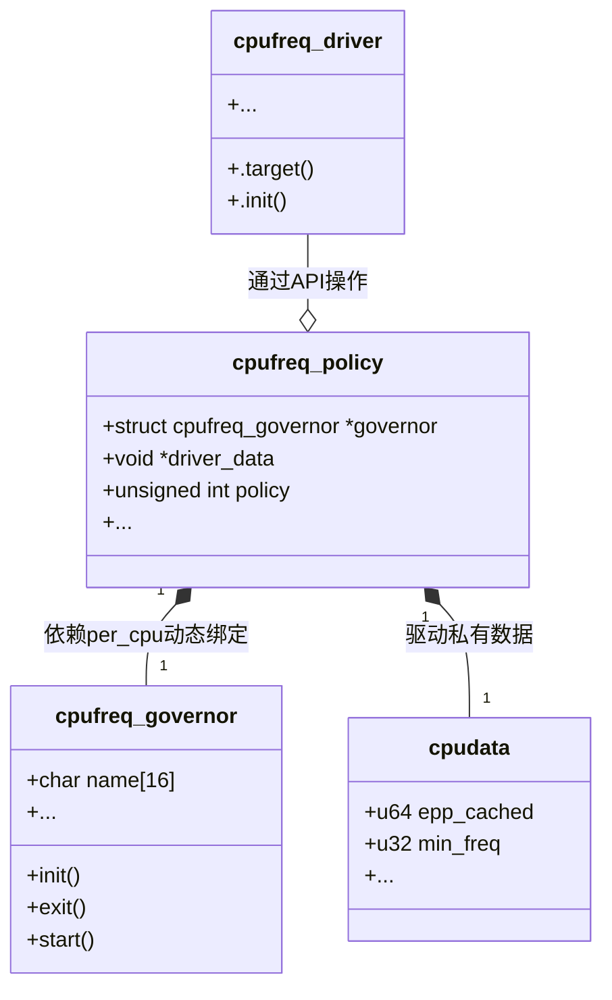
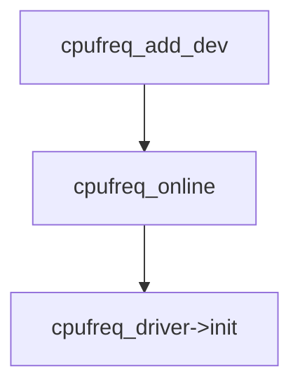
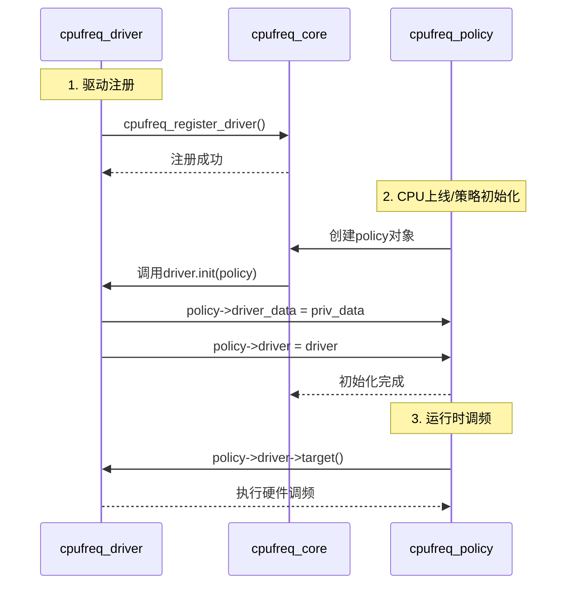
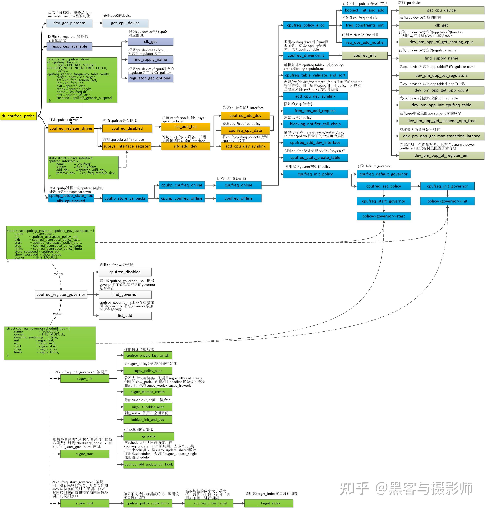
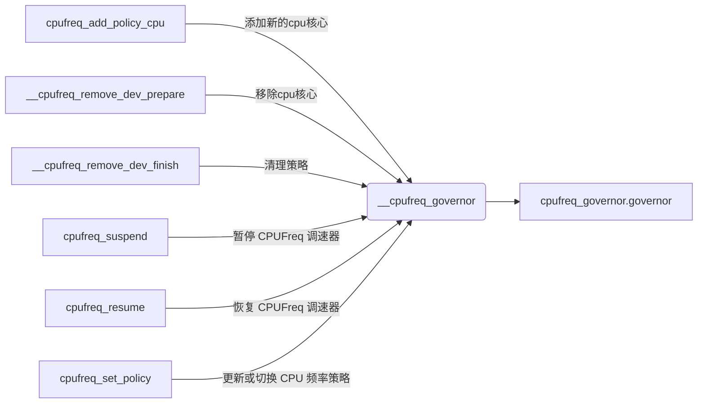
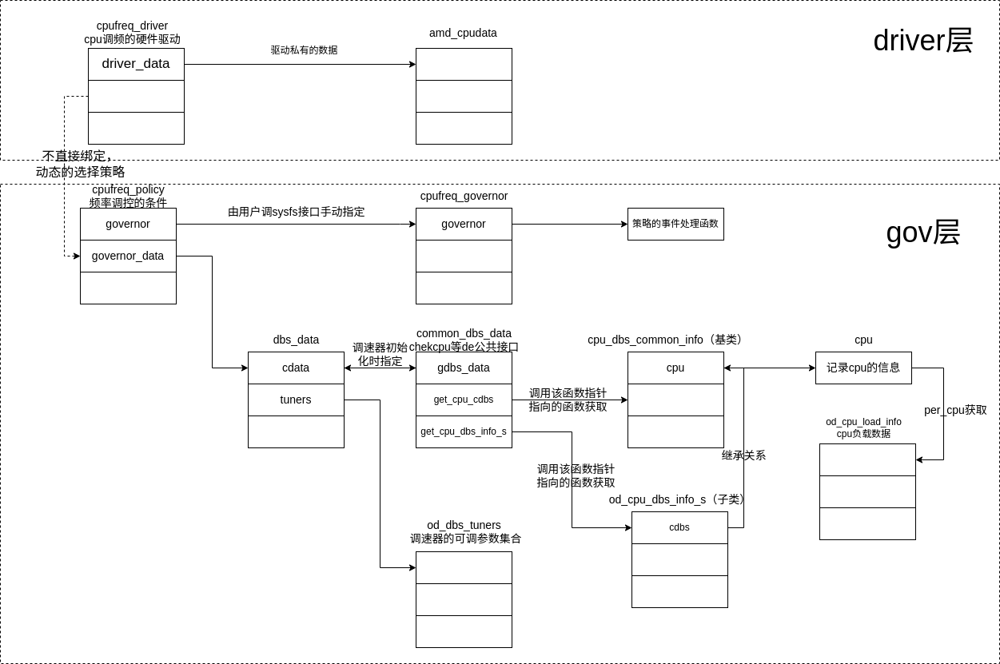
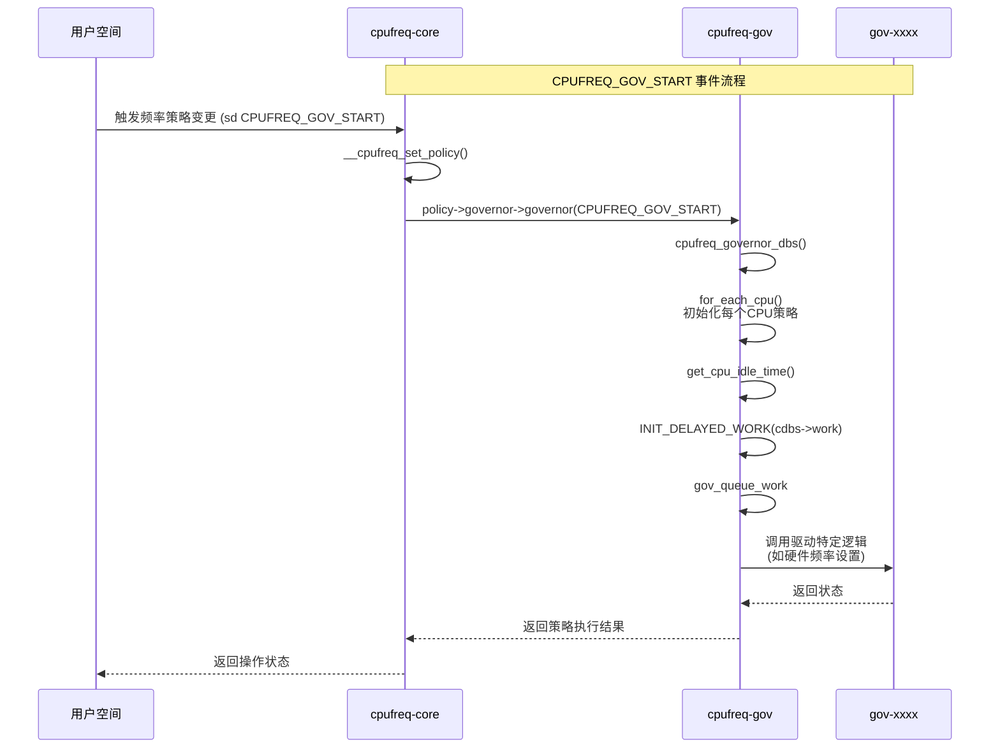
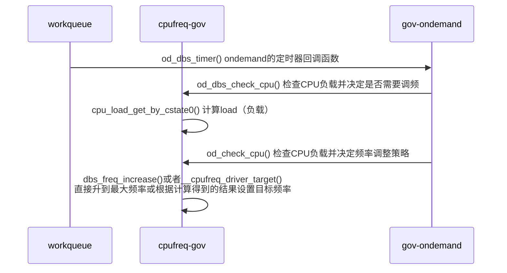
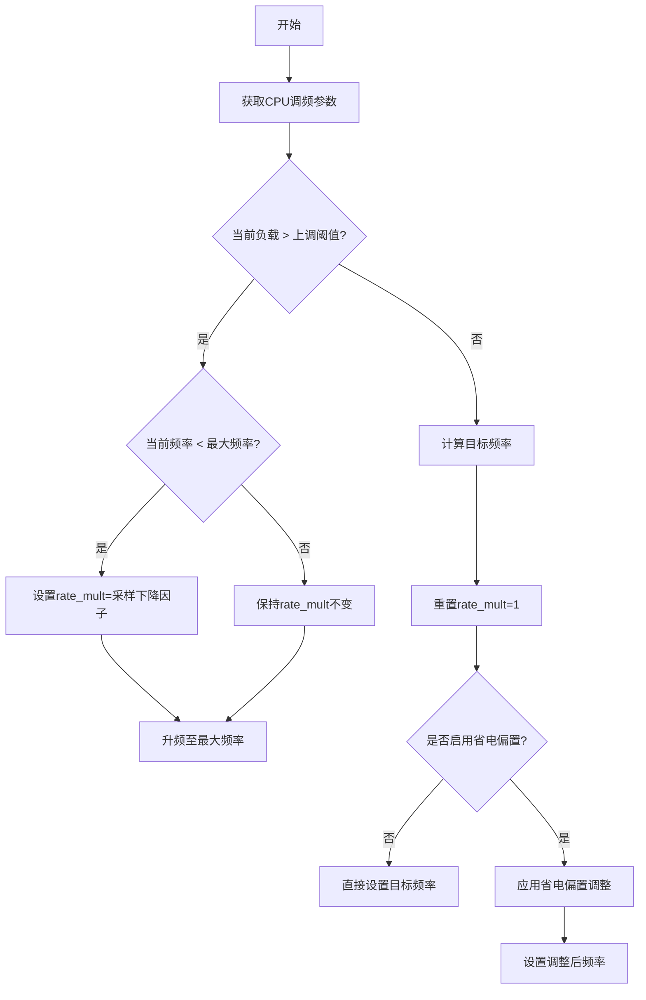
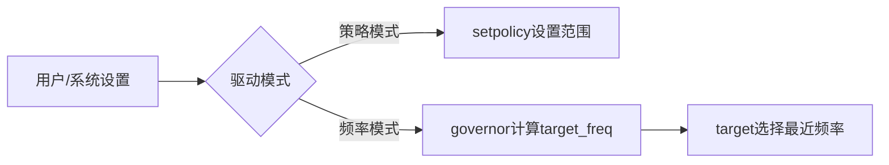

# cpu调频子系统

## 核心结构体

核心结构体的关系图：



### cpufreq_driver

cpufreq_driver负责频率的设定工作，用于驱动硬件。

```c
/**
 * struct cpufreq_driver - CPU频率调节驱动结构体
 * 
 * 该结构体定义了CPU频率调节驱动需要实现的接口和属性
 */
struct cpufreq_driver {
    char name[CPUFREQ_NAME_LEN];  // 驱动名称
    u16 flags;                    // 驱动标志位
    void *driver_data;            // 驱动私有数据指针

    /* 所有驱动必须实现的回调函数 */
    int (*init)(struct cpufreq_policy *policy);  // 初始化函数
    int (*verify)(struct cpufreq_policy_data *policy);  // 验证频率参数是否有效

    /* 以下两个回调函数只需实现其中一个 */
    int (*setpolicy)(struct cpufreq_policy *policy);  // 设置频率调节策略
    int (*target)(struct cpufreq_policy *policy,      // 设置目标频率(已弃用)
                 unsigned int target_freq,
                 unsigned int relation);
    
    /* 替代target()的现代接口 */
    int (*target_index)(struct cpufreq_policy *policy,  // 通过性能等级索引设置频率
                       unsigned int index);
    unsigned int (*fast_switch)(struct cpufreq_policy *policy,  // 快速频率切换
                               unsigned int target_freq);
    
    /**
     * ->fast_switch()的替代接口，用于可以传递性能提示的驱动
     * 只有在设置了->fast_switch时才能设置此回调
     */
    void (*adjust_perf)(unsigned int cpu,
                       unsigned long min_perf,
                       unsigned long target_perf,
                       unsigned long capacity);

    /* 
     * 仅适用于没有设置CPUFREQ_ASYNC_NOTIFICATION且实现了target_index()的驱动
     * 用于在切换到目标频率前先切换到中间稳定频率
     */
    unsigned int (*get_intermediate)(struct cpufreq_policy *policy,
                                   unsigned int index);
    int (*target_intermediate)(struct cpufreq_policy *policy,
                              unsigned int index);

    /* 获取当前CPU频率，出错时返回0 */
    unsigned int (*get)(unsigned int cpu);

    /* 在收到固件通知时更新策略限制 */
    void (*update_limits)(unsigned int cpu);

    /* 可选回调函数 */
    int (*bios_limit)(int cpu, unsigned int *limit);  // 获取BIOS限制的频率
    int (*online)(struct cpufreq_policy *policy);     // CPU上线时调用
    int (*offline)(struct cpufreq_policy *policy);    // CPU下线时调用
    void (*exit)(struct cpufreq_policy *policy);      // 驱动退出时调用
    int (*suspend)(struct cpufreq_policy *policy);    // 系统挂起时调用
    int (*resume)(struct cpufreq_policy *policy);     // 系统恢复时调用

    /* 驱动完全初始化后调用 */
    void (*ready)(struct cpufreq_policy *policy);

    struct freq_attr **attr;  // 频率属性指针数组

    /* 平台特定的boost支持 */
    bool boost_enabled;       // boost功能是否启用
    int (*set_boost)(struct cpufreq_policy *policy, int state);  // 设置boost状态

    /* 
     * 在策略完全初始化后但调速器启动前注册能量模型
     */
    void (*register_em)(struct cpufreq_policy *policy);
};
```

cpufreq_register_driver函数为cpufreqdriver注册的入口，驱动程序通过调用该函数进行初始化，并传入相关的struct cpufreq_driver，cpufreq_register_driver会调用subsys_interface_register，最终执行回调函数cpufreq_add_dev。



cpufreq_driver->init最终在这里会调到我们注册的驱动的init函数。

### cpufreq_policy

`cpufreq_policy` 结构体，代表 CPU 频率调节的策略相关的一组限制条件。该结构体一般会保存在cpu的专属信息中，在 cpufreq_driver 初始化时通过percpu来获取并作为参数传入，建立cpufreq_driver 与 cpufreq_policy 之间的联系。
```c
struct cpufreq_policy {
	/* CPUs sharing clock, require sw coordination */
	cpumask_var_t		cpus;	/* 仅包含在线的 CPU */
	cpumask_var_t		related_cpus; /* 包含在线和离线的 CPU */
	cpumask_var_t		real_cpus; /* 包含相关的和存在的 CPU */

	unsigned int		shared_type; /* ACPI: ANY 或 ALL，表示受频率调节影响的 CPU */

	unsigned int		cpu;    /* 负责管理此策略的 CPU，必须是在线的 */

	struct clk		*clk; /* 指向时钟结构体的指针，表示 CPU 频率相关的时钟 */

	struct cpufreq_cpuinfo	cpuinfo; /* CPU 的频率信息，参见结构体定义 */

	unsigned int		min;    /* 最小频率（kHz） */
	unsigned int		max;    /* 最大频率（kHz） */
	unsigned int		cur;    /* 当前频率（kHz），当使用 cpufreq governor 时需要 */
	unsigned int		suspend_freq; /* 系统挂起时设置的频率 */

	unsigned int		policy; /* 当前频率调节策略 */
	unsigned int		last_policy; /* 拔出 CPU 之前的策略 */
	struct cpufreq_governor	*governor; /* 频率调节器（governor） 关联具体的dbs_data*/
	void			*governor_data; /* 存储与 governor 相关的数据 */
	char			last_governor[CPUFREQ_NAME_LEN]; /* 最后使用的 governor 名称 */

	struct work_struct	update; /* 如果需要在 IRQ 上下文中调用 update_policy()，使用此字段 */

	struct freq_constraints	constraints; /* 频率约束条件 */
	struct freq_qos_request	*min_freq_req; /* 最小频率请求 */
	struct freq_qos_request	*max_freq_req; /* 最大频率请求 */

	struct cpufreq_frequency_table	*freq_table; /* 频率表 */
	enum cpufreq_table_sorting freq_table_sorted; /* 频率表的排序方式 */

	struct list_head        policy_list; /* 频率策略链表 */
	struct kobject		kobj; /* 用于内核对象模型 */
	struct completion	kobj_unregister; /* 用于等待 kobj 卸载完成 */

	/*
	 * 信号量规则：
	 * - 任何需要读取此策略结构体的操作都需要执行 down_read 操作。
	 * - 任何会修改策略结构体或移除策略的操作（如 CPU 热插拔），都需要持有此信号量并以写模式进行操作。
	 */
	struct rw_semaphore	rwsem;

	/*
	 * 快速切换标志：
	 * - 如果驱动能保证在共享策略的 CPU 上更改频率并且该更改会影响所有策略上的 CPU，则设置 fast_switch_possible。
	 * - 如果支持快速频率切换的 governor 已启用，则设置 fast_switch_enabled。
	 */
	bool			fast_switch_possible; /* 是否支持快速切换 */
	bool			fast_switch_enabled;  /* 是否启用快速切换 */

	/*
	 * 如果当前 governor 设置了 CPUFREQ_GOV_STRICT_TARGET 标志，则设置此标志。
	 */
	bool			strict_target; /* 是否严格目标频率 */

	/*
	 * 如果在频率表中发现了无效的频率（低效频率），则设置此标志。
	 * 这表示是否可以遵循 CPUFREQ_RELATION_E 标志。
	 */
	bool			efficiencies_available; /* 是否存在低效频率 */

	/*
	 * 每次驱动设置频率时的首选时间间隔（微秒），由 scaling driver 设置（默认值 0 表示无偏好）。
	 */
	unsigned int		transition_delay_us; /* 频率转换延迟 */

	/*
	 * 远程 DVFS 标志（未添加到驱动结构体中，以避免访问调度器的热路径结构）。
	 * 如果不同 cpufreq 策略的 CPU 可以代替其他 CPU 进行频率调节，则设置此标志。
	 */
	bool			dvfs_possible_from_any_cpu; /* 是否支持跨 CPU 的 DVFS 调节 */

	/* 启用每个策略的提升标志 */
	bool			boost_enabled; /* 是否启用提升 */

	/* 来自 cpufreq_driver_resolve_freq 的频率缓存查找 */
	unsigned int cached_target_freq; /* 缓存的目标频率 */
	unsigned int cached_resolved_idx; /* 缓存的频率索引 */

	/* 频率转换同步 */
	bool			transition_ongoing; /* 跟踪频率转换状态 */
	spinlock_t		transition_lock; /* 用于转换过程的自旋锁 */
	wait_queue_head_t	transition_wait; /* 等待队列，用于等待转换完成 */
	struct task_struct	*transition_task; /* 正在进行转换的任务 */

	/* cpufreq 统计信息 */
	struct cpufreq_stats	*stats; /* 存储 CPU 频率调节统计信息 */

	/* 驱动程序内部使用的字段 */
	void			*driver_data; /* 驱动数据 */

	/* 如果用于热管理，则指向冷却设备 */
	struct thermal_cooling_device *cdev; /* 热管理冷却设备 */

	/* 最小和最大频率的通知块 */
	struct notifier_block nb_min; /* 最小频率通知 */
	struct notifier_block nb_max; /* 最大频率通知 */
};
```

* cpus和related_cpus    这两个都是cpumask_var_t变量，cpus表示的是这一policy控制之下的所有还出于online状态的cpu，而related_cpus则是online和offline两者的合集。主要是用于多个cpu使用同一种policy的情况，实际上，我们平常见到的大多数系统中都是这种情况：所有的cpu同时使用同一种policy。我们需要related_cpus变量指出这个policy所管理的所有cpu编号。
* cpu和last_cpu    虽然一种policy可以同时用于多个cpu，但是通常一种policy只会由其中的一个cpu进行管理，cpu变量用于记录用于管理该policy的cpu编号，而last_cpu则是上一次管理该policy的cpu编号（因为管理policy的cpu可能会被plug out，这时候就要把管理工作迁移到另一个cpu上）。
* cpuinfo    保存cpu硬件所能支持的最大和最小的频率以及切换延迟信息。
* min/max/cur  该policy下的可使用的最小频率，最大频率和当前频率。
* policy    该变量可以取以下两个值：CPUFREQ_POLICY_POWERSAVE和CPUFREQ_POLICY_PERFORMANCE，该变量只有当调频驱动支持setpolicy回调函数的时候有效，这时候由驱动根据policy变量的值来决定系统的工作频率或状态。如果调频驱动（cpufreq_driver）支持target回调，则频率由相应的governor来决定。
* governor和governor_data    指向该policy当前使用的cpufreq_governor结构和它的上下文数据。governor是实现该policy的关键所在，调频策略的逻辑由governor实现。
* update    有时在中断上下文中需要更新policy，需要利用该工作队列把实际的工作移到稍后的进程上下文中执行。
* user_policy    有时候因为特殊的原因需要修改policy的参数，比如溫度过高时，最大可允许的运行频率可能会被降低，为了在适当的时候恢复原有的运行参数，需要使用user_policy保存原始的参数（min，max，policy，governor）。
* kobj    该policy在sysfs中对应的kobj的对象。


这些字段的组合使得该结构能够处理复杂的 CPU 频率调节策略，并提供相关的同步、统计和性能提升功能。

cpufreq_add_dev -> __cpufreq_add_dev -> cpufreq_init_policy cpufreq_set_policy -> cpufreq_init_governor -> policy->governor->init 

### cpufreq_governor

governor负责检测cpu的使用状况，从而在可用的范围中选择一个合适的频率，代码中它用cpufreq_governor结构来表示：

```c
struct cpufreq_governor {
	char	name[CPUFREQ_NAME_LEN];  // governor 的名称，如 "ondemand", "performance"
	
	/* 初始化 governor 的函数，当此 governor 被加载到系统中时调用 */
	int	(*init)(struct cpufreq_policy *policy);

	/* 退出 governor 的函数，当此 governor 被卸载时调用 */
	void	(*exit)(struct cpufreq_policy *policy);

	/* 启动 governor 的函数，通常是在启动频率调节时调用 */
	int	(*start)(struct cpufreq_policy *policy);

	/* 停止 governor 的函数，通常是在停止频率调节时调用 */
	void	(*stop)(struct cpufreq_policy *policy);

	/* 设置 governor 限制的函数，用于更新频率调节的限制 */
	void	(*limits)(struct cpufreq_policy *policy);

	/*
	 * 显示当前频率设置的函数。返回值将是一个字符串，描述当前的频率设置。
	 * 用于从用户空间（例如通过 sysfs）显示当前频率调节设置。
	 */
	ssize_t	(*show_setspeed)(struct cpufreq_policy *policy, char *buf);

	/*
	 * 存储频率设置的函数，用于通过用户空间设置新的频率。
	 * 用于从用户空间（例如通过 sysfs）修改 CPU 的频率。
	 */
	int	(*store_setspeed)(struct cpufreq_policy *policy, unsigned int freq);

	/* 用于将当前 governor 插入到 governor 链表中的节点 */
	struct list_head	governor_list;

	/* 保存此 governor 所属的模块指针，当 governor 模块被卸载时使用 */
	struct module		*owner;

	/* 此标志位包含 governor 的各种状态标志，用于指定 governor 的特性（例如是否启用某些特性） */
	u8			flags;
};

```

* name    该governor的名字。
* initialized    初始化标志。
* governor    指向一个回调函数，CPUFreq Core会在不同的阶段调用该回调函数，用于该governor的启动、停止、初始化、退出动作。
* list_head    所有注册的governor都会利用该字段链接在一个全局链表中，以供系统查询和使用。

该结构在最3.x等较低的版本中只有 governor 一个回调函数，在该函数中处理init exit start 等等事件，后面在高版本的内核中 4.x+ 之后将 governor 拆开成为上述结构体中的多种结构。

### cpufreq_driver 与 cpufreq_policy 之间关系的建立

cpufreq_policy 和 cpufreq_driver 是两个重要的结构，它们之间的关系是 CPU 频率管理的核心部分。cpufreq_policy 代表着一个或多个 CPU 的频率调节策略，而 cpufreq_driver 则是具体的硬件频率驱动，它提供了对 CPU 频率的控制接口。

cpufreq_policy 与 cpufreq_driver 之间的关系通常是在 cpufreq 子系统初始化时建立的。具体来说，cpufreq_policy 负责表示每个 CPU 的频率调节策略，而 cpufreq_driver 提供操作 CPU 频率的方法和回调函数，二者之间的关系通常是在驱动加载时建立的。



### cpufreq_governor 与 cpufreq_policy 之间关系的建立

cpufreq_governor 结构与 cpufreq_policy 之间会在 cpufreq_governor 初始化时动态的与 cpufreq_policy 结构建立联系。

当用户态调用 scaling_governor 接口时可以切换调频策略，该接口在cpu调频子系统初始化时就已经创建了。

```c
// 示例：用户通过sysfs切换governor
echo "ondemand" > /sys/devices/system/cpu/cpufreq/policyX/scaling_governor
```

在进行模块编程时，如果不想在用户态显式的调用 scaling_governor 接口来切换可以在内核中调用 cpufreq_set_policy 来修改。

```c
static int __init set_cpufreq_governor_init(void)
{
    struct cpufreq_policy *policy;
    struct cpufreq_governor *new_gov;
    int cpu = 0; // 目标 CPU
    int ret;

    // 获取 CPU 的 cpufreq 策略
    policy = cpufreq_get_policy(cpu);
    if (!policy) {
        pr_err("Failed to get cpufreq policy for CPU %d\n", cpu);
        return -ENODEV;
    }

    // 获取并初始化新的调频 governor
    new_gov = cpufreq_get_governor("ondemand"); // 获取 "ondemand" governor
    if (!new_gov) {
        pr_err("Failed to get governor\n");
        cpufreq_put_policy(policy);
        return -EINVAL;
    }

    // 设置新的 governor
    ret = cpufreq_set_policy(policy, new_gov, policy->policy);
    if (ret) {
        pr_err("Failed to set policy for CPU %d\n", cpu);
        cpufreq_put_policy(policy);
        return ret;
    }

    cpufreq_put_policy(policy);
    pr_info("CPU frequency governor set successfully\n");
    return 0;
}
```

调用链路：cpufreq_set_policy -> cpufreq_init_governor policy->governor->init 

```c
static int cpufreq_init_governor(struct cpufreq_policy *policy)
{
	int ret;

	/* Don't start any governor operations if we are entering suspend */
	if (cpufreq_suspended)
		return 0;
	/*
	 * Governor might not be initiated here if ACPI _PPC changed
	 * notification happened, so check it.
	 */
	if (!policy->governor)
		return -EINVAL;

	/* Platform doesn't want dynamic frequency switching ? */
	if (policy->governor->dynamic_switching &&
	    cpufreq_driver->flags & CPUFREQ_NO_AUTO_DYNAMIC_SWITCHING) {
		struct cpufreq_governor *gov = cpufreq_fallback_governor();

		if (gov) {
			pr_warn("Can't use %s governor as dynamic switching is disallowed. Fallback to %s governor\n",
				policy->governor->name, gov->name);
			policy->governor = gov;
		} else {
			return -EINVAL;
		}
	}

	if (!try_module_get(policy->governor->owner))
		return -EINVAL;

	pr_debug("%s: for CPU %u\n", __func__, policy->cpu);

	if (policy->governor->init) {
		ret = policy->governor->init(policy);
		if (ret) {
			module_put(policy->governor->owner);
			return ret;
		}
	}

	return 0;
}

```

## 初始化

cpufreq 子系统属于 platform 总线下的一种设备。Platform 的 概念如下：

Platform 总线是 Linux 内核中用于管理 ​​非枚举型设备​​（即不能通过标准总线（如 PCI、USB）自动发现的设备）的一种虚拟总线机制。它主要用于嵌入式系统，特别是基于 ​​设备树（Device Tree, DT）​​ 的 ARM 架构设备。

​​1. Platform 总线的作用​​
Platform 总线主要用于管理两类设备：

​​SoC 集成外设​​（如 UART、I2C、GPIO、时钟控制器等）
这些设备通常直接集成在芯片内部，无法通过标准总线枚举。
​​设备树描述的硬件​​
在 ARM 嵌入式系统中，设备树（.dts）会描述硬件信息，内核通过 Platform 总线匹配驱动和设备。

在操作系统初始化的过程中会对 platform 总线进行初始化并在此过程中探测属于该总线下的设备并调用他们的 probe 接口进行初始化

```c
static struct platform_driver dt_cpufreq_platdrv = {
	.driver = {
		.name	= "cpufreq-dt",
	},
	.probe		= dt_cpufreq_probe,
	.remove		= dt_cpufreq_remove,
};
```

cpufreq 子系统的起点就是 dt_cpufreq_probe 函数。




## 调频过程

触发调频策略：



不同的 Governor 会有自己不同的频率调整策略，这里以 ondemand 为例：

```c
struct cpufreq_governor cpufreq_gov_ondemand = {
	.name			= "ondemand",
	.governor		= od_cpufreq_governor_dbs,
	.max_transition_latency	= TRANSITION_LATENCY_LIMIT,
	.owner			= THIS_MODULE,
};
```

### 调频子系统中结构体间的关系

（这里在高版本的内核中发生了一些变动）。这里的 driver 与 gov 并不是直接绑定，因为不同的硬件有自己不同的驱动方式，同时用户也有选择不同调频策略的自由。



1. struct od_cpu_load_info ：存储 单个 CPU 核心的实时负载数据，用于动态调速器（如 ondemand）计算当前负载率。
2. struct cpu_dbs_common_info：管理 所有调速器共享的 CPU 基础信息，确保多核间的协调。
3. struct od_cpu_dbs_info_s：扩展公共数据，实现 ondemand 调速器的核心逻辑。继承自cpu_dbs_common_info。
4. struct od_dbs_tuners存储：用户空间可调节的参数（通过 sysfs 暴露）。
5. common_dbs_data：定义 调速器的通用操作接口，支持不同调速器（ondemand/conservative）的插件化实现。
6. dbs_data：管理每个策略（policy）的调速器实例数据。

#### od_dbs_tuners 

```c
struct od_dbs_tuners {
    /* 负载计算参数 */
    unsigned int load_ratio;          // 实际负载与最大负载的比率阈值（百分比）
                                      // 用于判断是否触发升频操作
    /* 频率调整阈值 */
    unsigned int up_threshold;        // CPU负载触发升频的阈值（百分比）
                                      // 当负载超过此值时，调度器会提高频率
    /* 采样控制参数 */
    unsigned int sampling_rate;       // 采样间隔时间（微秒us）
                                      // 决定多久检测一次CPU负载
    unsigned int sampling_down_factor; // 降频时的采样率放大因子
                                      // 例如设为3时，降频决策的采样间隔是升频时的3倍
                                      // 用于避免频率抖动
};
```

* `load_ratio`：是 Linux CPU 频率调控（CPUFreq）中 `ondemand` 调速器 的一个关键参数，用于 控制滑动平均负载（`load_avg_curr`）的计算方式
$$
\text{load\_avg\_curr} = \frac{(100 - \text{load\_ratio}) \times \text{当前负载} + \text{load\_ratio} \times \text{历史平均}}{100}
$$

  * 值越大：历史负载的权重越高，调频响应越平滑（适合稳定负载）。  

  * 值越小：当前负载的权重越高，调频响应越灵敏（适合突发负载）。

#### struct od_cpu_load_info

```c
struct od_cpu_load_info {
    /* 负载统计相关 */
    uint32_t avg_load_total;      // 累计负载总和（用于计算滑动平均）
    uint32_t load_avg_curr;       // 当前滑动平均负载（百分比）

    /* 采样计数相关 */
    uint32_t avg_real_count;      // 实际采样次数（考虑动态调整系数后的加权计数）
    uint32_t avg_count;           // 原始采样次数（每次调频检查+1）

    /* 硬件性能计数器 */
    uint64_t prev_mperf;          // 上一次记录的MPERF值（测量实际运行周期）
    uint64_t prev_tsc;            // 上一次记录的TSC值（时间戳计数器）

    /* 调频动态调整相关（非AMD平台专用） */
#ifndef CONFIG_AMD_PSTATE
    uint32_t rate_mult_count;     // 动态调频系数累计值（用于amd台敏感度调节）
#endif

    /* 状态标志 */
    bool timer_running;           // 标记当前CPU的调频定时器是否正在运行
};
```

### 启动一个 Governor 

在启动一个Governor会遍历使用该policy的所有的处于online状态的cpu，针对每一个cpu，做以下动作：

- 取出该cpu相关联的cpu_dbs_common_info结构指针，之前已经讨论过，governor定义了一个per_cpu变量来定义各个cpu所对应的cpu_dbs_common_info结构，通过common_dbs_data结构的回调函数可以获取该结构的指针。
- 初始化cpu_dbs_common_info结构的cpu，cur_policy，prev_cpu_idle，prev_cpu_wall，prev_cpu_nice字段，其中，prev_cpu_idle，prev_cpu_wall这两个字段会被以后的负载计算所使用。
- 为每个cpu初始化一个工作队列，工作队列的执行函数是common_dbs_data结构中的gov_dbs_timer字段所指向的回调函数，对于ondemand来说，该函数是：od_dbs_timer。这个工作队列会被按照设定好的采样率定期地被唤醒，进行cpu负载的统计工作。



### 系统负载的检测与调频

在 Governor 启动后，每个工作队列都会运行注册在 common_dbs_data 中的 timer 函数。在 timer 函数中会对cpu的负载进行检测与计算最终决定要不要调整频率。



在 __cpufreq_driver_target 会调用前面注册的 driver 中的函数控制硬件进行频率调整。



## gov 策略

在 Linux CPU 频率调节系统中，`governor`（调节策略）决定了 CPU 频率如何根据系统负载动态调整。以下是常见的 governor 策略及其特点：

---

**1. `performance`（性能模式）**
• 行为：始终将 CPU 频率锁定在最大支持频率

• 适用场景：

  • 需要最高性能的场景（如高性能计算、实时任务）

  • 对延迟敏感的应用（如高频交易）

• 缺点：功耗最高，无法节能

• 示例命令：

  ```bash
  cpupower frequency-set -g performance
  ```

---

**2. `powersave`（节能模式）**
• 行为：始终将 CPU 频率锁定在最低支持频率

• 适用场景：

  • 对性能要求低的轻负载环境

  • 需要最大限度节能的场景（如待机状态）

• 缺点：性能受限，可能造成响应延迟

• 示例命令：

  ```bash
  cpupower frequency-set -g powersave
  ```

---

**3. `ondemand`（按需调节）**
• 行为：

  • 负载超过阈值（默认 80%）时立即升到最高频率

  • 负载降低时逐步降频

• 适用场景：

  • 通用服务器环境

  • 需要平衡性能与功耗的场景

• 特点：

  • 响应速度快，但可能有频率震荡

  • 内核默认策略（部分发行版）

• 调优参数：

  ```bash
  echo 60 > /sys/devices/system/cpu/cpufreq/ondemand/up_threshold  # 调低升频阈值
  ```

---

**4. `conservative`（保守模式）**
• 行为：类似 `ondemand`，但升降频更渐进

• 适用场景：

  • 对频率变化敏感的环境

  • 需要平滑频率过渡的场景

• 特点：

  • 比 `ondemand` 更省电，但性能响应稍慢

• 示例调优：

  ```bash
  echo 20 > /sys/devices/system/cpu/cpufreq/conservative/down_threshold
  ```

---

**5. `userspace`（用户空间控制）**
• 行为：允许用户态程序直接设置频率

• 适用场景：

  • 需要精确控制频率的特殊应用

  • 自定义功耗管理策略开发

• 示例用法：

  ```bash
  cpupower frequency-set -f 2.4GHz  # 手动设置固定频率
  ```

---

**6. `schedutil`（调度器驱动）**
• 行为：基于 Linux 调度器的实际负载数据调节频率

• 适用场景：

  • 新版本内核（≥ 4.7）的默认推荐策略

  • 需要与 CFS 调度器深度集成的环境

• 特点：

  • 比 `ondemand` 更精准的负载预测

  • 更低的延迟和更好的能效比

• 调优参数：

  ```bash
  echo 1000 > /sys/devices/system/cpu/cpufreq/schedutil/rate_limit_us  # 调节采样间隔
  ```

---

**7. 特殊策略**
**(1) `interactive`（交互模式）**
• 专为移动设备优化，快速响应触摸操作

• 现已基本被 `schedutil` 取代


**(2) `intel_pstate`**
• Intel 专用驱动提供的策略：

  • `active`：类似 `ondemand` 的增强版

  • `passive`：兼容传统 governor 接口


---

**策略选择建议**
| 场景               | 推荐策略       | 备注                     |
|------------------------|------------------|-----------------------------|
| 高性能服务器           | `performance`    | 不计功耗追求最大性能          |
| 通用云服务器           | `schedutil`      | 现代内核的最佳平衡            |
| 边缘设备（低功耗）     | `powersave`      | 牺牲性能换续航                |
| 开发测试环境           | `ondemand`       | 传统兼容方案                  |
| 实时关键任务           | `performance`    | 避免频率波动影响延迟            |
---

## 硬件驱动实现调频

对于硬件驱动的调频这里有两种实现。

1. cpufreq policy中会指定频率范围policy->{min, max}，之后通过setpolicy接口，使其生效。在这里并不会考虑软件层面的 governor 策略。
2. cpufreq policy在指定频率范围的同时，会指明使用的governor。governor在启动后，会动态的（例如启动一个timer，监测系统运行情况，并根据负荷调整频率），或者静态的（直接设置为某一个合适的频率值），设定cpu运行频率。



硬件自主调频的本质​​：
当驱动注册 .setpolicy 接口时：

​​硬件层（CPU 自主决策）​​
​​调节主体​​：CPU 内部的时钟控制器（如 AMD 的 SMU 或 CCLK DPM）
​​输入参数​​：
软件设定的 policy->min/max 频率范围（通过 MSR_AMD_CPPC_REQ 寄存器）
EPP 值（通过 MSR_AMD_EPP 寄存器）

## 向外部暴露接口

cpu调频子系统通过sysfs向外部暴露接口。这这里主要分为面向 cpufreq_driver 硬件调控侧的接口 和 cpufreq_governor 

### DEVICE_ATTR_RW 注册 driver

在这里我们一般使用 DEVICE_ATTR_RW 来注册用于操作 cpufreq_driver 的接口，该宏主要是面向硬件驱动的一种实现。

```c
static DEVICE_ATTR_RW(xxx);
static DEVICE_ATTR_RO(xxx);
static DEVICE_ATTR_WO(xxx);
 
//如drm_sysfs.c (msm-5.4/drivers/gpu/drm)
static DEVICE_ATTR_RW(status);
static DEVICE_ATTR_RO(enabled);
static DEVICE_ATTR_RO(dpms);
static DEVICE_ATTR_RO(modes);
 
static struct attribute *connector_dev_attrs[] = {
    &dev_attr_status.attr,
    &dev_attr_enabled.attr,
    &dev_attr_dpms.attr,
    &dev_attr_modes.attr,
    NULL
};
 
2. 宏展开
#define DEVICE_ATTR_RW(_name) \
    struct device_attribute dev_attr_##_name = __ATTR_RW(_name)
#define DEVICE_ATTR_RO(_name) \
    struct device_attribute dev_attr_##_name = __ATTR_RO(_name)
#define DEVICE_ATTR_WO(_name) \
    struct device_attribute dev_attr_##_name = __ATTR_WO(_name)
 //sysfs.h (msm-5.4\include\linux)
 #define __ATTR_RO(_name) {                     \
    .attr   = { .name = __stringify(_name), .mode = 0444 },     \
    .show   = _name##_show,                     \
}
#define __ATTR_RW(_name) __ATTR(_name, 0644, _name##_show, _name##_store)
#define __ATTR(_name, _mode, _show, _store) {               \
    .attr = {.name = __stringify(_name),                \
         .mode = VERIFY_OCTAL_PERMISSIONS(_mode) },     \
    .show   = _show,                        \
    .store  = _store,                       \
}
 
static device_attribute dev_attr_status = {
    .attr   = {
        .name = "status",
        .mode = 0644
        },
    .show   = status_show,
    .store  = status_store,
}
```

在创建好该接口后需要使用 sysfs_create_file（单个）/sysfs_create_group（多个）来创建这一组定义的接口

#### cpufreq_freq_attr_ 注册 策略接口

在cpu调频子系统中，涉及到策略层面会有很多参数，如果我们需要对参数进行调整，我们可以通过sysfs来暴露一个接口供用户对这些参数进行调整。

```c
#define cpufreq_freq_attr_ro(_name)		\
static struct freq_attr _name =			\
__ATTR(_name, 0444, show_##_name, NULL)

#define cpufreq_freq_attr_ro_perm(_name, _perm)	\
static struct freq_attr _name =			\
__ATTR(_name, _perm, show_##_name, NULL)

#define cpufreq_freq_attr_rw(_name)		\
static struct freq_attr _name =			\
__ATTR(_name, 0644, show_##_name, store_##_name)

#define cpufreq_freq_attr_wo(_name)		\
static struct freq_attr _name =			\
__ATTR(_name, 0200, NULL, store_##_name)

#define define_one_global_ro(_name)		\
static struct kobj_attribute _name =		\
__ATTR(_name, 0444, show_##_name, NULL)

#define define_one_global_rw(_name)		\
static struct kobj_attribute _name =		\
__ATTR(_name, 0644, show_##_name, store_##_name)
```

​​0444​​（只读）：用户可 cat 查看，但不能修改（如 scaling_cur_freq）。
​​0644​​（读写）：用户可 cat 和 echo（如 scaling_max_freq）。
​​0200​​（只写）：用户只能 echo（如触发频率切换的命令）。

在这里我们在模块中实现

show_##_name 和 store_##_name 这两个函数接口即可。