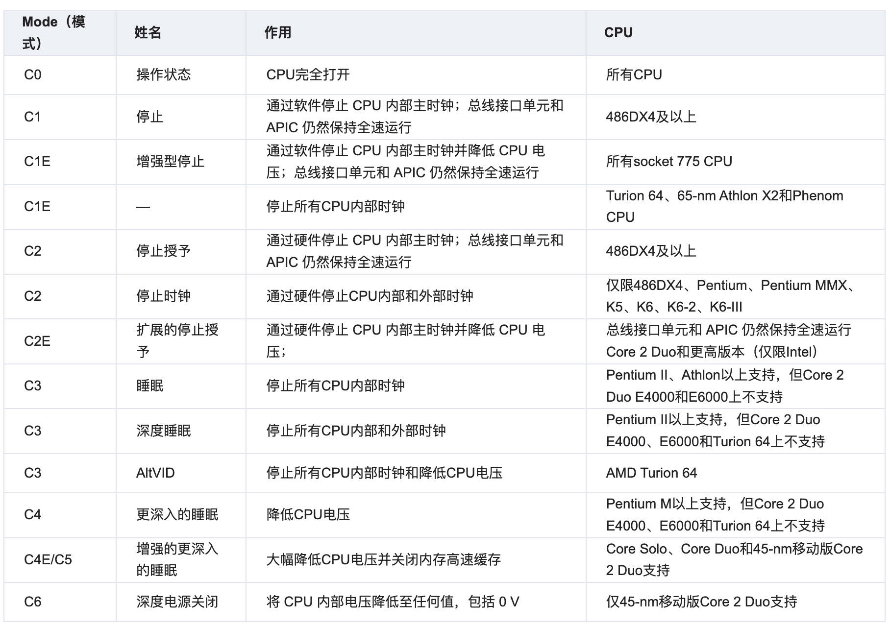

# csate 与 pstate
**CPU C-State（电源状态）详解**

C-State（C表示“Cpu idle state”）是 CPU 的一种电源管理机制，用于在 CPU 空闲时降低功耗。与 P-State（动态调频）不同，C-State 控制的是 CPU 核心的休眠深度，适用于 CPU 无任务执行时的节能优化。C-Stat 通过 Linux 内核的 cpuidle 子系统进行控制。

---

**1. C-State 基本概念**
**(1) C-State 等级**
C-State 通常用 C0, C1, C2, C3, ... 表示，数字越大，休眠越深，唤醒延迟越高：



> C-State 越深，省电效果越好，但唤醒延迟越高。

---

**2. C-State 的工作机制**
**(1) 操作系统调度**
• 当 CPU 无任务执行时，操作系统（如 Linux `cpuidle` 驱动）会选择合适的 C-State。

• `menu` / `teo` 调度器：根据历史负载预测空闲时间，选择最优 C-State。


**(2) BIOS 设置影响**
• `C-States`：在 BIOS 中可全局启用/禁用（如 `Disable C-States`）。

• `Package C-State`：控制整个 CPU 插槽的深度休眠（如 `C6`）。


**(3) 硬件支持**
• Intel：支持 C1~C10（如 Alder Lake 的 `C10`）。

• AMD：支持 C1~C6（Zen3+ 新增 `C7`）。


---

**3. 如何查看和调整 C-State**
**(1) 查看当前 C-State**
```bash
# 查看所有 CPU 的 C-State 使用统计
cat /sys/devices/system/cpu/cpuidle/current_driver  # 驱动类型（如 `acpi_idle`）
cat /sys/devices/system/cpu/cpu*/cpuidle/state*/name # 各状态名称
cat /sys/devices/system/cpu/cpu*/cpuidle/state*/time # 各状态驻留时间（μs）
```

**(2) 使用 `cpupower` 监控**
```bash
# 安装工具（Linux）
sudo apt install linux-tools-common cpupower

# 查看 C-State 统计
sudo cpupower idle-info
```
输出示例：
```
CPUidle driver: acpi_idle
CPUidle governor: menu
States:
C1-Halt (type: C1, latency: 1 ns, usage: 30%)
C2-Stop (type: C2, latency: 50 ns, usage: 15%)
C3-Sleep (type: C3, latency: 100 ns, usage: 5%)
```

**(3) 启用/禁用 C-State**
**方法 1：通过内核参数**
```bash
# 禁用 C6（在 GRUB 配置中添加）
sudo nano /etc/default/grub
GRUB_CMDLINE_LINUX="... processor.max_cstate=3"  # 限制到 C3
sudo update-grub && reboot
```

**方法 2：通过 `cpupower`**
```bash
# 禁用所有 C-State（仅用于调试）
sudo cpupower idle-set -D 0

# 恢复默认
sudo cpupower idle-set -E
```

---

**4. C-State 调优建议**
**(1) 服务器场景**
| 需求       | 推荐配置                     | 说明                     |
|---------------|--------------------------------|-----------------------------|
| 低延迟     | 禁用 C6/C7，限制到 C3           | 避免高唤醒延迟影响响应        |
| 高能效     | 启用全部 C-State + `ondemand`   | 空闲时深度节能                |
| 虚拟化     | 透传 C-State 控制给虚拟机        | 需 BIOS 支持                 |

**(2) 笔记本/移动设备**
• 启用 `C6`/`C7` 以延长续航。

• 避免禁用 `C-States`，否则待机功耗可能翻倍。


**(3) 性能关键型应用**
```bash
# 临时禁用深度 C-State（如游戏/实时计算）
echo 1 | sudo tee /sys/devices/system/cpu/cpu*/cpuidle/state3/disable
```

---

**5. 常见问题**
**Q1: C-State 会导致性能下降吗？**
• 正常情况：不会，C-State 仅在 CPU 空闲时激活。

• 问题场景：

  • 频繁唤醒（如 `C6` → `C0`）可能增加延迟。

  • BIOS 实现不佳时，可能导致 `C-State` 切换卡顿。


**Q2: 如何检查 C-State 是否生效？**
```bash
# 查看 C-State 驻留时间（单位：μs）
watch -n 1 "cat /sys/devices/system/cpu/cpu0/cpuidle/state*/time"
```

**Q3: 为什么 `C6` 无法启用？**
• 可能原因：

  • BIOS 中禁用（检查 `C-States` 和 `Package C-State`）。

  • 内核参数限制（如 `processor.max_cstate=3`）。


**Q4: C-State 和 Intel Speed Shift 的关系？**
• Speed Shift（HWP）：动态调频（P-State），不影响 C-State。

• 两者协同：HWP 调频 + C-State 休眠 = 最优能效。

## pstate
P-State（Performance State）是 CPU 的一种电源管理机制，用于动态调整处理器的工作频率和电压，以平衡性能与功耗。P-State 只针对 C0 状态下的 cpu，因为对于其他状态下的 cpu 来说，已经处于最低的功耗情况，不需要节能。

P-State 驱动通常与 cpu 调频子系统中的策略协同对 cpu 的频率进行调整来达到省电的目的。


**(2) C-State 与 P-State 的区别**
| 特性       | C-State                     | P-State                     |
|---------------|--------------------------------|--------------------------------|
| 控制对象   | CPU 核心休眠状态                | CPU 频率和电压                 |
| 触发条件   | CPU 空闲时进入                 | CPU 负载变化时调整             |
| 切换速度   | 较慢（纳秒~微秒级）             | 较快（微秒级）                 |
| 主要目标   | 降低待机功耗                    | 动态平衡性能与功耗              |
| 典型用途   | 服务器空闲、笔记本待机           | 高性能计算、实时任务            |

> P-State 适用于动态调频，C-State 适用于空闲时深度节能。
