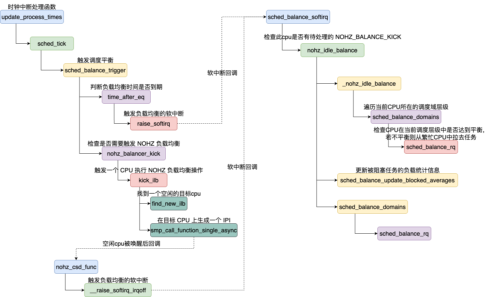
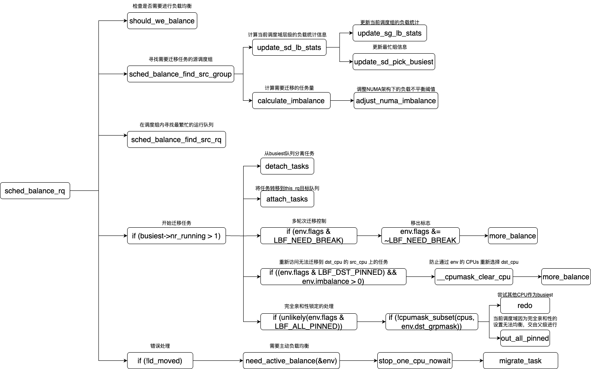

# CPU 负载均衡

对于 CPU 的负载均衡大致分为两种

1. 为空闲的 CPU 核从繁忙的 CPU 核中拉取任务执行。
2. 为刚被创建/唤醒的任务选取 CPU 核。

## 触发CPU主动负载均衡的时机

触发负载均衡的路径有三种，分别为周期性负载均衡、NOHZ负载均衡、newidle balance。 这里负载均衡采取的策略都是空闲的 CPU 在各个层级的调度域内从繁忙的 CPU 上主动拉取任务来达到调度域内的平衡。



### 周期性负载均衡

系统会随着CPU的时钟节拍周期性地触发负载均衡，在每次时钟中断的处理函数中会调用 sched_balance_trigger （原为 trigger_load_balance ）函数来进行负载均衡。

在这里会先判断当前时间已经达到或超过了下一次负载均衡的时间。如果达到了就触发 SCHED_SOFTIRQ 。最终在软中断函数中进行负载均衡处理。

并调用 nohz_balancer_kick 检查是否需要触发 NOHZ 负载均衡。

```c
void sched_balance_trigger(struct rq *rq)
{
	/*
	 * 如果运行队列附加到 NULL 域或运行队列的 CPU 未处于活动状态，
	 * 则不需要进行负载均衡。
	 */
	if (unlikely(on_null_domain(rq) || !cpu_active(cpu_of(rq))))
		return;

	/*
	 * 如果当前时间已经达到或超过了下一次负载均衡的时间，
	 * 则触发 SCHED_SOFTIRQ。
	 */
	if (time_after_eq(jiffies, rq->next_balance))
		raise_softirq(SCHED_SOFTIRQ);

	/*
	 * 检查是否需要触发 NOHZ 负载均衡。
	 */
	nohz_balancer_kick(rq);
}
```

### NOHZ 负载均衡

NOHZ 模式，是 Linux 内核的一项优化功能。传统的 Linux 内核会定期触发定时器中断，即使系统处于空闲状态。这种行为会导致 CPU 无法进入深度休眠状态，从而增加功耗。

NOHZ 模式如果启动的话当CPU在进入 idle 状态就会关闭时钟节拍，使得 CPU 能够进入深度休眠状态，从而降低功耗。只有在需要处理任务时，定时器中断才会重新启用。

但是对于普通的负载均衡来说需要由时钟CPU的时钟节，在 NOHZ 模式下关闭了时钟，那么处于深度休眠的 CPU 又如何能主动的从其他繁忙 CPU 上拉取任务来运行？在这里我们引入了 NOHZ 负载均衡。

对于一个CPU即将进入无时钟(tickless)空闲状态的 CPU 会将 has_blocked 设置为 1 ，以此表明有在 idle 中的 cpu 需要被唤醒执行任务。

```c
void nohz_balance_enter_idle(int cpu)
{
	struct rq *rq = cpu_rq(cpu);

	SCHED_WARN_ON(cpu != smp_processor_id());

	/* If this CPU is going down, then nothing needs to be done: */
	if (!cpu_active(cpu))
		return;

	rq->has_blocked_load = 1;

	if (rq->nohz_tick_stopped)
		goto out;

	if (on_null_domain(rq))
		return;

	rq->nohz_tick_stopped = 1;

	cpumask_set_cpu(cpu, nohz.idle_cpus_mask);
	atomic_inc(&nohz.nr_cpus);

	smp_mb__after_atomic();

	set_cpu_sd_state_idle(cpu);

	WRITE_ONCE(nohz.needs_update, 1);
out:
	WRITE_ONCE(nohz.has_blocked, 1);
}
```

在当前 CPU 进入时钟中断处理函数中后会检查该标志位是否被置位，如果被置位则调用 kick_ilb 函数。

```c
	// 如果需要更新负载均衡状态，则设置 NOHZ_NEXT_KICK 标志
	if (READ_ONCE(nohz.needs_update))
		flags |= NOHZ_NEXT_KICK;

	// 如果有需要触发的标志，则触发 ILB
	if (flags)
		kick_ilb(flags);
```

在 kick_ilb 函数中先会调用 find_new_ilb 找到一个在休眠中的 CPU，并调用 smp_call_function_single_async 在选定的空闲 CPU 上生成一个 IPI 将其唤醒。并且在从 IPI 返回之前会运行执行 NOHZ 空闲负载均衡的软中断。

```c
static void kick_ilb(unsigned int flags)
{
	int ilb_cpu;

	if (flags & NOHZ_BALANCE_KICK)
		nohz.next_balance = jiffies + 1;

	ilb_cpu = find_new_ilb();
	if (ilb_cpu < 0)
		return;

	if ((atomic_read(nohz_flags(ilb_cpu)) & flags) == flags)
		return;

	flags = atomic_fetch_or(flags, nohz_flags(ilb_cpu));

	if (flags & NOHZ_KICK_MASK)
		return;
	smp_call_function_single_async(ilb_cpu, &cpu_rq(ilb_cpu)->nohz_csd);
}
```

在 smp_call_function_single_async 中会回调到 nohz_csd_func 。该函数在 sched_init 时注册。

```c
//sched_init
#ifdef CONFIG_NO_HZ_COMMON
		rq->last_blocked_load_update_tick = jiffies;
		atomic_set(&rq->nohz_flags, 0);

		INIT_CSD(&rq->nohz_csd, nohz_csd_func, rq);
#endif
```

在 nohz_csd_func 中会调用 __raise_softirq_irqoff 函数来触发 SCHED_SOFTIRQ 中断。

### newidle balance

在 cpu 需要进行任务切换时，会选择下一个需要被调度上 CPU 的任务。这里的任务后首先从当前 CPU 的 rq 中选择，如果当前 CPU 的可运行任务队列中已经没有任务可以运行。那么就会触发负载均衡从其他繁忙的 CPU 上来取任务来执行。

>pick_next_task_fair -> sched_balance_newidle -> sched_balance_rq

如果拉取到任务，pick_next_task_fair 会重新 pick task，将拉取到的task调度上去。

```c
static int sched_balance_newidle(struct rq *this_rq, struct rq_flags *rf)
{
	unsigned long next_balance = jiffies + HZ; // 下一次负载均衡的时间
	int this_cpu = this_rq->cpu; // 当前 CPU
	int continue_balancing = 1; // 是否继续负载均衡
	u64 t0, t1, curr_cost = 0; // 记录负载均衡的时间开销
	struct sched_domain *sd; // 调度域
	int pulled_task = 0; // 是否成功拉取任务

	// 更新错配任务状态
	update_misfit_status(NULL, this_rq);

	/*
	 * 如果有任务等待运行，则无需搜索任务。
	 * 返回 0；任务将在切换到空闲状态时入队。
	 */
	if (this_rq->ttwu_pending)
		return 0;

	/*
	 * 必须在调用 sched_balance_rq() 之前设置 idle_stamp，
	 * 以便将此时段计为空闲时间。
	 */
	this_rq->idle_stamp = rq_clock(this_rq);

	/*
	 * 不要将任务拉向非活动 CPU...
	 */
	if (!cpu_active(this_cpu))
		return 0;

	/*
	 * 当前任务在 CPU 上运行，避免其被选中进行负载均衡。
	 * 同时中断/抢占仍然被禁用，避免进一步的调度器活动。
	 */
	rq_unpin_lock(this_rq, rf);

	rcu_read_lock();
	sd = rcu_dereference_check_sched_domain(this_rq->sd);

	/*
	 * 如果调度域未过载，或者当前 CPU 的平均空闲时间小于
	 * 调度域的最大负载均衡时间开销，则跳过负载均衡。
	 */
	if (!get_rd_overloaded(this_rq->rd) ||
		(sd && this_rq->avg_idle < sd->max_newidle_lb_cost)) {

		if (sd)
			update_next_balance(sd, &next_balance);
		rcu_read_unlock();

		goto out;
	}
	rcu_read_unlock();

	// 释放运行队列锁
	raw_spin_rq_unlock(this_rq);

	t0 = sched_clock_cpu(this_cpu); // 记录开始时间
	sched_balance_update_blocked_averages(this_cpu); // 更新阻塞任务的负载均衡统计

	rcu_read_lock();
	for_each_domain(this_cpu, sd) {
		u64 domain_cost;

		// 更新调度域的下一次负载均衡时间
		update_next_balance(sd, &next_balance);

		// 如果当前 CPU 的平均空闲时间不足以进行负载均衡，则停止
		if (this_rq->avg_idle < curr_cost + sd->max_newidle_lb_cost)
			break;

		// 如果调度域支持新空闲负载均衡，则尝试拉取任务
		if (sd->flags & SD_BALANCE_NEWIDLE) {

			pulled_task = sched_balance_rq(this_cpu, this_rq,
						   sd, CPU_NEWLY_IDLE,
						   &continue_balancing);

			t1 = sched_clock_cpu(this_cpu); // 记录结束时间
			domain_cost = t1 - t0; // 计算调度域的负载均衡时间开销
			update_newidle_cost(sd, domain_cost); // 更新调度域的负载均衡时间开销

			curr_cost += domain_cost; // 累加总开销
			t0 = t1; // 更新开始时间
		}

		/*
		 * 如果成功拉取任务，或者不需要继续负载均衡，则停止搜索任务。
		 */
		if (pulled_task || !continue_balancing)
			break;
	}
	rcu_read_unlock();

	// 重新获取运行队列锁
	raw_spin_rq_lock(this_rq);

	// 如果负载均衡时间开销超过当前运行队列的最大空闲负载均衡时间开销，则更新
	if (curr_cost > this_rq->max_idle_balance_cost)
		this_rq->max_idle_balance_cost = curr_cost;

	/*
	 * 在浏览调度域期间，我们释放了运行队列锁，可能有任务在此期间入队。
	 * 如果我们不再处于空闲状态，则假装我们拉取了一个任务。
	 */
	if (this_rq->cfs.h_nr_queued && !pulled_task)
		pulled_task = 1;

	/* 是否存在高优先级任务 */
	if (this_rq->nr_running != this_rq->cfs.h_nr_queued)
		pulled_task = -1;

out:
	/* 将下一次负载均衡时间向前移动 */
	if (time_after(this_rq->next_balance, next_balance))
		this_rq->next_balance = next_balance;

	// 如果成功拉取任务，则清除 idle_stamp，否则更新空闲负载均衡状态
	if (pulled_task)
		this_rq->idle_stamp = 0;
	else
		nohz_newidle_balance(this_rq);

	// 重新固定运行队列锁
	rq_repin_lock(this_rq, rf);

	return pulled_task;
}
```

### 处理 SCHED_SOFTIRQ 中断

SCHED_SOFTIRQ 软中断的中断处理函数是 sched_balance_softirq 。

```c
static __latent_entropy void sched_balance_softirq(void)
{
	struct rq *this_rq = this_rq();
	enum cpu_idle_type idle = this_rq->idle_balance;

	/*
	 * 如果此 CPU 有待处理的 NOHZ_BALANCE_KICK，则代表其他停止时钟的空闲 CPU
	 * 执行负载均衡。在执行 sched_balance_domains 之前进行 nohz_idle_balance，
	 * 以便空闲 CPU 有机会进行负载均衡。否则，如果我们拉取了一些负载，
	 * 可能只在本地调度域层次结构内进行负载均衡，并完全中止 nohz_idle_balance。
	 */
	if (nohz_idle_balance(this_rq, idle))
		return;

	sched_balance_update_blocked_averages(this_rq->cpu);
	sched_balance_domains(this_rq, idle);
}

```

在这里要先执行 sched_balance_update_blocked_averages 更新​​更新阻塞任务的负载贡献。

因为被阻塞的任务虽然不消耗CPU，但仍会保留在运行队列中，其历史负载会影响调度决策。

若仅根据任务当前状态（阻塞/运行）分配CPU时间可能会导致以下问题：

1. I/O密集型任务唤醒后会突然抢占大量CPU时间
2. CPU密集型任务可能因短期阻塞被不公平地降权

```c
static void sched_balance_update_blocked_averages(int cpu)
{
    // decayed: 标记是否有负载衰减需要处理
    // done: 标记是否所有调度类的更新都已完成
    bool decayed = false, done = true;
    struct rq *rq = cpu_rq(cpu);  // 获取指定CPU的运行队列
    struct rq_flags rf;           // 用于保存中断状态的标志

    /* 加锁并保存中断状态 */
    rq_lock_irqsave(rq, &rf);

    /* 基础更新 */
    update_blocked_load_tick(rq);  // 更新阻塞负载的时钟周期计数
    update_rq_clock(rq);          // 同步运行队列时钟

    /* 更新所有调度类的阻塞负载 */
    // 更新非CFS调度类（如RT、DL）的阻塞负载
    decayed |= __update_blocked_others(rq, &done);
    // 更新CFS调度类的阻塞负载（核心公平调度器）
    decayed |= __update_blocked_fair(rq, &done);

    /* 后续处理 */
    update_blocked_load_status(rq, !done);  // 更新阻塞负载状态标志
    if (decayed)
        cpufreq_update_util(rq, 0);  // 若负载变化，通知CPU频率调节器

    /* 释放锁并恢复中断状态 */
    rq_unlock_irqrestore(rq, &rf);
}
```

在 sched_balance_domains 会遍历当前 CPU 所有的调度域。

```c
/**
 * sched_balance_domains - 在指定CPU的调度域层次结构中执行负载均衡
 * @rq: 目标CPU的运行队列
 * @idle: 标识CPU是否空闲（CPU_IDLE/CPU_NOT_IDLE）
 *
 * 该函数通过遍历CPU的调度域（从最底层到顶层），逐级检查并执行负载均衡。
 * 核心逻辑包括：负载均衡间隔控制、跨域任务迁移、串行化保护等。
 */
static void sched_balance_domains(struct rq *rq, enum cpu_idle_type idle)
{
    int continue_balancing = 1;      // 是否继续向更高层调度域执行均衡
    int cpu = rq->cpu;               // 当前CPU编号
    // 判断CPU是否繁忙：非空闲且非调度器定义的空闲状态
    int busy = idle != CPU_IDLE && !sched_idle_cpu(cpu);
    unsigned long interval;          // 当前调度域的均衡间隔时间
    struct sched_domain *sd;         // 当前遍历的调度域指针
    /* 下次必须执行均衡的最早时间（默认60秒后） */
    unsigned long next_balance = jiffies + 60*HZ;
    int update_next_balance = 0;     // 是否需要更新rq->next_balance
    int need_serialize, need_decay = 0;
    u64 max_cost = 0;                // 记录跨域均衡的最大成本

    /* 开始RCU安全遍历调度域 */
    rcu_read_lock();
    // 从下至上遍历CPU所属的所有调度域（如SMT->MC->NUMA）
    for_each_domain(cpu, sd) {
        /*
         * 衰减newidle状态的最大均衡成本值，因为这是对调度域的常规访问。
         * 返回值表示是否需要衰减rq->max_idle_balance_cost
         */
        need_decay = update_newidle_cost(sd, 0);
        max_cost += sd->max_newidle_lb_cost; // 累加各层均衡成本

        /* 
         * 如果上层调度域已无需均衡：
         * - 若当前域不需要衰减成本，直接退出循环
         * - 否则继续循环以处理成本衰减
         */
        if (!continue_balancing) {
            if (need_decay)
                continue;
            break;
        }

        /* 获取当前调度域的负载均衡间隔（繁忙时用更短间隔） */
        interval = get_sd_balance_interval(sd, busy);

        /* 检查当前域是否需要串行化执行（SD_SERIALIZE标志） */
        need_serialize = sd->flags & SD_SERIALIZE;
        if (need_serialize) {
            // 尝试获取全局均衡锁（防止多CPU同时操作同域）
            if (atomic_cmpxchg_acquire(&sched_balance_running, 0, 1))
                goto out; // 获取锁失败则跳过当前域
        }

        /* 检查是否到达当前调度域的均衡时间点 */
        if (time_after_eq(jiffies, sd->last_balance + interval)) {
            /* 执行实际负载均衡（核心函数） */
            if (sched_balance_rq(cpu, rq, sd, idle, &continue_balancing)) {
                /*
                 * 如果发生了任务迁移：
                 * - 重新检查CPU的空闲状态（LBF_DST_PINNED可能改变目标CPU）
                 * - 更新busy状态标志
                 */
                idle = idle_cpu(cpu);
                busy = !idle && !sched_idle_cpu(cpu);
            }
            sd->last_balance = jiffies; // 记录本次均衡时间
            interval = get_sd_balance_interval(sd, busy); // 重新计算间隔
        }

        /* 释放串行化锁（如果之前获取了） */
        if (need_serialize)
            atomic_set_release(&sched_balance_running, 0);

out:
        /* 更新全局下次均衡时间（取所有域的最早时间） */
        if (time_after(next_balance, sd->last_balance + interval)) {
            next_balance = sd->last_balance + interval;
            update_next_balance = 1;
        }
    }

    /* 处理成本衰减（如果需要） */
    if (need_decay) {
        /*
         * 确保rq->max_idle_balance_cost也衰减，但保持合理下限：
         * - 下限为sysctl_sched_migration_cost（避免rq->avg_idle异常）
         * - 取当前各域max_cost的最大值
         */
        rq->max_idle_balance_cost =
            max((u64)sysctl_sched_migration_cost, max_cost);
    }
    rcu_read_unlock(); // 结束RCU临界区

    /* 
     * 仅在需要时更新next_balance：
     * - 例如当CPU附加到null域时不会更新
     */
    if (likely(update_next_balance))
        rq->next_balance = next_balance;
}
```

## 负载均衡的核心函数 sched_balance_rq

负载均衡的核心函数为 sched_balance_rq。

在该函数中进行了如下工作：



### 1.判断当前 CPU 是否需要进行负载均衡 

由函数 should_we_balance 检查是否需要进行负载均衡，这里需要检查以下几个场景：

|场景 | 触发条件 | 典型触发路径 | 优先级 |
|----|----|----|----|
|新空闲CPU| CPU刚空闲且无待处理任务| 任务退出/定时器中断检测| 最高|
|完全空闲核心| 非SMT域中所有硬件线程空闲| MC/NUMA层均衡| 高|
|部分空闲SMT核心| SMT域中核心有忙碌线程，当前是第一个空闲SMT| SMT层均衡| 中|
|组首选CPU| 无其他匹配条件，当前CPU是组内首选| 热插拔/隔离后的回退机制| 低|

```c
static int should_we_balance(struct lb_env *env)
{
    // 获取每CPU变量，用于临时存储需要检查的CPU掩码
    struct cpumask *swb_cpus = this_cpu_cpumask_var_ptr(should_we_balance_tmpmask);
    struct sched_group *sg = env->sd->groups; // 当前调度组的第一个组
    int cpu, idle_smt = -1; // idle_smt记录忙碌核心中的第一个空闲SMT CPU

    /*
     * 环境一致性检查：当软中断触发期间发生CPU热插拔时，
     * 目标CPU可能已被移出均衡集合
     */
    if (!cpumask_test_cpu(env->dst_cpu, env->cpus))
        return 0;

    //新空闲(CPU_NEWLY_IDLE)场景的特殊处理：
    if (env->idle == CPU_NEWLY_IDLE) {
        if (env->dst_rq->nr_running > 0 || env->dst_rq->ttwu_pending)
            return 0;
        return 1; // 满足新空闲均衡条件
    }

    /* 常规负载均衡场景的处理逻辑 */
    cpumask_copy(swb_cpus, group_balance_mask(sg)); // 复制调度组的均衡CPU掩码

    /* 遍历候选CPU，从调度组中找到第一个idle的cpu */
    for_each_cpu_and(cpu, swb_cpus, env->cpus) {
        if (!idle_cpu(cpu)) // 跳过非空闲CPU
            continue;

        /*
         * 核心级均衡的特殊处理（非SMT共享域）：
         * - 当发现一个忙碌核心中的空闲SMT CPU时：
         *   a) 先记录第一个空闲SMT CPU（idle_smt）
         *   b) 跳过该核心的其他SMT CPU检查（通过掩码删除）
         * - 优先寻找完全空闲的核心
         */
        if (!(env->sd->flags & SD_SHARE_CPUCAPACITY) && !is_core_idle(cpu)) {
            if (idle_smt == -1)
                idle_smt = cpu; // 记录第一个空闲SMT CPU
#ifdef CONFIG_SCHED_SMT
            // 从检查掩码中移除该SMT核心的所有CPU
            cpumask_andnot(swb_cpus, swb_cpus, cpu_smt_mask(cpu));
#endif
            continue;
        }

        /*
         * 满足以下条件时立即返回：
         * - 对于非SMT域或更高层级：当前是域内第一个空闲核心
         * - 对于SMT域：当前是域内第一个空闲CPU
         */
        return cpu == env->dst_cpu;
    }

    /* 如果存在忙碌核心中的空闲SMT CPU，检查是否为目标CPU */
    if (idle_smt != -1)
        return idle_smt == env->dst_cpu;

    /* 默认情况：检查目标CPU是否为调度组的首选均衡CPU */
    return group_balance_cpu(sg) == env->dst_cpu;
}
```
### 2.寻找需要迁移任务的源调度组与源队列

sched_balance_find_src_group 函数用于寻找当前调度域中需要迁移的调度组。下面是一张决策表

busiest \ local​|has_spare ​|fully_busy ​|misfit ​|asym ​|imbalanced ​|overloaded​|
|----|----|----|----|----|----|----|
|has_spare        |nr_idle   |balanced   |N/A    |N/A  |balanced   |balanced|
|fully_busy       |nr_idle   |nr_idle    |N/A    |N/A  |balanced   |balanced|
|misfit_task      |force     |N/A        |N/A    |N/A  |N/A        |N/A|
|asym_packing     |force     |force      |N/A    |N/A  |force      |force|
|imbalanced       |force     |force      |N/A    |N/A  |force      |force|
|overloaded       |force     |force      |N/A    |N/A  |force      |avg_load|

表格含义：

busiest是指要对比的调度组，local是当前调度组（本cpu核所在的），表中的第一行/列代表调度组的类型

 * N/A :      不适用，因为在更新统计信息时已经过滤掉。
 * balanced : 系统在这两个组之间是平衡的。
 * force :    计算不平衡，因为可能需要进行负载迁移。
 * avg_load : 仅当不平衡显著时才进行处理。
 * nr_idle :  dst_cpu 不繁忙，并且组之间的空闲 CPU 数量差异较大。

在这里需要比较 local group 跟 busiest group 之间的负载差异，再两者之间尽量做均衡。只有 local group 比 busiest group 更空闲时才会进行迁移。因为只能是 local group 拉 busiest group，如果 local group 忙于 busiest group，那么即使不平衡也只能当作平衡对待。

在这里使用 group_type 来表示调度组现在忙的状态：

```c
enum group_type {
	group_has_spare = 0,
	group_fully_busy,
	group_misfit_task,
	group_smt_balance,
	group_asym_packing,
	group_imbalanced,
	group_overloaded
};
```

​|枚举值​​ |​优先级​​	​|​状态描述​​	​|​触发条件​​	|​​典型场景​​	​|​负载均衡动作​​|
|----|----|----|----|----|----|----|
|group_has_spare|	0（最低）	|组内有空闲算力可运行更多任务|	组内空闲CPU占比较高（如idle_cpus > group_weight/2）	|4核CPU组中有2个空闲核	|接收其他组迁移来的任务|
|group_fully_busy|1	|组内CPU全忙但无资源竞争|	所有CPU的nr_running > 0且无等待任务	|每个CPU运行1个非CPU密集型任务|	通常不触发迁移|
|group_misfit_task|	2	|存在任务超出当前CPU算力|	任务需求 > CPU最大能力（rq->misfit_task_load被设置）|	视频编码任务运行在手机小核上	|​​必须​​迁移至更强CPU（如小核→大核）
|group_smt_balance|	3	|需要优化SMT超线程组的负载|	物理核的所有超线程都忙，且系统有空闲物理核|	Intel CPU双超线程100%负载，另一物理核空闲|迁移任务至空闲物理核缓解争用|
|group_asym_packing|	4	|存在高性能闲置CPU（需SD_ASYM_PACKING标志）|	大核空闲时，小核仍有任务运行	|ARM big.LITTLE架构中大核空闲	|将任务"打包"到大核以提高性能|
|group_imbalanced|	5	|因任务亲和性限制导致负载不均|	任务被cpuset或sched_setaffinity限制到部分CPU	|数据库进程绑定到前4核导致后4核闲置|	尝试突破亲和性限制做强制均衡|
|group_overloaded|	6（最高）	|CPU过载无法满足任务需求|	运行队列中有多个任务等待（sum_nr_running > 1）	|单核上运行10个计算密集型线程|	分散任务到其他组|

这些值由 update_sg_lb_stats 计算得出，通过比较大小来确定busy程度，越大越忙。在update_sd_pick_busiest中会用到这一点来选出最忙的组。

在 update_sd_lb_stats 函数中会遍历当前调度域中的所有调度组，并调用 update_sg_lb_stats 函数来计算 busy 的程度。

```c
//update_sd_lb_stats(struct lb_env *env, struct sd_lb_stats *sds)

    /* 遍历调度域中的所有调度组 */
    do {
        struct sg_lb_stats *sgs = &tmp_sgs;    // 默认使用临时统计存储
        int local_group;                       // 标记当前组是否为本地组

        /* 检查当前CPU是否属于该调度组 */
        local_group = cpumask_test_cpu(env->dst_cpu, sched_group_span(sg));
        if (local_group) {
            sds->local = sg;                   // 记录本地组指针
            sgs = local;                       // 直接使用本地组统计存储

            /* 更新本地组容量（新空闲状态或达到更新周期时） */
            if (env->idle != CPU_NEWLY_IDLE ||
                time_after_eq(jiffies, sg->sgc->next_update))
                update_group_capacity(env->sd, env->dst_cpu);
        }

        /* 更新当前调度组的负载统计 */
        update_sg_lb_stats(env, sds, sg, sgs, &sg_overloaded, &sg_overutilized);

        /* 如果是非本地组且比当前最忙组更繁忙，更新最忙组信息 */
        if (!local_group && update_sd_pick_busiest(env, sds, sg, sgs)) {
            sds->busiest = sg;
            sds->busiest_stat = *sgs;          // 复制统计信息
        }

        /* 累加全局统计信息 */
        sds->total_load += sgs->group_load;    // 总负载
        sds->total_capacity += sgs->group_capacity; // 总容量
        sum_util += sgs->group_util;           // 总利用率

        sg = sg->next;                         // 移动到下一个调度组
    } while (sg != env->sd->groups);           // 直到遍历完所有组

```

在 update_sg_lb_stats 函数中主要计算了以下值：

|统计项	|计算方式	|作用|
|---|---|---|
|group_load	|累加组内所有 CPU 的 cpu_load(rq)（CFS 运行队列负载）|	反映调度组的​​总负载压力|​​
|group_util	|累加组内所有 CPU 的 cpu_util_cfs(i)（CFS 利用率）|	衡量 CPU 资源实际使用率|
|group_runnable	|累加组内所有 CPU 的 cpu_runnable(rq)（可运行时间）|	表示任务等待执行的累积时间|
|sum_nr_running	|累加组内所有 CPU 的 rq->nr_running（运行队列中的任务数）|	统计组内​​总任务数量​|​
|sum_h_nr_running	|累加组内所有 CPU 的 rq->cfs.h_nr_runnable（CFS 可运行任务数）|	专用于 CFS 调度类的任务计数|

```c
/**
 * update_sg_lb_stats - 更新调度组的负载均衡统计信息
 * @env: 负载均衡环境变量
 * @sds: 包含本地组统计信息的负载均衡数据
 * @group: 需要更新统计信息的调度组
 * @sgs: 用于存储该调度组统计信息的变量
 * @sg_overloaded: 标记调度组是否过载
 * @sg_overutilized: 标记调度组是否过度利用
 *
 * 此函数遍历调度组中的所有CPU，收集负载、利用率、运行任务数量等关键指标，
 * 并根据调度组的状态更新相关标志，为后续的负载均衡决策提供数据支持。
 */
static inline void update_sg_lb_stats(struct lb_env *env,
					  struct sd_lb_stats *sds,
					  struct sched_group *group,
					  struct sg_lb_stats *sgs,
					  bool *sg_overloaded,
					  bool *sg_overutilized)
{
	int i, nr_running, local_group, sd_flags = env->sd->flags;
	bool balancing_at_rd = !env->sd->parent; // 是否在根域进行负载均衡

	memset(sgs, 0, sizeof(*sgs)); // 初始化调度组统计信息

	local_group = group == sds->local; // 判断是否为本地组

	// 遍历调度组中的所有CPU
	for_each_cpu_and(i, sched_group_span(group), env->cpus) {
		struct rq *rq = cpu_rq(i); // 获取运行队列
		unsigned long load = cpu_load(rq); // 获取CFS调度组的负载

		sgs->group_load += load; // 累计调度组的总负载
		sgs->group_util += cpu_util_cfs(i); // 累计调度组的总利用率
		sgs->group_runnable += cpu_runnable(rq); // 累计调度组的总可运行时间
		sgs->sum_h_nr_running += rq->cfs.h_nr_runnable; // 累计CFS任务数量

		nr_running = rq->nr_running; // 获取运行队列中的任务数量
		sgs->sum_nr_running += nr_running; // 累计调度组的总任务数量

		// 检查CPU是否过度利用
		if (cpu_overutilized(i))
			*sg_overutilized = 1;

		// 如果运行队列中没有任务且CPU空闲，则增加空闲CPU计数
		if (!nr_running && idle_cpu(i)) {
			sgs->idle_cpus++;
			// 空闲CPU不可能有不匹配任务
			continue;
		}

		// 仅在根域更新过载指示器
		if (balancing_at_rd && nr_running > 1)
			*sg_overloaded = 1;

#ifdef CONFIG_NUMA_BALANCING
		// 如果启用了NUMA负载均衡，更新NUMA相关统计信息
		if (sd_flags & SD_NUMA) {
			sgs->nr_numa_running += rq->nr_numa_running;
			sgs->nr_preferred_running += rq->nr_preferred_running;
		}
#endif
		// 如果是本地组，跳过以下检查
		if (local_group)
			continue;

		// 检查是否存在不匹配任务
		if (sd_flags & SD_ASYM_CPUCAPACITY) {
			if (sgs->group_misfit_task_load < rq->misfit_task_load) {
				sgs->group_misfit_task_load = rq->misfit_task_load;
				*sg_overloaded = 1;
			}
		} else if (env->idle && sched_reduced_capacity(rq, env->sd)) {
			// 检查是否有任务运行在容量受限的CPU上
			if (sgs->group_misfit_task_load < load)
				sgs->group_misfit_task_load = load;
		}
	}

	sgs->group_capacity = group->sgc->capacity; // 更新调度组的总容量

	sgs->group_weight = group->group_weight; // 更新调度组的权重

	// 检查目标CPU是否空闲且优于当前组
	if (!local_group && env->idle && sgs->sum_h_nr_running &&
		sched_group_asym(env, sgs, group))
		sgs->group_asym_packing = 1;

	// 检查是否需要平衡加载的SMT组
	if (!local_group && smt_balance(env, sgs, group))
		sgs->group_smt_balance = 1;

	sgs->group_type = group_classify(env->sd->imbalance_pct, group, sgs); // 分类调度组类型

	// 仅在调度组过载时计算平均负载
	if (sgs->group_type == group_overloaded)
		sgs->avg_load = (sgs->group_load * SCHED_CAPACITY_SCALE) /
				sgs->group_capacity;
}
```

### 3.进行任务迁移

在任务迁移的过程中有如下过程：

1. 从busiest队列分离任务 detach_tasks
2. 将分离的任务附加到目标队列 attach_tasks
3. 检查 LBF_NEED_BREAK 等标志并对此做出处理
4. 错误处理


这里在迁移时有四种状态：

**LBF_NEED_BREAK**

表示中场休息的，其实还没有迁移完，所以这时候只是释放rq锁，然后再回去重新来迁移进程。

设置任务迁移的标志：

```c
  // detach_tasks
		/* 每迁移 nr_migrate 个任务后休息一下 */
		if (env->loop > env->loop_break) {
			env->loop_break += SCHED_NR_MIGRATE_BREAK; // 更新下一个休息点
			env->flags |= LBF_NEED_BREAK; // 设置需要休息的标志
			break; // 退出循环，进行休息
		}
```

为什么需要这样做？

1. 避免长时间持有资源锁：迁移进程通常涉及对资源（如 rq 锁，即运行队列锁）的操作。如果迁移过程耗时较长，长时间持有锁可能会导致其他任务无法访问这些资源，从而影响系统的整体性能和响应能力。通过 LBF_NEED_BREAK 释放锁，可以让其他任务有机会获取资源，避免锁竞争导致的性能瓶颈。

2. 提高系统的实时性：在多任务系统中，实时性是一个重要的指标。长时间的迁移操作可能会阻塞其他任务的调度，影响系统的实时性。通过引入中场休息机制，系统可以在迁移过程中暂停，处理其他更紧急的任务，然后再继续迁移。这种设计可以提高系统的响应速度和实时性。

3. 动态调整迁移策略：迁移进程的条件可能会随着系统状态的变化而改变。例如，负载分布、任务优先级或资源使用情况可能在迁移过程中发生变化。通过中场休息重新评估迁移条件，可以确保迁移策略始终符合当前系统的最佳状态，避免不必要的迁移或错误的决策。

对于 LBF_NEED_BREAK 这个参数的处理只需要跳转回函数开始任务迁移的开头处就可以了。

```c
// sched_balance_rq
		if (env.flags & LBF_NEED_BREAK) {
			env.flags &= ~LBF_NEED_BREAK;
			goto more_balance;
		}
```

**LBF_DST_PINNED**

表示目标 CPU 不兼容​，当尝试将任务从源 CPU（busiest）迁移到​​原定目标 CPU（env.dst_cpu）​​时，发现该任务的 CPU 亲和性（p->cpus_ptr）​​不包含 env.dst_cpu​​，但存在同组内其他合法 CPU。此时应该重新筛选目标 CPU。

```c
// can_migrate_task

		/*
		 * 记录该任务是否可以迁移到调度组中的其他CPU。
		 * 如果无法通过迁移src_cpu上的其他任务来满足负载均衡目标，
		 * 我们可能需要重新考虑迁移该任务。
		 *
		 * 避免在以下情况下计算new_dst_cpu：
		 * - NEWLY_IDLE状态
		 * - 当前迭代中已经计算过一个目标CPU
		 * - 处于主动负载均衡状态
		 */
		if (env->idle == CPU_NEWLY_IDLE ||
			env->flags & (LBF_DST_PINNED | LBF_ACTIVE_LB))
			return 0;
    // 遍历 CPU 找到新的目标 CPU
		for_each_cpu_and(cpu, env->dst_grpmask, env->cpus) {
			if (cpumask_test_cpu(cpu, p->cpus_ptr)) {//cpumask_test_cpu 检查目标 CPU 是否在任务的亲和性掩码
				env->flags |= LBF_DST_PINNED;
				env->new_dst_cpu = cpu;
				break;
			}
		}

```

在 can_migrate_task 中已经找到新的目标 cpu 这里只需要重新设置一下各个参数就行了。

```c
// sched_balance_rq
		if ((env.flags & LBF_DST_PINNED) && env.imbalance > 0) {

			/* 防止通过 env 的 CPUs 重新选择 dst_cpu */
			__cpumask_clear_cpu(env.dst_cpu, env.cpus);

			env.dst_rq	 = cpu_rq(env.new_dst_cpu);
			env.dst_cpu	 = env.new_dst_cpu;
			env.flags	&= ~LBF_DST_PINNED;
			env.loop	 = 0;
			env.loop_break	 = SCHED_NR_MIGRATE_BREAK;

			/*
			 * 返回 "more_balance" 而不是 "redo"，因为需要继续处理同一个 src_cpu。
			 */
			goto more_balance;
		}
```

**LBF_SOME_PINNED**

在源 CPU（busiest）上存在​​至少一个任务因亲和性无法迁移到任何目标 CPU​​，但其他任务可以迁移。该情况要让父调度域去解决。

这里同样要经过 cpumask_test_cpu 的检查。

```c
// can_migrate_task
if (!cpumask_test_cpu(env->dst_cpu, p->cpus_ptr))
```

对于 LBF_SOME_PINNED 标志会标记 group_imbalance 交由父级的调度域处理。

```c
// sched_balance_rq
		/*
		 * 由于任务的亲和性，我们未能达到平衡。
		 */
		if (sd_parent) {
			int *group_imbalance = &sd_parent->groups->sgc->imbalance;

			if ((env.flags & LBF_SOME_PINNED) && env.imbalance > 0)
				*group_imbalance = 1;
		}
```

**LBF_ALL_PINNED**

在源 CPU（busiest）上的全部任务都设置了亲和性无法被迁移。

在开始进行任务迁移时会先进行置位，之后在任务迁移的过程中会调用 can_migrate_task 函数，如果能找到大于等于一个可以迁移的任务，就移除这个标志位。

```c
//can_migrate_task
/* Record that we found at least one task that could run on dst_cpu */
	env->flags &= ~LBF_ALL_PINNED;
```

```c
		if (unlikely(env.flags & LBF_ALL_PINNED)) {
			__cpumask_clear_cpu(cpu_of(busiest), cpus);
			/*
       * 检查当前调度组内是否还有活跃的 CPU 可以作为目标cpu拉取任务，如果可用则返回开头继续，否则结束
			 */
			if (!cpumask_subset(cpus, env.dst_grpmask)) {
				env.loop = 0;
				env.loop_break = SCHED_NR_MIGRATE_BREAK;
				goto redo;
			}
			goto out_all_pinned;
		}

  /*
	 * 我们达到平衡，因为所有任务在此级别都被固定，
	 * 因此无法迁移它们。让不平衡标志保持设置，
	 * 以便父级可以尝试迁移它们。
	 */
	schedstat_inc(sd->lb_balanced[idle]);

	sd->nr_balance_failed = 0;
```

### 4.错误处理

**1. 负载均衡失败统计**

```c
if (!ld_moved) 
    schedstat_inc(sd->lb_failed[idle]);
```

ld_moved：是一个全局或累计变量，用于记录总共迁移成功的任务数量，如果为0表示迁移失败）

在迁移过程中会对迁移成功的任务数量进行累加：

```c
if (cur_ld_moved) {
			attach_tasks(&env);
			ld_moved += cur_ld_moved;
		}
```

**2. 统计失败次数**

通过schedstat_inc()递增schedstat调试计数器

区分不同CPU空闲状态（CPU_NEWLY_IDLE或常规空闲）
条件性失败计数

```c
if (idle != CPU_NEWLY_IDLE &&
    env.migration_type != migrate_misfit)
    sd->nr_balance_failed++;
```
排除场景：

新空闲CPU的首次尝试（CPU_NEWLY_IDLE）

非负载/利用率迁移（如migrate_misfit，指任务与CPU算力不匹配）

目的：避免短暂失败污染计数器，导致过度迁移

**3.主动负载均衡触发**
```c
if (need_active_balance(&env)) {
    // 获取目标运行队列锁
    raw_spin_rq_lock_irqsave(busiest, flags);

    if (!cpumask_test_cpu(this_cpu, busiest->curr->cpus_ptr)) {
        raw_spin_rq_unlock_irqrestore(busiest, flags);
        goto out_one_pinned;
```
need_active_balance()：检查是否需要强制迁移

条件：存在严重不平衡且常规迁移失败

关键检查：

确认目标任务允许迁移到当前CPU（cpus_ptr掩码检查）

如果禁止迁移，跳转到out_one_pinned标记的清理代码
启动主动负载均衡

```c
if (!busiest->active_balance) {
    busiest->active_balance = 1;
    busiest->push_cpu = this_cpu;
    active_balance = 1;
```
原子标记：设置active_balance标志防止重复触发

目标CPU：记录待迁移的目标CPU（push_cpu）
异步迁移任务

```c
stop_one_cpu_nowait(cpu_of(busiest),
    active_load_balance_cpu_stop, busiest,
    &busiest->active_balance_work);
```
异步执行：在繁忙CPU上调度active_load_balance_cpu_stop工作队列


## migration线程

migration线程是用于进行处理主动负载均衡的一个内核线程。

为什么需要主动均衡？​​
​
1. ​常规均衡的局限性​​：
   * ​任务执行导致无法迁移​​：常规均衡（如 detach_tasks）只能迁移 ​​就绪态任务​​（在运行队列中等待的任务）。如果源CPU的任务 ​​正在执行​​（busiest->curr），常规均衡无法直接迁移它。例如一个CPU密集型任务长时间占用源CPU，导致调度器没有机会将其移出。
	* ​锁竞争或延迟问题​​：常规均衡可能在分离任务时因锁冲突失败（如 rq->lock 竞争）。
2. 目标CPU闲置的浪费​​
   如果目标CPU持续空闲，而源CPU因任务卡住无法释放负载，会导致​系统吞吐量下降​​​​。

主动均衡如何解决问题？

通过 ​​强制迁移源CPU的当前任务​​：

​1. ​异步抢占机制​​：

调用 stop_one_cpu_nowait() 向源CPU发送 ​​处理器间中断（IPI）​​，强制其执行active_load_balance_cpu_stop。
该函数会抢占当前任务，将其从源CPU迁移到目标CPU（通过 migrate_task_to）。

​2. ​绕过常规限制​​：

主动均衡直接操作 ​​运行中任务​​，而常规均衡只能操作就绪队列中的任务。类似于“强制驱逐”繁忙CPU的任务。


