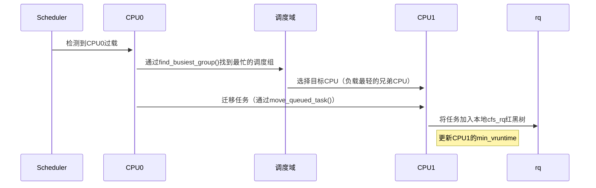

### CPU 负载均衡

场景：多核系统中任务迁移时选择目标 CPU。  

PELT 会比较各 CPU 的 cfs_rq->avg.util_avg，选择最空闲的 CPU。  

避免 CPU 过载或空闲不均。  

代码路径：  

    find_idlest_cpu() -> compare util_avg of cfs_rqs
  
  在 Linux 内核的调度器中，调度域（sched_domain）是用于描述 CPU 之间关系的抽象结构，主要用于实现多核系统中的负载均衡。调度域的层次结构反映了系统中 CPU 的拓扑结构，不同的层次表示不同的 CPU 共享资源的范围。

MC 层（Multi-Core 层）
定义: MC 层表示同一个物理 CPU 中的多个核心（Core）。在现代多核处理器中，一个物理 CPU 通常包含多个核心，这些核心可能共享某些硬件资源，例如 L2 缓存。
特点:
同一个 MC 层的核心通常共享中等粒度的硬件资源（如 L2 缓存）。
负载均衡的目标是尽量在同一个 MC 层内的核心之间分配任务，以减少跨物理 CPU 的通信开销。
典型场景:
在一个物理 CPU 内的多个核心之间进行任务分配。
适用于多核处理器（如 Intel Core i 系列或 AMD Ryzen 系列）。
DIE 层
定义: DIE 层表示同一个处理器芯片（Die）上的所有核心。一个处理器芯片可能包含多个物理 CPU（Socket），每个物理 CPU 又包含多个核心。
特点:
同一个 DIE 层的核心通常共享更大粒度的硬件资源（如 L3 缓存或内存控制器）。
负载均衡的目标是尽量在同一个 DIE 层内分配任务，以减少跨芯片的通信开销。
典型场景:
在一个处理器芯片上的所有核心之间进行任务分配。
适用于单芯片多核处理器（如单路服务器或桌面处理器）。
MC 层和 DIE 层的区别
属性	MC 层	DIE 层
范围	同一个物理 CPU 内的多个核心	同一个处理器芯片上的所有核心
共享资源	L2 缓存、部分内部总线	L3 缓存、内存控制器、芯片互联
负载均衡目标	在同一个物理 CPU 内分配任务	在同一个芯片内分配任务
通信开销	较低	较高（但低于跨芯片通信）