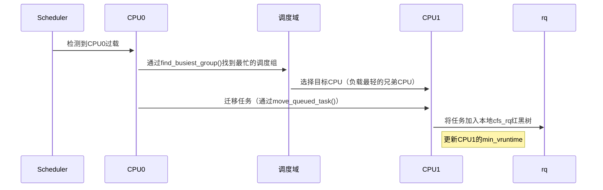

```mermaid
sequenceDiagram
    Scheduler->>+CPU0: 检测到CPU0过载
    CPU0->>+调度域: 通过find_busiest_group()找到最忙的调度组
    调度域->>+CPU1: 选择目标CPU（负载最轻的兄弟CPU）
    CPU0->>CPU1: 迁移任务（通过move_queued_task()）
    CPU1->>rq: 将任务加入本地cfs_rq红黑树
    Note right of CPU1: 更新CPU1的min_vruntime
```