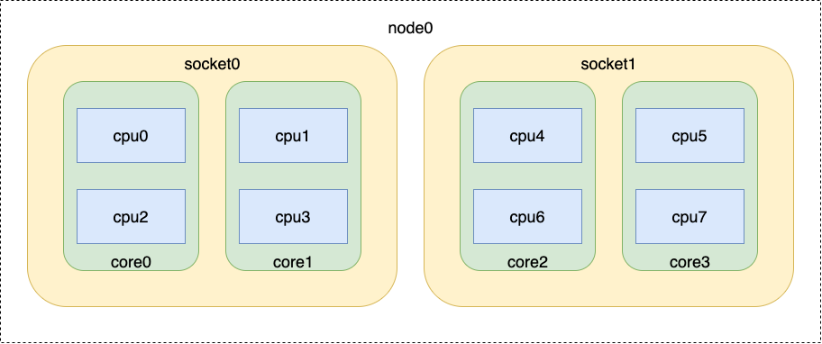
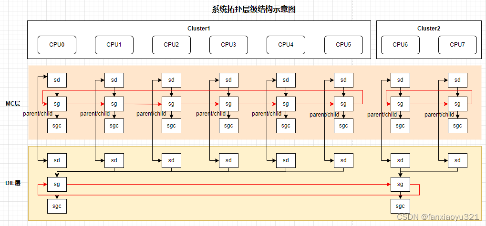
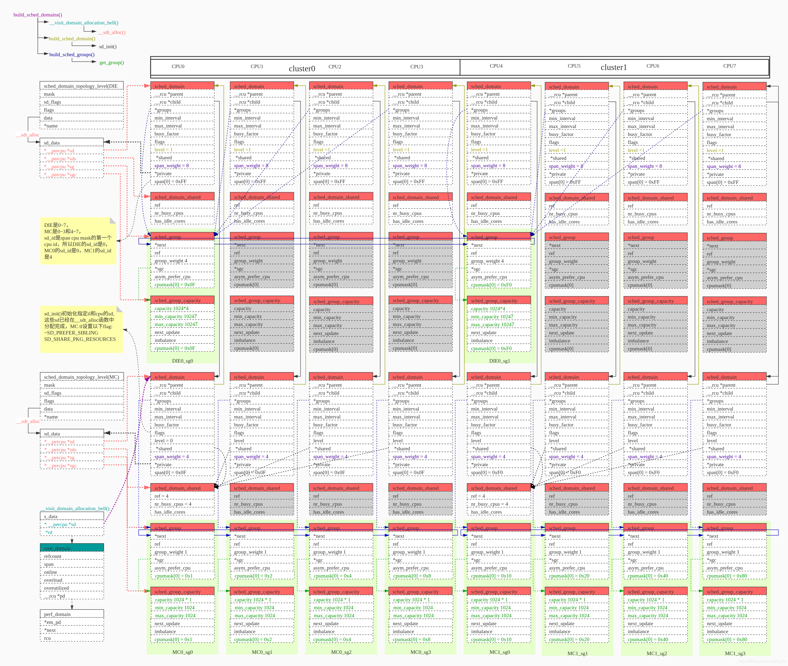

# 调度域 

调度域是指一组具有相似特性的CPU集合，调度器在这些CPU之间进行负载均衡和任务迁移时采用相同的策略。调度域通常按照处理器拓扑结构进行分层组织。



这里划分为四层：

1. SMT 层: 同一个核心上的线程。
2. MC 层: 同一个 core 上的多个核心。
3. DIE 层: 同一个插槽/簇上的所有核心。
4. NUMA 层: 跨 NUMA 节点的核心。

## 相关的结构体

### sched_domain_topology_level

在内核中调度域之间形成了一个层级关系，sched_domain_topology_level 结构用来记录其中一层结构的信息。

```c
/**
 * sched_domain_topology_level - 调度域拓扑级别结构体
 * @mask: 用于获取调度域掩码的函数指针
 * @sd_flags: 用于获取调度域标志的函数指针
 * @flags: 拓扑级别的标志
 * @numa_level: NUMA级别
 * @data: 与调度域相关的数据
 * @name: 拓扑级别的名称
 */
struct sched_domain_topology_level {
	sched_domain_mask_f mask;       // 调度域掩码函数
	sched_domain_flags_f sd_flags; // 调度域标志函数
	int		    flags;       // 拓扑级别标志
	int		    numa_level;  // NUMA级别
	struct sd_data      data;       // 调度域相关数据
	char                *name;      // 拓扑级别名称
};
```

### sd_data

sd_data 用来记录这一层调度域之间关联的数据结构。

```c
/**
 * sd_data - 调度域相关数据结构
 * @sd: 每个CPU的调度域指针
 * @sds: 每个CPU的共享调度域指针
 * @sg: 每个CPU的调度组指针
 * @sgc: 每个CPU的调度组容量指针
 */
struct sd_data {
	struct sched_domain *__percpu *sd;       // 每个CPU的调度域
	struct sched_domain_shared *__percpu *sds; // 每个CPU的共享调度域
	struct sched_group *__percpu *sg;       // 每个CPU的调度组
	struct sched_group_capacity *__percpu *sgc; // 每个CPU的调度组容量
};
```

### sched_domain

用于描述 CPU 的拓扑结构以及调度器在多核系统中的负载均衡行为。它定义了调度器如何在不同层次的 CPU 之间进行任务分配和负载均衡。每个 cpu 在每一个层级都拥有一个用于描述他负载均衡行为的 sched_domain 结构。

```c
struct sched_domain {
	/* 这些字段必须被设置 */
	struct sched_domain __rcu *parent;	/* 顶层调度域必须以空结尾 */
	struct sched_domain __rcu *child;	/* 底层调度域必须以空结尾 */
	struct sched_group *groups;	/* 调度域的平衡组 */
	unsigned long min_interval;	/* 最小平衡间隔（毫秒） */
	unsigned long max_interval;	/* 最大平衡间隔（毫秒） */
	unsigned int busy_factor;	/* 如果忙碌，减少平衡的因子 */
	unsigned int imbalance_pct;	/* 超过水位线才进行平衡 */
	unsigned int cache_nice_tries;	/* 保留缓存热任务的尝试次数 */
	unsigned int imb_numa_nr;	/* 允许NUMA不平衡的运行任务数量 */

	int nohz_idle;			/* NOHZ空闲状态 */
	int flags;			/* 参见 SD_* 标志 */
	int level;			/* 调度域级别 */

	/* 运行时字段 */
	unsigned long last_balance;	/* 初始化为jiffies，单位为jiffies */
	unsigned int balance_interval;	/* 初始化为1，单位为毫秒 */
	unsigned int nr_balance_failed; /* 初始化为0，记录平衡失败次数 */

	/* idle_balance() 统计数据 */
	u64 max_newidle_lb_cost;	/* 最大新空闲负载平衡成本 */
	unsigned long last_decay_max_lb_cost; /* 上次衰减最大负载平衡成本的时间 */

#ifdef CONFIG_SCHEDSTATS
	/* sched_balance_rq() 统计数据 */
	unsigned int lb_count[CPU_MAX_IDLE_TYPES];	/* 负载平衡调用次数 */
	unsigned int lb_failed[CPU_MAX_IDLE_TYPES];	/* 负载平衡失败次数 */
	unsigned int lb_balanced[CPU_MAX_IDLE_TYPES];	/* 成功平衡的次数 */
	unsigned int lb_imbalance_load[CPU_MAX_IDLE_TYPES]; /* 负载不平衡次数 */
	unsigned int lb_imbalance_util[CPU_MAX_IDLE_TYPES]; /* 利用率不平衡次数 */
	unsigned int lb_imbalance_task[CPU_MAX_IDLE_TYPES]; /* 任务不平衡次数 */
	unsigned int lb_imbalance_misfit[CPU_MAX_IDLE_TYPES]; /* 不匹配任务不平衡次数 */
	unsigned int lb_gained[CPU_MAX_IDLE_TYPES];	/* 获得的负载平衡次数 */
	unsigned int lb_hot_gained[CPU_MAX_IDLE_TYPES];	/* 获得的热负载平衡次数 */
	unsigned int lb_nobusyg[CPU_MAX_IDLE_TYPES];	/* 没有忙碌组的次数 */
	unsigned int lb_nobusyq[CPU_MAX_IDLE_TYPES];	/* 没有忙碌队列的次数 */

	/* 主动负载平衡 */
	unsigned int alb_count;		/* 主动负载平衡调用次数 */
	unsigned int alb_failed;	/* 主动负载平衡失败次数 */
	unsigned int alb_pushed;	/* 主动负载平衡推送次数 */

	/* SD_BALANCE_EXEC 统计数据 */
	unsigned int sbe_count;		/* 执行平衡调用次数 */
	unsigned int sbe_balanced;	/* 执行平衡成功次数 */
	unsigned int sbe_pushed;	/* 执行平衡推送次数 */

	/* SD_BALANCE_FORK 统计数据 */
	unsigned int sbf_count;		/* 创建进程平衡调用次数 */
	unsigned int sbf_balanced;	/* 创建进程平衡成功次数 */
	unsigned int sbf_pushed;	/* 创建进程平衡推送次数 */

	/* try_to_wake_up() 统计数据 */
	unsigned int ttwu_wake_remote;	/* 远程唤醒次数 */
	unsigned int ttwu_move_affine;	/* 亲和性迁移次数 */
	unsigned int ttwu_move_balance;	/* 平衡迁移次数 */
#endif
	char *name;			/* 调度域名称 */
	union {
		void *private;		/* 构造期间使用 */
		struct rcu_head rcu;	/* 销毁期间使用 */
	};
	struct sched_domain_shared *shared; /* 共享调度域 */

	unsigned int span_weight;	/* 调度域的权重 */
	/*
	 * 调度域中所有CPU的范围。
	 *
	 * 注意：此字段是可变长度的。（根据内核启动时的CPU数量，
	 * 动态分配附加空间到结构体末尾）
	 */
	unsigned long span[];
};
```

### sched_group

```c
struct sched_group {
	struct sched_group	*next;			/* 必须是一个循环链表 */
	atomic_t		ref;			/* 引用计数 */

	unsigned int		group_weight;		/* 调度组的权重 */
	unsigned int		cores;			/* 调度组中的核心数 */
	struct sched_group_capacity *sgc;	/* 调度组的容量信息 */
	int			asym_prefer_cpu;	/* 组内优先级最高的 CPU */
	int			flags;			/* 调度组的标志位 */

	/*
	 * 此调度组覆盖的 CPU。
	 *
	 * 注意：此字段是可变长度的。（通过在结构体末尾附加额外空间动态分配，
	 * 具体取决于内核启动时的 CPU 数量）
	 */
	unsigned long		cpumask[];		/* CPU 掩码 */
};
```

### sched_group_capacity

sched_group_capacity 结构用于描述用于描述调度组的的容量信息。它主要用于多核系统的负载均衡，帮助调度器评估调度组的计算能力和负载情况。

```c
struct sched_group_capacity {
	atomic_t		ref; // 引用计数，用于管理调度组容量的生命周期
	/*
	 * 此组的 CPU 容量，SCHED_CAPACITY_SCALE 表示单个 CPU 的最大容量
	 */
	unsigned long		capacity; // 调度组的总容量
	unsigned long		min_capacity;		/* 组内每个 CPU 的最小容量 */
	unsigned long		max_capacity;		/* 组内每个 CPU 的最大容量 */
	unsigned long		next_update; // 下一次更新容量的时间戳
	int			imbalance;		/* XXX 与容量无关，但共享组状态 */

#ifdef CONFIG_SCHED_DEBUG
	int			id; // 调试用的唯一标识符
#endif

	unsigned long		cpumask[];		/* 平衡掩码，用于负载均衡 */
};
```

### sched_domain_shared

它的主要作用是提供调度域中共享的运行时信息。这些信息可以被多个 CPU 核心访问和更新，用于协调调度行为。

```c
/**
 * sched_domain_shared - 共享调度域结构体
 * @ref: 引用计数，用于管理共享调度域的生命周期
 * @nr_busy_cpus: 忙碌CPU的数量
 * @has_idle_cores: 是否存在空闲核心
 * @nr_idle_scan: 空闲扫描的次数
 */
struct sched_domain_shared {
    atomic_t ref;           // 引用计数，用于管理共享调度域的生命周期
    atomic_t nr_busy_cpus;  // 忙碌CPU的数量
    int has_idle_cores;     // 是否有空闲核心
    int nr_idle_scan;       // 空闲扫描次数
};
```
### 结构体间的关系

每个cpu在每一个层级都有自己对应的 sched_domain ，上一层级的 sched_domain 会通过 child 指向子级的 sched_domain，同时子级的 parent 会指向父级的 sched_domain。

在 MC 层一个 CPU 核被视作一个一个调度组，每个核都有自己对应的 sched_group_capacity 与 sched_group。

而在 DIE 层，一个插槽/簇上的 CPU 共同指向同一个 sched_group 与 sched_group_capacity。

同一层级中的 sched_group 与 sched_group 之间则通过链表被链接到一起，组成调度域的层级结构。





## 构建结构体之间的关系

build_sched_domains 是构建调度域结构的核心函数。在这里分为三步。

1. 为 cpu_map 中的每个 CPU 构建调度域
2. 为调度域构建调度组
3. 初始化调度组的 CPU 容量

```c
static int
build_sched_domains(const struct cpumask *cpu_map, struct sched_domain_attr *attr)
{
	enum s_alloc alloc_state = sa_none;
	struct sched_domain *sd;
	struct s_data d;
	struct rq *rq = NULL;
	int i, ret = -ENOMEM;
	bool has_asym = false;
	bool has_cluster = false;

	// 如果 cpu_map 为空，直接返回错误
	if (WARN_ON(cpumask_empty(cpu_map)))
		goto error;

	// 分配调度域相关的内存
	alloc_state = __visit_domain_allocation_hell(&d, cpu_map);
	if (alloc_state != sa_rootdomain)
		goto error;

	// 为 cpu_map 中的每个 CPU 构建调度域
	for_each_cpu(i, cpu_map) {
		struct sched_domain_topology_level *tl;

		sd = NULL;
		for_each_sd_topology(tl) {

			// 检查拓扑范围是否合理
			if (WARN_ON(!topology_span_sane(tl, cpu_map, i)))
				goto error;

			// 构建调度域
			sd = build_sched_domain(tl, cpu_map, attr, sd, i);

			// 检查是否存在非对称 CPU 容量
			has_asym |= sd->flags & SD_ASYM_CPUCAPACITY;

			// 如果是顶层拓扑，设置调度域
			if (tl == sched_domain_topology)
				*per_cpu_ptr(d.sd, i) = sd;

			// 如果拓扑允许重叠，设置 SD_OVERLAP 标志
			if (tl->flags & SDTL_OVERLAP)
				sd->flags |= SD_OVERLAP;

			// 如果当前调度域的范围已经覆盖整个 cpu_map，则停止
			if (cpumask_equal(cpu_map, sched_domain_span(sd)))
				break;
		}
	}

	// 为调度域构建调度组
	for_each_cpu(i, cpu_map) {
		for (sd = *per_cpu_ptr(d.sd, i); sd; sd = sd->parent) {
			sd->span_weight = cpumask_weight(sched_domain_span(sd));
			if (sd->flags & SD_OVERLAP) {
				// 构建重叠调度组
				if (build_overlap_sched_groups(sd, i))
					goto error;
			} else {
				// 构建普通调度组
				if (build_sched_groups(sd, i))
					goto error;
			}
		}
	}

	// 计算 NUMA 不平衡允许值，确保 LLC 不会失衡
	for_each_cpu(i, cpu_map) {
		unsigned int imb = 0;
		unsigned int imb_span = 1;

		for (sd = *per_cpu_ptr(d.sd, i); sd; sd = sd->parent) {
			struct sched_domain *child = sd->child;

			if (!(sd->flags & SD_SHARE_LLC) && child &&
				(child->flags & SD_SHARE_LLC)) {
				struct sched_domain __rcu *top_p;
				unsigned int nr_llcs;

				// 根据 LLC 数量计算不平衡值
				nr_llcs = sd->span_weight / child->span_weight;
				if (nr_llcs == 1)
					imb = sd->span_weight >> 3;
				else
					imb = nr_llcs;
				imb = max(1U, imb);
				sd->imb_numa_nr = imb;

				// 设置基于 NUMA 域的范围
				top_p = sd->parent;
				while (top_p && !(top_p->flags & SD_NUMA)) {
					top_p = top_p->parent;
				}
				imb_span = top_p ? top_p->span_weight : sd->span_weight;
			} else {
				int factor = max(1U, (sd->span_weight / imb_span));
				sd->imb_numa_nr = imb * factor;
			}
		}
	}

	// 初始化调度组的 CPU 容量
	for (i = nr_cpumask_bits-1; i >= 0; i--) {
		if (!cpumask_test_cpu(i, cpu_map))
			continue;

		for (sd = *per_cpu_ptr(d.sd, i); sd; sd = sd->parent) {
			claim_allocations(i, sd);
			init_sched_groups_capacity(i, sd);
		}
	}

	// 将调度域附加到 CPU
	rcu_read_lock();
	for_each_cpu(i, cpu_map) {
		rq = cpu_rq(i);
		sd = *per_cpu_ptr(d.sd, i);

		cpu_attach_domain(sd, d.rd, i);

		// 检查是否存在集群
		if (lowest_flag_domain(i, SD_CLUSTER))
			has_cluster = true;
	}
	rcu_read_unlock();

	// 如果存在非对称 CPU 容量，启用相关静态分支
	if (has_asym)
		static_branch_inc_cpuslocked(&sched_asym_cpucapacity);

	// 如果存在集群，启用相关静态分支
	if (has_cluster)
		static_branch_inc_cpuslocked(&sched_cluster_active);

	// 如果启用了调试模式，打印根域范围
	if (rq && sched_debug_verbose)
		pr_info("root domain span: %*pbl\n", cpumask_pr_args(cpu_map));

	ret = 0;
error:
	// 释放分配的内存
	__free_domain_allocs(&d, alloc_state, cpu_map);

	return ret;
}
```
### 构建调度域

```c
// 构建调度域
static struct sched_domain *build_sched_domain(struct sched_domain_topology_level *tl,
		const struct cpumask *cpu_map, struct sched_domain_attr *attr,
		struct sched_domain *child, int cpu)
{
	// 初始化调度域
	struct sched_domain *sd = sd_init(tl, cpu_map, child, cpu);

	if (child) {
		// 设置当前调度域的层级
		sd->level = child->level + 1;
		// 更新最大调度域层级
		sched_domain_level_max = max(sched_domain_level_max, sd->level);
		// 设置子调度域的父域
		child->parent = sd;

		// 检查子调度域的范围是否是当前调度域范围的子集
		if (!cpumask_subset(sched_domain_span(child),
					sched_domain_span(sd))) {
			// 如果不是子集，打印错误信息
			pr_err("BUG: arch topology borken\n");
			pr_err("     the %s domain not a subset of the %s domain\n",
					child->name, sd->name);
			// 修复：确保当前调度域至少包含子调度域的CPU
			cpumask_or(sched_domain_span(sd),
				   sched_domain_span(sd),
				   sched_domain_span(child));
		}
	}

	// 设置调度域的属性
	set_domain_attribute(sd, attr);

	return sd;
}
```