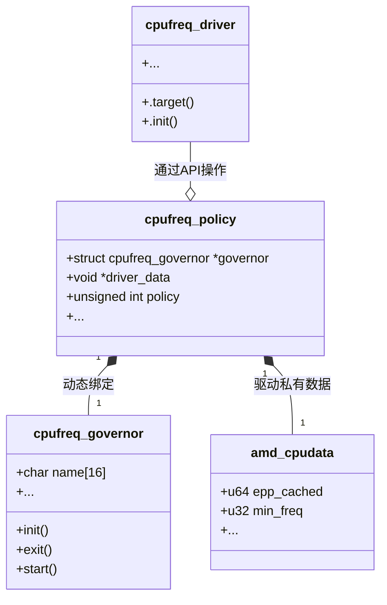
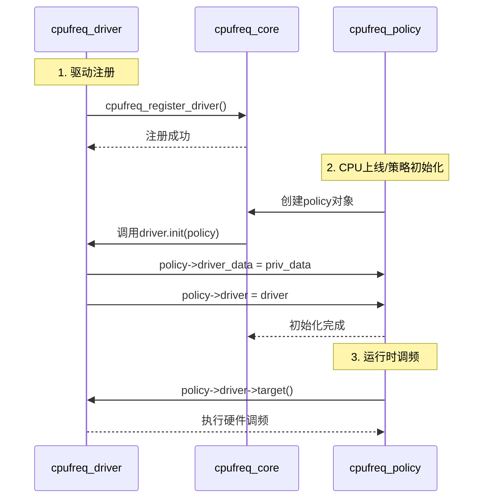

# cpu调频子系统

核心结构体的关系



`cpufreq_policy` 结构体，代表 CPU 频率调节的策略。该结构体一般会在 cpufreq_driver 初始化时作为结构体参数传入，建立cpufreq_driver 与 
cpufreq_policy 之间的联系
```c
struct cpufreq_policy {
	/* CPUs sharing clock, require sw coordination */
	cpumask_var_t		cpus;	/* 仅包含在线的 CPU */
	cpumask_var_t		related_cpus; /* 包含在线和离线的 CPU */
	cpumask_var_t		real_cpus; /* 包含相关的和存在的 CPU */

	unsigned int		shared_type; /* ACPI: ANY 或 ALL，表示受频率调节影响的 CPU */

	unsigned int		cpu;    /* 负责管理此策略的 CPU，必须是在线的 */

	struct clk		*clk; /* 指向时钟结构体的指针，表示 CPU 频率相关的时钟 */

	struct cpufreq_cpuinfo	cpuinfo; /* CPU 的频率信息，参见结构体定义 */

	unsigned int		min;    /* 最小频率（kHz） */
	unsigned int		max;    /* 最大频率（kHz） */
	unsigned int		cur;    /* 当前频率（kHz），当使用 cpufreq governor 时需要 */
	unsigned int		suspend_freq; /* 系统挂起时设置的频率 */

	unsigned int		policy; /* 当前频率调节策略 */
	unsigned int		last_policy; /* 拔出 CPU 之前的策略 */
	struct cpufreq_governor	*governor; /* 频率调节器（governor） */
	void			*governor_data; /* 存储与 governor 相关的数据 */
	char			last_governor[CPUFREQ_NAME_LEN]; /* 最后使用的 governor 名称 */

	struct work_struct	update; /* 如果需要在 IRQ 上下文中调用 update_policy()，使用此字段 */

	struct freq_constraints	constraints; /* 频率约束条件 */
	struct freq_qos_request	*min_freq_req; /* 最小频率请求 */
	struct freq_qos_request	*max_freq_req; /* 最大频率请求 */

	struct cpufreq_frequency_table	*freq_table; /* 频率表 */
	enum cpufreq_table_sorting freq_table_sorted; /* 频率表的排序方式 */

	struct list_head        policy_list; /* 频率策略链表 */
	struct kobject		kobj; /* 用于内核对象模型 */
	struct completion	kobj_unregister; /* 用于等待 kobj 卸载完成 */

	/*
	 * 信号量规则：
	 * - 任何需要读取此策略结构体的操作都需要执行 down_read 操作。
	 * - 任何会修改策略结构体或移除策略的操作（如 CPU 热插拔），都需要持有此信号量并以写模式进行操作。
	 */
	struct rw_semaphore	rwsem;

	/*
	 * 快速切换标志：
	 * - 如果驱动能保证在共享策略的 CPU 上更改频率并且该更改会影响所有策略上的 CPU，则设置 fast_switch_possible。
	 * - 如果支持快速频率切换的 governor 已启用，则设置 fast_switch_enabled。
	 */
	bool			fast_switch_possible; /* 是否支持快速切换 */
	bool			fast_switch_enabled;  /* 是否启用快速切换 */

	/*
	 * 如果当前 governor 设置了 CPUFREQ_GOV_STRICT_TARGET 标志，则设置此标志。
	 */
	bool			strict_target; /* 是否严格目标频率 */

	/*
	 * 如果在频率表中发现了无效的频率（低效频率），则设置此标志。
	 * 这表示是否可以遵循 CPUFREQ_RELATION_E 标志。
	 */
	bool			efficiencies_available; /* 是否存在低效频率 */

	/*
	 * 每次驱动设置频率时的首选时间间隔（微秒），由 scaling driver 设置（默认值 0 表示无偏好）。
	 */
	unsigned int		transition_delay_us; /* 频率转换延迟 */

	/*
	 * 远程 DVFS 标志（未添加到驱动结构体中，以避免访问调度器的热路径结构）。
	 * 如果不同 cpufreq 策略的 CPU 可以代替其他 CPU 进行频率调节，则设置此标志。
	 */
	bool			dvfs_possible_from_any_cpu; /* 是否支持跨 CPU 的 DVFS 调节 */

	/* 启用每个策略的提升标志 */
	bool			boost_enabled; /* 是否启用提升 */

	/* 来自 cpufreq_driver_resolve_freq 的频率缓存查找 */
	unsigned int cached_target_freq; /* 缓存的目标频率 */
	unsigned int cached_resolved_idx; /* 缓存的频率索引 */

	/* 频率转换同步 */
	bool			transition_ongoing; /* 跟踪频率转换状态 */
	spinlock_t		transition_lock; /* 用于转换过程的自旋锁 */
	wait_queue_head_t	transition_wait; /* 等待队列，用于等待转换完成 */
	struct task_struct	*transition_task; /* 正在进行转换的任务 */

	/* cpufreq 统计信息 */
	struct cpufreq_stats	*stats; /* 存储 CPU 频率调节统计信息 */

	/* 驱动程序内部使用的字段 */
	void			*driver_data; /* 驱动数据 */

	/* 如果用于热管理，则指向冷却设备 */
	struct thermal_cooling_device *cdev; /* 热管理冷却设备 */

	/* 最小和最大频率的通知块 */
	struct notifier_block nb_min; /* 最小频率通知 */
	struct notifier_block nb_max; /* 最大频率通知 */
};
```

### 主要结构体字段解释：
- `cpus`, `related_cpus`, `real_cpus`：定义了与频率策略相关的 CPU 集合，包括在线、离线和实际存在的 CPU。
- `clk`：指向与 CPU 频率相关的时钟结构。
- `cpuinfo`：包含 CPU 的频率信息，如支持的频率范围。
- `min`, `max`, `cur`, `suspend_freq`：CPU 频率的最小、最大、当前和挂起时使用的频率。
- `governor`：当前频率调节器，用于决定如何调节 CPU 的频率。
- `rwsem`：用于并发控制的读写信号量，确保对 `cpufreq_policy` 结构的安全访问。
- `fast_switch_possible`, `fast_switch_enabled`：标记是否支持快速频率切换。
- `boost_enabled`：启用性能提升的标志。
- `transition_lock` 和 `transition_wait`：用于同步频率转换过程。
- `stats`：记录 CPU 频率调节的统计信息。
- `cdev`：如果该策略涉及热管理，会指向一个冷却设备，用于 thermal mitigation（热缓解）。

这些字段的组合使得该结构能够处理复杂的 CPU 频率调节策略，并提供相关的同步、统计和性能提升功能。


```c
struct cpufreq_governor {
	char	name[CPUFREQ_NAME_LEN];  // governor 的名称，如 "ondemand", "performance"
	
	/* 初始化 governor 的函数，当此 governor 被加载到系统中时调用 */
	int	(*init)(struct cpufreq_policy *policy);

	/* 退出 governor 的函数，当此 governor 被卸载时调用 */
	void	(*exit)(struct cpufreq_policy *policy);

	/* 启动 governor 的函数，通常是在启动频率调节时调用 */
	int	(*start)(struct cpufreq_policy *policy);

	/* 停止 governor 的函数，通常是在停止频率调节时调用 */
	void	(*stop)(struct cpufreq_policy *policy);

	/* 设置 governor 限制的函数，用于更新频率调节的限制 */
	void	(*limits)(struct cpufreq_policy *policy);

	/*
	 * 显示当前频率设置的函数。返回值将是一个字符串，描述当前的频率设置。
	 * 用于从用户空间（例如通过 sysfs）显示当前频率调节设置。
	 */
	ssize_t	(*show_setspeed)(struct cpufreq_policy *policy, char *buf);

	/*
	 * 存储频率设置的函数，用于通过用户空间设置新的频率。
	 * 用于从用户空间（例如通过 sysfs）修改 CPU 的频率。
	 */
	int	(*store_setspeed)(struct cpufreq_policy *policy, unsigned int freq);

	/* 用于将当前 governor 插入到 governor 链表中的节点 */
	struct list_head	governor_list;

	/* 保存此 governor 所属的模块指针，当 governor 模块被卸载时使用 */
	struct module		*owner;

	/* 此标志位包含 governor 的各种状态标志，用于指定 governor 的特性（例如是否启用某些特性） */
	u8			flags;
};

```

### cpufreq_driver 与 cpufreq_policy 之间关系的建立

cpufreq_policy 和 cpufreq_driver 是两个重要的结构，它们之间的关系是 CPU 频率管理的核心部分。cpufreq_policy 代表着一个或多个 CPU 的频率调节策略，而 cpufreq_driver 则是具体的硬件频率驱动，它提供了对 CPU 频率的控制接口。

cpufreq_policy 与 cpufreq_driver 之间的关系通常是在 cpufreq 子系统初始化时建立的。具体来说，cpufreq_policy 负责表示每个 CPU 的频率调节策略，而 cpufreq_driver 提供操作 CPU 频率的方法和回调函数，二者之间的关系通常是在驱动加载时建立的。



注册一个 cpufreq 驱动函数：

```c
cpufreq_register_driver(current_pstate_driver)
```

### cpufreq_governor 与 cpufreq_policy 之间关系的建立

cpufreq_governor 结构与 cpufreq_policy 之间会在 cpufreq_governor 初始化时动态的与 cpufreq_policy 结构建立联系。

当用户态调用 scaling_governor 接口时可以切换调频策略，该接口在cpu调频子系统初始化时就已经创建了。

```c
// 示例：用户通过sysfs切换governor
echo "ondemand" > /sys/devices/system/cpu/cpufreq/policyX/scaling_governor
```

在进行模块编程时，如果不想在用户态显式的调用 scaling_governor 接口来切换可以在内核中调用 cpufreq_set_policy 来修改。

```c
static int __init set_cpufreq_governor_init(void)
{
    struct cpufreq_policy *policy;
    struct cpufreq_governor *new_gov;
    int cpu = 0; // 目标 CPU
    int ret;

    // 获取 CPU 的 cpufreq 策略
    policy = cpufreq_get_policy(cpu);
    if (!policy) {
        pr_err("Failed to get cpufreq policy for CPU %d\n", cpu);
        return -ENODEV;
    }

    // 获取并初始化新的调频 governor
    new_gov = cpufreq_get_governor("ondemand"); // 获取 "ondemand" governor
    if (!new_gov) {
        pr_err("Failed to get governor\n");
        cpufreq_put_policy(policy);
        return -EINVAL;
    }

    // 设置新的 governor
    ret = cpufreq_set_policy(policy, new_gov, policy->policy);
    if (ret) {
        pr_err("Failed to set policy for CPU %d\n", cpu);
        cpufreq_put_policy(policy);
        return ret;
    }

    cpufreq_put_policy(policy);
    pr_info("CPU frequency governor set successfully\n");
    return 0;
}
```

调用链路：cpufreq_set_policy cpufreq_init_governor policy->governor->init 

```c
static int cpufreq_init_governor(struct cpufreq_policy *policy)
{
	int ret;

	/* Don't start any governor operations if we are entering suspend */
	if (cpufreq_suspended)
		return 0;
	/*
	 * Governor might not be initiated here if ACPI _PPC changed
	 * notification happened, so check it.
	 */
	if (!policy->governor)
		return -EINVAL;

	/* Platform doesn't want dynamic frequency switching ? */
	if (policy->governor->dynamic_switching &&
	    cpufreq_driver->flags & CPUFREQ_NO_AUTO_DYNAMIC_SWITCHING) {
		struct cpufreq_governor *gov = cpufreq_fallback_governor();

		if (gov) {
			pr_warn("Can't use %s governor as dynamic switching is disallowed. Fallback to %s governor\n",
				policy->governor->name, gov->name);
			policy->governor = gov;
		} else {
			return -EINVAL;
		}
	}

	if (!try_module_get(policy->governor->owner))
		return -EINVAL;

	pr_debug("%s: for CPU %u\n", __func__, policy->cpu);

	if (policy->governor->init) {
		ret = policy->governor->init(policy);
		if (ret) {
			module_put(policy->governor->owner);
			return ret;
		}
	}

	return 0;
}

```


