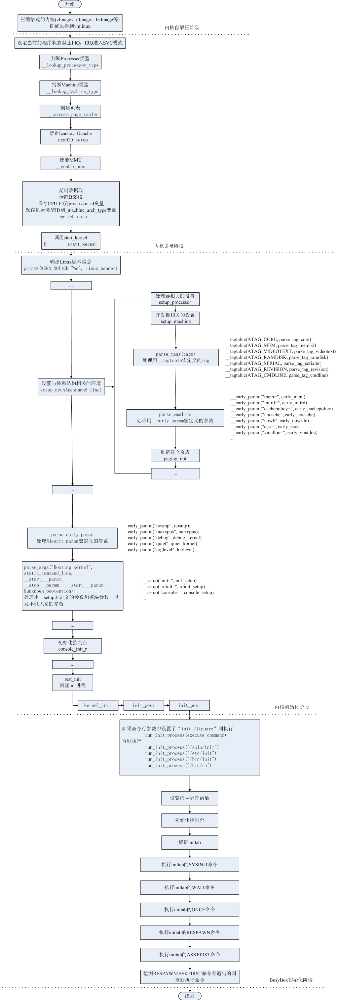

# linux内核启动流程



## 内核自解压

由于内核镜像会被以 uImage zImage 等格式压缩，因此在linux启动的阶段中，并不是一上来就直接执行内核中的代码。而是要先经历自解压阶段。

以x86_64为例，这段代码位于 arch/x86/boot/compressed/head_64.S (2.6版本)中。

```asm
	pushq	%rsi			/* Save the real mode argument */
	movq	%rsi, %rdi		/* real mode address */
	leaq	boot_heap(%rip), %rsi	/* malloc area for uncompression */
	leaq	input_data(%rip), %rdx  /* input_data */
	movl	$z_input_len, %ecx	/* input_len */
	movq	%rbp, %r8		/* output target address */
	call	decompress_kernel
	popq	%rsi

```

其中由函数 `decompress_kernel` 来执行内核的解压。

```c
asmlinkage void decompress_kernel(void *rmode, memptr heap,
				  unsigned char *input_data,
				  unsigned long input_len,
				  unsigned char *output)
{
	// 将 real_mode 指针赋值给全局变量 real_mode
	real_mode = rmode;

	// 检查 real_mode 的标志位，如果设置了 QUIET_FLAG，则将 quiet 变量设置为 1
	if (real_mode->hdr.loadflags & QUIET_FLAG)
		quiet = 1;

	// 根据原始视频模式设置视频内存的起始地址和端口
	if (real_mode->screen_info.orig_video_mode == 7) {
		vidmem = (char *) 0xb0000;   // 颜色文本模式
		vidport = 0x3b4;            // 颜色文本模式的控制端口
	} else {
		vidmem = (char *) 0xb8000;   // 彩色文本模式
		vidport = 0x3d4;            // 彩色文本模式的控制端口
	}

	// 从 real_mode 中获取屏幕的行数和列数
	lines = real_mode->screen_info.orig_video_lines;
	cols = real_mode->screen_info.orig_video_cols;

	// 设置堆的起始位置和结束位置
	free_mem_ptr     = heap;         // 堆的起始位置
	free_mem_end_ptr = heap + BOOT_HEAP_SIZE; // 堆的结束位置

	// 检查输出地址是否按要求对齐
	if ((unsigned long)output & (MIN_KERNEL_ALIGN - 1))
		error("Destination address inappropriately aligned");

	// 检查堆是否超出了地址范围
#ifdef CONFIG_X86_64
	if (heap > 0x3fffffffffffUL)
		error("Destination address too large");
#else
	if (heap > ((-__PAGE_OFFSET-(512<<20)-1) & 0x7fffffff))
		error("Destination address too large");
#endif

	// 检查输出地址是否正确
#ifndef CONFIG_RELOCATABLE
	if ((unsigned long)output != LOAD_PHYSICAL_ADDR)
		error("Wrong destination address");
#endif

	// 如果 quiet 标志未设置，则打印解压缩进度
	if (!quiet)
		putstr("\nDecompressing Linux... ");

	// 调用 decompress 函数解压缩内核映像
	decompress(input_data, input_len, NULL, NULL, output, NULL, error);

	// 解析解压缩后的 ELF 格式内核映像
	parse_elf(output);

	// 如果 quiet 标志未设置，则打印完成消息
	if (!quiet)
		putstr("done.\nBooting the kernel.\n");

	return;
}
```

其中真正执行解压功能的为函数 `decompress` 。

在该文件中除了内核的自解压与跳转执行，执行了构建页表，由32位跳转至64位模式及其准备工作等等。

## 跳转至内核中执行

```asm
/*
 * Jump to the decompressed kernel.
 */
    jmp	*%rbp
```

在上面第一段汇编代码中已经将内核入口的地址存放在了寄存器 rbp 中。

在这里会跳转至内核真正的入口点 `_start` 处执行。该符号位于 x86/boot/header.S 中。

待 header.S 中的指令执行完后会跳转至 x86/boot/main.c 中的main中。

```asm
# Jump to C code (should not return)跳转至x86/boot/main.c中的main中执行
	calll	main
```

```c
void main(void)
{
	/* First, copy the boot header into the "zeropage" 复制引导头到“zeropage”，以准备启动参数和内存布局信息*/
	copy_boot_params();

	/* End of heap check 初始化堆内存，确保有足够的堆空间用于运行时数据分配。*/
	init_heap();

	/* 验证 CPU 是否符合当前内核要求。如果不符合，显示错误信息并终止启动过程 */
	if (validate_cpu()) {
		puts("Unable to boot - please use a kernel appropriate "
		     "for your CPU.\n");
		die();
	}

	/* Tell the BIOS what CPU mode we intend to run in. 设置 BIOS，以告知系统将要使用的 CPU 模式（如保护模式)*/
	set_bios_mode();

	/* Detect memory layout 检测系统的内存布局，获取内存的详细信息，如总内存大小、内存块等*/
	detect_memory();

	/* Set keyboard repeat rate (why?)设置键盘重复速率，可能是为了在后续的操作中确保键盘输入的正确性。 */
	keyboard_set_repeat();

	/* Query MCA information */
	query_mca();
	// 查询 MCA（Machine Check Architecture）信息，用于检测和报告硬件错误。

	/* Query Intel SpeedStep (IST) information */
	query_ist();
	// 查询 Intel SpeedStep 信息，用于处理 CPU 频率和电源管理。

	/* Query APM information */
#if defined(CONFIG_APM) || defined(CONFIG_APM_MODULE)
	query_apm_bios();
#endif
	// 如果配置了 APM（Advanced Power Management），查询 APM BIOS 信息。

	/* Query EDD information */
#if defined(CONFIG_EDD) || defined(CONFIG_EDD_MODULE)
	query_edd();
#endif
	// 如果配置了 EDD（Enhanced Disk Drive），查询 EDD 信息。

	/* Set the video mode */
	set_video();
	// 设置视频模式，以确保显示器正确显示信息。

	/* Parse command line for 'quiet' and pass it to decompressor. */
	if (cmdline_find_option_bool("quiet"))
		boot_params.hdr.loadflags |= QUIET_FLAG;
	// 解析命令行参数，检查是否有“quiet”选项。如果有，将“quiet”标志设置到启动参数中，禁用启动时的详细信息显示。

	/* Do the last things and invoke protected mode */
	go_to_protected_mode();
	// 完成最后的初始化操作，并切换到保护模式，开始执行操作系统的核心代码。
}
```

最终在函数 `protected_mode_jump` 中跳转执行保护模式。

```c
go_to_protected_mode() -> protected_mode_jump()
```

```asm
GLOBAL(protected_mode_jump)
	movl	%edx, %esi		# Pointer to boot_params table

	xorl	%ebx, %ebx
	movw	%cs, %bx
	shll	$4, %ebx
	addl	%ebx, 2f
	jmp	1f			# Short jump to serialize on 386/486
1:

	movw	$__BOOT_DS, %cx
	movw	$__BOOT_TSS, %di

	movl	%cr0, %edx
	orb	$X86_CR0_PE, %dl	# Protected mode
	movl	%edx, %cr0

	# Transition to 32-bit mode
	.byte	0x66, 0xea		# ljmpl opcode
2:	.long	in_pm32			# offset
	.word	__BOOT_CS		# segment
ENDPROC(protected_mode_jump)
```

## 进入内核的初始化函数

从下面的代码来自 arch/x86/kernel/head64.S 。可以看出，在 x86_64 中，并不是直接跳转至 start_kernel 函数执行。而是先跳转至x86_64_start_kernel。

```asm
/* SMP 启动时会更改这两个符号 */
__REFDATA             // 指定接下来的数据是只读数据，但可以在SMP (Symmetric Multi-Processing)启动时被修改。
.align 8              // 将接下来的数据按 8 字节对齐，以确保高效访问。

ENTRY(initial_code)
    .quad   x86_64_start_kernel   // 初始化代码的入口地址指向 x86_64_start_kernel 函数。该函数是内核启动的主入口。

ENTRY(initial_gs)
    .quad   INIT_PER_CPU_VAR(irq_stack_union) // 初始的 `gs` 寄存器设置。`irq_stack_union` 是每个 CPU 的中断栈指针。

ENTRY(stack_start)
    .quad   init_thread_union + THREAD_SIZE - 8   // 初始栈指针，指向内核栈的栈顶位置（`THREAD_SIZE - 8`）。
    .word   0    // 将下一个 2 字节设置为 0，作为保留字段或对齐填充。

__FINITDATA           // 结束初始化数据段，表示后续部分不属于初始化数据。
	movq	initial_code(%rip),%rax     // 将 `initial_code` 地址（存储在相对于 RIP（指令指针）的偏移位置）加载到 RAX 寄存器中。
	pushq	$0                         // 压入一个伪造的返回地址，防止函数返回时栈展开器（unwinder）错误地解析返回地址。
	pushq	$__KERNEL_CS               // 压入内核代码段选择子（CS），确保在后续的跳转中使用正确的代码段。
	pushq	%rax                        // 压入 RAX 中存储的目标地址，通常是内核启动入口（位于负空间）。
	lretq                             // 使用 `lretq`（长返回指令）从栈中弹出 CS 和目标地址进行跳转，进入内核启动代码。
```

在进入start_kernel前还需要一些过程。

```c
x86_64_start_kernel() -> x86_64_start_reservations() -> start_kernel()
```

在函数 `x86_64_start_kernel` 经历了以下过程。

* BUILD_BUG_ON: 编译时检查，确保内核映像和模块区域的地址映射符合预期。
* clear_bss(): 清理 bss 段，确保未初始化的全局变量被置为 0。
* zap_identity_mappings(): 使空指针访问触发段错误，防止不小心引用 NULL 指针。
* cleanup_highmap(): 清理高地址段的冗余映射。
* set_intr_gate(): 设置中断门（IDT）来处理异常。
* load_idt(): 加载中断描述符表（IDT）。
* x86_64_start_reservations(): 处理内存保留区域，准备内存分配和管理。

## start_kernel

```c
asmlinkage void __init start_kernel(void)
{
	char * command_line;
	extern struct kernel_param __start___param[], __stop___param[];

	smp_setup_processor_id();

	/*
	 * Need to run as early as possible, to initialize the
	 * lockdep hash:
	 */
	lockdep_init();
	debug_objects_early_init();

	/*
	 * Set up the the initial canary ASAP:
	 */
	boot_init_stack_canary();

	cgroup_init_early();

	local_irq_disable();
	early_boot_irqs_off();
	early_init_irq_lock_class();

/*
 * Interrupts are still disabled. Do necessary setups, then
 * enable them
 */
	lock_kernel();
	tick_init();
	boot_cpu_init();
	page_address_init();
	printk(KERN_NOTICE "%s", linux_banner);
	setup_arch(&command_line);
	mm_init_owner(&init_mm, &init_task);
	setup_command_line(command_line);
	setup_nr_cpu_ids();
	setup_per_cpu_areas();
	smp_prepare_boot_cpu();	/* arch-specific boot-cpu hooks */

	build_all_zonelists();
	page_alloc_init();

	printk(KERN_NOTICE "Kernel command line: %s\n", boot_command_line);
	parse_early_param();
	parse_args("Booting kernel", static_command_line, __start___param,
		   __stop___param - __start___param,
		   &unknown_bootoption);
	/*
	 * These use large bootmem allocations and must precede
	 * kmem_cache_init()
	 */
	pidhash_init();
	vfs_caches_init_early();//初始化vfs数据结构的缓存
	sort_main_extable();
	trap_init();		// 初始化异常处理
	mm_init();
	/*
	 * Set up the scheduler prior starting any interrupts (such as the
	 * timer interrupt). Full topology setup happens at smp_init()
	 * time - but meanwhile we still have a functioning scheduler.
	 */
	sched_init();
	/*
	 * Disable preemption - early bootup scheduling is extremely
	 * fragile until we cpu_idle() for the first time.
	 */
	preempt_disable();
	if (!irqs_disabled()) {
		printk(KERN_WARNING "start_kernel(): bug: interrupts were "
				"enabled *very* early, fixing it\n");
		local_irq_disable();
	}
	rcu_init();
	radix_tree_init();
	/* init some links before init_ISA_irqs() */
	early_irq_init();
	init_IRQ();		// 初始化外部中断
	prio_tree_init();
	init_timers();		// 初始化定时器模块，同时，会注册定时器的软中断处理函数
	hrtimers_init();
	softirq_init();		// 初始化软中断
	timekeeping_init();
	time_init();
	profile_init();
	if (!irqs_disabled())
		printk(KERN_CRIT "start_kernel(): bug: interrupts were "
				 "enabled early\n");
	early_boot_irqs_on();
	local_irq_enable();

	/* Interrupts are enabled now so all GFP allocations are safe. */
	gfp_allowed_mask = __GFP_BITS_MASK;

	kmem_cache_init_late();

	/*
	 * HACK ALERT! This is early. We're enabling the console before
	 * we've done PCI setups etc, and console_init() must be aware of
	 * this. But we do want output early, in case something goes wrong.
	 */
	console_init();
	if (panic_later)
		panic(panic_later, panic_param);

	lockdep_info();

	/*
	 * Need to run this when irqs are enabled, because it wants
	 * to self-test [hard/soft]-irqs on/off lock inversion bugs
	 * too:
	 */
	locking_selftest();

#ifdef CONFIG_BLK_DEV_INITRD
// 如果初始RAM盘（initrd_start）存在并且初始RAM盘不能低于某个起始地址（initrd_below_start_ok为假），
// 并且初始RAM盘的物理页框号小于最小的低地址页框号（min_low_pfn），则执行以下操作。
if (initrd_start && !initrd_below_start_ok &&
    page_to_pfn(virt_to_page((void *)initrd_start)) < min_low_pfn) {
    
    // 打印一个严重的内核消息，表示初始RAM盘被覆盖，并禁用它。
    printk(KERN_CRIT "initrd overwritten (0x%08lx < 0x%08lx) - "
        "disabling it.\n",
        page_to_pfn(virt_to_page((void *)initrd_start)),
        min_low_pfn);
    
    // 将initrd_start设置为0，表示禁用初始RAM盘。
    initrd_start = 0;
}
#endif
	page_cgroup_init();
	enable_debug_pagealloc();
	kmemtrace_init();
	kmemleak_init();
	debug_objects_mem_init();
	idr_init_cache();
	setup_per_cpu_pageset();
	numa_policy_init();
	if (late_time_init)
		late_time_init();
	sched_clock_init();
	calibrate_delay();
	pidmap_init();
	anon_vma_init();
#ifdef CONFIG_X86
	if (efi_enabled)
		efi_enter_virtual_mode();
#endif
	thread_info_cache_init();
	cred_init();
	fork_init(totalram_pages);
	proc_caches_init();
	buffer_init();
	key_init();
	security_init();
	vfs_caches_init(totalram_pages);//初始化vfs，构建 /
	signals_init();
	/* rootfs populating might need page-writeback */
	page_writeback_init();
#ifdef CONFIG_PROC_FS
	proc_root_init();
#endif
	cgroup_init();
	cpuset_init();
	taskstats_init_early();
	delayacct_init();

	check_bugs();

	acpi_early_init(); /* before LAPIC and SMP init */
	sfi_init_late();

	ftrace_init();

	/* Do the rest non-__init'ed, we're now alive */
	rest_init();//系统启动后的初始化函数
}
```

在完成任务后start_kernel所在的0号进程会退化为idle进程，当一个core上没有任务可运行时就会去运行idle进程使系统进入休眠状态进入低功耗模式。

## 第1号线程 kernel_init

```c
static int __init kernel_init(void * unused)
{
	lock_kernel();  // 加锁内核，防止在关键初始化阶段被中断

	/*
	 * init可以在任何节点上分配页面
	 */
	set_mems_allowed(node_states[N_HIGH_MEMORY]);

	/*
	 * init可以在任何CPU上运行
	 */
	set_cpus_allowed_ptr(current, cpu_all_mask);

	/*
	 * 告诉系统，我们将成为无辜孤儿进程的处理者。
	 *
	 * 我们不希望人们对这个任务数组中的位置有错误的假设。
	 */
	init_pid_ns.child_reaper = current;

	cad_pid = task_pid(current);  // 获取当前进程的PID

	smp_prepare_cpus(setup_max_cpus);  // 准备多处理器系统

	do_pre_smp_initcalls();  // 执行早期的SMP初始化调用

	start_boot_trace();  // 启动引导跟踪

	smp_init();  // 初始化SMP

	sched_init_smp();  // 初始化调度器的SMP部分

	do_basic_setup();  // 执行基本的系统设置

	/* 打开根文件系统上的/dev/console，这一步不应失败 */
	if (sys_open((const char __user *) "/dev/console", O_RDWR, 0) < 0)
		printk(KERN_WARNING "Warning: unable to open an initial console.\n");

	(void) sys_dup(0);  // 复制标准输入
	(void) sys_dup(0);  // 复制标准输入

	/*
	 * 检查是否存在早期用户空间初始化程序。如果存在，则让它完成所有工作。
	 */
	if (!ramdisk_execute_command)
		ramdisk_execute_command = "/init";

	if (sys_access((const char __user *) ramdisk_execute_command, 0) != 0) {//检查文件的存在性，与当前进程是否具有权限
		ramdisk_execute_command = NULL;
		prepare_namespace();  // 准备根文件系统命名空间
	}

	/*
	 * 初始化完成，系统基本运行起来了。清理初始化内存段并启动用户模式进程。
	 */
	init_post();

	return 0;
}
```

最终在 init_post 函数中会尝试寻找根文件系统中 `init` 进程的代码，最终 `kernel_init` 会转变为 `init` 进程。

```c
static noinline int init_post(void)
	__releases(kernel_lock)  // 释放 kernel_lock 锁
{
	/* 需要在释放内存之前完成所有异步的 `__init` 代码 */
	async_synchronize_full();  // 等待所有异步的初始化操作完成
	free_initmem();  // 释放 `init` 部分的内存
	unlock_kernel();  // 解锁内核
	mark_rodata_ro();  // 将只读数据标记为只读
	system_state = SYSTEM_RUNNING;  // 更新系统状态为 "运行中"
	numa_default_policy();  // 设置默认的 NUMA 策略

	/* 将当前进程的信号标记为不可杀死，防止 `init` 进程被意外终止 */
	current->signal->flags |= SIGNAL_UNKILLABLE;

	/* 如果存在 `ramdisk_execute_command`，则执行该命令 */
	if (ramdisk_execute_command) {
		run_init_process(ramdisk_execute_command);  // 尝试执行内存盘上的初始化命令
		printk(KERN_WARNING "Failed to execute %s\n",
				ramdisk_execute_command);  // 如果执行失败，打印警告信息
	}

	/*
	 * 我们会依次尝试以下命令，直到一个成功为止。
	 *
	 * 如果系统非常损坏，可以使用 Bourne shell 代替 `init` 进行恢复。
	 */
	if (execute_command) {
		run_init_process(execute_command);  // 尝试执行指定的初始化命令
		printk(KERN_WARNING "Failed to execute %s.  Attempting "
					"defaults...\n", execute_command);  // 如果失败，打印警告信息并尝试默认命令
	}

	/* 尝试启动不同位置的 `init` 程序，直到成功 */
	run_init_process("/sbin/init");
	run_init_process("/etc/init");
	run_init_process("/bin/init");
	run_init_process("/bin/sh");  // 如果其他所有初始化进程都失败，尝试启动 shell

	/* 如果没有找到任何 `init` 进程，则触发 kernel panic，并提示用户传递 `init=` 选项 */
	panic("No init found.  Try passing init= option to kernel. "
	      "See Linux Documentation/init.txt for guidance.");
}
```

## 2号进程 kthreadd

kthreadd 与 kernel_init 均在函数 rest_init 中创建。

在该函数中会遍历 kthread_create_list 链表，并创建所有的内核线程。

```c
int kthreadd(void *unused)
{
    struct task_struct *tsk = current;
 
    /* Setup a clean context for our children to inherit. */
    set_task_comm(tsk, "kthreadd");
    ignore_signals(tsk);
    set_cpus_allowed_ptr(tsk, cpu_all_mask);
    set_mems_allowed(node_states[N_MEMORY]);
 
    current->flags |= PF_NOFREEZE;
    cgroup_init_kthreadd();
 
    for (;;) {
        set_current_state(TASK_INTERRUPTIBLE);
        if (list_empty(&kthread_create_list))
            schedule();
        __set_current_state(TASK_RUNNING);
 
        spin_lock(&kthread_create_lock);
        while (!list_empty(&kthread_create_list)) {
            struct kthread_create_info *create;
 
            create = list_entry(kthread_create_list.next,
                        struct kthread_create_info, list);
            list_del_init(&create->list);
            spin_unlock(&kthread_create_lock);
 
            create_kthread(create);
 
            spin_lock(&kthread_create_lock);
        }
        spin_unlock(&kthread_create_lock);
    }
 
    return 0;
}
```