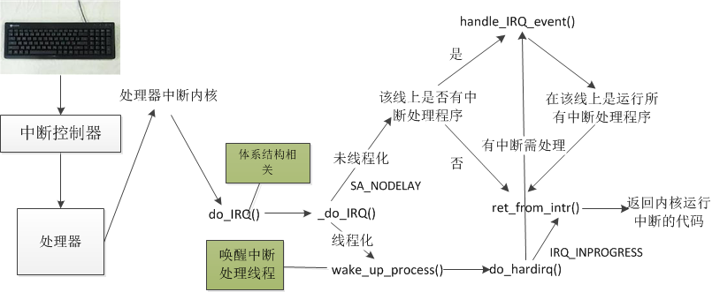

注册中断处理程序
```c
request_irq(unsigned int irq, irq_handler_t handler, unsigned long flags,
	    const char *name, void *dev)
{
	return request_threaded_irq(irq, handler, NULL, flags, name, dev);
}
int request_threaded_irq(unsigned int irq, irq_handler_t handler,
			 irq_handler_t thread_fn, unsigned long irqflags,
			 const char *devname, void *dev_id)
{
	struct irqaction *action; // IRQ 行为结构体指针该结构包含了与中断相关的信息，包括中断处理函数、线程处理函数、中断标志、设备名称、设备 ID 等。


	struct irq_desc *desc; // IRQ 描述符指针
	int retval;

	/*
	 * handle_IRQ_event() always ignores IRQF_DISABLED except for
	 * the _first_ irqaction (sigh).  That can cause oopsing, but
	 * the behavior is classified as "will not fix" so we need to
	 * start nudging drivers away from using that idiom.
	 */ // 处理 IRQ 事件的函数总是忽略 IRQF_DISABLED，除了第一个 irqaction（唉）。这可能会导致 oopsing，但这种行为被分类为“不会修复”，因此我们需要开始引导驱动程序摆脱使用这种习惯。
	if ((irqflags & (IRQF_SHARED|IRQF_DISABLED)) ==
					(IRQF_SHARED|IRQF_DISABLED)) {
		pr_warning(
		  "IRQ %d/%s: IRQF_DISABLED is not guaranteed on shared IRQs\n",
			irq, devname);
	}

#ifdef CONFIG_LOCKDEP
	/*
	 * Lockdep wants atomic interrupt handlers:
	 */ // Lockdep 需要原子中断处理程序
	irqflags |= IRQF_DISABLED;
#endif
	/*
	 * Sanity-check: shared interrupts must pass in a real dev-ID,
	 * otherwise we'll have trouble later trying to figure out
	 * which interrupt is which (messes up the interrupt freeing
	 * logic etc).
	 */ // 检查：共享中断必须传入真实的 dev-ID，否则我们以后将在尝试弄清楚哪个中断是哪个时遇到麻烦（会搞乱中断释放逻辑等）。
	if ((irqflags & IRQF_SHARED) && !dev_id)
		return -EINVAL;

	desc = irq_to_desc(irq); // 获取 IRQ 描述符
	if (!desc)
		return -EINVAL;

	if (desc->status & IRQ_NOREQUEST) // IRQ 不可请求
		return -EINVAL;

	if (!handler) { // 如果没有主处理程序
		if (!thread_fn) // 如果没有线程处理程序
			return -EINVAL;
		handler = irq_default_primary_handler; // 使用默认主处理程序
	}

	action = kzalloc(sizeof(struct irqaction), GFP_KERNEL); // 分配 IRQ 行为结构体内存
	if (!action)
		return -ENOMEM;

	action->handler = handler; // 设置主处理程序
	action->thread_fn = thread_fn; // 设置线程处理程序
	action->flags = irqflags; // 设置 IRQ 标志
	action->name = devname; // 设置设备名称
	action->dev_id = dev_id; // 设置设备 ID

	chip_bus_lock(irq, desc); // 锁定总线
	retval = __setup_irq(irq, desc, action); // 设置 IRQ
	chip_bus_sync_unlock(irq, desc); // 同步解锁总线

	if (retval) // 如果设置 IRQ 失败
		kfree(action); // 释放分配的内存

#ifdef CONFIG_DEBUG_SHIRQ
	if (!retval && (irqflags & IRQF_SHARED)) {
		/*
		 * It's a shared IRQ -- the driver ought to be prepared for it
		 * to happen immediately, so let's make sure....
		 * We disable the irq to make sure that a 'real' IRQ doesn't
		 * run in parallel with our fake.
		 */ // 这是一个共享的 IRQ -- 驱动程序应该准备好立即发生，所以让我们确保....
		/* 我们禁用 IRQ 来确保“真实” IRQ 不会与我们的虚拟 IRQ 并行运行。 */
		unsigned long flags;

		disable_irq(irq); // 禁用 IRQ
		local_irq_save(flags); // 保存本地 IRQ 状态

		handler(irq, dev_id); // 调用主处理程序

		local_irq_restore(flags); // 恢复本地 IRQ 状态
		enable_irq(irq); // 启用 IRQ
	}
#endif
	return retval; // 返回设置 IRQ 的结果
}

```
各个参数的作用:
1.中断号
2.中断处理函数
3.是否是共享中断线
4.设备名
5.设备唯一的id,中断处理程序的标识
