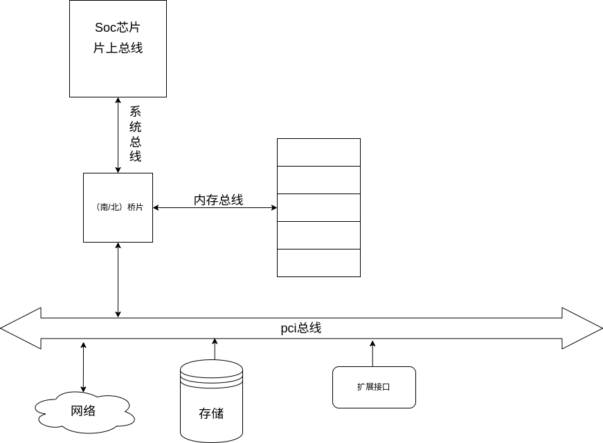
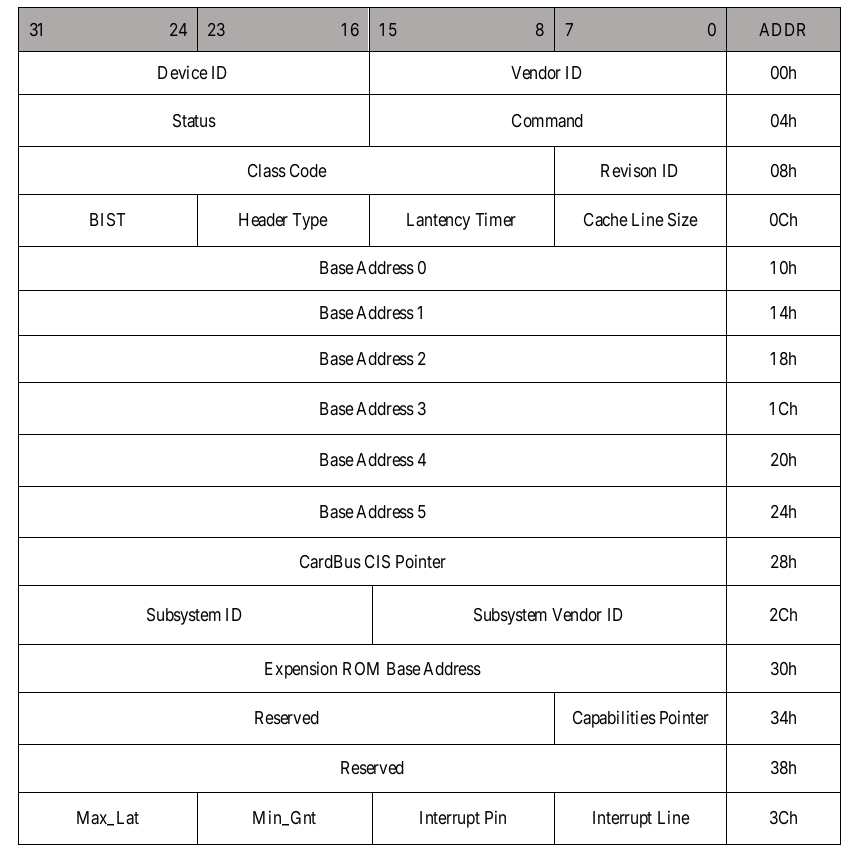
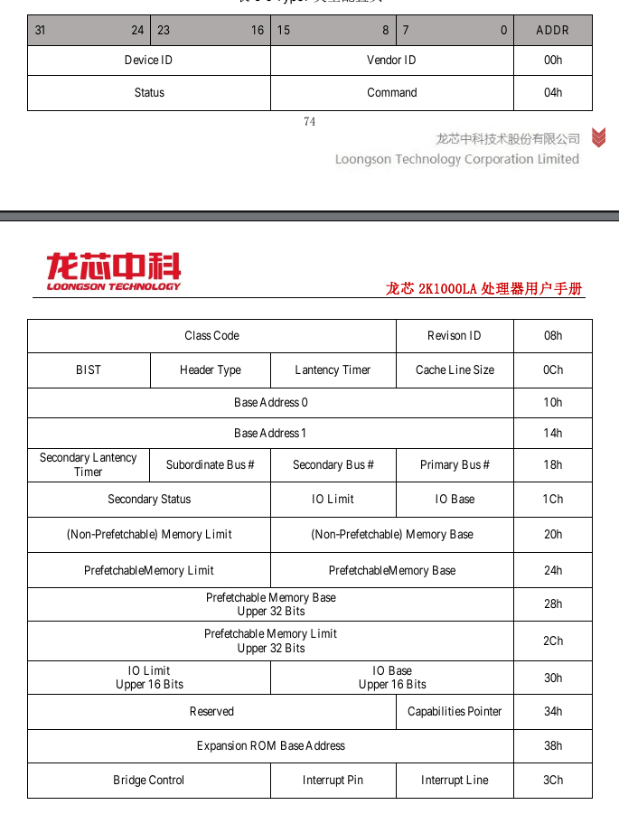

# pci总线

## 什么是总线

总线的本质作用是完成数据交换。 总线用于将两个或两个以上的部件连接起来, 使得它们
之间可以进行数据交换。

按照总线在计算机系统中所处的物理位置, 总线可以分为片上总线、 内存总线、 系统总线
和设备总线。

## pci总线的作用

pci 是一种总线协议，在计算机体系结构中起到连接主机与 I/O 设备的作用，属于设备总线的一种。

pci总线下可能连接着网卡，磁盘等多种设备，实现了对这些设备的统一管理。

pci总线采用配置空间、IO 空间和 Memory 空间的划分，将配置端口消息发送端口等区分开来。

## pci设备类型

pci 设备有多种类型，不同的pci设备有不同的配置头空间的划分

1. type0：此类pci设备一般为普通设备，例如网卡，磁盘等。
   如图为type0设备的配置头空间：
   
   配置头空间中大部分位都遵循pci标准协议，其中部分位由厂商自行定义。
2. type1：此类设备为pci桥接设备，如上图中的pci桥
   

通过对配置空间的读取，即可获取对应 pci 设备的设备信息。如bar地址等。

## 读写pci设备的配置信息

