# RDT技术

Intel RDT 是 Intel 提供的一套 CPU 资源管理技术，用于对多核系统中共享的微架构资源进行监控、隔离和分配。

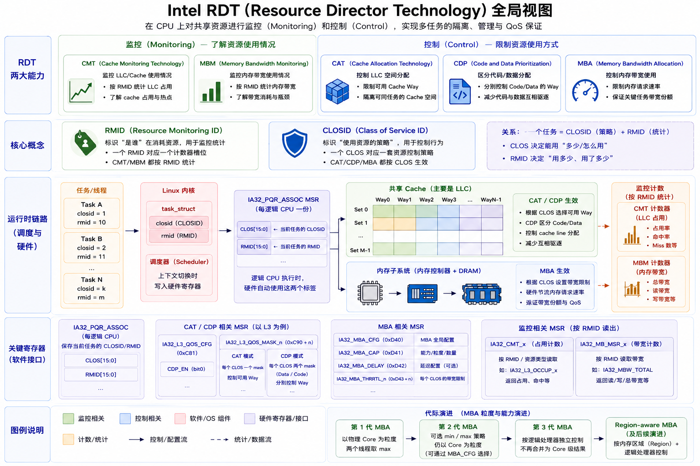

## RDT技术的作用

在云计算、虚拟化和容器场景中，多个任务运行在同一台物理机上，会共享 CPU、内存、LLC、内存控制器和 I/O 等资源。如果一个任务大量消耗某种共享资源，就可能导致其他任务延迟升高、吞吐量下降，这种现象称为 **Noisy Neighbor（吵闹邻居）**。

同一个 CPU Socket 中，不同 Core 通常拥有各自的 L1/L2 Cache，但会共享 L3 Cache（LLC）、内存控制器以及通往 DRAM 的内存带宽：

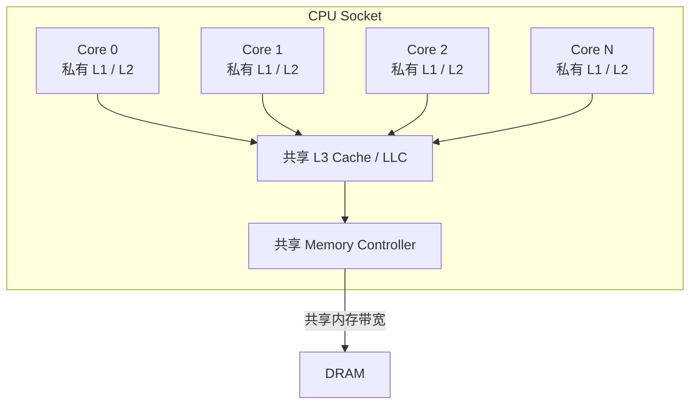

cgroup 可以在一定程度上解决 Noisy Neighbor 问题。它能够统计并限制任务使用的 CPU 时间、内存容量、进程数量和块设备 I/O 等资源。

但是，cgroup 主要管理操作系统能够统计和调度的资源，不能直接控制 LLC 容量和内存带宽等微架构资源。一个任务即使 CPU 使用率和内存容量都没有超过 cgroup 限额，仍然可能反复扫描大量数据，驱逐其他任务的缓存数据并占用大量内存带宽。

为弥补这一层面的资源控制缺口，Intel 提供了 RDT。作为 cgroup 的补充。由 RDT 负责对 CPU 的共享微架构资源的监控与管理，主要功能有：

* 监控不同任务的 LLC 占用量和内存带宽；
* 限制任务可以分配的 LLC Cache way，减少缓存污染；
* 对内存请求进行节流，缓解内存带宽竞争。

## RDT 管理的单元

### CLOS

CLOS 表示一类资源分配单位，硬件通过 CLOSID 来识别识别。CAT、CDP 和 MBA 都可以使用 CLOSID 选择对应的 Cache way 掩码或内存带宽策略。下面以 CAT 为例说明 CLOS 如何控制 LLC。

#### CLOS way 与 set 和 Cache line

同一时刻，一个任务只能关联一个 CLOS，但多个任务可以共享同一个 CLOS：

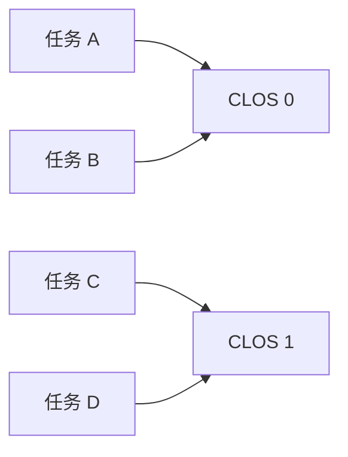

任务 A、B 使用 CLOS 0 的资源配置，任务 C、D 使用 CLOS 1 的资源配置。任务可以在运行过程中切换 CLOS，但切换后只关联新的一个 CLOS。

#### Cache 的 set、way 与 Cache line

要了解 CLOS way 的 划分，首先要知道 Cache line 的映射方式。

CPU Cache 通常采用组相联结构。CPU 访问内存时，LLC 会把完成地址翻译后的物理地址划分为三部分：

```text
+----------------+----------------+---------------+
| Tag            | Set Index      | Line Offset   |
| 剩余高位       | 选择一个 Set   | 选择 Line 字节 |
+----------------+----------------+---------------+
```

一般一个 Cache line 的大小为 64 Bytes。一个 Cache line 需要 6 bit 的 Line Offset，16384 个 set 需要 14 bit 的 Set Index，剩余高位作为 Tag。

假设 CPU 访问物理地址 `0x12345678`：

```text
Line Offset = 0x12345678 & 0x3f          = 0x38   = 56
Set Index   = (0x12345678 >> 6) & 0x3fff = 0x1159 = 4441
Tag         = 0x12345678 >> 20            = 0x123
```

CPU 先根据 Set Index 找到 `Set 4441`，再把 Tag `0x123` 与该 set 中 8 个 way 保存的 Tag 并行比较：

* Tag 匹配表示 Cache hit，CPU 根据 Line Offset 读取 Cache line 中偏移 56 的数据；
* Tag 都不匹配表示 Cache miss，CPU 从下一级存储加载 `0x12345640～0x1234567f` 这条 64 Bytes Cache line，再放入 Set 4441 的某个可用 way。

在一个 Set 中，一个 Way 位置对应一个 Cache Line

```text
Set 数量 = 8 MB /（8 ways × 64 Bytes）= 16384
```

它包含 16384 个 set，每个 set 有 8 个 way，每个 way 位置可以保存一条 Cache line。因此，一个 set 最多同时保存 8 条 Cache line。所有 set 中编号相同的位置组成一个完整的 way，例如 LLC 的 way 0 包含每个 set 的 way 0 位置。

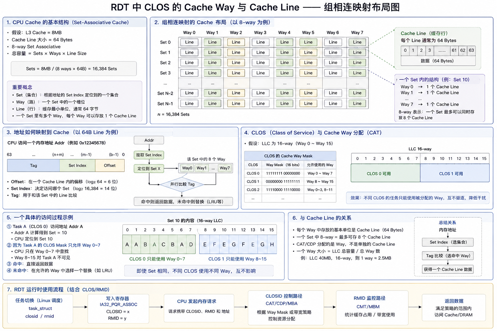

### RMID

RMID（Resource Monitoring ID）是 RDT 用来划分**监控对象**的编号。操作系统可以给一个任务、线程、虚拟机或任务组分配 RMID，硬件随后把该对象产生的 LLC 占用量和内存带宽记录到对应的 RMID 中。

RMID 的对应关系与 CLOS 类似：同一时刻一个任务只关联一个 RMID，但多个任务可以共享同一个 RMID。共享 RMID 时，硬件只会返回这些任务的合计数据；如果需要分别监控，就要给它们分配不同的 RMID。

```text
Task A ── RMID 10 ── 单独统计 A 的 LLC 占用和内存带宽
Task B ── RMID 11 ── 单独统计 B 的 LLC 占用和内存带宽

Task C ─┐
        ├─ RMID 12 ── 统计 C 和 D 的合计数据
Task D ─┘
```

RMID 和 CLOSID 相互独立。同一个 CLOS 中的任务使用相同的资源控制策略，但仍然可以使用不同 RMID 分开监控。例如，Task A 和 Task B 都使用 CLOSID=2，同时分别使用 RMID=10 和 RMID=11：

```text
A：CLOSID=2，RMID=10
B：CLOSID=2，RMID=11
```

CMT 会分别返回 RMID 10 和 RMID 11 的占用量。

如果 A、B 共用同一个 RMID，CMT 只能统计出两者的合计占用量，无法区分各自用了多少。

```text
CLOSID：决定任务可以如何使用 LLC 和内存带宽
RMID：  决定任务产生的监控数据记录到哪里
```

### 寄存器操作

IA32_PQR_ASSOC 的主要作用是将当前运行的任务与 RMID 以及 CLOS 绑定起来。

该寄存器的字段如下图所示：

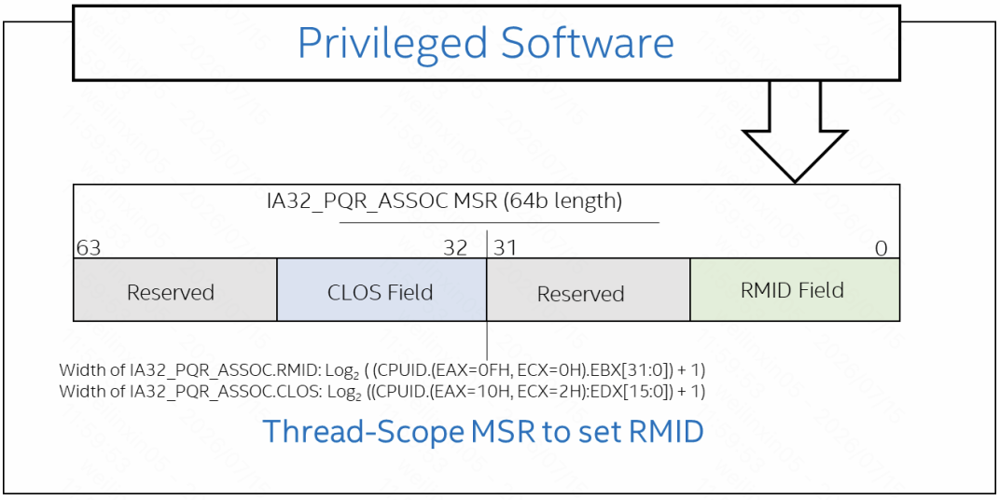

* RMID Field：指明当前任务对应的 RMID
* CLOS Field：指明当前任务对应的 CLOS

在内核中对应的宏：

```c
/* - Intel: */
#define MSR_IA32_PQR_ASSOC		0xc8f
```

在系统的实现中，由任务控制块 task_struct 记录了该任务的 RMID 与CLOS ID

```c
// task_struct
#ifdef CONFIG_X86_CPU_RESCTRL
	u32				closid;
	u32				rmid;
```

在进行上下文切换时，内核会将 `task_struct` 中保存的 CLOSID 和 RMID 写入 `IA32_PQR_ASSOC`。

任务运行期间，硬件根据 CLOSID 选择对应的 CAT、CDP 或 MBA 配置，对该任务的 Cache 和内存带宽使用进行限制；RMID 和 CLOS 类似。也是根据该任务的 RMID 来采集 LLC 占用量和内存带宽数据。

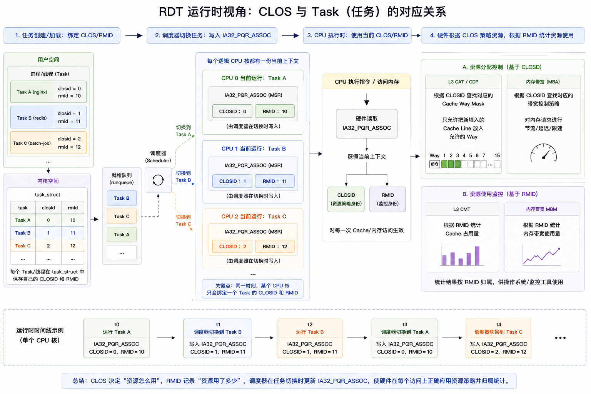

## RDT 的功能与对应的操作方式

| 资源 | 监控 | 控制 |
|---|---|---|
| LLC/L3 | CMT：Cache Monitoring Technology | CAT：Cache Allocation Technology |
| L2/L3 指令与数据 | — | CDP：Code and Data Prioritization |
| 内存带宽 | MBM：Memory Bandwidth Monitoring | MBA：Memory Bandwidth Allocation |

### 监控类功能

#### CMT

CMT 是 Intel RDT 中用于监控任务 LLC/L3 Cache 占用情况的功能。它使用 RMID 区分监控对象，硬件会统计各个 RMID 当前仍驻留在 LLC 中的 Cache line；如果多个任务共用一个 RMID，读取到的就是这些任务的合计占用量。

CMT 主要提供 LLC Occupancy 数据，用来表示某个 RMID 当前实际占用了多少 LLC 容量。它统计的是当前占用量，而不是历史累计值：新的 Cache line 被加载时占用量会上升，Cache line 被驱逐后占用量会下降。

CMT 可以用来发现大量占用 LLC 的 Noisy Neighbor、分析任务的缓存工作集，也可以配合 CAT 调整任务能够使用的 Cache way。简单来说，CAT 负责控制任务可以使用哪些 Cache way，CMT 负责观察任务实际占用了多少 LLC。

#### MBM

MBM 是 Intel RDT 中用于监控任务内存带宽使用情况的功能。它和 CMT 一样使用 RMID 区分监控对象，硬件会把任务产生的内存流量累计到对应的 RMID 中；如果多个任务共用一个 RMID，读取到的就是这些任务的合计流量。

MBM 主要提供两类数据：

* **Total Memory Bandwidth**：任务产生的总内存流量；
* **Local Memory Bandwidth**：任务访问当前 CPU Socket 本地内存的流量。

MBM 记录的是累计传输字节数，软件通过两次采样的差值计算一段时间内的实际带宽：

```text
内存带宽 =（本次计数值 - 上次计数值）/ 采样时间
```

MBM 可以用来发现大量占用内存带宽的 Noisy Neighbor，也可以配合 MBA 对这类任务进行带宽限制。CMT 观察的是任务当前占用了多少 LLC，MBM 观察的则是任务在一段时间内产生了多少内存流量。

#### 寄存器操作

对 CMT 和 MBM 进行读取主要依赖以下两个寄存器。

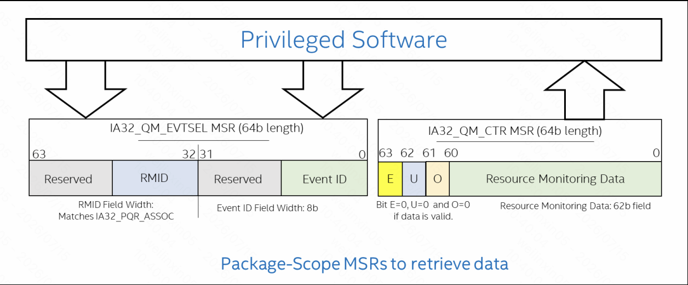

**IA32_QM_EVTSEL MSR** 是一个事件选择寄存器，向其中填入如下信息可以发起一次读取监控的请求。

| 位域范围 | 字段名称 | 简要说明 |
| :--- | :--- | :--- |
| [7:0] | Event ID | 指定查询的事件类型。CMT/LLC Occupancy：0x01、MBM Total：0x02、MBM Local：0x03 |
| [31:24]*** | RMID | 指定资源监控 ID。用于标识要查询哪个“监控组”的数据（宽度取决于 CPU 实现，通常对应 `IA32_PQR_ASSOC` 中的 RMID 宽度）。 |
| [63:32] 及中间保留位 | Reserved | 保留位。写入时必须为 0，读取时忽略。 |

**IA32_QM_CTR MSR** 用来读取监控结果的寄存器，长度同样为 64 位。

| 位域范围 | 字段名称 | 简要说明 |
| :--- | :--- | :--- |
| [61:0] | Resource Monitoring Data | 实际统计数据。如缓存占用字节数或累积带宽计数值。仅当状态位均为 0 时有效。 |
| [61] | O (Unavailable) | 数据不可用标志。置 1 表示当前无法提供数据。 |
| [62] | U (Unsupported) | 不支持标志。置 1 表示不支持所请求的 Event ID 事件类型。 |
| [63] | E (Error) | 错误标志。置 1 表示发生了其他错误。 |

在内核中对应的宏：

```c
/* - Intel: */
#define MSR_IA32_QM_EVTSEL		0xc8d
#define MSR_IA32_QM_CTR			0xc8e
```
### 控制类功能

#### CAT

CAT 是 Intel RDT 中用于控制共享 Cache 容量的功能，CAT 在 Cache Line 的分配、填充和替换过程中，根据 CLOS 对应的 CBM 限制可选 Way。并通过这种方法，减少任务之间的缓存驱逐和 Cache 污染，从而保护延迟敏感任务并提高性能稳定性。

这里 CAT 控制的是某个任务对应的 CLOS 下 Cache line 的分配位置，而不是内存访问权限，因此属于性能隔离机制。

CAT 为每个 CLOS 配置一个 CBM，CBM 中的每一位对应一个 Cache way。例如，一个 16-way LLC 可以配置为：


```text
CLOS 0：CBM = 0x00ff -> 允许在 way 0～7 中分配
CLOS 1：CBM = 0xff00 -> 允许在 way 8～15 中分配
```

假设任务 A 属于 CLOS 0，任务 B 属于 CLOS 1，并且它们访问的地址都映射到 Set 10：

* 如果任务 A 发生 Cache miss，新加载的 Cache line 只能分配到 Set 10 的 way 0～7；
* 如果任务 B 发生 Cache miss，新加载的 Cache line 只能分配到 Set 10 的 way 8～15；
* 两组 way 不重叠，所以 A、B 在分配新缓存行时不会占用对方的 way，从而减少相互驱逐和 Cache 污染。

假设 LLC 总容量为 40 MB、共有 16 个 way，那么每个 way 对应的容量约为 40 MB / 16 = 2.5 MB。给 CLOS 0 分配 8 个 way，就相当于允许它使用大约 20 MB 的 LLC 容量。

如果两个 CLOS 的 CBM 有重叠，它们仍会在重叠的 way 上竞争。因此，不重叠的 CBM 更强调隔离，重叠的 CBM 则可以在隔离性和 Cache 利用率之间进行权衡。

#### 寄存器操作

CAT 使用一组按 CLOSID 编号的 mask 寄存器保存每个 CLOS 可以使用的 Cache way。

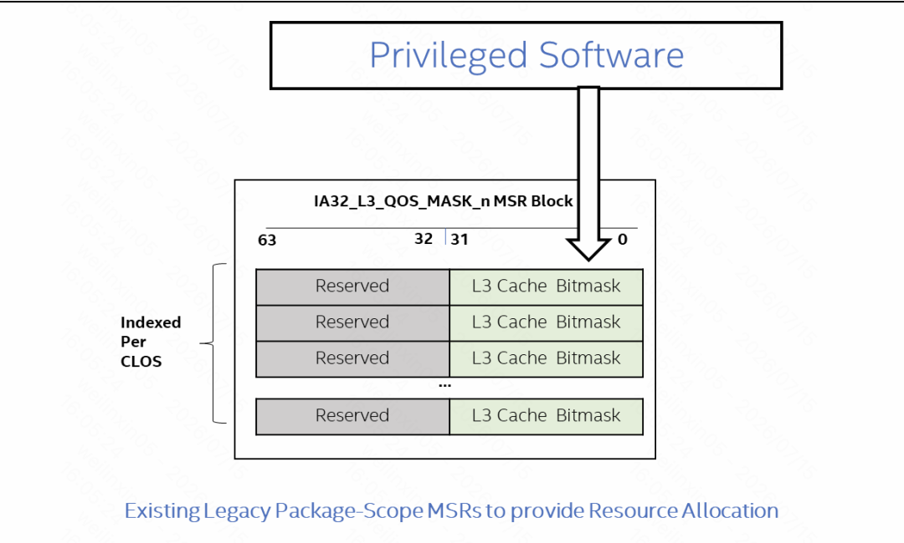

IA32_L3_QOS_MASK_n 用于控制 L3/LLC，其中 n 就是 CLOSID。L2 CAT 的工作方式相同，只是使用 IA32_L2_QOS_MASK_n`。

在内核中对应的宏：

```c
#define MSR_IA32_L3_CBM_BASE		0xc90
#define MSR_IA32_L2_CBM_BASE		0xd10
```

每个 mask 寄存器都是一个 MSR，低 N 位组成 CBM，N 等于该级 Cache 支持的 way 数量，其余高位为保留位。

其中的 bit i 对应 way i：写入 1 表示允许该 CLOS 在这个 way 中分配或替换 Cache line，写入 0 表示禁止。

软件可以通过 `CPUID.0x10` 查询支持的 Cache way、CLOS 数量和 mask 宽度。

以图中的 8-way LLC 为例，特权软件可以这样配置不同 CLOS：

```text
CLOS 0 → IA32_L3_QOS_MASK_0（0xC90）= 0xff  → way 0～7
CLOS 1 → IA32_L3_QOS_MASK_1（0xC91）= 0x0f  → way 0～3
CLOS 2 → IA32_L3_QOS_MASK_2（0xC92）= 0x3c  → way 2～5
CLOS 3 → IA32_L3_QOS_MASK_3（0xC93）= 0xf0  → way 4～7
```

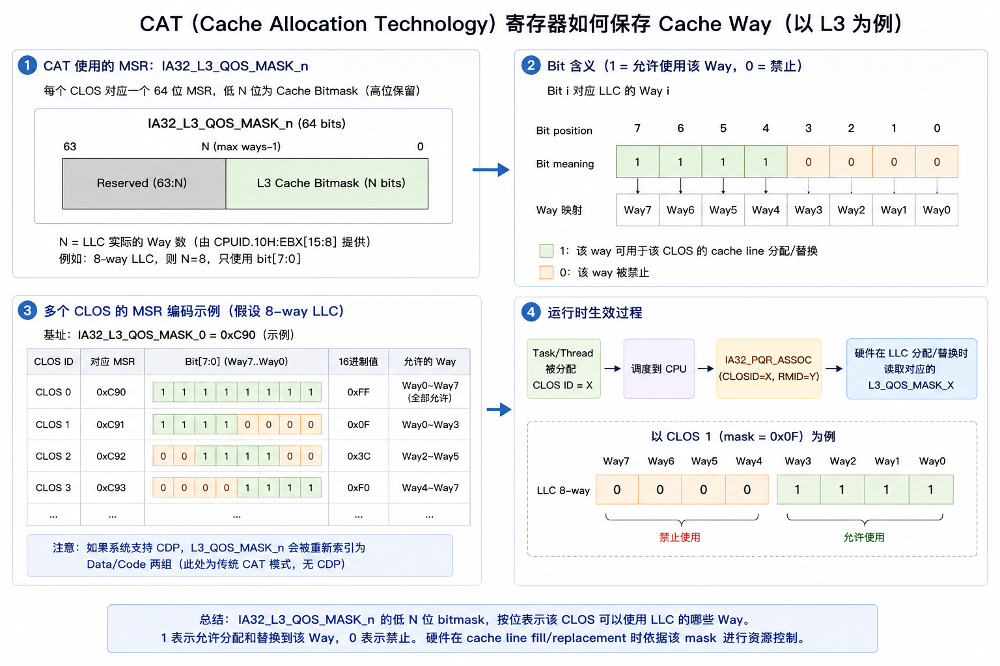

mask 配置完成后，还需要让硬件知道当前线程属于哪个 CLOS。线程被调度到逻辑 CPU 上运行时，内核会把它的 CLOSID 写入该逻辑 CPU 的 IA32_PQR_ASSOC。此后发生 LLC Cache miss、需要分配或替换 Cache line 时，硬件会根据 CLOSID 选择对应的 IA32_L3_QOS_MASK_n，然后只在 mask 为 1 的 way 中选择位置。

例如，当前线程的 CLOSID=1，硬件就会读取 IA32_L3_QOS_MASK_1，因此新的 Cache line 只能分配到 way 0～3：

```text
线程被调度运行
      ↓
IA32_PQR_ASSOC.CLOSID = 1
      ↓
选择 IA32_L3_QOS_MASK_1
      ↓
读取 CBM = 0x0f
      ↓
只允许在 way 0～3 中分配或替换 Cache line
```

### CDP

CDP 是 Code and Data Prioritization，代码与数据优先级控制。它是 CAT 的扩展，用来把同一个 CLOS 对 Cache 的控制拆分成对 code 与 data 分别的控制。

接着前面的例子，假设任务 A 属于 CLOS 0，占用了 way 0～7 中分配

开启 CDP 前：

CLOS 0
  └──  way 0～7 

开启 CDP 后：

令：

```text
Code mask = 11110000
Data mask = 00001111
```

那么就有：

```text
CLOS 0
  ├── Data CBM
  └── Code CBM
```

在开启 CDP 后，同一个 CLOSID 会同时对应 Code mask 和 Data mask 两套配置。

当属于 CLOSID=0 的线程执行指令读取时，如果需要向 Cache 分配新的指令 Cache line，硬件会使用 Code mask，将其限制在 way 4～7。

而当线程执行 Load 或 Store 数据访问时，如果需要分配新的数据 Cache line，硬件则会使用 Data mask，将其限制在 way 0～3。

这样可以分别控制代码和数据占用的 Cache 空间，减少二者之间的相互驱逐。

#### 寄存器操作

使用 CDP 前，需要通过对应的 `IA32_L3_QOS_CFG` 或 `IA32_L2_QOS_CFG` 寄存器使能该功能。

```c
/* - Intel: */
#define MSR_IA32_L3_QOS_CFG		0xc81
#define MSR_IA32_L2_QOS_CFG		0xc82

IA32_L3_QOS_CFG.bit0 = 1 // → 开启 L3 CDP
IA32_L3_QOS_CFG.bit0 = 0  //→ 关闭 L3 CDP

IA32_L2_QOS_CFG.bit0 = 1  //→ 开启 L2 CDP
IA32_L2_QOS_CFG.bit0 = 0  //→ 关闭 L2 CDP
```

CDP 与 CAT 使用同一套寄存器接口 `IA32_L3_QOS_MASK_n` 与 `IA32_L2_QOS_MASK_n`。开启 CDP 后，原有 mask 寄存器的含义会发生如下变化：

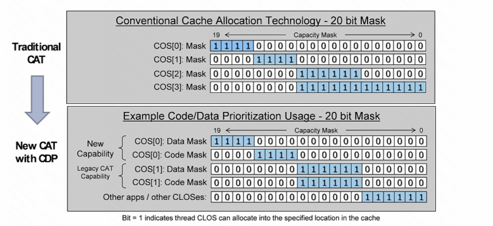

传统 CAT 模式下，一个 CLOS 只对应一个 mask，这个 mask 同时控制该 CLOS 中代码和数据的 Cache line 分配。例如，4 个 mask 寄存器可以分别表示 CLOS 0、CLOS 1、CLOS 2 和 CLOS 3。

开启 CDP 后，硬件不会增加新的 mask 寄存器，而是重新解释原有的寄存器空间。每个 CLOS 改为占用两个连续的 mask：偶数编号的 mask 保存 Data mask，奇数编号的 mask 保存 Code mask。其索引关系如下：

```text
CLOS n 的 Data mask → IA32_L3_QOS_MASK_(2n)
CLOS n 的 Code mask → IA32_L3_QOS_MASK_(2n+1)
```

原来的 mask 0～3 在开启 CDP 后，会分别变成 CLOS 0.Data、CLOS 0.Code、CLOS 1.Data 和 CLOS 1.Code。因此，每个 CLOS 获得了独立的代码和数据控制能力，但软件可使用的逻辑 CLOS 数量通常会减少，这里需要通过 CPUID 枚举获取到具体数量。

下图以 8-way L3 Cache 为例，展示了 CDP 的寄存器索引方式以及硬件在 Instruction Fetch 和 Data Load/Store 时如何选择不同的 mask。

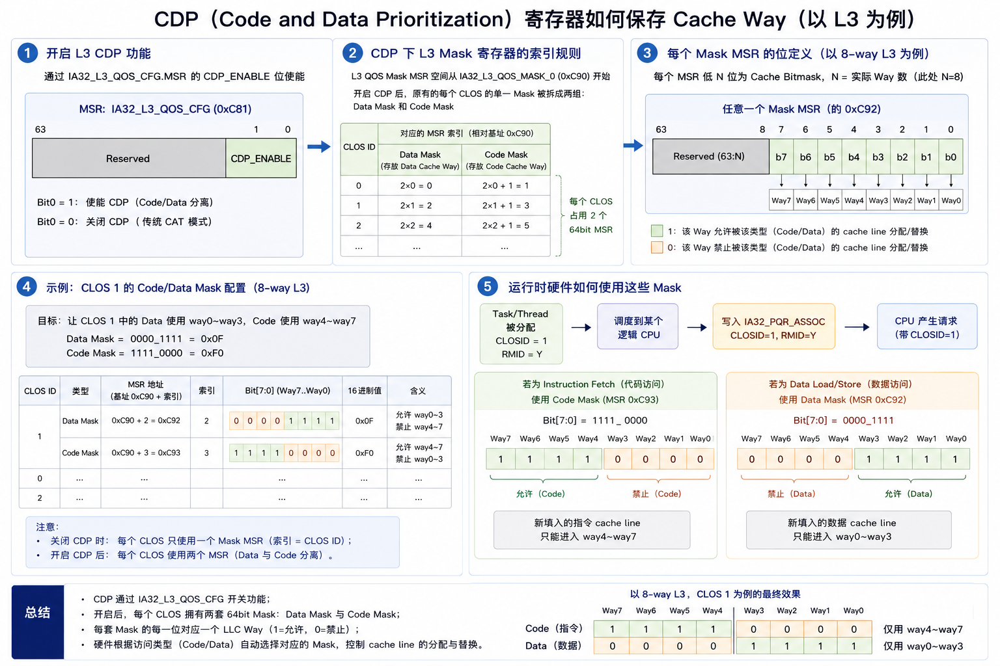

### MBA

MBA 用于限制任务产生内存请求的速率，减少某个任务长期占用大量内存带宽而影响其他任务。它与 CAT 一样使用 CLOSID 区分不同的资源控制策略。

MBA 的限制策略并不是在 DRAM 总线上为任务划出一段固定带宽，而是在 CPU Core 与共享 LLC/互连之间设置请求速率控制器。硬件根据 CLOS 对内存请求插入额外等待周期，使单位时间内能够发送的请求数量减少，从而间接降低任务占用的内存带宽。

```text
未限制：请求1 → 请求2 → 请求3 → 请求4

MBA限制：请求1 → 等待 → 请求2 → 等待 → 请求3
```

由于 MBA 的控制点位于 Core 通往共享 LLC/互连的请求路径上，它也可能影响 LLC 访问较多但 DRAM 流量不高的任务；对于频繁发生 Cache miss、严重依赖 DRAM 的任务，这些等待还会逐渐传递到流水线，使任务吞吐量下降。

#### 寄存器操作

MBA 和 CAT 类似，也是使用一组寄存器来记录对内存带宽的限制。

这里每个 CLOS 对应一个 IA32_MBA_THRTL_n MSR，其中 n 为 CLOSID，寄存器地址从 0xD50 开始。寄存器中的 delay 值表示硬件需要施加的节流强度：delay 为 0 表示不节流，值越大通常表示插入的延迟越多、限制越强。CPU 支持的最大 delay 和控制粒度需要通过 `CPUID.0x10` 查询。

```text
CLOS 0 → IA32_MBA_THRTL_0（0xD50）→ delay = 0   // 不限制
CLOS 1 → IA32_MBA_THRTL_1（0xD51）→ delay = 50  // 示例：进行节流
CLOS 2 → IA32_MBA_THRTL_2（0xD52）→ delay = 80  // 示例：更强节流
```

内核中的宏：

```c
#define MSR_IA32_MBA_THRTL_BASE		0xd50
```

运行时生效过程：

任务被调度到逻辑 CPU 上时，内核会把任务的 CLOSID 写入 `IA32_PQR_ASSOC`。硬件随后根据 CLOSID 选择对应的 `IA32_MBA_THRTL_n`，并在任务产生内存请求时应用其中的 delay 值：

```text
任务的 CLOSID = 1
        ↓
IA32_PQR_ASSOC.CLOSID = 1
        ↓
选择 IA32_MBA_THRTL_1
        ↓
按 delay 值限制请求发送速率
        ↓
降低该任务占用的内存带宽
```

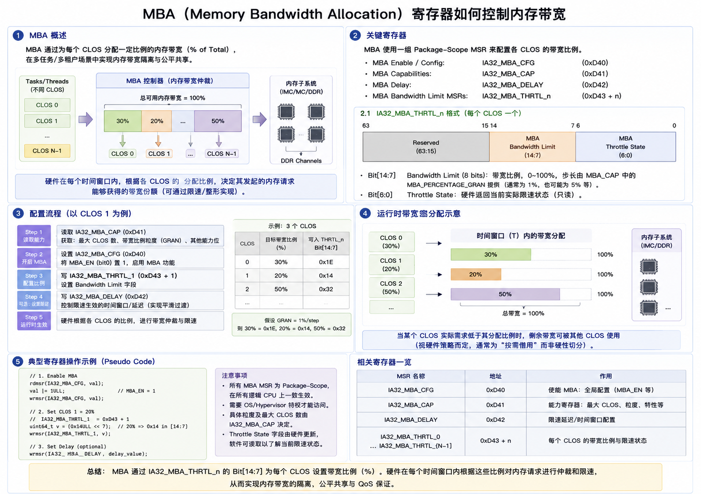

## 寄存器的映射地址

```c
/* - Intel: */

#define MSR_IA32_QM_EVTSEL		0xc8d
#define MSR_IA32_QM_CTR			0xc8e
#define MSR_IA32_PQR_ASSOC		0xc8f
#define MSR_IA32_L3_CBM_BASE		0xc90
#define MSR_IA32_L2_CBM_BASE		0xd10
#define MSR_IA32_MBA_THRTL_BASE		0xd50
```

## L2 为什么也可以使用 RDT

L2 Cache 通常被称为 **private L2**，这里的 private 是指它属于一个物理 Core，不与其他物理 Core 共享，并不表示它只会被一个任务使用。

在典型支持 Hyper-Threading/SMT 的处理器中，一个物理 Core 可以包含两个逻辑 CPU。两个逻辑 CPU 拥有各自的部分架构状态，但会共享该 Core 内的大量微架构资源，其中通常包括 L1/L2 Cache、执行单元以及通往 LLC 的接口：

```text
Physical Core 0
├── Logical CPU 0
├── Logical CPU 1
└── Shared private L2

Physical Core 1
├── Logical CPU 2
├── Logical CPU 3
└── Shared private L2
```

因此，private L2 只是“不跨物理 Core 共享”，并不等于“没有资源竞争”。L2 CAT 的作用，就是控制不同 CLOS 的任务可以向 L2 的哪些 Cache way 分配新的 Cache line。

### SMT 线程之间的 L2 竞争

假设同一个物理 Core 的两个逻辑 CPU 分别运行高优先级任务和后台任务：

```text
Logical CPU 0 → 高优先级任务 A
Logical CPU 1 → 后台任务 B
                     │
                     └── 共享同一个 L2
```

如果任务 B 不断扫描大量数据，它可能持续向 L2 填充新的 Cache line，并驱逐任务 A 的热点数据。虽然两个任务运行在不同的逻辑 CPU 上，但它们仍然会竞争：

* L1/L2 Cache 容量；
* Cache tag 和 data array 的访问端口；
* load/store 单元；
* miss handling 资源；
* 执行单元和内存请求队列。

L2 CAT 可以为两个任务配置不同的 L2 way mask。例如，一个 8-way L2 可以配置为：

```text
Logical CPU 0 → Task A → CLOS 1 → L2 mask = 11110000
Logical CPU 1 → Task B → CLOS 2 → L2 mask = 00001111

共享 L2：
way 0～3 → Task B 可以分配
way 4～7 → Task A 可以分配
```

当任务 A、B 发生 L2 Cache miss 时，新加载的 Cache line 只能进入各自 mask 允许的 way，从而减少两个 SMT 线程之间的缓存驱逐和污染。

### 关闭 SMT 后仍然存在任务切换干扰

即使关闭 SMT，一个物理 Core 同一时刻只执行一个线程，L2 CAT 仍然有意义。因为操作系统会在这个 Core 上切换不同任务：

```text
t0：Task A 运行，在 L2 中留下热点数据
t1：切换到 Task B，Task B 大量填充 L2
t2：再次切回 Task A，原有热点数据可能已经被驱逐
```

此时不存在两个线程同时竞争 L2，但后运行的任务仍然可能污染先前任务留下的缓存内容。通过限制低优先级任务可分配的 L2 way，可以减少任务切换产生的 Cache 污染，提高热点数据的复用率以及实时任务执行时间的稳定性。

需要注意，CAT 的限制跟随任务的 CLOS，而不是永久把某些 L2 way 划给某个任务。任务 A 被调度时使用 A 对应的 mask，任务 B 被调度时则使用 B 对应的 mask。

### L2 CAT 的能力边界

L2 CAT 控制的是 Cache miss 后新 Cache line 的分配和替换范围，提供的是 **Cache 容量隔离**，不能实现整个物理 Core 的完全隔离。

即使两个 SMT 线程使用互不重叠的 L2 way，它们仍然会共享 L2 访问带宽、Cache 端口、执行流水线和 miss handling 等资源。因此，L2 CAT 可以缓解由 Cache 容量竞争造成的性能干扰，但无法消除同一物理 Core 内的所有资源竞争。

总结来说，一个 private L2 仍然可能被同一物理 Core 上的多个 SMT 线程同时使用，也可能被不同时间片中的任务先后使用。L2 CAT/CDP 正是通过限制不同 CLOS 向 L2 分配 Cache line 的范围，降低 SMT 干扰和任务切换造成的 Cache 污染，从而提高任务的 QoS 和执行确定性。
