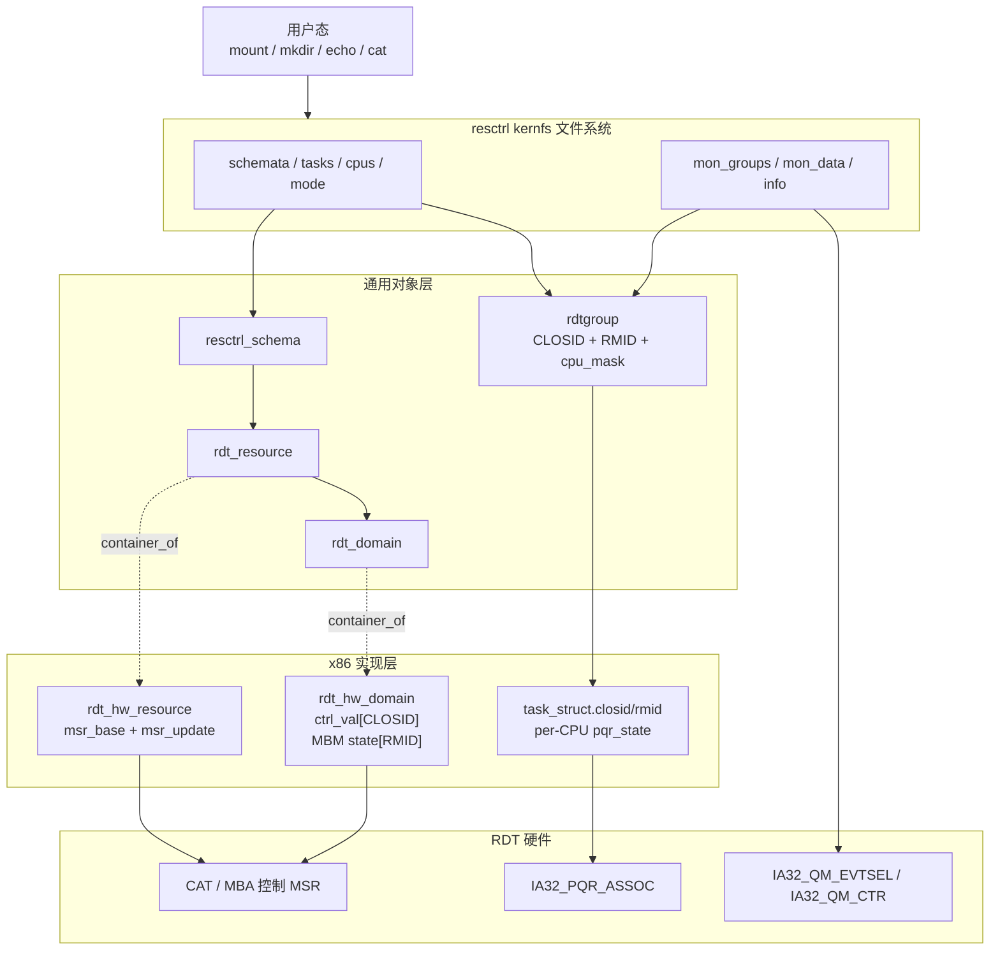
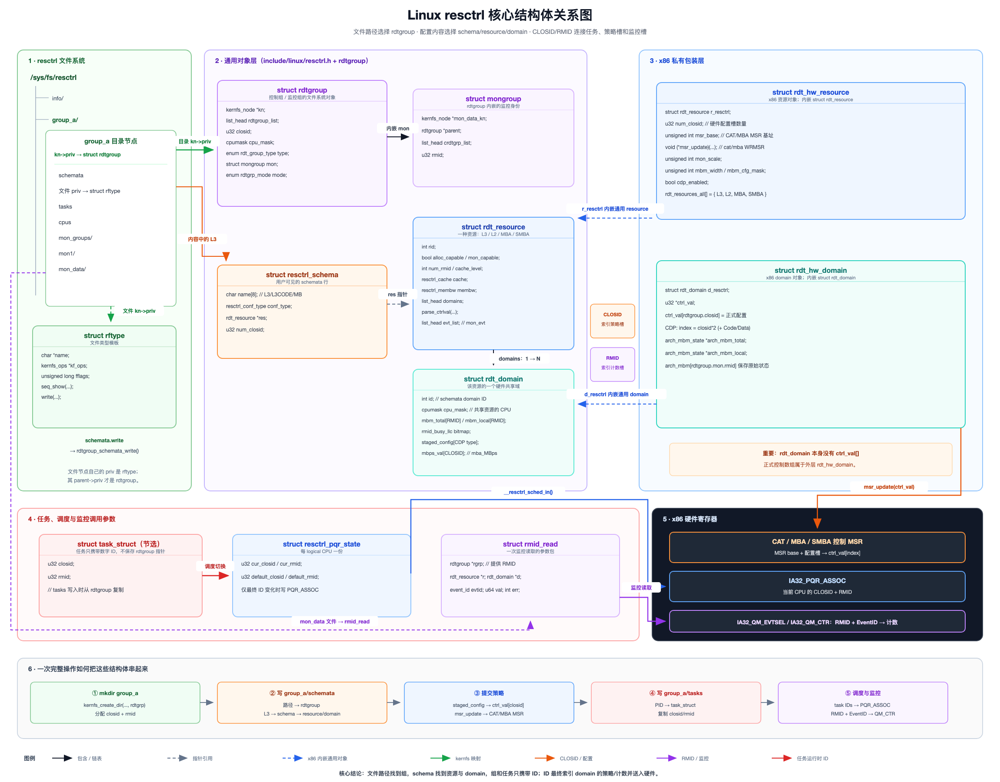
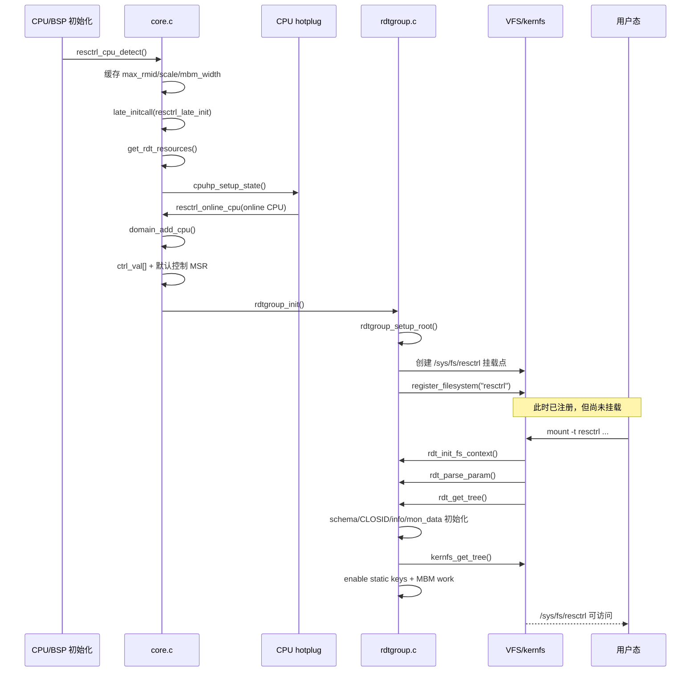
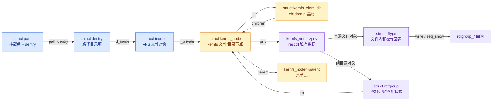
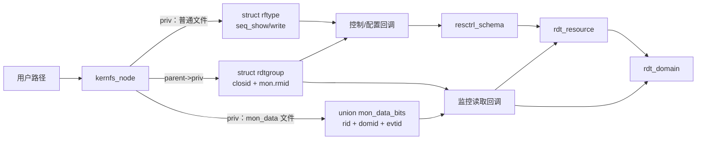
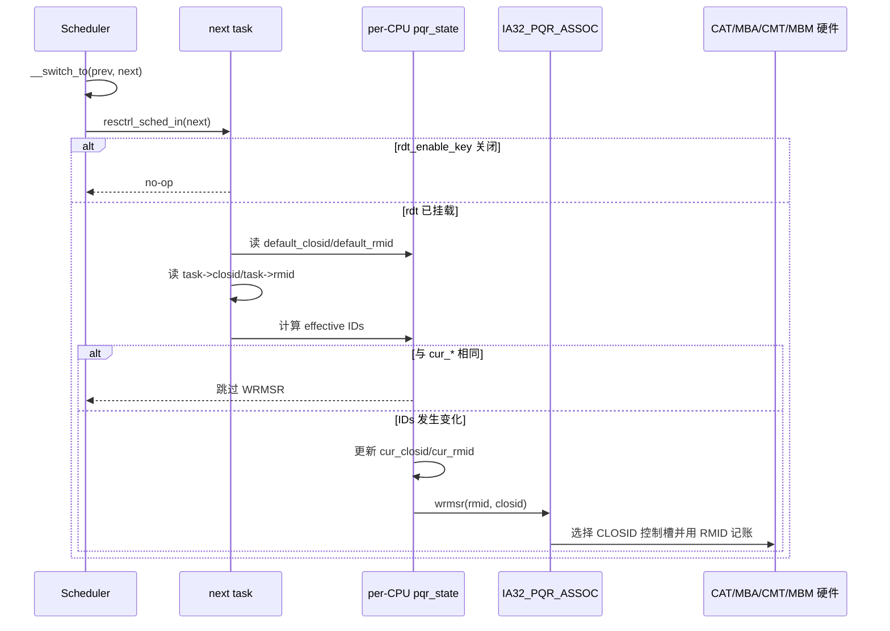

# Linux resctrl 内核实现代码阅读报告

## resctrl 是做什么的

resctrl 是 Linux 对 x86 Resource Director Technology（RDT）和 AMD QoS 能力的通用管理层，它向用户提供两类功能：

- 资源分配：CAT/CDP 限制可使用的 L3/L2 cache way，MBA/SMBA 限制内存带宽。
- 资源监控：CMT 统计 LLC occupancy，MBM 统计 total/local memory bandwidth。

它的核心设计是把“策略配置”和“运行时选择”分开：

```text
控制面
    用户写 schemata
        → 在每个 resource/domain 中保存 CLOSID 配置
        → 立即写入 CAT/MBA 控制 MSR

运行时面
    调度器切入任务
        → 把任务的 CLOSID/RMID 写入 IA32_PQR_ASSOC
        → 硬件选择已配置好的控制槽，并按 RMID 记账
```

因此：

- CLOSID 是“选择哪套控制配置”的硬件索引。
- RMID 是“将资源使用量记到哪个监控身份”的硬件标签。
- resource 描述资源种类，domain 描述这种资源的一个硬件共享范围。
- rdtgroup 是 resctrl 文件系统中的用户分组对象。



## 用到的结构体



这些关系中，只有 schema/resource/domain 和通用/x86 包装是直接指针或内嵌关系。`rdtgroup`、`task_struct` 和 domain 配置主要通过 CLOSID/RMID 数值关联。

### 配置类型与监控事件编号

源码：[include/linux/resctrl.h](../kernel-6.6/include/linux/resctrl.h)

```c
enum resctrl_conf_type {
	CDP_NONE,                 /* 普通配置，不区分 Code/Data */
	CDP_CODE,                 /* CDP 代码 cache 配置 */
	CDP_DATA,                 /* CDP 数据 cache 配置 */
};

#define CDP_NUM_TYPES (CDP_DATA + 1)

enum resctrl_event_id {
	QOS_L3_OCCUP_EVENT_ID     = 0x01, /* LLC occupancy */
	QOS_L3_MBM_TOTAL_EVENT_ID = 0x02, /* 总内存流量 */
	QOS_L3_MBM_LOCAL_EVENT_ID = 0x03, /* 本地 NUMA 内存流量 */
};
```

`resctrl_event_id` 的数值就是读监控计数器时写入`IA32_QM_EVTSEL` 的事件编号。

### `struct mongroup` 与 `struct rdtgroup`

```c
enum rdt_group_type {
	RDTCTRL_GROUP = 0,       /* 控制+监控组 */
	RDTMON_GROUP,            /* 纯监控组 */
	RDT_NUM_GROUP,
};

enum rdtgrp_mode {
	RDT_MODE_SHAREABLE = 0, /* 允许与其他组共享 CBM */
	RDT_MODE_EXCLUSIVE,     /* 控制区域不得与其他组重叠 */
	RDT_MODE_PSEUDO_LOCKSETUP,
	RDT_MODE_PSEUDO_LOCKED,
	RDT_NUM_MODES,
};

struct mongroup {
	struct kernfs_node *mon_data_kn; /* 该组 mon_data/ 目录节点 */
	struct rdtgroup *parent;         /* MON group 的父 CTRL_MON group */
	struct list_head crdtgrp_list;  /* 挂入父组监控子组链表 */
	u32 rmid;                        /* 该组的监控身份 */
};

struct rdtgroup {
	struct kernfs_node *kn;          /* 该组目录的 kernfs node */
	struct list_head rdtgroup_list; /* 挂入全局 rdt_all_groups */
	u32 closid;                      /* CTRL_MON group 的控制身份 */
	struct cpumask cpu_mask;        /* 通过 cpus 文件分配给组的 CPU */
	int flags;                       /* RDT_DELETED 等生命周期标志 */
	atomic_t waitcount;             /* 正等待使用该组的路径计数 */
	enum rdt_group_type type;       /* CTRL_MON 或 MON */
	struct mongroup mon;            /* RMID、父组和 mon_data 状态 */
	enum rdtgrp_mode mode;          /* shareable/exclusive/pseudo-lock */
	struct pseudo_lock_region *plr;/* 组侧的 pseudo-lock 区域 */
};
```

struct rdtgroup 是 resctrl 文件系统中资源控制与监控组的统一运行时抽象，通过 type 和 mode 区分组类型与隔离策略，并分别管理 CLOSID 与 RMID。当用户在用户态通过文件系统暴露的接口进行配置时，会用到 rdtgroup 来找到对应的资源控制/监控组。

在 resctrl 的设计中，资源的管理与监控虽然是两套id。但是 MON 组必须创建在某个 CTRL_MON 组的 mon_groups/ 目录下：

```text
mkdir /sys/fs/resctrl/group_a
mkdir /sys/fs/resctrl/group_a/mon_groups/mon1
```

即使直接创建在默认根组的监控目录下：

```text
mkdir /sys/fs/resctrl/mon_groups/mon1
```

但此时它的父组是默认组，仍然不是独立组。

```text
/sys/fs/resctrl/
├── 默认组：closid = 0，rmid = 0
├── group_a：closid = 2
└── group_b：closid = 3
```

两种组的 ID 关系：

```text
一个 CTRL_MON 组
├── closid = 2
├── 自己的 rmid = 5
├── MON 组 mon1：closid = 2，rmid = 8
└── MON 组 mon2：closid = 2，rmid = 9
```

* 一个 CTRL_MON 组拥有一个 CLOSID；
* 该组下面可以创建零个或多个 MON 监控组；
* 这些 MON 组都继承父组的 CLOSID；
* 每个 MON 组拥有不同的 RMID，用于分别统计监控数据。

这里说明 MON group 只把父组中的任务/CPU 拆成不同监控身份，不建立新的 CAT/MBA 控制策略。

但是 clos 是不允许嵌套的。前面提到的根组也只是 resctrl 内核预先创建的特殊 rdtgroup_defaul。如果直接在 /sys/fs/resctrl/ 目录下设置就是默认的 closid = 0 的组。


### struct rdt_resource

```c
struct rdt_resource {
	int rid;                    /* 资源编号：L3/L2/MBA/SMBA */
	bool alloc_capable;         /* 这种资源是否支持分配 */
	bool mon_capable;           /* 这种资源是否支持监控 */
	int num_rmid;               /* 这种监控资源的 RMID 数量 */
	int cache_level;            /* 决定 domain 拓扑范围的 cache level */

	struct resctrl_cache cache; /* CAT/cache 能力和 CBM 校验规则 */
	struct resctrl_membw membw; /* MBA/SMBA 能力和转换规则 */

	struct list_head domains;   /* 该资源所有 rdt_domain 的链表头 */
	char *name;                 /* schemata/info 中的名称：L3/L2/MB/SMBA */
	int data_width;             /* 格式化输出数值的宽度 */
	u32 default_ctrl;           /* 默认 CBM 或默认带宽百分比 */
	const char *format_str;     /* schemata 输出格式 */

	int (*parse_ctrlval)(struct rdt_parse_data *data,
	                     struct resctrl_schema *s,
	                     struct rdt_domain *d);
	                             /* CAT 用 parse_cbm，MBA 用 parse_bw */

	struct list_head evt_list;  /* 该资源支持的 mon_evt 链表 */
	unsigned long fflags;       /* 决定为该资源创建哪些文件 */
	bool cdp_capable;           /* 该资源是否支持 CDP */
};
```

该结构体是 resctrl 框架中描述一种可管理的硬件资源在系统全局的通用抽象，它封装了该资源的分配与监控能力、作用域拓扑、默认配置及用户交互接口。

通过该结构体可以把用户态传入的配置和底层的 domain 联系起来。

它是架构无关的资源描述，只保存通用的一些属性。对于具体的体系结构会有自己专属的结构体实现，在这些结构体中会将 rdt_resource 内嵌进去。

### `struct rdt_hw_resource`

```c
struct rdt_hw_resource {
	struct rdt_resource r_resctrl;    /* 内嵌的通用 resource */
	u32 num_closid;                   /* 硬件真实 CLOSID 配置槽数，未扣除 CDP */
	unsigned int msr_base;            /* 该资源的控制 MSR 基址 */
	void (*msr_update)(struct rdt_domain *d,
	                   struct msr_param *m,
	                   struct rdt_resource *r);
	                                    /* CAT/MBA 架构专用写 MSR 函数 */
	unsigned int mon_scale;           /* QM 原始值到字节的缩放比例 */
	unsigned int mbm_width;           /* MBM 硬件计数器位宽 */
	unsigned int mbm_cfg_mask;        /* BMEC 可配置的带宽来源位 */
	bool cdp_enabled;                 /* 当前该资源是否启用 CDP */
};

static inline struct rdt_hw_resource *
resctrl_to_arch_res(struct rdt_resource *r)
{
	return container_of(r, struct rdt_hw_resource, r_resctrl);
}
```
struct rdt_hw_resource 是 x86 架构下 rdt_resource 的硬件私有扩展，它通过内嵌通用资源并附加 MSR 基址、写寄存器函数指针及硬件特定参数。

`rdt_hw_resource` 保存“这种资源如何访问硬件”，`rdt_hw_domain` 保存“这个共享域当前的每 CLOSID/RMID 状态”。

x86 中典型的 `msr_update` 实现是：

```text
L3/L2 CAT → cat_wrmsr()
Intel MBA → mba_wrmsr_intel()
AMD MBA/SMBA → mba_wrmsr_amd()
```

rdt_hw_resource 结构体被存放在数组 rdt_resources_all 中。

rdt_resources_all[] 中的 resource 结构体是在 get_rdt_resources() 是在源码中预先定义好的静态数组：

```text
struct rdt_hw_resource rdt_resources_all[] = {
	[RDT_RESOURCE_L3] = { ... },
	[RDT_RESOURCE_L2] = { ... },
	[RDT_RESOURCE_MBA] = { ... },
	[RDT_RESOURCE_SMBA] = { ... },
};
```

每个 rdt_hw_resource 内嵌一个通用的 struct rdt_resource：

```text
rdt_resources_all[]
├── L3
│   └── r_resctrl：struct rdt_resource
├── L2
│   └── r_resctrl
├── MBA
│   └── r_resctrl
└── SMBA
    └── r_resctrl
```
这个结构体中的部分内容会在初始化的过程中在 get_rdt_resources() 函数中被填充.

### struct rdt_domain

```c
struct rdt_domain {
	struct list_head list;      /* 挂入 rdt_resource.domains */
	int id;                     /* domain ID，schemata 中 0=... 的数字 */
	struct cpumask cpu_mask;    /* 共享这个资源实例的 CPU 集合 */

	unsigned long *rmid_busy_llc;
	                             /* 哪些 RMID 的 LLC 占用仍超过回收阈值 */
	struct mbm_state *mbm_total; /* 按 RMID 索引的 total MBM 通用带宽状态 */
	struct mbm_state *mbm_local; /* 按 RMID 索引的 local MBM 通用带宽状态 */

	struct delayed_work mbm_over;  /* 周期处理 MBM 计数和 MBA software controller */
	struct delayed_work cqm_limbo; /* 周期检查 limbo RMID 能否复用 */
	int mbm_work_cpu;            /* 执行 MBM work 的 domain 内 CPU */
	int cqm_work_cpu;            /* 执行 CQM limbo work 的 domain 内 CPU */

	struct pseudo_lock_region *plr; /* 绑定到这个 domain 的 pseudo-lock 区域 */
	struct resctrl_staged_config staged_config[CDP_NUM_TYPES];
	                              /* 一次 schemata 写入的临时配置 */
	u32 *mbps_val;                /* mba_MBps 模式下按 CLOSID 索引的目标 MB/s */
};
```
struct rdt_domain 描述了某资源的一个硬件共享域，例如某个 L3 缓存共享域。它管理着该资源域内 CPU 集合的监控状态、异步任务及配置暂存。

`rdt_domain` 中没有普通 CAT/MBA 的 `ctrl_val[]`。x86 将正式控制值放在外层 `rdt_hw_domain.ctrl_val[]`中。

### `struct rdt_hw_domain`

```c
struct rdt_hw_domain {
	struct rdt_domain d_resctrl;       /* 内嵌的通用 domain */
	u32 *ctrl_val;                     /* 按硬件 CLOSID 槽索引的正式控制值 */
	struct arch_mbm_state *arch_mbm_total;
	                                    /* 按 RMID 索引的 x86 total MBM 原始状态 */
	struct arch_mbm_state *arch_mbm_local;
	                                    /* 按 RMID 索引的 x86 local MBM 原始状态 */
};

static inline struct rdt_hw_domain *
resctrl_to_arch_dom(struct rdt_domain *r)
{
	return container_of(r, struct rdt_hw_domain, d_resctrl);
}
```

struct rdt_hw_domain 是 rdt_domain 的 x86 架构私有扩展，它通过内嵌的形式将结构体 rdt_domain 通用的域并附加硬件专属的控制值与原始监控状态，实现了 resctrl 框架层与 x86 底层硬件实现之间的解耦与数据隔离。

`ctrl_val[]` 是控制 MSR 在内核软件层面的一个存档。它在硬件已经写入后仍然需要保留，用于：

- 读回 `schemata` 和 `size`；
- 检查 exclusive/pseudo-lock 与其他 CLOSID 的 CBM 重叠；
- 比较新旧值，避免无意义的 IPI/WRMSR；
- 支持只修改部分 domain 的 `schemata` 写入；
- 在卸载等路径中批量恢复默认配置。

未启用 CDP 时通常 `ctrl_val[closid]`就是该组的值；启用 CDP 后：

```text
DATA 槽：idx = closid * 2
CODE 槽：idx = closid * 2 + 1
```

### struct resctrl_cache 和 struct resctrl_membw

```c
struct resctrl_cache {
	unsigned int cbm_len;             /* CBM 有效位数/cache way 数 */
	unsigned int min_cbm_bits;        /* 合法 CBM 至少需要的连续位数 */
	unsigned int shareable_bits;      /* 允许与其他硬件实体共享的 way */
	bool arch_has_sparse_bitmaps;     /* 是否允许 0xf00f 类非连续 CBM */
	bool arch_has_per_cpu_cfg;        /* QOS_CFG/CDP 状态是否为 per-CPU */
};

enum membw_throttle_mode {
	THREAD_THROTTLE_UNDEFINED = 0,
	THREAD_THROTTLE_MAX,
	THREAD_THROTTLE_PER_THREAD,
};

struct resctrl_membw {
	u32 min_bw;                       /* 可请求的最小带宽百分比 */
	u32 bw_gran;                      /* 带宽设置粒度 */
	u32 delay_linear;                /* 带宽与硬件 delay 编码的线性信息 */
	bool arch_needs_linear;           /* 架构是否要求线性模式 */
	enum membw_throttle_mode throttle_mode;
	                                   /* SMT 线程间的节流方式 */
	bool mba_sc;                       /* 是否启用 MBA software controller */
	u32 *mb_map;                       /* 非线性带宽到 delay 的映射表 */
};
```

struct resctrl_cache 和 struct resctrl_membw 分别定义了 resctrl 框架中缓存分配（CAT）与内存带宽分配（MBA）这两类资源的硬件能力约束与运行时配置规则。

这两个结构体会在 resctrl 子系统在初始化的时候被填充。

### `struct resctrl_schema`

```c
struct resctrl_schema {
	struct list_head list;           /* 挂入全局 resctrl_schema_all */
	char name[8];                    /* L3/L3CODE/L3DATA/MB 等行名 */
	enum resctrl_conf_type conf_type;/* 普通、Code 或 Data */
	struct rdt_resource *res;        /* 这个 schema 背后的真实 resource */
	u32 num_closid;                  /* 这个 schema 可用的逻辑 CLOSID 数 */
};
```

resctrl_schema  是 resctrl 文件系统中 schemata 配置文件的单行逻辑视图，主要描述了“用户能看到和配置什么”。

启用 CDP 后，`L3CODE` 和 `L3DATA` 是两个 schema，但它们的 `res` 都指向同一 L3 resource。此时一个逻辑 CLOSID 占用两个硬件配置槽。

### `struct msr_param`

```c
struct msr_param {
	struct rdt_resource *res; /* 要更新的资源 */
	u32 low;                  /* 相对 msr_base 的起始槽，包含 */
	u32 high;                 /* 结束槽，不包含：[low, high) */
};
```

struct msr_param 是一次“控制 MSR 批量更新请求”的描述对象。它用于进行批量的更新。

在函数`resctrl_arch_update_domains()` 中会收集发生变化的配置槽范围，把 `msr_param` 交给 `rdt_ctrl_update()`。后者根据当前 CPU 找到 domain，再调用 `hw_resource->msr_update()`。

例如：

```text
发生变化的槽位：2、3、5
msr_param = {
    low  = 2,
    high = 6,
}
底层就会依次写入：
msr_base + 2
msr_base + 3
msr_base + 4
msr_base + 5
```
### struct resctrl_staged_config

```c
struct resctrl_staged_config {
	u32  new_ctrl;             /* 本次解析成功、准备提交的控制值 */
	bool have_new_ctrl;        /* 本次事务是否为该 domain/type 提供新值 */
};
```
该结构体用于临时存储用户传入还未经过校验的 domain 的待提交值。

比如：

```text
L3:0=0000f;1=000f0
```
会分别暂存在 domain 0 和 domain 1 的 staged_config 中。

该结构体位于 `rdt_domain.staged_config[CDP_NUM_TYPES]` 中，只服务于一次 `schemata` 写事务。正式值会提交到 `rdt_hw_domain.ctrl_val[]`，事务结束后 staged config 被清空。

### `task_struct` 中的 resctrl 字段

源码：[include/linux/sched.h](../kernel-6.6/include/linux/sched.h)

```c
struct task_struct {
	/* ... */
#ifdef CONFIG_X86_CPU_RESCTRL
	u32 closid;              /* 任务显式分配的 CLOSID */
	u32 rmid;                /* 任务显式分配的 RMID */
#endif
	/* ... */
};
```

这两个字段是 resctrl 记录在 task_struct 中的轻量级身份标识，它们直接存储任务所属资源组的 CLOSID 和 RMID。在任务进行切换时，可以直接从任务控制块中获取到记录的 id 号，然后写入到寄存器中。

任务中没有 `task->rdtgroup` 指针。写 `group/tasks` 时只把组中的数字 ID 复制到任务；调度热路径也只需要这两个数字，不反查组对象。

## resctrl 子系统的初始化

resctrl 的初始化需要分成三个时间点理解：

1. CPU 早期初始化：读取 CPUID 监控参数并缓存到 `cpuinfo_x86`。
2. `late_initcall`：初始化 resource/domain、CPU hotplug 回调，kernfs 根和文件系统类型。
3. 用户 `mount`：根据 mount 选项创建 schema/info/monitor 目录，取得 kernfs tree 并启用调度热路径。

初始化和挂载不是一条在同一时刻执行的调用链，而是按阶段展开：

```text
CPU 早期初始化
    → 读取 CQM/MBM 监控参数

late_initcall(resctrl_late_init)
    → 读取 allocation/monitoring 能力
    → 建立 resource/domain
    → 注册 CPU hotplug 回调
    → 创建 kernfs 根并注册 resctrl 文件系统

用户 mount -t resctrl
    → 解析挂载参数
    → 创建 schema、info、mon_groups、mon_data
    → 建立可见的 kernfs/VFS 树
    → 启用 resctrl 调度路径和监控 worker
```

### 初始化与挂载时序图



resource/domain 随 CPU/内核生命周期存在；schema、用户组、mount 目录和调度 static key 属于一次挂载生命周期。

### CPU 早期阶段：`resctrl_cpu_detect()`

源码：[arch/x86/kernel/cpu/resctrl/core.c](../kernel-6.6/arch/x86/kernel/cpu/resctrl/core.c)

这一阶段只把监控参数缓存到 `cpuinfo_x86`。

函数调用链：

```text
CPU/BSP 厂商初始化
├── Intel: bsp_init_intel()
│   └── resctrl_cpu_detect(cpuinfo_x86)
└── AMD: bsp_init_amd()
    └── resctrl_cpu_detect(cpuinfo_x86)
        ├── 检查 X86_FEATURE_CQM_LLC
        ├── 读取 CPUID.(0x0F,0).EBX
        └── 如果支持 CQM/MBM
            └── 读取 CPUID.(0x0F,1)
                ├── x86_cache_max_rmid
                ├── x86_cache_occ_scale
                └── x86_cache_mbm_width_offset
```

Intel 的 `bsp_init_intel()` 和 AMD 的 `bsp_init_amd()` 都会调用 `resctrl_cpu_detect()`。该函数在 CPU 拥有 CQM/MBM 能力时执行：

```c
//resctrl_cpu_detect
cpuid_count(0xf, 1, &eax, &ebx, &ecx, &edx);

c->x86_cache_max_rmid = ecx;//表示硬件支持的最大 RMID 编号，数量 = 编号+1
c->x86_cache_occ_scale = ebx;//表示硬件监控计数器的缩放因子，即一个原始计数单位对应多少字节
c->x86_cache_mbm_width_offset = eax & 0xff;//表示 MBM 计数器宽度相对于基础宽度的偏移
```

### `resctrl_late_init()`：初始化能力与资源定义

resctrl 主入口是：

```c
late_initcall(resctrl_late_init);
```

函数调用链：

```text
resctrl_late_init()                     // resctrl 的 late_initcall 主入口
├── rdt_init_res_defs()                  // 初始化资源的架构相关默认规则和 MSR 写入函数
│   ├── rdt_init_res_defs_intel()        // 设置 Intel CAT/MBA 的能力约束和 MSR 映射
│   └── rdt_init_res_defs_amd()          // 设置 AMD CAT/MBA/SMBA 的能力约束和 MSR 映射
├── check_quirks()                       // 处理特定 CPU 型号的硬件缺陷和兼容性修正
├── get_rdt_resources()                  // 汇总并探测 allocation/monitoring 资源能力
│   ├── get_rdt_alloc_resources()        
│   │   ├── rdt_get_cache_alloc_cfg(1,L3)// 读取 CPUID.0x10.1，填充 L3 CAT 能力
│   │   ├── rdt_get_cache_alloc_cfg(2,L2)// 读取 CPUID.0x10.2，填充 L2 CAT 能力
│   │   ├── get_mem_config()             // 探测 MBA 的带宽/延迟控制能力
│   │   └── get_slow_mem_config()        // 探测 AMD SMBA 慢速内存带宽能力
│   └── get_rdt_mon_resources()          // 探测 CQM/MBM 监控资源能力
│       └── rdt_get_mon_l3_config()      // 设置 RMID 数量、计数缩放、MBM 位宽并初始化事件
├── rdt_init_padding()                   // 初始化资源配置输出所需的格式宽度
├── cpuhp_setup_state(...)                // 注册 CPU 上下线时的 resctrl 回调
└── rdtgroup_init()                      // 创建 kernfs 根、挂载点并注册 resctrl 文件系统
```

`rdt_init_res_defs()` 用于初始化不同CPU厂商（如Intel/AMD）之间的差异化函数指针或定义。这一步确保了后续代码可以使用统一的接口调用厂商特定的硬件操作，实现了硬件抽象层的解耦。

会选择厂商实现：

```text
Intel
├── 通常不允许 sparse CBM
├── MBA 使用 MSR_IA32_MBA_THRTL_BASE
└── msr_update = mba_wrmsr_intel

AMD
├── 可支持 sparse CBM
├── 可包含 SMBA
└── msr_update = mba_wrmsr_amd
```

`get_rdt_resources()` 读取 allocation/monitoring 能力并填充 `rdt_resources_all[]`：

```text
get_rdt_resources()
├── get_rdt_alloc_resources()
│   ├── 填充 L3/L2 的 cache.cbm_len
│   ├── 填充 shareable_bits
│   ├── 填充 num_closid
│   ├── 填充 MBA/SMBA 的 membw 参数
│   └── 设置 alloc_capable
└── get_rdt_mon_resources()
    ├── 填充 num_rmid
    ├── 填充 mon_scale/mbm_width
    ├── 初始化监控事件
    └── 设置 mon_capable
```

如果机器既没有 allocation 也没有 monitoring 能力，初始化以 `-ENODEV` 结束，不注册 resctrl 文件系统。

### 利用 CPUHP 注册 resctrl cpu上下线的回调函数

cpuhp_setup_state 是 Linux 内核 CPU 热插拔状态机框架的注册接口。它的职责是将自定义的 CPU 上线/下线时被调用的回调函数注册到内核的热插拔状态机中，并在注册成功后，自动为当前系统中所有已存在的 CPU 补调上线回调，确保新注册的子系统与当前系统状态保持一致。

resctrl 子系统在初始化的时候通过 `cpuhp_setup_state()` 注册 CPU hotplug 回调：

```text
CPU online  → resctrl_online_cpu(cpu)  // 建立/加入 resource domain，并初始化 CPU 的 resctrl 状态
CPU offline → resctrl_offline_cpu(cpu) // 从 resource domain 和各组 CPU 集合中移除 CPU
```

函数 resctrl_online_cpu() 主要用于将当前这个 CPU 加入到已经创建好的 domain 之中，如果这个 cpu 对应的 domain 不存在则创建 domain。

在函数 resctrl_online_cpu() 中经历了如下过程：

```c
static int resctrl_online_cpu(unsigned int cpu)
{
	struct rdt_resource *r;

	mutex_lock(&rdtgroup_mutex);

	for_each_capable_rdt_resource(r)
		domain_add_cpu(cpu, r);

	cpumask_set_cpu(cpu, &rdtgroup_default.cpu_mask);
	clear_closid_rmid(cpu);

	mutex_unlock(&rdtgroup_mutex);

	return 0;
}
```

函数调用链：

```text
resctrl_online_cpu(cpu)                         // CPU 上线回调，为该 CPU 接入 resctrl
└── for_each_capable_rdt_resource(resource)    // 遍历支持分配或监控的 resource
    └── domain_add_cpu(cpu, resource)           // 把 CPU 加入该 resource 对应的共享域
        ├── get_cpu_cacheinfo_id(cpu,           // 根据 cache level 获取 CPU 的共享域 ID
        │                         resource->cache_level)
        ├── rdt_find_domain(resource, id)      // 在 resource->domains 链表中查找该 ID
        ├── domain 已存在
        │   └── cpumask_set_cpu(cpu,            // 将 CPU 加入已有 domain 的 CPU 集合
        │                         domain->cpu_mask)
        └── domain 不存在
            ├── kzalloc_node()                  // 在 CPU 所属 NUMA 节点分配并清零硬件 domain
            ├── d->id = cacheinfo ID             // 保存这个共享域的硬件拓扑 ID
            ├── domain_setup_ctrlval()          // 建立该 domain 的 CLOSID 控制值数组
            │   ├── kmalloc_array()             // 分配 ctrl_val[num_closid]
            │   ├── setup_default_ctrlval()     // 为每个 CLOSID 填入默认控制值
            │   └── msr_update()                // 将默认值写入该 domain 的控制 MSR
            ├── arch_domain_mbm_alloc(num_rmid) // 分配架构相关的 MBM/RMID 状态数组
            ├── list_add_tail()                 // 将 domain 挂入 resource->domains 链表
            └── resctrl_online_domain()         // 初始化通用监控状态和后台任务
                ├── domain_setup_mon_state()    // 分配 RMID limbo、MBM 状态数组
                ├── mbm_setup_overflow_handler()// 启动 MBM 溢出处理 delayed work
                └── INIT_DELAYED_WORK()         // 初始化 CQM limbo 等延迟工作项
```

这里会通过 get_cpu_cacheinfo_id 找到当前 cpu 对应 domain 的 ID，这个 ID 是由cacheinfo 子系依赖该 CPU 硬件信息计算出来的某种资源下硬件共享域的唯一标识。

之后 `resctrl_online_cpu()` 还会把 CPU 加入默认组并清空运行时 ID：

```text
cpumask_set_cpu(cpu, &rdtgroup_default.cpu_mask) // 将上线 CPU 归入默认控制组
clear_closid_rmid(cpu)                           // 清空该 CPU 的运行时 CLOSID/RMID
├── pqr_state.default_closid = 0                 // 默认 CLOSID 设为 0
├── pqr_state.default_rmid = 0                   // 默认 RMID 设为 0
├── pqr_state.cur_closid = 0                     // 软件记录的当前 CLOSID 清零
├── pqr_state.cur_rmid = 0                        // 软件记录的当前 RMID 清零
└── wrmsr(MSR_IA32_PQR_ASSOC, 0, 0)              // 硬件 PQR_ASSOC 写回默认身份
```

因此在用户 mount 以前，resource/domain、`ctrl_val[]` 和默认控制 MSR 已经初始化完成。

### resctrl 在文件系统中的初始化

#### `rdtgroup_init()`：创建 kernfs 根并注册文件系统

resctrl 在 rdtgroup.c 中定义：

```c
static struct file_system_type rdt_fs_type = {
	.name			= "resctrl",
	.init_fs_context	= rdt_init_fs_context,
	.parameters		= rdt_fs_parameters,
	.kill_sb		= rdt_kill_sb,
};
```
* name：文件系统名称
* init_fs_context：resctrl 文件系统挂载流程的初始化入口函数
* parameters：以声明式的方式定义了 resctrl 支持的所有挂载选项，例如 cdp、cdpl2、mba_MBps
* kill_sb：卸载时清理 resctrl 状态。

这里的 rdtgroup_init() 阶段主要只是完成 resctrl 文件系统基本属性和基础对象的注册。在这个过程中会在文件系统中给 resctrl 的接口文件预留一个可以挂载的位置。

这些操作向内核描述了 resctrl 文件系统是什么、如何挂载和卸载，并准备好基础目录树。

但此时文件系统还没有真正挂接到 /sys/fs/resctrl，用户也还不能访问其中的 schemata、tasks 等接口，真正的目录树建立和接口生效要等用户执行 mount 时完成。

注册过程：

```text
resctrl_late_init()
└── rdtgroup_init()
    ├── rdtgroup_setup_root()
    │   └── kernfs_create_root()
    ├── sysfs_create_mount_point(fs_kobj, "resctrl")
    └── register_filesystem(&rdt_fs_type)
```

其中，`rdtgroup_setup_root()` 负责在 resctrl 初始化阶段建立 kernfs 的逻辑根。

它调用 `kernfs_create_root()` 创建 `struct kernfs_root` 和根`kernfs_node`，并把`rdtgroup_default` 作为根节点的私有对象。

随后默认组初始化为 `closid = 0`、`rmid = 0`，再通过 `rdtgroup_add_files()` 把默认组的`schemata`、`tasks`、`cpus` 等基础接口创建为根节点的子节点。

最后用`kernfs_activate()` 激活根节点及这些已创建的节点。

```text
rdtgroup_setup_root()
├── kernfs_create_root(..., &rdtgroup_default)
│   └── 创建 rdt_root 和根 kernfs_node
├── 初始化 rdtgroup_default
│   ├── closid = 0
│   └── mon.rmid = 0
├── rdtgroup_add_files(kernfs_root_to_node(rdt_root), RF_CTRL_BASE)
│   └── 创建根组的 schemata、tasks、cpus 等 kernfs 子节点
├── rdtgroup_default.kn = kernfs_root_to_node(rdt_root)
└── kernfs_activate(rdtgroup_default.kn)
    └── 使根节点及已创建的接口节点生效
```

这一步建立的是 resctrl 的 kernfs 逻辑树和文件回调，还不是一次完整的 VFS挂载。此时 `rdt_root` 已经存在，但尚未通过 mount 连接到`/sys/fs/resctrl`。


源码：[arch/x86/kernel/cpu/resctrl/rdtgroup.c](../kernel-6.6/arch/x86/kernel/cpu/resctrl/rdtgroup.c)


#### 用户 mount

当用户在用户态执行命令挂载 ：

```bash
mount -t resctrl resctrl /sys/fs/resctrl

#可选参数：
# -o cdp,cdpl2,mba_MBps resctrl 
```

VFS 路径：

```text
用户执行 mount
└── SYSCALL_DEFINE5(mount)                 // mount(2) 系统调用入口：复制用户参数并进入内核挂载流程
    └── do_mount()                          // 处理传统 mount API 的通用逻辑
        ├── user_path_at()                  // 解析用户传入的挂载点路径，得到 struct path
        │   └── 找到 /sys/fs/resctrl 挂载点
        └── path_mount()                    // 校验挂载标志、权限并选择具体挂载路径
            └── do_new_mount()              // 创建一个新的文件系统挂载实例
                ├── get_fs_type("resctrl") // 按名称查找已注册的 struct file_system_type
                │   └── 找到 rdt_fs_type     // resctrl 在初始化时注册的文件系统类型对象
                ├── fs_context_for_mount(type, sb_flags) // 创建本次挂载使用的 fs_context
                │   └── alloc_fs_context()  // 分配并初始化通用文件系统上下文
                │       └── rdt_fs_type.init_fs_context // 调用 resctrl 的上下文初始化回调
                │           └── rdt_init_fs_context(fc)  // 分配 rdt_fs_context，设置 root 和操作回调
                ├── parse_monolithic_mount_data(fc, data) // 解析传统 mount 传入的一整段选项字符串
                │   └── vfs_parse_fs_string()             // 将字符串拆分为文件系统参数
                │       └── vfs_parse_fs_param()          // 处理单个参数并交给文件系统
                │           └── fc->ops->parse_param      // 调用当前文件系统注册的参数解析回调
                │               └── rdt_parse_param()     // 识别 cdp、cdpl2、mba_MBps 等 resctrl 选项
                ├── vfs_get_tree(fc)          // 请求文件系统创建或取得根目录树
                │   └── fc->ops->get_tree      // 调用当前文件系统注册的建树回调
                │       └── rdt_get_tree(fc)   // 初始化 resctrl 资源、控制组和监控目录
                │           └── kernfs_get_tree(fc) // 创建/取得 kernfs 超级块并设置 fc->root
                └── do_new_mount_fc()         // 将已创建的文件系统根树转换为实际挂载
                    ├── vfs_create_mount()    // 创建 struct vfsmount 挂载对象
                    └── do_add_mount()        // 把挂载对象接入目录树
                        └── 把文件系统挂到 /sys/fs/resctrl
```

在 `alloc_fs_context()` 时，会调用 `file_system_type` 中的 `init_fs_context` 回调；对于 resctrl，该回调就是 `rdt_init_fs_context()`。

#### `rdt_get_tree()`：真正建立可见接口

`rdt_get_tree()` 是 mount 阶段的核心：

```text
rdt_get_tree(fs_context)
├── cpus_read_lock()
├── mutex_lock(rdtgroup_mutex)
├── 检查 rdt_enable_key
│   └── 已挂载 → -EBUSY（只允许一个全局挂载）
├── rdt_enable_ctx(ctx)
│   ├── 可选启用 L2/L3 CDP
│   └── 可选启用 MBA software controller
├── schemata_list_create()
│   ├── for_each_alloc_capable_rdt_resource(r)
│   │   └── 遍历支持资源分配的 rdt_resource（例如 L3、L2、MB）
│   ├── 如果该资源的 CDP 已启用
│   │   ├── schemata_list_add(r, CDP_CODE)
│   │   │   └── 创建该资源的 CODE schema（例如 L3CODE）
│   │   └── schemata_list_add(r, CDP_DATA)
│   │       └── 创建该资源的 DATA schema（例如 L3DATA）
│   └── 如果 CDP 未启用
│       └── schemata_list_add(r, CDP_NONE)
│           └── 创建普通 schema（例如 L3、L2、MB）
│               ├── kzalloc() 分配 struct resctrl_schema
│               ├── 保存对应资源 res 和可用 CLOSID 数量 num_closid
│               ├── 设置配置类型 conf_type
│               ├── 生成 schema 名称 name
│               └── list_add(&s->list, &resctrl_schema_all)
│                   └── 加入全局 schema 链表，供 schemata 文件读写遍历
├── closid_init()
│   ├── 取所有 schema.num_closid 的最小值
│   ├── 建立 closid_free_map
│   └── 保留 CLOSID 0
├── rdtgroup_create_info_dir(root)
├── 如果支持监控
│   ├── mongroup_create_dir(root, "mon_groups")
│   └── mkdir_mondata_all(root)
│       └── 按 resource/domain/event 创建监控文件
├── rdt_pseudo_lock_init()
├── kernfs_get_tree(fc)
│   └── 建立/获得 superblock 和 VFS tree
├── enable rdt_alloc_enable_key
├── enable rdt_mon_enable_key
├── enable rdt_enable_key
└── 如果启用 MBM
    └── 为每个 L3 domain 启动 mbm_over delayed work
```

用户真正执行 mount 后，`rdt_get_tree()` 会进入到 `kernfs_get_tree()`，为已经存在的 kernfs 逻辑树建立 VFS 视图：

```text
rdt_get_tree(fc)
└── kernfs_get_tree(fc)
    ├── 根据 rdt_root 创建/取得 kernfs 超级块
    ├── 为根 kernfs_node 创建或取得 VFS inode
    │   └── inode->i_private = 根 kernfs_node
    ├── 为根目录建立 dentry
    └── 设置 fc->root
        └── do_new_mount_fc() 将其挂到 /sys/fs/resctrl
```

因此，`kernfs_get_tree()` 只负责把初始化阶段创建好的 kernfs 树转换为本次 mount 使用的 VFS 根；成功后，mount 系统调用再把它连接到 `/sys/fs/resctrl`。

其中，`resctrl_schema_all` 的链表头通过 `rdtgroup.c` 中的 `LIST_HEAD(resctrl_schema_all)` 静态初始化为空链表，这一步只创建链表本身，不会创建 L3、L2 或 MB 配置对象。

用户挂载 resctrl 后，`rdt_get_tree()` 先根据挂载参数通过 `rdt_enable_ctx(ctx)` 确定 CDP 是否启用，随后调用`schemata_list_create()`，并使用 `for_each_alloc_capable_rdt_resource(r)`遍历所有支持资源分配的 `struct rdt_resource`。

CDP 未启用时，每种资源只创建一个普通 schema，例如 `L3`；CDP 启用时，同一资源会拆分为 `L3CODE` 和 `L3DATA` 两个 schema，分别表示代码访问和数据访问的配置。

每次调用 `schemata_list_add()` 都会分配一个 `struct resctrl_schema`，设置用户可见的 `name`、指向硬件资源的 `res`、表示普通/CODE/DATA 配置的`conf_type`，以及该 schema 能使用的 `num_closid`，然后通过`list_add(&s->list, &resctrl_schema_all)` 加入全局链表。

未启用 CDP 时，链表中可能包含以下几个节点：

```text
resctrl_schema_all
├── { name = "L3", res = rdt_resources_all[L3], conf_type = CDP_NONE }
├── { name = "L2", res = rdt_resources_all[L2], conf_type = CDP_NONE }
└── { name = "MB", res = rdt_resources_all[MB], conf_type = CDP_NONE }
```

启用 L3 CDP 后，L3 对应的一个资源会拆成两个 schema：

```text
{ name = "L3CODE", res = L3_resource, conf_type = CDP_CODE }
{ name = "L3DATA", res = L3_resource, conf_type = CDP_DATA }
```

后续读取或写入某个控制组的 `schemata` 文件时，内核会遍历
`resctrl_schema_all`，先通过 schema 的 `name` 找到用户指定的配置类型，
再通过 `schema->res` 找到对应的 `rdt_resource`，最后把配置写入该资源
各硬件共享域的控制值。因此，schema 是连接用户态 schemata 名称、内核资源
对象和硬件配置域的中间描述对象。

#### 挂载完成后的目录和对象

```text
/sys/fs/resctrl/
├── info/
│   ├── L3/
│   ├── L2/
│   └── MB/
├── cpus / cpus_list
├── tasks
├── schemata
├── mode
├── size
├── mon_groups/
└── mon_data/
    ├── mon_L3_00/
    └── mon_L3_01/
```

对象状态：

```text
rdt_resources_all[]
└── resource->domains 已在 CPUHP 阶段建立

rdtgroup_default
├── closid = 0
├── mon.rmid = 0
└── kn = kernfs root

resctrl_schema_all
└── 内容由本次 mount 的 CDP/MBA 选项决定

runtime static keys
├── rdt_enable_key
├── rdt_alloc_enable_key
└── rdt_mon_enable_key
```

#### 卸载路径

用户执行 `umount /sys/fs/resctrl` 时：

```text
VFS
└── rdt_fs_type.kill_sb = rdt_kill_sb()
    ├── set_mba_sc(false)
    ├── for_each_alloc_capable_resource
    │   └── reset_all_ctrls()
    │       ├── ctrl_val[] = default_ctrl
    │       └── 重写所有 domain 的控制 MSR
    ├── cdp_disable_all()
    ├── rmdir_all_sub()
    │   ├── 所有任务/CPU 迁回默认组
    │   └── 删除用户组并释放 ID
    ├── rdt_pseudo_lock_release()
    ├── schemata_list_destroy()
    ├── disable rdt_* static keys
    └── kernfs_kill_sb()
```

这里同样包含两个层次：

VFS 先根据 `rdt_fs_type.kill_sb` 分派到`rdt_kill_sb()`；

随后 `rdt_kill_sb()` 才执行 resctrl 自身的清理逻辑，包括恢复各 resource/domain 的默认控制值、关闭 CDP 和 MBA 软件控制器、迁回任务与 CPU、释放 CLOSID/RMID、销毁 schema。

最后才调用`kernfs_kill_sb()` 释放 kernfs 超级块。因此，`kill_sb` 是文件系统层提供的卸载入口，`rdt_kill_sb()` 是 resctrl 实现层的卸载实现。

## resctrl 的功能实现

resctrl 的实现分为两层：

1. **文件系统接入层（VFS/kernfs 层）**：负责把用户的路径和 `read`、`write`、`mkdir`、`rmdir` 等文件操作转换成 kernfs 回调。这个层次只负责找到文件节点、取得节点私有数据、做生命周期和并发保护，然后调用resctrl 注册的回调函数；它不解析 CLOSID、RMID，也不直接决定 CAT/MBA的硬件值。
2. **resctrl 实现层（rdtgroup/ctrlmondata/架构后端）**：负责实现这些回调的具体语义，例如创建控制组、解析 `L3:0=...`、修改任务的 CLOSID/RMID、更新 `rdt_domain->ctrl_val[]`，以及通过架构后端写入 MSR。该层才真正操作resctrl 的资源、域和硬件配置。

整体关系如下：

```text
用户操作路径
    ↓
VFS/kernfs 解析路径并定位 kernfs_node
    ↓
读取 kernfs_node->priv / parent->priv
    ↓
找到 struct rftype 或 struct rdtgroup
    ↓
调用 resctrl 注册的回调（rdtgroup_*）
    ↓
resctrl 解析参数并更新 rdtgroup/schema/resource/domain
    ↓
架构后端（resctrl_arch_*）选择目标 CPU/domain
    ↓
写控制 MSR 或读取监控 MSR
```


### 文件系统接入层

```text
/sys/fs/resctrl/
├── info/                         # 硬件能力与资源上限
├── schemata                     # 默认组的资源配置
├── tasks                        # 默认组的任务
├── cpus / cpus_list             # 默认组的 CPU
├── mode / size
├── mon_groups/                  # 默认组的监控子组
├── mon_data/
│   └── mon_L3_00/
│       ├── llc_occupancy
│       ├── mbm_total_bytes
│       └── mbm_local_bytes
└── group_a/                     # CTRL_MON group
    ├── schemata / tasks / cpus / mode / size
    ├── mon_data/
    └── mon_groups/
        └── mon1/                # MON group
            ├── tasks / cpus
            └── mon_data/
```

在文件系统的接入层存在两种节点。一种是组目录节点，如上面的 “group_a”，一种是组下的接口文件节点，如组目录下的 schemata、tasks、cpus、mode、size 等。

无论是组目录节点的还是组下的接口文件节点，都通过 path → dentry → inode → inode-> i_private → kernfs_node → kn->priv 的关联链与文件系统相连接。在文件系统接入层面并不区分二者。

这些结构体之间的关系可以表示为：



最初的根组是在初始化时就被创建好的，往后每多一个控制组/监控组，就会把子 kernfs_node 加入到父节点的 child 树当中，对二者进行关联。

这里在创建 kernfs_node 时，并不会一同创建 inode 与 dentry。所以在第一次访问到该文件系统路径时，是通过父路径所对应的 dentry 找到父 kernfs_node ，再通过 kernfs_node->kernfs_elem_dir->children 找到父节点的children树。

然后会根据计算出的子节点的哈希值在 children 红黑树中找到子节点。最后再为子节点分配 inode 号并将 dentry 挂入目录树。经过这样的流程后下次就可以直接访问子节点了。

在这个流程前是文件系统对path进行查找的链路，如果在这个过程中没找到路径对应的 dentry，说明这里是新创建的监控/控制组，此前还没有访问过。此时就会会进入到前面所说的流程然后进行查找再进行关联。

文件到内核对象的查找图：



当到达调用链末端的 kernfs_node->priv 时，如果是组目录节点，那么该指针会指向 struct rdtgroup 结构用来表示一个组。

如果是一个接口节点的话，那么 kernfs_node->priv 指向的就是。下面的 kf_ops 所指向的函数就是每一个路径下对应的文件系统操作的 resctrl 处理函数。

```text
组目录节点：
kernfs_node->priv → struct rdtgroup

组内接口文件节点：
kernfs_node->priv → struct rftype
```

```c
static struct rftype res_common_files[] = {
	{
        .name     = "schemata",
        .kf_ops    = &rdtgroup_kf_single_ops,
        .write    = rdtgroup_schemata_write,
        .seq_show = rdtgroup_schemata_show,
    },

};
```

rftype 与 rdtgroup 二者都在函数 __kernfs_create_file() 中被与一个 kernfs_node 绑定。这个函数会在会在创建组的过程中被调用。

组目录关联 struct rdtgroup：

```text
rdtgroup_mkdir_ctrl_mon()
或
rdtgroup_mkdir_mon()
    └── mkdir_rdt_prepare(..., rdtgrp)
        └── kernfs_create_dir(parent_kn, name, mode, rdtgrp)
            └── kernfs_create_dir_ns(..., priv = rdtgrp, ...)
                └── 创建 struct kernfs_node
                    └── kn->priv = priv
                        └── kn->priv = rdtgrp
```

在创建组的过程中，也会为组创建下面的操作接口。

```text
rdtgroup_add_files(group_kn, flags)
    └── rdtgroup_add_file(group_kn, rft)
        └── __kernfs_create_file(...,
                                 rft->kf_ops,
                                 priv = rft,
                                 ...)
            └── 创建 struct kernfs_node
                ├── kn->attr.ops = rft->kf_ops
                └── kn->priv = rft
```

### resctrl 实现层

#### `mkdir group_a`：创建 CTRL_MON 组

当用户在执行如下命令时，会创建组一个控制组：

```bash
mkdir /sys/fs/resctrl/group_a
```

函数调用链路：

```text
VFS mkdir                                      // VFS 接收用户的 mkdir 系统调用
    └── rdtgroup_mkdir(parent_kn, "group_a", mode) // resctrl 处理目录创建并判断组类型
        └── rdtgroup_mkdir_ctrl_mon()          // 创建可分配资源的 CTRL_MON 控制组
            ├── mkdir_rdt_prepare(RDTCTRL_GROUP) // 分配组对象并创建目录和基础节点
            │   ├── kzalloc(struct rdtgroup)   // 分配并清零 struct rdtgroup
            │   ├── kernfs_create_dir(priv=rdtgroup) // 创建目录 kernfs_node 并关联组对象
            │   ├── rdtgroup_add_files()      // 为组创建 schemata/tasks/cpus 等接口文件
            │   ├── alloc_rmid()              // 分配该组使用的监控 RMID
            │   └── mkdir_mondata_all()       // 创建 mon_data 及各资源域的监控文件
            ├── closid_alloc()                 // 分配该控制组使用的 CLOSID
            ├── rdtgroup_init_alloc(group)    // 初始化新 CLOSID 在各资源域中的配置
            │   ├── rdtgroup_init_cat()       // 初始化 CAT 缓存分配配置
            │   │   └── __init_one_rdt_domain //遍历每个 cache domain 生成初始 CBM
            │   ├── rdtgroup_init_mba()       // 初始化 MBA 带宽控制配置
            │   └── resctrl_arch_update_domains() // 将初始配置同步到各硬件域
            │       └── 立即写入该 CLOSID 的控制 MSR // 使新组的默认控制值生效
            ├── list_add(&rdt_all_groups)     // 将新控制组加入全局组链表
            └── mongroup_create_dir("mon_groups") // 创建该控制组下的监控组目录
```

##### 入口函数 rdtgroup_mkdir

```c
static int rdtgroup_mkdir(struct kernfs_node *parent_kn, const char *name,
			  umode_t mode)
{
	/* Do not accept '\n' to avoid unparsable situation. */
	if (strchr(name, '\n'))
		return -EINVAL;

	if (rdt_alloc_capable && parent_kn == rdtgroup_default.kn)
		return rdtgroup_mkdir_ctrl_mon(parent_kn, name, mode);

	if (rdt_mon_capable && is_mon_groups(parent_kn, name))
		return rdtgroup_mkdir_mon(parent_kn, name, mode);

	return -EPERM;
}
```

当硬件支持资源分配即 rdt_alloc_capable 为真且在 resctrl 的根目录下创建。会进入到创建控制与监控组的调用逻辑，通过rdtgroup_mkdir_ctrl_mon 创建一个既能控制资源（如分配缓存、限制带宽）又能监控资源使用情况的组。此类组会同时分配一个 CLOSID（控制标识符）和一个 RMID（监控标识符）。

当硬件支持监控功能即 rdt_mon_capable 为真且在某个 CTRL-MON 组下的 mon_groups 目录中创建。此时会调用 rdtgroup_mkdir_mon 创建一个仅用于监控的子组。它不能控制资源，只能对父组中的任务或 CPU 子集进行更细粒度的资源使用监控。此类组只分配 RMID，并复用其父 CTRL-MON 组的 CLOSID。

##### closid_alloc

`closid_alloc()` 负责为 CTRL_MON 控制组分配资源控制用的 CLOSID。CLOSID 的可用范围由所有 `resctrl_schema` 支持数量中的最小值决定，挂载阶段的`closid_init()` 会据此建立全局 `closid_free_map`。该位图中 `1` 表示编号空闲，`0` 表示编号已经被占用；CLOSID 0 在初始化时被专门清除，始终保留给默认根组。

创建控制组时，`closid_alloc()` 使用 `ffs()` 找到位图中第一个空闲位置，将该位置清零并返回对应编号。例如支持 8 个 CLOSID 时，初始状态会保留

CLOSID 0：

```text
closid_free_map = 11111110
```

第一次分配得到 CLOSID 1，并立即更新为空闲图：

```text
分配前：11111110
分配后：11111100
```

因此，后续控制组不会再次得到 CLOSID 1。整个控制组创建和删除过程受 `rdtgroup_mutex` 保护，多个并发创建操作不会同时取得同一个空闲位。如果所有可用位都已经清零，`closid_alloc()` 返回 `-ENOSPC`；如果组创建的后续步骤失败，则调用 `closid_free()` 将该编号重新置为 1，避免 CLOSID 泄漏。


CLOSID 的编号唯一性和 CBM 配置是否冲突是两个不同问题：`closid_free_map` 只保证不同控制组不会使用同一个 CLOSID；新 CLOSID 对应的缓存位图是否与其他组重叠，则由 `__init_one_rdt_domain()`、组的`exclusive` 模式检查以及后续 schemata 校验负责。


##### alloc_rmid 

`alloc_rmid()` 负责为控制组或监控组分配监控用的 RMID。RMID 与 CLOSID 不同，它不使用位图来分配，而是在监控子系统初始化时为每个 RMID 创建一个 `struct rmid_entry`，并将当前可以直接使用的编号放入全局空闲的 LRU 链表 `rmid_free_lru`。默认组固定使用 RMID 0，其他组创建时由`alloc_rmid()` 从该链表头取出一个空闲条目，删除链表节点并返回`entry->rmid`，随后保存到：

```text
rdtgroup->mon.rmid
```

同样都是 RDT 中 id 的分发策略，rmid 的分配为什么会和 closid 的不同呢？

这里是因为在任务运行的过程中如果触发了cache miss ，此时会按照clos的限制来为这个任务分配 cache。而在分配的过程中硬件会为这个缓存行打上标签，标记这个缓存行属于哪个 rmid 这样方便后面对缓存做监控。但是这里得等到这块 cache 被刷出去这个标签才会被清除。而刚刚释放的rmid会有残余的还未被刷出去的cache，此时立马进行分配，会把旧的 cache 数据也计入到后来的组造成数据的污染。

因此内核在这里使用 limbo 策略：

当 RMID 被释放时会先经过 `free_rmid()` 检查旧 RMID 对应的 LLC occupancy；如果占用仍高于`resctrl_rmid_realloc_threshold`，就通过 `add_rmid_to_limbo()` 放入 limbo，并由周期性 limbo worker 在各个硬件 domain 上重新读取该 RMID 的 occupancy。只有当占用下降到阈值以下，内核才会清除该 RMID 的 busy 状态，并将其重新加入 `rmid_free_lru`。这样做是可以尽量避免 RMID 立即复用时，把旧控制组遗留缓存行的计数错误地归入新控制组。

在分配的过程中受 `rdtgroup_mutex` 保护，并发创建控制组或监控组时不会取得同一个 RMID。同时如果 `rmid_free_lru` 为空，但仍有 RMID 处于 limbo 状态，说明这些编号虽然已经不再被组使用，却还可能残留旧缓存行的监控标签，此时分配返回 `-EBUSY`；如果没有可回收的编号，则返回 `-ENOSPC`。

```text
控制组/监控组创建
└── mkdir_rdt_prepare()
    └── alloc_rmid()
        ├── 从 rmid_free_lru 取出可用 rmid_entry
        ├── 保存 entry->rmid 到 rdtgroup->mon.rmid
        └── 该 RMID 用于 PQR_ASSOC 和 mon_data 监控读取

控制组/监控组删除
└── free_rmid(rmid)
    ├── occupancy <= threshold
    │   └── 直接放回 rmid_free_lru
    └── occupancy > threshold
        └── 放入 limbo，等待 occupancy 降低后再回收
```

##### mkdir_mondata_all()

在一个clos组当中会包含一个默认的监控组，这个监控组会在这个clos组在创建时被一同创建。这里 mkdir_mondata_all 就是用来创建这个 claos 组对应的默认监控组的。具体的过程在下面单独创建一个监控组的时候进行介绍，这里的调用路径都是一致的。

##### rdtgroup_init_alloc

rdtgroup_init_alloc() 是新控制组创建过程中“初始化资源配置并使其生效”的函数。它接收已经分配好的 rdtgroup，其中已经有新的 closid。

```c
static int rdtgroup_init_alloc(struct rdtgroup *rdtgrp)
{
	struct resctrl_schema *s;
	struct rdt_resource *r;
	int ret = 0;

	rdt_staged_configs_clear();

	list_for_each_entry(s, &resctrl_schema_all, list) {
		r = s->res;
		if (r->rid == RDT_RESOURCE_MBA ||
		    r->rid == RDT_RESOURCE_SMBA) {
			rdtgroup_init_mba(r, rdtgrp->closid);
			if (is_mba_sc(r))
				continue;
		} else {
			ret = rdtgroup_init_cat(s, rdtgrp->closid);
			if (ret < 0)
				goto out;
		}

		ret = resctrl_arch_update_domains(r, rdtgrp->closid);
		if (ret < 0) {
			rdt_last_cmd_puts("Failed to initialize allocations\n");
			goto out;
		}

	}

	rdtgrp->mode = RDT_MODE_SHAREABLE;

out:
	rdt_staged_configs_clear();
	return ret;
}
```

`rdtgroup_init_alloc()` 开始时会先调用 `rdt_staged_configs_clear()`，清除各个 resource/domain 中可能残留的临时配置。随后它遍历全局 `resctrl_schema_all` 链表，得到每个 `struct resctrl_schema`，再通过`schema->res` 找到对应的 `struct rdt_resource`。rdt_resource 中又包含了这类资源下所有的 `domains` 链表，在这个链表中保存了该资源对应的所有硬件共享域。

对于 CAT、L2 或 L3 等缓存分配资源，函数调用`rdtgroup_init_cat()` ：

该函数的作用是为新创建的控制组初始化 CAT 缓存分配配置。它接收当前的 `resctrl_schema` 和新分配的 CLOSID，遍历该 schema 对应资源的所有硬件共享域。在这个函数中并不是简单统计数量，而是会统计每个 CLOSID 已经使用了哪些 CBM 位，其中哪些位是共享的，哪些是独占的，并为新的 CLOSID 计算出一份合法的初始 CBM。

```text
rdtgroup_init_alloc(rdtgrp)
└── rdtgroup_init_cat(schema, rdtgrp->closid)
    └── 遍历 schema->res->domains
        └── __init_one_rdt_domain(domain, schema, closid)
            ├── 读取其他 CLOSID 的 ctrl_val[]
            ├── 计算当前 domain 可用的 CBM
            ├── 校验 CBM 合法性和最小位数
            └── 保存到 domain->staged_config[].new_ctrl
```

该过程主要分为两个阶段

```text
读取旧配置
└── 获取其他 CLOSID 的 ctrl_val[]
    └── 计算已使用的 CBM 位
```

`__init_one_rdt_domain()` 在每个硬件共享域中为新 CLOSID 计算初始 CAT配置。它先将资源的 `shareable_bits` 作为初始共享范围，然后遍历已经分配的其他 CLOSID，通过 `resctrl_arch_get_config()` 读取当前 domain 中对应的`ctrl_val[]` 软件镜像，并把这些控制值合并到 `used_b` 中如果启用了 CDP，还会同时读取同一 CLOSID 的 CODE/DATA 对应配置，避免两类配置相互重叠。伪锁定区域的 CBM 也会计入已使用范围。

然后根据这些旧配置计算新 CLOSID 的初始 CBM，并进行合法性检查。

举一个 8-way 的例子。假设：

```text
总缓存位：       11111111
全局可共享位：   00000011
```
表示 bit0、bit1 可以被多个组共享。现在已经有一个独占组占用了 bit2、bit3：

```text
已有独占组：     00001100
```

计算过程如下。首先把全局可共享位和已有独占组的位合并为已使用位：

```text
used_b = 00000011 | 00001100
       = 00001111
```

然后计算尚未使用的缓存位：

```text
unused_b = 11111111 ^ 00001111
         = 11110000
```

最后把可共享位和未使用位合并，得到新组的初始 CBM：

```text
new_ctrl = 00000011 | 11110000
         = 11110011
```

也就是说，bit0、bit1 是硬件允许共享的缓存位，bit2、bit3 已被独占组占用，bit4～bit7 当前没有被占用，新组可以使用。因此，剩余位图具体是 `11110000` 还是 `00001111`，取决于已占用的是低四位还是高四位。例如：

```text
已占用 bit[0:3]：used_b = 00001111，unused_b = 11110000
已占用 bit[4:7]：used_b = 11110000，unused_b = 00001111
```

最终结果还要经过 `cbm_ensure_valid()`，确保 CBM 满足硬件要求的连续位图和最小位数限制。

这里提到的共享位是硬件暴露出来的，这个共享位被放在rdt_resource结构体当中的 cache.shareable_bits。

在计算完成后，会把结果保存到各 domain 的 `staged_config`，后续再由 `resctrl_arch_update_domains()` 统一提交到软件配置镜像和硬件。

对于 MBA 或 SMBA 资源，则调用函数 rdtgroup_init_mba：

```text
rdtgroup_init_alloc(rdtgrp)
└── rdtgroup_init_mba(resource, rdtgrp->closid)
    └── 遍历 resource->domains
        ├── MBA software controller
        │   └── d->mbps_val[closid] = MBA_MAX_MBPS
        └── 硬件 MBA
            └── d->staged_config[CDP_NONE].new_ctrl = r->default_ctrl
```

这一步初始化的是新控制组在每个 MBA 硬件共享域中的默认带宽控制状态：启用MBA software controller 时，将该 CLOSID 的 `d->mbps_val[closid]` 设置为`MBA_MAX_MBPS`，表示新组初始不受带宽限制，后续由软件控制器根据监控结果动态调节；

使用硬件 MBA 时，则把资源默认控制值 `r->default_ctrl` 写入`d->staged_config[CDP_NONE].new_ctrl` 并标记为待提交，随后由`resctrl_arch_update_domains()` 更新 `ctrl_val[]` 并写入 MBA 控制 MSR。

这里初始化的是内核为新组生成的默认配置，用户之后写入 `schemata` 时，解析出的MBA 值才会覆盖该默认状态。

CAT 或硬件 MBA 的临时配置准备完成后，`rdtgroup_init_alloc()` 会调用 `resctrl_arch_update_domains(resource, closid)`，将每个 domain 中标记为`have_new_ctrl` 的配置提交到软件镜像和硬件：

```text
resctrl_arch_update_domains(resource, closid)
├── 遍历 resource->domains
├── 根据 closid 和 CDP 类型计算 ctrl_val[] 下标
├── 比较 staged_config.new_ctrl 与 ctrl_val[idx]
├── 更新 hw_domain->ctrl_val[idx]
├── 收集需要执行更新的 domain CPU
└── on_each_cpu_mask()
    └── rdt_ctrl_update()
        └── hw_res->msr_update()
            └── 写入 CAT/MBA 控制 MSR
```

如果某个资源初始化失败，函数立即退出并返回错误；全部 schema 初始化成功后，新组的模式设置为 `RDT_MODE_SHAREABLE`。无论成功还是失败，函数最后都会再次调用 `rdt_staged_configs_clear()`，清理本次初始化使用的临时配置，而已经提交的 `ctrl_val[]` 和硬件 MSR 不会被清除。

#### `mkdir mon_groups/mon1`：创建 MON 组

在 resctrl 的实现中，一个 MON 组必须要挂在一个 clos 组下面。

```text
group_a
├── CLOSID = 1
└── mon1
    ├── CLOSID = 1       // 与父 CTRL_MON 组相同
    └── RMID = 5         // 独立 RMID
```

```bash
mkdir /sys/fs/resctrl/group_a/mon_groups/mon1
```

```text
rdtgroup_mkdir()                              // 处理 mkdir 请求并识别目标父目录
    └── is_mon_groups(parent_kn, name)        // 判断是否位于 mon_groups 目录下
        └── rdtgroup_mkdir_mon()              // 创建 MON 监控组
            ├── mkdir_rdt_prepare(RDTMON_GROUP) // 分配组对象、创建目录和基础文件
            │   ├── 创建目录和基础文件
            │   ├── alloc_rmid()              // 为监控组分配独立 RMID
            │   └── mkdir_mondata_all()       // 创建监控数据目录和事件文件
            ├── mon1->closid = parent->closid // 继承父 CTRL_MON 组的 CLOSID
            └── list_add(&parent->mon.crdtgrp_list) // 挂入父组的监控子组链表
```

这里复用了前文中 `mkdir_rdt_prepare` 的逻辑。

#### 写入对RDT的配置

```bash
echo 'L3:0=0000f;1=000f0' > /sys/fs/resctrl/group_a/schemata
```

```text
rdtgroup_schemata_write(of, buf)              // 处理 schemata 文件的写入请求
    ├── rdtgroup_kn_lock_live(of->kn) → group_a // 锁定并取得所属控制组
    ├── 按 ':' 拆分 resource name 和数据     // 分离资源名与配置值
    ├── rdtgroup_parse_resource("L3", token, group_a) // 查找并解析资源配置
    │   ├── 遍历 resctrl_schema_all          // 遍历用户可见 schema
    │   └── 找到 schema->res = L3 rdt_resource // 取得对应硬件资源
    ├── parse_line(token, schema, group_a)    // 解析一个资源的一行配置
    │   ├── 按 ';' 拆分 domain=value        // 分离各共享域配置
    │   ├── 遍历 resource->domains 找 d->id // 定位目标硬件共享域
    │   └── resource->parse_ctrlval()       // 调用资源类型解析控制值
    │       ├── CAT → parse_cbm()           // 解析缓存位图 CBM
    │       └── MBA → parse_bw()            // 解析带宽或延迟值
    ├── d->staged_config[conf_type] = 新值   // 先保存待提交的软件配置
    ├── resctrl_arch_update_domains(resource, group_a->closid) // 提交配置到各域
    │   ├── 遍历所有 domain，但只处理 have_new_ctrl // 只更新本次指定的域
    │   ├── hw_domain->ctrl_val[idx] = new_ctrl // 更新硬件配置的软件镜像
    │   ├── 每个目标 domain 选一个 CPU       // 选择执行 MSR 操作的 CPU
    │   └── rdt_ctrl_update() → hw_res->msr_update() → wrmsrl() // 写入控制 MSR
    └── rdt_staged_configs_clear()            // 清理临时 staged 配置
```

在 rdtgroup_schemata_write 函数中先获取了热插拔读锁和资源组锁。

* 热插拔锁：这是一个内核级锁，用于冻结 CPU 拓扑结构，防止在后续操作期间发生 CPU 上线或下线。resctrl_arch_update_domains 会遍历 r->domains 链表来更新硬件。如果此时有 CPU 热插拔，该链表可能被修改，导致遍历时访问到无效内存或遗漏某些域。

* 资源组锁：在持有 CPU 锁的前提下，调用 rdtgroup_kn_lock_live(of->kn) 获取特定资源组的互斥锁。该锁将用户态对 schemata 文件的并发写入请求串行化，确保同一时刻只有一个进程能修改该资源组的配置。这里确保同一时刻只有一个线程能进入该资源组的写路径。它把对 rdtgroup 结构体的修改变成了串行操作，避免了用户态进程之间的数据竞争和状态不一致。

然后会解析出":"前的内容，这里在":"前面的内容是制定了这个配置是针对哪个硬件的。例如上面的指令里就是 L3。这里会遍历 resctrl_schema_all 链表找到 L3 对应的 schema 再通过 schema 找到 rdt_resource。

找到后再按照";" 解析 `0=0000f;1=000f0` 这种配置信息，按照 ";" 进行拆分并分为 domain=value 。

#### 读取配置

```text
rdtgroup_schemata_show()                       // 处理 schemata 文件读取
    └── show_doms(schema, group->closid)       // 按 schema 和 CLOSID 展示各域配置
        └── 遍历 schema->res->domains         // 遍历该资源的所有硬件共享域
            ├── is_mba_sc(resource) → d->mbps_val[closid] // 读取 MBA 软件控制值
            └── 其他 → resctrl_arch_get_config() // 获取 CAT 等资源配置
                └── hw_domain->ctrl_val[idx]  // 从硬件配置的软件镜像读取

rdtgroup_size_show()                           // 处理 size 文件读取
    └── 读取相同控制值                         // 获取组当前的缓存控制配置
        └── CAT 通过 rdtgroup_cbm_to_size()    // 将 CBM 转换为缓存容量
            └── bitmap_weight(CBM) * 每个 way 大小 // 按置位 bit 数计算大小
```

这里读取配置并不会进入到硬件当中重新去读，而是读取记录在 hw_domain 下的 ctrl_val。

这样做主要有几个原因：

1. 避免频繁读取 MSR：如果每次读取文件都访问硬件 MSR，就必须选择该 domain 中的某个 CPU，通过 IPI 或 CPU 调度执行 rdmsr，开销较大。

2. resctrl 管理的是逻辑配置：一个 rdt_domain 可能包含多个 CPU。内核通过 ctrl_val[] 保存该 domain 对所有 CPU 应保持的统一配置，用户读取的是 resctrl 当前管理的配置，而不是临时读取某个 CPU 的寄存器值。

3. 便于软件状态管理：配置校验、冲突检测、组删除和新组初始化，都需要遍历其他 CLOSID 的配置。直接使用 ctrl_val[] 可以快速完成这些操作。

#### 将 task 加入到监控/控制组当中

```bash
echo 1234 > /sys/fs/resctrl/group_a/tasks
```

```text
rdtgroup_tasks_write()                        // 处理 tasks 文件写入
    ├── 解析 PID                                  // 将用户字符串转换为进程号
    ├── rdtgroup_kn_lock_live() 找到 group_a      // 锁定目标控制组
    └── rdtgroup_move_task(pid, group_a, of)      // 将任务迁移到目标组
        ├── find_task_by_vpid(pid)                // 根据 PID 查找 task_struct
        ├── rdtgroup_task_write_permission()      // 检查任务迁移权限
        └── __rdtgroup_move_task(task, group_a)   // 更新任务所属的 CLOSID/RMID
            ├── CTRL_MON：WRITE_ONCE(task->closid, group->closid) // 设置任务 CLOSID
            │       WRITE_ONCE(task->rmid, group->mon.rmid)       // 设置任务 RMID
            ├── MON：只写 task->rmid，并检查父组 CLOSID // 监控组只改变 RMID
            ├── smp_mb()                           // 保证任务 ID 更新的内存顺序
            └── update_task_closid_rmid(task)       // 让当前 CPU 尽快应用新身份
                ├── task_curr → IPI 调用 resctrl_sched_in(task) // 当前运行任务立即更新
                └── 非 task_curr → 下次调度切入时处理 // 非当前任务延迟到调度时更新
```

`tasks` 文件对应的 `kernfs_open_file` 中有，of->kn。

`rdtgroup_kn_lock_live(of->kn)` 根据该文件节点找到所属的 `struct rdtgroup`：

```text
of->kn kernfs_to_rdtgroup()->group_a
```

随后获取 `rdtgroup_mutex`，防止组在操作期间被删除或并发修改。

根据 PID 找到任务

`rdtgroup_move_task()` 解析用户写入的 PID：

```c
tsk = find_task_by_vpid(pid);
```

该函数通过 PID 在内核任务表中查找对应的 `struct task_struct`，并增加任务引用计数，防止任务在操作期间退出。

如果写入 PID 为 `0`，则表示当前进程：

```c
tsk = current;
```

之后调用 `rdtgroup_task_write_permission()` 检查当前用户是否有权限修改该任务的 resctrl 归属。

如果目标组是普通控制组：

```c
rdtgrp->type == RDTCTRL_GROUP
```

执行：

```c
tsk->closid = rdtgrp->closid;
tsk->rmid   = rdtgrp->mon.rmid;
```

也就是说，任务同时获得：

- 目标控制组的 `CLOSID`：决定 CAT、MBA 等资源控制配置；
- 该控制组默认监控组的 `RMID`：决定监控数据归属。

原来任务属于哪个控制组并不重要，新的 `closid/rmid` 会直接覆盖旧值。

如果目标组是监控组：

```c
rdtgrp->type == RDTMON_GROUP
```

监控组不能改变任务的 CLOSID，只能改变 RMID：

```c
if (rdtgrp->mon.parent->closid == tsk->closid)
    tsk->rmid = rdtgrp->mon.rmid;
else
    return -EINVAL;
```

这里要求任务当前的 `closid` 必须等于监控组父控制组的 `closid`。

因此，假设：

```text
控制组 group_a：closid = 2
监控组 mon1：父组是 group_a，rmid = 5
```

只有已经属于 `closid = 2` 的任务，才能直接加入 `mon1`：

```text
task->closid = 2
task->rmid   = 5
```

如果任务属于另一个控制组，例如 `closid = 3`，就不能直接加入 `mon1`，必须先加入 `group_a`。

让配置在硬件上生效

修改 `task_struct` 中的字段后，内核执行：

```c
smp_mb();
update_task_closid_rmid(tsk);
```

如果该任务当前正在某个 CPU 上运行，内核通过 IPI 调用：

```text
update_task_closid_rmid(task)
├── task_curr(task)
├── task_cpu(task) → 目标 CPU
└── smp_call_function_single()
    └── 向目标 CPU 发送 IPI
        └── _update_task_closid_rmid()
            └── resctrl_sched_in(task)
                └── 写入该 CPU 的 IA32_PQR_ASSOC MSR
```

这里的 IPI 是 Inter-Processor Interrupt，即“处理器间中断”。

因为 IA32_PQR_ASSOC 是每个逻辑 CPU 各自拥有的 MSR，当前 CPU 不能直接替另一个 CPU 写入该寄存器。因此，当目标任务正在 CPU 2 上运行，而当前执行 echo PID > tasks 的线程在 CPU 0 上时，内核需要向 CPU 2 发送 IPI，让 CPU 2 暂停当前执行流并执行指定函数。

硬件随后使用该任务的 `CLOSID/RMID`：

```text
CLOSID → 选择 CAT/MBA 控制配置
RMID   → 标记监控计数归属
```

如果任务当前没有运行，则不会立即写硬件，等它下次被调度运行时，在 `resctrl_sched_in()` 中写入。

完整流程是：

```text
echo PID > group/tasks
        ↓
rdtgroup_tasks_write()
        ↓
rdtgroup_kn_lock_live()
        ↓
找到目标 struct rdtgroup
        ↓
find_task_by_vpid()
        ↓
找到目标 task_struct
        ↓
权限检查
        ↓
__rdtgroup_move_task()
   ├── 控制组：修改 closid 和 rmid
   └── 监控组：只修改 rmid，并检查父组 closid
        ↓
更新 task_struct
        ↓
当前任务立即写 IA32_PQR_ASSOC
或
下次调度时写入
```

所以，写入 `tasks` 是修改“任务的默认 CLOSID/RMID 身份”，不是把任务复制到组内的任务链表中。`rdtgroup_tasks_show()` 读取时也是遍历系统任务，根据 `task->closid/rmid` 是否匹配来判断任务属于哪个组。

#### 写 `cpus`：按 CPU 设置默认 ID

```bash
echo 0-3 > /sys/fs/resctrl/group_a/cpus_list
```

```text
rdtgroup_cpus_write()                         // 处理 cpus/cpus_list 文件写入
    ├── cpulist_parse()/cpumask_parse()        // 将 CPU 列表解析为 cpumask
    ├── 拒绝 offline CPU                         // 不允许把离线 CPU 加入组
    ├── CTRL_MON → cpus_ctrl_write()             // 修改控制组的 CPU 所属关系
    │   ├── 移出 CPU 归还 default group          // 先从原控制组移除
    │   ├── 新增 CPU 从原组和其子监控组移除      // 修正旧组和监控组的掩码
    │   └── 更新组和子组 cpumask                 // 保存新的 CPU 集合
    ├── MON → cpus_mon_write()                  // 修改监控组的 CPU 集合
    │   └── 新增 CPU 必须属于父 CTRL_MON group  // 保证监控范围合法
    └── update_closid_rmid(changed_cpus, group)  // 更新受影响 CPU 的默认身份
        └── update_cpu_closid_rmid()             // 将组身份写入每 CPU 软件状态
            ├── pqr_state.default_closid = group->closid // 设置默认 CLOSID
            ├── pqr_state.default_rmid = group->mon.rmid // 设置默认 RMID
            └── resctrl_sched_in(current)        // 立即让当前任务应用新身份
```

`cpus` 改变的是 CPU 的默认 CLOSID/RMID。调度时如果任务的 ID 为非零，任务 ID 会覆盖 CPU 默认值。

#### 写 `mode`：重叠约束和 pseudo-lock 状态

```text
rdtgroup_mode_write()                         // 处理 mode 文件写入
    ├── "shareable" → RDT_MODE_SHAREABLE      // 设置为可共享模式
    ├── "exclusive"                            // 请求独占模式
    │   └── rdtgroup_mode_test_exclusive()     // 校验当前配置是否允许独占
    │       └── 遍历 schema/domain/CLOSID，用 ctrl_val 检查 CBM 重叠 // 防止缓存位图冲突
    ├── "pseudo-locksetup" → rdtgroup_locksetup_enter() // 进入伪锁定准备状态
    └── 其他输入 → -EINVAL                     // 拒绝不支持的模式字符串
```

`exclusive` 是对现有配置的约束，不会自动分配新资源。`pseudo-locksetup` 后写入合法 CBM 才进入 `rdtgroup_pseudo_lock_create()`，把指定 cache region 与一个 domain 绑定起来。

#### 删除组：回收 ID 前先迁回任务和 CPU

```text
rdtgroup_rmdir(kn)                            // 处理控制组或监控组删除
    ├── CTRL_MON → rdtgroup_rmdir_ctrl()       // 删除控制组并清理其资源
    │   ├── rdt_move_group_tasks(group, default_group) // 将组内任务迁回默认组
    │   ├── 将 group->cpu_mask 加回 default group // 恢复 CPU 默认归属
    │   ├── update_closid_rmid()               // 更新受影响 CPU 的默认身份
    │   ├── closid_free(group->closid)         // 释放控制组 CLOSID
    │   ├── free_rmid(group->mon.rmid)         // 释放控制组 RMID
    │   └── free_all_child_rdtgrp()            // 删除并清理其子监控组
    └── MON → rdtgroup_rmdir_mon()             // 删除监控组
        ├── 任务和 CPU 还原为父组 RMID          // 恢复父组监控身份
        ├── 从 parent->mon.crdtgrp_list 移除    // 解除父子监控组链表关系
        └── free_rmid(child->mon.rmid)          // 释放监控组 RMID
```

RMID 如果还有 LLC occupancy，`free_rmid()` 会先放入 limbo，而不是马上给新组重用。

#### 读取监控数据

以读取监控组 `mon1` 的 LLC 占用量为例：

```bash
cat /sys/fs/resctrl/group_a/mon_groups/mon1/mon_data/mon_L3_00/llc_occupancy
```

该监控文件是在创建 `mon_data` 时由 `mon_addfile()` 注册的，使用专门的 `kf_mondata_ops`；文件节点的 `kernfs_node->priv` 保存编码后的 `union mon_data_bits`，其中包含资源编号 `rid`、硬件共享域编号 `domid` 和监控事件编号 `evtid`。用户态读取时，内核按照下面的链路取得目标监控组、资源、域和事件，并从硬件读取数据：

```text
of->kn->attr.ops->seq_show
└── rdtgroup_mondata_show()
    ├── rdtgroup_kn_lock_live(of->kn)
    │   ├── kernfs_to_rdtgroup()
    │   ├── rdtgroup_kn_get()
    │   │   ├── atomic_inc(&rdtgrp->waitcount)
    │   │   └── kernfs_break_active_protection()
    │   └── mutex_lock(&rdtgroup_mutex)
    ├── 读取 of->kn->priv
    │   └── 解析 union mon_data_bits
    │       ├── rid
    │       ├── domid
    │       └── evtid
    ├── 根据 rid 找到 rdt_resource
    │   └── rdt_resources_all[rid]
    ├── 根据 domid 找到 rdt_domain
    │   └── rdt_find_domain(r, domid, NULL)
    ├── mon_event_read(&rr, r, d, rdtgrp, evtid, false)
    │   ├── 设置 rmid_read 参数
    │   └── smp_call_function_any(&d->cpu_mask, ...)
    │       └── 向该 domain 的某个 CPU 发送 IPI
    │           └── mon_event_count()
    │               ├── __mon_event_count(rdtgrp->mon.rmid, rr)
    │               │   └── resctrl_arch_rmid_read()
    │               │       └── __rmid_read()
    │               │           ├── wrmsr(MSR_IA32_QM_EVTSEL,
    │               │           │          eventid, rmid)
    │               │           └── rdmsrl(MSR_IA32_QM_CTR, msr_val)
    │               ├── 检查 Error/Unavailable 状态
    │               ├── 处理 MBM 计数器回绕和累计状态
    │               ├── 应用 mon_scale，得到 rr->val
    │               └── CTRL_MON 组时，累加子监控组 RMID
    ├── seq_printf(m, "%llu", rr.val)
    │   └── 通过 seq_file/VFS 返回用户态
    └── rdtgroup_kn_unlock(of->kn)
        ├── mutex_unlock(&rdtgroup_mutex)
        ├── atomic_dec(&rdtgrp->waitcount)
        └── kernfs_unbreak_active_protection()
```

硬件侧的关键操作是：内核先将待读取的事件编号和 RMID 写入 `IA32_QM_EVTSEL`，再读取 `IA32_QM_CTR`。因此，即使当前 CPU 正在运行另一个 RMID 的任务，也可以通过重新设置 `IA32_QM_EVTSEL` 查询目标监控组的 RMID。硬件按 RMID 在内部维护 LLC occupancy、MBM total 和 MBM local 等计数；内核不保存完整的监控历史，而是在读取时即时取得原始值。

对于 LLC occupancy，内核通常直接对本次读取值进行错误检查和缩放。对于 MBM，硬件计数器位数有限，内核还会使用 `rdt_hw_domain->arch_mbm_total/local[rmid]` 中的 `struct arch_mbm_state` 保存 `prev_msr` 和累计的 `chunks`，通过两次读取的差值处理计数器回绕，再乘以 `mon_scale` 换算为字节数。`struct mbm_state` 中的 `prev_bw_bytes` 和 `prev_bw` 则用于进一步计算 MBps，供带宽显示或 MBA software controller 使用。

如果读取的是普通控制组的 `mon_data`，`mon_event_count()` 会读取该控制组默认 RMID，并把其子监控组的 RMID 数据一并累加；如果读取的是 `mon_groups/mon1/mon_data`，则只读取 `mon1->mon.rmid` 对应的数据。

### 运行时监控采样的完整过程

运行时监控不是硬件每发生一次缓存或内存访问就通知内核，而是由硬件持续累计、由内核在需要时读取。任务被调度到 CPU 上运行时，`resctrl_sched_in()` 会将任务最终生效的 RMID 写入当前 CPU 的 `IA32_PQR_ASSOC`。之后任务产生 LLC 或内存访问，硬件根据该 RMID 将事件计入对应的 LLC occupancy、MBM total 或 MBM local 计数器。RMID 只是监控身份编号，`task_struct` 中保存的是这个编号，实际计数值保存在硬件内部。

用户读取 `mon_data` 文件时，内核触发一次即时采样：先从文件节点私有数据得到资源、domain 和事件，再通过 `mon_event_read()` 选择该 domain 的 CPU，设置 `IA32_QM_EVTSEL` 中的事件编号和目标 RMID，并读取 `IA32_QM_CTR` 得到原始计数。LLC occupancy 直接进行错误检查和缩放；MBM 则与软件保存的上次读数比较，处理有限位宽计数器的回绕，累计到 `arch_mbm_state.chunks`，再乘以 `mon_scale` 换算为字节数。处理后的值暂存在 `struct rmid_read.val` 中，并通过 `seq_printf()` 返回用户态。

除用户主动读取外，内核还会周期性读取监控计数：

```text
MBM 周期性更新
└── mbm_handle_overflow()
    ├── 遍历每个控制组及其监控子组的 RMID
    ├── mbm_update()
    │   ├── __mon_event_count(MBM_TOTAL)
    │   ├── __mon_event_count(MBM_LOCAL)
    │   ├── 更新 arch_mbm_state.prev_msr/chunks
    │   └── mbm_bw_count()
    │       └── 更新 prev_bw_bytes/prev_bw，计算 MBps
    └── MBA software controller 启用时调整 MBA 带宽

被释放 RMID 的安全检查
└── cqm_handle_limbo()
    └── __check_limbo()
        └── resctrl_arch_rmid_read(LLC occupancy)
            ├── 读取该 RMID 的硬件占用量
            ├── 与 realloc_threshold 比较
            └── 低于阈值后将 RMID 放回空闲列表
```

因此，监控数据的协作关系是：硬件按 RMID 持续记录原始计数，内核通过用户读取或后台 worker 获取计数快照，再负责错误处理、回绕修正、单位换算、控制组汇总和带宽计算；内核不会保存完整的监控历史。


### 任务运行时

在 CPU 进行任务切换时，resctrl 子系统会为即将运行的任务重新计算并切换其在 RDT 硬件中生效的 `CLOSID` 和 `RMID`。其中，`CLOSID` 用于选择已经配置好的 CAT/MBA 资源控制策略，`RMID` 用于指定该任务后续产生的资源使用量应记入哪个监控身份。

#### 调度器入口

x86 的 `process_64.c` 和 `process_32.c` 都在 `__switch_to()` 中执行：

```c
/* Load the Intel cache allocation PQR MSR. */
resctrl_sched_in(next_p);
```

```text
schedule()
    └── context_switch()
        └── __switch_to(prev, next)
            └── resctrl_sched_in(next)
                ├── rdt_enable_key 未启用 → no-op
                └── __resctrl_sched_in(next)
```

`__resctrl_sched_in()` 会先读取当前 CPU 的默认 `default_closid/default_rmid`，再用下一个任务 `task_struct` 中非零的 `task->closid/task->rmid` 覆盖它们，计算出该任务本次运行真正生效的 `CLOSID/RMID`。如果这两个值与 CPU 上一次使用的 `cur_closid/cur_rmid` 不同，内核才执行 `wrmsr(MSR_IA32_PQR_ASSOC, rmid, closid)`，把新的身份写入当前 CPU。之后硬件使用 `CLOSID` 选择控制槽，并使用 `RMID` 对该任务后续产生的访问进行监控记账；原有 RMID 的计数值仍保留在硬件内部，不会因为任务切换而被搬移。

#### __resctrl_sched_in()

```c
static inline void __resctrl_sched_in(struct task_struct *tsk)
{
	/* 
	 * 获取当前 CPU 专属的 PQR 状态缓存指针。
	 * this_cpu_ptr 是一种高效的 per-CPU 变量访问方式，避免了锁竞争。
	 */
	struct resctrl_pqr_state *state = this_cpu_ptr(&pqr_state);

	/* 
	 * 初始化最终要使用的 CLOSID 和 RMID，默认继承当前 CPU 的默认配置。
	 * 如果任务没有专属配置，就会使用这些默认值。
	 */
	u32 closid = state->default_closid;
	u32 rmid = state->default_rmid;

	/* 
	 * 临时变量，用于安全地读取任务专属的 ID 值。
	 */
	u32 tmp;

	/* 
	 * 检查资源分配（Allocation）功能是否通过静态键（Static Key）启用。
	 * static_branch_likely 会在编译期/运行期优化掉未启用的分支，实现零开销。
	 */
	if (static_branch_likely(&rdt_alloc_enable_key)) {
		/* 
		 * 使用 READ_ONCE 安全地读取任务专属的 CLOSID。
		 * READ_ONCE 防止编译器过度优化，确保读取到内存中的最新值，
		 * 因为 tsk->closid 可能会在其他 CPU 上被并发修改。
		 */
		tmp = READ_ONCE(tsk->closid);

		/* 
		 * 如果任务被分配了特定的 CLOSID（非 0），则覆盖默认的 CLOSID。
		 * 0 通常表示未分配或使用根组的默认值。
		 */
		if (tmp)
			closid = tmp;
	}

	/* 
	 * 检查资源监控（Monitoring）功能是否通过静态键启用。
	 * 逻辑与上面的资源分配检查完全对称。
	 */
	if (static_branch_likely(&rdt_mon_enable_key)) {
		/* 
		 * 安全地读取任务专属的 RMID（Resource Monitoring ID）。
		 */
		tmp = READ_ONCE(tsk->rmid);

		/* 
		 * 如果任务被分配了特定的 RMID（非 0），则覆盖默认的 RMID。
		 */
		if (tmp)
			rmid = tmp;
	}

	/* 
	 * 【核心性能优化点】：差异比对。
	 * 将计算出的新 CLOSID/RMID 与当前 CPU 缓存中记录的硬件实际值进行比较。
	 * 只有当两者不一致时，才真正执行昂贵的硬件写入操作。
	 * 如果连续切换的两个任务属于同一个资源组，此条件为假，直接跳过，避免无效写 MSR。
	 */
	if (closid != state->cur_closid || rmid != state->cur_rmid) {
		/* 
		 * 更新内存中的缓存，记录当前硬件即将被设置成的新值。
		 * 这样下一次上下文切换时，就能基于这个新值进行比较。
		 */
		state->cur_closid = closid;
		state->cur_rmid = rmid;

		/* 
		 * 真正将新的 RMID 和 CLOSID 写入硬件 MSR 寄存器。
		 * 在 x86 架构中，MSR_IA32_PQR_ASSOC 寄存器的低 10 位存放 RMID，
		 * 高 32 位存放 CLOSID。wrmsr 指令会同时更新这两部分。
		 * 这是一个相对昂贵的操作，因此上面的缓存比对至关重要。
		 */
		wrmsr(MSR_IA32_PQR_ASSOC, rmid, closid);
	}
}

```
这个函数是是 Linux 内核 resctrl 子系统在任务上下文切换时的入口函数。

它的作用是当一个新任务被调度到当前 CPU 上运行时，更新硬件的 MSR 寄存器，使该任务能够正确地应用资源分配（CLOSID）和资源监控（RMID）策略。

在这一步将 IA32_PQR_ASSOC 寄存器中的 CLOSID 和 RMID 填好之后，之前用户通过 shemat 写入到的配置就会自动生效。硬件会根据 CLOSID 和 RMID 找到该 clos 下的配置。

第一阶段：用户写 group_a/schemata -> 解析资源和 domain -> 为 group_a 的 CLOSID 生成配置 -> 写入 hw_domain->ctrl_val[CLOSID] -> 写入对应的 CAT/MBA 控制 MSR。

第二阶段：任务被调度运行 -> 得到任务最终生效的 CLOSID/RMID -> 写入当前 CPU 的 IA32_PQR_ASSOC



### 运行时监控采样


## CPU hotplug 和一致性

### CPU 上线

```text
resctrl_online_cpu(cpu)
    ├── 对每个 capable resource 调用 domain_add_cpu()
    ├── id = get_cpu_cacheinfo_id(cpu, resource->cache_level)
    ├── 新 CPU 加入相同 id 的 domain.cpu_mask
    ├── 新 domain 则分配 ctrl_val 、MBM 和 CQM 状态
    ├── 将 CPU 加入 default group
    └── clear_closid_rmid(cpu) 写回 PQR_ASSOC(0,0)
```

### CPU 下线

```text
resctrl_offline_cpu(cpu)
    ├── 从各 resource/domain 的 cpu_mask 移除
    ├── domain 还有 CPU → 保留 domain 和 ctrl_val
    ├── domain 变空 → resctrl_offline_domain() 并释放
    └── 清理工作项和该 CPU 的 PQR 状态
```

`rdt_domain.id` 是按资源的 cache level 从 CPU 拓扑得到的硬件共享 ID，不是 CLOSID/RMID 的编号。

### 锁和并发边界

- `rdtgroup_mutex`：保护组创建/删除、CLOSID/RMID 分配和文件操作。
- `cpus_read_lock()`：防止配置操作与 CPU 上下线同时修改 domain。
- `rdtgroup_kn_lock_live()` + `waitcount`：保护 kernfs 节点和 rdtgroup 生命周期。
- `WRITE_ONCE()` + `smp_mb()`：保证任务 ID 更新和调度器读取的顺序。


```mermaid
sequenceDiagram
    participant U as 用户
    participant FS as resctrl FS
    participant G as group_a
    participant R as resource/domain
    participant T as task_struct
    participant S as Scheduler
    participant HW as RDT 硬件

    U->>FS: mkdir group_a
    FS->>G: 分配 closid=N, rmid=M
    G->>R: 为所有 domain 建立新 CLOSID 初值
    R->>HW: 写入默认 CAT/MBA 配置
    U->>FS: echo L3:0=...;1=... > group_a/schemata
    FS->>R: 解析 schema/domain
    R->>R: staged_config -> ctrl_val[N]
    R->>HW: 更新目标 domain 控制 MSR
    U->>FS: echo PID > group_a/tasks
    FS->>T: task->closid=N, task->rmid=M
    S->>T: __switch_to() -> resctrl_sched_in()
    T->>HW: IA32_PQR_ASSOC={N,M}
    HW->>HW: 选择 CLOSID N 并用 RMID M 记账
    U->>FS: cat group_a/mon_data/mon_L3_00/mbm_total_bytes
    FS->>HW: QM_EVTSEL={MBM_TOTAL,M} -> QM_CTR
    HW-->>U: 内核累计/换算后的字节数
```
