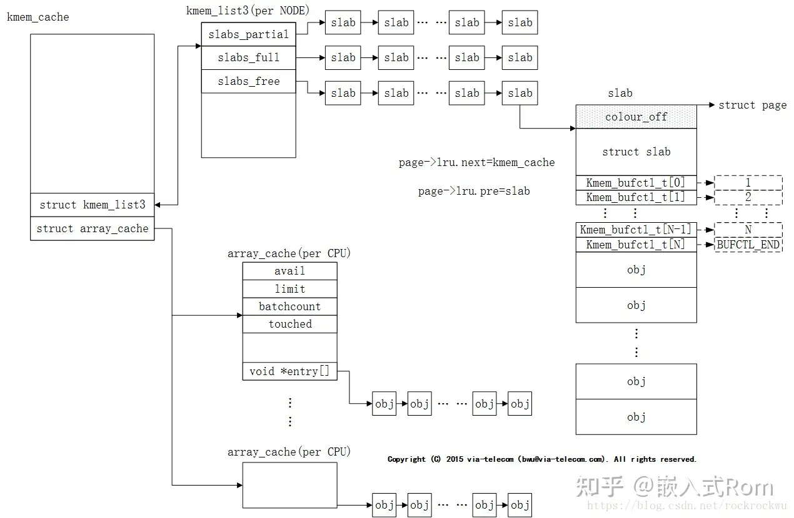
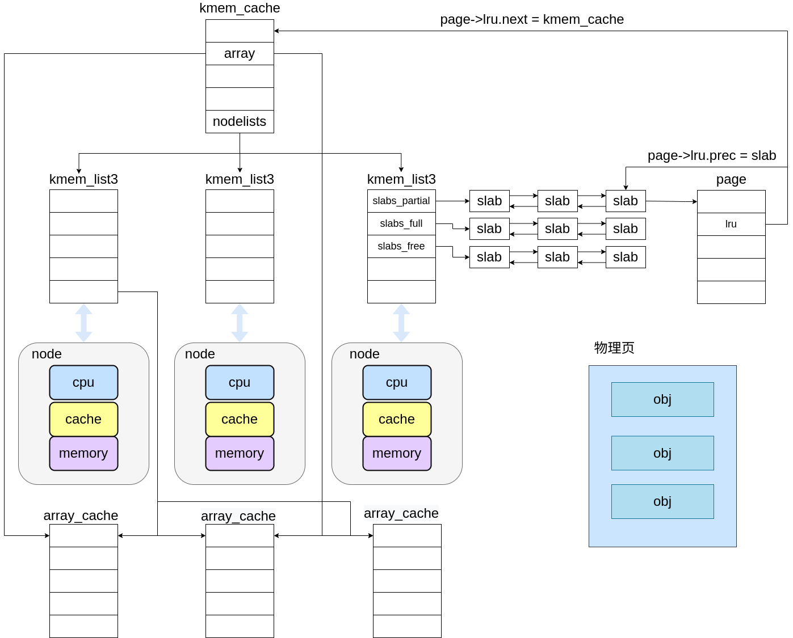
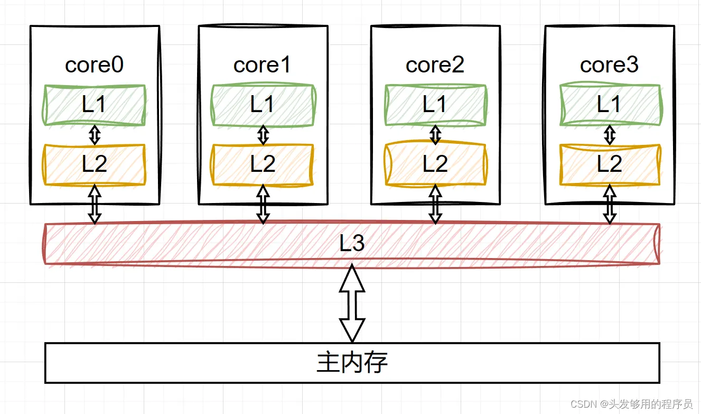
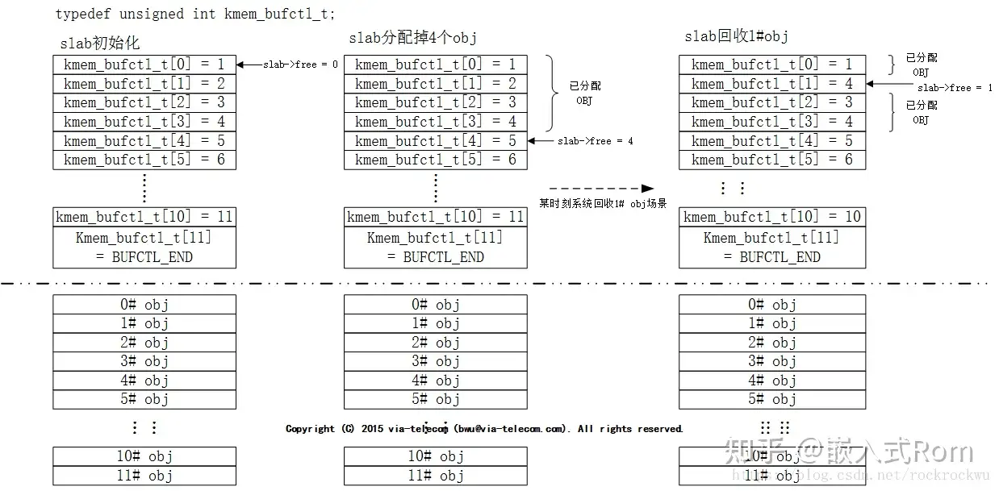

# slab 分配器

slab分配器有以下三个基本目标：

- 减少伙伴算法在分配小块连续内存时所产生的内部碎片
- 将频繁使用的对象缓存起来，减少分配、初始化和释放对象的时间开销
- 通过着色技术调整对象以更好的使用硬件高速缓存

## slab 分配器中用到的结构体




### 核心数据结构kmem_cache

slba分配器中的kmem_cache

```c
struct kmem_cache {
    /* 1) 每个CPU的缓存数据，在每次分配或释放时都会被访问 */
    struct array_cache *array[NR_CPUS]; 
    // 每个CPU对应的数组缓存，用于高速分配和释放对象。

    /* 2) Cache的可调参数，受 cache_chain_mutex 保护 */
    unsigned int batchcount;  // 每次从slab中分配/释放的对象批次大小。
    unsigned int limit;       // 每个CPU缓存中的最大对象数量。
    unsigned int shared;      // 每个CPU缓存间共享的对象数量限制。

    unsigned int buffer_size;            // 对象的大小，单位是字节。
    u32 reciprocal_buffer_size;          // 优化除法计算的值，跟 buffer_size 相关。

    /* 3) 在分配和释放时由后端频繁访问 */
    unsigned int flags;       // 常量标志位，定义了该缓存的特性，如是否调试、追踪等。
    unsigned int num;         // 每个 slab 中包含的对象数量。

    /* 4) cache_grow/shrink 调整缓存大小时使用的参数 */
    unsigned int gfporder;    // 每个 slab 占用的页数，以 2 的幂次方形式存储。

    // 强制指定的 GFP 标志（用于内存分配），如 GFP_DMA，控制分配区域等。
    gfp_t gfpflags;

    size_t colour;            // cache 的着色范围，用于减少 CPU 缓存冲突。
    unsigned int colour_off;  // 着色偏移量，保证不同对象的起始位置不同。
    struct kmem_cache *slabp_cache;  // 指向管理 slab 描述符的缓存。
    unsigned int slab_size;   // slab 的总大小，包括对象和管理数据。
    unsigned int dflags;      // 动态标志位，用于控制 slab 缓存的行为。

    // 对象的构造函数指针，分配对象时会调用，用于初始化对象。
    void (*ctor)(void *obj);

    /* 5) cache 的创建/移除信息 */
    const char *name;         // 缓存的名称，用于调试和识别。
    struct list_head next;    // 链表节点，用于将缓存链接到全局缓存链表中。

    /*
     * nodelists[] 位于 kmem_cache 结构的末尾，因为我们希望根据 nr_node_ids
     * 来动态调整这个数组的大小，而不是使用 MAX_NUMNODES（详见 kmem_cache_init()）。
     * 仍然使用 [MAX_NUMNODES] 是因为 cache_cache 是静态定义的，因此我们为最大数量的节点保留空间。
     */
    struct kmem_list3 *nodelists[MAX_NUMNODES]; // 每个节点的列表，管理缓存 slab 的分配和释放。

};
```

内核中的 `kmem_cache` 结构都被记录在 cache_chain 链表中。

```c
static struct list_head cache_chain;//用来维护所有 kmem_cache 实例（缓存池）的链表
```

在一个 `kmem_cache` 结构中，有两个较为重要的成员，分别为cpu的缓存信息 `array` 与 slab 节点 `nodelists`

### kmem_list3不同node下的slab块

struct kmem_list3 *nodelists[MAX_NUMNODES]：

在每一个slab分配器中的页可能来自不同的 node 节点，slab 缓存会为不同的节点维护一个自己的 slab 链表， `kmem_cache` 结构中的成员 `nodelist` 记录了该 kmem_cache 下的所有 slab 链表。

```c
//有时也叫 kmem_cache_node
struct kmem_list3 {
	struct list_head slabs_partial;	/* partial list first, better asm code */
	struct list_head slabs_full;
	struct list_head slabs_free;
	unsigned long free_objects;//当前缓存中可供分配的空闲对象的总数，用于快速判断是否有可分配的对象
	unsigned int free_limit;//控制空闲对象的最大数量。用于限制在此列表中缓存的空闲对象的数量，以便控制内存使用
	unsigned int colour_next;	/* 每个节点的缓存着色信息 */
	spinlock_t list_lock;
	struct array_cache *shared;	/* 共享缓存，在多个 CPU 之间共享的 slab 缓存。这允许多个处理器快速访问共享的 slab 对象 */
	struct array_cache **alien;	/*用于其他 NUMA 节点的 slab 缓存。此字段允许跨 NUMA 节点访问 slab，减少分配器对远程节点的访问延迟 */
	unsigned long next_reap;	/* updated without locking */
	int free_touched;		/* 用于标记最近是否有空闲 slab 被使用过 */
};
```

kmem_list3 中有三个链表slabs_partial、slabs_full、slabs_free

* slabs_full ：已经完全分配的 slab
* slabs_partial： 部分分配的slab
* slabs_free：空slab，或者没有对象被分配

该结构体用于管理每个 NUMA 节点的 slab 列表。在 kmem_cache_init 中被初始化。

```c
	// 初始化初始的 slab 列表
	for (i = 0; i < NUM_INIT_LISTS; i++) {
		kmem_list3_init(&initkmem_list3[i]);
		if (i < MAX_NUMNODES)
			cache_cache.nodelists[i] = NULL;
	}
	set_up_list3s(&cache_cache, CACHE_CACHE);
```

所有 NUMA 点对应的 kmem_list3 被记录在全局变量 initkmem_list3 中。

### 记录cpu缓存信息的结构array_cache

对于存储设备而言，在计算机中除了内存，还存在一个三级缓存结构。缓存是一种比内存更高速却更昂贵的存储资源。其中访问缓存的速度 L1 > L2 > L3 。



为了提升效率，SLAB 分配器为每一个CPU都提供了每CPU数据结构 struct array_cache，该结构指向被释放的对象，该结构作为成员被记录在 kmem_cache 与 kmem_list3 中。

SLAB 分配器这样设计便是利用了缓存这点，array_cache 中维护的都是不久前刚被访问过的内存对象，他们留存在三级缓存的可能性就要更大，将这些地址分配出去，可以尽量让 cpu 多访问缓存而不是内存，

当CPU需要使用申请某一个对象的内存空间时，会先检查 array_cache 中是否有空闲的对象，如果有的话就直接使用。如果没有空闲对象，就像SLAB分配器进行申请。

```c
struct array_cache {
    //当前CPU上该slab可用对象数量
	unsigned int avail;
    //最大对象数目，和kmem_cache中一样
	unsigned int limit;
    /*同kmem_cache，batchcount指定了在per-CPU列表为空的情况下，从缓存的slab中获取对象的数目。它还表示在
     *缓存增长时,若entry数组中obj数量超过limit限制后，需要迁移entry中obj的数量（到本地节点cpu共享空闲链
     *表中）。
     */
	unsigned int batchcount;
	/*在从缓存移除一个对象时，将touched设置为1，而缓存收缩时, 则将touched设置为0。这使得内核能够确认在缓
	 * 存上一次收缩之后是否被访问过，也是缓存重要性的一个标志。
	 */
    unsigned int touched;
    /*最后一个成员entry是一个伪数组, 其中并没有数组项, 只是为了便于访问内存中array_cache实例之后缓存中的
     *各个对象而已
     */
	void *entry[];
};
```

- array_cache中的entry空数组，就是用于保存本地cpu刚释放的obj，所以该数组初始化时为空，只有本地 cpu 释放 slab cache的obj后才会将此obj装入到entry数组。array_cache 的 entry 成员数组中保存的 obj 数量是由成员limit控制的，超过该限制后会将entry数组中的 batchcount 个 obj 迁移到对应节点 cpu 共享的空闲对象链表中。

- entry数组的访问机制是LIFO（last in fist out），此种设计非常巧妙，能保证本地cpu最近释放该slab cache的obj立马被下一个slab内存申请者获取到(有很大概率此obj仍然在本地cpu的硬件高速缓存中)。

### slab描述符struct page

page中与slab分配器相关的地方：

为了提高linux内存利用率，slab描述符结合在页描述符struct page中,当页描述符成员flage标志设置了PG_SLAB后，struct page中的部分成员可以用来描述slab对象。

一个页，要么位于空闲链表中，要么用于作为映射页，要么在slab分配器中。

当 page 属于 slab 时，page->lru.next 指向 page 驻留的的缓存的管理结构，page->lru.prec 指向保存该page 的 slab 的管理结构。即 `page->lru.next = kmem_cache` `page->lru.prec = slab`

```c
//为了节省内存，struct page中许多结构体会通过union联合体进行封装，此处做了省略
struct page {
    //当页描述符成员flage标志设置了PG_SLAB后,struct page中对应的slab成员才有效
	unsigned long flags;
    //freelist实际上是一个数组，数组中存放slab中未使用的obj的index值
	void *freelist;		/* sl[aou]b first free object */
		/* page_deferred_list().prev	-- second tail page */
	//当前slab已经使用的obj数量
	unsigned int active;		/* SLAB */
    
    /* 通过该成员将链到slab cache对应节点kmem_cache_node所管理的3个链表上*/
	struct list_head lru;
    //指向slab的slab cache描述符kmem_cache
	struct kmem_cache *slab_cache;	/* SL[AU]B: Pointer to slab */
    
    //slab首地址，待验证
    void *virtual;
}
```

### slab结构

freelist指向的是 slab 空闲 obj 的索引数组，该数组要和 active 成员搭配使用。freelist 指向的区域是一个连续地址的数组，它保存的地方有两种情况：一种情况是放在 slab 自身所在的内存区域，另外一种情况是保存在 slab 所在内存区域的外部(若保存在slab外部，则保存在slab对应slab cache的kmem_cache结构体中 freelist_cache 成员指针指向的链表)。在 2.6 版本中 page 结构中并无 `void *s_mem` 成员。该成员在 slab 结构中。

对于每一个页，都有一个slab结构对页面进行管理。slab 有两种形式的结构，管理数据外挂式或内嵌式。如果 obj 比较小，那么struct slab 和 kmem_bufctl_t 可以和obj分配在同一个物理 page 中，可称为内嵌式；如果 obj 比较大，那么管理性数据需要单独分配一块内存来存放，称之为外挂式。我们在上图中所画的 slab 结构为内嵌式。

```c
struct slab {
	struct list_head list;		// 满、部分满或空链表
	unsigned long colouroff;	// slab着色的偏移量，指向一个页
	// 在slab中的第一个对象
	void *s_mem;		/* including colour offset */		/* 包括颜色偏移的内存指针，指向 slab 的第一个对象 */
	// slab中已分配的对象数
	unsigned int inuse;	/* num of objs active in slab */
	// 第一个空闲对象（如果有的话）
	kmem_bufctl_t free;
	unsigned short nodeid;	/* 所属 NUMA 节点的 ID */
};
```

slab 主要包含两大部分，管理性数据和obj对象，其中管理性数据包括struct slab 和 kmem_bufctl_t。

### kmem_bufctl_t

kmem_bufctl_t unsigned int，本质上是一个 obj 数组，该数组采用链式索引的形式将空闲对象记录在 slab 结构的 free 成员中。



## 普通高速缓存和专用高速缓存

高速缓存被分为普通和专用两种，普通高速缓存只由 slab 分配器用于自己的目的，而专用高速缓存由内核的其余部分使用。这两种类型的 slab 分配器均在 kmem_cache_init 中被初始化。

`cache_cache` 结构用于 slab 分配器自身的内存分配。

```c
/* internal cache of cache description objs */
static struct kmem_cache cache_cache = {
	.batchcount = 1,
	.limit = BOOT_CPUCACHE_ENTRIES,
	.shared = 1,
	.buffer_size = sizeof(struct kmem_cache),
	.name = "kmem_cache",
};
```

初始化 `cache_cache`：

```c
// 初始化初始的 slab 列表
	set_up_list3s(&cache_cache, CACHE_CACHE);

	// 如果总的内存超过32MB，设置slab分配器使用的页数更大，以减少碎片化
	if (totalram_pages > (32 << 20) >> PAGE_SHIFT)
		slab_break_gfp_order = BREAK_GFP_ORDER_HI;

	// 第一步: 创建缓存，用于管理 kmem_cache 结构
	node = numa_node_id();  // 获取当前 NUMA 节点的 ID

	// 初始化 cache_cache，管理所有缓存描述符
	INIT_LIST_HEAD(&cache_chain);  // 初始化 cache_chain 列表
	list_add(&cache_cache.next, &cache_chain);  // 将 cache_cache 加入链表
	cache_cache.colour_off = cache_line_size();  // 设置 cache 的颜色偏移量
	cache_cache.array[smp_processor_id()] = &initarray_cache.cache;  // 设置 per-CPU 缓存
	cache_cache.nodelists[node] = &initkmem_list3[CACHE_CACHE + node];  // 设置节点列表

	// 设置 cache_cache 的大小，确保它对齐缓存行
	cache_cache.buffer_size = offsetof(struct kmem_cache, nodelists) +
				 nr_node_ids * sizeof(struct kmem_list3 *);
	cache_cache.buffer_size = ALIGN(cache_cache.buffer_size,
					cache_line_size());
	cache_cache.reciprocal_buffer_size =
		reciprocal_value(cache_cache.buffer_size);

	// 估算缓存大小，确保有足够的空间来存放对象
	for (order = 0; order < MAX_ORDER; order++) {
		cache_estimate(order, cache_cache.buffer_size,
			cache_line_size(), 0, &left_over, &cache_cache.num);
		if (cache_cache.num)
			break;
	}
	BUG_ON(!cache_cache.num);  // 如果计算失败，触发 BUG
	cache_cache.gfporder = order;  // 设置缓存使用的页面顺序
	cache_cache.colour = left_over / cache_cache.colour_off;  // 设置缓存颜色
	cache_cache.slab_size = ALIGN(cache_cache.num * sizeof(kmem_bufctl_t) +
				      sizeof(struct slab), cache_line_size());  // 设置 slab 大小
```

内存范围一般包括 13 个几何分布的内存区，大小分别为 32、64、128、256、512、1024、2048、4096、8192、16384、32768、65536 和 131072 字节。 malloc_size 数组的元素指向 26 个高速缓存描述符，因为每个内存区都包含两个高速缓存，一个用于 ISA DMA 分配，另一个用于常规分配。

```c
struct cache_sizes malloc_sizes[] = {
#define CACHE(x) { .cs_size = (x) },
#include <linux/kmalloc_sizes.h>
	CACHE(ULONG_MAX)
#undef CACHE
};
EXPORT_SYMBOL(malloc_sizes);
```

初始化 `malloc_sizes` ：

```c
sizes[INDEX_AC].cs_cachep = kmem_cache_create(names[INDEX_AC].name,
					sizes[INDEX_AC].cs_size,
					ARCH_KMALLOC_MINALIGN,
					ARCH_KMALLOC_FLAGS|SLAB_PANIC,
					NULL);
```

## 创建一个缓存

创建缓存的入口为 `kmem_cache_create`

```c
struct kmem_cache *kmem_cache_create (const char *name, size_t size, size_t align,unsigned long flags, void (*ctor)(void *)) 
```

* 第一个参数是字符串，存放高速缓存的名字
* 第二个参数是高速缓存中每个元素的大小，
* 第三个参数是slab内第一个对象的偏移，用来确保在页内进行特定的对齐。通常0就可以满足，也就是标准对齐。
* flags参数是可选的设置项，用来控制高速缓存的行为。可以为0,表示没有特殊行为，或者与以下标志进行或运算，在slab.h中存在定义。
* 最后一个参数是函数指针，用来定义该缓存被分配时的初始化方式，类似于cpp中的构造函数。

**1.检查参数正确性**

在创建一个缓存时，首先会遍历 `cache_chain` 链表，查看是否有同名的缓存。在没有同名缓存的情况下再对各种对齐参数进行计算。

**2.为 kmem_cache 分配缓存**

然后为缓存管理结构 kmem_cache 从 cache_cache 中分配一块内存。

**3.计算slab对应的页框阶数**

分配好 kmem_cache 后会使用 `calculate_slab_order` 寻找适合的 slab 页阶数

```c
static size_t calculate_slab_order(struct kmem_cache *cachep,
			size_t size, size_t align, unsigned long flags)
{
	unsigned long offslab_limit;  // 用于确定 off-slab 缓存的限制
	size_t left_over = 0;         // 剩余的碎片大小
	int gfporder;                 // 用于 slab 分配的页数的阶数

	// 循环遍历不同阶数的页分配，直到找到合适的 slab 配置
	for (gfporder = 0; gfporder <= KMALLOC_MAX_ORDER; gfporder++) {
		unsigned int num;   // 当前阶数下可分配的对象数量
		size_t remainder;   // 当前阶数下的剩余碎片空间

		// 估算当前阶数下 slab 中的对象数和剩余碎片
		cache_estimate(gfporder, size, align, flags, &remainder, &num);
		
		// 如果没有可分配的对象，继续尝试下一个阶数
		if (!num)
			continue;

		// 如果使用 off-slab 缓存方式，计算最大允许的对象数
		if (flags & CFLGS_OFF_SLAB) {
			/*
			 * 使用 off-slab slab 的缓存对象数上限。
			 * 避免在 cache_grow() 中出现无限循环的情况。
			 */
			offslab_limit = size - sizeof(struct slab);
			offslab_limit /= sizeof(kmem_bufctl_t);

			// 如果对象数超出 off-slab 限制，跳出循环
			if (num > offslab_limit)
				break;
		}

		// 找到符合要求的配置，记录可分配对象数和阶数
		cachep->num = num;
		cachep->gfporder = gfporder;
		left_over = remainder;  // 记录当前阶数下的剩余碎片

		/*
		 * 对于 VFS 可回收的 slab，大多数分配是使用 GFP_NOFS，
		 * 我们不希望在无法缩小 dcache 时分配更高阶的页。
		 */
		if (flags & SLAB_RECLAIM_ACCOUNT)
			break;

		/*
		 * 虽然对象数越多越好，但非常大的 slab 对 gfp() 调用
		 * 会带来不利影响，因此我们限制 gfporder。
		 */
		if (gfporder >= slab_break_gfp_order)
			break;

		/*
		 * 判断内部碎片是否可以接受。如果剩余碎片占的比例较小，
		 * 则认为该配置是合适的，终止循环。
		 */
		if (left_over * 8 <= (PAGE_SIZE << gfporder))
			break;
	}
	
	// 返回最后的剩余碎片大小
	return left_over;
}
```

在函数 cache_estimate 中会计算不同阶数的页能否容纳一个slab块。在计算中，由于slab对象分为内嵌行和外挂型两种。因此 cache_estimate 对于页中可取的块树的计算方式有两种。

```c
static void cache_estimate(unsigned long gfporder, size_t buffer_size,
			   size_t align, int flags, size_t *left_over,
			   unsigned int *num)
{
	int nr_objs;                 // 该 slab 可以容纳的对象数
	size_t mgmt_size;            // slab 管理结构所需的大小
	size_t slab_size = PAGE_SIZE << gfporder;  // slab 的总大小，基于 gfporder 确定

	/*
	 * slab 管理结构可以位于 slab 内部或外部。如果位于 slab 内部，
	 * 则分配的内存用于以下用途：
	 *
	 * - struct slab：用于 slab 管理
	 * - 每个对象一个 kmem_bufctl_t
	 * - 根据 @align 对齐填充
	 * - @buffer_size 为每个对象的大小
	 *
	 * 如果 slab 管理结构位于 slab 之外（off-slab），
	 * 则对齐会在计算对象大小时处理好。由于 slab 总是页对齐的，
	 * 所以对象在分配时也会被正确对齐。
	 */
	if (flags & CFLGS_OFF_SLAB) {
		// 当 slab 管理结构位于 slab 之外时，不计算管理结构大小
		mgmt_size = 0;
		nr_objs = slab_size / buffer_size;  // 计算该 slab 可以容纳的对象数

		// 限制对象数不要超过 SLAB_LIMIT
		if (nr_objs > SLAB_LIMIT)
			nr_objs = SLAB_LIMIT;
	} else {
		/*
		 * 首次估算时忽略对齐填充。对齐填充至多占用 @align-1 字节，
		 * 而 @buffer_size 至少为 @align。在最坏情况下，该估算值
		 * 会比实际可以容纳的对象数多一个。
		 */
		nr_objs = (slab_size - sizeof(struct slab)) /
			  (buffer_size + sizeof(kmem_bufctl_t));

		/*
		 * 如果计算的对象数大于实际可以容纳的对象数，减少 1 个对象。
		 */
		if (slab_mgmt_size(nr_objs, align) + nr_objs*buffer_size
		       > slab_size)
			nr_objs--;

		// 限制对象数不要超过 SLAB_LIMIT
		if (nr_objs > SLAB_LIMIT)
			nr_objs = SLAB_LIMIT;

		// 计算 slab 管理结构所需的大小
		mgmt_size = slab_mgmt_size(nr_objs, align);
	}

	// 设置输出参数
	*num = nr_objs;  // slab 中可容纳的对象数量
	*left_over = slab_size - nr_objs * buffer_size - mgmt_size;  // 剩余的碎片空间大小
}
```

**4.初始化 kmem_cache 及其缓存**

对于 kmem_cache 结构的初始化

```c
static int __init_refok setup_cpu_cache(struct kmem_cache *cachep, gfp_t gfp)
{
	// 如果 CPU 缓存系统已经完全启用，直接启用指定缓存的 CPU 缓存功能
	if (g_cpucache_up == FULL)
		return enable_cpucache(cachep, gfp);

	// 如果 CPU 缓存系统尚未启用，进行初始化
	if (g_cpucache_up == NONE) {
		/*
		 * 注意：第一个 kmem_cache_create 必须创建 kmalloc(24) 使用的缓存，
		 * 否则创建其他缓存时会触发 BUG。
		 */
		cachep->array[smp_processor_id()] = &initarray_generic.cache;

		/*
		 * 如果第一个被创建的缓存用于 kmalloc(sizeof(kmem_list3))，
		 * 则需要初始化它的所有 kmem_list3 结构，否则会触发 BUG。
		 */
		set_up_list3s(cachep, SIZE_AC);  // 设置大小为 SIZE_AC 的 kmem_list3

		// 根据缓存设置不同的状态
		if (INDEX_AC == INDEX_L3)
			g_cpucache_up = PARTIAL_L3;
		else
			g_cpucache_up = PARTIAL_AC;
	} else {
		// 如果不是首次创建，则为当前处理器分配 array 缓存
		cachep->array[smp_processor_id()] =
			kmalloc(sizeof(struct arraycache_init), gfp);

		// 如果缓存状态为 PARTIAL_AC，继续设置 list3s，并更新状态
		if (g_cpucache_up == PARTIAL_AC) {
			set_up_list3s(cachep, SIZE_L3);  // 设置大小为 SIZE_L3 的 kmem_list3
			g_cpucache_up = PARTIAL_L3;
		} else {
			// 如果 CPU 缓存系统处于部分启用状态，为每个在线的 NUMA 节点分配 kmem_list3
			int node;
			for_each_online_node(node) {
				// 为每个 NUMA 节点分配 kmem_list3 结构，并进行初始化
				cachep->nodelists[node] =
				    kmalloc_node(sizeof(struct kmem_list3),
						gfp, node);
				BUG_ON(!cachep->nodelists[node]);  // 如果分配失败，则触发 BUG
				kmem_list3_init(cachep->nodelists[node]);  // 初始化 kmem_list3 结构
			}
		}
	}

	// 设置当前 NUMA 节点上 kmem_list3 结构的再收割时间
	cachep->nodelists[numa_node_id()]->next_reap =
			jiffies + REAPTIMEOUT_LIST3 +
			((unsigned long)cachep) % REAPTIMEOUT_LIST3;

	// 初始化 CPU 缓存的可用对象、限制和批处理计数等参数
	cpu_cache_get(cachep)->avail = 0;  // 设置 CPU 缓存的可用对象为 0
	cpu_cache_get(cachep)->limit = BOOT_CPUCACHE_ENTRIES;  // 设置可分配的最大条目数
	cpu_cache_get(cachep)->batchcount = 1;  // 设置批处理的数量
	cpu_cache_get(cachep)->touched = 0;  // 初始化 touched 标记
	cachep->batchcount = 1;  // 设置缓存批处理数量
	cachep->limit = BOOT_CPUCACHE_ENTRIES;  // 设置缓存的最大条目数
	return 0;
}
```

在一个 kmem_cache 结构被初始化时，存在四个层级：

```c
static enum {
	NONE,///尚未初始化，CPU 缓存系统没有启用。
	PARTIAL_AC,//处理器的 array 缓存已初始化，但更高级的缓存（如 kmem_list3）尚未设置。
	PARTIAL_L3,//部分初始化，kmem_list3 缓存已分配并初始化。
	EARLY,//早期初始化阶段，通常用于指代部分 CPU 缓存或数据结构已经准备好，但尚未完全启用。
	FULL//已经完全启用
} g_cpucache_up;
```

在slab分配器被初始化时，会先创建 26 个普通高速缓存描述符。

初次创建 kmem_cache 时，g_cpucache_up还为 NONE 需要经历下面的初始化函数。因为此时内核预留的普通缓存数组即 malloc_sizes 数组还尚未被完全初始化。

对于前四个阶段的初始化中的 kmem_list3 与 arraycache_init 结构均来自于全局变量 `initkmem_list3` 与 `initarray_generic` 这样的设计解决了在slab分配器分配用于自身内存时先有鸡还是先有蛋的问题。

```c
struct kmem_list3 __initdata initkmem_list3[NUM_INIT_LISTS];
static struct arraycache_init initarray_generic =
    { {0, BOOT_CPUCACHE_ENTRIES, 1, 0} };
```

其中 `initkmem_list3` 在函数 kmem_cache_init 中被初始化。

```c
for (i = 0; i < NUM_INIT_LISTS; i++) {
		kmem_list3_init(&initkmem_list3[i]);
		if (i < MAX_NUMNODES)
			cache_cache.nodelists[i] = NULL;
	}
```

当内核中预留的 cache_cache 与 malloc_size 数组初始化完成后，在 kmem_cache_init_late 函数中，该枚举类型被设置为 FULL 。在此之后创建的 kmem_cache 都只需 通过 enable_cpucache 初始化即可，不需要经理前面的过程。

```c
enable_cpucache do_tune_cpucache alloc_kmemlist
```

在函数中 `do_tune_cpucache` 会遍历所有在线的cpu,并使用 alloc_arraycache 函数为ccupdate_struct结构的new成员分配一个 array_cache 结构。并使用 do_ccupdate_local 函数对 cpu 本地的缓存进行更新 即对 kmem_cache 的arry成员进行初始化

```c
static int do_tune_cpucache(struct kmem_cache *cachep, int limit,
				int batchcount, int shared, gfp_t gfp)
{
	struct ccupdate_struct *new;
	int i;

	/* 分配一个 ccupdate_struct 结构，用于更新 CPU 缓存 */
	new = kzalloc(sizeof(*new), gfp);
	if (!new)
		return -ENOMEM;

	/* 遍历所有在线的 CPU */
	for_each_online_cpu(i) {
		/* 为每个 CPU 分配一个 array_cache 结构 */
		new->new[i] = alloc_arraycache(cpu_to_node(i), limit,
						batchcount, gfp);
		if (!new->new[i]) {
			/* 如果分配失败，回收已分配的资源并返回内存不足错误 */
			for (i--; i >= 0; i--)
				kfree(new->new[i]);
			kfree(new);
			return -ENOMEM;
		}
	}
	/* 将 cachep 赋值给 ccupdate_struct 结构的 cachep 字段 */
	new->cachep = cachep;

	/* 在每个 CPU 上执行 do_ccupdate_local 函数，更新本地的缓存 */
	on_each_cpu(do_ccupdate_local, (void *)new, 1);

	/* 确认中断处于开启状态 */
	check_irq_on();
	/* 设置 cachep 的 batchcount、limit 和 shared 值 */
	cachep->batchcount = batchcount;
	cachep->limit = limit;
	cachep->shared = shared;

	/* 释放旧的 array_cache 结构中的缓存块 */
	for_each_online_cpu(i) {
		struct array_cache *ccold = new->new[i];
		if (!ccold)
			continue;
		/* 加锁，确保并发访问的安全性 */
		spin_lock_irq(&cachep->nodelists[cpu_to_node(i)]->list_lock);
		/* 释放旧缓存中的空闲块 */
		free_block(cachep, ccold->entry, ccold->avail, cpu_to_node(i));
		spin_unlock_irq(&cachep->nodelists[cpu_to_node(i)]->list_lock);
		/* 释放旧的 array_cache 结构 */
		kfree(ccold);
	}
	/* 释放临时的 ccupdate_struct 结构 */
	kfree(new);
	/* 分配新的 kmem_list3 结构 */
	return alloc_kmemlist(cachep, gfp);
}
```

同时 do_tune_cpucache 在结尾处调用 alloc_kmemlist 中对 kmem_list3 进行初始化。

```c
static int alloc_kmemlist(struct kmem_cache *cachep, gfp_t gfp)
{
	int node;
	struct kmem_list3 *l3;
	struct array_cache *new_shared;
	struct array_cache **new_alien = NULL;

	/* 遍历所有在线节点 */
	for_each_online_node(node) {

		/* 如果使用外来缓存 (alien cache)，为外来缓存分配内存 */
		if (use_alien_caches) {
			new_alien = alloc_alien_cache(node, cachep->limit, gfp);
			if (!new_alien)
				goto fail;  /* 分配失败则跳转到错误处理 */
		}

		/* 如果 cachep 允许共享缓存，则为共享缓存分配内存 */
		new_shared = NULL;
		if (cachep->shared) {
			new_shared = alloc_arraycache(node,
				cachep->shared * cachep->batchcount, 
				0xbaadf00d, gfp);  /* 分配共享缓存 */
			if (!new_shared) {
				/* 如果共享缓存分配失败，释放外来缓存并跳转到错误处理 */
				free_alien_cache(new_alien);
				goto fail;
			}
		}

		/* 获取当前节点的 kmem_list3 结构 */
		l3 = cachep->nodelists[node];
		if (l3) {
			struct array_cache *shared = l3->shared;

			/* 加锁以确保对 list 的安全访问 */
			spin_lock_irq(&l3->list_lock);

			/* 如果旧的共享缓存存在，则释放其内容 */
			if (shared)
				free_block(cachep, shared->entry,
						shared->avail, node);

			/* 更新新的共享缓存和外来缓存 */
			l3->shared = new_shared;
			if (!l3->alien) {
				l3->alien = new_alien;
				new_alien = NULL;
			}

			/* 根据节点上的 CPU 数量设置空闲对象的限制 */
			l3->free_limit = (1 + nr_cpus_node(node)) *
					cachep->batchcount + cachep->num;
			spin_unlock_irq(&l3->list_lock);

			/* 释放旧的共享缓存 */
			kfree(shared);
			/* 释放未使用的外来缓存 */
			free_alien_cache(new_alien);
			continue;
		}

		/* 如果当前节点没有 kmem_list3 结构，则为其分配新的结构 */
		l3 = kmalloc_node(sizeof(struct kmem_list3), gfp, node);
		if (!l3) {
			/* 分配失败则释放共享缓存和外来缓存，跳转到错误处理 */
			free_alien_cache(new_alien);
			kfree(new_shared);
			goto fail;
		}

		/* 初始化 kmem_list3 结构 */
		kmem_list3_init(l3);

		/* 设置回收时间以避免同步冲突 */
		l3->next_reap = jiffies + REAPTIMEOUT_LIST3 +
				((unsigned long)cachep) % REAPTIMEOUT_LIST3;

		/* 赋值新的共享缓存和外来缓存 */
		l3->shared = new_shared;
		l3->alien = new_alien;

		/* 根据节点上的 CPU 数量设置空闲对象的限制 */
		l3->free_limit = (1 + nr_cpus_node(node)) *
					cachep->batchcount + cachep->num;

		/* 将 kmem_list3 结构保存到 cachep 的节点列表中 */
		cachep->nodelists[node] = l3;
	}
	return 0;

fail:
	/* 如果缓存尚未激活，则回滚已分配的内容 */
	if (!cachep->next.next) {
		node--;
		while (node >= 0) {
			if (cachep->nodelists[node]) {
				l3 = cachep->nodelists[node];

				/* 释放共享缓存和外来缓存，并释放 kmem_list3 结构 */
				kfree(l3->shared);
				free_alien_cache(l3->alien);
				kfree(l3);
				cachep->nodelists[node] = NULL;
			}
			node--;
		}
	}
	return -ENOMEM;  /* 返回内存不足错误 */
}
```

对于 kmem_list3 与 均来自于在初始化时创建的malloc_sizes，即普通高速缓存。

## 分配一个缓存


内核对于 slab 的分配提供了两条路径，对于 kamlloc 这条路径，分配内存会从已有的 malloc_size 数组中挑选大小合适的 kmem_cache 结构，从中分取内存。而对于 kmem_cache_alloc 这条路径，则是从分配对象专门注册的 kmem_cache 结构中进行分配。二者最后都会调用 __cache_alloc 函数。

在函数 ____cache_alloc 中，会首先从当前cpu的缓存数组中获取缓存，如果没有获取到可用的缓存则继续调用 cache_alloc_refill 重新填充缓存并分配一个对象

```c
static inline void *____cache_alloc(struct kmem_cache *cachep, gfp_t flags)
{
    void *objp;  // 用于存储分配得到的对象指针
    struct array_cache *ac;  // 指向 CPU 上的 per-CPU 缓存

    // 检查中断是否被禁用，确保分配过程是原子的
    check_irq_off();
    ac = cpu_cache_get(cachep);
    if (likely(ac->avail)) {
        // 增加分配命中计数，表示在缓存中找到了可用对象
        STATS_INC_ALLOCHIT(cachep);        
        ac->touched = 1;
        objp = ac->entry[--ac->avail];
    } else {
        STATS_INC_ALLOCMISS(cachep);
        objp = cache_alloc_refill(cachep, flags);
        ac = cpu_cache_get(cachep);
    }
    if (objp)
        kmemleak_erase(&ac->entry[ac->avail]);
    
    // 返回分配得到的对象指针，如果分配失败则返回 NULL
    return objp;
}
```

在函数 cache_alloc_refill 中先尝试从共享缓存 L3 中获取可分配的对象，如果依然没有可分配的对象则向slab申请一个obj块。如果 slab 分配器中已经没有内存可用。那么则会通过函数 cache_grow 同时调用函数 kmem_getpages 向伙伴系统请求页面，并创建页面的 slab 结构。
