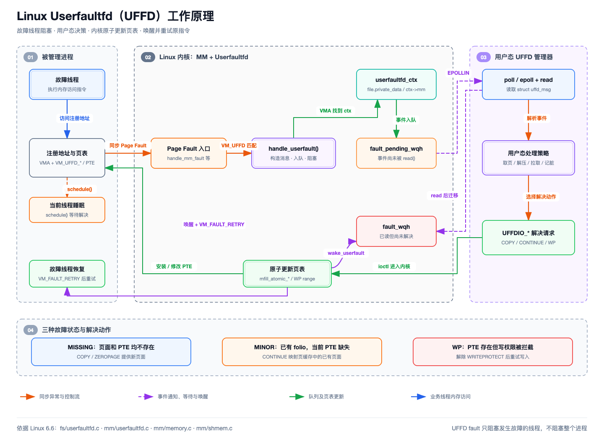
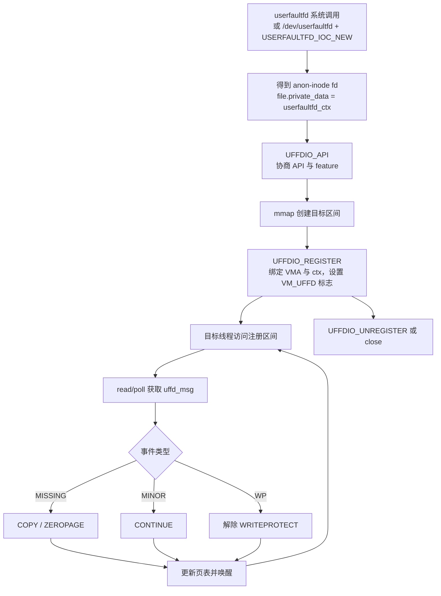
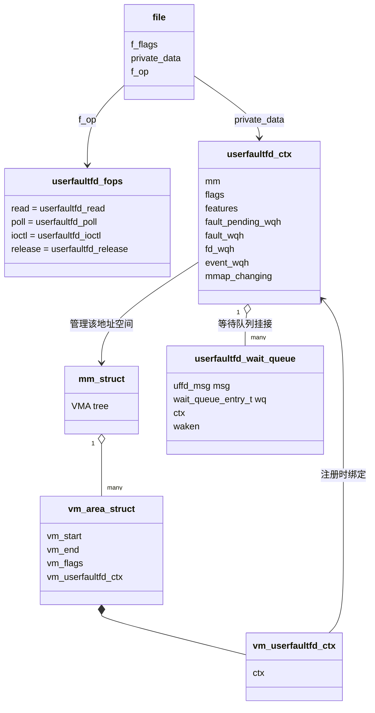
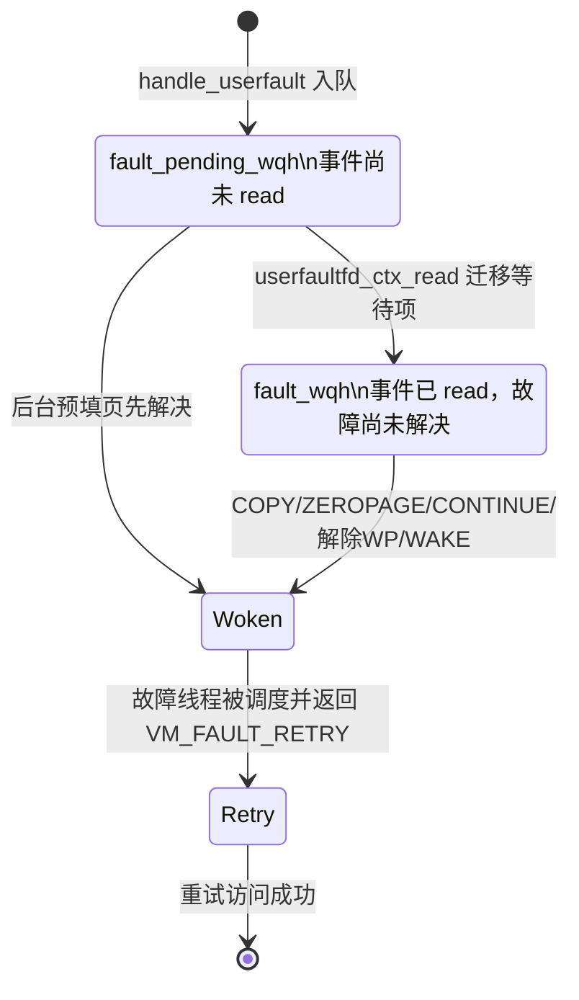
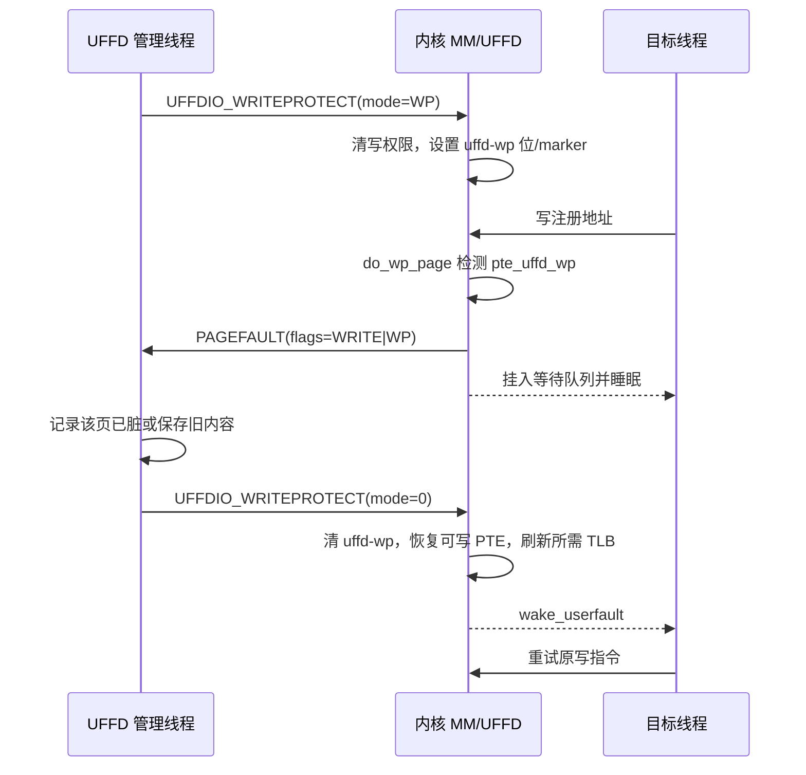

# Linux Userfaultfd（UFFD）工作机制、内核实现与用户态接口

## 什么是 UFFD

Userfaultfd 是 Linux 内核提供的一套“把部分内存缺页处理交给用户态”的机制。进程创建一个 userfaultfd 文件描述符，并把一段虚拟地址注册给它以后，这段地址上的特定页故障不再完全由内核自动完成，而是由内核把故障信息封装成 `struct uffd_msg`，通过该 fd 通知用户态管理线程。管理线程准备好页面内容、页表映射或写权限后，再通过 `UFFDIO_*` ioctl 解决故障并唤醒原来的故障线程。

它不是把 CPU 的异常处理代码直接放到用户态。CPU 页故障仍然先进入内核，VMA 查找、页表检查、并发控制和最终 PTE 安装也仍由内核负责。用户态获得的是“决定缺失页面内容、决定何时建立已有页面的映射、决定何时解除写保护”的能力。

UFFD 的接口由两部分组成：

1. `read()`、`poll()` 或 `epoll()`：内核向用户态发送页故障和地址空间变化事件。
2. `UFFDIO_*` ioctl：用户态注册地址、复制页面、映射零页、继续 minor fault、设置或解除写保护以及唤醒故障线程。

## 为什么需要 UFFD

通常的匿名页缺页由内核自动分配零页或物理页，文件映射缺页由内核从页缓存或存储设备取页。应用无法在页故障发生时异步决定页面内容，也难以把一个进程的页面放在另一个进程、远端节点或自定义存储中管理。

传统的 `mprotect(PROT_NONE) + SIGSEGV` 能拦截访问，但存在明显限制：信号处理模型复杂；用 VMA 权限变化跟踪大量页面需要频繁拆分、合并 VMA；页面级状态和并发控制难做；也缺少由内核原子安装页面并精确唤醒故障线程的协议。UFFD 把通知和解决动作分开，并让页粒度状态主要保存在页表中，运行期不需要为每个页面创建一个 VMA。

UFFD 可以用于以下场景：

- 虚拟机 post-copy 热迁移：目标端虚拟机先运行，访问尚未到达的页面时再从源端拉取并用 `UFFDIO_COPY` 安装。QEMU/KVM 的 post-copy 是典型使用者。
- Checkpoint/Restore 和快照懒加载：先恢复地址空间，页面在第一次访问时从快照文件加载。
- 用户态按需分页：页面内容可来自远端内存、压缩存储、对象存储或应用自己的页面库。
- 脏页跟踪：通过 UFFD write-protect 拦截某页的第一次写入，记录后解除写保护。
- 共享内存一致性控制：页缓存中已有数据时，利用 minor fault 在用户态完成校验或修改后再允许建立 PTE。
- 内存故障模拟：使用 `UFFDIO_POISON` 安装 poisoned PTE marker，使后续访问表现为硬件内存中毒。
- 非协作式内存管理：把 UFFD fd 经 Unix domain socket 传给独立管理进程，由一个管理器处理多个进程的地址空间。

UFFD 不是自动换页器。注册和事件循环建立后，管理线程必须持续运行并正确解决事件；否则访问该范围的线程可能一直睡眠。它也不会替用户态决定页面从哪里来，这正是上层迁移器或页面管理器需要实现的部分。

## UFFD 的整体工作机制

### 总体架构



一次典型故障包含两条并行关系：故障线程在内核等待队列上睡眠；管理线程从 userfaultfd 读取事件并调用 ioctl。只有 ioctl 完成页表更新并唤醒等待项后，故障线程才重新执行引起 fault 的指令。

### 三种注册模式

#### MISSING：页面或页表项不存在

`UFFDIO_REGISTER_MODE_MISSING` 拦截本来应由内核分配或取入页面的缺页。事件中没有 `UFFD_PAGEFAULT_FLAG_WP` 和 `UFFD_PAGEFAULT_FLAG_MINOR` 时，就是 missing fault；`UFFD_PAGEFAULT_FLAG_WRITE` 只补充说明原访问是否为写。

用户态必须使用以下方式之一提供页面：

- `UFFDIO_COPY`：把用户态源缓冲区内容复制到新页并原子安装 PTE。
- `UFFDIO_ZEROPAGE`：安装共享零页，或在不允许共享零页时分配清零页面。
- `UFFDIO_POISON`：不提供正常页面，而是把该地址标成 poisoned。

MISSING 适合迁移、懒恢复和自定义后端取页，因为故障时目标内容尚不存在。

例如，一个进程正在从快照文件中懒恢复 1 GiB 内存。恢复程序先用 `mmap()` 建立 1 GiB 虚拟地址范围并注册 MISSING，但不立即把快照中的所有页面读入内存。当业务线程第一次访问虚拟地址 `0x40001000` 时，该地址所属 VMA 已经存在，但对应 PTE 和目标页面都不存在，于是产生 MISSING fault。管理线程从 `uffd_msg` 得到故障地址，从快照文件读取对应的 4 KiB 数据，再通过 `UFFDIO_COPY` 让内核分配页面、复制数据并安装 PTE。业务线程被唤醒后重新访问该地址，此后对这一页的普通访问不再触发 MISSING。

```text
访问前：
虚拟地址 0x40001000
├── VMA：存在，已注册 MISSING
├── PTE：不存在
└── 页面内容：只在快照文件中，目标内存中尚不存在

处理过程：读取快照页面 → UFFDIO_COPY → 分配 folio → 安装 PTE

处理后：
虚拟地址 0x40001000 → PTE → 新物理页面（内容来自快照）
```

#### MINOR：页面已经存在，但当前映射还没有 PTE

`UFFDIO_REGISTER_MODE_MINOR` 面向 shmem 和 hugetlbfs。底层页已经存在于页缓存中，只是当前 VMA 尚未建立指向它的页表项，因此不需要把数据再次复制一遍。

用户态可以通过同一文件的别名映射查看或修改底层页面，完成后调用 `UFFDIO_CONTINUE`。内核重新从页缓存取得现有 folio，并把它安装到故障 VMA 的页表中。

MINOR 与 MISSING 的关键区别是：MISSING 要“提供页面内容”，MINOR 只要“批准把已存在页面映射进来”。

例如，一个 `memfd` 被映射为两个虚拟地址 A 和 B。程序先访问映射 A，使对应页面进入 shmem 页缓存，并为 A 建立 PTE；映射 B 注册了 MINOR，但还没有被访问，因此 B 的 PTE 不存在。第一次访问 B 时，内核根据 B 的 VMA 找到同一个 memfd，并在页缓存中发现页面已经存在，所以产生 MINOR fault。管理线程可以通过映射 A 检查或修改该页面，完成后调用 `UFFDIO_CONTINUE`。内核不再分配和复制页面，只为 B 安装一个指向已有 folio 的 PTE。

```text
同一个 memfd/shmem 对象
└── 页缓存 folio X：已经存在
    ├── 映射 A：虚拟地址 A → PTE → folio X
    └── 映射 B：虚拟地址 B → 暂无 PTE（注册 MINOR）

访问 B → MINOR fault → UFFDIO_CONTINUE

处理后：
映射 A：虚拟地址 A → PTE ─┐
                            ├→ 同一个 folio X
映射 B：虚拟地址 B → PTE ─┘
```

这里 `mmap()` 只预先创建了映射 B 的 VMA 和映射规则，并不保证立即建立每个地址的 PTE。因此“底层页面存在”和“当前映射已有 PTE”是两个不同状态。Linux 6.6 的 UFFD MINOR 主要用于 shmem 和 hugetlbfs，而不是普通匿名内存。

#### WP：页面已经映射，但写操作被 UFFD 写保护拦截

注册 `UFFDIO_REGISTER_MODE_WP` 后，用户态先调用 `UFFDIO_WRITEPROTECT` 并设置 `UFFDIO_WRITEPROTECT_MODE_WP`。内核清除写权限并设置 UFFD 专用 WP 状态。后续写访问进入 `do_wp_page()`，发现 `pte_uffd_wp` 后生成带 `UFFD_PAGEFAULT_FLAG_WP` 的事件。

管理线程完成脏页记录等处理后，再以不带 `MODE_WP` 的方式调用 `UFFDIO_WRITEPROTECT` 解除保护。内核恢复可写状态、唤醒故障线程，该写指令随后重试。

WP 与 `mprotect(PROT_READ)` 不完全相同。UFFD 使用架构页表位或 PTE marker 保存自己的写保护状态，并通过 userfaultfd 事件协议处理，而不是向故障线程直接发送 `SIGSEGV`。

例如，增量快照程序需要记录一轮快照期间哪些页面被修改。它先将目标范围注册为 WP，再调用 `UFFDIO_WRITEPROTECT(mode=WP)` 保护当前所有页面。业务线程仍可读取这些页面；当它第一次写地址 `0x50002000` 时，CPU 因 PTE 不可写产生 protection fault，内核识别出 UFFD WP 标志并通知管理线程。管理线程将这一页记入脏页集合，随后调用 `UFFDIO_WRITEPROTECT(mode=0)` 解除该页保护。业务线程被唤醒并重试原写指令，这次可以成功。若下一轮快照还要跟踪写入，管理线程需要重新设置 WP。

```text
设置 WP 后：
虚拟地址 0x50002000 → PTE → 物理页面
                         ├── 可读
                         ├── 不可写
                         └── 带 uffd-wp 状态

读访问：直接成功，不产生 UFFD 事件
写访问：WP fault → 记录脏页 → 解除 WP → 唤醒并重试写入
```

注册 `UFFDIO_REGISTER_MODE_WP` 只是声明该 VMA 可以使用 UFFD WP；它不会自动把整个范围的所有页面都保护起来。实际设置哪些页面为只读，由用户态随后调用 `UFFDIO_WRITEPROTECT` 指定，因此可以只跟踪注册范围中的一部分页面。

### 生命周期



## 内核侧详细实现

### `struct userfaultfd_ctx`：一个 UFFD fd 的核心上下文

下面是 Linux 6.6 中该结构体的主体，并补充成员意义：

```c
struct userfaultfd_ctx {
	/* 已发生但尚未被用户态 read() 取走的 page fault */
	wait_queue_head_t fault_pending_wqh;

	/* 已经被 read()，但用户态尚未通过 ioctl 解决的 page fault */
	wait_queue_head_t fault_wqh;

	/* poll/read 等待此队列；有 fault/event 时通过它通知 fd 可读 */
	wait_queue_head_t fd_wqh;

	/* fork/remap/remove/unmap 等非 page-fault 事件队列 */
	wait_queue_head_t event_wqh;

	/* 保护故障等待项从 pending 队列转移到 fault_wqh 的序列 */
	seqcount_spinlock_t refile_seq;

	/* ctx 生命周期引用计数 */
	refcount_t refcount;

	/* 创建 userfaultfd 时传入的 O_NONBLOCK/UFFD_USER_MODE_ONLY 等 */
	unsigned int flags;

	/* UFFDIO_API 请求并成功启用的 feature，最高位还标记已初始化 */
	unsigned int features;

	/* fd 是否已关闭，关闭后不再让新故障长期等待 */
	bool released;

	/* fork、mremap、unmap 等正在改变映射；解决 ioctl 此时返回 EAGAIN */
	atomic_t mmap_changing;

	/* 被该 UFFD 管理的地址空间 */
	struct mm_struct *mm;
};
```

`ctx` 表示“一条 UFFD 通知与控制通道”，不是一个页面。一个 `ctx` 可以覆盖同一 `mm` 中多个 VMA 和多个地址范围，但一个 VMA 同一时刻不能归两个不同的 UFFD ctx 管理，否则内核无法决定事件应投递到哪个 fd，注册会返回 `-EBUSY`。

### VMA 如何关联 UFFD ctx

`struct vm_area_struct` 中嵌入了：

```c
struct vm_userfaultfd_ctx {
	struct userfaultfd_ctx *ctx;
};

struct vm_area_struct {
	/* ... */
	struct vm_userfaultfd_ctx vm_userfaultfd_ctx;
};
```

注册时，`userfaultfd_register()` 把 `vma->vm_userfaultfd_ctx.ctx` 设置为当前 fd 的 `ctx`，并按模式设置以下 VMA 标志：

```c
#define VM_UFFD_MISSING  /* 拦截 missing fault */
#define VM_UFFD_WP       /* 拦截 UFFD write-protect fault */
#define VM_UFFD_MINOR    /* 拦截 minor fault */
```

因此 fault 路径不需要通过 fd 表反查：它已经拿到 `vm_fault->vma`，先检查 `vma->vm_flags`，再直接通过 `vma->vm_userfaultfd_ctx.ctx` 找到事件队列。

### `struct userfaultfd_wait_queue`：故障线程自己的等待记录

```c
struct userfaultfd_wait_queue {
	struct uffd_msg msg;          /* 将返回给用户态的 32 字节消息 */
	wait_queue_entry_t wq;       /* 挂入 ctx 的等待队列 */
	struct userfaultfd_ctx *ctx; /* 所属 UFFD 上下文 */
	bool waken;                  /* 是否已被解决 ioctl 唤醒 */
};
```

这个对象不是全局分配的，它是 `handle_userfault()` 栈上的局部变量。也就是说，每个发生 UFFD fault 的线程在自己的内核栈上保存一条等待记录，然后把其中的 `wq` 挂进 `ctx` 队列。故障线程睡眠期间内核栈仍然存在，所以用户态 `read()` 可以通过 `container_of()` 取得这条记录中的 `uffd_msg`。解决后线程被唤醒，退出 `handle_userfault()`，栈对象随之失效。

### 用户态 ABI 结构体

事件消息的核心形式如下：

```c
struct uffd_msg {
	__u8 event;
	__u8 reserved1;
	__u16 reserved2;
	__u32 reserved3;
	union {
		struct {
			__u64 flags;       /* WRITE/WP/MINOR */
			__u64 address;     /* 故障地址 */
			union { __u32 ptid; } feat;
		} pagefault;
		struct { __u32 ufd; } fork;
		struct { __u64 from, to, len; } remap;
		struct { __u64 start, end; } remove;
		struct { __u64 reserved1, reserved2, reserved3; } reserved;
	} arg;
} __packed;
```

`msg.event` 可为 `PAGEFAULT`、`FORK`、`REMAP`、`REMOVE`、`UNMAP`。对于 PAGEFAULT：

- `WRITE`：引发故障的是写访问；它可以与 MISSING 或 MINOR 同时出现。
- `WP`：故障原因是 UFFD 写保护。
- `MINOR`：底层页面存在而当前 PTE 不存在。
- WP 和 MINOR 都没有设置：故障原因是 MISSING。

### 结构体关系



这里有两条关键关联链：

```text
用户态对 UFFD fd 执行 read/ioctl
└── struct file
    └── file->private_data
        └── struct userfaultfd_ctx

内核处理目标地址的 page fault
└── struct vm_fault
    └── vmf->vma
        └── vma->vm_userfaultfd_ctx.ctx
            └── struct userfaultfd_ctx
```

第一条让 fd 操作找到 UFFD 状态，第二条让 MM fault 路径找到相同状态，两边最终在同一个 `ctx` 和等待队列会合。

### 初始化与创建

#### 内核启动初始化

```text
__initcall(userfaultfd_init)
└── userfaultfd_init()
    ├── misc_register(&userfaultfd_misc)
    │   └── 注册 /dev/userfaultfd，设备 ioctl 为 USERFAULTFD_IOC_NEW
    ├── kmem_cache_create("userfaultfd_ctx_cache", ...)
    │   └── 创建 userfaultfd_ctx slab cache
    │       └── init_once_userfaultfd_ctx()
    │           ├── 初始化 fault_pending_wqh
    │           ├── 初始化 fault_wqh
    │           ├── 初始化 event_wqh
    │           ├── 初始化 fd_wqh
    │           └── 初始化 refile_seq
    └── register_sysctl_init("vm", vm_userfaultfd_table)
        └── 暴露 /proc/sys/vm/unprivileged_userfaultfd
```

这一步只建立系统级入口、对象缓存和权限参数，并不会提前创建某个进程的 UFFD ctx。具体 ctx 在进程调用系统调用或设备 ioctl 时才分配。

#### 创建一个 UFFD fd

```text
路径一：syscall(SYS_userfaultfd, flags)
└── userfaultfd()
    ├── userfaultfd_syscall_allowed(flags)
    └── new_userfaultfd(flags)

路径二：open("/dev/userfaultfd") + ioctl(USERFAULTFD_IOC_NEW, flags)
└── userfaultfd_dev_ioctl()
    └── new_userfaultfd(flags)

new_userfaultfd()
├── 从 userfaultfd_ctx_cachep 分配 ctx
├── 设置 refcount、flags、features、released、mmap_changing
├── ctx->mm = current->mm，并 mmgrab()
└── anon_inode_getfd_secure("[userfaultfd]", &userfaultfd_fops, ctx, ...)
    ├── 返回匿名 inode fd
    ├── file->private_data = ctx
    └── file->f_op = userfaultfd_fops
```

在这里有两条创建 uffd 的路线，一个是通过系统调用来创建 userfaultfd ，一个是通过设备文件来创建 userfaultfd。

他们在底层最终都会调用 new_userfaultfd 来创建一个fd

### `UFFDIO_API`：协商协议和能力

新 fd 的 `ctx->features` 为 0。除 `UFFDIO_API` 外，其他 UFFD ioctl 在初始化前都会返回 `-EINVAL`。

```text
ioctl(uffd, UFFDIO_API, &api)
└── userfaultfd_ioctl()
    └── userfaultfd_api()
        ├── 检查 api.api == UFFD_API
        ├── 按内核配置生成可用 features
        ├── 检查用户请求的 feature 是否全部支持
        ├── 返回 api.features 和 api.ioctls
        └── cmpxchg(ctx->features, 0, requested | INITIALIZED)
```

用户传入的 `features` 表示“必须启用的能力”。内核返回的 `features` 表示该运行内核支持的完整集合，但 ctx 实际启用的仍是用户请求集合。`EVENT_FORK` 还要求 `CAP_SYS_PTRACE`。

这里形成第一层能力协商：`uffdio_api.ioctls` 表示该 API 的通用 ioctl。稍后 `UFFDIO_REGISTER` 返回的 `uffdio_register.ioctls` 是第二层协商，表示具体内存类型和注册模式可使用哪些 range ioctl。

### `UFFDIO_REGISTER`：把地址范围接入 UFFD

```text
ioctl(uffd, UFFDIO_REGISTER, &reg)
└── userfaultfd_ioctl()
    └── userfaultfd_register(ctx, arg)
        ├── copy_from_user(reg)
        ├── mode 转为 VM_UFFD_MISSING / VM_UFFD_WP / VM_UFFD_MINOR
        ├── validate_range() 检查页对齐、长度和溢出
        ├── mmap_write_lock(mm)
        ├── 遍历覆盖范围内的 VMA
        │   ├── vma_can_userfault() 检查匿名页/shmem/hugetlbfs及模式支持
        │   ├── 检查 VM_MAYWRITE
        │   ├── 检查 hugepage 对齐
        │   └── 检查没有被另一个 ctx 占用
        ├── vma_merge()/split_vma() 让注册边界与 VMA 边界一致
        ├── userfaultfd_set_vm_flags(vma, new_flags)
        ├── vma->vm_userfaultfd_ctx.ctx = ctx
        ├── WP/MINOR 时禁止会漏事件的 huge-PMD sharing/fault-around
        └── 返回该范围支持的 reg.ioctls
```

注册操作需要修改 VMA，因此持有 `mmap_write_lock`。运行时的 `COPY`、`CONTINUE` 等主要修改页表，通常只持有 `mmap_read_lock` 和页表锁，这也是 UFFD 能在大地址空间中按页工作的原因。

Linux 6.6 中，MINOR 仅允许 shmem 和 hugetlbfs；MISSING 可用于匿名页、shmem 和 hugetlbfs；WP 对非匿名内存的支持还依赖 `CONFIG_PTE_MARKER_UFFD_WP`。

### 页故障如何进入 `handle_userfault()`

不同内存类型在正常 fault 路径的适当位置检查 VMA 标志。

#### 匿名页 MISSING

```text
CPU page fault
└── handle_mm_fault()/__handle_mm_fault()
    └── handle_pte_fault()
        └── do_pte_missing()
            └── do_anonymous_page(vmf)
                ├── 建立/检查页表并确认目标 PTE 仍未安装
                ├── userfaultfd_missing(vma)
                └── handle_userfault(vmf, VM_UFFD_MISSING)
```

`do_anonymous_page()` 在安装共享零页或新匿名 folio 之前检查 `VM_UFFD_MISSING`。如果走写 fault 分支时已经临时分配了 folio，在把控制权交给 UFFD 前会先释放该 folio，确保最终内容由用户态解决操作提供。

#### shmem MISSING 和 MINOR

```text
shmem_fault()
└── shmem_get_folio_gfp(..., vma, vmf, fault_type)
    ├── filemap_get_entry(mapping, index)
    │   └── 页面已在页缓存且 userfaultfd_minor(vma)
    │       └── handle_userfault(vmf, VM_UFFD_MINOR)
    └── 页缓存和 swap 中都没有页面且 userfaultfd_missing(vma)
        └── handle_userfault(vmf, VM_UFFD_MISSING)
```

这段代码直接体现了两种模式的语义：页缓存查到了 folio 才产生 MINOR；页面根本不存在、即将分配时才产生 MISSING。

#### UFFD WP

```text
写访问触发 protection fault
└── handle_pte_fault()
    └── do_wp_page(vmf)
        ├── userfaultfd_pte_wp(vma, pte)
        │   ├── VMA 已注册 VM_UFFD_WP
        │   └── PTE 带 uffd-wp 状态
        └── handle_userfault(vmf, VM_UFFD_WP)
```

hugetlbfs 也在 `hugetlb_no_page()` 等路径判断 MISSING/MINOR/WP，并经 `hugetlb_handle_userfault()` 释放 hugetlb fault 锁后进入统一的 `handle_userfault()`。

### `handle_userfault()`：生成事件并阻塞故障线程

```text
handle_userfault(vmf, reason)
├── 从 vmf->vma->vm_userfaultfd_ctx.ctx 取得 ctx
├── 检查退出、coredump、SIGBUS feature、USER_MODE_ONLY 等条件
├── userfaultfd_ctx_get(ctx)
├── 在当前故障线程内核栈创建 userfaultfd_wait_queue uwq
├── userfault_msg()
│   ├── event = UFFD_EVENT_PAGEFAULT
│   ├── 填写 address
│   ├── 填写 WRITE/WP/MINOR flags
│   └── 可选填写 ptid
├── 把 uwq.wq 加入 ctx->fault_pending_wqh
├── userfaultfd_must_wait() 再检查一次页表
├── release_fault_lock(vmf)
├── wake_up_poll(&ctx->fd_wqh, EPOLLIN)
├── schedule() 让故障线程睡眠
├── 被解决 ioctl 唤醒后清理等待项
└── 返回 VM_FAULT_RETRY，让 MM 重新执行 fault 检查
```

把等待项入队后再次调用 `userfaultfd_must_wait()` 是为了关闭竞态窗口：另一管理线程可能已经在当前线程入队前后解决了同一页。如果 PTE 已可用，就不应继续睡眠，也不应强迫用户态额外调用一次 `UFFDIO_WAKE`。

故障线程醒来后不是从用户态访问指令的下一条继续，而是 fault 路径返回 `VM_FAULT_RETRY`，重新检查 VMA/PTE；确认映射或权限已满足后，CPU 才重新执行原来的内存访问。

### `poll/read`：事件从 pending 队列转到已读队列

```text
poll/epoll(uffd)
└── userfaultfd_poll()
    ├── poll_wait(file, &ctx->fd_wqh, ...)
    └── fault_pending_wqh 或 event_wqh 非空时返回 EPOLLIN

read(uffd, &msg, sizeof(msg))
└── userfaultfd_read()
    └── userfaultfd_ctx_read()
        ├── 从 fault_pending_wqh 找到最早的等待项
        ├── 在 refile_seq 保护下将等待项移动到 fault_wqh
        └── 把 uwq->msg 复制给用户态
```

这里的队列状态变化为：



页故障等待项只移动队列，不会因为 `read()` 自动解除 fault。`read()` 的作用是通知管理线程；真正让页面可访问的是后续 ioctl。

### MISSING 的解决：`UFFDIO_COPY` 与 `UFFDIO_ZEROPAGE`

#### `UFFDIO_COPY`

```text
ioctl(UFFDIO_COPY)
└── userfaultfd_ioctl()
    └── userfaultfd_copy()
        ├── 校验 dst/src/len/mode
        ├── mfill_atomic_copy(mm, dst, src, len, ...)
        │   └── mfill_atomic(..., MFILL_ATOMIC_COPY)
        │       ├── mmap_read_lock(mm)
        │       ├── find_dst_vma()
        │       ├── 逐页 mm_alloc_pmd()
        │       ├── mfill_atomic_pte_copy()
        │       │   ├── 分配 movable folio
        │       │   ├── 从用户 src 复制 PAGE_SIZE 内容
        │       │   ├── memcg charge、设置 uptodate
        │       │   └── mfill_atomic_install_pte()
        │       │       ├── 再确认目标 PTE 仍为空
        │       │       ├── 建立 rmap/LRU/mm counter
        │       │       └── set_pte_at()
        │       └── 返回实际复制字节数
        ├── 把结果写入 uffdio_copy.copy
        └── 非 DONTWAKE 时 wake_userfault()
```

“原子”指目标地址不会看到半页复制状态。内核先在尚未对目标地址可见的 folio 中完成复制，最后持有页表锁安装 PTE。若另一个线程已抢先安装该 PTE，会返回 `-EEXIST`，不会覆盖已有页面。

#### `UFFDIO_ZEROPAGE`

```text
ioctl(UFFDIO_ZEROPAGE)
└── userfaultfd_zeropage()
    └── mfill_atomic_zeropage()
        └── mfill_atomic(..., MFILL_ATOMIC_ZEROPAGE)
            └── mfill_atomic_pte_zeropage()
                ├── 通常构造指向共享 zero page 的 special PTE
                └── 若 mm_forbids_zeropage，则分配并清零一个 folio
```

hugetlbfs 没有适用于所有 hugepage size 的通用零页，因此其 UFFD range 不支持 `UFFDIO_ZEROPAGE`。

### MINOR 的解决：`UFFDIO_CONTINUE`

```text
ioctl(UFFDIO_CONTINUE)
└── userfaultfd_continue()
    ├── 校验 range 和 mode
    ├── mfill_atomic_continue()
    │   └── mfill_atomic(..., MFILL_ATOMIC_CONTINUE)
    │       └── mfill_atomic_pte_continue()
    │           ├── 根据 VMA 和地址计算 page-cache index
    │           ├── shmem_get_folio(..., SGP_NOALLOC)
    │           │   └── 只找已有 folio，不创建新页面
    │           └── mfill_atomic_install_pte(..., newly_allocated=false)
    ├── 把映射字节数写入 uffdio_continue.mapped
    └── 非 DONTWAKE 时 wake_userfault()
```

`CONTINUE` 不携带源地址，因为数据早已在页缓存中。用户态的工作重点是决定何时允许该页面对 fault VMA 可见；如果需要改数据，应通过映射同一 shmem/hugetlbfs 对象的另一别名完成。

### WP 的设置、触发和解除

```text
设置或解除 UFFD WP
└── ioctl(UFFDIO_WRITEPROTECT)
    └── userfaultfd_writeprotect()
        └── mwriteprotect_range(mm, start, len, enable_wp, ...)
            ├── mmap_read_lock(mm)
            ├── 遍历 range 覆盖的所有 VMA
            └── uffd_wp_range(vma, subrange, enable_wp)
                ├── enable: MM_CP_UFFD_WP
                ├── resolve: MM_CP_UFFD_WP_RESOLVE
                ├── tlb_gather_mmu()
                ├── change_protection()
                │   └── 逐层修改 PMD/PTE 的写权限和 uffd-wp 状态
                └── tlb_finish_mmu()
```

完整时序如下：



`WP_UNPOPULATED` feature 解决匿名内存空 PTE 的问题。没有该 feature 时，尚未建立 PTE 的匿名页不能仅靠 WP 产生 WP fault；可以先预填页，或同时使用 MISSING。shmem/hugetlbfs 可使用 PTE marker 表示“当前没有 present page，但该位置处于 UFFD WP”。

### `DONTWAKE` 与 `UFFDIO_WAKE`

`COPY`、`ZEROPAGE`、`CONTINUE` 和解除 WP 默认会在成功后唤醒相应地址范围内的故障线程。设置各自的 `MODE_DONTWAKE` 后只更新页面或页表，不立即唤醒。用户态可以批量处理多页，最后统一调用：

```c
struct uffdio_range range = { .start = start, .len = len };
ioctl(uffd, UFFDIO_WAKE, &range);
```

这种设计把“完成映射”和“允许线程继续”分开，适合迁移器先原子填入一批页面，再一起放行等待者。

### 非 page-fault 事件

如果在 `UFFDIO_API` 中请求相应 feature，用户态还可收到：

- `UFFD_EVENT_FORK`：被管理进程 fork；消息返回一个新的 UFFD fd，用于子进程复制后的地址空间。
- `UFFD_EVENT_REMAP`：注册地址被 `mremap()` 移动，消息给出原地址、新地址和长度。
- `UFFD_EVENT_REMOVE`：`madvise(MADV_DONTNEED/MADV_REMOVE)` 等移除范围。
- `UFFD_EVENT_UNMAP`：注册范围被取消映射。

这些事件用于非协作式管理：管理进程可能不是目标进程本身，因此必须知道目标进程在何时改变了地址布局。内核在此类操作期间增加 `ctx->mmap_changing`；并行的填页或写保护 ioctl 检测到它后返回 `-EAGAIN`，避免把页面装进正在移动或删除的映射。

### 注销和关闭

`UFFDIO_UNREGISTER` 清除指定范围的 `VM_UFFD_*` 标志和 `vm_userfaultfd_ctx`，并解除残余 WP、唤醒范围内等待者。

关闭 fd 时调用 `userfaultfd_release()`：

```text
close(uffd)
└── userfaultfd_release()
    ├── ctx->released = true
    ├── mmap_write_lock(mm)
    ├── 遍历所有 VMA，找出 ctx 管理的范围
    ├── uffd_wp_range(..., false) 解除写保护
    ├── 清除 VM_UFFD_* 和 vma->vm_userfaultfd_ctx
    ├── 唤醒 fault_pending_wqh 和 fault_wqh 的全部任务
    ├── 唤醒 event_wqh，向 poll 报告 EPOLLHUP
    └── userfaultfd_ctx_put(ctx)
        └── 最后一个引用释放时 mmdrop 并归还 slab 对象
```

先设置 `released`、再取得 `mmap_write_lock` 很重要。并发进入 `handle_userfault()` 的线程看到 released 后返回重试，不会因为管理 fd 正在关闭而错误收到 SIGBUS，也不会长期占着 mmap lock 自旋。

### 并发和锁的要点

`userfaultfd_ctx` 中等待队列锁的规定顺序为：

```text
fd_wqh.lock
└── fault_pending_wqh.lock
    └── fault_wqh.lock

fd_wqh.lock
└── event_wqh.lock
```

取得这些锁时会关闭本地 IRQ，以避免 `aio_poll()` 等路径与中断上下文锁形成死锁。`refile_seq` 处理等待项在两个 fault 队列间转移时的无锁观察竞态；`wake_userfault()` 在页表更新与检查等待队列之间使用内存屏障，保证不能先唤醒、后才让新 PTE 对其他 CPU 可见。

页表的最终更新仍受 PTE lock、hugetlb fault mutex 等 MM 锁保护。用户态只提出请求，不能自行写 PTE，因此不会绕过内核的 rmap、LRU、memcg 和 TLB 一致性规则。

## UFFD 向用户态提供的接口

### 创建接口

#### 系统调用

glibc 通常没有 `userfaultfd()` 包装函数，可以直接调用：

```c
int uffd = syscall(SYS_userfaultfd,
                   O_CLOEXEC | O_NONBLOCK | UFFD_USER_MODE_ONLY);
```

#### `/dev/userfaultfd`

```c
int dev = open("/dev/userfaultfd", O_RDWR | O_CLOEXEC);
int uffd = ioctl(dev, USERFAULTFD_IOC_NEW, O_CLOEXEC | O_NONBLOCK);
close(dev);
```

两个入口最终都调用 `new_userfaultfd()`。应根据部署环境选择权限控制方式；普通应用只处理用户态 fault 时优先使用 `UFFD_USER_MODE_ONLY`。

### ioctl 按功能分类

协议与注册接口：

- `UFFDIO_API`：确认 API 版本、请求 feature、获取通用 ioctl 能力。
- `UFFDIO_REGISTER`：给地址范围设置 MISSING/WP/MINOR 模式，并返回该范围可用的 ioctl 位图。
- `UFFDIO_UNREGISTER`：停止管理一个范围。

解决或控制 fault 的接口：

- `UFFDIO_COPY`：为 MISSING fault 复制页面内容并安装映射。
- `UFFDIO_ZEROPAGE`：为 MISSING fault 安装零页。
- `UFFDIO_CONTINUE`：为 MINOR fault 安装已存在于页缓存的页面。
- `UFFDIO_WRITEPROTECT`：设置或解除 UFFD 写保护；解除时可解决 WP fault。
- `UFFDIO_POISON`：安装 poisoned marker。
- `UFFDIO_WAKE`：显式唤醒某范围的等待线程，配合 DONTWAKE 使用。

通知接口：

- `read(uffd, &msg, sizeof(msg))`：取得一个或多个 32 字节 `uffd_msg`。
- `poll/epoll`：等待 `EPOLLIN`；fd 关闭时可收到 `EPOLLHUP`。
- `/proc/<pid>/fdinfo/<uffd>`：可查看 pending、total、API 和 ioctl 信息。

### 关键 ioctl 参数

```c
struct uffdio_api {
	__u64 api;       /* 输入 UFFD_API */
	__u64 features;  /* 输入请求 feature，输出内核支持 feature */
	__u64 ioctls;    /* 输出通用 ioctl 位图 */
};

struct uffdio_register {
	struct uffdio_range range;
	__u64 mode;      /* MISSING / WP / MINOR，可组合 */
	__u64 ioctls;    /* 输出该范围支持的 ioctl */
};

struct uffdio_copy {
	__u64 dst;       /* 注册范围内、页对齐的目标地址 */
	__u64 src;       /* 用户态源缓冲区 */
	__u64 len;
	__u64 mode;      /* DONTWAKE，可选 WP */
	__s64 copy;      /* 输出：实际复制字节数或负错误 */
};

struct uffdio_zeropage {
	struct uffdio_range range;
	__u64 mode;
	__s64 zeropage;  /* 输出：实际处理字节数或负错误 */
};

struct uffdio_writeprotect {
	struct uffdio_range range;
	__u64 mode;      /* 带 WP 表示设置保护；不带表示解除 */
};

struct uffdio_continue {
	struct uffdio_range range;
	__u64 mode;
	__s64 mapped;    /* 输出：实际映射字节数或负错误 */
};
```

必须检查 ioctl 本身的返回值，也要检查 `copy`、`zeropage`、`mapped` 等输出字段。内核可能已经完成前半段范围、在后半段遇到竞态，因此调用者还应处理短操作和 `-EAGAIN`。

### 用户态的标准使用步骤

```text
1. 创建 UFFD fd，通常带 O_CLOEXEC | O_NONBLOCK | UFFD_USER_MODE_ONLY
2. UFFDIO_API：声明所需 feature，并检查返回能力
3. mmap() 创建或取得要管理的地址范围
4. UFFDIO_REGISTER：注册范围和模式
5. 创建管理线程，使用 poll/epoll 等待 fd
6. read() 得到 struct uffd_msg
7. 根据 event 和 pagefault.flags 分类
   ├── MISSING：从后端取页，UFFDIO_COPY/ZEROPAGE
   ├── MINOR：检查/修改已有页，UFFDIO_CONTINUE
   ├── WP：记录写入，UFFDIO_WRITEPROTECT 解除保护
   └── FORK/REMAP/REMOVE/UNMAP：更新用户态地址空间元数据
8. 检查 ioctl 输出；必要时重试剩余范围
9. 结束时 UFFDIO_UNREGISTER，然后 close(uffd)
```

管理线程应在目标线程首次触发注册范围之前启动，避免目标线程先进入 fault 后无人读取事件。若管理器是独立进程，可以用 `SCM_RIGHTS` 传递 uffd fd。

### 可运行的 MISSING 示例

下面程序注册一个匿名页。主线程第一次读取该页时发生 MISSING fault；处理线程收到事件后用一页填充字符 `U` 的缓冲区执行 `UFFDIO_COPY`，随后主线程恢复并读到 `U`。

```c
#define _GNU_SOURCE
#include <errno.h>
#include <fcntl.h>
#include <linux/userfaultfd.h>
#include <poll.h>
#include <pthread.h>
#include <stdint.h>
#include <stdio.h>
#include <stdlib.h>
#include <string.h>
#include <sys/ioctl.h>
#include <sys/mman.h>
#include <sys/syscall.h>
#include <unistd.h>

struct handler_arg {
	int uffd;
	size_t page_size;
};

static void die(const char *what)
{
	perror(what);
	exit(EXIT_FAILURE);
}

static void *fault_handler(void *opaque)
{
	struct handler_arg *arg = opaque;
	struct pollfd pfd = {
		.fd = arg->uffd,
		.events = POLLIN,
	};
	struct uffd_msg msg;
	void *src;
	ssize_t n;

	if (poll(&pfd, 1, -1) < 0)
		die("poll");
	if (!(pfd.revents & POLLIN)) {
		fprintf(stderr, "unexpected poll events: %#x\n", pfd.revents);
		exit(EXIT_FAILURE);
	}

	n = read(arg->uffd, &msg, sizeof(msg));
	if (n != sizeof(msg))
		die("read userfaultfd");
	if (msg.event != UFFD_EVENT_PAGEFAULT)
		die("unexpected uffd event");
	if (msg.arg.pagefault.flags &
	    (UFFD_PAGEFAULT_FLAG_WP | UFFD_PAGEFAULT_FLAG_MINOR)) {
		fprintf(stderr, "expected a missing fault\n");
		exit(EXIT_FAILURE);
	}

	if (posix_memalign(&src, arg->page_size, arg->page_size) != 0)
		die("posix_memalign");
	memset(src, 'U', arg->page_size);

	struct uffdio_copy copy = {
		.dst = msg.arg.pagefault.address & ~(arg->page_size - 1),
		.src = (uintptr_t)src,
		.len = arg->page_size,
		.mode = 0, /* 成功后由内核自动唤醒故障线程 */
	};

	if (ioctl(arg->uffd, UFFDIO_COPY, &copy) < 0)
		die("UFFDIO_COPY");
	if (copy.copy != (int64_t)arg->page_size) {
		fprintf(stderr, "short UFFDIO_COPY: %lld\n",
			(long long)copy.copy);
		exit(EXIT_FAILURE);
	}

	free(src);
	return NULL;
}

int main(void)
{
	size_t page_size = (size_t)sysconf(_SC_PAGESIZE);
	int uffd = syscall(SYS_userfaultfd,
			   O_CLOEXEC | O_NONBLOCK | UFFD_USER_MODE_ONLY);
	if (uffd < 0)
		die("userfaultfd");

	struct uffdio_api api = {
		.api = UFFD_API,
		.features = 0,
	};
	if (ioctl(uffd, UFFDIO_API, &api) < 0)
		die("UFFDIO_API");
	if (!(api.ioctls & (1ULL << _UFFDIO_REGISTER))) {
		fprintf(stderr, "kernel does not advertise UFFDIO_REGISTER\n");
		return EXIT_FAILURE;
	}

	char *area = mmap(NULL, page_size, PROT_READ | PROT_WRITE,
			  MAP_PRIVATE | MAP_ANONYMOUS, -1, 0);
	if (area == MAP_FAILED)
		die("mmap");

	struct uffdio_register reg = {
		.range.start = (uintptr_t)area,
		.range.len = page_size,
		.mode = UFFDIO_REGISTER_MODE_MISSING,
	};
	if (ioctl(uffd, UFFDIO_REGISTER, &reg) < 0)
		die("UFFDIO_REGISTER");
	if (!(reg.ioctls & (1ULL << _UFFDIO_COPY))) {
		fprintf(stderr, "range does not support UFFDIO_COPY\n");
		return EXIT_FAILURE;
	}

	pthread_t thread;
	struct handler_arg arg = { .uffd = uffd, .page_size = page_size };
	if (pthread_create(&thread, NULL, fault_handler, &arg) != 0)
		die("pthread_create");

	/* 第一次访问触发 MISSING，直到处理线程完成 UFFDIO_COPY 才返回。 */
	printf("first byte after fault resolution: %c\n", area[0]);

	if (pthread_join(thread, NULL) != 0)
		die("pthread_join");

	struct uffdio_range range = {
		.start = (uintptr_t)area,
		.len = page_size,
	};
	if (ioctl(uffd, UFFDIO_UNREGISTER, &range) < 0)
		die("UFFDIO_UNREGISTER");

	munmap(area, page_size);
	close(uffd);
	return 0;
}
```

编译运行：

```bash
gcc -O2 -Wall -Wextra -pthread uffd_missing_demo.c -o uffd_missing_demo
./uffd_missing_demo
```

预期输出：

```text
first byte after fault resolution: U
```

如果 `userfaultfd` 返回 `EPERM`，先确认程序传入了 `UFFD_USER_MODE_ONLY`，并确认运行内核启用了 `CONFIG_USERFAULTFD`。若需要捕获内核访问产生的 fault，再按安全策略配置 `/dev/userfaultfd` 权限或 `CAP_SYS_PTRACE`，不建议仅为测试全局开放 sysctl。

### WP 的用户态操作片段

范围必须先以 `UFFDIO_REGISTER_MODE_WP` 注册。设置保护：

```c
struct uffdio_writeprotect wp = {
	.range.start = (uintptr_t)area,
	.range.len = len,
	.mode = UFFDIO_WRITEPROTECT_MODE_WP,
};
if (ioctl(uffd, UFFDIO_WRITEPROTECT, &wp) == -1)
	perror("write-protect");
```

收到 `UFFD_PAGEFAULT_FLAG_WP` 后解除故障页保护：

```c
uintptr_t page = msg.arg.pagefault.address & ~(page_size - 1);
wp.range.start = page;
wp.range.len = page_size;
wp.mode = 0;
if (ioctl(uffd, UFFDIO_WRITEPROTECT, &wp) == -1)
	perror("unprotect");
```

如果要持续跟踪每一轮写入，应用需要在完成一轮脏页收集后重新设置 WP，而不是在一次 fault 中解除后永久保持可写。

### MINOR 的用户态操作片段

MINOR 通常需要同一个 shmem 文件的两个映射：一个 UFFD 注册映射用于触发 fault，另一个未注册别名用于访问已有页缓存内容。收到 MINOR 后：

```c
struct uffdio_continue cont = {
	.range.start = fault_page,
	.range.len = page_size,
	.mode = 0,
};
if (ioctl(uffd, UFFDIO_CONTINUE, &cont) == -1)
	perror("UFFDIO_CONTINUE");
```

匿名内存不能注册 MINOR，因为它没有可供另一个映射复用的 shmem/hugetlbfs 页缓存对象。

### 实际使用中的检查项

- 总是先执行一次 `UFFDIO_API`，并检查返回的 feature 和 ioctl 位图。
- 再检查 `UFFDIO_REGISTER` 返回的 per-range ioctl 位图；头文件中定义了命令不等于当前范围支持该命令。
- fault address 可能是页内地址；除非专门使用 exact-address 语义，解决普通页时应向下按页对齐。
- `O_NONBLOCK` 配合 `poll/epoll` 使用；Linux 6.6 的 `userfaultfd_poll()` 对未初始化或不带 `O_NONBLOCK` 的 UFFD 返回 `EPOLLERR`。
- 处理 `EAGAIN`、`EEXIST`、短复制和被信号中断。`EEXIST` 常表示另一个处理线程或后台预取已经先安装了页面。
- 不要在管理线程自身必须访问、但又由同一线程负责解决的 UFFD 页面中放置关键栈、事件缓冲或取页缓冲，否则会形成递归 fault 或死锁。
- 管理线程退出前先停止产生新 fault、注销范围并唤醒或解决已有 fault。
- 多线程管理同一 uffd 时需要给用户态页面状态建立自己的同步；内核保证 PTE 安装原子性，但不替用户态协调网络取页、解压和重复请求。
- 监控 `/proc/<pid>/fdinfo/<uffd-fd>` 中的 `pending` 和 `total`，可判断事件是否堆积或已读事件是否迟迟未解决。

## 从一次内存访问看完整链路

以匿名页 MISSING 为例，完整链路可以归纳为：

```text
目标线程读取 area[x]
└── CPU 发现 PTE 不存在，进入 page fault
    └── do_user_addr_fault / handle_mm_fault
        └── do_anonymous_page
            └── VMA 带 VM_UFFD_MISSING
                └── handle_userfault(VM_UFFD_MISSING)
                    ├── 从 VMA 找到 userfaultfd_ctx
                    ├── 构造 uffd_msg
                    ├── 等待项加入 fault_pending_wqh
                    ├── 通知 poll/epoll
                    └── 故障线程 schedule() 睡眠

管理线程 poll 返回
└── read(uffd)
    └── userfaultfd_ctx_read
        ├── 得到 PAGEFAULT 消息和地址
        └── 等待项从 fault_pending_wqh 移到 fault_wqh

管理线程从快照/网络/缓存取得页面
└── ioctl(UFFDIO_COPY)
    └── userfaultfd_copy
        └── mfill_atomic_copy
            ├── 分配 folio、复制数据
            ├── 原子 set_pte_at
            └── wake_userfault
                └── 唤醒 fault_wqh 中匹配地址的目标线程

目标线程恢复运行
└── handle_userfault 返回 VM_FAULT_RETRY
    └── MM 重新检查 PTE
        └── PTE 已存在，原读取指令重试并得到页面数据
```

UFFD 的核心价值就体现在这条链路上：内核仍负责可靠地捕获 fault、维护 MM 锁和安装页表，用户态则获得“页面内容是什么、什么时候让它可见”的策略控制权。

## 总结

UFFD 是内核 MM 与用户态页面管理器之间的异步协议。`userfaultfd_ctx` 一端通过 anon-inode fd 连接 `read/poll/ioctl`，另一端通过 `vma->vm_userfaultfd_ctx` 接入正常 page-fault 路径。故障线程把栈上的等待项挂入 ctx，管理线程读取事件后使用原子填页或权限 ioctl 修改页表，最后由内核按地址唤醒并重试故障访问。

三种模式的分工可以用一句话概括：MISSING 让用户态提供尚不存在的页面，MINOR 让用户态批准映射已经存在的页缓存页面，WP 让用户态在已有页面发生写入前获得通知。用户程序只有先理解这三种页面状态，才能正确选择 `COPY/ZEROPAGE`、`CONTINUE` 或 `WRITEPROTECT`，并建立不会遗漏事件、不会让故障线程永久阻塞的处理循环。
