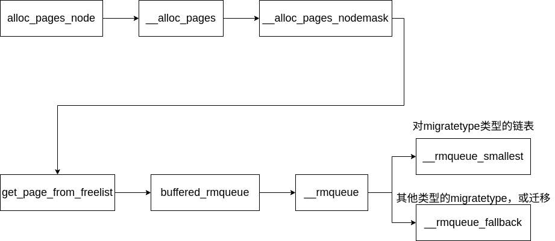
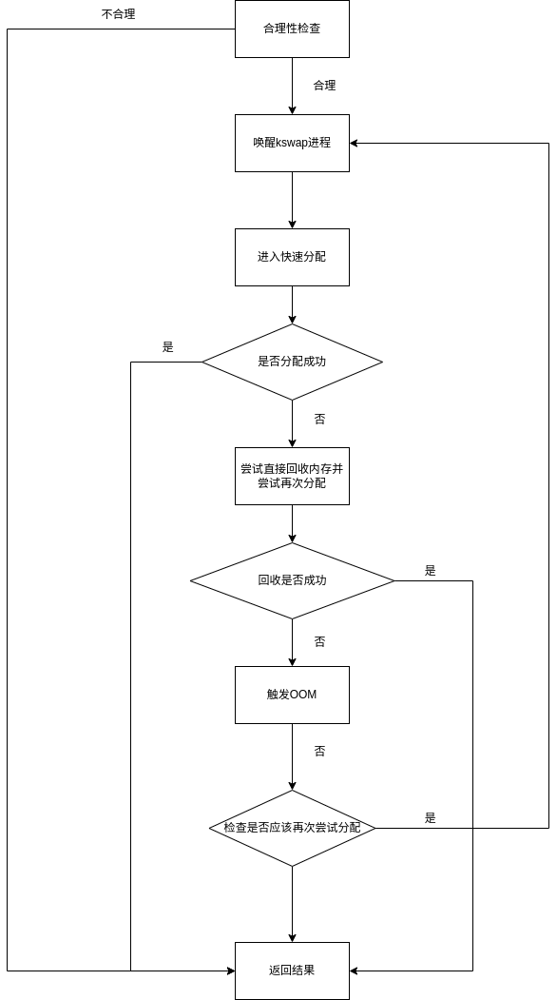
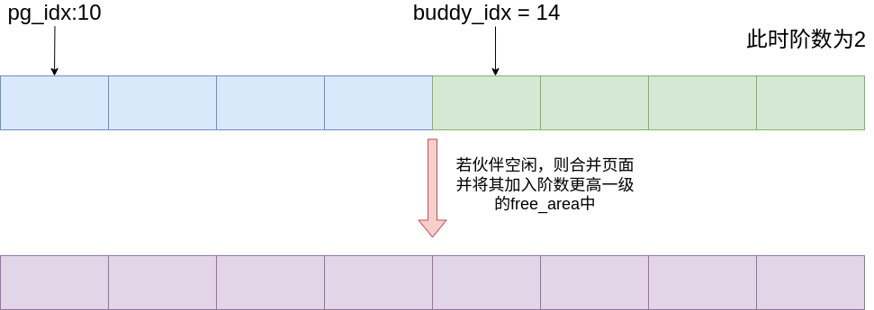
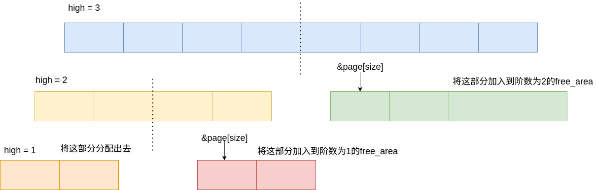

# 伙伴系统

伙伴系统是一个结合了2的方幂个分配器和空闲缓冲区合并计技术的内存分配方案, 其基本思想很简单. 内存被分成含有很多页面的大块, 每一块都是2个页面大小的方幂。如果找不到想要的块, 一个大块会被分成两部分, 这两部分彼此就成为伙伴. 其中一半被用来分配, 而另一半则空闲。 这些块在以后分配的过程中会继续被二分直至产生一个所需大小的块. 当一个块被最终释放时, 其伙伴将被检测出来, 如果伙伴也空闲则合并两者。

## 伙伴系统中需要的结构体

在 zone 中将记录了一个`free_area`结构的数组。

```c
struct zone
{
     /* free areas of different sizes */
    struct free_area        free_area[MAX_ORDER];
};
```

数组中第0个元素的阶为0, 它的free_list链表域指向具有包含区为单页(2^0 = 1)的内存页面链表

数组中第1个元素的free_list域管理的内存区为两页(2^1 = 2)

第3个管理的内存区为4页, 依次类推

直到 2^MAXORDER-1个页面大小的块

```c
struct free_area {
    struct list_head        free_list[MIGRATE_TYPES];//链表头，将不同的页面类型放到对应的链表中
    unsigned long           nr_free;
};
```

在伙伴系统中为了满足页面的分裂合并逻辑，同时也为kswap机制，将页面分为三种类型（2.6）

* 不可移动页 MIGRATE_UNMOVABLE
  
  在内存中有固定位置, 不能移动到其他地方

  核心内核分配的大多数内存属于该类别

* 可移动页 MIGRATE_MOVABLE
  
  可以随意地移动. 属于用户空间应用程序的页属于该类别
  
  它们是通过页表映射的如果它们复制到新位置，页表项可以相应地更新，应用程序不会注意到任何事

* 可回收页 MIGRATE_RECLAIMABLE
  
  不能直接移动, 但可以删除, 其内容可以从某些源重新生成

  例如，映射自文件的数据属于该类别。kswapd守护进程会根据可回收页访问的频繁程度，周期性释放此类内存。 页面回收本身就是一个复杂的过程。 内核会在可回收页占据了太多内存时进行回收, 在内存短缺(即分配失败)时也可以发起页面回收。

* 保留内存页 MIGRATE_RESERVE
  
  表示保留类型的页面。这类页面仅在内存极度紧张的情况下才会被分配，主要用于确保系统在特殊情况下仍然能够分配一些页面。
  
* 隔离页面 MIGRATE_ISOLATE
  表示隔离页面。不能从这些页面中进行分配，通常用于内存热插拔或内存离线操作。当内存块需要隔离时，这些页面会被标记为 MIGRATE_ISOLATE，从而避免被内存分配器使用

## 伙伴系统的初始化

在内存的初始化阶段与伙伴系统相关的有两部分

- zone_init_free_lists
  在该函数中主要是针对 zone 结构中 free_are 成员的初始化。
  * INIT_LIST_HEAD(&zone->free_area[order].free_list[t]) 初始化free_list
  * nr_free = 0; 初始化空闲页面的计数。

在上这步中，伙伴系统中并没有空闲页面的存在。

- mem_init
  该函数主要用于释放 bootmem 中的页，并将其迁移至伙伴系统
  
  在该函数中最终会调用到伙伴系统中用来释放页的接口 `__free_pages`

经过 mem_init 后伙伴系统中才会有空闲页面

## 伙伴系统中页面的释放


```c
static inline void __free_one_page(struct page *page,
		struct zone *zone, unsigned int order,
		int migratetype)
{
	unsigned long page_idx;

	// 如果页面是复合页面，处理并销毁复合页面
	if (unlikely(PageCompound(page)))
		if (unlikely(destroy_compound_page(page, order)))
			return;

	// 检查迁移类型是否有效
	VM_BUG_ON(migratetype == -1);

	// 获取页面索引 (page frame number, PFN)，并限制在 MAX_ORDER 范围内
	page_idx = page_to_pfn(page) & ((1 << MAX_ORDER) - 1);

	// 确保页面索引对齐到 order 的大小，并检查页面范围是否有效
	VM_BUG_ON(page_idx & ((1 << order) - 1));
	VM_BUG_ON(bad_range(zone, page));

	// 合并相邻的伙伴页面，提升 order
	while (order < MAX_ORDER-1) {
		unsigned long combined_idx;
		struct page *buddy;

		// 查找相应的伙伴页面
		buddy = __page_find_buddy(page, page_idx, order);
		
		// 如果找不到符合条件的伙伴页面，停止合并
		if (!page_is_buddy(page, buddy, order))
			break;

		// 如果找到空闲的伙伴页面，合并它们，提升 order 等级
		list_del(&buddy->lru); // 从空闲链表中删除伙伴页面
		zone->free_area[order].nr_free--; // 更新该 order 下的空闲页面计数
		rmv_page_order(buddy); // 移除伙伴页面的 order 信息
		
		// 计算合并后的页面索引，并更新页面指针
		combined_idx = __find_combined_index(page_idx, order);
		page = page + (combined_idx - page_idx); // 更新为合并后的页面
		page_idx = combined_idx; // 更新合并后的页面索引
		order++; // 提升 order 等级
	}

	// 设置页面的 order 并将其插入到合适的空闲链表中
	set_page_order(page, order);
	list_add(&page->lru, &zone->free_area[order].free_list[migratetype]); // 插入到相应 order 的空闲链表中
	zone->free_area[order].nr_free++; // 更新空闲页面计数
}
```

## 伙伴系统中页面的分配

就伙伴系统的接口而言, NUMA或UMA体系结构是没有差别的, 二者的调用语法都是相同的。

所有函数的一个共同点是 : 只能分配2的整数幂个页。

因此，接口中不像C标准库的malloc函数或bootmem和memblock分配器那样指定了所需内存大小作为参数。相反, 必须指定的是分配阶, 伙伴系统将在内存中分配2^0页。

内核中细粒度的分配只能借助于slab分配器(或者slub、slob分配器), 后者基于伙伴系统。


上述函最终都会调用 `alloc_pages_node` ，最终进入伙伴系统分配页的核心函数。

```c
struct page *__alloc_pages_nodemask(gfp_t gfp_mask, unsigned int order,
			struct zonelist *zonelist, nodemask_t *nodemask)
{
	// 获取 GFP 标志对应的高区域索引（即从哪个内存区域分配页面，例如 ZONE_NORMAL, ZONE_HIGHMEM）
	enum zone_type high_zoneidx = gfp_zone(gfp_mask);
	struct zone *preferred_zone;  // 优选区域
	struct page *page;
	int migratetype = allocflags_to_migratetype(gfp_mask);  // 获取分配的迁移类型

	// 掩码校正，确保 GFP 标志只包含允许的位
	gfp_mask &= gfp_allowed_mask;

	// 锁定分配跟踪
	lockdep_trace_alloc(gfp_mask);

	// 如果 GFP 标志要求等待，则可能需要睡眠
	might_sleep_if(gfp_mask & __GFP_WAIT);

	// 根据 GFP 标志模拟分配失败（用于测试目的）
	if (should_fail_alloc_page(gfp_mask, order))
		return NULL;

	/*
	 * 检查满足 gfp_mask 要求的内存区域是否至少包含一个有效的区域。
	 * 如果使用了 GFP_THISNODE 或者当前节点没有内存，则可能出现空的区域列表。
	 */
	if (unlikely(!zonelist->_zonerefs->zone))
		return NULL;

	// 获取优选的区域，并在之后用于统计
	first_zones_zonelist(zonelist, high_zoneidx, nodemask, &preferred_zone);
	if (!preferred_zone)
		return NULL;

	// 第一次尝试分配页面，从空闲列表中获取页面
	page = get_page_from_freelist(gfp_mask|__GFP_HARDWALL, nodemask, order,
			zonelist, high_zoneidx, ALLOC_WMARK_LOW|ALLOC_CPUSET,
			preferred_zone, migratetype);

	// 如果第一次尝试失败，进入慢路径重新尝试分配
	if (unlikely(!page))
		page = __alloc_pages_slowpath(gfp_mask, order,
				zonelist, high_zoneidx, nodemask,
				preferred_zone, migratetype);

	// 记录页面分配的跟踪信息
	trace_mm_page_alloc(page, order, gfp_mask, migratetype);

	// 返回分配的页面
	return page;
}
EXPORT_SYMBOL(__alloc_pages_nodemask);
```

### 快速路径分配



在该函数的流程中，首先调用 first_zones_zonelist 该函数用于遍历 zonelist 并根据 nodemask 找到对应的 preferred_zone 。

在分配时，会优先考虑 preferred_zone 区域中的空闲页。

随后使用 get_page_from_freelist 对空闲页面进行分配。

```c
static struct page *
get_page_from_freelist(gfp_t gfp_mask, nodemask_t *nodemask, unsigned int order,
		struct zonelist *zonelist, int high_zoneidx, int alloc_flags,
		struct zone *preferred_zone, int migratetype)
{
	struct zoneref *z;
	struct page *page = NULL;
	int classzone_idx;
	struct zone *zone;
	nodemask_t *allowednodes = NULL; /* zonelist_cache 近似 */
	int zlc_active = 0;		/* 如果使用 zonelist_cache 则设置 */
	int did_zlc_setup = 0;		/* 只调用一次 zlc_setup() */

	classzone_idx = zone_idx(preferred_zone);
zonelist_scan:
	/*
	 * 扫描 zonelist，寻找具有足够空闲页框的区域。
	 * 参见 kernel/cpuset.c 中 cpuset_zone_allowed() 的注释。
	 */
	for_each_zone_zonelist_nodemask(zone, z, zonelist,
						high_zoneidx, nodemask) {
		if (NUMA_BUILD && zlc_active &&
			!zlc_zone_worth_trying(zonelist, z, allowednodes))
				continue;

		if ((alloc_flags & ALLOC_CPUSET) &&
			!cpuset_zone_allowed_softwall(zone, gfp_mask))
				goto try_next_zone;

		BUILD_BUG_ON(ALLOC_NO_WATERMARKS < NR_WMARK);
		if (!(alloc_flags & ALLOC_NO_WATERMARKS)) {
			unsigned long mark;
			int ret;

			/* 检查该区域的水印，确保有足够的空闲页框 */
			mark = zone->watermark[alloc_flags & ALLOC_WMARK_MASK];
			if (zone_watermark_ok(zone, order, mark,
				    classzone_idx, alloc_flags))
				goto try_this_zone;

			/* 如果区域回收模式关闭，跳过该区域 */
			if (zone_reclaim_mode == 0)
				goto this_zone_full;

			/* 尝试区域回收 */
			ret = zone_reclaim(zone, gfp_mask, order);
			switch (ret) {
			case ZONE_RECLAIM_NOSCAN:
				/* 未进行扫描 */
				goto try_next_zone;
			case ZONE_RECLAIM_FULL:
				/* 扫描但无法回收内存 */
				goto this_zone_full;
			default:
				/* 检查回收后是否满足水印要求 */
				if (!zone_watermark_ok(zone, order, mark,
						classzone_idx, alloc_flags))
					goto this_zone_full;
			}
		}

try_this_zone:
		/* 从缓冲队列中分配页框 */
		page = buffered_rmqueue(preferred_zone, zone, order,
						gfp_mask, migratetype);
		if (page)
			break;

this_zone_full:
		/* 在 NUMA 环境中，标记该区域为已满 */
		if (NUMA_BUILD)
			zlc_mark_zone_full(zonelist, z);

try_next_zone:
		/* 只在第一次遍历时设置 zlc_cache，并且仅在多个 NUMA 节点时启用 */
		if (NUMA_BUILD && !did_zlc_setup && nr_online_nodes > 1) {
			/* 在尝试第一个区域后调用 zlc_setup */
			allowednodes = zlc_setup(zonelist, alloc_flags);
			zlc_active = 1;
			did_zlc_setup = 1;
		}
	}

	/* 如果未分配到页框，并且 zlc_cache 激活，进行第二次扫描 */
	if (unlikely(NUMA_BUILD && page == NULL && zlc_active)) {
		/* 禁用 zlc_cache 进行第二次扫描 */
		zlc_active = 0;
		goto zonelist_scan;
	}

	return page;
}
```

在该函数中会对 zonelist 中的节点进行扫描。对于每一个节点会做出如下处理：

1. 检查zone中的水位线成员，如果没有超过则直接调用 `buffered_rmqueue` 函数分配页面，如果超过内存水位线之后则尝试区域回收。
2. 如果没有区域回收，则扫描下一个zone节点。

对页面的分配最终会调用 `__rmqueue_smallest` 与 `__rmqueue_fallback` 对不同的情况做出处理。

- __rmqueue_smallest
  
  在函数 __rmqueue_smallest 中只会对migratetype类型的链表进行操作，并且会按照需要的阶数在 zone 中的 free_area 数组中依次向上遍历。如果获取到页面的阶数大于需要的阶数，则会对页面进行分裂。

  比如最初传入的值是8，而成功分配是10，那么就会连续页框进行拆分，这时候就会拆分为256、256、512这三块连续页框，并把512放入order为9的free_list，把一个256放入order为8的free_list，剩余一个256用于分配。

- __rmqueue_fallback
  
  __rmqueue_fallback()函数中，主要根据fallbacks表，尝试将其他migratetype类型的pageblock中的空闲页移动到目标类型的mirgratetype类型的空闲页框块链表中。其余的操作与 `__rmqueue_smallest` 函数基本相同。

在函数 buffered_rmqueue 中在调用 `__rmqueue` 函数分配了空闲页之后，还会使用 `zone_statistics` 函数对分配页面的区域做出检查。检查空闲页所在的 zone 是否和 `first_zones_zonelist` 计算得出的最优 zone 一致。

```c
void zone_statistics(struct zone *preferred_zone, struct zone *z)
{
	// 如果分配发生的 zone（z）和首选的 zone（preferred_zone）属于同一个节点（pgdat），
	// 则计数 NUMA_HIT（表示 NUMA 匹配的分配，即首选区域在同一个节点上）。
	if (z->zone_pgdat == preferred_zone->zone_pgdat) {
		__inc_zone_state(z, NUMA_HIT);  // 记录 NUMA 匹配的分配
	} else {
		// 如果分配的区域和首选区域不在同一个节点，
		// 则计数 NUMA_MISS（分配没有命中首选的节点），
		// 并且增加首选区域的 NUMA_FOREIGN 计数（表示跨节点的分配）。
		__inc_zone_state(z, NUMA_MISS);  // 记录 NUMA 未命中的分配
		__inc_zone_state(preferred_zone, NUMA_FOREIGN);  // 记录跨节点分配
	}

	// 如果分配的区域（z）属于当前节点（即当前处理器所在的 NUMA 节点），
	// 则增加 NUMA_LOCAL 计数（表示分配是本地的）。
	if (z->node == numa_node_id())
		__inc_zone_state(z, NUMA_LOCAL);  // 记录本地分配
	else
		// 如果分配的区域不属于当前节点，增加 NUMA_OTHER 计数（表示分配是远程的）。
		__inc_zone_state(z, NUMA_OTHER);  // 记录远程分配
}
```

在上述代码中对于页的分配依赖于gfp_mask，那么是什么是gfp_mask？

### 慢速路径分配

```c
static inline struct page *
__alloc_pages_slowpath(gfp_t gfp_mask, unsigned int order,
	struct zonelist *zonelist, enum zone_type high_zoneidx,
	nodemask_t *nodemask, struct zone *preferred_zone,
	int migratetype)
{
	// 定义一些局部变量：
	// wait：表示是否需要等待内存回收。
	// page：存储分配到的页。
	// alloc_flags：分配标志，用于调整分配策略。
	// pages_reclaimed：表示回收了多少页。
	// did_some_progress：指示回收内存是否有进展。
	const gfp_t wait = gfp_mask & __GFP_WAIT;
	struct page *page = NULL;
	int alloc_flags;
	unsigned long pages_reclaimed = 0;
	unsigned long did_some_progress;
	struct task_struct *p = current;

	/*
	 * 检查分配的页框数量是否大于或等于 MAX_ORDER。
	 * 如果是，发出警告并返回 NULL，因为这样的分配请求几乎不可能成功。
	 */
	if (order >= MAX_ORDER) {
		WARN_ON_ONCE(!(gfp_mask & __GFP_NOWARN));
		return NULL;
	}

	/*
	 * 如果设置了 GFP_THISNODE 标志，表示只允许在当前节点分配内存。
	 * 如果当前节点没有足够的内存，跳过内存回收，直接返回 NULL。
	 */
	if (NUMA_BUILD && (gfp_mask & GFP_THISNODE) == GFP_THISNODE)
		goto nopage;

restart:
	// 唤醒 kswapd，尝试回收内存
	wake_all_kswapd(order, zonelist, high_zoneidx);

	/*
	 * 设置 alloc_flags，决定分配内存时应该采取的策略。
	 */
	alloc_flags = gfp_to_alloc_flags(gfp_mask);

	// 尝试从自由列表中获取页
	page = get_page_from_freelist(gfp_mask, nodemask, order, zonelist,
			high_zoneidx, alloc_flags & ~ALLOC_NO_WATERMARKS,
			preferred_zone, migratetype);
	if (page)
		goto got_pg;

rebalance:
	/*
	 * 如果允许，尝试在没有水印约束的情况下分配内存。
	 */
	if (alloc_flags & ALLOC_NO_WATERMARKS) {
		page = __alloc_pages_high_priority(gfp_mask, order,
				zonelist, high_zoneidx, nodemask,
				preferred_zone, migratetype);
		if (page)
			goto got_pg;
	}

	/*
	 * 如果没有设置等待标志 (__GFP_WAIT)，则不允许直接回收内存，跳过。
	 */
	if (!wait)
		goto nopage;

	// 避免在当前任务标记为 PF_MEMALLOC 时递归调用直接回收
	if (p->flags & PF_MEMALLOC)
		goto nopage;

	// 防止被标记为内存即将死亡（TIF_MEMDIE）的进程在分配失败后反复尝试
	if (test_thread_flag(TIF_MEMDIE) && !(gfp_mask & __GFP_NOFAIL))
		goto nopage;

	/*
	 * 尝试直接回收内存，然后再次尝试分配。
	 */
	page = __alloc_pages_direct_reclaim(gfp_mask, order,
					zonelist, high_zoneidx,
					nodemask,
					alloc_flags, preferred_zone,
					migratetype, &did_some_progress);
	if (page)
		goto got_pg;

	/*
	 * 如果内存回收没有取得任何进展，考虑触发 OOM（内存不足）杀手。
	 */
	if (!did_some_progress) {
		if ((gfp_mask & __GFP_FS) && !(gfp_mask & __GFP_NORETRY)) {
			// 如果 OOM 杀手被禁用，直接返回 NULL
			if (oom_killer_disabled)
				goto nopage;
			
			// 触发 OOM 杀手
			page = __alloc_pages_may_oom(gfp_mask, order,
					zonelist, high_zoneidx,
					nodemask, preferred_zone,
					migratetype);
			if (page)
				goto got_pg;

			/*
			 * 高阶分配失败时，如果没有设置 __GFP_NOFAIL，直接返回 NULL。
			 */
			if (order > PAGE_ALLOC_COSTLY_ORDER &&
						!(gfp_mask & __GFP_NOFAIL))
				goto nopage;

			// 再次尝试分配
			goto restart;
		}
	}

	/*
	 * 检查是否应该再次尝试分配。
	 */
	pages_reclaimed += did_some_progress;
	if (should_alloc_retry(gfp_mask, order, pages_reclaimed)) {
		// 等待一些写操作完成，然后再次尝试平衡分配。
		congestion_wait(BLK_RW_ASYNC, HZ/50);
		goto rebalance;
	}

nopage:
	// 如果没有设置 __GFP_NOWARN 标志，并且打印速率限制器允许，打印警告信息。
	if (!(gfp_mask & __GFP_NOWARN) && printk_ratelimit()) {
		printk(KERN_WARNING "%s: page allocation failure."
			" order:%d, mode:0x%x\n",
			p->comm, order, gfp_mask);
		dump_stack();
		show_mem();
	}
	return page;

got_pg:
	// 如果 kmemcheck 启用，记录已分配的页。
	if (kmemcheck_enabled)
		kmemcheck_pagealloc_alloc(page, order, gfp_mask);
	return page;
}
```



在慢速路径中，会通过 kswap oom 等机制将内存回收后再次尝试内存的分配。

同为回收，那么快速路径中的区域回收与 kswap 机制又有什么区别？

zone_reclaim_mode模式是在2.6版本后期开始加入内核的一种模式，可以用来管理当一个内存区域(zone)内部的内存耗尽时，是从其内部进行内存回收还是可以从其他zone进行回收的选项

1. zone_reclaim_mode 是对一个固定的 zone 中的内存进行回收，而 kswap 则是对操作系统全局范围内的内存进行回收
2. 因为 zone_reclaim 主要面向本地节点中内存的回收，避免了远程内存的访问，因此性能更好

## 页面的合并分裂与迁移

### 伙伴页面的计算与页面合并

页面的合并发生在页面释放的时候。如果伙伴页也为空闲，则会对页面进行合并。

在伙伴系统的算法中，会将物理地址上相邻的页面作为互相的伙伴。如图中，在阶数为2的情况下，将四个连续的物理页算作伙伴。


buddy_idx 为伙伴页的页框号。

```c
static inline struct page *__page_find_buddy(struct page *page, unsigned long page_idx, unsigned int order)
{
    unsigned long buddy_idx = page_idx ^ (1 << order);

    return page + (buddy_idx - page_idx);
}
```

以 page_idx = 10 为例，假设此时是阶数为2，即四个页面连在一起。

```c

(1<<order) = 100

  1 0 1 0
^ 0 1 0 0
————————————      异或得到下一个伙伴起始的页号为14
  1 1 1 0

  buddy_idx - page_idx得到本页对应的page结构到伙伴组的对应page结构地址的差距为4
  page + (buddy_idx - page_idx)
```



### 页面的分裂

页面分裂发生在分配页面的时候。当需要的阶数大于被分配的空闲页面阶数，则会进行页面分裂。

```c
static inline void expand(struct zone *zone, struct page *page, int low, int high, struct free_area *area, int migratetype)
{
	unsigned long size = 1 << high;// 当前页面块的大小，2^high

	while (high > low) {
		area--;//移动到下一个更小阶的 free_area
		high--;//当前阶数减 1
		size >>= 1;//拆分页面块为更小的块（将块大小减半）
		VM_BUG_ON(bad_range(zone, &page[size]));
		list_add(&page[size].lru, &area->free_list[migratetype]);//将大页的后半部分放入阶数-1的free_area中
		area->nr_free++;
		set_page_order(&page[size], high);//设置拆分出的页面块的 order 信息，用于标记该块的阶数
	}
}
```

假设需要的阶数为1，分配到的阶数则为3。



### 页面回滚

#### fallbacks

`fallbacks` 是一个二维数组，其行表示当前的迁移类型。

列表示当该迁移类型的空闲页面不足时应回退的迁移类型顺序。每种迁移类型的空闲列表都包含不同类型的页面块。这些页面块的特性决定了它们能否被移动、回收或被保留。

```c
static int fallbacks[MIGRATE_TYPES][MIGRATE_TYPES-1] = {
    [MIGRATE_UNMOVABLE]   = { MIGRATE_RECLAIMABLE,MIGRATE_MOVABLE,   MIGRATE_RESERVE },
    [MIGRATE_RECLAIMABLE] = { MIGRATE_UNMOVABLE,   MIGRATE_MOVABLE,   MIGRATE_RESERVE },
    [MIGRATE_MOVABLE]     = { MIGRATE_RECLAIMABLE, MIGRATE_UNMOVABLE, MIGRATE_RESERVE },
    [MIGRATE_RESERVE]     = { MIGRATE_RESERVE,     MIGRATE_RESERVE,   MIGRATE_RESERVE }, /* Never used */
};
```

其中一个一维数组代表一个回退顺序。

例如 MIGRATE_UNMOVABLE ，当无法移动的页面（MIGRATE_UNMOVABLE）用尽时，回退到 MIGRATE_RECLAIMABLE（可以回收的页面），然后是 MIGRATE_MOVABLE（可移动页面），最后是 MIGRATE_RESERVE（保留的页面块）。

### 页面迁移

页面迁移的时机：

* migrate_pages系统调用可以由用户根据情况进行页迁移

* kcompact内核线程：每个内存节点都会创建一个kcompactd内核线程，名称为kcompactd，每个节点都由一个kcompactd线程用于内存规整

* 内存热插拔：内存下线时，需要将该内存迁移到另外一个节点 防止数据丢失。

* move_pages:为另外一个系统调用，用于将指定进程的页面迁移到新节点。

* 系统长时间运行之后，可以通过sys和proc进行手动规整：

  * /proc/sys/vm/compact_memory：用于对当前系统所有进程的内存进行规整
  * sys/devices/system/node/node/compact： 用于手动指定单个节点进行内存规整。

* 当系统物理内存处于较低min watermark时，会通过__alloc_pages_direct_compact直接触发内存规整。

* 当进程在numa节点中发生迁移，会触发numa balance，将物理内存迁移到对应节点中。

* 当cma are中内存被move 类型内存占有，进行cma申请连续物理内存是会触发物理页迁移。

* get_user_pages类似函数申请内存时，对cma are进行检查有可能会触发物理页迁移。

* 当内核配置CONFIG_MEMORY_FAILURE，内存处理过程中如果出现memory failed 会进行页迁移