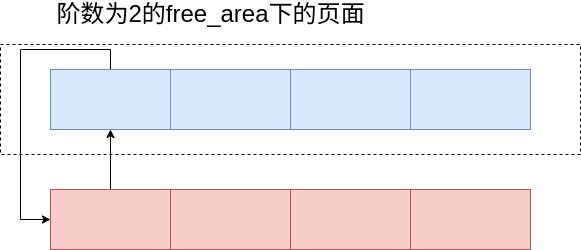

# 伙伴系统

伙伴系统是一个结合了2的方幂个分配器和空闲缓冲区合并计技术的内存分配方案, 其基本思想很简单. 内存被分成含有很多页面的大块, 每一块都是2个页面大小的方幂. 如果找不到想要的块, 一个大块会被分成两部分, 这两部分彼此就成为伙伴. 其中一半被用来分配, 而另一半则空闲. 这些块在以后分配的过程中会继续被二分直至产生一个所需大小的块. 当一个块被最终释放时, 其伙伴将被检测出来, 如果伙伴也空闲则合并两者.

## 伙伴系统中需要的结构体

在 zone 中将记录了一个`free_area`结构的数组。

```c
struct zone
{
     /* free areas of different sizes */
    struct free_area        free_area[MAX_ORDER];
};
```

数组中第0个元素的阶为0, 它的free_list链表域指向具有包含区为单页(2^0 = 1)的内存页面链表

数组中第1个元素的free_list域管理的内存区为两页(2^1 = 2)

第3个管理的内存区为4页, 依次类推.

直到 2^MAXORDER-1个页面大小的块

```c
struct free_area {
    struct list_head        free_list[MIGRATE_TYPES];//链表头
    unsigned long           nr_free;
};
```

在伙伴系统中为了满足页面的分裂合并逻辑，同时也为kswap机制，将页面分为三种类型（2.6）

* 不可移动页 MIGRATE_UNMOVABLE
  
  在内存中有固定位置, 不能移动到其他地方

  核心内核分配的大多数内存属于该类别

* 可移动页 MIGRATE_MOVABLE
  
  可以随意地移动. 属于用户空间应用程序的页属于该类别
  
  它们是通过页表映射的如果它们复制到新位置，页表项可以相应地更新，应用程序不会注意到任何事

* 可回收页 MIGRATE_RECLAIMABLE
  
  不能直接移动, 但可以删除, 其内容可以从某些源重新生成

  例如，映射自文件的数据属于该类别。kswapd守护进程会根据可回收页访问的频繁程度，周期性释放此类内存。 页面回收本身就是一个复杂的过程。 内核会在可回收页占据了太多内存时进行回收, 在内存短缺(即分配失败)时也可以发起页面回收。

* 保留内存页 MIGRATE_RESERVE
  
  表示保留类型的页面。这类页面仅在内存极度紧张的情况下才会被分配，主要用于确保系统在特殊情况下仍然能够分配一些页面。
  
* 隔离页面 MIGRATE_ISOLATE
  表示隔离页面。不能从这些页面中进行分配，通常用于内存热插拔或内存离线操作。当内存块需要隔离时，这些页面会被标记为 MIGRATE_ISOLATE，从而避免被内存分配器使用

## 伙伴系统的初始化

在内存的初始化阶段与伙伴系统相关的有两部分

- zone_init_free_lists
  在该函数中主要是针对 zone 结构中 free_are 成员的初始化。
  * INIT_LIST_HEAD(&zone->free_area[order].free_list[t]) 初始化free_list
  * nr_free = 0; 初始化空闲页面的计数。

在上这步中，伙伴系统中并没有空闲页面的存在。

- mem_init
  该函数主要用于释放 bootmem 中的页，并将其迁移至伙伴系统
  
  在该函数中最终会调用到伙伴系统中用来释放页的接口 `__free_pages`

经过 mem_init 后伙伴系统中才会有空闲页面


## 伙伴系统中页面的释放


```c
static inline void __free_one_page(struct page *page,
		struct zone *zone, unsigned int order,
		int migratetype)
{
	unsigned long page_idx;

	// 如果页面是复合页面，处理并销毁复合页面
	if (unlikely(PageCompound(page)))
		if (unlikely(destroy_compound_page(page, order)))
			return;

	// 检查迁移类型是否有效
	VM_BUG_ON(migratetype == -1);

	// 获取页面索引 (page frame number, PFN)，并限制在 MAX_ORDER 范围内
	page_idx = page_to_pfn(page) & ((1 << MAX_ORDER) - 1);

	// 确保页面索引对齐到 order 的大小，并检查页面范围是否有效
	VM_BUG_ON(page_idx & ((1 << order) - 1));
	VM_BUG_ON(bad_range(zone, page));

	// 合并相邻的伙伴页面，提升 order
	while (order < MAX_ORDER-1) {
		unsigned long combined_idx;
		struct page *buddy;

		// 查找相应的伙伴页面
		buddy = __page_find_buddy(page, page_idx, order);
		
		// 如果找不到符合条件的伙伴页面，停止合并
		if (!page_is_buddy(page, buddy, order))
			break;

		// 如果找到空闲的伙伴页面，合并它们，提升 order 等级
		list_del(&buddy->lru); // 从空闲链表中删除伙伴页面
		zone->free_area[order].nr_free--; // 更新该 order 下的空闲页面计数
		rmv_page_order(buddy); // 移除伙伴页面的 order 信息
		
		// 计算合并后的页面索引，并更新页面指针
		combined_idx = __find_combined_index(page_idx, order);
		page = page + (combined_idx - page_idx); // 更新为合并后的页面
		page_idx = combined_idx; // 更新合并后的页面索引
		order++; // 提升 order 等级
	}

	// 设置页面的 order 并将其插入到合适的空闲链表中
	set_page_order(page, order);
	list_add(&page->lru, &zone->free_area[order].free_list[migratetype]); // 插入到相应 order 的空闲链表中
	zone->free_area[order].nr_free++; // 更新空闲页面计数
}
```

## 伙伴页面的计算

在伙伴系统的算法中，会将物理地址上相邻的页面作为互相的伙伴。如图中，在阶数为2的情况下，将四个连续的物理页算作伙伴。



buddy_idx 为一个页在这一组伙伴页内的偏移。

```c
static inline struct page *__page_find_buddy(struct page *page, unsigned long page_idx, unsigned int order)
{
    unsigned long buddy_idx = page_idx ^ (1 << order);

    return page + (buddy_idx - page_idx);
}
```

以 page_idx = 10 为例，假设此时是阶数为2，即四个页面连在一起。

```c

(1<<order) = 100

  1 0 1 0
^ 0 1 0 0
——————      异或得到下一个伙伴起始的页号为14
  1 1 1 0

  buddy_idx - page_idx得到本页对应的page结构到伙伴组的对应page结构地址的差距为4
  page + (buddy_idx - page_idx)
```


