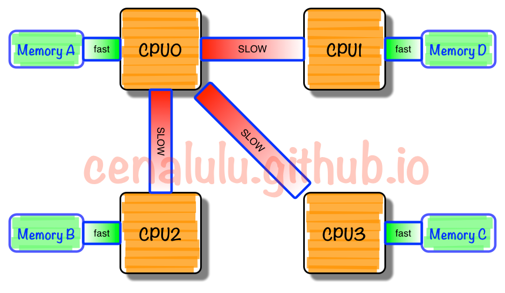
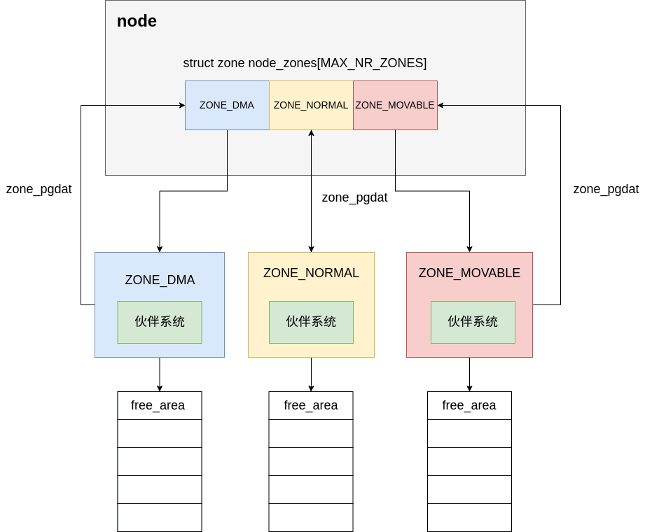
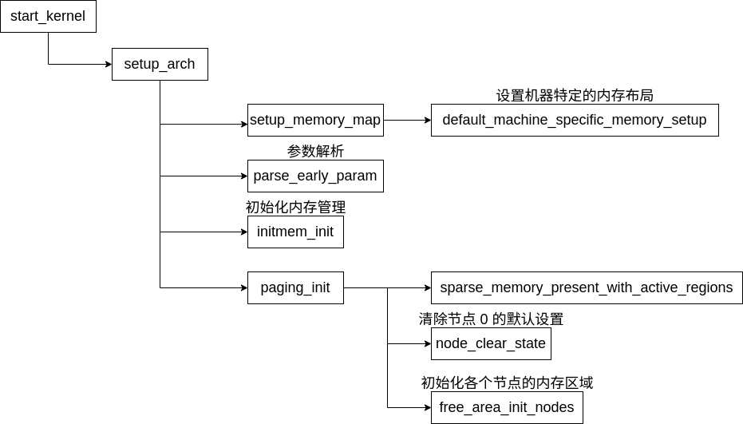
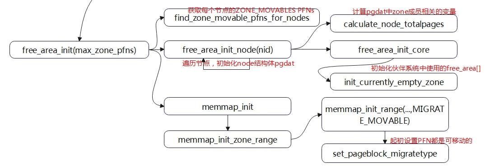
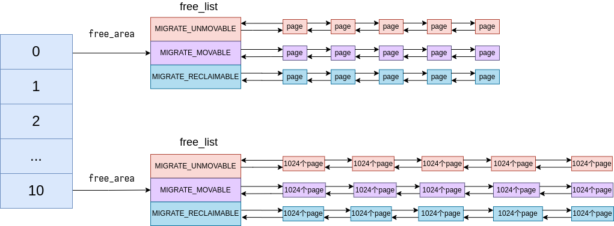
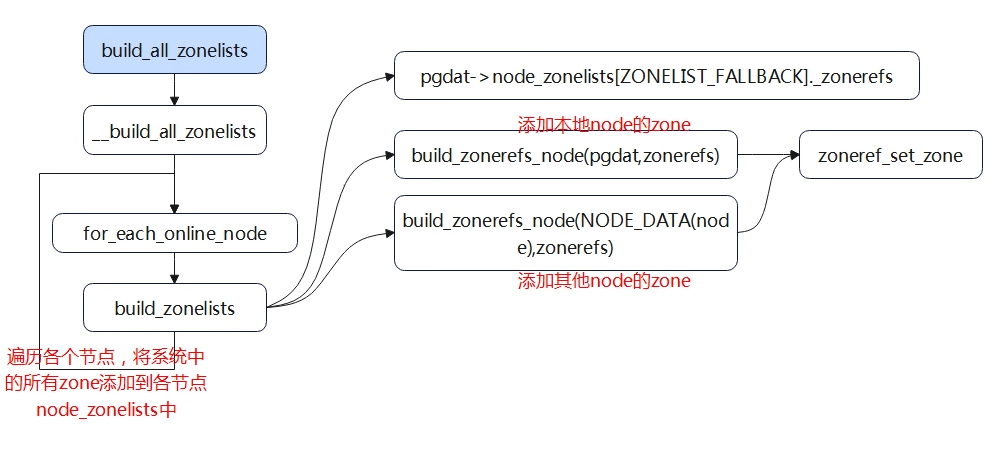

# 内存管理的初始化

内存管理其实在内核自解压的阶段就已经开始。

## 开启分页机制

在内核镜像还未解压时，在 arch/x86/boot/compressed/head_64.S 中就已经开启分页机制并初步构建起来一个 4GB 的页表

```asm
/*
 * Build early 4G boot pagetable 构建 4GB 的页表
 */
	/* 初始化页表，清零所有页表项 */
	leal	pgtable(%ebx), %edi         /* 加载页表的起始地址到 EDI 寄存器 */
	xorl	%eax, %eax                  /* 清空 EAX 寄存器 (EAX = 0) */
	movl	$((4096*6)/4), %ecx         /* 设置 ECX 为 (4096 * 6) / 4，即页表的大小，以4字节为单位 */
	rep	stosl                        /* 使用 `stosl` 指令将 EAX 中的值（即0）重复写入 ECX 次，清空页表 */

	/* 构建第 4 级页表 */
	leal	pgtable + 0(%ebx), %edi     /* 加载第 4 级页表的地址到 EDI */
	leal	0x1007 (%edi), %eax         /* 设置 EAX 为 EDI + 0x1007，指向下一个页表项 */
	movl	%eax, 0(%edi)               /* 将 EAX 写入第 4 级页表的第一个项 */

	/* 构建第 3 级页表 */
	leal	pgtable + 0x1000(%ebx), %edi /* 加载第 3 级页表的地址到 EDI */
	leal	0x1007(%edi), %eax           /* 设置 EAX 为 EDI + 0x1007，指向下一个页表项 */
	movl	$4, %ecx                    /* 初始化 ECX 为 4（表示有4个页表项） */
1:	movl	%eax, 0x00(%edi)           /* 将 EAX 写入第 3 级页表的当前项 */
	addl	$0x00001000, %eax           /* 将 EAX 加上 0x1000，用于下一个页表项 */
	addl	$8, %edi                    /* 将 EDI 加上 8，指向下一个页表项 */
	decl	%ecx                        /* 减少 ECX，遍历4次 */
	jnz	1b                           /* 如果 ECX 不为 0，则跳转回循环继续 */

	/* 构建第 2 级页表 */
	leal	pgtable + 0x2000(%ebx), %edi /* 加载第 2 级页表的地址到 EDI */
	movl	$0x00000183, %eax           /* 初始化 EAX，设置页表项的标志 */
	movl	$2048, %ecx                 /* 初始化 ECX 为 2048，表示有 2048 个页表项 */
1:	movl	%eax, 0(%edi)              /* 将 EAX 写入第 2 级页表的当前项 */
	addl	$0x00200000, %eax           /* 将 EAX 加上 0x200000，表示 2MB 的页大小 */
	addl	$8, %edi                    /* 将 EDI 加上 8，指向下一个页表项 */
	decl	%ecx                        /* 减少 ECX，遍历 2048 次 */
	jnz	1b                           /* 如果 ECX 不为 0，则跳转回循环继续 */

	/* 启用启动页表 */
	leal	pgtable(%ebx), %eax         /* 加载页表的起始地址到 EAX */
	movl	%eax, %cr3                  /* 将 EAX 中的页表基址加载到控制寄存器 CR3，启用页表 */
```

内核把页目录的0和768项指向同样的页表、1和769项指向同样的页表，使得线性地址0和0xc0000000指向同样的物理地址，把其余页目录项全部清零，使得其他地址都未映射。

## 进入保护模式

在 arch/x86/boot/main.c 的 main 函数中调用了 `go_to_protected_mode` 函数，该函数位于arch/x86/boot/pm.c 中。

在 `go_to_protected_mode` 的结尾处调用了 `setup_gdt` 与 `setup_idt` 用于进入保护模式之前对于分段内存管理的设置，分别设置了全局描述符表和中断描述符表。

```c
static void setup_gdt(void)
{
	/* 有些机器已知不能在 GDT 没有对齐 8 字节的情况下启动。
	   Intel 建议使用 16 字节对齐。*/
	static const u64 boot_gdt[] __attribute__((aligned(16))) = {
		/* CS: 代码段，读取/执行，4 GB，基址为 0 */
		[GDT_ENTRY_BOOT_CS] = GDT_ENTRY(0xc09b, 0, 0xfffff),
		/* DS: 数据段，读/写，4 GB，基址为 0 */
		[GDT_ENTRY_BOOT_DS] = GDT_ENTRY(0xc093, 0, 0xfffff),
		/* TSS: 32 位任务状态段，104 字节，基址为 4096 */
		/* 我们在这里使用 TSS 只是为了让 Intel VT 技术工作；
		   实际上我们不使用它做任何事情。*/
		[GDT_ENTRY_BOOT_TSS] = GDT_ENTRY(0x0089, 4096, 103),
	};

	/* Xen HVM 错误地存储了 gdt_ptr 的指针，而不是 gdt_ptr 的内容。
	   因此，将 gdt_ptr 设置为静态变量，以确保它留在内存中，
	   至少要持续到我们切换到正确的内核 GDT 为止。*/
	static struct gdt_ptr gdt;

	/* 设置 GDT 的长度。GDT 的长度是 boot_gdt 数组的字节大小减去 1。 */
	gdt.len = sizeof(boot_gdt) - 1;
	
	/* 设置 GDT 的指针。这个指针是 boot_gdt 数组的地址，加上段偏移量。 */
	gdt.ptr = (u32)&boot_gdt + (ds() << 4);

	/* 使用汇编指令 `lgdtl` 加载 GDT。
	   `lgdtl %0` 是将 gdt_ptr 传递给 LGDT 指令，用于加载新的 GDT。*/
	asm volatile("lgdtl %0" : : "m" (gdt));
}

static void setup_idt(void)
{
	static const struct gdt_ptr null_idt = {0, 0};
	asm volatile("lidtl %0" : : "m" (null_idt));
}
```

## 获取可用的物理内存区域

在不同的指令集架构中有不同的获取可用物理内存区域的做法。但无论是什么架构的内核，在初始化中都需要经历获取物理内存区域这一过程。

在x86架构下这一功能由 BIOS 中断 Ox IS 的子功能 E820 能够获取系统的内存布局。

由e820子功能获取到的物理内存区域会被存放在 e820map

```c
struct e820entry {
	__u64 addr;    /* 内存段的起始地址 */
	__u64 size;    /* 内存段的大小 */
	__u32 type;    /* 内存段的类型 */
} __attribute__((packed));


struct e820map {
	__u32 nr_map;
	struct e820entry map[E820_X_MAX];
};
```

在内核自解压阶段由 arch/x86/boot/main.c 中的 main 执行函数 detect_memory 。在函数 detect_memory 中会依次调用 e820 e801 88 等统计内存的功能。

```c
int detect_memory(void)
{
	int err = -1;

	if (detect_memory_e820() > 0)
		err = 0;

	if (!detect_memory_e801())
		err = 0;

	if (!detect_memory_88())
		err = 0;

	return err;
}
```

以 e820 为例，在这一步中会统计物理内存的区域并将这些区域的起始信息记录在结构体 `boot_params` 的成员 `e820_map` 中。以供后续 NUMA 架构初始化来使用。

```c
static int detect_memory_e820(void)
{
	int count = 0;  // 记录检测到的内存区域数目
	struct biosregs ireg, oreg;  // ireg 用于存放输入寄存器的值，oreg 用于存放输出寄存器的值
	struct e820entry *desc = boot_params.e820_map;  // 指向 `boot_params.e820_map` 中当前存储内存条目的指针
	static struct e820entry buf; /* 静态变量 `buf`，用于暂存 BIOS 返回的内存区域信息，初始值为零 */

	initregs(&ireg);  // 初始化输入寄存器，将寄存器置零
	ireg.ax  = 0xe820;  // 设置 AX 寄存器为 0xE820，这是 BIOS 中断调用的功能号，用于获取内存映射
	ireg.cx  = sizeof buf;  // 设置 CX 为缓冲区的大小，即 `buf` 的大小
	ireg.edx = SMAP;  // 设置 EDX 为 SMAP 签名，表明我们希望使用标准的内存映射协议
	ireg.di  = (size_t)&buf;  // 设置 DI 寄存器为 `buf` 的地址，BIOS 将返回的数据写入该缓冲区

	/*
	 * 注意: 至少有一种 BIOS 会假设当前 e820 调用指向的缓冲区与上一次调用相同，
	 * 仅修改已经被改变的字段。因此，我们使用一个临时缓冲区 `buf`，并将结果逐个条目复制。
	 *
	 * 该函数故意不考虑 ACPI 3+ 扩展属性，这是因为有些 BIOS 会将所有区域的有效位报告为零。
	 * 我们目前不使用其他的属性位。如果将来看到这些扩展属性被有效利用，可以重新考虑此部分代码。
	 */

	do {
		// 调用 BIOS 中断 0x15，功能号 0xE820，通过 `ireg` 和 `oreg` 传递和接收寄存器值
		intcall(0x15, &ireg, &oreg);
		ireg.ebx = oreg.ebx; /* 保存 EBX 的值以便下一次迭代中继续传递 */

		/* 一些 BIOS 终止内存区域链时不会清空 %ebx 而是设置 CF 标志。
		   在最后一次失败的探测中，它们不总是报告 SMAP 签名。 */
		if (oreg.eflags & X86_EFLAGS_CF)  // 检查是否设置了进位标志 CF。如果设置，表示 BIOS 内存映射获取结束
			break;

		/* 有些 BIOS 会在搜索循环中途停止返回 SMAP 签名。
		   由于无法确定 BIOS 是否破坏了内存映射（可能是部分映射、完整映射或无效数据），
		   因此直接返回失败。 */
		if (oreg.eax != SMAP) {  // 检查返回的 EAX 是否包含 SMAP 签名
			count = 0;  // 如果不包含 SMAP 签名，认为内存映射失败，计数器置零
			break;
		}

		*desc++ = buf;  // 将缓冲区 `buf` 中的数据复制到 `boot_params.e820_map` 中的当前条目
		count++;  // 增加已探测到的内存区域数目
	} while (ireg.ebx && count < ARRAY_SIZE(boot_params.e820_map));  // 当 EBX 不为零且未超过内存条目的最大数量时，继续循环

	// 将探测到的内存区域数目存储到 `boot_params.e820_entries`，并返回该数目
	return boot_params.e820_entries = count;
}
```

前面在实模式的main函数中，曾经获取过物理内存结构并将其存放在e820结构体数组中，这里利用结构体得到最大物理页框号max_pfn，与MAXMEM_PFN进行比较取小赋给max_low_pfn，比较结果决定是否需要开启高端内存，如果需要，二者取差得到highmem_pages表示高端内存总页框数。

这一步由函数 `setup_memory_map` 完成，在 `setup_memory_map` 隐式的调用了 `default_machine_specific_memory_setup`。

```c
void __init setup_memory_map(void)
{
	char *who;

	who = x86_init.resources.memory_setup();
	memcpy(&e820_saved, &e820, sizeof(struct e820map));
	printk(KERN_INFO "BIOS-provided physical RAM map:\n");
	e820_print_map(who);
}
```

`x86_init.resources.memory_setup()` 在 arch/x86/kernel/x86_init.c 中被注册为 default_machine_specific_memory_setup 。

## NUMA架构

* 为什么要有NUMA

  在NUMA架构出现前，CPU欢快的朝着频率越来越高的方向发展。受到物理极限的挑战，又转为核数越来越多的方向发展。如果每个core的工作性质都是share-nothing（类似于map-reduce的node节点的作业属性），那么也许就不会有NUMA。由于所有CPU Core都是通过共享一个北桥来读取内存，随着核数如何的发展，北桥在响应时间上的性能瓶颈越来越明显。于是，聪明的硬件设计师们，先到了把内存控制器（原本北桥中读取内存的部分）也做个拆分，平分到了每个die上。



一个cpu与一块物理内存被对应到一起，这块内存即为该cpu的本地内存。当cpu访问本地内存时有较短的响应时间。但如果需要访问其他CPU attach的内存的数据时，就需要通过inter-connect通道访问，响应时间就相比之前变慢了（后称Remote Access）。所以NUMA（Non-Uniform Memory Access）就此得名。

### NUMA架构的优缺点

优点：

1. 扩展性
   NUMA架构允许系统中的处理器和内存资源以节点为单位进行扩展，使得在增加处理器和内存时，可灵活地调整系统的规模。这使得NUMA架构的系统具有很高的扩展性，可以满足从小型服务器到大型高性能计算集群等各种规模的并行计算需求。随着处理器核数的增加，NUMA架构能够更好地应对内存访问的性能挑战，从而实现线性或接近线性的性能提升。
2. 局部性
   在NUMA架构中，每个节点的处理器具有本地内存，处理器访问本地内存的延迟较低。这种局部性原则有助于减少内存访问延迟，提高处理器之间的协同性能。通过充分利用局部性原则，操作系统和应用程序可以实现更高效的任务调度和内存分配策略，从而进一步提升NUMA系统的性能。
3. 负载均衡
   在NUMA系统中，各个节点都拥有自己的处理器和本地内存，这使得处理器能够在不同节点间分散负载。通过对任务和内存的分布式管理，可以实现负载均衡，从而提高系统整体性能。特别是在高并发、大规模数据处理等场景下，负载均衡机制可以有效地避免单个节点的资源瓶颈问题，确保系统资源得到充分利用。
4. 并行性能
   NUMA架构通过将内存资源分配到各个节点，降低了内存访问争用，提高了内存带宽。在多处理器并行计算场景下，这种设计有助于提高并行性能。对于具有大量数据交换的计算任务，NUMA架构可以充分发挥各个处理器之间的并行计算能力，实现性能的优化。

缺点：

1. 软件兼容性
   为了充分发挥NUMA架构的性能优势，操作系统和应用程序需要具备NUMA感知能力。这意味着软件开发者需要投入更多精力进行优化和调试，以确保其应用程序在NUMA架构系统上能够实现高性能运行。对于那些非NUMA感知的应用程序，性能可能无法达到最佳。
2. 内存碎片化 
   在NUMA系统中，内存资源可能分布在不同的节点上，导致内存碎片化问题。尤其是在处理大规模数据时，内存碎片化可能导致内存利用率降低，甚至影响系统性能。
3. 成本
   与统一内存访问（UMA）架构相比，NUMA架构的硬件成本较高。这是因为NUMA系统需要额外的硬件来支持节点间的通信和协调，例如高速互连网络和内存控制器等。此外，NUMA架构对操作系统和应用程序的优化要求较高，可能导致软件开发成本增加。因此，在选择NUMA架构时，需要权衡其性能优势与成本投入。
4. 复杂性
   NUMA架构引入了节点概念，使得系统设计和管理变得更加复杂。这包括硬件层面的节点通信和协调，以及软件层面的任务调度和内存管理等。为了充分利用NUMA架构的优势，系统管理员和开发者需要具备较高的技术能力，以应对NUMA架构带来的挑战。

### NUMA架构中的数据结构

在操作系统中，会将一个物理内存节点抽象为 node 结构。

物理内存管理的架构：



`pglist_data` 结构用来表示一个node节点。这些节点被全局变量 `node_data` 记录下来。

```c
extern struct pglist_data *node_data[];
typedef struct pglist_data {
    struct zone node_zones[MAX_NR_ZONES];    // 该节点中的不同内存区（如DMA, Normal, HighMem）
    struct zonelist node_zonelists[MAX_ZONELISTS]; // 区域列表其中记录了所有内存区域，本节点下的内存区域位于数组中较为靠前的位置
    int nr_zones;    // 节点中存在的内存区域数量
    unsigned long node_start_pfn;      // 节点中内存范围的起始页框号
    unsigned long node_present_pages;  // 节点中物理页面的总数（不包括空洞）
    unsigned long node_spanned_pages;  // 节点中物理页面范围的总大小（包括空洞）
    
    int node_id;       // 节点的ID号

    wait_queue_head_t kswapd_wait; // 等待队列头，用于内存回收守护进程 (kswapd) 等待
    struct task_struct *kswapd;    // 指向内存回收守护进程的任务结构体
    int kswapd_max_order;          // kswapd 守护进程的最大分配阶数
} pg_data_t;
```

在每个内存节点下，又将内存分为多个区域。由 node 中的 `node_zones` 记录。

```c
struct zone {
	/* 区域水位线，通过 *_wmark_pages(zone) 宏访问 */
	unsigned long watermark[NR_WMARK];	// 数组持有该区的最小值、最低和最高水位值。内核使用水位为每个内存区设置合适的内存消耗基准。该水位随空闲内存的多少而变化。
	unsigned long lowmem_reserve[MAX_NR_ZONES];

#ifdef CONFIG_NUMA
	int node;		// NUMA 节点标识符，表示该区域属于哪个NUMA节点。
	unsigned long		min_unmapped_pages;	// 触发区域回收的未映射页面的最小数量。
	unsigned long		min_slab_pages;			// 触发区域回收的 slab 页面的最小数量。
#endif

	struct per_cpu_pageset __percpu *pageset;	// 每个 CPU 的页面集，用于管理每个处理器的本地页面缓存。
	/*不同大小的自由区域*/
	spinlock_t		lock;		// 自旋锁，防止该结构被并发访问，这个域只保护结构，而不保护驻留在该区中的所有页
	int                     all_unreclaimable; /* All pages pinned */	/* 所有页面都被固定 */
#ifdef CONFIG_MEMORY_HOTPLUG
	/* see spanned/present_pages for more description */
	/* 有关更多描述，请参见 spanned/present_pages */
	seqlock_t		span_seqlock;	// 序列锁，用于保护 spanned_pages 和 present_pages 字段。
#endif
	struct free_area	free_area[MAX_ORDER];	// 管理空闲页面的数组，每个元素对应一个不同大小的页面块列表。
	/*一个 pageblock_nr_pages 块的标志。见 pageblock-flags.h。在 SPARSEMEM 中，此映射存储在 struct mem_section 中*/
	unsigned long		*pageblock_flags;	// 页面块标志，用于管理大块内存。
	/* 页回收扫描器常访问的字段 */
	spinlock_t		lru_lock;			// 保护 LRU 列表的自旋锁。  
	struct zone_lru {
		struct list_head list;		// LRU列表。
	} lru[NR_LRU_LISTS];		 // 按照不同的用途（如活动文件、非活动文件等）组织的 LRU 列表数组。

	struct zone_reclaim_stat reclaim_stat;		// 区域回收统计数据。

	unsigned long		pages_scanned;	   /* since last reclaim */		/* 自上次回收以来扫描的页面 */
	unsigned long		flags;		   /* zone flags, see below */		/* 区域标志，见下文 */

	/* Zone statistics */
	/* 区域统计信息 */
	atomic_long_t		vm_stat[NR_VM_ZONE_STAT_ITEMS];	// 区域内存统计数据，例如页面错误、分配次数等。
	int prev_priority;		// 代表了上次内存回收时的扫描优先级。

	/*该区域 LRU 上 ACTIVE_ANON 与 INACTIVE_ANON 页面的目标比例。由页面交换出代码维护。*/
	unsigned int inactive_ratio;		// 活跃与非活跃匿名页面的目标比例。
	ZONE_PADDING(_pad2_)
	wait_queue_head_t	* wait_table;		// 等待哈希表，用于管理等待特定页面的进程。
	unsigned long		wait_table_hash_nr_entries;		// 等待表哈希表的入口数量。
	unsigned long		wait_table_bits;	// 等待表位数，wait_table 的大小为 2 的 wait_table_bits 次幂。
	/*非连续内存支持字段*/
	struct pglist_data	*zone_pgdat;		// 指向该区域所属的节点数据结构的指针。
	/* zone_start_pfn == zone_start_paddr >> PAGE_SHIFT */
	unsigned long		zone_start_pfn;			// 区域的起始页面帧号。
	unsigned long		spanned_pages;	/* total size, including holes */		// 总大小，包括空洞。
	unsigned long		present_pages;	/* amount of memory (excluding holes) */	// 内存量（排除空洞）。

	// 该管理区的名字可以是DMA,Normal和HighMem
	const char		*name;	// name域是一个以NULL结束的字符串表示这个区的名字。
} ____cacheline_internodealigned_in_smp;
```

其中重要的字段如下：

- _watermark 
  
  水位线用来表示 Zone 中内存的使用情况，用来触发内存回收或 swap 等行为。定义如下：
  ```c
  enum zone_watermarks {
     WMARK_MIN,                /* 最低水位，表示内存严重不够用了 */
     WMARK_LOW,                /* 低水位，内存已经开始有一定有压力了 */
     WMARK_HIGH,               /* 高水位，表示内存充足 */
     NR_WMARK                  /* 水位线个数，用作 zone 中的水位线数组长度 */
  };
  ```

- struct pglist_data *zone_pgdat
  
  本Zone所在的Node

- struct free_area free_area[MAX_ORDER]
  
  用于伙伴系统的分配

在一个物理内存区域中包含了若干个物理内存页，使用page结构对页进行管理。

```c
struct page {
	unsigned long flags;
	atomic_t _count;		/* 使用计数，见下面的说明 */
	union {
		atomic_t _mapcount;
		struct {		/* SLUB */
			u16 inuse;			/* 使用中的对象数 */
			u16 objects;		/* 对象总数 */
		};
	};
	union {
	    struct {
		/**
		 * private ：私有数据指针，由应用场景确定其具体的含义：
		 * a：如果设置了PG_private标志，表示buffer_heads；
		 * b：如果设置了PG_swapcache标志，private存储了该page在交换分区中对应的位置信息swp_entry_t。
		 * c：如果_mapcount = PAGE_BUDDY_MAPCOUNT_VALUE，说明该page位于伙伴系统，private存储该伙伴的阶。
		 */
		// page中的private指向第一个buffer_head
		unsigned long private;
		struct address_space *mapping;
	    };
#if USE_SPLIT_PTLOCKS
	    spinlock_t ptl;	// 于分割页表锁（ptl）的自旋锁。如果定义了 USE_SPLIT_PTLOCKS，则使用该字段。
#endif
	    struct kmem_cache *slab;	/* SLUB：指向 slab 的指针 */	// 指向的是slab缓存描述符
	    struct page *first_page;	/* Compound tail pages */		/* 复合尾页 */
	};
	union {
		/**
		 * index ：在映射的虚拟空间（vma_area）内的偏移；一个文件可能只映射一部分，假设映射了1M的空间，
		 * index指的是在1M空间内的偏移，而不是在整个文件内的偏移。
		 */
		pgoff_t index;		/* Our offset within mapping. */			/* 页面在映射中的偏移量 */
		void *freelist;		/* SLUB: freelist req. slab lock */
	};

	struct list_head lru; /* 页面回写列表，例如 active_list，由 zone->lru_lock 保护！ */
#if defined(WANT_PAGE_VIRTUAL)
	// virtual域是页的虚拟地址。通常情况下，它就是页在虚拟内存中的地址。有些内存（即所谓的高端内存）并不永久的映射到内核
	void *virtual;/* 内核虚拟地址（如果没有 kmapped，则为 NULL，即 highmem） */
#endif /* WANT_PAGE_VIRTUAL */
#ifdef CONFIG_WANT_PAGE_DEBUG_FLAGS
	unsigned long debug_flags;/* 在此上执行原子位操作 */
#endif

#ifdef CONFIG_KMEMCHECK
	void *shadow;
#endif
};
```

- page如何被zone记录？
  
  page 被 `zone` 结构中的成员 `free_area` 记录，用于供伙伴系统对页面进行管理。

  同时在 page 结构中，成员 `falges` 中记录了page属于哪个区域。
  
  ```c
  static inline void set_page_zone(struct page *page, enum zone_type zone)
  {
      page->flags &= ~(ZONES_MASK << ZONES_PGSHIFT);  // 清除页面标志中的区域类型部分
      page->flags |= (zone & ZONES_MASK) << ZONES_PGSHIFT;  // 设置新的区域类型
  }
  ```
  
- page如何被映射？
  
  mapping成员表示页面所指向的地址空间。内核中的地址空间通常有两个不通的地址空间，一个用于文件映射页面

  `mapping` 成员有三种含义：

  如果mapping = 0，说明该page属于交换缓存（swap cache）；当需要使用地址空间时会指定交换分区的地址空间swapper_space
  
  如果mapping != 0，bit[0] = 0，说明该page属于页缓存或文件映射，mapping指向文件的地址空间address_space

  如果mapping != 0，bit[0] != 0，说明该page为匿名映射，mapping指向struct anon_vma对象。
  
  ```c
  通过mapping恢复anon_vma的方法：anon_vma = (struct anon_vma *)(mapping - PAGE_MAPPING_ANON)。
  ```

- page与伙伴系统
  
  page处于伙伴系统中时，用于链接相同阶的伙伴（只使用伙伴中的第一个page的lru即可达到目的

## 初始化物理内存的管理



### 初始化 bootmem 分配器

在 mm_init 之前使用的分配器一直是 bootmem。bootmem中使用 bitmap 对内存进行分配。

例如在 `vfs_caches_init_early` 就使用了bootmem对内存进行分配。

```c
void __init vfs_caches_init_early(void)
{
	dcache_init_early();
	inode_init_early();
}
```

bootmem分配器由 `initmem_init` 函数初始化

```c
void __init initmem_init(unsigned long start_pfn, unsigned long end_pfn,
				int acpi, int k8)
{
#ifndef CONFIG_NO_BOOTMEM
	unsigned long bootmap_size, bootmap;

	bootmap_size = bootmem_bootmap_pages(end_pfn)<<PAGE_SHIFT;  // 计算 bootmem bitmap的大小
	bootmap = find_e820_area(0, end_pfn<<PAGE_SHIFT, bootmap_size,
				 PAGE_SIZE);  // 查找适合的 bootmem 区域
	if (bootmap == -1L)
		panic("Cannot find bootmem map of size %ld\n", bootmap_size);  // 如果找不到合适区域，则引发 panic
	reserve_early(bootmap, bootmap + bootmap_size, "BOOTMAP");  // 预留 bootmem 区域
	/* don't touch min_low_pfn */
	bootmap_size = init_bootmem_node(NODE_DATA(0), bootmap >> PAGE_SHIFT,
					 0, end_pfn);  // 初始化 bootmem 节点
	e820_register_active_regions(0, start_pfn, end_pfn);  // 注册活动的内存区域
	free_bootmem_with_active_regions(0, end_pfn);  // 清理不再需要的 bootmem 区域
#else
	e820_register_active_regions(0, start_pfn, end_pfn);  // 只注册活动区域，不处理 bootmem
#endif
}
```

### 初始化node节点与其下的结构

```c
void __init paging_init(void)
{
    unsigned long max_zone_pfns[MAX_NR_ZONES];

    // 初始化 max_zone_pfns 数组，保存每个内存区域的最大页帧号
    memset(max_zone_pfns, 0, sizeof(max_zone_pfns));
    max_zone_pfns[ZONE_DMA] = MAX_DMA_PFN;
    max_zone_pfns[ZONE_DMA32] = MAX_DMA32_PFN;
    max_zone_pfns[ZONE_NORMAL] = max_pfn;

    // 标记并初始化系统的活跃内存区域
    sparse_memory_present_with_active_regions(MAX_NUMNODES);
    sparse_init();

    /*
     * 清除节点 0 的默认内存状态标记，
     * 这是为了在 NUMA 支持未编译时避免内存全部分配给节点 0。
     */
    node_clear_state(0, N_NORMAL_MEMORY);

    // 初始化各个内存节点，并根据内存区域的最大页帧号划分区域
    free_area_init_nodes(max_zone_pfns);
}
```

- `max_zone_pfns` 用于保存每个内存区域的最大页帧号 (PFN)。
  
- ZONE_DMA
  
  此区域用于支持 DMA（直接内存访问）能力的设备可以访问的内存。需要 DMA 的设备通常对其可访问的地址有一定的限制，因此这一区域专门为此类需求保留。在某些架构上，此区域的大小可能有限，并且可能放置在内存地址空间的较低端，以确保与较旧的 DMA 设备兼容。

- ZONE_NORMAL
  此区域包含内核和应用程序可以使用的正常内存。通常，它包括不受特殊要求（如 DMA）限制的内存地址。在许多系统中，此区域用于一般目的的内存分配，并涵盖了物理内存的较大部分。



```c
//初始化每个节点的内存管理
void __paginginit free_area_init_node(int nid, unsigned long *zones_size,
		unsigned long node_start_pfn, unsigned long *zholes_size)
{
    pg_data_t *pgdat = NODE_DATA(nid);  // 获取该节点的 pgdat 结构

    pgdat->node_id = nid;               // 设置节点 ID
    pgdat->node_start_pfn = node_start_pfn;  // 设置节点起始页帧号
    calculate_node_totalpages(pgdat, zones_size, zholes_size);  // 计算并设置节点总页数

    alloc_node_mem_map(pgdat);           // 为该节点分配内存映射表
#ifdef CONFIG_FLAT_NODE_MEM_MAP
    // 如果启用了 CONFIG_FLAT_NODE_MEM_MAP，输出调试信息
    printk(KERN_DEBUG "free_area_init_node: node %d, pgdat %08lx, node_mem_map %08lx\n",
           nid, (unsigned long)pgdat,
           (unsigned long)pgdat->node_mem_map);
#endif

    free_area_init_core(pgdat, zones_size, zholes_size);  // 初始化核心区域
}
#ifdef CONFIG_ARCH_POPULATES_NODE_MAP
```

在函数 `free_area_init_node` 中会使用 `calculate_node_totalpages` 先行计算 zone 中的总页数。

参数 `zones_size` 与 `zholes_size` 分别代表了一个 node 节点中 zone 区域内存大小与内存空洞大小。

对于不同的体系架构zones_size有不同的计算方式。以 x86 架构为例使用 `zone_spanned_pages_in_node` 函数进行计算。但像arm之类的结构在直接在`zone_spanned_pages_in_node` 函数之前就已经将 `zones_size` 与 `zholes_size` 计算完成。

```c
#ifdef CONFIG_ARCH_POPULATES_NODE_MAP
static unsigned long __meminit zone_spanned_pages_in_node(int nid, unsigned long zone_type, unsigned long *ignored)
{
	// 定义节点的起始和结束页帧号，以及区域的起始和结束页帧号
	unsigned long node_start_pfn, node_end_pfn;
	unsigned long zone_start_pfn, zone_end_pfn;

	/* 获取该节点的内存范围（起始页帧号和结束页帧号） */
	get_pfn_range_for_nid(nid, &node_start_pfn, &node_end_pfn);
	
	// 获取当前区域（zone_type）的最低和最高可能页帧号
	zone_start_pfn = arch_zone_lowest_possible_pfn[zone_type];
	zone_end_pfn = arch_zone_highest_possible_pfn[zone_type];

	// 调整区域范围，以确保其与可移动区域适配，并适用于当前节点
	adjust_zone_range_for_zone_movable(nid, zone_type,
				node_start_pfn, node_end_pfn,
				&zone_start_pfn, &zone_end_pfn);

	/* 检查该节点是否有页帧位于区域的范围内，如果没有，返回0 */
	if (zone_end_pfn < node_start_pfn || zone_start_pfn > node_end_pfn)
		return 0;

	/* 如果有必要，调整区域的范围，使其位于节点范围内 */
	zone_end_pfn = min(zone_end_pfn, node_end_pfn);
	zone_start_pfn = max(zone_start_pfn, node_start_pfn);

	/* 返回区域在节点中跨越的页帧数 */
	return zone_end_pfn - zone_start_pfn;
}
#else
static inline unsigned long __meminit zone_spanned_pages_in_node(int nid, unsigned long zone_type, unsigned long *zones_size)
{
	return zones_size[zone_type];
}
#endif
```

初始化zone中的空闲页

函数调用链：

```c
paging_init free_area_init_nodes free_area_init_node free_area_init_core init_currently_empty_zone zone_init_free_lists
```

在 `zone_init_free_lists` 中对空闲的页面进行了统计与管理。

```c
static void __meminit zone_init_free_lists(struct zone *zone)
{
	int order, t;

	// 遍历所有的迁移类型和订单
	for_each_migratetype_order(order, t) {
		// 初始化每个订单和迁移类型的空闲列表的头部
		INIT_LIST_HEAD(&zone->free_area[order].free_list[t]);
		// 将每个订单的空闲页数初始化为 0
		zone->free_area[order].nr_free = 0;
	}
}

#define for_each_migratetype_order(order, type) \
	for (order = 0; order < MAX_ORDER; order++) \
		for (type = 0; type < MIGRATE_TYPES; type++)

```

free_area 中的空闲分组按照 MIGRATE_TYPES 进行了分组，每种类型都保存在一个双向链表中。


### 初始化zonelist



主要是为node创建一个内存分配时优先级的顺序。将系统中各个节点的各个zone，按照备选节点的优先级顺序依次填写到对应结构体描述符的struct zonelist node_zonelist[]数组中。某node的zonelist可以按下面的优先级进行赋值：

（1）对于不同节点，本地node内存放在zonelist的最前面，其他node的内存根据其与本节点的distance值从小到大依次排列。

（2）对于node内部不同的zone也存在优先级关系，normal zone排在dma zone的前面。

### 绑定cpu与node节点

```c
setup_per_cpu_areas pcpu_embed_first_chunk
```

```c
int __init pcpu_embed_first_chunk(size_t reserved_size, ssize_t dyn_size,
				  size_t atom_size,
				  pcpu_fc_cpu_distance_fn_t cpu_distance_fn,
				  pcpu_fc_alloc_fn_t alloc_fn,
				  pcpu_fc_free_fn_t free_fn)
{
	void *base = (void *)ULONG_MAX;  // 初始化基地址为一个很大的值，用于确定最小基地址
	void **areas = NULL;  // 用于存储每个 CPU 的内存块指针
	struct pcpu_alloc_info *ai;  // 存储每 CPU 内存分配的信息
	size_t size_sum, areas_size, max_distance;
	int group, i, rc;

	// 构建内存分配信息，调用 `pcpu_build_alloc_info` 函数，计算每 CPU 的大小和分组信息
	ai = pcpu_build_alloc_info(reserved_size, dyn_size, atom_size, cpu_distance_fn);
	if (IS_ERR(ai))  // 检查返回值，判断是否构建失败
		return PTR_ERR(ai);

	// 计算静态、保留和动态分配的大小总和
	size_sum = ai->static_size + ai->reserved_size + ai->dyn_size;

	// 计算需要分配的区域大小，按页对齐
	areas_size = PFN_ALIGN(ai->nr_groups * sizeof(void *));

	// 分配内存用于保存每个 CPU 区域的指针
	areas = alloc_bootmem_nopanic(areas_size);
	if (!areas) {  // 如果分配失败，返回错误码
		rc = -ENOMEM;
		goto out_free;
	}

	// 为每个 CPU 分配内存并确定基地址
	for (group = 0; group < ai->nr_groups; group++) {
		struct pcpu_group_info *gi = &ai->groups[group];
		unsigned int cpu = NR_CPUS;
		void *ptr;

		// 查找当前组中的 CPU，确保至少有一个 CPU
		for (i = 0; i < gi->nr_units && cpu == NR_CPUS; i++)
			cpu = gi->cpu_map[i];
		BUG_ON(cpu == NR_CPUS);  // 如果没有找到有效的 CPU，触发错误

		// 分配空间给整个组
		ptr = alloc_fn(cpu, gi->nr_units * ai->unit_size, atom_size);
		if (!ptr) {  // 分配失败
			rc = -ENOMEM;
			goto out_free_areas;
		}
		areas[group] = ptr;  // 存储分配的内存区域指针

		// 确定基地址
		base = min(ptr, base);

		// 初始化每个单位的每 CPU 数据区域
		for (i = 0; i < gi->nr_units; i++, ptr += ai->unit_size) {
			if (gi->cpu_map[i] == NR_CPUS) {
				// 如果是未使用的单位，则释放
				free_fn(ptr, ai->unit_size);
				continue;
			}
			// 复制静态数据到每 CPU 数据区域，并释放未使用的部分
			memcpy(ptr, __per_cpu_load, ai->static_size);
			free_fn(ptr + size_sum, ai->unit_size - size_sum);
		}
	}

	// 基地址已经确定，现在计算组的基地址偏移量
	max_distance = 0;
	for (group = 0; group < ai->nr_groups; group++) {
		ai->groups[group].base_offset = areas[group] - base;
		max_distance = max_t(size_t, max_distance, ai->groups[group].base_offset);
	}
	max_distance += ai->unit_size;

	// 如果最大距离超过 vmalloc 空间的 75%，给出警告
	if (max_distance > (VMALLOC_END - VMALLOC_START) * 3 / 4) {
		pr_warning("PERCPU: max_distance=0x%zx too large for vmalloc "
			   "space 0x%lx\n",
			   max_distance, VMALLOC_END - VMALLOC_START);
#ifdef CONFIG_NEED_PER_CPU_PAGE_FIRST_CHUNK
		// 如果有 fallback，返回错误码
		rc = -EINVAL;
		goto out_free;
#endif
	}

	// 输出每个 CPU 分配的页面数量、基地址和区域大小信息
	pr_info("PERCPU: Embedded %zu pages/cpu @%p s%zu r%zu d%zu u%zu\n",
		PFN_DOWN(size_sum), base, ai->static_size, ai->reserved_size,
		ai->dyn_size, ai->unit_size);

	// 调用 `pcpu_setup_first_chunk` 完成每 CPU 数据区域的初始化
	rc = pcpu_setup_first_chunk(ai, base);
	goto out_free;

out_free_areas:
	// 释放已经分配的内存区域
	for (group = 0; group < ai->nr_groups; group++)
		free_fn(areas[group], ai->groups[group].nr_units * ai->unit_size);
out_free:
	// 释放内存分配信息
	pcpu_free_alloc_info(ai);
	if (areas)
		free_bootmem(__pa(areas), areas_size);
	return rc;  // 返回结果码
}
```

## 分页管理的初始化

```c
start_kernel setup_arch init_memory_mapping kernel_physical_mapping_init
```

## 初始化内存分配器

在函数 start_kernel 中通过mm_init初始化内核中的分配器。

```c
static void __init mm_init(void)
{
	page_cgroup_init_flatmem();
	mem_init();//bootmem迁移至伙伴系统
	kmem_cache_init();//初始化slab分配器
	pgtable_cache_init();
	vmalloc_init();
}
```

### bootmem迁移至伙伴系统

