# Uncore PMU （以 Intel x86 为例）

本文基于 Linux 6.6 源码，说明 Intel x86 架构下 uncore PMU 的硬件模型、Linux perf 驱动实现、初始化流程、事件生命周期，以及实际编程时可以使用的接口。重点是把 uncore PMU 和 core PMU 区分开：core PMU 通常围绕每个 CPU core 的执行流水线计数，uncore PMU 则围绕 package、die、内存控制器、LLC/CHA/CBox、UPI/IIO/PCIe 等共享硬件模块计数。

## Core PMU 与 Uncore PMU 的对比

Core PMU 和 Uncore PMU 在硬件结构上都遵循“事件选择器 + 计数器”的基本模型：软件先把事件编码写入控制寄存器，硬件事件发生后对应 counter 自增，最后软件读取 counter 得到统计值。区别在于，Core PMU 位于 CPU core 内或紧邻 core，统计指令、周期、分支、L1/L2 等执行相关事件，通常是 per-core/per-logical-CPU 的；Uncore PMU 位于 core 外的共享硬件模块中，统计 IMC、LLC/CHA/CBox、UPI/IIO/PCIe 等 package/die/socket 级事件，寄存器接口也更分散，可能通过 MSR、MMIO 或 PCI config 访问。

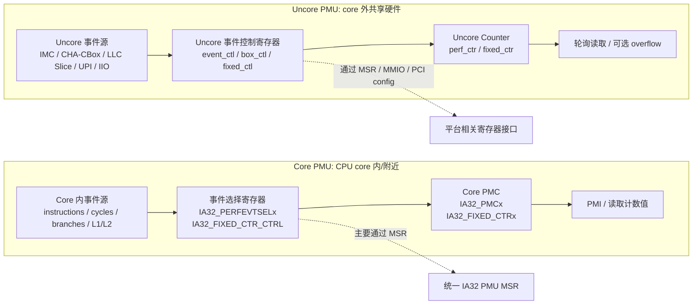

Core PMU 贴近 CPU core 本身，常见事件包括：

- retired instructions
- core cycles
- branch retired / branch misses
- L1/L2 cache 事件
- frontend/backend/retire 等流水线事件

Uncore PMU 贴近 CPU core 之外的共享硬件，常见事件包括：

- IMC，Integrated Memory Controller，内存控制器读写请求
- CBox/CHA，LLC slice、cache/home agent 相关事件
- UPI/QPI，socket 间互连
- IIO/PCIe，I/O 与 PCIe 相关事件
- power、M2M、M3UPI、CXL 相关 uncore 单元

perf 文档把这类 PMU 称为 **per-socket PMU**：它不属于某一个进程或某一个 core，而是统计 socket/package/die 级别的共享硬件资源。`tools/perf/Documentation/perf-list.txt` 中说明，这类事件通常不能 sampling，而是使用 `perf stat -a` 做全局计数；它可以绑定到某个 logical CPU，但测量范围是同 socket/package 的共享硬件。

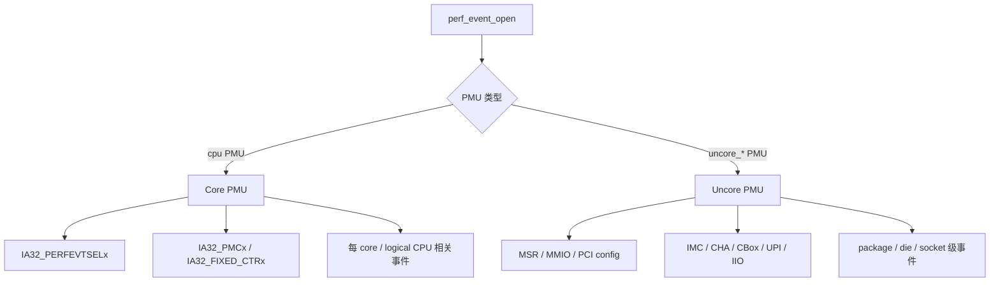

## Uncore PMU 的硬件接口

uncore PMU 没有像 core PMU 那样只有一组统一的 `IA32_FIXED_CTRx`。不同 CPU 家族、不同 uncore block、不同访问方式会使用不同寄存器空间。

Linux uncore 框架支持三类访问路径：

| 访问方式 | 典型硬件 | Linux 表达 |
|---|---|---|
| MSR | CBox/ARB/部分 client uncore | `uncore_msr_event_ctl()` / `uncore_msr_perf_ctr()` |
| MMIO | 部分 server IMC、M2M、UPI、IIO 等 | `uncore_mmio_read_counter()` |
| PCI config | IMC/IIO/部分 server uncore 设备 | `uncore_pci_event_ctl()` / `uncore_pci_perf_ctr()` |

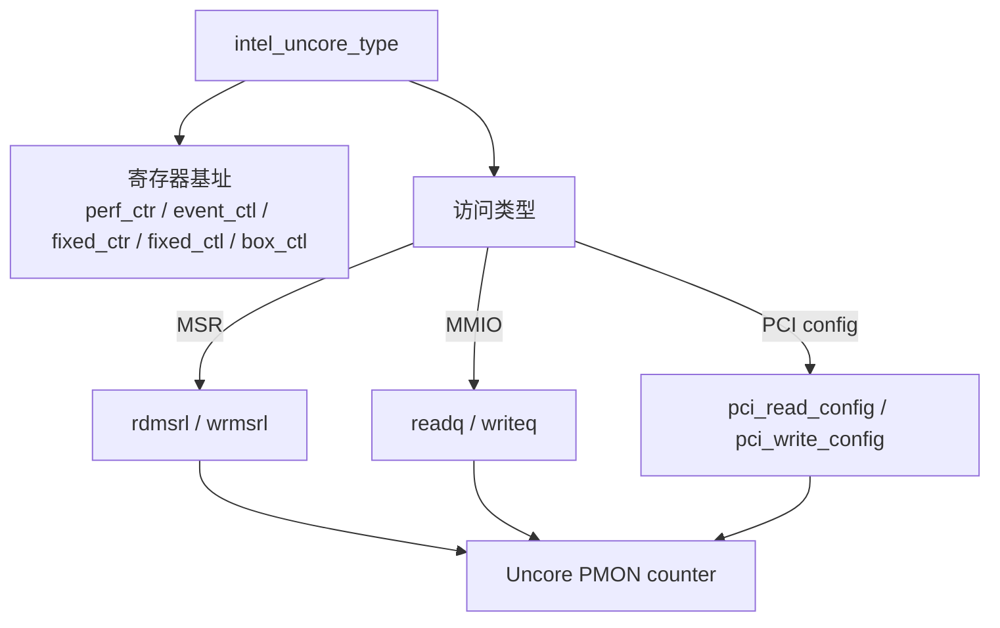

## Uncore 的核心数据结构

Intel uncore 框架用四个核心结构描述硬件和 perf 接口：

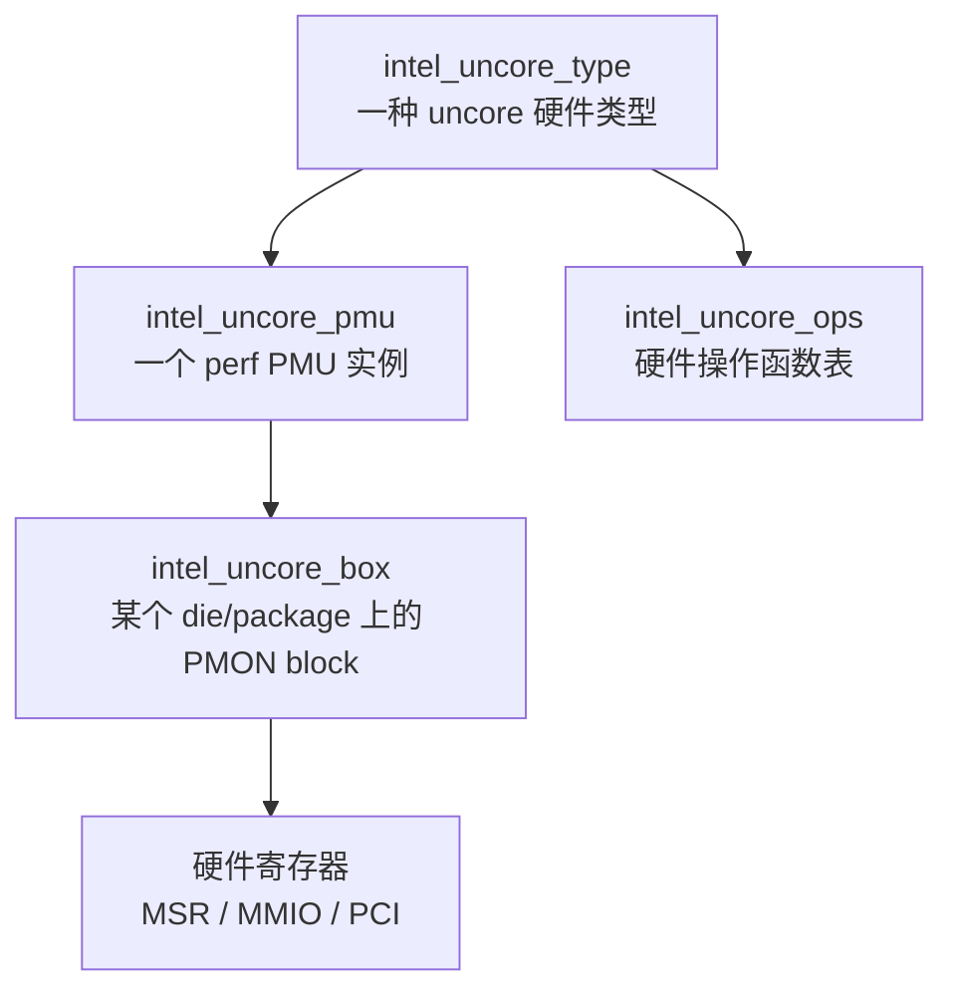

### `struct intel_uncore_type`

intel_uncore_pmu 是 面向 Linux perf 子系统的 PMU 抽象实例，负责把某个 uncore PMU 暴露成 perf 能识别、能注册、能创建 perf_event 的对象；

定义在 `arch/x86/events/intel/uncore.h`，表示一种 uncore 硬件类型。在该结构体中注册了不同类型的 uncore 以及其对应的硬件寄存器操作的地址。

```c
struct intel_uncore_type {
    const char *name; // uncore 类型名，比如 `cbox`、`arb`、`imc`、`cha`、`iio`。后续生成 sysfs PMU 名称时会用到它。
    int num_counters; // 每个 box 里有多少个可编程 counter。counter 调度时，`uncore_assign_events()` 会根据这个数量判断能否放下当前 event group。
    int num_boxes; // 这种 uncore 类型有多少个实例。例如多个 CBox/CHA、多个 IMC channel 或多个 IIO stack。
    int perf_ctr_bits; // counter 位宽。`uncore_perf_event_update()` 计算 delta 时会根据位宽处理 counter 回绕。
    int fixed_ctr_bits;
    unsigned perf_ctr;// 可编程 counter 的基址。MSR 型 PMU 中它是 MSR 基址，MMIO/PCI 型 PMU 中它通常是寄存器 offset。
    unsigned event_ctl;// event select/control 寄存器基址，用来写 event、umask、enable、edge、invert 等控制位。
    unsigned event_mask;// 允许写入 `hwc->config` 的事件配置位掩码，防止用户传入非法控制位。
    unsigned fixed_ctr; // fixed counter 及其控制寄存器。如果某类 uncore 没有 fixed counter，这些字段可以为空。
    unsigned fixed_ctl;
    unsigned box_ctl;// box/global 控制寄存器，用于启用、复位或控制整个 PMON block。
    union {//同一种 type 下不同 box 的地址偏移。比如 CBox0、CBox1、CBox2 共享同一套布局，但基址间隔不同。
        unsigned msr_offset;
        unsigned mmio_offset;
    };
    struct intel_uncore_pmu *pmus;// 由 `uncore_type_init()` 分配出来的 `intel_uncore_pmu` 数组。一个 type 可以展开成多个 perf PMU 实例。
    struct intel_uncore_ops *ops;// 该 type 对应的硬件操作函数表，决定最终通过 MSR、MMIO 还是 PCI config 访问寄存器。
    struct uncore_event_desc *event_descs;
};
```

某一种 intel_uncore_type 在当前实现里采用一种访问方式；如果它是 MSR 型，就用 msr_offset；如果它是 MMIO 型，就用 mmio_offset。同一个字段位置不会同时用两种含义，所以这里用 union 节省空间并表达“二选一”。

从生命周期看，平台初始化函数，例如 `snb_uncore_cpu_init()`、`skx_uncore_cpu_init()`、`spr_uncore_cpu_init()` 或 discovery 逻辑，会先把当前 CPU 支持的 uncore type 数组填到 `uncore_msr_uncores`、`uncore_pci_uncores`、`uncore_mmio_uncores`。随后 `uncore_types_init()` 遍历这些 type，调用 `uncore_type_init()`，根据 `type->num_boxes` 分配 `type->pmus`，并为每个 `pmu` 分配按 die 索引的 `boxes` 数组。因此，`intel_uncore_type` 决定的是“这个平台有哪些 uncore PMU 类型，以及每类 PMU 的寄存器、counter 和事件格式”。

以 Sandy Bridge CBox 为例通过 intel_uncore_type 看寄存器接口

`arch/x86/events/intel/uncore_snb.c` 中定义了一组 Sandy Bridge uncore MSR：

| 硬件含义 | Linux 宏 | 地址 |
|---|---|---:|
| SNB uncore global control | `SNB_UNC_PERF_GLOBAL_CTL` | `0x391` |
| SNB uncore fixed counter control | `SNB_UNC_FIXED_CTR_CTRL` | `0x394` |
| SNB uncore fixed counter | `SNB_UNC_FIXED_CTR` | `0x395` |
| CBox0 event select 0 | `SNB_UNC_CBO_0_PERFEVTSEL0` | `0x700` |
| CBox0 programmable counter 0 | `SNB_UNC_CBO_0_PER_CTR0` | `0x706` |
| CBox MSR offset | `SNB_UNC_CBO_MSR_OFFSET` | `0x10` |
| ARB programmable counter 0 | `SNB_UNC_ARB_PER_CTR0` | `0x3b0` |
| ARB event select 0 | `SNB_UNC_ARB_PERFEVTSEL0` | `0x3b2` |
| ARB MSR offset | `SNB_UNC_ARB_MSR_OFFSET` | `0x10` |

对应的 `intel_uncore_type`：

```c
static struct intel_uncore_type snb_uncore_cbox = {
    .name          = "cbox",
    .num_counters  = 2,
    .num_boxes     = 4,
    .perf_ctr_bits = 44,
    .fixed_ctr_bits = 48,
    .perf_ctr      = SNB_UNC_CBO_0_PER_CTR0,
    .event_ctl     = SNB_UNC_CBO_0_PERFEVTSEL0,
    .fixed_ctr     = SNB_UNC_FIXED_CTR,
    .fixed_ctl     = SNB_UNC_FIXED_CTR_CTRL,
    .single_fixed  = 1,
    .event_mask    = SNB_UNC_RAW_EVENT_MASK,
    .msr_offset    = SNB_UNC_CBO_MSR_OFFSET,
    .ops           = &snb_uncore_msr_ops,
};
```

这段代码告诉 uncore 框架：

- CBox 有 4 个 box
- 每个 box 有 2 个可编程 counter
- CBox0 的 counter0 是 `0x706`
- CBox1/CBox2/CBox3 通过 `msr_offset = 0x10` 推导
- CBox0 的 event select0 是 `0x700`
- 访问方式是 MSR

对于 CBox 第 `box_idx` 个 box、第 `counter_idx` 个 counter，大致地址计算为：

```text
event_ctl = SNB_UNC_CBO_0_PERFEVTSEL0 + box_idx * 0x10 + counter_idx
perf_ctr  = SNB_UNC_CBO_0_PER_CTR0    + box_idx * 0x10 + counter_idx
```

实际源码中由 `uncore_msr_event_ctl()` 和 `uncore_msr_perf_ctr()` 计算。


### `struct intel_uncore_pmu`

intel_uncore_type 是 面向硬件描述的模板，负责描述某一类 uncore PMU 硬件的寄存器布局、counter 数量、事件格式、访问方式和平台操作函数。

```c
struct intel_uncore_pmu {
    struct pmu pmu;
    char name[UNCORE_PMU_NAME_LEN];
    int pmu_idx;
    int func_id;
    bool registered;
    atomic_t activeboxes;
    struct intel_uncore_type *type;
    struct intel_uncore_box **boxes;
};
```

关键字段可以这样理解：

- `pmu`：嵌入的通用 perf PMU 对象。`uncore_pmu_register()` 会把 `event_init`、`add`、`del`、`start`、`stop`、`read` 等回调填入这个对象，然后调用 `perf_pmu_register()` 注册给 perf core。
- `name`：注册到 perf core 和 sysfs 的 PMU 名字。`uncore_get_pmu_name()` 会根据 `type->name`、`type->num_boxes`、`pmu_idx` 生成类似 `uncore_cbox_0`、`uncore_imc_0` 的名字。
- `pmu_idx`：同一种 uncore type 下的实例编号。比如多个 CBox/CHA 或多个 IMC 实例时，`pmu_idx` 用来区分第几个 PMU，也会参与寄存器 offset 计算。
- `func_id`：PCI 或 discovery 场景中用于识别具体设备/功能实例。对于还没有绑定真实设备的 PCI PMU，可能先是 `-1`；`uncore_pmu_event_init()` 会用它判断该 PMU 是否有真实设备。
- `registered`：表示这个 PMU 是否已经通过 `perf_pmu_register()` 注册成功。
- `activeboxes`：记录当前活跃 box 数量，用于 box 生命周期管理。
- `type`：反向指向 `intel_uncore_type`，因此 PMU 可以拿到寄存器基址、counter 数量、ops、event 描述等模板信息。
- `boxes`：按 logical die id 索引的 `intel_uncore_box *` 数组。`pmu->boxes[die]` 才是真正对应某个 die/package 上硬件 PMON block 的运行时对象。

源码链路是：`uncore_type_init()` 为每个 type 分配 `pmus[i]`，设置 `pmus[i].pmu_idx = i`、`pmus[i].type = type`、`pmus[i].boxes = kzalloc(...)`；随后 `uncore_pmu_register()` 填充 `pmu->pmu` 回调并调用 `perf_pmu_register(&pmu->pmu, pmu->name, -1)`。

注册之后，用户可以在 sysfs 中看到类似：

```text
/sys/bus/event_source/devices/uncore_imc_0/
/sys/bus/event_source/devices/uncore_cha_2/
/sys/bus/event_source/devices/uncore_iio_0/
```

### `struct intel_uncore_box`

intel_uncore_box 可以理解为 某个实际 uncore PMU 硬件实例在 Linux 内核中的运行时对象。

```c
struct intel_uncore_box {
    int dieid;
    int n_active;
    int n_events;
    int cpu;
    struct perf_event *events[UNCORE_PMC_IDX_MAX];
    struct perf_event *event_list[UNCORE_PMC_IDX_MAX];
    struct pci_dev *pci_dev;
    struct intel_uncore_pmu *pmu;
    struct hrtimer hrtimer;
    void __iomem *io_addr;
    struct intel_uncore_extra_reg shared_regs[];
};
```

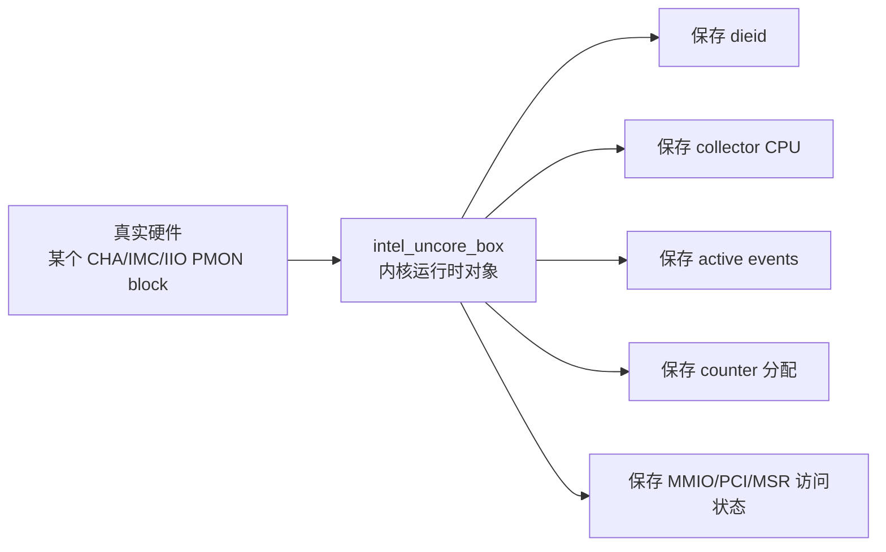

关键字段可以这样理解：

- `dieid`：这个 box 所在的 logical die id。`uncore_pmu_to_box()` 会通过 `topology_logical_die_id(cpu)` 找到 `pmu->boxes[dieid]`。
- `cpu`：collector CPU。它不是说 uncore 硬件属于这个 CPU，而是 Linux 选择这个 online CPU 代表该 die/package 执行 perf 回调、hrtimer 轮询和寄存器读取。
- `n_active`：当前已经启动并处于 active 状态的事件数量。`uncore_pmu_event_start()` 增加它，`uncore_pmu_event_stop()` 减少它，并据此启动或停止 hrtimer。
- `n_events`：当前被调度到这个 box 的 event 数量，用于 counter 重新分配和 group 调度。
- `events[]`：按硬件 counter index 保存正在使用该 counter 的 `perf_event`。例如 `events[0]` 表示当前占用 counter0 的 event。
- `event_list[]`：参与调度的 event 列表。`uncore_collect_events()`、`uncore_assign_events()` 会基于它进行 counter 分配。
- `event_constraint[]`：每个 event 对应的 counter 约束。某些 uncore 事件只能放到特定 counter 上。
- `active_mask`：哪些硬件 counter 当前处于 active 状态。
- `tags[]`：用于判断 event 是否仍然绑定在原来的 counter 上，避免 counter 被重新分配后状态混淆。
- `pci_dev`：PCI config 访问型 uncore PMU 的 PCI 设备指针。
- `io_addr`：MMIO 访问型 uncore PMU 的映射地址。`uncore_mmio_read_counter()` 会从 `box->io_addr + event->hw.event_base` 读取计数器。
- `pmu`：反向指向所属 `intel_uncore_pmu`，从而能继续找到 `type` 和 `ops`。
- `hrtimer` / `hrtimer_duration`：用于周期性读取 counter，避免 uncore counter 溢出后丢计数。部分 uncore 平台没有可靠 overflow interrupt，因此 hrtimer 是重要机制。
- `shared_regs[]`：一些 uncore 事件需要共享额外寄存器，多个 event 可能引用同一个 shared register，因此这里带 lock、config 和 refcount。

`box` 的创建和挂载发生在 CPU hotplug 路径中。`allocate_boxes()` 为某个 die 分配 box，设置 `box->pmu = pmu`、`box->dieid = die`，然后安装到 `box->pmu->boxes[die]`。`uncore_event_cpu_online()` 选择该 die/package 的 collector CPU 后，`uncore_change_type_ctx()` 会执行 `box->cpu = new_cpu`。当用户创建 uncore event 时，`uncore_pmu_event_init()` 通过用户指定的 CPU 找到相同 die 上的 box，然后把 `event->cpu = box->cpu`、`event->pmu_private = box`。后续 `add/start/read/stop` 都通过 `event->pmu_private` 找回这个 box。

因此，`box` 是 uncore PMU 运行态的中心：它保存“这个 die 上有哪些事件、分配到哪些 counter、由哪个 CPU 负责读取、具体通过 PCI/MMIO/MSR 访问哪个硬件实例”。

### `struct intel_uncore_ops`

```c
struct intel_uncore_ops {
    void (*init_box)(struct intel_uncore_box *);
    void (*exit_box)(struct intel_uncore_box *);
    void (*disable_box)(struct intel_uncore_box *);
    void (*enable_box)(struct intel_uncore_box *);
    void (*disable_event)(struct intel_uncore_box *, struct perf_event *);
    void (*enable_event)(struct intel_uncore_box *, struct perf_event *);
    u64 (*read_counter)(struct intel_uncore_box *, struct perf_event *);
    int (*hw_config)(struct intel_uncore_box *, struct perf_event *);
};
```

不同平台把不同的硬件访问逻辑挂到 `ops` 上。通用 uncore 框架只管 perf 生命周期，具体怎么写寄存器由平台 ops 决定。

这些回调可以按职责分成四类：

- **box 生命周期**：`init_box()` / `exit_box()`。当某个 die/package 第一次引用 box 时，`uncore_box_init()` 会调用 `type->ops->init_box(box)`；最后释放时调用 `exit_box()`。PCI 型 PMU 可能在这里保存 `pci_dev`，MMIO 型 PMU 可能在这里 ioremap 寄存器区域。
- **整个 PMON block 控制**：`enable_box()` / `disable_box()`。`uncore_pmu_enable()` 和 `uncore_pmu_disable()` 会找到当前 CPU 对应的 box，再调用这两个回调启停整个 uncore box。
- **单个 event 控制**：`enable_event()` / `disable_event()`。`uncore_pmu_event_start()` 中会调用 `uncore_enable_event(box, event)`，最终进入平台 ops，把 `event->hw.config` 写到 event control 寄存器，或者设置 enable 位。
- **读数与编码**：`read_counter()` / `hw_config()`。`read_counter()` 屏蔽 MSR/MMIO/PCI 差异，MSR 型可能 `rdmsrl(event->hw.event_base, count)`，MMIO 型可能 `readq(box->io_addr + event->hw.event_base)`；`hw_config()` 用于平台特有的事件编码校验和 extra register 配置。

还有两个 constraint 回调：

- `get_constraint()`：根据事件配置返回可用 counter mask。
- `put_constraint()`：event 删除时释放对应约束或 shared register 引用。

所以 `intel_uncore_ops` 的作用是把“通用 perf 生命周期”翻译成“具体平台的寄存器操作”。同样是 `uncore_pmu_event_start()`，对 MSR uncore 来说可能是写 MSR，对 MMIO uncore 来说可能是写 MMIO，对 PCI uncore 来说则可能是写 PCI config space。

四个结构体的关系可以总结为：

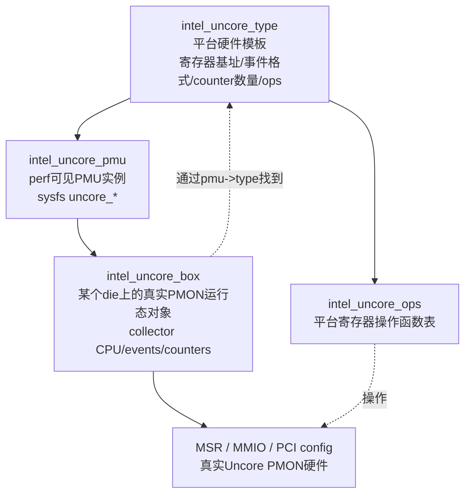

## Uncore PMU 初始化流程

入口函数是 `intel_uncore_init()`：

```text
module_init(intel_uncore_init)
```

源码位置：`arch/x86/events/intel/uncore.c`

初始化主流程：

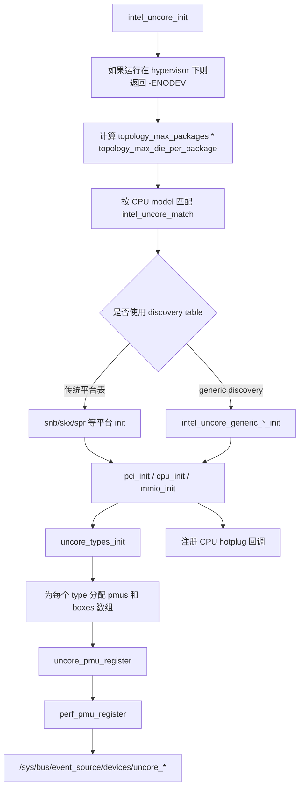

```text
module_init(intel_uncore_init)          [uncore.c:1939]
    │
    └─ intel_uncore_init()              [uncore.c:1874]
        │
        ├─ 1. 检查虚拟化环境
        │   if (boot_cpu_has(X86_FEATURE_HYPERVISOR))
        │       return -ENODEV
        │
        ├─ 2. 获取最大Die数量
        │   __uncore_max_dies = topology_max_packages() * topology_max_die_per_package()
        │
        ├─ 3. CPU型号匹配，获取初始化函数表
        │   id = x86_match_cpu(intel_uncore_match)
        │   uncore_init = id->driver_data
        │   │
        │   └─ 支持的型号初始化表:
        │       ├─ nhm_uncore_init       (Nehalem)
        │       ├─ snb_uncore_init       (Sandy Bridge)
        │       ├─ ivb_uncore_init       (Ivy Bridge)
        │       ├─ hsw_uncore_init       (Haswell)
        │       ├─ bdw_uncore_init       (Broadwell)
        │       ├─ skl_uncore_init       (Skylake)
        │       ├─ skx_uncore_init       (Skylake Server)
        │       ├─ icl_uncore_init       (Ice Lake)
        │       ├─ tgl_uncore_init       (Tiger Lake)
        │       ├─ adl_uncore_init       (Alder Lake)
        │       ├─ spr_uncore_init       (Sapphire Rapids)
        │       └─ generic_uncore_init   (Discovery tables通用)
        │
        ├─ 4. PCI类型Uncore初始化 (如果存在)
        │   if (uncore_init->pci_init):
        │       uncore_init->pci_init()  # 型号特定初始化
        │       │
        │       └─ uncore_pci_init()     [uncore.c:1398]
        │           │
        │           ├─ 分配PCI额外设备数组
        │           │   uncore_extra_pci_dev = kzalloc()
        │           │
        │           ├─ 初始化PCI类型
        │           │   uncore_types_init(uncore_pci_uncores, false)
        │           │   │
        │           │   └─ for each type:
        │           │       uncore_type_init(type, false)
        │           │       │   [uncore.c:986]
        │           │       │
        │           │       ├─ 分配PMU数组
        │           │       │   pmus = kcalloc(type->num_boxes, sizeof(*pmus))
        │           │       │   # 每个类型可能有多个box
        │           │       │   # 例如: multiple memory controllers
        │           │       │
        │           │       ├─ 为每个PMU分配box数组
        │           │       │   for i in 0..num_boxes:
        │           │       │       pmus[i].boxes = kzalloc(die * sizeof(box*))
        │           │       │       # 每个die一个box
        │           │       │
        │           │       ├─ 设置无约束事件
        │           │       │   type->unconstrainted = EVENT_CONSTRAINT(...)
        │           │       │
        │           │       ├─ 创建事件属性组
        │           │       │   if (type->event_descs):
        │           │       │       创建 "events" sysfs属性
        │           │       │
        │           │       └─ 设置拓扑映射
        │           │           if (type->set_mapping):
        │           │               type->set_mapping(type)
        │           │               # 将PMON block映射到具体组件
        │           │
        │           ├─ 注册PCI驱动
        │           │   pci_register_driver(uncore_pci_driver)
        │           │   │
        │           │   └─ PCI设备探测
        │           │       uncore_pci_probe(pdev)
        │           │       │
        │           │       ├─ 找到对应的PMU
        │           │       │   pmu = uncore_pci_find_dev_pmu(pdev)
        │           │       │
        │           │       ├─ 创建并初始化box
        │           │       │   box = uncore_pci_box_init(pmu, pdev, die)
        │           │       │   │
        │           │       │   ├─ iomap pci资源
        │           │       │   │   pci_iomap(pdev, bar, 0)
        │           │       │   │
        │           │       │   ├─ 初始化box
        │           │       │   │   if (type->ops->init_box):
        │           │       │   │       type->ops->init_box(box)
        │           │       │   │
        │           │       │   ├─ 禁用所有计数器
        │           │       │   │   if (type->ops->disable_box):
        │           │       │   │       type->ops->disable_box(box)
        │           │       │   │
        │           │       │   └─ 保存box到pmu
        │           │       │       pmu->boxes[die] = box
        │           │       │
        │           │       └─ 注册PMU
        │           │           uncore_pmu_register(pmu)
        │           │           │   [uncore.c:905]
        │           │           │
        │           │           ├─ 设置PMU操作函数
        │           │           │   pmu->pmu = (struct pmu) {
        │           │           │       .attr_groups    = type->attr_groups,
        │           │           │       .pmu_enable     = uncore_pmu_enable,
        │           │           │       .pmu_disable    = uncore_pmu_disable,
        │           │           │       .event_init     = uncore_pmu_event_init,
        │           │           │       .add            = uncore_pmu_event_add,
        │           │           │       .del            = uncore_pmu_event_del,
        │           │           │       .start          = uncore_pmu_event_start,
        │           │           │       .stop           = uncore_pmu_event_stop,
        │           │           │       .read           = uncore_pmu_event_read,
        │           │           │       .capabilities   = PERF_PMU_CAP_NO_EXCLUDE,
        │           │           │   }
        │           │           │
        │           │           ├─ 获取PMU名称
        │           │           │   uncore_get_pmu_name(pmu)
        │           │           │   # 例如: "uncore_imc_0", "uncore_cha_2"
        │           │           │
        │           │           └─ 注册到perf子系统
        │           │               perf_pmu_register(&pmu->pmu, pmu->name, -1)
        │           │               # 在/sys/devices/创建目录
        │           │
        │           └─ 没有驱动时直接注册
        │               uncore_pci_pmus_register()
        │
        ├─ 5. CPU类型(MSR) Uncore初始化 (如果存在)
        │   if (uncore_init->cpu_init):
        │       uncore_init->cpu_init()  # 型号特定初始化
        │       │
        │       └─ uncore_cpu_init()     [uncore.c:1655]
        │           │
        │           ├─ 初始化MSR类型
        │           │   uncore_types_init(uncore_msr_uncores, true)
        │           │   │
        │           │   └─ for each type in uncore_msr_uncores:
        │           │       uncore_type_init(type, true)
        │           │       # 与PCI类似，但setid=true
        │           │
        │           └─ 注册MSR PMU
        │               uncore_msr_pmus_register()
        │               │   [uncore.c:1642]
        │               │
        │               └─ for each type:
        │                   type_pmu_register(type)
        │                   │   [uncore.c:1630]
        │                   │
        │                   └─ for each box in type:
        │                       uncore_pmu_register(&type->pmus[i])
        │                       # 与PCI相同的注册流程
        │
        ├─ 6. MMIO类型Uncore初始化 (新架构使用，如Tiger Lake+)
        │   if (uncore_init->mmio_init):
        │       uncore_init->mmio_init()
        │       │
        │       └─ uncore_mmio_init()    [uncore.c:1673]
        │           │
        │           ├─ 初始化MMIO类型
        │           │   uncore_types_init(uncore_mmio_uncores, true)
        │           │
        │           └─ 注册MMIO PMU
        │               for each type:
        │                   type_pmu_register(type)
        │
        └─ 7. 注册CPU热插拔回调
            cpuhp_setup_state(CPUHP_AP_PERF_X86_UNCORE_ONLINE,
                              "perf/x86/intel/uncore:online",
                              uncore_event_cpu_online,
                              uncore_event_cpu_offline)
            │
            ├─ CPU上线时
            │   uncore_event_cpu_online(cpu)
            │   │
            │   └─ 为新CPU分配box并设置监控CPU
            │       uncore_box_init(box, cpu)
            │
            └─ CPU下线时
                uncore_event_cpu_offline(cpu)
                │
                └─ 迁移box到其他CPU
                    perf_pmu_migrate_context()

```

## Uncore 寄存器地址计算接口

Intel CPU 的 Uncore 性能监控单元（PMU）位于CPU核心之外，通过不同的访向方式（MSR/PCI / MMIO） 寄存器。uncore 框架通过一组 inline 数计算寄存地址 （offset 成MSR编号），井由底层 ops 负资真正的写（MSR/PCI/MMIO）。

* 不同类型的 uncore 资源访问方式不同：
    * PCI uncore → 通过 PCI 配置空间读写寄存器
    * MSR uncore → 通过 CPU MSR（Model-Specific Register）访问
    * MMIO uncore → 通过内存映射 I/O 地址访问

* 为了方便统一管理，Linux 内核提供 inline 函数接口 来计算寄存器地址，隐藏不同类型访问差异。

### PCI uncore

```c
static inline unsigned uncore_pci_event_ctl(struct intel_uncore_box *box, int idx)
{
    if (test_bit(UNCORE_BOX_FLAG_CTL_OFFS8, &box->flags))
        return idx * 8 + box->pmu->type->event_ctl;

    return idx * 4 + box->pmu->type->event_ctl;
}

static inline unsigned uncore_pci_perf_ctr(struct intel_uncore_box *box, int idx)
{
    return idx * 8 + box->pmu->type->perf_ctr;
}
```

PCI 类型的 uncore event control 和 counter 是 PCI 配置空间偏移。`idx` 是 counter 编号。

### MSR uncore

```c
static inline unsigned uncore_msr_box_offset(struct intel_uncore_box *box)
{
    struct intel_uncore_pmu *pmu = box->pmu;

    return pmu->type->msr_offsets ?
        pmu->type->msr_offsets[pmu->pmu_idx] :
        pmu->type->msr_offset * pmu->pmu_idx;
}

static inline unsigned uncore_msr_event_ctl(struct intel_uncore_box *box, int idx)
{
    return box->pmu->type->event_ctl +
           (box->pmu->type->pair_ctr_ctl ? 2 * idx : idx) +
           uncore_msr_box_offset(box);
}

static inline unsigned uncore_msr_perf_ctr(struct intel_uncore_box *box, int idx)
{
    return box->pmu->type->perf_ctr +
           (box->pmu->type->pair_ctr_ctl ? 2 * idx : idx) +
           uncore_msr_box_offset(box);
}
```

MSR 类型 uncore 的地址由三部分组成：

```text
寄存器地址 = type 基址 + counter 偏移 + box 偏移
```

这里的 `pmu_idx` 通常对应同类型 uncore box 的编号。例如 CBox0、CBox1、CBox2。

### MMIO uncore

```c
unsigned int uncore_mmio_box_ctl(struct intel_uncore_box *box)
{
    return box->pmu->type->box_ctl +
           box->pmu->type->mmio_offset * box->pmu->pmu_idx;
}
```

MMIO 类型 uncore 会在 `box->io_addr` 上加 offset：

```c
readq(box->io_addr + event->hw.event_base);
```

也就是说，`event->hw.event_base` 在 MMIO 模式下不是 MSR 编号，而是 MMIO 区域内的寄存器偏移。

### 统一选择接口

uncore 框架通过下面两个函数隐藏 MSR/PCI/MMIO 差异：

```c
static inline unsigned uncore_event_ctl(struct intel_uncore_box *box, int idx)
{
    if (box->pci_dev || box->io_addr)
        return uncore_pci_event_ctl(box, idx);
    else
        return uncore_msr_event_ctl(box, idx);
}

static inline unsigned uncore_perf_ctr(struct intel_uncore_box *box, int idx)
{
    if (box->pci_dev || box->io_addr)
        return uncore_pci_perf_ctr(box, idx);
    else
        return uncore_msr_perf_ctr(box, idx);
}
```

注意：这里 `box->io_addr` 的情况下仍复用 `uncore_pci_event_ctl()` / `uncore_pci_perf_ctr()` 计算 offset，这是因为它们本质上是在计算 register offset；真正读写时由 ops 决定走 PCI 还是 MMIO。

## Intel x86 Uncore PMU 计数流程

结合硬件视角，Intel x86 uncore PMU 的一次计数过程可以分成五步：

1. **选择事件并编码**：用户或内核选择一个 uncore 事件，例如 IMC 的 `CAS Read`、`CAS Write`，CHA/CBox 的 LLC miss、snoop、eviction，或者 IIO/UPI 相关事件。这个事件最终会被编码到 `perf_event_attr.config`，也就是 event id、umask、edge、invert、threshold 等字段。
2. **配置 Uncore PMU**：Linux perf core 调用 Intel uncore PMU 驱动的 `event_init()`、`add()`、`start()`。驱动根据 `intel_uncore_type` 和 `intel_uncore_box` 找到对应硬件 PMON block，把事件配置写入 event control 寄存器，把 counter 初值或 prev_count 准备好。
3. **事件发生并由硬件计数**：工作负载运行时，内存控制器、CHA/CBox、UPI/IIO 等 uncore 硬件模块看到对应事件，就让选中的 counter 增加。这个计数发生在硬件中，不需要每个事件都陷入内核。
4. **读取计数值**：perf read 或 hrtimer 轮询时，驱动读取 counter 寄存器。MSR 型 uncore 通过 `rdmsrl()`，MMIO 型 uncore 通过 `readq()`，PCI 型 uncore 通过 PCI config 访问。
5. **累加计算得到结果**：驱动用当前硬件 counter 值减去上一次保存的 `prev_count`，处理 counter 位宽导致的回绕，然后把 delta 累加到 `event->count`。用户最终从 `perf stat` 或 `read(fd)` 看到结果。

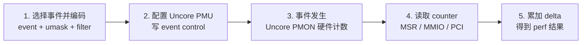

### 硬件侧：事件源、控制寄存器和 counter

图中上半部分的硬件区域可以理解为一个 uncore PMON block。它通常包含：

- **事件源**：IMC、Home Agent/CHA、CBox/LLC Slice、IIO、UPI 等共享硬件模块。
- **事件控制寄存器**：选择事件、umask、edge detect、invert、enable 等控制位。
- **计数器寄存器**：保存当前计数值，常见位宽不是固定 64 bit，例如 SNB CBox 是 44 bit，fixed counter 可能是 48 bit。
- **box/global 控制寄存器**：启用整个 PMON block 或做 reset。
- **可选 overflow 逻辑**：某些平台支持或部分支持 overflow，中断机制并不像 core PMU 那样统一可靠。

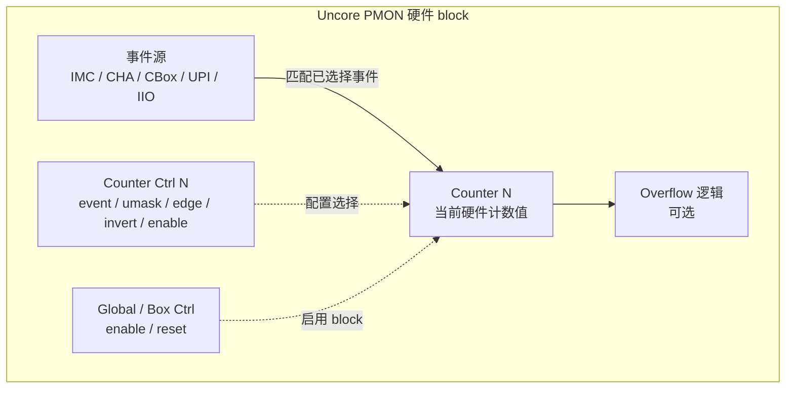

以 Sandy Bridge CBox 为例，源码给出了比较接近图中“示例寄存器”的 MSR：

| 功能 | Sandy Bridge 宏 | 地址 |
|---|---|---:|
| Global control | `SNB_UNC_PERF_GLOBAL_CTL` | `0x391` |
| Fixed counter control | `SNB_UNC_FIXED_CTR_CTRL` | `0x394` |
| Fixed counter | `SNB_UNC_FIXED_CTR` | `0x395` |
| CBox0 counter control 0 | `SNB_UNC_CBO_0_PERFEVTSEL0` | `0x700` |
| CBox0 counter 0 | `SNB_UNC_CBO_0_PER_CTR0` | `0x706` |

如果是图里类似 “Counter Ctrl 0..N” 和 “Counter 0..N” 的关系，在 Linux 源码中通常由 `intel_uncore_type` 的 `event_ctl` 和 `perf_ctr` 两个字段描述：

```c
.perf_ctr  = SNB_UNC_CBO_0_PER_CTR0,
.event_ctl = SNB_UNC_CBO_0_PERFEVTSEL0,
.msr_offset = SNB_UNC_CBO_MSR_OFFSET,
```

然后由 `uncore_msr_event_ctl()` / `uncore_msr_perf_ctr()` 计算具体 box 和 counter 的寄存器地址。

### 软件侧：从 perf 到寄存器读写

图中下半部分的软件流程可以映射到 Linux perf 和 Intel uncore 驱动：

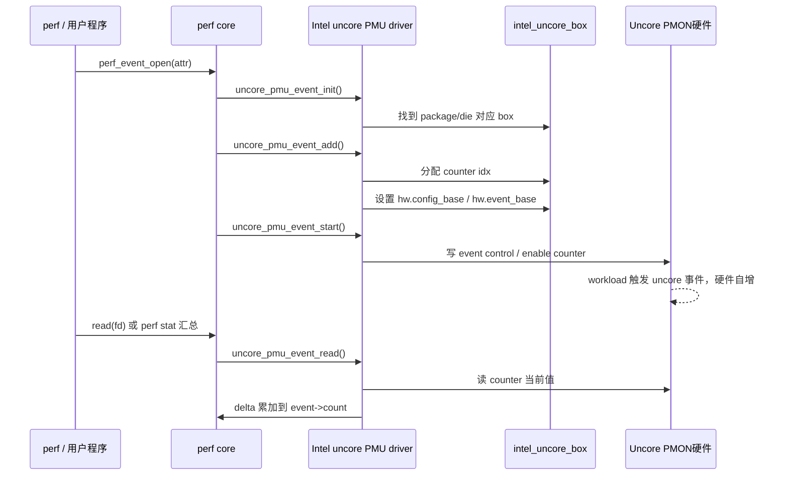

对应源码函数如下：

| 图中步骤 | Linux 6.6 函数 | 作用 |
|---|---|---|
| 选择事件 | `perf_event_open()` / `perf_event_attr.config` | 把 event/umask 等编码传给内核 |
| 配置 PMU | `uncore_pmu_event_init()` | 校验 PMU type、禁止 sampling、找到 `box` |
| 分配 counter | `uncore_pmu_event_add()` | 调度 event 到具体 counter |
| 设置寄存器地址 | `uncore_assign_hw_event()` | 设置 `hw.config_base` / `hw.event_base` |
| 启动计数 | `uncore_pmu_event_start()` | 记录 `prev_count`，调用 `uncore_enable_event()` |
| 读取计数 | `uncore_pmu_event_read()` | 调用 `uncore_perf_event_update()` |
| 计算结果 | `uncore_perf_event_update()` | 处理 counter 回绕并累加 delta |

### uncore PMU 事件生命周期

当用户执行：

```bash
perf stat -a -e uncore_imc_0/cas_count_read/ sleep 1
```

大体调用链是：

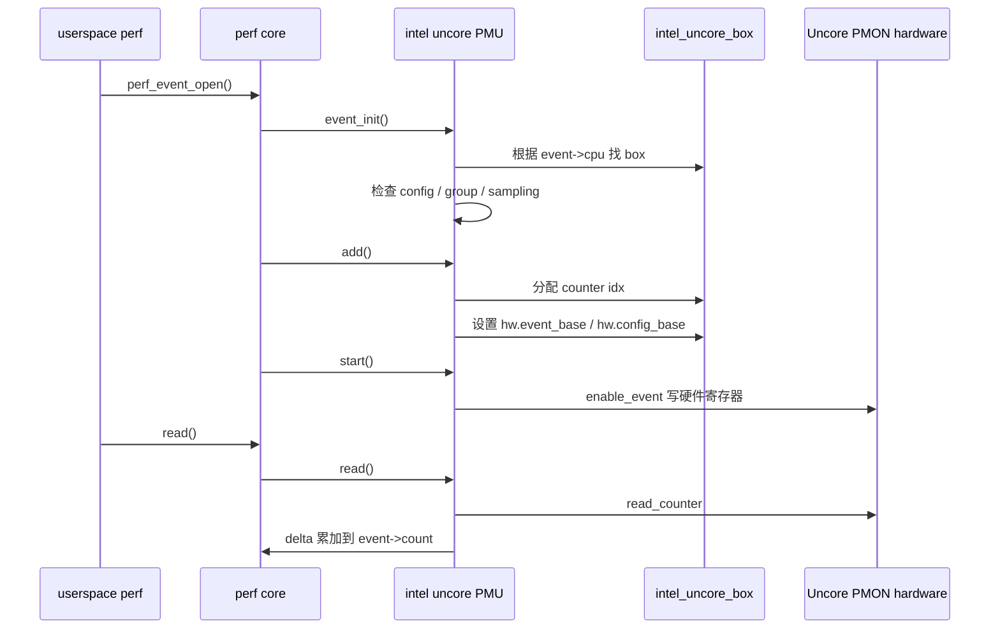

## 为什么 Uncore PMU 通常不支持 sampling

`uncore_pmu_event_init()` 中有明确限制：

```c
/* Sampling not supported yet */
if (hwc->sample_period)
    return -EINVAL;
```

原因不是 perf 做不到 sampling，而是 uncore 事件缺少清晰的执行上下文归属。比如 IMC 看到一次内存读，不能天然知道它属于哪个用户进程、哪个 guest、哪个线程；IIO/PCIe/UPI 流量也类似。因此 uncore PMU 更适合 `perf stat` 这类全局计数，而不是 `perf record` 这类带 IP/task attribution 的采样。

## hrtimer 轮询与 overflow

core PMU 通常可以通过 PMI 处理 overflow。Intel uncore 驱动中，部分平台 overflow interrupt 不可用或不可靠，所以通用框架用 hrtimer 周期性读取 counter。

源码注释说明：

```c
/*
 * The overflow interrupt is unavailable for SandyBridge-EP, is broken
 * for SandyBridge. So we use hrtimer to periodically poll the counter
 * to avoid overflow.
 */
```

轮询路径：

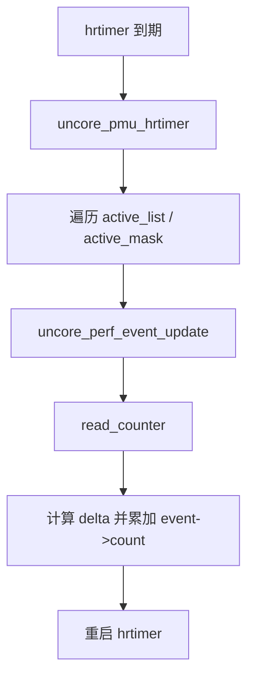

## CPU hotplug：为什么需要 collector CPU

uncore PMU 是 package/die 级硬件，但 perf 的 PMU 回调仍要在某个 CPU 上执行。所以 Linux 为每个 die/package 选一个在线 CPU 作为 collector。

online 时：

- `uncore_event_cpu_online()`
- `uncore_box_ref()`
- `allocate_boxes()`
- 如果该 die/package 还没有 collector，就把当前 CPU 放进 `uncore_cpu_mask`

offline 时：

- `uncore_event_cpu_offline()`
- 如果下线的是 collector CPU，找同 die/package 的另一个 CPU
- 调用 `perf_pmu_migrate_context()` 迁移 perf context

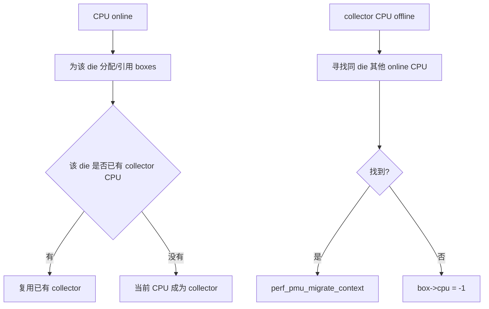

## Intel 新平台的 discovery table

老平台主要靠 `uncore_snb.c`、`uncore_snbep.c` 这类平台表硬编码寄存器布局。较新平台支持 uncore discovery table，Linux 可以从 discovery 信息生成 `intel_uncore_type`。

在 Intel x86 uncore PMU 框架中，Discovery 表（Discovery Table）是内核用来 描述和识别处理器 uncore 资源（boxes）和支持事件的表格数据结构。它的作用是让驱动或 PMU 框架 动态发现 CPU 上可用的 uncore 实例和计数器能力。

**Discovery 表的作用**：

1. 发现可用的 uncore box
    * 不同 CPU 架构支持的 uncore 组件不同（如 CBox、CHA、IMC、IIO 等）。
    * Discovery 表记录了 每种类型 uncore 的数量、编号和偏移信息。
2. 描述每个 box 的 PMU 能力
    * 包括：
        * 支持的事件数（event count）
        * 支持的性能计数器数（perf counter count）
        * 控制寄存器偏移（control register offset）
        * Counter 与 event 对应关系（pairing）
3. 为驱动提供初始化信息
    * 当内核初始化 uncore PMU 时，通过 Discovery 表生成 intel_uncore_pmu 和 intel_uncore_box 实例。
    * 驱动不需要硬编码每个 box 的数量或地址偏移，可以通过 Discovery 表统一初始化。

**典型结构**：

在内核源代码中，Discovery 表通常包含如下字段（简化表示）：

|字段	|作用|
|box_type	|uncore box 类型，例如 CBox、CHA、IMC、IIO 等|
|num_boxes	|当前 CPU 上该类型 box 的数量|
|event_ctl_base	|控制寄存器 type 基址|
|perf_ctr_base	|perf counter 基址|
|msr_offset / msr_offsets[]	|MSR 偏移（不同 box）|
|pair_ctr_ctl	|是否按对计数|
|flags	|该 box 特性标志，例如偏移宽度、支持事件类型|

3. 使用流程

1. CPU 启动或驱动加载时：
    * 内核扫描 CPUID 或 platform-specific 描述信息。
    * 填充 Discovery 表，列出每种 box 的实例数量和能力。
2. 驱动初始化 PMU：
    * 遍历 Discovery 表，为每个 box 创建 intel_uncore_box 对象。
    * 根据 type 和 pmu_idx 计算寄存器地址。
    * 注册事件和计数器供 perf 框架访问。
3. 事件访问：
    * 上层通过 uncore_event_ctl() / uncore_perf_ctr() 访问计数器。
    * 具体地址和偏移由 Discovery 表定义的基址和偏移计算。


4. 总结

* Discovery 表本质：CPU uncore 硬件能力的描述表。
* 作用：
    1. 描述每种 uncore box 的数量和类型
    2. 描述每个 box 支持的寄存器和计数器
    3. 为内核 PMU 框架动态初始化提供依据
* 好处：
    * 支持多代 CPU 架构差异
    * 避免硬编码 box 数量和寄存器偏移
    * 统一 PMU 初始化流程


