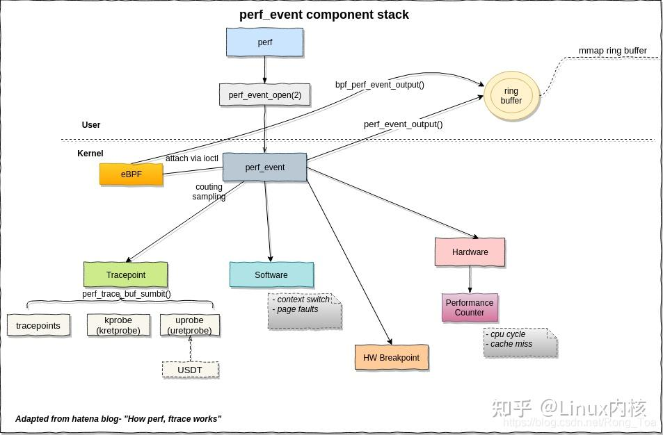
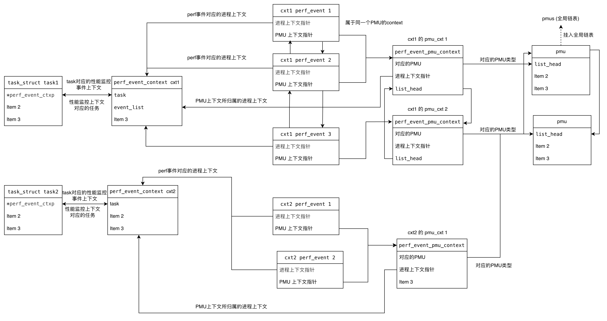
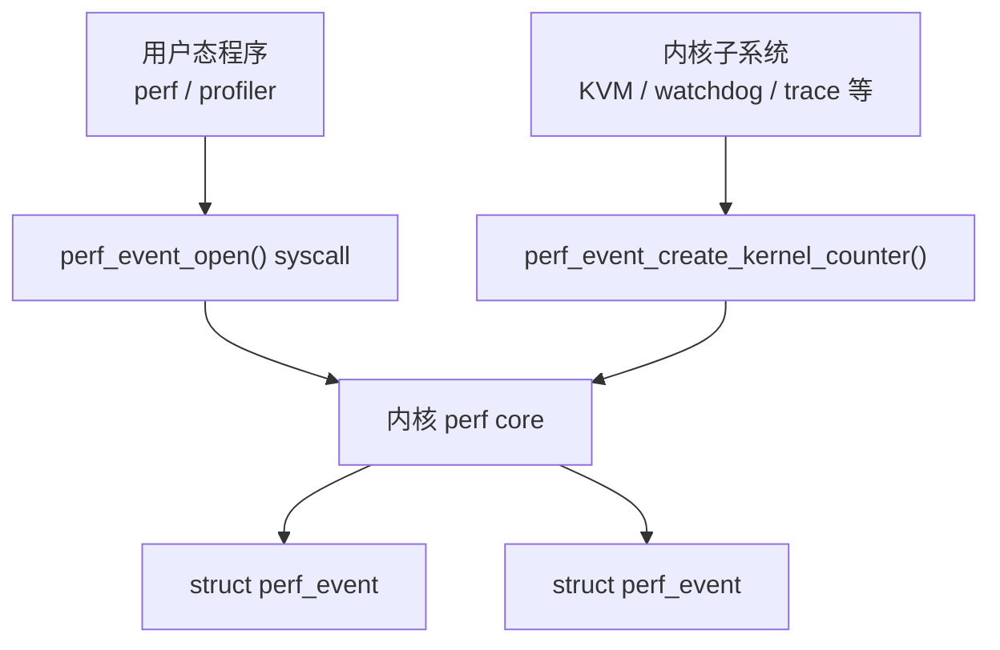

## perf_event 子系统的作用

perf_event 子系统是 Linux 内核提供的**统一性能监控框架**，其主要作用包括：

1. **性能计数**：统计 CPU 硬件事件（如指令执行数、缓存未命中）和软件事件（如上下文切换次数、页面错误）
2. **性能采样**：按指定频率采样，收集程序运行时的调用栈、指令指针等信息
3. **动态追踪**：通过 tracepoint、kprobe、uprobe 追踪内核和用户空间函数的执行
4. **性能分析**：为 `perf` 等性能分析工具提供数据支持，帮助开发者定位性能瓶颈

## 总体架构

perf_event 采用**统一接口抽象设计**，核心思想是通过 `struct pmu` 接口屏蔽不同事件源的差异。

### 架构图



从图中可以看到在用户态可以使用 perf 程序，通过 ring buffer 与内核的perf_event进行交互，这里的 perf_event 就是刚才所说的对于底层事件不同性能监控来源的一种高层屏蔽。

在 perf_event 之下，有各种不同的 PMU 来源。

### PMU 分类与事件来源

| PMU 类型 | 事件来源 | 对应 perf_type | 实现位置 | 典型事件 |
|----------|---------|----------------|----------|----------|
| **软件 PMU** | 内核软件计数 | `PERF_TYPE_SOFTWARE` | `kernel/events/core.c` | `cpu_clock`, `task_clock`, `page_faults`, `context_switches` |
| **硬件 PMU** | CPU 性能计数器 | `PERF_TYPE_HARDWARE` | `arch/*/events/` | `cycles`, `instructions`, `cache_misses` |
| **Trace PMU** | 内核追踪点 | `PERF_TYPE_TRACEPOINT` | `kernel/events/core.c` | `sched:sched_switch`, `kprobe:function` |
| **缓存 PMU** | 硬件缓存事件 | `PERF_TYPE_HW_CACHE` | 架构相关 | `L1-dcache-loads`, `LLC-load-misses` |
| **断点 PMU** | 硬件断点 | `PERF_TYPE_BREAKPOINT` | `kernel/events/hw_breakpoint.c` | 数据断点、代码断点 |
| **原始 PMU** | 直接访问 PMU | `PERF_TYPE_RAW` | 架构相关 | 原始事件编码 |

## 关键数据结构

在 perf_event 系统当中有三种关键数据结构：`struct perf_event`、`struct pmu` 和 `struct perf_event_context`。它们之间的关系如下：

```
┌─────────────────────────────────────────────────────────────┐
│                  struct perf_event_context                   │
│  • 事件容器，管理一组 perf_event                            │
│  • pinned_groups / flexible_groups                         │
│  • 绑定到 task_struct 或 CPU                               │
└────────────────────────┬────────────────────────────────────┘
                         │ 包含多个
                         ▼
┌─────────────────────────────────────────────────────────────┐
│                    struct perf_event                        │
│  • 单个性能事件的内核表示                                    │
│  • 包含属性、计数值、状态等                                  │
│  • 通过 pmu 指针关联到 PMU                                  │
└────────────────────────┬────────────────────────────────────┘
                         │ 关联
                         ▼
┌─────────────────────────────────────────────────────────────┐
│                       struct pmu                            │
│  • PMU 操作的抽象接口                                        │
│  • 定义事件初始化、增删启停、读取等回调                       │
└─────────────────────────────────────────────────────────────┘
```

### struct perf_event

perf_event 是具体的性能监控实例。

它代表了用户想要监控的一个具体事件（例如：监控 cache-misses，或者监控某个函数的调用次数）。它包含了具体的配置（attr）、计数值（count）、以及指向其所属 context 的指针。

```c
//定义位置：`include/linux/perf_event.h:671`
struct perf_event {
    /* ===== 组织关系 ===== */
    struct list_head        event_entry;     // 挂入 context 的 event_list
    struct list_head        sibling_list;    // 同组事件列表
    struct list_head        active_list;     // 活跃事件列表
    struct rb_node          group_node;      // 组树节点
    struct perf_event       *group_leader;   // 组领导者（如果是单个事件，指向自己）
    int                     nr_siblings;     // 兄弟事件数量
    struct perf_event       *parent;         // 父事件（用于 fork 继承）
    struct list_head        child_list;      // 子事件列表

    /* ===== PMU 关联 ===== */
    struct pmu              *pmu;            // 指向所属的 PMU
    void                    *pmu_private;    // PMU 私有数据
    struct perf_event_pmu_context *pmu_ctx;  // PMU 上下文

    /* ===== 事件属性与状态 ===== */
    struct perf_event_attr  attr;            // 事件属性（用户配置）
    enum perf_event_state   state;           // 状态：inactive/active/error
    unsigned int            attach_state;    // 附加状态
    local64_t               count;           // 计数值
    struct hw_perf_event    hw;              // 硬件事件描述

    /* ===== 时间统计 ===== */
    u64                     total_time_enabled;   // 总使能时间
    u64                     total_time_running;   // 总运行时间
    u64                     tstamp;                // 时间戳

    /* ===== 上下文关联 ===== */
    struct perf_event_context *ctx;           // 所属上下文
    struct task_struct      *owner;          // 拥有者进程
    struct task_struct      *hw.target;      // 监控目标进程

    /* ===== CPU 关联 ===== */
    int                     cpu;             // 绑定的 CPU（-1 表示不绑定）
    int                     oncpu;           // 当前运行的 CPU

    /* ===== Ring Buffer ===== */
    struct perf_buffer      *rb;             // Ring buffer
    struct mutex            mmap_mutex;      // mmap 保护锁
    atomic_t                mmap_count;      // mmap 计数

    /* ===== 异步通知 ===== */
    wait_queue_head_t       waitq;           // 等待队列
    struct fasync_struct    *fasync;         // 异步通知
    struct irq_work         pending_irq;     // 待处理 IRQ 工作

    /* ===== 其他 ===== */
    atomic_long_t           refcount;        // 引用计数
    struct mutex            child_mutex;     // 子事件保护锁
    struct perf_addr_filters_head addr_filters;  // 地址过滤器
};
```

**事件状态枚举：**
```c
enum perf_event_state {
    PERF_EVENT_STATE_DISABLED  = -1,   // 已禁用
    PERF_EVENT_STATE_INACTIVE  =  0,   // 非活跃（已添加但未运行）
    PERF_EVENT_STATE_ACTIVE    =  1,   // 活跃（正在运行）
    PERF_EVENT_STATE_ERROR     =  2,   // 错误状态
};
```

### struct pmu

定义位置：`include/linux/perf_event.h:302`

```c
struct pmu {
    /* ===== 基本信息 ===== */
    struct list_head        entry;          // 全局 PMU 链表节点
    struct module           *module;        // 所属模块
    struct device           *dev;           // 设备节点
    const char              *name;          // PMU 名称
    int                     type;           // PMU 类型标识
    int                     capabilities;   // 能力标志

    /* ===== 上下文管理 ===== */
    int __percpu            *pmu_disable_count;      // PMU 禁用计数
    struct perf_cpu_pmu_context __percpu *cpu_pmu_context;  // CPU 上下文
    int                     task_ctx_nr;    // 任务上下文类型

    /* ===== 核心操作回调 ===== */
    int  (*event_init)(struct perf_event *event);
    // 初始化事件，返回 -ENOENT 表示不匹配此 PMU

    int  (*add)(struct perf_event *event, int flags);
    // 添加事件到 PMU，分配硬件资源

    void (*del)(struct perf_event *event, int flags);
    // 从 PMU 删除事件，释放硬件资源

    void (*start)(struct perf_event *event, int flags);
    // 启动事件计数

    void (*stop)(struct perf_event *event, int flags);
    // 停止事件计数

    void (*read)(struct perf_event *event);
    // 读取事件计数值

    void (*pmu_enable)(struct pmu *pmu);
    // 使能 PMU

    void (*pmu_disable)(struct pmu *pmu);
    // 禁用 PMU

    /* ===== 事务支持（原子操作） ===== */
    void (*start_txn)(struct pmu *pmu, unsigned int txn_flags);
    // 开始事务

    int  (*commit_txn)(struct pmu *pmu);
    // 提交事务

    void (*cancel_txn)(struct pmu *pmu);
    // 取消事务

    /* ===== 其他回调 ===== */
    void (*sched_task)(struct perf_event_pmu_context *pmu_ctx, bool sched_in);
    // 上下文切换回调

    int (*event_idx)(struct perf_event *event);
    // 事件索引（用于 RDPMC 指令）

    void (*setup_aux)(struct perf_event *event, void **pages, int nr_pages, bool overwrite);
    // 设置 AUX 缓冲区（用于 Intel PT 等）
};
```

**PMU 能力标志：**
```c
#define PERF_PMU_CAP_NO_INTERRUPT      0x0001   // 不支持中断
#define PERF_PMU_CAP_NO_NMI            0x0002   // 不支持 NMI
#define PERF_PMU_CAP_AUX_NO_SG         0x0004   // AUX 不支持 scatter-gather
#define PERF_PMU_CAP_EXTENDED_REGS     0x0008   // 支持扩展寄存器
#define PERF_PMU_CAP_EXCLUSIVE         0x0010   // 独占模式
#define PERF_PMU_CAP_ITRACE            0x0020   // 指令追踪
#define PERF_PMU_CAP_NO_EXCLUDE        0x0040   // 不支持 exclude
#define PERF_PMU_CAP_AUX_OUTPUT        0x0080   // AUX 输出
```

PMU 中注册的函数方法主要用于 event 事件的生命周期管理。

核心生命周期回调:

```c
┌─────────────────────────────────────────────────────────────────────────┐
│                        perf_event 生命周期                                │
└─────────────────────────────────────────────────────────────────────────┘

    用户空间
        │
        │ syscall(perf_event_open)
        ▼
┌─────────────────────────────────────────────────────────────────────────┐
│  event_init() ────────────── 验证事件是否可由此 PMU 处理                   │
│                                                                         │
│  • 检查事件类型（HARDWARE/HW_CACHE/RAW）                                  │
│  • 检查事件配置是否有效                                                   │
│  • 检查 CPU 是否匹配（hybrid PMU）                                        │
│  • 验证事件组约束                                                         │
│  • 返回 -ENOENT = 不匹配此 PMU                                           │
│  • 返回 -EINVAL = 配置无效                                               │
│                                                                         │
│  [x86_pmu_event_init]                                                   │
└─────────────────────────────────────────────────────────────────────────┘
        │
        ▼ 成功
┌─────────────────────────────────────────────────────────────────────────┐
│  add() ───────────────────────── 分配硬件计数器资源                        │
│                                                                         │
│  • 收集所有要调度的事件                                                   │
│  • 检查硬件计数器约束（如固定计数器只能计数特定事件）                       │
│  • 分配硬件计数器索引 (hwc->idx)                                         │
│  • 设置事件初始状态为 STOPPED                                            │
│  • 事务模式：跳过调度性测试，由 commit_txn 统一处理                        │
│                                                                         │
│  [x86_pmu_add] → collect_events() → schedule_events()                   │
└─────────────────────────────────────────────────────────────────────────┘
        │
        ▼
┌─────────────────────────────────────────────────────────────────────────┐
│  start() ───────────────────── 启动硬件计数器                             │
│                                                                         │
│  • 设置计数器周期 (PERF_EF_RELOAD)                                      │
│  • 清除 STOPPED 状态                                                     │
│  • 写入 MSR 使能计数器                                                   │
│  • 更新 active_mask                                                     │
│                                                                         │
│  [x86_pmu_start] → __x86_pmu_enable_event() → wrmsr()                   │
└─────────────────────────────────────────────────────────────────────────┘
        │
        ▼ 运行中...
        │
        ▼ 需要读取
┌─────────────────────────────────────────────────────────────────────────┐
│  read() ────────────────────────── 读取计数值                             │
│                                                                         │
│  • 读取硬件计数器 MSRs                                                   │
│  • 更新 software period_left                                            │
│  • 处理 64 位计数器在 32 位 PMU 上的溢出                                 │
│                                                                         │
│  [_x86_pmu_read] → rdmsrl()                                             │
└─────────────────────────────────────────────────────────────────────────┘
        │
        ▼ 需要停止
┌─────────────────────────────────────────────────────────────────────────┐
│  stop() ───────────────────────── 停止硬件计数器                          │
│                                                                         │
│  • 禁用计数器 MSR                                                        │
│  • 如果 flags=PERF_EF_UPDATE，保存计数值                                 │
│  • 设置 STOPPED 状态                                                    │
│  • 清除 active_mask                                                     │
│                                                                         │
│  [x86_pmu_stop] → static_call(x86_pmu_disable)                          │
└─────────────────────────────────────────────────────────────────────────┘
        │
        ▼
┌─────────────────────────────────────────────────────────────────────────┐
│  del() ───────────────────────── 释放硬件计数器资源                        │
│                                                                         │
│  • 先停止事件 (stop with PERF_EF_UPDATE)                                │
│  • 释放事件约束                                                         │
│  • 从事件列表中移除                                                      │
│  • 事务模式：调整事务计数                                                │
│                                                                         │
│  [x86_pmu_del] → x86_pmu_stop()                                         │
└─────────────────────────────────────────────────────────────────────────┘
```

PMU 全局控制:

```text
┌─────────────────────────────────────────────────────────────────────────┐
│  pmu_enable() ─────────────────── 批量使能已添加的事件                     │
│                                                                         │
│  • 重新分配事件到计数器（如果需要）                                       │
│  • 调用所有已添加事件的 start()                                          │
│  • 设置 cpuc->enabled = 1                                               │
│  • 写全局使能 MSR (如 IA32_PERF_GLOBAL_CTRL)                            │
│                                                                         │
│  [x86_pmu_enable] → x86_pmu_start() → static_call(x86_pmu_enable_all)   │
└─────────────────────────────────────────────────────────────────────────┘

┌─────────────────────────────────────────────────────────────────────────┐
│  pmu_disable() ────────────────── 批量禁用所有事件                         │
│                                                                         │
│  • 清除 cpuc->enabled = 0                                               │
│  • 写全局禁用 MSR                                                       │
│  • 不调用各个事件的 stop()                                              │
│                                                                         │
│  [x86_pmu_disable] → static_call(x86_pmu_disable_all)                   │
└─────────────────────────────────────────────────────────────────────────┘
```

事务支持:

```text
┌─────────────────────────────────────────────────────────────────────────┐
│  事务机制：原子地添加/调度一组事件                                         │
│                                                                         │
│  用途：事件组 (event group) 需要原子地调度，要么全部成功，要么全部失败      │
└─────────────────────────────────────────────────────────────────────────┘

    perf_pmu_disable(pmu)            禁用 PMU
            │
            ▼
    start_txn(txn_flags) ─────────── 开始事务
            │                         设置 txn_flags
            │                         禁用调度性测试
            │
            ▼
    ┌───────────────────────────┐
    │   add(event1)             │
    │   add(event2)             │  ← 收集事件，跳过调度测试
    │   add(event3)             │
    └───────────────────────────┘
            │
            ▼
    commit_txn() ────────────────── 提交事务
            │                         统一进行调度性测试
            │                         分配计数器
            │                         成功：使能 PMU
            │                         失败：返回错误
            ▼
    perf_pmu_enable(pmu)            使能 PMU

    如果失败：
            │
            ▼
    cancel_txn() ────────────────── 取消事务
            │                         回滚事件计数
            │                         使能 PMU
            ▼
    调用 del() 清理已添加的事件
```

其他回调:

|回调|	作用|
|---|---|
|event_idx()	|返回 RDPMC 指令使用的索引，允许用户空间直接读取计数器|
|sched_task()	|上下文切换回调，用于保存/恢复 LBR 等状态|
|setup_aux()	|设置 AUX 缓冲区，用于 Intel PT、BTS 等功能|
|event_mapped()	|事件 mmap 到用户空间时调用，用于 RDPMC|
|event_unmapped()	|取消 mmap 时调用|

### struct perf_event_context

perf_event_context 是 perf_event 的上下文环境或分组容器。

它代表了用户想要监控的一个具体事件（例如：监控 cache-misses，或者监控某个函数的调用次数）。它包含了具体的配置（attr）、计数值（count）、以及指向其所属 context 的指针。

这里为什么需要 perf_event_context ？

假设你运行了一个命令 perf stat -e cycles,instructions ./my_app。

Context：内核会为 my_app 这个进程创建一个 perf_event_context。
Events：在这个 Context 下，会创建两个 perf_event：
Event 1：监控 cycles。
Event 2：监控 instructions。

协作：当 my_app 被调度出去（不运行）时，内核只需要暂停这个 context，这个 context 下的两个 event 就会自动停止计数。这就是 Context 的分组管理作用。

定义位置：`include/linux/perf_event.h:907`

```c
struct perf_event_context {
    /* ===== 锁保护 ===== */
    raw_spinlock_t          lock;           // 自旋锁，保护 active_list
    struct mutex            mutex;          // 互斥锁，保护 event_list

    /* ===== 事件组织 ===== */
    struct list_head        pmu_ctx_list;   // PMU 上下文列表
    struct perf_event_groups pinned_groups;     // 固定事件组（不可调度）
    struct perf_event_groups flexible_groups;   // 灵活事件组（可调度）
    struct list_head        event_list;     // 所有事件列表

    /* ===== 统计信息 ===== */
    int                     nr_events;      // 总事件数
    int                     nr_user;        // 用户空间事件数
    int                     nr_task_data;   // 任务数据事件数
    int                     nr_stat;        // 统计事件数
    int                     nr_freq;        // 频率事件数
    int                     is_active;      // 是否活跃

    /* ===== 任务关联 ===== */
    struct task_struct      *task;          // 关联的任务（CPU 上下文为 NULL）
    refcount_t              refcount;       // 引用计数

    /* ===== 时间管理 ===== */
    u64                     time;           // 上下文时间
    u64                     timestamp;      // 时间戳
    u64                     timeoffset;     // 时间偏移

    /* ===== 层级关系 ===== */
    struct perf_event_context *parent_ctx;  // 父上下文（用于 fork）
    u64                     parent_gen;     // 父代编号
    u64                     generation;     // 当前代编号
    int                     pin_count;      // 固定计数

    /* ===== 其他 ===== */
    int                     rotate_disable; // 旋转禁用计数
    int                     nr_cgroups;     // cgroup 事件数（CONFIG_CGROUP_PERF）
    struct rcu_head         rcu_head;       // RCU 回收
    local_t                 nr_pending;     // 待处理计数
};
```

**上下文类型：**
```c
enum perf_event_context_type {
    perf_hw_context,        // 硬件事件上下文
    perf_sw_context,        // 软件事件上下文
    perf_nr_contexts,       // 上下文类型数量
};
```

**CPU 上下文结构：**
```c
struct perf_cpu_context {
    struct perf_event_context ctx;          // CPU 事件上下文
    struct perf_event_context *task_ctx;    // 当前任务上下文
    int                     online;         // CPU 在线状态
#ifdef CONFIG_CGROUP_PERF
    struct perf_cgroup      *cgrp;          // cgroup 关联
#endif
};
```

### perf_event_pmu_context

perf_event_pmu_context 是 PMU 上下文，作为 perf_event_context（进程视角）和 struct pmu（硬件视角）之间的中间适配层。

```c
struct perf_event_pmu_context {
	struct pmu			*pmu;
	struct perf_event_context       *ctx;

	struct list_head		pmu_ctx_entry;

	struct list_head		pinned_active;
	struct list_head		flexible_active;

	/* Used to avoid freeing per-cpu perf_event_pmu_context */
	unsigned int			embedded : 1;

	unsigned int			nr_events;

	atomic_t			refcount; /* event <-> epc */
	struct rcu_head			rcu_head;

	void				*task_ctx_data; /* pmu specific data */
	/*
	 * Set when one or more (plausibly active) event can't be scheduled
	 * due to pmu overcommit or pmu constraints, except tolerant to
	 * events not necessary to be active due to scheduling constraints,
	 * such as cgroups.
	 */
	int				rotate_necessary;
};
```

问题：一个进程可能同时监控多种 PMU 的事件

```text
perf stat -e cpu-clock,cycles,sched:sched_switch ./app
            ↓         ↓              ↓
         软件      硬件          tracepoint
         PMU       PMU             PMU
```

如果没有 pmu_context：
  * context 需要直接管理不同 PMU 的事件
  * 调度、切换时需要按 PMU 批量操作会很复杂

有了 pmu_context：
  * 每个 PMU 有独立的上下文
  * 同 PMU 的事件聚集在一起，便于批量操作

### 数据之间的关系



|关系|说明|
|---|---|
|context → pmu_context [1:n]	|一个 context 包含多个 pmu_context|
|pmu_context → event [1:n]	|一个 pmu_context 包含多个 event|
|event → pmu [n:1]	|多个 event 可以关联同一个 pmu|
|context → event [1:n]	|一个 context 管理多个 event|

这里举个例子，一个进程首先会关联自己的perf上下文结构即 perf_event_context ，在一个进程中又可以同时创建 cycles、instructions 和 IMC memory reads 三个 perf_event。这三个事件都属于该进程的 perf_event_context，但其中 cycles 和 instructions 都由 CPU Core PMU 负责，因此共享同一个 perf_event_pmu_context；而 IMC memory reads 属于 Uncore IMC PMU，因此会对应另一个 perf_event_pmu_context。因此，perf_event_context 用于按进程组织性能事件，而 perf_event_pmu_context 则进一步按照事件所属的 PMU 对这些事件进行分组。

## PMU 类型

perf_event 支持 6 种事件类型（定义在 `include/uapi/linux/perf_event.h`）：

```c
#define PERF_TYPE_HARDWARE     0    // 硬件事件
#define PERF_TYPE_SOFTWARE     1    // 软件事件
#define PERF_TYPE_TRACEPOINT   2    // 追踪点事件
#define PERF_TYPE_HW_CACHE     3    // 硬件缓存事件
#define PERF_TYPE_RAW          4    // 原始事件（直接访问PMU）
#define PERF_TYPE_BREAKPOINT   5    // 硬件断点
```

### 软件事件 PMU

软件 PMU 完全由内核软件实现，不依赖硬件计数器。定义在 `kernel/events/core.c`。

**核心结构：**
```c
static struct pmu perf_swevent = {
    .task_ctx_nr = perf_sw_context,
    .capabilities = PERF_PMU_CAP_NO_NMI,
    .event_init   = perf_swevent_init,
    .add          = perf_swevent_add,
    .del          = perf_swevent_del,
    .start        = perf_swevent_start,
    .stop         = perf_swevent_stop,
    .read         = perf_swevent_read,
};
```

**支持的软件事件：**
```c
enum perf_sw_ids {
    PERF_COUNT_SW_CPU_CLOCK          = 0,   // CPU 时钟
    PERF_COUNT_SW_TASK_CLOCK         = 1,   // 任务时钟
    PERF_COUNT_SW_PAGE_FAULTS        = 2,   // 页面错误
    PERF_COUNT_SW_CONTEXT_SWITCHES   = 3,   // 上下文切换
    PERF_COUNT_SW_CPU_MIGRATIONS     = 4,   // CPU 迁移
    PERF_COUNT_SW_PAGE_FAULTS_MIN    = 5,   // 次要页面错误
    PERF_COUNT_SW_PAGE_FAULTS_MAJ    = 6,   // 主要页面错误
    PERF_COUNT_SW_ALIGNMENT_FAULTS   = 7,   // 对齐错误
    PERF_COUNT_SW_EMULATION_FAULTS   = 8,   // 模拟错误
    PERF_COUNT_SW_DUMMY              = 9,   // 占位符
    PERF_COUNT_SW_BPF_OUTPUT         = 10,  // BPF 输出
    PERF_COUNT_SW_MAX,                     // 最大值
};
```

**使用示例：**
```bash
perf stat -e cpu-clock,cycles,instructions ./app
perf stat -e context-switches ./app
```

### 硬件事件 PMU

硬件 PMU 直接使用 CPU 的性能监控计数器（PMU），是架构相关的实现。

**核心结构（x86 示例）：**
```c
// arch/x86/events/core.c
static struct pmu intel_pmu = {
    .task_ctx_nr = perf_hw_context,
    .event_init   = x86_pmu_event_init,
    .add          = x86_pmu_add,
    .del          = x86_pmu_del,
    .start        = x86_pmu_start,
    .stop         = x86_pmu_stop,
    .read         = x86_pmu_read,
    .pmu_enable   = x86_pmu_enable,
    .pmu_disable  = x86_pmu_disable,
};
```

**支持的硬件事件：**
```c
enum perf_hw_id {
    PERF_COUNT_HW_CPU_CYCLES              = 0,  // CPU 周期
    PERF_COUNT_HW_INSTRUCTIONS            = 1,  // 指令数
    PERF_COUNT_HW_CACHE_REFERENCES        = 2,  // 缓存引用
    PERF_COUNT_HW_CACHE_MISSES            = 3,  // 缓存未命中
    PERF_COUNT_HW_BRANCH_INSTRUCTIONS     = 4,  // 分支指令
    PERF_COUNT_HW_BRANCH_MISSES           = 5,  // 分支预测错误
    PERF_COUNT_HW_BUS_CYCLES              = 6,  // 总线周期
    PERF_COUNT_HW_STALLED_CYCLES_FRONTEND = 7,  // 前端停转周期
    PERF_COUNT_HW_STALLED_CYCLES_BACKEND  = 8,  // 后端停转周期
    PERF_COUNT_HW_REF_CPU_CYCLES          = 9,  // 引用 CPU 周期
};
```

**使用示例：**
```bash
perf stat -e cycles,instructions ./app
perf stat -e cache-references,cache-misses ./app
perf stat -e branch-instructions,branch-misses ./app
```

**架构相关实现：**
| 架构 | 实现文件 |
|------|----------|
| x86_64 | `arch/x86/events/core.c`, `intel_pmu.c` |
| ARM | `arch/arm/kernel/perf_event_*.c` |
| RISC-V | `arch/riscv/kernel/perf_event.c` |
| LoongArch | `arch/loongarch/kernel/perf_event.c` |

### trace PMU

Trace PMU 用于内核追踪，包括静态 tracepoint 和动态探针（kprobe/uprobe）。

**tracepoint PMU：**
```c
static struct pmu perf_tracepoint = {
    .task_ctx_nr = perf_sw_context,
    .event_init   = perf_tp_event_init,
    .add          = perf_trace_add,
    .del          = perf_trace_del,
    .start        = perf_swevent_start,
    .stop         = perf_swevent_stop,
    .read         = perf_swevent_read,
};
```

**kprobe PMU：**
```c
static struct pmu perf_kprobe = {
    .task_ctx_nr = perf_sw_context,
    .event_init   = perf_kprobe_event_init,
    .add          = perf_trace_add,
    .del          = perf_trace_del,
    .start        = perf_swevent_start,
    .stop         = perf_swevent_stop,
    .read         = perf_swevent_read,
    .attr_groups  = kprobe_attr_groups,
};
```

**uprobe PMU：**
```c
static struct pmu perf_uprobe = {
    .task_ctx_nr = perf_sw_context,
    .event_init   = perf_uprobe_event_init,
    .add          = perf_trace_add,
    .del          = perf_trace_del,
    .start        = perf_swevent_start,
    .stop         = perf_swevent_stop,
    .read         = perf_swevent_read,
};
```

**使用示例：**
```bash
# tracepoint - 预定义内核追踪点
perf record -e sched:sched_switch -a
perf record -e syscalls:sys_enter_openat -a

# kprobe - 内核函数动态探针
perf record -e kprobe:schedule sleep 1
perf record -e kprobe:do_sys_open -a

# uprobe - 用户空间函数探针
perf record -e uprobe:myapp:my_function ./myapp
```

## PMU初始化

### 系统启动阶段初始化

```text
内核启动
    │
    ├─ early_initcall(init_hw_perf_events)         [arch/x86/events/core.c:2200]
    │   │
    │   └─ init_hw_perf_events()                   [core.c:2054]
    │       │
    │       ├─ 根据CPU供应商选择初始化函数
    │       │   │
    │       │   ├─ [Intel] intel_pmu_init()        [intel/core.c:5919]
    │       │   │   │
    │       │   │   ├─ 检查 ARCH_PERFMON 特性
    │       │   │   │   cpuid(10, &eax, &ebx, &fixed_mask, &edx)
    │       │   │   │
    │       │   │   ├─ 读取PMU版本和能力
    │       │   │   │   x86_pmu.version = eax.split.version_id
    │       │   │   │   x86_pmu.num_counters = eax.split.num_counters
    │       │   │   │   x86_pmu.cntval_bits = eax.split.bit_width
    │       │   │   │   x86_pmu.cntval_mask = (1ULL << bit_width) - 1
    │       │   │   │
    │       │   │   ├─ 读取固定计数器数量
    │       │   │   │   if (version > 1)
    │       │   │   │       x86_pmu.num_counters_fixed = edx.split.num_counters_fixed
    │       │   │   │
    │       │   │   ├─ 读取性能能力寄存器
    │       │   │   │   rdmsrl(MSR_IA32_PERF_CAPABILITIES, capabilities)
    │       │   │   │   x86_pmu.intel_cap.capabilities = capabilities
    │       │   │   │
    │       │   │   ├─ 根据CPU型号设置特定参数
    │       │   │   │   switch (x86_model):
    │       │   │   │     case NEHALEM: nehalem_hw_cache_event_ids
    │       │   │   │     case SANDYBRIDGE: snb_hw_cache_event_ids
    │       │   │   │     case HASWELL: hsw_hw_cache_event_ids
    │       │   │   │     ... (更多型号)
    │       │   │   │
    │       │   │   ├─ 初始化LBR (Last Branch Record)
    │       │   │   │   intel_pmu_lbr_init_core()
    │       │   │   │
    │       │   │   ├─ 初始化PEBS (Precise Event-Based Sampling)
    │       │   │   │   intel_ds_init()
    │       │   │   │
    │       │   │   └─ 设置回调函数
    │       │   │       x86_pmu.enable = intel_pmu_enable
    │       │   │       x86_pmu.disable = intel_pmu_disable
    │       │   │       x86_pmu.add = intel_pmu_add
    │       │   │       x86_pmu.del = intel_pmu_del
    │       │   │       x86_pmu.read = intel_pmu_read
    │       │   │       ...
    │       │   │
    │       │   └─ [AMD] amd_pmu_init()              [amd/core.c:1445]
    │       │       │
    │       │       ├─ 检查CPU版本 (>= K7)
    │       │       │
    │       │       ├─ amd_core_pmu_init()
    │       │       │   读取CPUID并设置:
    │       │       │   - num_counters
    │       │       │   - cntval_bits
    │       │       │   - version
    │       │       │
    │       │       ├─ 设置硬件缓存事件映射
    │       │       │   memcpy(hw_cache_event_ids, amd_hw_cache_event_ids)
    │       │       │
    │       │       └─ 设置AMD特定回调函数
    │       │           x86_pmu.enable = amd_pmu_enable
    │       │           x86_pmu.disable = amd_pmu_disable
    │       │           ...
    │       │
    │       ├─ 检查APIC存在性
    │       │   pmu_check_apic()
    │       │
    │       ├─ 验证硬件存在
    │       │   check_hw_exists(&pmu, num_counters, num_counters_fixed)
    │       │
    │       ├─ 初始化NMI处理
    │       │   perf_events_lapic_init()
    │       │   register_nmi_handler(NMI_LOCAL, perf_event_nmi_handler, 0, "PMI")
    │       │
    │       ├─ 设置静态调用 (优化性能)
    │       │   x86_pmu_static_call_update()
    │       │   ├─ static_call_update(x86_pmu_handle_irq, x86_pmu.handle_irq)
    │       │   ├─ static_call_update(x86_pmu_enable, x86_pmu.enable)
    │       │   ├─ static_call_update(x86_pmu_disable, x86_pmu.disable)
    │       │   ├─ static_call_update(x86_pmu_add, x86_pmu.add)
    │       │   └─ ... (更多回调)
    │       │
    │       ├─ 注册CPU热插拔回调
    │       │   cpuhp_setup_state(CPUHP_PERF_X86_PREPARE, x86_pmu_prepare_cpu)
    │       │   cpuhp_setup_state(CPUHP_AP_PERF_X86_STARTING, x86_pmu_starting_cpu)
    │       │   cpuhp_setup_state(CPUHP_AP_PERF_X86_ONLINE, x86_pmu_online_cpu)
    │       │
    │       └─ 注册PMU到perf子系统
    │           perf_pmu_register(&pmu, "cpu", PERF_TYPE_RAW)      [core.c:2156]
    │           │   # 这是核心的PMU注册调用
    │           │
    │           └─ (见下文perf_pmu_register详细流程)
    │
    └─ perf_event_init()                         [kernel/events/core.c:13673]
        │   # perf子系统通用初始化
        │
        ├─ 初始化IDR (ID分配器)
        │   idr_init(&pmu_idr)
        │
        ├─ 初始化每CPU数据结构
        │   perf_event_init_all_cpus()             [core.c:13548]
        │   │
        │   └─ for_each_possible_cpu(cpu):
        │       ├─ 初始化软件事件哈希表
        │       │   mutex_init(&swevent_htable.hlist_mutex)
        │       │
        │       ├─ 初始化PMU事件列表
        │       │   INIT_LIST_HEAD(&pmu_sb_events.list)
        │       │
        │       └─ 初始化CPU上下文
        │           cpuctx = per_cpu_ptr(&perf_cpu_context, cpu)
        │           __perf_event_init_context(&cpuctx->ctx)
        │               ├─ INIT_LIST_HEAD(&ctx->event_list)
        │               ├─ INIT_LIST_HEAD(&ctx->pinned_active)
        │               ├─ INIT_LIST_HEAD(&ctx->flexible_active)
        │               └─ mutex_init(&ctx->mutex)
        │
        ├─ 初始化SRCU
        │   init_srcu_struct(&pmus_srcu)
        │
        ├─ 注册基础软件PMU
        │   perf_pmu_register(&perf_swevent, "software", PERF_TYPE_SOFTWARE)
        │   perf_pmu_register(&perf_cpu_clock, "cpu_clock", -1)
        │   perf_pmu_register(&perf_task_clock, "task_clock", -1)
        │   perf_tp_register()
        │
        ├─ 初始化硬件断点
        │   init_hw_breakpoint()
        │
        └─ 创建perf_event缓存
            perf_event_cache = KMEM_CACHE(perf_event, SLAB_PANIC)
```

在上述的初始化过程中中分为两个阶段

1. 早期硬件PMU初始化 (early_initcall)
init_hw_perf_events() 是x86架构PMU的核心初始化入口，通过 early_initcall 在内核启动早期执行：

    * 厂商检测与初始化：根据CPU供应商(Intel/AMD/Hygon/Zhaoxin)调用对应的初始化函数。Intel通过intel_pmu_init()读取CPUID leaf 0xA获取PMU版本、计数器数量、位宽等硬件能力；AMD通过amd_pmu_init()初始化AMD特定PMU结构。

    * 硬件验证：调用check_hw_exists()验证PMU硬件是否真实存在，防止虚拟化环境中的误导。

    * 中断处理注册：通过perf_events_lapic_init()配置本地APIC，并使用register_nmi_handler()注册PMI(性能监控中断)处理器。

    * 静态调用优化：x86_pmu_static_call_update()将PMU回调函数注册为静态调用，避免间接调用开销。

    * CPU热插拔支持：注册三个热插拔回调，分别在CPU准备、启动和上线时执行PMU相关初始化。

    PMU注册：最后调用perf_pmu_register()将硬件PMU注册到perf子系统。

2. perf子系统通用初始化 (perf_event_init)
    * perf_event_init() 完成perf事件子系统的基础设施：

    * 数据结构初始化：初始化PMU ID分配器(idr_init)和SRCU机制。

    * 每CPU上下文初始化：perf_event_init_all_cpus()为每个CPU分配perf_cpu_context结构，包含软件事件哈希表、PMU事件列表和事件上下文。

    * 软件PMU注册：注册软件事件PMU(perf_swevent)、CPU时钟PMU(perf_cpu_clock)和任务时钟PMU(perf_task_clock)，这些不依赖硬件。

    * Tracepoint支持：通过perf_tp_register()注册ftrace tracepoint PMU。

#### IDR的作用

```text
┌─────────────────────────────────────────────────────────────────┐
│                   perf子系统ID管理机制                          │
├─────────────────────────────────────────────────────────────────┤
│                                                                  │
│  1. pmu_idr (全局IDR)                                           │
│     ┌────────────┬──────────────┬─────────────────────────┐     │
│     │   ID       │    指针      │        含义             │     │
│     ├────────────┼──────────────┼─────────────────────────┤     │
│     │    0       │ perf_swevent │ 软件事件PMU类型         │     │
│     │    1       │ perf_cpu_clk │ CPU时钟PMU类型          │     │
│     │    3       │ &x86_pmu     │ 硬件CPU PMU类型         │     │
│     │    4       │ intel_pt     │ Intel PT PMU类型        │     │
│     └────────────┴──────────────┴─────────────────────────┘     │
│                                                                  │
│     使用场景：perf_event_open(attr.type=3) → 找到x86_pmu        │
│                                                                  │
├─────────────────────────────────────────────────────────────────┤
│                                                                  │
│  2. event->id (原子64位计数器)                                   │
│                                                                  │
│     static atomic64_t perf_event_id;                            │
│                                                                  │
│     perf_event #1: id = 1                                       │
│     perf_event #2: id = 2                                       │
│     perf_event #3: id = 3                                       │
│     ...                                                         │
│                                                                  │
│     使用场景：                                                  │
│     - 用户read(fd) 返回event->id                                │
│     - mmap Ring Buffer时建立映射                                │
│     - 作为事件在数据流中的唯一标识                              │
│                                                                  │
│     查找方式：不通过IDR查找！                                   │
│     - 事件创建时保存到event->id                                 │
│     - 通过文件描述符表fd → file → perf_event                   │
│                                                                  │
└─────────────────────────────────────────────────────────────────┘
```

这里的IDR本质上是Xarray的包装

```c
IDR内部使用基数树(Radix Tree)存储 ID → Pointer 的映射：

                          xa_head
                            │
                            ▼
┌─────────────────────────────────────────────────┐
│           内部节点 (Internal Node)               │
│  ┌───┬───┬───┬───┬───┬───┬───┬───┐             │
│  │ 0 │ 1 │ 2 │ 3 │...│62 │63 │   │  64个槽位   │
│  └─┬─┴─┬─┴─┬─┴───┴───┴───┴───┴───┘             │
│    │   │   │                                    │
│    ▼   ▼   ▼                                    │
│  ┌────┐┌────┐┌────┐                            │
│  │PMU0││PMU1││PMU2│  ← 存储的实际指针           │
│  └────┘└────┘└────┘                            │
└─────────────────────────────────────────────────┘

ID = 索引位置
Pointer = 存储在槽位中的数据
```

当用户调用perf_event_open()指定type时，内核通过这个IDR找到对应的PMU。

### perf_pmu_register() 详细流程

```text
perf_pmu_register(pmu, name, type)               [kernel/events/core.c:11447]
    │
    ├─ 分配per-CPU禁用计数
    │   pmu->pmu_disable_count = alloc_percpu(int)
    │
    ├─ 分配PMU类型ID
    │   idr_alloc(&pmu_idr, pmu, max, 0, GFP_KERNEL)
    │   pmu->type = ret
    │
    ├─ 分配sysfs设备 (如果总线已运行)
    │   if (pmu_bus_running):
    │       pmu_dev_alloc(pmu)
    │       # 在/sys/devices/下创建PMU设备目录
    │
    ├─ 分配per-CPU PMU上下文
    │   pmu->cpu_pmu_context = alloc_percpu(struct perf_cpu_pmu_context)
    │
    ├─ 初始化每个CPU的PMU上下文
    │   for_each_possible_cpu(cpu):
    │       cpc = per_cpu_ptr(pmu->cpu_pmu_context, cpu)
    │       __perf_init_event_pmu_context(&cpc->epc, pmu)   [core.c:4685]
    │       │   ├─ epc->pmu = pmu
    │       │   ├─ INIT_LIST_HEAD(&epc->pmu_ctx_entry)
    │       │   ├─ INIT_LIST_HEAD(&epc->pinned_active)
    │       │   ├─ INIT_LIST_HEAD(&epc->flexible_active)
    │       │   └─ atomic_set(&epc->refcount, 1)
    │       │
    │       └─ __perf_mux_hrtimer_init(cpc, cpu)
    │           # 初始化多路复用高精度定时器
    │           # 用于多个事件共享硬件计数器时的调度
    │
    ├─ 设置事务回调 (如果未设置)
    │   if (!pmu->start_txn):
    │       if (pmu->pmu_enable):
    │           pmu->start_txn = perf_pmu_start_txn
    │           pmu->commit_txn = perf_pmu_commit_txn
    │           pmu->cancel_txn = perf_pmu_cancel_txn
    │       else:
    │           pmu->start_txn = perf_pmu_nop_txn
    │
    ├─ 设置默认回调 (如果未设置)
    │   if (!pmu->pmu_enable):
    │       pmu->pmu_enable = perf_pmu_nop_void
    │       pmu->pmu_disable = perf_pmu_nop_void
    │   if (!pmu->check_period):
    │       pmu->check_period = perf_event_nop_int
    │   if (!pmu->event_idx):
    │       pmu->event_idx = perf_event_idx_default
    │
    └─ 添加到PMU列表
        list_add_rcu(&pmu->entry, &pmus)
        atomic_set(&pmu->exclusive_cnt, 0)
```

这是所有PMU(硬件和软件)注册到perf子系统的统一接口：

资源分配：分配per-CPU禁用计数和PMU上下文结构。

ID分配：通过IDR机制分配唯一的PMU类型ID。

sysfs集成：创建/sys/devices/<pmu_name>目录和属性文件，用户可通过sysfs查询PMU能力。

上下文初始化：为每个CPU初始化PMU上下文，包括pinned/flexible事件列表和引用计数。

多路复用定时器：__perf_mux_hrtimer_init()初始化高精度定时器，当事件数超过硬件计数器时，用于时间片轮转调度。

回调函数填充：设置默认的事务、使能/禁用、周期检查等回调函数。

全局注册：将PMU添加到全局pmus链表，后续事件创建时通过perf_init_event()遍历此链表找到合适的PMU。

整个初始化流程确保了PMU子系统从硬件探测到软件抽象的完整建立，为后续perf事件的创建和管理提供了基础设施。

## perf_event 事件的关键调用流程


### 创建一个 perf_event 事件

```text
perf_event_open(attr, pid, cpu, group_fd, flags)
│
├── perf_copy_attr(attr_uptr, &attr)
│   ├── copy_from_user()
│   └── 验证 attr.size 和各项参数
│
├── security_perf_event_open(&attr, PERF_SECURITY_OPEN)
│   └── LSM 安全检查
│
├── find_lively_task_by_vpid(pid)
│   └── find_vpid() → get_task_struct()
│
├── perf_event_alloc(&attr, cpu, task, group_leader, ...)
│   │
│   ├── 参数验证
│   │   ├── 检查 cpu 范围
│   │   └── 检查 sigtrap 权限
│   │
│   ├── kmem_cache_alloc_node(perf_event_cache, ...)
│   │   └── 分配 struct perf_event
│   │
│   ├── 初始化结构体字段
│   │   ├── mutex_init(&event->child_mutex)
│   │   ├── INIT_LIST_HEAD(&event->child_list)
│   │   ├── INIT_LIST_HEAD(&event->sibling_list)
│   │   ├── INIT_LIST_HEAD(&event->active_list)
│   │   ├── init_waitqueue_head(&event->waitq)
│   │   └── init_irq_work(&event->pending_irq, ...)
│   │
│   ├── 设置基本属性
│   │   ├── event->cpu = cpu
│   │   ├── event->attr = *attr
│   │   ├── event->group_leader = group_leader || event
│   │   ├── event->state = PERF_EVENT_STATE_INACTIVE
│   │   └── event->id = atomic64_inc_return(&perf_event_id)
│   │
│   ├── 关联任务
│   │   └── if (task) event->hw.target = get_task_struct(task)
│   │
│   ├── 设置溢出处理
│   │   ├── if (overflow_handler)
│   │   │   └── event->overflow_handler = overflow_handler
│   │   └── else
│   │       └── event->overflow_handler = perf_event_output_forward
│   │
│   ├── 配置采样周期
│   │   ├── hwc->sample_period = attr->sample_period
│   │   └── local64_set(&hwc->period_left, hwc->sample_period)
│   │
│   └── perf_init_event(event)
│       │
│       ├── 尝试父事件 PMU
│       │   └── if (parent && parent->pmu)
│       │       └── perf_try_init_event(parent->pmu, event)
│       │
│       ├── 按 type 查找 PMU
│       │   └── pmu = idr_find(&pmu_idr, type)
│       │
│       └── 遍历所有 PMU
│           └── list_for_each_entry_rcu(pmu, &pmus, entry)
│               └── perf_try_init_event(pmu, event)
│                   │
│                   ├── try_module_get(pmu->module)
│                   ├── event->pmu = pmu
│                   ├── pmu->event_init(event)
│                   │   ├── 验证事件类型
│                   │   ├── 验证事件配置
│                   │   ├── 初始化硬件配置
│                   │   └── return 0 / -errno
│                   │
│                   └── 检查 PMU 能力匹配
│
├── perf_install_in_context(event, ...)
│   │
│   ├── find_get_context(task, event)
│   │   ├── if (!task) 使用 CPU context
│   │   └── else 获取任务 context
│   │       ├── perf_lock_task_context(task)
│   │       └── alloc_perf_context(task)  // 如果需要
│   │
│   ├── ctx->mutex_lock()
│   │
│   ├── add_event_to_ctx(event, ctx)
│   │   ├── list_add_tail(&event->event_entry, &ctx->event_list)
│   │   ├── ctx->nr_events++
│   │   └── ctx->generation++
│   │
│   └── ctx->mutex_unlock()
│
├── anon_inode_getfile("perf_event", &perf_fops, event, O_RDWR)
│   ├── 分配 file 结构
│   ├── file->private_data = event
│   └── file->f_op = &perf_fops
│
├── fd = get_unused_fd_flags(O_RDWR)
│
├── fd_install(fd, event_file)
│
└── return fd
```

这里会为每个进程创建一个自己专属的 perf_event 上下文，在进程上下文进行切换时，perf_event 上下文也会进行切换，这样会防止两个进程的统计内容互相干扰。

除了 perf_event_open 之外，perf_event_create_kernel_counter 也是一个perf_event事件创建的接口。



二者的区别主要在于调用方和返回值不同。

perf_event_open() = 用户态通过 syscall 创建 perf_event，返回 fd。一般由perf stat、perf record、用户态 profiler 这样的用户态程序调用。

perf_event_create_kernel_counter() = 内核代码直接创建 perf_event，返回 struct perf_event *。一般由KVM、NMI watchdog、内核 tracing/监控子系统 这些内核当中的子系统进行调用。

### 事件采样流程

事件采样分为两个步骤，一个是需要触发事件。一个是在事件触发之后的一个处理。

触发事件：

对于不同的 PMU 来说具有不同的事件触发方式

```text
硬件事件:
x86_pmu_handle_irq()
    └─→ perf_event_overflow(event, data, regs)
        └─→ event->overflow_handler(event, data, regs)
            └─→ perf_event_output_forward/backward()

软件事件:
perf_sw_event()
    └─→ perf_swevent_event(event, ...)
        └─→ perf_swevent_overflow(event, ...)
            └─→ __perf_event_overflow(event, ...)

Tracepoint/Kprobe:
trace_xxx() / kprobe_perf_func()
    └─→ perf_trace_buf_submit()
        └─→ perf_tp_event()
            └─→ perf_swevent_event(event, ...)
                └─→ perf_swevent_overflow(event, ...)
                    └─→ __perf_event_overflow(event, ...)

BPF 事件:
bpf_prog_run_xxx()
    └─→ bpf_overflow_handler(event, data, regs)
        └─→ event->orig_overflow_handler(event, data, regs)
            └─→ perf_event_output_xxx()
```

除了 BPF 事件会对其进行拦截修改之外，其余的他们都会调用到 __perf_event_overflow 函数。

__perf_event_overflow 函数后续的调用链路：
```text
perf_event_overflow(event, data, regs)                [kernel/events/core.c:9575]
│
└── __perf_event_overflow(event, throttle=1, data, regs)  [core.c:9500]
    │
    ├── ① __perf_event_account_interrupt(event, throttle)  [core.c:9443]
    │   │
    │   ├── 读取并更新中断计数 (hwc->interrupts)
    │   │
    │   ├── 检查是否超过阈值 (max_samples_per_tick)
    │   │   │
    │   │   └── 超限时执行流控：
    │   │       ├── __this_cpu_inc(perf_throttled_count)
    │   │       ├── tick_dep_set_cpu(..., TICK_DEP_BIT_PERF_EVENTS)
    │   │       └── perf_log_throttle(event, 0)  [core.c:9049]
    │   │           └── 写入 PERF_RECORD_THROTTLE 事件到 ring buffer
    │   │
    │   └── 如果是频率模式事件 (event->attr.freq)：
    │       └── perf_adjust_period(event, delta, hwc->last_period, true)  [core.c:4067]
    │           └── 动态调整采样周期以保持目标频率
    │
    ├── ② 处理 event_limit（如果设置了事件限制）
    │   │
    │   └── atomic_dec_and_test(&event->event_limit)
    │       └── 触发时：
    │           ├── event->pending_kill = POLL_HUP
    │           └── perf_event_disable_inatomic(event)  [core.c:2468]
    │               │
    │               ├── event->pending_disable = 1
    │               └── irq_work_queue(&event->pending_irq)
    │                   └── 触发异步 IRQ 工作队列
    │
    ├── ③ 处理 sigtrap（如果设置了 event->attr.sigtrap）
    │   │
    │   ├── sample_is_allowed(event, regs)  [core.c:9483]
    │   │   └── 检查样本是否有效（处理 skid 问题）
    │   │
    │   └── 设置待处理信号：
    │       ├── event->pending_sigtrap = pending_id
    │       ├── event->pending_addr = data->addr
    │       └── irq_work_queue(&event->pending_irq)
    │
    ├── ④ 调用溢出处理函数
    │   │
    │   └── overflow_handler(event, data, regs)  [core.c:9565]
    │       │
    │       ├── 默认: perf_event_output()  [core.c:7850]
    │       │   │
    │       │   └── __perf_event_output(event, data, regs, perf_output_begin)
    │       │       │
    │       │       ├── rcu_read_lock()
    │       │       │
    │       │       ├── perf_prepare_sample(data, event, regs)
    │       │       │   └── 准备采样数据（IP、时间、寄存器等）
    │       │       │
    │       │       ├── perf_prepare_header(&header, data, event, regs)
    │       │       │   └── 构建 perf_event_header
    │       │       │
    │       │       ├── perf_output_begin(&handle, ...)  [ring_buffer.c:282]
    │       │       │   │
    │       │       │   └── __perf_output_begin()  [ring_buffer.c:149]
    │       │       │       │
    │       │       │       ├── 获取 ring_buffer (event->rb)
    │       │       │       │
    │       │       │       ├── 检查是否有空间 (ring_buffer_has_space)
    │       │       │       │
    │       │       │       ├── perf_output_get_handle(handle)
    │       │       │       │   └── 嵌套计数管理 (rb->nest)
    │       │       │       │
    │       │       │       └── 返回写入句柄
    │       │       │
    │       │       ├── perf_output_sample(&handle, &header, data, event)  [core.c:7262]
    │       │       │   │
    │       │       │   └── 写入样本数据到 ring buffer：
    │       │       │       ├── PERF_SAMPLE_IP    → 指令指针
    │       │       │       ├── PERF_SAMPLE_TID   → 线程 ID
    │       │       │       ├── PERF_SAMPLE_TIME  → 时间戳
    │       │       │       ├── PERF_SAMPLE_ADDR  → 地址
    │       │       │       ├── PERF_SAMPLE_PERIOD→ 采样周期
    │       │       │       ├── PERF_SAMPLE_CALLCHAIN → 调用链
    │       │       │       ├── PERF_SAMPLE_REGS_USER  → 用户寄存器
    │       │       │       ├── PERF_SAMPLE_STACK_USER → 用户栈
    │       │       │       └── PERF_SAMPLE_RAW   → 原始数据
    │       │       │
    │       │       └── perf_output_end(&handle)  [ring_buffer.c:303]
    │       │           │
    │       │           └── perf_output_put_handle(handle)
    │       │               │
    │       │               ├── 更新 data_head
    │       │               │
    │       │               ├── 检查是否需要唤醒 (handle->wakeup != rb->wakeup)
    │       │               │   │
    │       │               │   └── perf_output_wakeup(handle)  [ring_buffer.c:20]
    │       │               │       │
    │       │               │       ├── atomic_set(&rb->poll, EPOLLIN)
    │       │               │       │
    │       │               │       └── irq_work_queue(&event->pending_irq)
    │       │               │
    │       │               └── 唤醒等待的读取者
    │       │
    │       └── BPF: bpf_overflow_handler()  [core.c:10375]
    │           └── 执行 BPF 程序后调用 orig_overflow_handler
    │
    └── ⑤ 异步唤醒处理（如果需要）
        │
        └── *perf_event_fasync(event) && event->pending_kill
            │
            ├── event->pending_wakeup = 1
            └── irq_work_queue(&event->pending_irq)
                │
                └── perf_pending_irq()  [core.c:6732]
                    │
                    ├── perf_event_wakeup(event)  [core.c:6648]
                    │   │
                    │   ├── ring_buffer_wakeup(event)  [core.c:6204]
                    │   │   │
                    │   │   └── wake_up_all(&event->waitq)
                    │   │       └── 唤醒 poll/epoll 等待者
                    │   │
                    │   └── kill_fasync(..., SIGIO, event->pending_kill)
                    │       └── 发送异步 I/O 信号
                    │
                    └── __perf_pending_irq(event)  [core.c:6682]
                        │
                        ├── 处理待处理 sigtrap:
                        │   └── perf_sigtrap(event)  [core.c:6658]
                        │       └── send_sig_perf(..., event->attr.sig_data)
                        │           └── 发送 SIGTRAP 信号到目标进程
                        │
                        └── 处理待处理 disable:
                            └── perf_event_disable_local(event)
                                └── 禁用本地事件

```

### 事件间的隔离机制

1. 每个任务有独立的 Context

```c
// 进程 A 和 进程 B 有各自的任务结构
struct task_struct {
    // ...
    struct perf_event_context *perf_event_ctxp;  // 每个任务自己的 context
    // ...
};
进程 A                              进程 B
task_struct_A                     task_struct_B
    │                                  │
    └─→ perf_event_ctxp               └─→ perf_event_ctxp
            │                                  │
            ▼                                  ▼
    perf_event_context_a            perf_event_context_b
    (只包含进程 A 的事件)              (只包含进程 B 的事件)
            │                                  │
            ├─→ event_a1: cycles               ├─→ event_b1: cycles
            └─→ event_a2: instructions         └─→ event_b2: instructions
```

2. 每个事件独立的计数存储

这里可以理解为类似在进程上下文。perf 事件对应一个进程，也有自己的 perf 上下文。

```c
struct perf_event {
    local64_t count;           // 独立的计数值
    struct hw_perf_event hw;   // 独立的硬件配置
    // ...
};
```

3. 与进程上下文切换同步进行

```text
时间线：
────────────────────────────────────────────────────────────→

t1: 进程 A 运行
    │
    ├─→ CPU 上的硬件计数器配置为监控进程 A
    │   PMC0 → cycles (event_a1)
    │   PMC1 → instructions (event_a2)
    │
    └─→ 只有 event_a1 和 event_a2 在计数

t2: 进程切换 (A → B)
    │
    ├─→ ctx_sched_out(ctx_a)
    │   │
    │   ├─→ pmu->stop(event_a1)     保存计数到 event_a1->count
    │   ├─→ pmu->stop(event_a2)     保存计数到 event_a2->count
    │   │
    │   └─→ 硬件计数器停止
    │
    └─→ ctx_sched_in(ctx_b)
        │
        ├─→ pmu->start(event_b1)    复用 PMC0
        ├─→ pmu->start(event_b2)    复用 PMC1
        │
        └─→ 硬件计数器重新配置为监控进程 B

t3: 进程 B 运行
    │
    └─→ 只有 event_b1 和 event_b2 在计数

t4: 进程切换 (B → A)
    │
    ├─→ ctx_sched_out(ctx_b)
    │   │
    │   ├─→ pmu->stop(event_b1)     保存计数到 event_b1->count
    │   └─→ pmu->stop(event_b2)     保存计数到 event_b2->count
    │
    └─→ ctx_sched_in(ctx_a)
        │
        ├─→ pmu->start(event_a1)    恢复
        └─→ pmu->start(event_a2)    恢复
```

切换硬件：

```text
时间线：进程 A 切换到 进程 B

┌─────────────────────────────────────────────────────────────┐
│                        CPU 上 (x86)                           │
└─────────────────────────────────────────────────────────────┘

切换前 (进程 A 运行):
───────────────────────────────────────────────────────────────
IA32_FIXED_CTR0   = 0x0000012345678900  (cycles 计数)
IA32_PERF_GLOBAL_CTRL = 0x70000000007  (启用 fixed 计数器)
IA32_PMC0         = 0x0000009876543210  (instructions 计数)
IA32_PERFEVTSEL0  = 0x00c0 (instructions 事件选择)

切换开始:
───────────────────────────────────────────────────────────────
1. perf_pmu_disable(pmu)
   → 设置全局控制寄存器，暂时禁用所有计数器
   
2. event_sched_out(event_a1: cycles)
   → pmu->del(event_a1, 0)
       └─→ x86_pmu_del()
           • 写 IA32_PERF_GLOBAL_CTRL，禁用 cycles 计数器
           • 读 IA32_FIXED_CTR0 当前值 = 0x0000012356789012
           • 计算增量 = 0x0000012356789012 - 0x0000012345678900 = 0x111112
           • 加到 event_a1->count
   
3. event_sched_out(event_a2: instructions)
   → pmu->del(event_a2, 0)
       └─→ x86_pmu_del()
           • 写 IA32_PERFEVTSEL0 = 0 (禁用 PMC0)
           • 读 IA32_PMC0 当前值 = 0x0000009876544321
           • 计算增量并加到 event_a2->count

4. perf_pmu_enable(pmu)
   → 恢复全局控制

切换完成 (现在 CPU 可以运行进程 B):
───────────────────────────────────────────────────────────────
硬件计数器已停止，等待进程 B 的配置

进程 B 开始运行:
───────────────────────────────────────────────────────────────
1. __perf_event_task_sched_in(prev, next)
   → ctx_sched_in(ctx_b, EVENT_ALL)
       → __pmu_ctx_sched_in(pmu_ctx)
           → group_sched_in(event_b1: cycles)
               → pmu->add(event_b1, PERF_EF_START)
                   └─→ x86_pmu_add()
                       • 配置 IA32_FIXED_CTR0 (如果需要)
                       • 设置 IA32_PERF_GLOBAL_CTRL，启用 cycles
           
           → group_sched_in(event_b2: cache-misses)
               → pmu->add(event_b2, PERF_EF_START)
                   └─→ x86_pmu_add()
                       • 配置 IA32_PMC0
                       • 设置 IA32_PERFEVTSEL0 = cache-misses 事件编码
                       • 启用 PMC0

```

完整流程：

该过程会进程调度在时触发。前序的执行流程：

```c
__schedule -> context_switch -> prepare_task_switch -> perf_event_task_sched_out -> __perf_event_task_sched_out
```
在进入到 __perf_event_task_sched_out 函数之后的调用流程
```c
进程切换 (schedule)
    │
    ├─→ __perf_event_task_sched_out(task, next)    [core.c:3625]
    │       │
    │       ├─→ perf_pmu_sched_task(task, next, false)
    │       │   └─→ 通知所有 PMU (sched_task 回调)
    │       │
    │       └─→ perf_event_context_sched_out(task, next)  [core.c:3451]
    │               │
    │               └─→ ctx_sched_out(ctx, EVENT_ALL)     [core.c:3244]
    │                       │
    │                       └─→ __pmu_ctx_sched_out(pmu_ctx, is_active)  [core.c:3202]
    │                               │
    │                               ├─→ perf_pmu_disable(pmu)    // 禁用 PMU
    │                               │
    │                               ├─→ group_sched_out(event, ctx)  [core.c:2278]
    │                               │       │
    │                               │       └─→ event_sched_out(event, ctx)  [core.c:2218]
    │                               │               │
    │                               │               ├─→ list_del_init(&event->active_list)
    │                               │               │
    │                               │               ├─→ perf_pmu_disable(event->pmu)
    │                               │               │
    │                               │               ├─→ event->pmu->del(event, 0)  ← 关键！
    │                               │               │   │
    │                               │               │   └─→ 写硬件寄存器，停止计数
    │                               │               │       • 对于 x86: 写 PMCx 控制
    │                               │               │       • 保存当前计数到 event->count
    │                               │               │
    │                               │               ├─→ event->oncpu = -1
    │                               │               │
    │                               │               └─→ perf_pmu_enable(event->pmu)
    │                               │
    │                               └─→ perf_pmu_enable(pmu)     // 重新启用 PMU
```