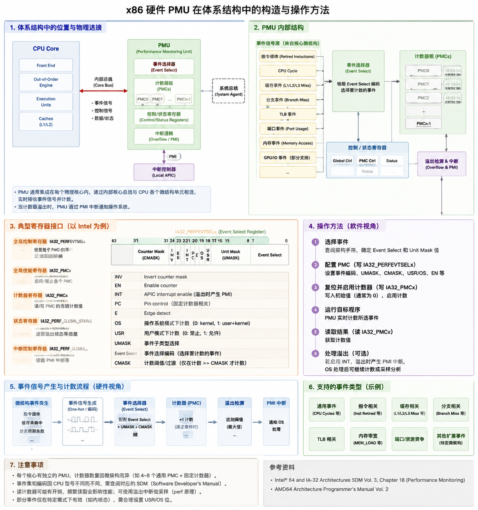
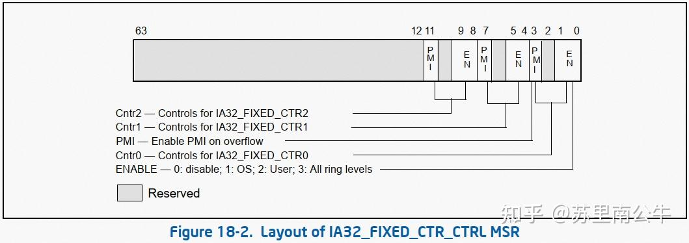
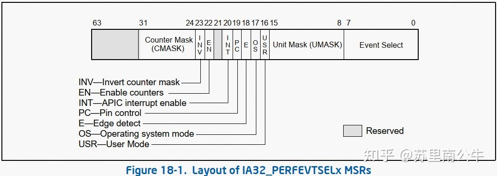
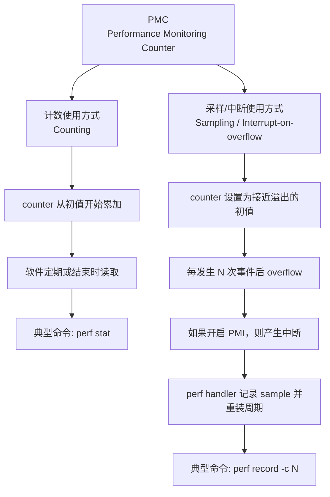
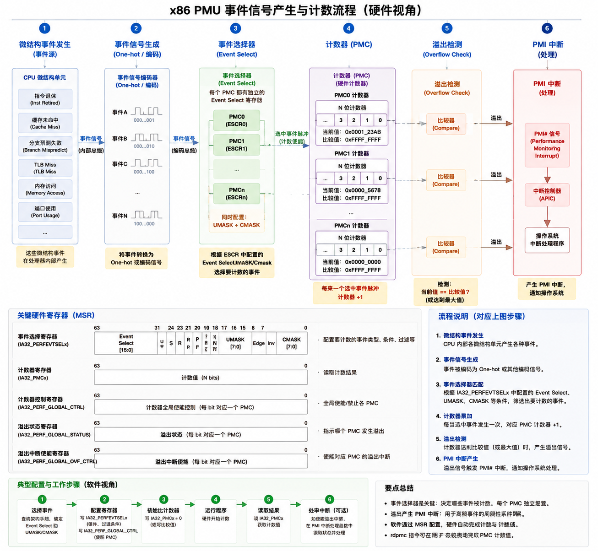
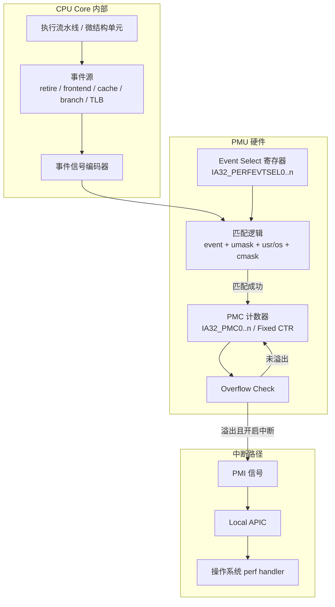
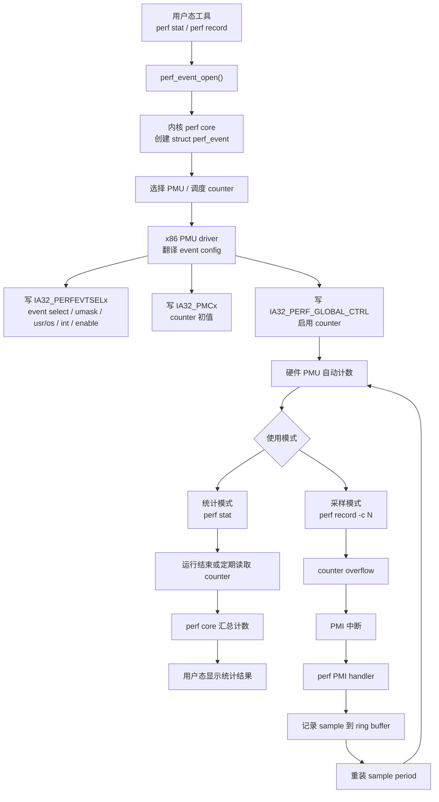
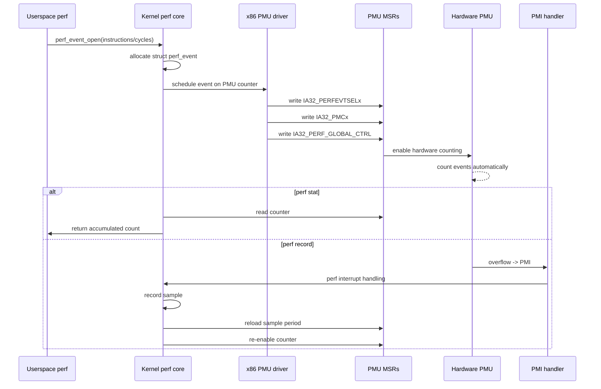

# perf后端——硬件PMU



perf子系统在架构设计上分为前端和后端：

* perf 前端面向用户提供易用接口，
* perf 后端，即硬件事件监控依赖的底层硬件 PMU 能力。

perf 子系统的 PMU 只是一种对于接口操作的抽象。其底层既可以由软件实现，也可以是硬件寄存器。

PMU 即性能监控单元（performance monitoring unit），是集成在 CPU 内的硬件，依托MSR 接口进行操作，核心功能是监控 CPU 性能指标。可以用来监控 CPU 相关的数据。
* 监控 CPU 核心内部数据：指令数、时钟周期等；
* 监控 CPU 与uncore交互数据：如 L3 缓存读写缺失。

按照现在主流x86的架构，目前硬件 PMU 又可以区分为：

Core PMU 事件、计数器：跟随CPU计算核心的PMU，事件发生在系统n个核心的一个或几个核心上。core 事件

Uncore PMU事件、计数器：由于现代x86多核CPU的L3cache，PCIe，memory controller等组件都是在插槽级别共享的，所以这部分的事件不会跟某个CPU核心的操作联系起来。

## PMU 内部的组件与编程范式

### PMC 计数器

在支持超线程（Hyper-Threading, HT）的处理器上，每个逻辑核（即一个 HT 线程）通常配备一个独立的性能监控单元PMU。

PMU 的核心是一组性能监控计数器（PMC, Performance Monitoring Counter）。

PMC 通过处理器提供的 MSR（Model-Specific Register）接口，每个 PMC 都可以被编程配置，用于监控一个特定的硬件事件。因此，一个 PMU 能够并行地对多个不同事件进行计数，实现多维度的性能数据采集。

获取性能数据的方式，就是直接读取对应 PMC 的计数值。PMC 通常支持计数和中断两种工作模式。

需要注意的是，受限于硬件设计，每个 PMU 的 PMC 数量是固定且有限的。不同的平台会有其对应的 PMC 数量。

x86 CPU 的 PMC 可分为两类：

|类型|英文|特点|用途|
|---|---|---|---|
|固定计数器|Fixed-function Counters|每个 CPU 固定计数特定事件（如 CPU cycles、instructions retired）|简单监控核心事件，访问快|
|通用计数器|General-purpose / Programmable Counters|可编程，选择任意支持的硬件事件|灵活监控指令、缓存、TLB、分支预测、总线等|

#### fixed PMC

##### 配置 fixed PMC 监控方式

在使用 fixed PMC 进行监控时通过 IA32_FIXED_CTR_CTRL 寄存器对 fixed PMC 进行配置。 每 4 个 bit 控制一个固定 PMC。



|Bits	|控制内容|
|0~3	|CTR0 控制：启用、USR/OS 模式、PMI|
|4~7	|CTR1 控制|
|8~11	|CTR2 控制|
|12~63	|保留|

控制字段：

|Bit	|功能
|EN	|Enable → 启用计数器（0:disable, 1:OS, 2:User, 3:All ring levels）|
|PMI	|溢出产生中断（Performance Monitor Interrupt）|
|其他	|保留

例如：配置 CTR0：

* 1 << (0*4) → 启用 CTR0
* 1 << (0*4 + 1) → 启用 PMI


1. 读取当前 IA32_FIXED_CTR_CTRL：
    * 使用 rdmsr 获取当前寄存器值
2. 设置计数器启用模式：
    * EN 位设置内核/用户/全部 ring
    * PMI 位设置是否触发溢出中断
3. 写回寄存器：
    * 使用 wrmsr 更新 IA32_FIXED_CTR_CTRL

##### 读取计数器

**Fixed PMC 的硬件寄存器**

* 每个 fixed PMC 也在硬件上有一个对应寄存器：
    * MSR 地址：IA32_FIXED_CTR0、IA32_FIXED_CTR1、IA32_FIXED_CTR2
    * 用于存储计数值（CPU cycles、instructions retired、unhalted cycles 等）
* 固定 PMC 事件类型 不可编程，硬件预定义好。

**内核中读取方式**

* 理论上可以直接通过 rdmsr 读取：

rdmsr IA32_FIXED_CTR0 ; 读取 CTR0

    * 这会返回当前计数值，但 rdmsr 是特权指令（只能在 Ring 0 执行）
* 实际做法：
    * 内核通常使用 rdpmc 指令读取固定 PMC：
        * 可以在用户态直接读取
        * 更快，不需要切换特权级
* rdpmc 读取固定 PMC 的参数：
    * 对固定 PMC，rdpmc 参数 = 0x40000000 + x
        * 0x40000000 是固定 PMC 的偏移
        * x = 固定 PMC 编号（0、1、2）
    * 返回值在 EDX:EAX

**示例**

假设我们要读取 CTR0（固定计数器 0）：

mov ecx, 0x40000000  ; 固定 PMC 0 编号偏移
rdpmc                 ; 返回值在 EDX:EAX

* CTR1 → 0x40000001
* CTR2 → 0x40000002

💡 一句话理解：

fixed PMC 的计数值存储在 IA32_FIXED_CTRx MSR 内核寄存器中，内核和用户态读取都推荐通过 rdpmc 指令，编号 = 0x40000000 + x，返回累加计数值，事件类型固定无需配置。

#### generic PMC

##### 配置 generic PMC 监控方式

在使用 generic PMC 进行监控时通过 IA32_PERFEVTSELx寄存器（event select 寄存器）对 generic PMC 进行设置，x 为 PMC 的编号。

IA32_PERFEVTSELx 寄存器的基地址为 186H（内核代码：MSR_ARCH_PERFMON_EVENTSEL0），编号为 x 的 PMC，其 event select 寄存器地址为 MSR_ARCH_PERFMON_EVENTSEL0 + x。

IA32_PERFEVTSELx 格式如下：



|位	|名称	|功能|
|---|---|---|
|0~7	|Event Select	|指定监控事件编号（Event Number）|
|8~15	|Unit Mask (UMASK)	|进一步指定事件的子类型或特定资源（如 L1/L2 cache）|
|16	|USR	|User mode enable：是否在用户态监控|
|17	|OS	|OS mode enable：是否在内核态监控|
|18	|E	|Edge detect：边沿检测计数（只在事件发生时计数一次）|
|19	|PC	|Pin control：用于外部硬件触发或同步|
|20	|INT	|APIC interrupt enable：计数器溢出是否产生 PMI 中断|
|21	|EN	|Enable：是否启用该 PMC 计数器|
|22	|INV|	Invert counter mask：计数掩码反转|
|23~24	|Reserved	保留位|
|31~63	|Counter Mask (CMASK)	设置计数器阈值，只有事件计数 ≥ CMASK 时才计数或触发 PMI|

使用方法

1. 选择事件：
    * Event Select + UMASK 确定监控的硬件事件类型。
    * 例如：CPU cycles、instructions retired、cache misses。
2. 选择监控模式：
    * USR = 1 → 只在用户态计数
    * OS  = 1 → 只在内核态计数
3. 启用计数器：
    * EN = 1 → PMC 开始计数
    * INT = 1 → 计数器溢出时触发 PMI
4. 阈值控制：
    * CMASK 可以设置计数器阈值，只在达到阈值时才计数或产生中断。
    * INV 可以反转掩码，用于特殊计数策略。

##### 读取 generic PMC 的计数

**generic PMC 的硬件寄存器**

与配置监控事件的寄存器类似，每个 generic PMC 对应一个存有计数结果的寄存器。对应的 MSR 寄存器是：IA32_PMCx 用于存储当前 PMC 的计数值。

该寄存器的基地址为 0C1H（IA32_PMC0），PMC1 = 0C1H+1，依次类推。

每个 PMC 实际上在硬件上都有一个 MSR 寄存器存储计数值，通过这个寄存器可以读取到硬件计数。

**内核中如何读取 PMC**

* 理论上可以直接通过 MSR（IA32_PMCx）读取：
    ```s
    rdmsr 0C1H ; 读取 PMC0
    ```
* 内核实际做法：
    * 使用 rdpmc 指令，而不是 rdmsr。
    * rdpmc 是专门用于读取 PMC 的指令，参数是 PMC 编号（0、1、2…）。
    * 例如：读 0 号 generic PMC：

    ```s
    mov ecx, 0  ; PMC编号
    rdpmc
    ; EDX:EAX 返回计数值
    ```

优点：rdpmc 比 rdmsr 快，执行在用户态即可，不需要切换到特权级。

####  固定 PMC 与通用 PMC 的区别

|特性	|通用 PMC	|固定 PMC|
| --- | --- | ---|
|可编程性	|事件可选，Event Select + UMASK	|事件固定，不可编程（CPU cycles、instructions retired 等）|
|配置寄存器	|IA32_PERFEVTSELx（每个 PMC 独立）	|IA32_FIXED_CTR_CTRL（一个寄存器统一配置所有 fixed PMC）|
|控制位	|Event Select + UMASK + EN + INT + CMASK	|每 4 bit 控制一个固定计数器，包括启用、监控模式和 PMI|
|使用场景	|灵活监控多种事件	|监控核心固定指标，简单快速|

#### PMC 的两种工作方式

PMC 本质上一直是计数器；区别在于软件只是读取计数值，还是还配置了 overflow 时触发 PMI 中断。

所以它不是两个完全分离的硬件模式，而是两种使用方式。

1. **获取性能数据 = 读 PMC 寄存器**
   - `IA32_PMCx`（x=0..N-1）是 **64 位可读 MSR**。
   - 配置好 `IA32_PERFEVTSELx` 后，事件发生时硬件自动累加；**软件用 RDMSR 读 IA32_PMCx 得到计数值**。
   → 原文要点：*“Software can read the current count value from the IA32_PMCx MSRs at any time using the RDMSR instruction.”*

2. **两种工作模式（计数 / 中断）**
   - **Counting mode（计数模式）**：只累加，**溢出不主动上报**；软件周期性 RDMSR 轮询取值。
   - **Overflow interrupt mode（中断模式）**：计数器从 0 加到全 1（溢出）时，**硬件置位溢出标志并触发 PMI（Performance Monitoring Interrupt）**。
   - 由 `IA32_PERFEVTSELx` 的 `EN`（使能）+ `OVF`（溢出）位、全局状态寄存器 `IA32_PERF_GLOBAL_STATUS` 协同控制。
   → 原文要点：*“When a PMC overflows, the PMU generates a PMI. The PMI can be used by software to sample program execution.”*



### Event Selector

PMU 内部有一个事件选择器叫事件选择器的组件（Event Selector / Event Decode Logic），它是 PMU 的核心部分之一，由他来决定哪些事件要计入 PMC。这里就是在上面 PMC 章节提到的

当 PMU 接收到 CPU 核心各执行单元的事件信号（ALU、Cache、Branch Predictor 等）

* 事件选择器根据配置寄存器：
    * IA32_PERFEVTSELx（通用 PMC）
    * UMASK / CMASK
    * USR / OS 位
* 决定哪些事件应该 计入对应的 PMC

也就是说，事件选择器就是 PMU 的过滤和路由逻辑：

* 输入：CPU 各单元事件信号
* 配置：Event Select / Unit Mask / Mode / Edge / INV 等
* 输出：送到对应 PMC 的累加器或溢出比较器

在硬件实现上通常是 组合逻辑 + 多路选择器（mux）：
    * 每个 PMC 有对应的事件选择器
    * 根据 Event Select + UMASK 配置，将来自核心的事件信号路由到 PMC

可以支持：
    * 单事件计数
    * 组合事件（例如 cache miss + load/store type）
    * 边沿检测或阈值控制


PMC + Event Selector + CPU 事件信号之间的关系

Event Selector 是 PMC 前端的过滤器，不符合条件的事件不会进入 PMC。硬件上是低延迟组合逻辑，确保每个时钟周期 CPU 信号都能被快速判断。
```text
[CPU Core Execution Units]
 ├─ ALU / FP / Vector
 ├─ Load/Store / Cache
 ├─ Branch Predictor
 └─ Pipeline
        │ 事件信号总线
        ▼
[PMU Event Selector / Decoder]
 - Event Select (IA32_PERFEVTSELx)
 - UMASK / CMASK / USR / OS
        │
        ▼
[PMC Counter]
 - 累加选中事件
 - 溢出触发 PMI
```

## PMU 的计数流程



从硬件视角看，PMU 计数并不是软件每次事件发生时去主动加一，而是 CPU 内部在执行过程中不断产生微结构事件信号，PMU 硬件根据软件提前写入的事件选择配置，自动筛选事件并更新对应的 PMC 计数器。

整个流程可以分为 6 个阶段。

**第一阶段：微结构事件发生**

CPU 执行指令时，内部不同微结构单元会产生各种事件。例如：

- 指令退休：`instructions retired`
- CPU 周期：`cycles`
- cache miss
- branch mispredict
- TLB miss
- memory access

这些事件首先是 CPU 内部的硬件信号，不是软件事件。

**第二阶段：事件信号编码**

CPU 内部会把这些微结构事件转换成 PMU 可以识别的事件编码。可以理解成：硬件把“某类事件发生了”转换成一组 event code / umask 信号。

例如在 Intel architectural PMU 中：

```text
instructions retired -> event select 0xc0, umask 0x00
CPU cycles           -> event select 0x3c, umask 0x00
```

**第三阶段：事件选择器匹配**

每个 PMC 通常都有自己的事件选择寄存器，例如 Intel 的 `IA32_PERFEVTSELx`。软件提前把想统计的事件写进去。

例如：

```text
PMC0 配置为 instructions retired
PMC1 配置为 CPU cycles
```

硬件会把 CPU 内部产生的事件信号与每个 PMC 的 Event Select 配置比较。如果匹配，并且 USR/OS、UMASK、CMASK 等条件也满足，那么该事件就会送到对应 PMC。

**第四阶段：PMC 计数**

PMC，Performance Monitoring Counter，是真正累加数值的硬件计数器。

当某个事件匹配 PMC 的配置时，对应 PMC 自动加一，或者按硬件定义的方式增加。这个过程完全由硬件完成，不需要每次事件发生都进入内核，也不需要每次都触发中断。

例如：

```text
指令退休一次 -> PMC0 + 1
CPU cycle 推进一次 -> PMC1 + 1
```

**第五阶段：溢出检测**

PMC 是固定位宽的计数器，例如 32 位、40 位、48 位。硬件会检测 counter 是否达到溢出条件。

在采样模式中，软件通常会把 PMC 设置为一个接近最大值的初值，使得经过 N 次事件后发生 overflow。例如想每 100000 条指令采样一次，就把 counter 预置为：

```text
counter = -100000
```

这样硬件再计数 100000 次后 counter 溢出。

**第六阶段：PMI 中断**

如果该 PMC 配置了 overflow interrupt，那么溢出时硬件会产生 PMI，也就是 Performance Monitoring Interrupt。PMI 会经过本地 APIC 等中断控制路径，最终进入操作系统的 PMU/perf 中断处理程序。

注意：**不是 counter 一增长就产生 PMI，也不是所有 counter overflow 都一定产生 PMI。只有配置了 overflow interrupt 的采样事件，才会在溢出时产生 PMI。**



### 软件处理

从软件视角看，PMU 的使用流程不是“软件每次事件发生都去加一”，而是软件先描述自己想统计什么事件、统计在哪些上下文中、是否需要溢出中断，然后把这些配置写入 PMU 寄存器。之后事件计数由硬件自动完成，软件只在读取 counter 或处理 PMI 时介入。

典型的软件参与者包括：

- 用户态工具：例如 `perf stat`、`perf record`
- 内核 perf core：负责管理 `struct perf_event`
- 架构 PMU driver：负责把 perf event 翻译成硬件 PMU 配置
- x86 PMU MSR：例如 `IA32_PERFEVTSELx`、`IA32_PMCx`、`IA32_PERF_GLOBAL_CTRL`
- PMI handler：处理 PMU overflow 中断

#### 1. 用户态创建 perf_event

用户态工具通过 `perf_event_open()` 请求一个性能事件。例如：

```bash
perf stat -e instructions,cycles ./app
```

或者采样模式：

```bash
perf record -e instructions -c 100000 ./app
```

前者主要用于计数，后者表示每 100000 次 `instructions` 事件采样一次。

#### 2. 内核 perf core 创建并管理事件

`perf_event_open()` 进入内核后，perf core 创建 `struct perf_event`，记录事件类型、采样周期、是否继承、统计范围、是否 exclude kernel/user 等属性。

此时软件对象还只是一个“计数请求”，并没有等价于硬件 counter 已经开始工作。perf core 还需要把事件调度到具体 PMU 上。

#### 3. PMU driver 翻译事件并编程硬件

x86 PMU driver 会把 perf event 翻译成硬件可以理解的 event select、umask、usr/os、cmask 等配置，然后写入 PMU MSR：

```text
IA32_PERFEVTSELx      选择事件、配置 enable/int/usr/os 等
IA32_PMCx             设置 counter 初值
IA32_PERF_GLOBAL_CTRL 启用对应 counter
```

例如：

```text
instructions retired -> event select 0xc0, umask 0x00
CPU cycles           -> event select 0x3c, umask 0x00
```

如果是普通统计模式，counter 通常从 0 或某个基准值开始累加。如果是采样模式，内核会设置 sample period，并把 counter 预置为接近溢出的值，使其经过 N 次事件后 overflow。

#### 4. 硬件自动计数，软件不逐事件参与

一旦 PMU counter 被启用，CPU 硬件会自动计数。软件不会在每条指令退休、每个 cycle、每次 cache miss 时被调用。

这点非常关键：

```text
事件发生 -> 硬件 PMU counter 增加
```

而不是：

```text
事件发生 -> 进入内核 -> 软件 counter 加一
```

所以 PMU 能以很低开销统计高频硬件事件。

#### 5. 软件读取 counter

对于 `perf stat` 这类统计模式，软件通常在运行结束或定期刷新时读取 counter。读取方式可以是：

- 内核读 PMU MSR
- 用户态在允许的情况下通过 `RDPMC` 快速读
- perf core 汇总 enabled/running 时间并做缩放

最终用户看到的是类似：

```text
1,234,567 instructions
2,345,678 cycles
```

#### 6. 软件处理 PMI

对于 `perf record -c N` 这类采样模式，counter overflow 后硬件产生 PMI。PMI 进入内核后，perf 的中断处理程序会：

1. 判断哪个 perf event overflow。
2. 读取当前寄存器上下文，例如 RIP。
3. 记录 sample 到 perf ring buffer。
4. 重装载下一个 sample period。
5. 重新启用 counter，继续计数。

所以采样模式的核心是：

```text
硬件计数 N 次 -> overflow -> PMI -> perf handler 记录 sample -> 继续计数
```



### 软件和硬件交互

时序图：

```text
硬件计数器 (48位)                    perf_event 软件计数 (64位)
     │                                     │
     ▼                                     ▼
┌─────────────┐                    ┌─────────────────┐
│  初始: -1M   │                    │  count = 0      │
│  0xFFFFF... │                    │                 │
└─────────────┘                    └─────────────────┘
     │                                     │
     │ 事件计数...                         │
     ▼                                     │
┌─────────────┐                            │
│  溢出!       │                            │
│  0x000000   │ ←──────┐                   │
└─────────────┘         │                   │
     │                  │                   │
     │ PMI中断          │                   │
     ▼                  │                   │
┌─────────────────┐     │                   │
│ 中断处理:        │     │                   │
│ 1. update()      │─────┼───────────────────┼───> 加 1M 到 count
│    delta = 1M    │     │                   │
│    event->count += 1M│                    │
│ 2. set_period()  │     │                   │
│    重置为 -1M     │     │                   │
└─────────────────┘     │                   │
     │                  │                   │
     ▼                  ▼                   ▼
┌─────────────┐                    ┌─────────────────┐
│  又是 -1M    │                    │  count = 1M     │
│  0xFFFFF... │                    │                 │
└─────────────┘                    └─────────────────┘
     │
     └─ 循环继续...
```

交互入口：

* x86_assign_hw_event
    * 内核函数，负责 分配硬件 PMC 给 perf_event。
    * 确定这个 PMC 的编号、Event Select 配置等。
* x86_perf_event_update
    * 内核函数，用来 更新 perf_event 的计数值。
    * 通过 rdpmc 指令读取硬件 PMC 的当前值，然后累加到 perf_event 结构中。

## 事件来源

CPU core 内部各种单元产生的事件信号：

|单元	|事件示例|
|---|---|
|ALU / FP / Vector	|指令 retired, floating point ops|
|Load/Store / Cache	|L1/L2/L3 cache hit/miss, memory access|
|Branch predictor	|分支预测命中/失败|
|Pipeline	|Stalls, flushes, instruction retire|
|Execution units	|Micro-op issued, execution latency|