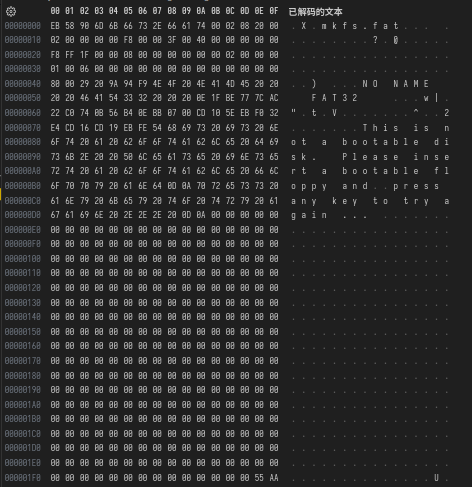

# Fat32 文件系统

Fat32 文件系统在磁盘上的布局如下图所示：


DBR：操作系统引导记录

Fat表：在 Fat 表中记录了 Fat32 文件系统的管理单位：簇的分配状况。其中 Fat 表2是表1的备份

数据区：存放了文件数据

## DBR

Fat32 文件系统的 DBR 由五部分组成，分别为：跳转指令，OEM代号，BPB，引导程序，和结束标志组成。



其中 BPB 中记录了 Fat32 文件系统的元信息。以下为该结构中内容的解释。

```c
/*
 * FAT 文件系统的引导扇区结构体定义。
 */
struct fat_boot_sector {
    __u8 ignored[3];          /* 启动程序的短跳转或近跳转指令 */
    __u8 system_id[8];        /* 系统标识符 - 可以用于特殊情况，例如分区管理卷 */
    __u8 sector_size[2];      /* 每个逻辑扇区的字节数 */
    __u8 sec_per_clus;        /* 每簇的扇区数 */
    __le16 reserved;          /* 保留扇区数 */
    __u8 fats;                /* FAT 表的数量 */
    __u8 dir_entries[2];      /* 根目录的目录项数 */
    __u8 sectors[2];          /* 扇区总数（如果 total_sect 为 0） */
    __u8 media;               /* 媒体类型代码 */
    __le16 fat_length;        /* 每个 FAT 的扇区数 */
    __le16 secs_track;        /* 每个磁道的扇区数 */
    __le16 heads;             /* 磁头数 */
    __le32 hidden;            /* 隐藏扇区数（未使用） */
    __le32 total_sect;        /* 扇区总数（如果 sectors 为 0） */

    union {
        struct {
            /* FAT16 的扩展 BPB 字段 */
            __u8 drive_number;   /* 物理驱动器号 */
            __u8 state;          /* 未文档化，但用于挂载状态 */
            __u8 signature;      /* 扩展引导签名 */
            __u8 vol_id[4];      /* 卷序列号 */
            __u8 vol_label[MSDOS_NAME]; /* 卷标 */
            __u8 fs_type[8];     /* 文件系统类型 */
            /* 其他字段未在此列出 */
        } fat16;

        struct {
            /* 仅用于 FAT32 */
            __le32 length;       /* 每个 FAT 的扇区数 */
            __le16 flags;        /* 位 8：FAT 镜像，低 4 位：活动 FAT */
            __u8 version[2];     /* 文件系统版本（主版本，次版本） */
            __le32 root_cluster; /* 根目录的第一个簇 */
            __le16 info_sector;  /* 文件系统信息扇区 */
            __le16 backup_boot;  /* 备份引导扇区 */
            __le16 reserved2[6]; /* 未使用 */
            /* FAT32 的扩展 BPB 字段 */
            __u8 drive_number;   /* 物理驱动器号 */
            __u8 state;          /* 未文档化，但用于挂载状态 */
            __u8 signature;      /* 扩展引导签名 */
            __u8 vol_id[4];      /* 卷序列号 */
            __u8 vol_label[MSDOS_NAME]; /* 卷标 */
            __u8 fs_type[8];     /* 文件系统类型 */
            /* 其他字段未在此列出 */
        } fat32;
    };
};
```

该结构在文件系统被挂载时会作为填充 VFS 层中超级块的块的依据。该项工作通过函数 `msdos_get_sb` 中的回调函数 `msdos_fill_super`

```c
static int msdos_get_sb(struct file_system_type *fs_type, int flags, const char *dev_name, void *data, struct vfsmount *mnt)
{
    return get_sb_bdev(fs_type, flags, dev_name, data, msdos_fill_super, mnt);
}
```

## Fat 表

Fat 表用来记录磁盘内簇的分配情况，根据文件系统版本的不同，每个 Fat 表项占据的大小也不同，Fat32 中一个 Fat 表项占用四个字节。

每个表项的中用来存储下一个簇对应表项所在的位置。若该簇是文件数据所占用的最后一个簇，则会填充为 `0xffffffff` 表示该文件已经到达结尾。如果该簇还未被使用则默认为 0 。

```c
//分配簇的核心代码
#define EOF_FAT32   0x0FFFFFFF
#define FAT_ENT_FREE    (0)
do {
    // 检查当前 FAT 表项是否为空闲
    if (ops->ent_get(&fatent) == FAT_ENT_FREE) {
        int entry = fatent.entry; // 记录当前空闲簇号

        /* 创建簇链 */
        // 将当前 FAT 表项标记为文件结束（FAT_ENT_EOF）
        ops->ent_put(&fatent, FAT_ENT_EOF);
                
        // 如果前一个簇的 FAT 表项已初始化，则将其指向当前空闲簇
        if (prev_ent.nr_bhs)
            ops->ent_put(&prev_ent, entry);

        // 收集当前 FAT 表项对应的缓冲区头指针
        fat_collect_bhs(bhs, &nr_bhs, &fatent);

        // 更新上一次找到的空闲簇号
        sbi->prev_free = entry;
                
        // 如果 free_clusters 有效且不为 -1，则减少空闲簇计数
        if (sbi->free_clusters != -1)
            sbi->free_clusters--;
                
        // 标记超级块为脏
        sb->s_dirt = 1;

        // 记录找到的空闲簇号
        cluster[idx_clus] = entry;
        idx_clus++;
                
        // 如果已经找到足够数量的空闲簇，则退出循环
        if (idx_clus == nr_cluster)
            goto out;

                /*
                 * fat_collect_bhs() 会增加缓冲区头指针的引用计数，
                 * 所以我们可以继续使用 prev_ent。
                 */
        prev_ent = fatent;
    }
            
    // 增加簇计数
    count++;
            
    // 如果已检查完所有簇，则退出循环
    if (count == sbi->max_cluster)
        break;
        // 获取下一个 FAT 表项
} while (fat_ent_next(sbi, &fatent));
```

## Fat 文件系统中原生的结构体

msdos_dir_entry 是 Fat32 文件系统中原生的短文件名目录项，该结构体最终会作为目录文件的内容被存放在磁盘内。

```c
struct msdos_dir_entry {
    __u8 name[MSDOS_NAME];    /* 文件名和扩展名 */
    __u8 attr;                /* 文件属性位 */
    __u8 lcase;               /* 基本名和扩展名的大小写信息 */
    __u8 ctime_cs;            /* 创建时间的百分之一秒 (0-199) */
    __le16 ctime;             /* 创建时间 */
    __le16 cdate;             /* 创建日期 */
    __le16 adate;             /* 最后访问日期 */
    __le16 starthi;           /* FAT32 中簇号的高 16 位 */
    __le16 time, date, start; /* 文件时间、日期和起始簇号 */
    __le32 size;              /* 文件大小 (字节) */
};
```

该结构体中的内容作为填充 inode 的依据之一。

Fat32 私有的 inode_info 结构体：

```c
struct msdos_inode_info {
    spinlock_t cache_lru_lock;  // 自旋锁，用于保护缓存 LRU（Least Recently Used）链表
    struct list_head cache_lru;  // 缓存 LRU 链表头，用于管理缓存项
    int nr_caches;  // 缓存项的数量
    /* 用于避免 fat_free() 和 fat_get_cluster() 之间的竞争 */
    unsigned int cache_valid_id;  // 缓存有效 ID，用于同步缓存操作

    /* 注意：mmu_private 是 64 位的，因此访问时必须持有 ->i_mutex 锁 */
    loff_t mmu_private;  // 实际分配的大小（以字节为单位）

    int i_start;  // 起始簇号，0 表示没有起始簇
    int i_logstart;  // 逻辑起始簇号
    int i_attrs;  // 未使用的属性位
    loff_t i_pos;  // 目录项在磁盘上的位置，0 表示没有位置
    struct hlist_node i_fat_hash;  // 根据 i_location 进行哈希的链表节点
    struct inode vfs_inode;  // 通用 VFS（虚拟文件系统） inode 结构
};
```

由于 Fat32 文件系统底层并不支持 inode ，该文件系统中的 inode 都是存在于内存中，并不会回写到磁盘中。

Fat32 最终会调用 VFS 中通用的函数 `alloc_inode` 。该函数被定义在 fs/inode.c 中

```c
static struct inode *alloc_inode(struct super_block *sb)
{
    struct inode *inode;

    // 检查超级块 (super_block) 是否有自定义的 alloc_inode 函数
    if (sb->s_op->alloc_inode)
        inode = sb->s_op->alloc_inode(sb); // 调用自定义的 alloc_inode 函数
    else
        inode = kmem_cache_alloc(inode_cachep, GFP_KERNEL); // 从内存缓存中分配一个 inode 结构

    // 检查是否成功分配了 inode
    if (!inode)
        return NULL;

    // 初始化 inode 结构
    if (unlikely(inode_init_always(sb, inode))) {
        // 如果初始化失败，检查是否有自定义的 destroy_inode 函数
        if (inode->i_sb->s_op->destroy_inode)
            inode->i_sb->s_op->destroy_inode(inode); // 调用自定义的 destroy_inode 函数销毁 inode
        else
            kmem_cache_free(inode_cachep, inode); // 否则从内存缓存中释放 inode
        return NULL;
    }

    // 返回分配并初始化好的 inode
    return inode;
}
```

对于底层不支持 inode 的文件系统会由 slab 分配器在内存中为其分配一块地址。

```c
static struct kmem_cache *inode_cachep __read_mostly;//存放vfs中的inode的缓存结构，在vfs层初始化时一同被初始化
```
