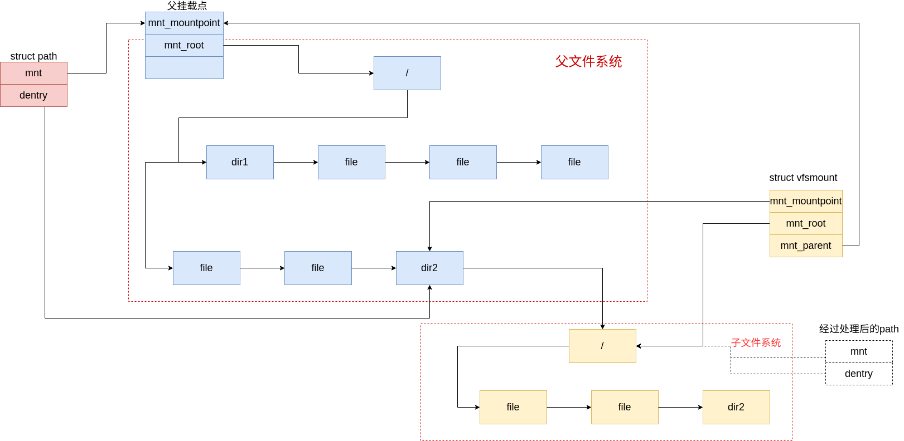

# VFS 中路径的查找

## 路径查找相关的结构体

### vfsmount

vfsmount 结构用来描述一个被挂载的文件系统所在的挂载点信息

```c
struct vfsmount {
	struct list_head mnt_hash;		/* 散列表 */
	struct vfsmount *mnt_parent;	/* fs we are mounted on */	/* 父文件系统，也就是要挂载到哪个文件系统 */
	struct dentry *mnt_mountpoint;	/* dentry of mountpoint */	/* 指向文件系统被安装到父文件系统的哪个目录下 */
	struct dentry *mnt_root;	/* root of the mounted tree */		/* 该文件系统的根目录项 */
	struct super_block *mnt_sb;	/* pointer to superblock */			/* 该文件系统的超级块 */
	struct list_head mnt_mounts;	/* list of children, anchored here */		/* 子文件系统链表 */
	struct list_head mnt_child;	/* and going through their mnt_child */		/* 子文件系统链表 */
	// vfsmount结构还保存了在安装时指定的标志信息，该信息存储在mnt_flags域中
	// MNT_NOSUID，禁止该文件系统的可执行文件设置setuid和setgid标志
	// MNT_MODEV，禁止访问该文件系统上的设备文件
	// MNT_NOEXEC，禁止执行该文件系统上的可执行文件
	int mnt_flags;		/* 安装标志，该文件还有其他一些不常用标志 */
	/* 4 bytes hole on 64bits arches */
	const char *mnt_devname;	/* Name of device e.g. /dev/dsk/hda1 */	/* 设备文件名 e.g. /dev/dsk/hda1 */
	struct list_head mnt_list;		/* 描述符链表 */
	struct list_head mnt_expire;	/* link in fs-specific expiry list */		/* 到期链表的入口 */
	struct list_head mnt_share;	/* circular list of shared mounts */			/* 共享安装链表的入口 */
	struct list_head mnt_slave_list;/* list of slave mounts */						/* 从安装链表 */
	struct list_head mnt_slave;	/* slave list entry */										/* 从安装链表的入口 */
	struct vfsmount *mnt_master;	/* slave is on master->mnt_slave_list */		/* 从安装链表的主人 */
	struct mnt_namespace *mnt_ns;	/* containing namespace */			/* 相关的命名空间 */
	int mnt_id;			/* mount identifier */			/* 安装标识符 */
	int mnt_group_id;		/* peer group identifier */		/* 组标识符 */
	/*
	 * 我们将 mnt_count 和 mnt_expiry_mark 放在 vfsmount 结构体的末尾，
	 * 以便将这些频繁修改的字段放在一个单独的缓存行中
	 * （这样在 SMP 机器上读取 mnt_flags 时不会发生 ping-pong 效应）
	 */
	atomic_t mnt_count;		/* 引用计数，用于管理此结构的生命周期 */
	int mnt_expiry_mark;		/* true if marked for expiry */		/* 如果标记为到期，则为 True */
	int mnt_pinned;				/* "钉住"进程计数 */
	int mnt_ghosts;				/* "镜像"引用计数 */
#ifdef CONFIG_SMP
	int __percpu *mnt_writers;		/* 写者引用计数 */
#else
	int mnt_writers;							/* 写者引用计数 */
#endif
};
```

其中成员 `mnt_mountpoint` 描述了挂载点被安装在父文件系统中的哪个目录项之下。

成员 `mnt_root` 描述了子文件系统的根目录项。

### nameidata

nameidata 结构用于储存文件路径查找期间的信息

```c
struct nameidata {
	struct path	path;           // 包含当前查找路径的 vnode 和 vfsmount
	struct qstr	last;           // 最后一个组件的名称和长度
	struct path	root;           // 查找操作的根路径
	unsigned int	flags;          // 查找相关的标志，如 LOOKUP_DIRECTORY
	int		last_type;      // 上一个路径组件的类型，如 LAST_ROOT
	unsigned	depth;          // 符号链接跟随的当前深度
	// 每个元素都是指针，指向一块内存
	char *saved_names[MAX_NESTED_LINKS + 1];  // 用于保存嵌套符号链接名称的数组

	/* Intent data */
	// 用于存储不同类型操作的特定数据
	union {
		struct open_intent open;  // 如果是打开文件操作，使用此结构
	} intent;
};
```

其中成员 `root` 用来记录查找操作的起点路径。如输入：/home/aaa 这样的路径 path 则会从当前进程的进程控制块中获取其成员 `fs_struct` 中记录的 root。

成员 `path` 则在路径遍历时指向当前所在的目录。

### path

path 是在路径解析过程中用到的一个结构体。

```c
// 定义 path 结构体，表示一个路径
struct path {
    struct vfsmount *mnt;  // 指向挂载点的指针
    struct dentry *dentry; // 指向目录项的指针
};
```

## 路径查找的入口

路径查找的入口函数为 path_lookup ，并在 path_lookup 中调用真正用来查找的函数 do_path_lookup 。

```c
/* Returns 0 and nd will be valid on success; Retuns error, otherwise. */
static int do_path_lookup(int dfd, const char *name, unsigned int flags, struct nameidata *nd)
{
    // 初始化路径查找
    int retval = path_init(dfd, name, flags, nd);

    // 如果初始化成功，执行实际的路径遍历
    if (!retval)
        retval = path_walk(name, nd);

    // 如果查找成功并且启用了审计功能，审计结果的inode
    if (unlikely(!retval && !audit_dummy_context() && nd->path.dentry && nd->path.dentry->d_inode))
        audit_inode(name, nd->path.dentry);

    // 如果nd中有根路径，释放相关资源
    if (nd->root.mnt) {
        path_put(&nd->root);
        nd->root.mnt = NULL;
    }

    // 返回查找结果
    return retval;
}

int path_lookup(const char *name, unsigned int flags, struct nameidata *nd)
{
    return do_path_lookup(AT_FDCWD, name, flags, nd);
}

```

从上述的函数中可以看出对路径的查找分为初始化路径、遍历路径、校验三部分。

## 初始化查找

初始化路径查找函数 `path_init` 的主要目的为填充在路径查找中所需用到的结构体，即为 `struct nameidata *nd`

对于 nameidata 中 root 成员的处理分为三种情况。

1. 路径以 / 开头

   路径以 /开头时，nameidata 中的 root 被指定为进程控制块中记录的 root

2. dfd 指定为 AT_FDCWD 即从当前路径开始

   dfd 指定为 AT_FDCWD时，nameidata 中的 root 被指定为进程控制块中记录的 cwd

3. 指定了从 dfd 对应的路径开始

   指定了 dfd ，会通过 fd 获取到对应的 file 与 dirent ，将 file 对应的 path 作为 root

```c
static int path_init(int dfd, const char *name, unsigned int flags, struct nameidata *nd)
{
    int retval = 0; // 函数返回值，初始化为0（成功）
    int fput_needed; // 指示是否需要释放文件指针的变量
    struct file *file; // 文件结构的指针

    nd->last_type = LAST_ROOT; // 如果只有斜杠，初始化 last_type 为 LAST_ROOT
    nd->flags = flags; // 设置 nameidata 结构的标志
    nd->depth = 0; // 初始化深度为0
    nd->root.mnt = NULL; // 初始化根挂载点为 NULL

    // 如果名称以 '/' 开头，使用根目录
    if (*name == '/') {
        set_root(nd); // 在 nameidata 结构中设置根目录
        nd->path = nd->root; // 将当前路径设置为根路径
        path_get(&nd->root); // 增加根路径的引用计数
    } else if (dfd == AT_FDCWD) { // 如果 dfd 是 AT_FDCWD（当前工作目录）
        struct fs_struct *fs = current->fs; // 获取当前进程的文件系统结构
        read_lock(&fs->lock); // 获取读锁
        nd->path = fs->pwd; // 将当前路径设置为当前工作目录
        path_get(&fs->pwd); // 增加当前工作目录的引用计数
        read_unlock(&fs->lock); // 释放读锁
    } else { // 否则，使用 dfd 指定的目录文件描述符
        struct dentry *dentry;

        file = fget_light(dfd, &fput_needed); // 获取文件结构
        retval = -EBADF; // 设置默认错误返回值为 -EBADF（错误的文件描述符）
        if (!file) // 如果获取文件失败
            goto out_fail;

        dentry = file->f_path.dentry; // 获取文件路径的目录项

        retval = -ENOTDIR; // 设置默认错误返回值为 -ENOTDIR（不是目录）
        if (!S_ISDIR(dentry->d_inode->i_mode)) // 如果不是目录
            goto fput_fail;

        retval = file_permission(file, MAY_EXEC); // 检查文件的执行权限
        if (retval) // 如果没有执行权限
            goto fput_fail;

        nd->path = file->f_path; // 设置当前路径为文件路径
        path_get(&file->f_path); // 增加文件路径的引用计数

        fput_light(file, fput_needed); // 释放文件指针
    }
    return 0; // 成功返回0

fput_fail:
    fput_light(file, fput_needed); // 释放文件指针
out_fail:
    return retval; // 返回错误码
}
```

## 遍历路径

真正的路径遍历函数为 `link_path_walk` 。

该函数中将一个完整的路径名分割，依次遍历查找路径中的每个目录。

### 处理路径名

```c
        this.name = name; // 初始化当前路径组件的名称
        c = *(const unsigned char *)name;

        hash = init_name_hash(); // 初始化哈希值
        do {
            name++;
            hash = partial_name_hash(c, hash);
            c = *(const unsigned char *)name;
        } while (c && (c != '/')); // 计算路径组件的哈希值
        this.len = name - (const char *) this.name; // 计算路径组件的长度
        this.hash = end_name_hash(hash); // 结束哈希值计算

        // 如果没有尾随的斜杠，则处理最后一个组件
        if (!c)
            goto last_component;
        while (*++name == '/');
        if (!*name)
            goto last_with_slashes;

        // 特殊处理 "." 和 ".."
        if (this.name[0] == '.') switch (this.len) {
            default:
                break;
            case 2:    
                if (this.name[1] != '.')
                    break;
                follow_dotdot(nd); // 处理 ".."
                inode = nd->path.dentry->d_inode;
                // 继续处理
            case 1:
                continue; // 处理 "."
        }
```

执行完第一个循环后的情况：


解析到的 name 如果为 “.” 则直接跳过不做处理，如果为 “..” 则需要执行对应的处理函数` follow_dotdot `

```c
// 处理路径组件 ".." 的函数
static __always_inline void follow_dotdot(struct nameidata *nd)
{
    set_root(nd); // 设置根目录

    while (1) {
        struct dentry *old = nd->path.dentry; // 保存当前路径的目录项

        // 如果当前目录项和根目录相同，则退出循环
        if (nd->path.dentry == nd->root.dentry &&
            nd->path.mnt == nd->root.mnt) {
            break;
        }
        // 如果当前目录项不是挂载点的根目录，则获取其父目录项
        if (nd->path.dentry != nd->path.mnt->mnt_root) {
            // 获取父目录项，罕见情况下使用 dget_parent()...
            nd->path.dentry = dget_parent(nd->path.dentry);
            dput(old); // 释放旧的目录项
            break;
        }
        // 如果当前目录项是挂载点的根目录，则向上追踪到挂载点的父挂载点
        if (!follow_up(&nd->path))
            break;
    }
    follow_mount(&nd->path); // 处理挂载点
}
```

对于 .. 的处理中，会分为三种情况。

1. 当前目录项和根目录相同，此种情况不做处理。

2. 当前指向的目录项并不是挂载点的根目录，此种情需将当前指向的目录项向上回溯一个，即将当前目录项指向其对应的父目录。

3. 如果当前的目录项是挂载点的根目录，则需要进入处理函数 `follow_up`，该函数会当前目录项回溯到该文件系统所挂载的目录上。

```c
int follow_up(struct path *path)
{
    struct vfsmount *parent;
    struct dentry *mountpoint;

    // 锁定全局挂载点锁
    spin_lock(&vfsmount_lock);
    
    // 获取父挂载点
    parent = path->mnt->mnt_parent;
    
    // 如果当前挂载点就是根挂载点，则解锁并返回0
    if (parent == path->mnt) {
        spin_unlock(&vfsmount_lock);
        return 0;
    }
    
    // 增加父挂载点的引用计数
    mntget(parent);
    
    // 获取当前挂载点的挂载点目录项，并增加其引用计数
    mountpoint = dget(path->mnt->mnt_mountpoint);
    
    // 解锁全局挂载点锁
    spin_unlock(&vfsmount_lock);
    
    // 释放当前路径目录项的引用计数
    dput(path->dentry);
    
    // 更新路径的目录项为挂载点目录项
    path->dentry = mountpoint;
    
    // 释放当前挂载点的引用计数
    mntput(path->mnt);
    
    // 更新路径的挂载点为父挂载点
    path->mnt = parent;
    
    // 返回1表示成功
    return 1;
}
```

### 查找目录项

查找目录项的函数为 ` do_lookup `

```c
static int do_lookup(struct nameidata *nd, struct qstr *name, struct path *path)
```

在该函数中首先会调用函数` __d_lookup `在全局的哈希表中去查找名字对应的目录项，如果没有找到则说明该 dirent 未被缓存至目录中。

如果 dirent 未被缓存，则会进入底层文件系统对应的路径查找函数中去找到该目录项并将其缓存。

```c
new = d_alloc(parent, name);
		dentry = ERR_PTR(-ENOMEM);
		if (new) {
			dentry = dir->i_op->lookup(dir, new, nd);
			if (dentry)
				dput(new);
			else
				dentry = new;
		}
```

处理流程：

```lua
do_lookup
   |
   |-- 调用 d_hash? -> 错误退出
   |
   |-- __d_lookup (无锁缓存查找)
   |        |-- 命中 -> need_revalidate? -> done
   |        |-- 未命中 -> need_lookup
   |
   |-- need_lookup
   |        |-- d_lookup (加锁查找)
   |        |        |-- 未命中 -> 分配新dentry + i_op->lookup
   |        |        |-- 命中 -> 可能 revalidate
   |
   |-- need_revalidate
   |        |-- do_revalidate
   |                 |-- NULL -> need_lookup
   |                 |-- 错误 -> fail
   |                 |-- OK   -> done
   |
   |-- done -> 设置 path 并 follow_mount
   |
   |-- fail -> 返回错误码

```

## 如何处理目录项之下挂载了文件系统的情况

在内核中使用这两个函数来处理目录项下存在挂载点的情况，将path中记录的 dirent 项转移到挂载点所对应的根目录中。

```c
static int __follow_mount(struct path *path)
{
    int res = 0;
    while (d_mountpoint(path->dentry)) {//如果当前路径下有挂载点被挂载
        struct vfsmount *mounted = lookup_mnt(path);//查找当前路径下被挂载的挂载点
        if (!mounted)//如果没找到则直接退出循环
            break;
        dput(path->dentry);
        if (res)
            mntput(path->mnt);
        path->mnt = mounted;
        path->dentry = dget(mounted->mnt_root);//更新路径对应的目录项为被挂载的挂载点的根目录
        res = 1;
    }
    return res;
}
```

在上述函数中会调用来判断这个目录下面有没有挂载其他的文件系统，这里会用到 dentry 中的

```c
static inline int d_mountpoint(struct dentry *dentry)
{
    return dentry->d_mounted;
}
```

```c
static void follow_mount(struct path *path)
{
    // 循环检查路径上的目录项是否为挂载点
    while (d_mountpoint(path->dentry)) {
        // 查找挂载点对应的vfsmount结构
        struct vfsmount *mounted = lookup_mnt(path);
        if (!mounted)
            break; // 如果没有找到对应的挂载点，退出循环

        // 释放当前路径目录项的引用计数
        dput(path->dentry);

        // 释放当前挂载点的引用计数
        mntput(path->mnt);

        // 更新路径的挂载点为找到的挂载点
        path->mnt = mounted;

        // 更新路径的目录项为新挂载点的根目录项，并增加其引用计数
        path->dentry = dget(mounted->mnt_root);
    }
}
```

下图中展示了 vfsmount path dirent 之间的关系。其中虚线绘制的 path 结构为函数 `follow_mount` 处理之后的结果

