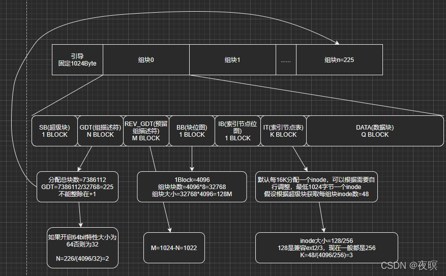
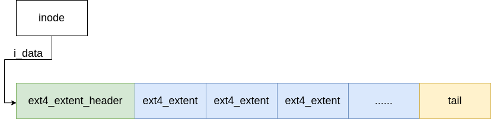
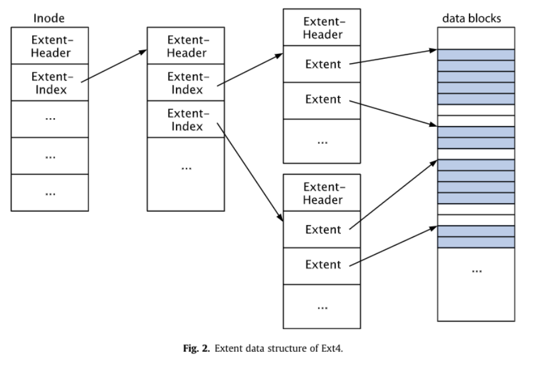
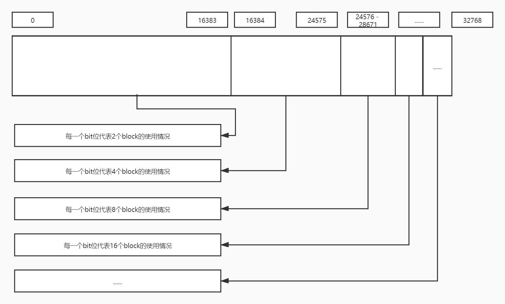
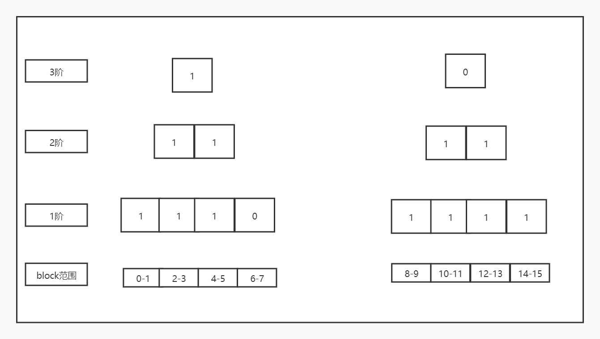
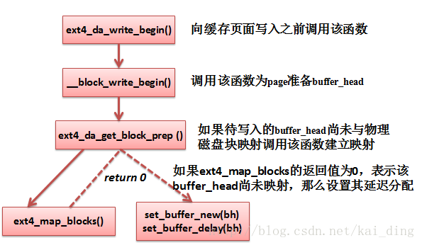
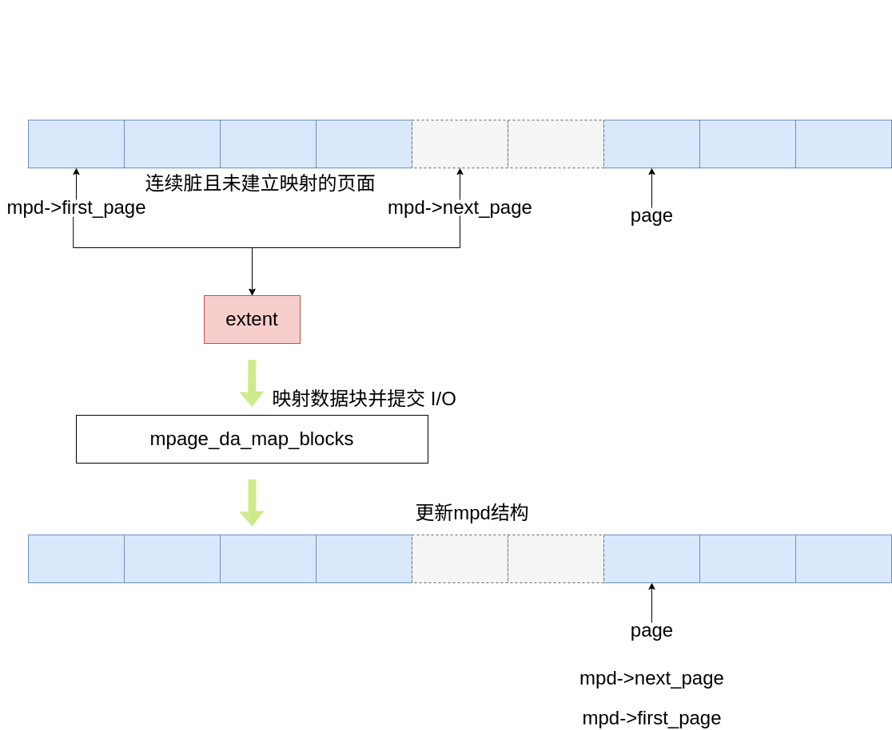

# ext4文件系统

## 在存储设备上的布局

在ext4文件系统中，将多个块划分为一个块组进行管理。其中块组0中存储了超级块等等文件系统相关的元信息。


由于这些信息非常重要，为了防止其因为意外发生而被毁坏，因此在其他块组中，存在有超级块和GDT的冗余备份。
当该属性被开启时，超级块和GDT备份只出现在3，5，7的幂的块上。

例如假设一共有200个块组，则块组1，3，5，7，9，21，27，49，81，125中皆有备份

下图为每个块组中的结构中的布局



如果既不是主超级块组又不是冗余备份块组，则块组以块位图开头。

## ext4 中的数据结构

### ext4_super_block 超级块

`struct ext4_super_block`为ext4文件系统原生的超级块结构。在 ext4_super_block 中存储了ext4 文件系统的元信息。在ext4被挂载时会将该结构从磁盘中读取，并将其中内容填入到 `ext4_sb_info` 中。ext4_sb_info 会作为vfs层中 super_block 结构在ext4文件系统中的子类。

```c
struct ext4_super_block {
    /* 文件系统的基础统计信息 */
    __le32 s_inodes_count;            /* inode总数 */
    __le32 s_blocks_count_lo;         /* 块总数 (低32位) */
    __le32 s_r_blocks_count_lo;       /* 预留块的总数 (低32位) */
    __le32 s_free_blocks_count_lo;    /* 空闲块数 (低32位) */

    __le32 s_free_inodes_count;       /* 空闲inode数 */
    __le32 s_first_data_block;        /* 第一个数据块编号 */
    __le32 s_log_block_size;          /* 块大小的对数（块大小 = 1024 << s_log_block_size） */
    __le32 s_obso_log_frag_size;      /* 已弃用的碎片大小 */

    /* 每组的块、碎片、inode等统计信息 */
    __le32 s_blocks_per_group;        /* 每组的块数 */
    __le32 s_obso_frags_per_group;    /* 每组的碎片数 (已弃用) */
    __le32 s_inodes_per_group;        /* 每组的inode数 */
    __le32 s_mtime;                   /* 上次挂载的时间 */

    __le32 s_wtime;                   /* 上次写入的时间 */
    __le16 s_mnt_count;               /* 挂载次数 */
    __le16 s_max_mnt_count;           /* 最大挂载次数 */
    __le16 s_magic;                   /* 文件系统魔数（EXT4_MAGIC） */
    __le16 s_state;                   /* 文件系统状态 */
    __le16 s_errors;                  /* 错误处理行为 */
    __le16 s_minor_rev_level;         /* 文件系统次版本号 */

    /* 文件系统一致性检查相关 */
    __le32 s_lastcheck;               /* 上次检查的时间 */
    __le32 s_checkinterval;           /* 检查间隔时间 */
    __le32 s_creator_os;              /* 文件系统创建的操作系统 */
    __le32 s_rev_level;               /* 文件系统版本 */

    /* 保留块的默认uid和gid */
    __le16 s_def_resuid;              /* 预留块的默认用户id */
    __le16 s_def_resgid;              /* 预留块的默认组id */

    /* 动态超级块特有的字段 */
    __le32 s_first_ino;               /* 第一个非保留的inode */
    __le16 s_inode_size;              /* inode结构的大小 */
    __le16 s_block_group_nr;          /* 该超级块所属的块组编号 */
    __le32 s_feature_compat;          /* 兼容特性集 */

    /* 文件系统特性相关字段 */
    __le32 s_feature_incompat;        /* 不兼容特性集 */
    __le32 s_feature_ro_compat;       /* 只读兼容特性集 */

    /* 文件系统UUID和卷名 */
    __u8 s_uuid[16];                  /* 文件系统的128位UUID */
    char s_volume_name[16];           /* 卷名 */
    char s_last_mounted[64];          /* 最后挂载的目录 */

    /* 压缩和性能优化相关字段 */
    __le32 s_algorithm_usage_bitmap;  /* 压缩算法使用位图 */
    __u8 s_prealloc_blocks;           /* 预分配的块数 */
    __u8 s_prealloc_dir_blocks;       /* 目录的预分配块数 */
    __le16 s_reserved_gdt_blocks;     /* 在线扩展的组描述符保留块数 */

    /* 日志系统相关字段 */
    __u8 s_journal_uuid[16];          /* 日志文件系统的UUID */
    __le32 s_journal_inum;            /* 日志文件的inode号 */
    __le32 s_journal_dev;             /* 日志设备号 */
    __le32 s_last_orphan;             /* 待删除的孤立inode链表的起始inode号 */
    __le32 s_hash_seed[4];            /* 目录HTREE的哈希种子 */
    __u8 s_def_hash_version;          /* 默认的哈希算法版本 */
    __u8 s_reserved_char_pad;
    __le16 s_desc_size;               /* 组描述符的大小 */

    /* 挂载选项和元数据组 */
    __le32 s_default_mount_opts;      /* 默认的挂载选项 */
    __le32 s_first_meta_bg;           /* 第一个元数据块组 */
    __le32 s_mkfs_time;               /* 文件系统创建时间 */
    __le32 s_jnl_blocks[17];          /* 日志inode的备份 */

    /* 64位支持相关字段 */
    __le32 s_blocks_count_hi;         /* 块总数 (高32位) */
    __le32 s_r_blocks_count_hi;       /* 预留块数 (高32位) */
    __le32 s_free_blocks_count_hi;    /* 空闲块数 (高32位) */
    __le16 s_min_extra_isize;         /* 所有inode的最小附加字节数 */
    __le16 s_want_extra_isize;        /* 新inode应保留的附加字节数 */
    __le32 s_flags;                   /* 文件系统的标志 */
    __le16 s_raid_stride;             /* RAID步长 */
    __le16 s_mmp_interval;            /* MMP（多重挂载保护）检查间隔 */
    __le64 s_mmp_block;               /* MMP保护的块号 */
    __le32 s_raid_stripe_width;       /* 所有数据盘上的块数（N * 步长） */
    __u8 s_log_groups_per_flex;       /* FLEX_BG的组大小（对数值） */
    __u8 s_reserved_char_pad2;
    __le16 s_reserved_pad;
    __le64 s_kbytes_written;          /* 文件系统的写入总字节数 */

    __u32 s_reserved[160];            /* 保留空间，用于扩展 */
};
```

通过 vfs 层的 `super_block` 获取 `ext4_sb_info`

```c
//将vfs中的sb结构转换为ext4原生的sb信息
static inline struct ext4_sb_info *EXT4_SB(struct super_block *sb)
{
	return sb->s_fs_info;
}
```

### ext4_group_desc 块组描述符

`struct ext4_group_desc` 为ext4文件系统中的块组描述符，该结构被记录在块组描述符表，即 GDT 区域中。

```c
struct ext4_group_desc {
	__le32	bg_block_bitmap_lo;	/* 块位图的物理块号（低位） */
	__le32	bg_inode_bitmap_lo;	/* inode 位图的物理块号（低位） */
	__le32	bg_inode_table_lo;	/* inode 表的物理块号（低位） */
	__le16	bg_free_blocks_count_lo;/* 空闲块的数量（低位） */
	__le16	bg_free_inodes_count_lo;/* 空闲 inode 的数量（低位） */
	__le16	bg_used_dirs_count_lo;	/* 已使用的目录数量（低位） */
	__le16	bg_flags;		/* 分组描述符标志（如 INODE_UNINIT 等） */
	__u32	bg_reserved[2];		/* 可能用于块/inode 位图的校验和 */
	__le16  bg_itable_unused_lo;	/* 未使用的 inode 数量（低位） */
	__le16  bg_checksum;		/* 校验和（基于超级块 UUID + 组号 + 描述符） */
	__le32	bg_block_bitmap_hi;	/* 块位图的物理块号（高位） */
	__le32	bg_inode_bitmap_hi;	/* inode 位图的物理块号（高位） */
	__le32	bg_inode_table_hi;	/* inode 表的物理块号（高位） */
	__le16	bg_free_blocks_count_hi;/* 空闲块的数量（高位） */
	__le16	bg_free_inodes_count_hi;/* 空闲 inode 的数量（高位） */
	__le16	bg_used_dirs_count_hi;	/* 已使用的目录数量（高位） */
	__le16  bg_itable_unused_hi;    /* 未使用的 inode 数量（高位） */
	__u32	bg_reserved2[3];        /* 预留字段 */
};
```

* bg_block_bitmap_lo 和 bg_block_bitmap_hi 分别存储块位图物理块号的低位和高位。
* bg_inode_bitmap_lo 和 bg_inode_bitmap_hi 分别存储 inode 位图物理块号的低位和高位。
* bg_inode_table_lo 和 bg_inode_table_hi 分别存储 inode 表的物理块号（低位和高位）。
* bg_free_blocks_count_lo 和 bg_free_blocks_count_hi 分别存储该组中空闲块的数量。
* bg_free_inodes_count_lo 和 bg_free_inodes_count_hi 分别存储该组中空闲 inode 的数量。
* bg_used_dirs_count_lo 和 bg_used_dirs_count_hi 存储已分配的目录的数量。
* bg_flags 存储分组描述符的标志位，如 INODE 未初始化等。
* bg_checksum 是基于超级块 UUID、组号和描述符生成的校验和，用于确保数据一致性。

由于传统的实现中，块组描述符表只占用一个块来存储块描述符，假设Ext4的块组描述符大小为64字节文件系统中最多只能有2 ^ 21个块组，也就是文件系统最大为256TB。

为了打破这一限制引入元块组的概念。

### ext4_inode

```c
/**
 * ext4文件系统的原生inode
 * 该结构体中的内容会被填入到ext4_inode_info
 */
struct ext4_inode {
	__le16	i_mode;             /* 文件模式 */
	__le16	i_uid;              /* 低16位的所有者用户ID */
	__le32	i_size_lo;          /* 文件大小（以字节为单位） */
	__le32	i_atime;            /* 最后访问时间 */
	__le32	i_ctime;            /* inode更改时间 */
	__le32	i_mtime;            /* 最后修改时间 */
	__le32	i_dtime;            /* 删除时间 */
	__le16	i_gid;              /* 低16位的组ID */
	__le16	i_links_count;      /* 链接计数 */
	__le32	i_blocks_lo;        /* 块计数 */
	__le32	i_flags;            /* 文件标志 */
	union {
		struct {
			__le32  l_i_version;   /* 版本号 */
		} linux1;
		struct {
			__u32  h_i_translator; /* 翻译器ID（适用于Hurd系统） */
		} hurd1;
		struct {
			__u32  m_i_reserved1;  /* 保留字段（适用于Masix系统） */
		} masix1;
	} osd1;                     /* 操作系统相关字段 1 */
	__le32	i_block[EXT4_N_BLOCKS]; /* 块指针数组 */
	__le32	i_generation;        /* 文件版本（用于NFS） */
	__le32	i_file_acl_lo;       /* 文件ACL */
	__le32	i_size_high;         /* 文件大小（高位） */
	__le32	i_obso_faddr;        /* 废弃的片段地址 */
	union {
		struct {
			__le16	l_i_blocks_high;   /* 块计数（高位） */
			__le16	l_i_file_acl_high; /* 文件ACL（高位） */
			__le16	l_i_uid_high;      /* 用户ID（高位） */
			__le16	l_i_gid_high;      /* 组ID（高位） */
			__u32	l_i_reserved2;     /* 保留字段 */
		} linux2;
		struct {
			__le16	h_i_reserved1;     /* 废弃的片段号/大小 */
			__u16	h_i_mode_high;      /* 模式（高位） */
			__u16	h_i_uid_high;       /* 用户ID（高位） */
			__u16	h_i_gid_high;       /* 组ID（高位） */
			__u32	h_i_author;         /* 作者ID */
		} hurd2;
		struct {
			__le16	h_i_reserved1;     /* 废弃的片段号/大小 */
			__le16	m_i_file_acl_high; /* 文件ACL（高位） */
			__u32	m_i_reserved2[2];  /* 保留字段 */
		} masix2;
	} osd2;                     /* 操作系统相关字段 2 */
	__le16	i_extra_isize;       /* 额外的inode大小 */
	__le16	i_pad1;              /* 填充字段 */
	__le32  i_ctime_extra;      /* 额外的更改时间（纳秒<<2 | 纪元） */
	__le32  i_mtime_extra;      /* 额外的修改时间（纳秒<<2 | 纪元） */
	__le32  i_atime_extra;      /* 额外的访问时间（纳秒<<2 | 纪元） */
	__le32  i_crtime;           /* 文件创建时间 */
	__le32  i_crtime_extra;     /* 额外的文件创建时间（纳秒<<2 | 纪元） */
	__le32  i_version_hi;       /* 64位版本的高32位 */
};
```

通过 vfs 层中的通用inode获取子类 ext4_inode_info 的方法：

```c
static inline struct ext4_inode_info *EXT4_I(struct inode *inode)
{
	return container_of(inode, struct ext4_inode_info, vfs_inode);
}
```

### ext4_dir_entry 目录项

`ext4_dir_entry` 结构为ext4文件系统原生的目录项结构。该结构中的内容会被填写转移到 vfs 层中的 dentry 中。

```c
struct ext4_dir_entry {
	__le32	inode;			/* Inode number */
	__le16	rec_len;		/* Directory entry length */
	__le16	name_len;		/* Name length */
	char	name[EXT4_NAME_LEN];	/* File name */
};
```

### 特殊的 inode 结构

0. 不存在0号inode

1. 损坏数据块链表

2. 根目录

3. ACL索引

4. ACL数据

5. Bootloader

6. 未删除的目录

7. 预留的块组描述符inode

8. 日志inode

9. 11 号第一个非预留的inode，通常是lost+found目录

## extents 索引

Ext4引入了一个新的概念，叫做“Extents”。一个Extents是一个地址连续的数据块(block)的集合。比如一个100MB的文件有可能被分配给一个单独的Extents，这样就不用像Ext3那样新增25600个数据块的记录（一个数据块是4KB）。而超大型文件会被分解在多个extents里。

### extent机制中用到的数据结构

ext4_extent_header 结构，被记录在 inode 的 i_block 成员中。用于描述 Extent 树的根节点

```c
struct ext4_extent_header {
	__le16 eh_magic;      /* 魔数，用于标识Extent Header的格式，EXT4_EXT_MAGIC = 0xF30A */
	__le16 eh_entries;    /* 当前节点中的有效条目数（extent或索引节点的数量） */
	__le16 eh_max;        /* 当前节点能够容纳的最大条目数 */
	__le16 eh_depth;      /* 这棵树的深度。0表示叶子节点，非0表示有索引节点 */
	__le32 eh_generation; /* Extent树的版本号或代数，用于版本控制或调试 */
};
```

节点中存放的 ext4_extent_header 数据之后都是很多entry(即表项)，每个 entry 大小为 12 bytes。如果是非叶子节点(所谓非叶子节点，即 ext4_extent_header -> eh_depth > 0)，每个entry中存放是index数据，由struct ext4_extent_idx描述，每一个 entry 索引都指向一个extent block；如果是叶子节点(所谓叶子节点，即ext4_extent_header -> eh_depth =0)，每个 entry 都是指向一个 extent ，由 struct ext4_extent 描述。

ext4_extent 描述一个 extent 树中的叶子节点。这个一个 ext4_extent 可以代表指定大小的物理块。其中的大小由 ee_len 成员指定。

```c
struct ext4_extent {
	__le32 ee_block;    /* 逻辑块号，表示extent覆盖的第一个逻辑块 */
	__le16 ee_len;      /* extent覆盖的块数。如果值小于32768，则表示普通块数，如果大于32768，则表示这是一个uninitialized extent */
	__le16 ee_start_hi; /* 物理块号的高16位，表示extent实际存储数据的物理块号高位 */
	__le32 ee_start_lo; /* 物理块号的低32位，表示extent实际存储数据的物理块号低位 */
};
```

ext4_extent_idx 描述一个 extent 树中的非叶子节点。ext4_extent_idx 是一个间接索引结构，指向下一级的开，即 ext4_extent_header 结构。在 ei_leaf 指向的物理块中，在该物理块中存储了多个 ext4_extent_idx 结构或 ext4_extent。

```c
struct ext4_extent_idx {
	__le32	ei_block;	/* 该索引覆盖从 'block' 开始的逻辑块 */
	__le32	ei_leaf_lo;	/* 指向下一层的物理块的指针，可以是叶子节点或下一个索引 */
	__le16	ei_leaf_hi;	/* 物理块地址的高 16 位 */
	__u16	ei_unused;	/* 保留字段，未使用 */
};
```

ext4_ext_path 用来记录在查找过程中产生的数据

```c
/*
 * 表示 inode 的 extent 树中的一个路径。
 * 这个结构体用于遍历和定位 extent 以及索引节点。
 */
struct ext4_ext_path {
	ext4_fsblk_t			p_block;  // 当前树层级的物理块号
	__u16				p_depth;  // 该路径在树中的深度
	struct ext4_extent		*p_ext;   // 指向 extent 入口（对索引节点为 NULL）
	struct ext4_extent_idx		*p_idx;   // 指向索引入口（对叶子节点为 NULL）
	struct ext4_extent_header	*p_hdr;   // 当前层级的 extent 头部指针
	struct buffer_head		*p_bh;    // 当前块的 buffer head 指针
};
```

iblock 中存储的 extent 结构



### 初始化 extent

每一个inode都有自己的 extent 树，在创建 inode 的时候会对

```c
int ext4_ext_tree_init(handle_t *handle, struct inode *inode)
{
    struct ext4_extent_header *eh;

    // 获取inode中保存的ext4_extent_header结构体
    eh = ext_inode_hdr(inode);

    // 初始化extent树的头部，设置树的深度为0
    eh->eh_depth = 0;                // 树的深度，0表示叶子节点
    eh->eh_entries = 0;              // 当前的extent条目数为0
    eh->eh_magic = EXT4_EXT_MAGIC;   // 设置扩展树的魔数，确保它是一个有效的extent树
    eh->eh_max = cpu_to_le16(ext4_ext_space_root(inode, 0)); // 设置最大条目数，取决于inode类型

    // 标记inode为已修改，便于后续的写回操作
    ext4_mark_inode_dirty(handle, inode);

    // 使得extent cache失效，确保后续操作不会使用过时的缓存数据
    ext4_ext_invalidate_cache(inode);

    return 0; // 成功返回
}
```

### 查找 extent 中的块

extent 机制下通过逻辑块号寻找一个物理块，入口函数为 `ext4_ext_find_extent`。

其中逻辑块号是指在一个数据块在文件中的偏移。extent 项按照逻辑块号即`ext4_extent_idx->ei_block` 从小到大在数组中排布。



```c
/*
 * 查找指定逻辑块号在 extent 树中的对应 extent 节点。
 *
 * 参数:
 * inode   - 指向操作的 inode 结构体。
 * block   - 逻辑块号，用于查找对应的 extent。
 * path    - 指向 ext4_ext_path 结构的指针，用于保存遍历树的路径。
 *           如果为 NULL，会动态分配路径内存。
 *
 * 返回值:
 * 如果成功，返回一个指向路径结构 ext4_ext_path 的指针；
 * 如果失败，返回一个错误指针（如 -ENOMEM 或 -EIO）。
 */
struct ext4_ext_path *
ext4_ext_find_extent(struct inode *inode, ext4_lblk_t block,
					struct ext4_ext_path *path)
{
	struct ext4_extent_header *eh;  // 扩展头部指针
	struct buffer_head *bh;         // 缓存的块头
	short int depth, i, ppos = 0, alloc = 0;

	eh = ext_inode_hdr(inode);      // 获取 inode 的扩展头部
	depth = ext_depth(inode);       // 获取 extent 树的深度

	/* 处理可能的深度增加情况，动态分配路径数组 */
	if (!path) {
		path = kzalloc(sizeof(struct ext4_ext_path) * (depth + 2),
				GFP_NOFS);   // 分配路径存储结构
		if (!path)
			return ERR_PTR(-ENOMEM);  // 如果内存分配失败，返回错误指针
		alloc = 1;  // 标记已分配内存
	}
	path[0].p_hdr = eh;  // 初始化路径的第一层
	path[0].p_bh = NULL; // 根节点不在块设备中，因此 p_bh 为空

	i = depth;
	/* 遍历 extent 树 */
	while (i) {
		int need_to_validate = 0;  // 标记是否需要验证 extent 数据

		ext_debug("depth %d: num %d, max %d\n",
			  ppos, le16_to_cpu(eh->eh_entries), le16_to_cpu(eh->eh_max));

		/* 二分查找对应索引块中的节点 */
		ext4_ext_binsearch_idx(inode, path + ppos, block);
		path[ppos].p_block = idx_pblock(path[ppos].p_idx);  // 获取物理块号
		path[ppos].p_depth = i;  // 更新当前层的深度
		path[ppos].p_ext = NULL; // 索引块中不直接存储 extent

		/* 获取物理块的 buffer_head */
		bh = sb_getblk(inode->i_sb, path[ppos].p_block);
		if (unlikely(!bh))  // 如果无法获取块，跳转到错误处理
			goto err;
		/* 检查块是否已加载，如果没有则加载块数据 */
		if (!bh_uptodate_or_lock(bh)) {
			if (bh_submit_read(bh) < 0) {  // 读取失败时释放 buffer 并跳转到错误处理
				put_bh(bh);
				goto err;
			}
			/* 需要验证 extent 的数据是否有效 */
			need_to_validate = 1;
		}
		eh = ext_block_hdr(bh);  // 获取新的扩展头部
		ppos++;  // 进入下一层
		if (unlikely(ppos > depth)) {  // 检查路径深度是否超限
			put_bh(bh);
			EXT4_ERROR_INODE(inode,
					 "ppos %d > depth %d", ppos, depth);
			goto err;
		}
		path[ppos].p_bh = bh;  // 更新当前路径的 buffer_head
		path[ppos].p_hdr = eh; // 更新当前路径的扩展头部
		i--;

		/* 如果需要验证 extent 数据，调用验证函数 */
		if (need_to_validate && ext4_ext_check(inode, eh, i))
			goto err;
	}

	/* 到达叶节点层，设置当前层深度并初始化路径中的索引和扩展指针 */
	path[ppos].p_depth = i;
	path[ppos].p_ext = NULL;
	path[ppos].p_idx = NULL;

	/* 查找包含该逻辑块号的 extent */
	ext4_ext_binsearch(inode, path + ppos, block);
	/* 如果找到非空叶节点，将其物理块号更新到路径结构 */
	if (path[ppos].p_ext)
		path[ppos].p_block = ext_pblock(path[ppos].p_ext);

	/* 显示当前的路径信息（用于调试） */
	ext4_ext_show_path(inode, path);

	return path;

err:
	/* 如果发生错误，释放路径的引用和已分配的内存 */
	ext4_ext_drop_refs(path);
	if (alloc)
		kfree(path);
	return ERR_PTR(-EIO);  // 返回 I/O 错误指针
}
```

在函数 `ext4_ext_find_extent` 中按照树的层级自上而下对逻辑块号进行查找。对于每一层级的查找，则使用二分查找的方式对逻辑块号进行查找。

```c
/*
 * ext4_ext_binsearch_idx:
 * 在给定块号的位置进行二分查找，以找到最接近的索引节点。
 * 在调用此函数之前必须检查 header。
 */
static void
ext4_ext_binsearch_idx(struct inode *inode,
			struct ext4_ext_path *path, ext4_lblk_t block)
{
	struct ext4_extent_header *eh = path->p_hdr;  // 当前层级的 extent 头部
	struct ext4_extent_idx *r, *l, *m;             // 指向索引节点的指针

	ext_debug("binsearch for %u(idx):  ", block);

	// 初始化左右指针
	l = EXT_FIRST_INDEX(eh) + 1;  // 左指针，指向第一个索引节点之后的位置
	r = EXT_LAST_INDEX(eh);       // 右指针，指向最后一个索引节点

	while (l <= r) {
		m = l + (r - l) / 2;  // 计算中间节点
		if (block < le32_to_cpu(m->ei_block))
			r = m - 1;  // 如果块号小于中间节点的块号，向左侧收缩查找范围
		else
			l = m + 1;  // 否则，向右侧收缩查找范围

		// 调试信息：输出当前查找范围和中间节点的块号
		ext_debug("%p(%u):%p(%u):%p(%u) ", l, le32_to_cpu(l->ei_block),
				m, le32_to_cpu(m->ei_block),
				r, le32_to_cpu(r->ei_block));
	}

	// 找到的索引节点位置
	path->p_idx = l - 1;  // l 指向的索引节点为可能的匹配节点，取 l - 1
	ext_debug("  -> %d->%lld ", le32_to_cpu(path->p_idx->ei_block),
		  idx_pblock(path->p_idx));
}
```

## ext4中的块分配机制

当磁盘上的物理存储位置被分散成许多小块，而不是连续存储时会引起一系列性能问题。频繁的磁头移动会增加磁盘寻址时间，减少磁盘寿命...

为了防止磁盘碎片的产生，ext4中引入了一些防范机制

* 采取buddy算法管理每个block group
* 采用prellocation机制，分为per-cpu local preallocation（小文件）和per inode preallocation（大文件）
* block分配时，会比请求的分配数量更多，多余的空间会放入preallocation space，这样给write多留些空间，避免concurrent write时候碎片化
* 计算目标goal phsycial block，尽量保持块分配的连续性

### 预分配

预分配的入口函数 `ext4_fallocate` 该函数被注册到 i_op 中，用于实现 fallocate 系统调用。

```c
long ext4_fallocate(struct inode *inode, int mode, loff_t offset, loff_t len)
{
	handle_t *handle; // 文件系统事务的句柄
	ext4_lblk_t block; // 逻辑块号
	loff_t new_size; // 文件的新的大小
	unsigned int max_blocks; // 需要分配的最大块数
	int ret = 0; // 返回值，表示操作状态
	int ret2 = 0; // 第二个返回值，用于记录事务结束时的状态
	int retries = 0; // 重试计数器
	struct buffer_head map_bh; // 缓存块映射信息
	unsigned int credits, blkbits = inode->i_blkbits; // 事务所需的元数据块数和块大小（以位表示）

	/*
	 * 仅支持基于 extent 的文件进行（预）分配
	 */
	if (!(EXT4_I(inode)->i_flags & EXT4_EXTENTS_FL))
		return -EOPNOTSUPP; // 如果文件不支持 extent，则返回不支持错误

	/* 不支持对目录进行预分配 */
	if (S_ISDIR(inode->i_mode))
		return -ENODEV; // 如果是目录，返回不支持的设备错误

	// 计算从偏移量开始的第一个逻辑块号
	block = offset >> blkbits;
	/*
	 * 不能直接将 len 转换为 max_blocks，因为块大小和偏移量不对齐的情况需要处理。
	 * 比如，块大小为 4096 字节，偏移量为 3072 字节，而长度为 2048 字节时，
	 * 会跨越两个块。
	 */
	max_blocks = (EXT4_BLOCK_ALIGN(len + offset, blkbits) >> blkbits) - block;
	/*
	 * 计算插入一个 extent 到 extent 树所需的元数据块数
	 */
	credits = ext4_chunk_trans_blocks(inode, max_blocks);
	mutex_lock(&inode->i_mutex); // 锁定 inode，避免多线程冲突
retry: // 重试标签，如果出现错误如 ENOSPC，会跳回此处重试
	while (ret >= 0 && ret < max_blocks) {
		// 每次分配后更新块号和剩余要分配的块数
		block = block + ret;
		max_blocks = max_blocks - ret;

		// 启动一个新的事务，分配所需的元数据块数
		handle = ext4_journal_start(inode, credits);
		if (IS_ERR(handle)) {
			// 如果事务启动失败，返回错误
			ret = PTR_ERR(handle);
			break;
		}

		map_bh.b_state = 0; // 重置缓冲块的状态
		// 获取块映射信息，可能创建未初始化的 extent
		ret = ext4_get_blocks(handle, inode, block,
				      max_blocks, &map_bh,
				      EXT4_GET_BLOCKS_CREATE_UNINIT_EXT);
		if (ret <= 0) {
#ifdef EXT4FS_DEBUG
			// 在调试模式下打印错误日志
			WARN_ON(ret <= 0);
			printk(KERN_ERR "%s: ext4_ext_get_blocks "
				    "returned error inode#%lu, block=%u, "
				    "max_blocks=%u", __func__,
				    inode->i_ino, block, max_blocks);
#endif
			// 如果发生错误，标记 inode 为脏并停止事务
			ext4_mark_inode_dirty(handle, inode);
			ret2 = ext4_journal_stop(handle);
			break;
		}

		// 检查是否已经分配足够的块来覆盖指定的偏移量和长度
		if ((block + ret) >= (EXT4_BLOCK_ALIGN(offset + len, blkbits) >> blkbits))
			new_size = offset + len; // 计算新文件大小
		else
			new_size = (block + ret) << blkbits; // 否则根据块大小更新文件大小

		// 更新 inode 的大小信息以及是否分配了新块
		ext4_falloc_update_inode(inode, mode, new_size, buffer_new(&map_bh));
		// 标记 inode 为脏，表示它已被修改
		ext4_mark_inode_dirty(handle, inode);

		// 停止事务
		ret2 = ext4_journal_stop(handle);
		if (ret2)
			break; // 如果停止事务时出错，退出循环
	}

	// 如果遇到空间不足的错误，并且可以重试，进行重试
	if (ret == -ENOSPC &&
			ext4_should_retry_alloc(inode->i_sb, &retries)) {
		ret = 0; // 重置返回值
		goto retry; // 跳转到 retry 标签重新执行分配
	}

	mutex_unlock(&inode->i_mutex); // 解锁 inode
	// 返回最终的结果，成功则返回 ret2，否则返回 ret
	return ret > 0 ? ret2 : ret;
}
```

### mballoc多块分配器

在 mballoc 多块分配器中采用了伙伴系统的算法，一次可以分配多个连续的块。相比于传统的一次只分配一个块可以使文件在磁盘上的排布尽量连续。

mballoc多块分配器的伙伴系统和内存的伙伴系统思想上大致是相同的，但是在实现上有些许不同。

在文件系统中会引入 buddy bitmap 来记录空闲块的情况，buddy bitmap 会在文件系统被挂载时读取 block map 并统计其中的空闲块信息。



对于 buddy bitmap 的位置会被记录在 `ext4_group_info` 结构体中。

```c
struct ext4_group_info {
	unsigned long   bb_state;
	struct rb_root  bb_free_root; // 挂ext4_free_data的红黑树
	ext4_grpblk_t	bb_first_free;	// 第一个是空闲的块
	ext4_grpblk_t	bb_free;	// 总的空间块个数
	ext4_grpblk_t	bb_fragments;	// 连续的空闲空间段数目
	ext4_grpblk_t	bb_largest_free_order; // block group中最大的空闲空间的阶
	struct          list_head bb_prealloc_list; // 挂ext4_prealloc_space
#ifdef DOUBLE_CHECK
	void            *bb_bitmap;
#endif
	struct rw_semaphore alloc_sem;
	ext4_grpblk_t	bb_counters[];	// 用一个数组记录每个阶的空闲空间有多少个
};

```

假设6-7的block是空闲的，0-5的block是占用的，8-15的block是空闲的，那么它构建出来的buddy bitmap如下：



一个块可以被更高一阶的伙伴占用，也可以被分配给一个实际的文件用于存储。

在这里如果一个伙伴块被划分到更高一层级的伙伴块中或者被分配出去都会被置位为1。比如6-7的和8到15的block都是空闲的，八个连在一起，那么就会被视作阶数为3的伙伴。在阶数为 2 和为 1 的 buddy bitmap 就会被置位为 1 表明这个块已经被占用。

同时如果一整个伙伴中有块被分配出去，那么这整个伙伴对应的 buddy bitmap 也会被置位为 1 。比如 0-5 被占用 0-8 三阶的伙伴都被置位为 1 。

入口函数：

```c
ext4_mb_new_blocks
```

在两种情况下会调用 ext4_mb_new_blocks 函数进行块分配

1. 分配直接块

   在这种情况下又可以分为多级索引与 extent 。对于多级索引通过`ext4_alloc_blocks`调用mballoc的入口，对于extent则通过 `ext4_ext_get_blocks`调用mballoc的入口。

2. 分配索引块

   在这种情况下，会通过函数 `ext4_new_meta_blocks`来调用ext4_mb_new_blocks

在多块分配器中会将 block bitmap 重新整理为 buddy bitmap 。

通常情况下block bitmap 和 buddy bitmap 的大小都是4k，对于block bitmap来说，4k的空间有32768个bit位，而每一个bit位代表一个block块（4k）的使用情况(1为占用，0为空闲)，因此能表示128M的空间。

buddy bitmap 首先拿出这32768个bit位的前一半，也就是0-16383，这些bit位每一个bit位表示连续的两个(21)block的空闲情况；然后再从剩下的一半bit中拿出一半的bit来表示连续4个(22)block的使用情况；接着再从剩下的一半bit位里面拿出一半来表示连续8个(23)block的使用情况......依次类推，最终可以表示4个213个block的使用情况。

只有一个单独的块的则直接被记录在 `bb_counters[0]`

#### mballoc 用到的结构体

在 mballoc 在中使用 `ext4_allocation_context` 结构来追踪块分配的情况。

```c
// 定义了分配上下文，跟踪分配过程中的状态和结果
struct ext4_allocation_context {
    struct inode *ac_inode;           // 关联的 inode 指针
    struct super_block *ac_sb;        // 超级块指针

    struct ext4_free_extent ac_o_ex;  // 原始请求的自由块区
    struct ext4_free_extent ac_g_ex;  // 标准化后的目标自由块区
    struct ext4_free_extent ac_b_ex;  // 最佳找到的自由块区
    struct ext4_free_extent ac_f_ex;  // 预分配前找到的最佳自由块区的副本

    unsigned long ac_ex_scanned;      // 已扫描的块数
    __u16 ac_groups_scanned;          // 已扫描的块组数
    __u16 ac_found;                   // 找到的自由块数
    __u16 ac_tail;                    // 用于跟踪末尾块的字段
    __u16 ac_buddy;                   // 用于伙伴系统的字段
    __u16 ac_flags;                   // 分配提示标志
    __u8 ac_status;                   // 分配状态
    __u8 ac_criteria;                 // 分配标准
    __u8 ac_repeats;                  // 重复计数
    __u8 ac_2order;                   // 如果请求分配 2^N 个块，且 N > 0，此字段存储 N，否则为 0
    __u8 ac_op;                       // 操作类型，仅用于历史记录

    struct page *ac_bitmap_page;      // 位图页面指针
    struct page *ac_buddy_page;       // 伙伴页面指针
    struct rw_semaphore *alloc_semp;  // 成功分配后持有的信号量指针
    struct ext4_prealloc_space *ac_pa;  // 预分配空间指针
    struct ext4_locality_group *ac_lg;  // 本地性组指针
};
```

ext4_allocation_request 结构用于记录函数

```c
struct ext4_allocation_request {
	/* 我们要为其分配块的目标 inode */
	struct inode *inode;

	/* 我们希望分配的块数 */
	unsigned int len;

	/* 目标 inode 中的逻辑块号（正在分配的块） */
	ext4_lblk_t logical;

	/* 与目标块相邻的最近的已分配块的逻辑块号（左侧） */
	ext4_lblk_t lleft;

	/* 与目标块相邻的最近的已分配块的逻辑块号（右侧） */
	ext4_lblk_t lright;

	/* 物理目标块号（一个提示，指向期望的块号位置） */
	ext4_fsblk_t goal;

	/* 与目标块相邻的最近的已分配块的物理块号（左侧） */
	ext4_fsblk_t pleft;

	/* 与目标块相邻的最近的已分配块的物理块号（右侧） */
	ext4_fsblk_t pright;

	/* 分配的标志，参见 EXT4_MB_HINT_* */
	unsigned int flags;
};
```

ext4_group_info 结构体用于存储关于每个块组的分配状态和统计信息。它记录了每个块组中的空闲块和空闲块碎片（碎片是指不连续的空闲块区域）。以下是该结构体的详细注释：

```c
struct ext4_group_info {
	unsigned long   bb_state;       // 块组的状态标志，例如是否需要检查、是否有空闲块等。
	struct rb_root  bb_free_root;   // 空闲块的红黑树，用于快速查找和管理空闲块。
	ext4_grpblk_t	bb_first_free;	/* 第一个空闲块的编号 */
	ext4_grpblk_t	bb_free;	    /* 该块组中总的空闲块数量 */
	ext4_grpblk_t	bb_fragments;	/* 空闲块碎片的数量，即非连续空闲块的数量 */
	struct          list_head bb_prealloc_list;  // 预分配块的链表，用于跟踪预分配的块。

#ifdef DOUBLE_CHECK
	void            *bb_bitmap;     // 用于双重检查的位图指针，在启用 DOUBLE_CHECK 宏时有效。
#endif

	struct rw_semaphore alloc_sem;  // 读写信号量，用于控制块分配时的同步。

	/* bb_counters[] 是一个数组，用于存储每个块组中按 2 的幂次方划分的空闲块区域的数量。
	 * 例如，bb_counters[3] = 5 表示该块组中有 5 个连续的 8 个块的空闲区域。
	 */
	ext4_grpblk_t	bb_counters[];	/* 每个区域的空闲块数量，按 2 的幂次方进行划分，
					 * 数组的索引表示块区域的大小。
					 * bb_counters[3] = 5 表示有 5 个 8 块大小的空闲区域。*/
};
```

除此之外在 `ext4_sb_info` 中也维护了多块分配器相关的信息。在ext4_sb_info中使用ext4_group_info结构体组成的数组成员s_group_info记录每个块组的分配信息。

#### 初始化多块分配器

buddy系统的bitmap是由页缓存来管理的，而这个页缓存必须是整个文件系统范围内的，因此ext4在ext4_sb_info结构里面用一个inode结构体来管理buddy的页缓存，字段名为s_buddy_cache。该结构在函数 `ext4_mb_init_backend` 中被分配。

```c
ext4_get_sb()->ext4_fill_super()->ext4_mb_init()->ext4_mb_init_backend()
```

```c
static int ext4_mb_init_backend(struct super_block *sb)
{
	ext4_group_t ngroups = ext4_get_groups_count(sb); // 获取文件系统中的组数量
	ext4_group_t i;
	struct ext4_sb_info *sbi = EXT4_SB(sb); // 获取超级块信息
	struct ext4_super_block *es = sbi->s_es; // 获取扩展4超级块
	int num_meta_group_infos; // 元组组信息数量
	int num_meta_group_infos_max; // 最大元组组信息数量
	int array_size; // 数组大小
	struct ext4_group_desc *desc; // 组描述符

	/* 计算用于 GDT 的块数量 */
	num_meta_group_infos = (ngroups + EXT4_DESC_PER_BLOCK(sb) -
				1) >> EXT4_DESC_PER_BLOCK_BITS(sb);

	/*
	 * 计算 GDT 使用的总块数，包括 GDT 的保留块数。
	 * s_group_info 数组根据此值分配，以便在不复杂操作指针的情况下进行干净的在线调整。
	 * 缺点是在没有调整发生时会浪费内存，但这在页面级别上是非常低的
	 * （见下面的注释）
	 * 当允许 META_BG 调整时需要正确处理这个问题。
	 */
	num_meta_group_infos_max = num_meta_group_infos +
				le16_to_cpu(es->s_reserved_gdt_blocks);

	/*
	 * array_size 是 s_group_info 数组的大小。我们将其向上取整到下一个 2 的幂，
	 * 因为 kmalloc 内部进行这个近似，因此我们可以在这里多分配一些内存
	 * （例如，可能用于 META_BG 调整）。
	 */
	array_size = 1;
	while (array_size < sizeof(*sbi->s_group_info) *
	       num_meta_group_infos_max)
		array_size = array_size << 1;

	/* 
	 * 一个 8TB 文件系统需要 4096 字节的 kmalloc 内存，
	 * 一个 128KB 的分配应足以满足 256TB 文件系统的需求。
	 * 因此，目前只需使用两级方案。
	 */
	sbi->s_group_info = kmalloc(array_size, GFP_KERNEL); // 分配 s_group_info 数组
	if (sbi->s_group_info == NULL) { // 检查分配是否成功
		printk(KERN_ERR "EXT4-fs: can't allocate buddy meta group\n");
		return -ENOMEM; // 分配失败，返回内存不足错误
	}

	sbi->s_buddy_cache = new_inode(sb); // 创建新的 inode 用于缓存
	if (sbi->s_buddy_cache == NULL) { // 检查创建是否成功
		printk(KERN_ERR "EXT4-fs: can't get new inode\n");
		goto err_freesgi; // 创建失败，释放 s_group_info
	}
	EXT4_I(sbi->s_buddy_cache)->i_disksize = 0; // 初始化磁盘大小为 0

	// 遍历所有组，添加组信息
	for (i = 0; i < ngroups; i++) {
		desc = ext4_get_group_desc(sb, i, NULL); // 获取组描述符
		if (desc == NULL) { // 检查获取是否成功
			printk(KERN_ERR "EXT4-fs: can't read descriptor %u\n", i);
			goto err_freebuddy; // 读取失败，释放 buddy 缓存
		}
		if (ext4_mb_add_groupinfo(sb, i, desc) != 0) // 添加组信息
			goto err_freebuddy; // 添加失败，释放 buddy 缓存
	}

	return 0; // 成功初始化

// 错误处理：释放 buddy 缓存
err_freebuddy:
	while (i-- > 0)
		kfree(ext4_get_group_info(sb, i)); // 释放之前添加的组信息

	i = num_meta_group_infos; // 释放 s_group_info 数组
	while (i-- > 0)
		kfree(sbi->s_group_info[i]);
	iput(sbi->s_buddy_cache); // 释放 buddy 缓存 inode

err_freesgi:
	kfree(sbi->s_group_info); // 释放 s_group_info 数组
	return -ENOMEM; // 返回内存不足错误
}
```

#### 多块分配器的分配流程

多块分配器入口函数为 `ext4_mb_new_blocks`

在ext4_mb_new_blocks中被调用的函数：

```c
ext4_mb_initialize_context();//初始化分配上下文
ext4_mb_regular_allocator();//正式的分配块
if (ac->ac_status == AC_STATUS_FOUND && ac->ac_o_ex.fe_len < ac->ac_b_ex.fe_len)
	ext4_mb_new_preallocation(ac);  // 创建新的预分配块
//分配成功后
ext4_mb_mark_diskspace_used()//标记使用的磁盘空间
```

**初始化伙伴系统**

在为文件分配一个新块时，会检查文件所对应的块组有没有被初始化。如果块组没有被初始化，就会ext4调用ext4_mb_init_group()函数对buddy系统进行初始化：

```c
ext4_mb_regular_allocator() -> ext4_mb_find_by_goal() -> ext4_mb_load_buddy() -> ext4_mb_init_group() -> ext4_mb_init_cache()
```

在ext4_mb_new_blocks()函数，当采用常规的分配方式分配成功后，如果所分得的长度大于最初要求分配的长度，那么多余出来的这部分空间就可以用来预分配

**在伙伴系统中寻找连续的块**

```c
static int mb_find_extent(struct ext4_buddy *e4b, int order, int block,
				int needed, struct ext4_free_extent *ex)
{
	int next = block;    // 当前正在处理的块号
	int max;             // 当前 buddy 系统中的最大块号
	int ord;             // 当前块的阶数（表示块的大小，阶数越高，块越大）
	void *buddy;         // 指向 buddy 位图的指针

	assert_spin_locked(ext4_group_lock_ptr(e4b->bd_sb, e4b->bd_group)); // 确保当前已锁定组的自旋锁
	BUG_ON(ex == NULL); // 确保传入的结构体指针不为空

	buddy = mb_find_buddy(e4b, order, &max); // 根据阶数找到 buddy 位图和其最大块数
	BUG_ON(buddy == NULL); // 确保 buddy 不为空
	BUG_ON(block >= max);  // 确保块号在 buddy 系统的范围内
	if (mb_test_bit(block, buddy)) { // 检查块是否已经被占用
		// 如果块已被占用，设置空闲区间长度为 0 并返回
		ex->fe_len = 0;
		ex->fe_start = 0;
		ex->fe_group = 0;
		return 0;
	}

	/* FIXME: 是否完全舍弃 order? */
	if (likely(order == 0)) {
		/* 如果 order 为 0，则重新查找块对应的实际阶数 */
		order = mb_find_order_for_block(e4b, block);
		block = block >> order; // 将块号缩小为相应阶数的大小
	}

	// 设置初始空闲区间信息
	ex->fe_len = 1 << order;          // 根据阶数设置区间长度
	ex->fe_start = block << order;    // 根据阶数设置起始块号
	ex->fe_group = e4b->bd_group;     // 设置区间所属的块组

	// 计算起始块到给定块之间的差值
	next = next - ex->fe_start;       // 计算需要跳过的块数
	ex->fe_len -= next;               // 减去跳过的块
	ex->fe_start += next;             // 更新区间起始块号

	// 循环查找连续的空闲块，直到满足所需长度或找不到更多空闲块
	while (needed > ex->fe_len &&
	       (buddy = mb_find_buddy(e4b, order, &max))) {

		if (block + 1 >= max)  // 如果块号超出范围，结束查找
			break;

		next = (block + 1) * (1 << order);  // 计算下一个块号
		if (mb_test_bit(next, EXT4_MB_BITMAP(e4b)))  // 如果下一个块已被占用，结束查找
			break;

		ord = mb_find_order_for_block(e4b, next); // 查找下一个块的阶数

		order = ord;
		block = next >> order; // 更新当前块号为下一个块号
		ex->fe_len += 1 << order; // 增加找到的空闲区间长度
	}

	// 确保区间的起始和长度在合法范围内
	BUG_ON(ex->fe_start + ex->fe_len > (1 << (e4b->bd_blkbits + 3)));
	return ex->fe_len; // 返回找到的空闲区间长度
}

```

### 延迟分配

在延迟分配中使用 mpage_da_data 结构来追踪延迟分配。

```c
struct mpage_da_data {
	struct inode *inode;
	sector_t b_blocknr;		/* start block number of extent */
	size_t b_size;			/* size of extent */
	unsigned long b_state;		/* state of the extent */
	unsigned long first_page, next_page;	/* extent of pages */
	struct writeback_control *wbc;
	int io_done;
	int pages_written;
	int retval;
};
```

* @inode: 文件所在的 inode 指针
* @b_blocknr: 当前块区间（extent）的起始块号
* @b_size: 当前块区间的大小，表示有多少块属于同一个连续区间
* @b_state: 当前块区间的状态标志，用于标记块的状态（如是否延迟分配、未写入等）
* @first_page: 当前块区间所包含的第一个页面的索引
* @next_page: 下一个页面的索引，用于扩展块区间或判断是否需要开始新的区间
* @wbc: 用于写回操作的控制结构指针，包含写回操作的参数和控制信息
* @io_done: 标志位，用于指示是否已完成当前的 I/O 操作（0表示未完成，1表示已完成）
* @pages_written: 跟踪已写入的页面数
* @retval: 保存写回操作的返回值或错误码

#### 设置延迟分配标志

延迟分配的标识的设置在执行向页缓存中写入数据时发生。在函数 `generic_perform_write` 中会调用 `a_ops->write_begin` 。该指针在ext4文件系统中指向函数 `ext4_da_write_begin`



#### 真正的分配

在磁盘回写的过程中，会调用到 `writepages` 函数。该函数在ext4中被注册为 `ext4_da_writepages`。

在 `ext4_da_writepages` 中，通过 `__mpage_da_writepage` 函数扫描extent结构，并尝试将页面合并到当前的extent中。

在执行 `__mpage_da_writepage` 之后则通过函数 `mpage_add_bh_to_extent` 还未分配块的页面进行分配。而该函数最终会向 mballoc 多块分配器请求连续的块。

下图为对页面的操作。对于 buffer_head 的操作也是这样，只不过将 first_page 与 next_page 成员替换为了成员 b_size b_blocknr



```c
static int __mpage_da_writepage(struct page *page,
				struct writeback_control *wbc, void *data)
{
	struct mpage_da_data *mpd = data;  // 从 data 中获取 mpage_da_data 结构
	struct inode *inode = mpd->inode;  // 获取与该数据相关联的 inode
	struct buffer_head *bh, *head;  // 定义缓冲头指针
	sector_t logical;  // 逻辑块号

	// 如果已完成 I/O 操作
	if (mpd->io_done) {
		/*
		 * 对于 page_vec 中剩余的页面，将它们重新标记为脏页，并跳过。
		 * 在启动新事务后，我们会再次尝试写入它们。
		 */
		redirty_page_for_writepage(wbc, page);  // 重新标记页面为脏页
		unlock_page(page);  // 解锁页面
		return MPAGE_DA_EXTENT_TAIL;  // 返回处理完成的状态
	}

	/*
	 * 我们是否可以将此页面合并到当前扩展中？
	 */
	if (mpd->next_page != page->index) {  // 如果当前页面和上一组页面不连续，因此不能合并到扩展
		/*
		 * 不能合并。我们将映射未分配的块，并通过 writepage() 启动它们的 I/O。
		 */
		if (mpd->next_page != mpd->first_page) {//说明并不是一个新开始的区间
			// 映射数据块并提交 I/O
			if (mpage_da_map_blocks(mpd) == 0)
				mpage_da_submit_io(mpd);
			/*
			 * 跳过 page_vec 中剩余的页面
			 */
			mpd->io_done = 1;  // 标记 I/O 操作完成
			redirty_page_for_writepage(wbc, page);  // 重新标记页面为脏页
			unlock_page(page);  // 解锁页面
			return MPAGE_DA_EXTENT_TAIL;  // 返回处理完成状态
		}

		/*
		 * 开始新的页面扩展...
		 */
		mpd->first_page = page->index;  // 更新 first_page 为当前页面的索引

		/*
		 * ...以及块的扩展
		 */
		mpd->b_size = 0;  // 重置块大小
		mpd->b_state = 0;  // 重置块状态
		mpd->b_blocknr = 0;  // 重置块号
	}

	// 更新下一个页面的索引
	mpd->next_page = page->index + 1;
	// 计算逻辑块号
	logical = (sector_t) page->index << (PAGE_CACHE_SHIFT - inode->i_blkbits);

	// 如果页面没有 buffer
	if (!page_has_buffers(page)) {
		// 将当前页面添加到扩展中
		mpage_add_bh_to_extent(mpd, logical, PAGE_CACHE_SIZE,
				       (1 << BH_Dirty) | (1 << BH_Uptodate));
		// 如果 I/O 操作已完成，返回处理完成状态
		if (mpd->io_done)
			return MPAGE_DA_EXTENT_TAIL;
	} else {
		/*
		 * 处理具有常规缓冲头的页面，只添加所有脏缓冲头。
		 */
		head = page_buffers(page);  // 获取页面的缓冲头链表
		bh = head;
		do {
			BUG_ON(buffer_locked(bh));  // 确保缓冲头未被锁定
			/*
			 * 我们需要尝试分配页面中未映射的块。
			 * 否则，在 ext4_writepage 中该页面将无法继续处理。
			 */
			if (ext4_bh_delay_or_unwritten(NULL, bh)) {
				// 将缓冲头添加到扩展中
				mpage_add_bh_to_extent(mpd, logical,
						       bh->b_size,
						       bh->b_state);
				// 如果 I/O 操作已完成，返回处理完成状态
				if (mpd->io_done)
					return MPAGE_DA_EXTENT_TAIL;
			} else if (buffer_dirty(bh) && buffer_mapped(bh)) {
				/*
				 * 映射的脏缓冲头。我们需要更新 b_state，
				 * 因为我们在 mpage_da_map_blocks 中会检查 b_state。
				 * 我们不更新 b_size，因为如果稍后找到未映射的 buffer_head，
				 * 我们需要使用该 buffer_head 的 b_state 标志。
				 */
				if (mpd->b_size == 0)
					mpd->b_state = bh->b_state & BH_FLAGS;  // 更新块状态
			}
			logical++;  // 更新逻辑块号
		} while ((bh = bh->b_this_page) != head);  // 遍历页面的所有缓冲头
	}

	return 0;  // 返回成功状态
}
```

同时在 mpage_add_bh_to_extent 函数中，若bufhead对应的缓存块大小大于extent所支持的最大大小或者 当前bufhead与上一个bufhead并不连续，也会调用 mpage_da_map_blocks 与 mpage_da_submit_io 进行分配新 extent 与提交 extent 的操作。

```c
/*
 * mpage_add_bh_to_extent - 尝试将一个块添加到块的扩展范围中
 *
 * @mpd->lbh - 块的扩展范围
 * @logical - 文件中块的逻辑编号
 * @bh - 块的缓冲头（用于访问块的状态）
 *
 * 该函数用于收集相同状态的连续块。
 */
static void mpage_add_bh_to_extent(struct mpage_da_data *mpd,
				   sector_t logical, size_t b_size,
				   unsigned long b_state)
{
	sector_t next;  // 下一个逻辑块号
	int nrblocks = mpd->b_size >> mpd->inode->i_blkbits;  // 计算当前扩展中的块数

	/* 检查保留的日志凭证是否可能溢出 */
	if (!(EXT4_I(mpd->inode)->i_flags & EXT4_EXTENTS_FL)) {  // 如果 inode 不使用扩展格式
		// 如果当前块数超过最大可支持的事务数据量
		if (nrblocks >= EXT4_MAX_TRANS_DATA) {
			/*
			 * 对于非扩展格式，受限于可用的日志凭证。
			 * 插入 nrblocks 个连续块所需的总凭证取决于块数。
			 * 因此，限制块数。
			 */
			goto flush_it;  // 无法继续合并，进入刷新流程
		} else if ((nrblocks + (b_size >> mpd->inode->i_blkbits)) >
				EXT4_MAX_TRANS_DATA) {
			/*
			 * 添加新的缓冲头会超出为其保留的日志凭证上限。
			 * 因此，限制新缓冲头的大小。
			 */
			b_size = (EXT4_MAX_TRANS_DATA - nrblocks) <<
						mpd->inode->i_blkbits;  // 限制缓冲头大小
			/* 在下一轮循环中调用 mpage_da_submit_io 提交 I/O */
		}
	}

	/*
	 * 扩展的第一个块
	 */
	if (mpd->b_size == 0) {  // 如果这是扩展中的第一个块
		mpd->b_blocknr = logical;  // 设置扩展的起始块号
		mpd->b_size = b_size;  // 设置扩展的大小
		mpd->b_state = b_state & BH_FLAGS;  // 设置扩展的状态
		return;
	}

	next = mpd->b_blocknr + nrblocks;  // 计算下一个逻辑块号
	/*
	 * 我们能将这个块合并到当前的扩展中吗？
	 */
	if (logical == next && (b_state & BH_FLAGS) == mpd->b_state) {  // 如果该块可以合并
		mpd->b_size += b_size;  // 增加扩展的大小
		return;
	}

flush_it:
	/*
	 * 无法将该块合并到扩展中，因此需要刷新当前扩展并开始新的扩展。
	 */
	if (mpage_da_map_blocks(mpd) == 0)  // 将块映射到扩展中
		mpage_da_submit_io(mpd);  // 提交 I/O 操作
	mpd->io_done = 1;  // 标记 I/O 操作完成
	return;
}
```


