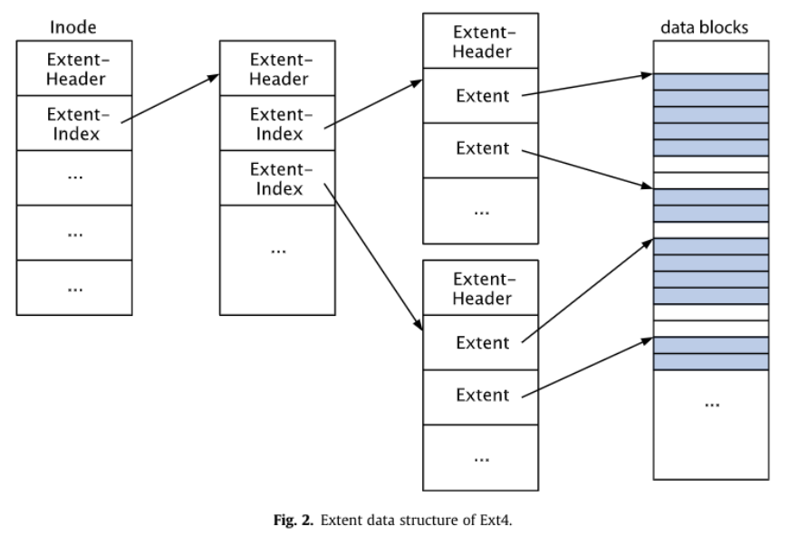

# ext4文件系统

## 在存储设备上的布局

在ext4文件系统中，将多个块划分为一个块组进行管理。其中块组0中存储了超级块等等文件系统相关的元信息。


由于这些信息非常重要，为了防止其因为意外发生而被毁坏，因此在其他块组中，存在有超级块和GDT的冗余备份。
当该属性被开启时，超级块和GDT备份只出现在3，5，7的幂的块上。

例如假设一共有200个块组，则块组1，3，5，7，9，21，27，49，81，125中皆有备份

下图为每个块组中的结构中的布局


如果既不是主超级块组又不是冗余备份块组，则块组以块位图开头。

## ext4 中的数据结构

### ext4_super_block

`struct ext4_super_block`为ext4文件系统原生的超级块结构。在 ext4_super_block 中存储了ext4 文件系统的元信息。在ext4被挂载时会将该结构从磁盘中读取，并将其中内容填入到 `ext4_sb_info` 中。ext4_sb_info 会作为vfs层中 super_block 结构在ext4文件系统中的子类。

```c
struct ext4_super_block {
    /* 文件系统的基础统计信息 */
    __le32 s_inodes_count;            /* inode总数 */
    __le32 s_blocks_count_lo;         /* 块总数 (低32位) */
    __le32 s_r_blocks_count_lo;       /* 预留块的总数 (低32位) */
    __le32 s_free_blocks_count_lo;    /* 空闲块数 (低32位) */

    __le32 s_free_inodes_count;       /* 空闲inode数 */
    __le32 s_first_data_block;        /* 第一个数据块编号 */
    __le32 s_log_block_size;          /* 块大小的对数（块大小 = 1024 << s_log_block_size） */
    __le32 s_obso_log_frag_size;      /* 已弃用的碎片大小 */

    /* 每组的块、碎片、inode等统计信息 */
    __le32 s_blocks_per_group;        /* 每组的块数 */
    __le32 s_obso_frags_per_group;    /* 每组的碎片数 (已弃用) */
    __le32 s_inodes_per_group;        /* 每组的inode数 */
    __le32 s_mtime;                   /* 上次挂载的时间 */

    __le32 s_wtime;                   /* 上次写入的时间 */
    __le16 s_mnt_count;               /* 挂载次数 */
    __le16 s_max_mnt_count;           /* 最大挂载次数 */
    __le16 s_magic;                   /* 文件系统魔数（EXT4_MAGIC） */
    __le16 s_state;                   /* 文件系统状态 */
    __le16 s_errors;                  /* 错误处理行为 */
    __le16 s_minor_rev_level;         /* 文件系统次版本号 */

    /* 文件系统一致性检查相关 */
    __le32 s_lastcheck;               /* 上次检查的时间 */
    __le32 s_checkinterval;           /* 检查间隔时间 */
    __le32 s_creator_os;              /* 文件系统创建的操作系统 */
    __le32 s_rev_level;               /* 文件系统版本 */

    /* 保留块的默认uid和gid */
    __le16 s_def_resuid;              /* 预留块的默认用户id */
    __le16 s_def_resgid;              /* 预留块的默认组id */

    /* 动态超级块特有的字段 */
    __le32 s_first_ino;               /* 第一个非保留的inode */
    __le16 s_inode_size;              /* inode结构的大小 */
    __le16 s_block_group_nr;          /* 该超级块所属的块组编号 */
    __le32 s_feature_compat;          /* 兼容特性集 */

    /* 文件系统特性相关字段 */
    __le32 s_feature_incompat;        /* 不兼容特性集 */
    __le32 s_feature_ro_compat;       /* 只读兼容特性集 */

    /* 文件系统UUID和卷名 */
    __u8 s_uuid[16];                  /* 文件系统的128位UUID */
    char s_volume_name[16];           /* 卷名 */
    char s_last_mounted[64];          /* 最后挂载的目录 */

    /* 压缩和性能优化相关字段 */
    __le32 s_algorithm_usage_bitmap;  /* 压缩算法使用位图 */
    __u8 s_prealloc_blocks;           /* 预分配的块数 */
    __u8 s_prealloc_dir_blocks;       /* 目录的预分配块数 */
    __le16 s_reserved_gdt_blocks;     /* 在线扩展的组描述符保留块数 */

    /* 日志系统相关字段 */
    __u8 s_journal_uuid[16];          /* 日志文件系统的UUID */
    __le32 s_journal_inum;            /* 日志文件的inode号 */
    __le32 s_journal_dev;             /* 日志设备号 */
    __le32 s_last_orphan;             /* 待删除的孤立inode链表的起始inode号 */
    __le32 s_hash_seed[4];            /* 目录HTREE的哈希种子 */
    __u8 s_def_hash_version;          /* 默认的哈希算法版本 */
    __u8 s_reserved_char_pad;
    __le16 s_desc_size;               /* 组描述符的大小 */

    /* 挂载选项和元数据组 */
    __le32 s_default_mount_opts;      /* 默认的挂载选项 */
    __le32 s_first_meta_bg;           /* 第一个元数据块组 */
    __le32 s_mkfs_time;               /* 文件系统创建时间 */
    __le32 s_jnl_blocks[17];          /* 日志inode的备份 */

    /* 64位支持相关字段 */
    __le32 s_blocks_count_hi;         /* 块总数 (高32位) */
    __le32 s_r_blocks_count_hi;       /* 预留块数 (高32位) */
    __le32 s_free_blocks_count_hi;    /* 空闲块数 (高32位) */
    __le16 s_min_extra_isize;         /* 所有inode的最小附加字节数 */
    __le16 s_want_extra_isize;        /* 新inode应保留的附加字节数 */
    __le32 s_flags;                   /* 文件系统的标志 */
    __le16 s_raid_stride;             /* RAID步长 */
    __le16 s_mmp_interval;            /* MMP（多重挂载保护）检查间隔 */
    __le64 s_mmp_block;               /* MMP保护的块号 */
    __le32 s_raid_stripe_width;       /* 所有数据盘上的块数（N * 步长） */
    __u8 s_log_groups_per_flex;       /* FLEX_BG的组大小（对数值） */
    __u8 s_reserved_char_pad2;
    __le16 s_reserved_pad;
    __le64 s_kbytes_written;          /* 文件系统的写入总字节数 */

    __u32 s_reserved[160];            /* 保留空间，用于扩展 */
};
```

通过 vfs 层的 `super_block` 获取 `ext4_sb_info`

```c
//将vfs中的sb结构转换为ext4原生的sb信息
static inline struct ext4_sb_info *EXT4_SB(struct super_block *sb)
{
	return sb->s_fs_info;
}
```

### ext4_group_desc

`struct ext4_group_desc` 为ext4文件系统中的块组描述符，该结构被记录在块组描述符表，即 GDT 区域中。

```c
struct ext4_group_desc {
	__le32	bg_block_bitmap_lo;	/* 块位图的物理块号（低位） */
	__le32	bg_inode_bitmap_lo;	/* inode 位图的物理块号（低位） */
	__le32	bg_inode_table_lo;	/* inode 表的物理块号（低位） */
	__le16	bg_free_blocks_count_lo;/* 空闲块的数量（低位） */
	__le16	bg_free_inodes_count_lo;/* 空闲 inode 的数量（低位） */
	__le16	bg_used_dirs_count_lo;	/* 已使用的目录数量（低位） */
	__le16	bg_flags;		/* 分组描述符标志（如 INODE_UNINIT 等） */
	__u32	bg_reserved[2];		/* 可能用于块/inode 位图的校验和 */
	__le16  bg_itable_unused_lo;	/* 未使用的 inode 数量（低位） */
	__le16  bg_checksum;		/* 校验和（基于超级块 UUID + 组号 + 描述符） */
	__le32	bg_block_bitmap_hi;	/* 块位图的物理块号（高位） */
	__le32	bg_inode_bitmap_hi;	/* inode 位图的物理块号（高位） */
	__le32	bg_inode_table_hi;	/* inode 表的物理块号（高位） */
	__le16	bg_free_blocks_count_hi;/* 空闲块的数量（高位） */
	__le16	bg_free_inodes_count_hi;/* 空闲 inode 的数量（高位） */
	__le16	bg_used_dirs_count_hi;	/* 已使用的目录数量（高位） */
	__le16  bg_itable_unused_hi;    /* 未使用的 inode 数量（高位） */
	__u32	bg_reserved2[3];        /* 预留字段 */
};
```

* bg_block_bitmap_lo 和 bg_block_bitmap_hi 分别存储块位图物理块号的低位和高位。
* bg_inode_bitmap_lo 和 bg_inode_bitmap_hi 分别存储 inode 位图物理块号的低位和高位。
* bg_inode_table_lo 和 bg_inode_table_hi 分别存储 inode 表的物理块号（低位和高位）。
* bg_free_blocks_count_lo 和 bg_free_blocks_count_hi 分别存储该组中空闲块的数量。
* bg_free_inodes_count_lo 和 bg_free_inodes_count_hi 分别存储该组中空闲 inode 的数量。
* bg_used_dirs_count_lo 和 bg_used_dirs_count_hi 存储已分配的目录的数量。
* bg_flags 存储分组描述符的标志位，如 INODE 未初始化等。
* bg_checksum 是基于超级块 UUID、组号和描述符生成的校验和，用于确保数据一致性。

由于传统的实现中，块组描述符表只占用一个块来存储块描述符，假设Ext4的块组描述符大小为64字节文件系统中最多只能有2 ^ 21个块组，也就是文件系统最大为256TB。

为了打破这一限制引入元块组的概念。

### ext4_inode

```c
/**
 * ext4文件系统的原生inode
 * 该结构体中的内容会被填入到ext4_inode_info
 */
struct ext4_inode {
	__le16	i_mode;             /* 文件模式 */
	__le16	i_uid;              /* 低16位的所有者用户ID */
	__le32	i_size_lo;          /* 文件大小（以字节为单位） */
	__le32	i_atime;            /* 最后访问时间 */
	__le32	i_ctime;            /* inode更改时间 */
	__le32	i_mtime;            /* 最后修改时间 */
	__le32	i_dtime;            /* 删除时间 */
	__le16	i_gid;              /* 低16位的组ID */
	__le16	i_links_count;      /* 链接计数 */
	__le32	i_blocks_lo;        /* 块计数 */
	__le32	i_flags;            /* 文件标志 */
	union {
		struct {
			__le32  l_i_version;   /* 版本号 */
		} linux1;
		struct {
			__u32  h_i_translator; /* 翻译器ID（适用于Hurd系统） */
		} hurd1;
		struct {
			__u32  m_i_reserved1;  /* 保留字段（适用于Masix系统） */
		} masix1;
	} osd1;                     /* 操作系统相关字段 1 */
	__le32	i_block[EXT4_N_BLOCKS]; /* 块指针数组 */
	__le32	i_generation;        /* 文件版本（用于NFS） */
	__le32	i_file_acl_lo;       /* 文件ACL */
	__le32	i_size_high;         /* 文件大小（高位） */
	__le32	i_obso_faddr;        /* 废弃的片段地址 */
	union {
		struct {
			__le16	l_i_blocks_high;   /* 块计数（高位） */
			__le16	l_i_file_acl_high; /* 文件ACL（高位） */
			__le16	l_i_uid_high;      /* 用户ID（高位） */
			__le16	l_i_gid_high;      /* 组ID（高位） */
			__u32	l_i_reserved2;     /* 保留字段 */
		} linux2;
		struct {
			__le16	h_i_reserved1;     /* 废弃的片段号/大小 */
			__u16	h_i_mode_high;      /* 模式（高位） */
			__u16	h_i_uid_high;       /* 用户ID（高位） */
			__u16	h_i_gid_high;       /* 组ID（高位） */
			__u32	h_i_author;         /* 作者ID */
		} hurd2;
		struct {
			__le16	h_i_reserved1;     /* 废弃的片段号/大小 */
			__le16	m_i_file_acl_high; /* 文件ACL（高位） */
			__u32	m_i_reserved2[2];  /* 保留字段 */
		} masix2;
	} osd2;                     /* 操作系统相关字段 2 */
	__le16	i_extra_isize;       /* 额外的inode大小 */
	__le16	i_pad1;              /* 填充字段 */
	__le32  i_ctime_extra;      /* 额外的更改时间（纳秒<<2 | 纪元） */
	__le32  i_mtime_extra;      /* 额外的修改时间（纳秒<<2 | 纪元） */
	__le32  i_atime_extra;      /* 额外的访问时间（纳秒<<2 | 纪元） */
	__le32  i_crtime;           /* 文件创建时间 */
	__le32  i_crtime_extra;     /* 额外的文件创建时间（纳秒<<2 | 纪元） */
	__le32  i_version_hi;       /* 64位版本的高32位 */
};
```

通过 vfs 层中的通用inode获取子类 ext4_inode_info 的方法：

```c
static inline struct ext4_inode_info *EXT4_I(struct inode *inode)
{
	return container_of(inode, struct ext4_inode_info, vfs_inode);
}
```

### ext4_dir_entry

`ext4_dir_entry` 结构为ext4文件系统原生的目录项结构。该结构中的内容会被填写转移到 vfs 层中的 dentry 中。

```c
struct ext4_dir_entry {
	__le32	inode;			/* Inode number */
	__le16	rec_len;		/* Directory entry length */
	__le16	name_len;		/* Name length */
	char	name[EXT4_NAME_LEN];	/* File name */
};
```

## extents 索引

Ext4引入了一个新的概念，叫做“Extents”。一个Extents是一个地址连续的数据块(block)的集合。比如一个100MB的文件有可能被分配给一个单独的Extents，这样就不用像Ext3那样新增25600个数据块的记录（一个数据块是4KB）。而超大型文件会被分解在多个extents里。

### extent机制中用到的数据结构

ext4_extent_header 结构，被记录在 inode 的 i_block 成员中。用于描述 Extent 树的根节点

```c
struct ext4_extent_header {
	__le16 eh_magic;      /* 魔数，用于标识Extent Header的格式，EXT4_EXT_MAGIC = 0xF30A */
	__le16 eh_entries;    /* 当前节点中的有效条目数（extent或索引节点的数量） */
	__le16 eh_max;        /* 当前节点能够容纳的最大条目数 */
	__le16 eh_depth;      /* 这棵树的深度。0表示叶子节点，非0表示有索引节点 */
	__le32 eh_generation; /* Extent树的版本号或代数，用于版本控制或调试 */
};
```

节点中存放的 ext4_extent_header 数据之后都是很多entry(即表项)，每个 entry 大小为 12 bytes。如果是非叶子节点(所谓非叶子节点，即 ext4_extent_header -> eh_depth > 0)，每个entry中存放是index数据，由struct ext4_extent_idx描述，每一个 entry 索引都指向一个extent block；如果是叶子节点(所谓叶子节点，即ext4_extent_header -> eh_depth =0)，每个 entry 都是指向一个 extent ，由 struct ext4_extent 描述。

ext4_extent 描述一个 extent 树中的叶子节点。这个一个 ext4_extent 可以代表指定大小的物理块。其中的大小由 ee_len 成员指定。

```c
struct ext4_extent {
	__le32 ee_block;    /* 逻辑块号，表示extent覆盖的第一个逻辑块 */
	__le16 ee_len;      /* extent覆盖的块数。如果值小于32768，则表示普通块数，如果大于32768，则表示这是一个uninitialized extent */
	__le16 ee_start_hi; /* 物理块号的高16位，表示extent实际存储数据的物理块号高位 */
	__le32 ee_start_lo; /* 物理块号的低32位，表示extent实际存储数据的物理块号低位 */
};
```

ext4_extent_idx 描述一个 extent 树中的非叶子节点。ext4_extent_idx 是一个间接索引结构，指向下一级的开，即 ext4_extent_header 结构。在 ei_leaf 指向的物理块中，在该物理块中存储了多个 ext4_extent_idx 结构或 ext4_extent。

```c
struct ext4_extent_idx {
	__le32	ei_block;	/* 该索引覆盖从 'block' 开始的逻辑块 */
	__le32	ei_leaf_lo;	/* 指向下一层的物理块的指针，可以是叶子节点或下一个索引 */
	__le16	ei_leaf_hi;	/* 物理块地址的高 16 位 */
	__u16	ei_unused;	/* 保留字段，未使用 */
};
```

ext4_ext_path 用来记录在查找过程中产生的数据

```c
/*
 * 表示 inode 的 extent 树中的一个路径。
 * 这个结构体用于遍历和定位 extent 以及索引节点。
 */
struct ext4_ext_path {
	ext4_fsblk_t			p_block;  // 当前树层级的物理块号
	__u16				p_depth;  // 该路径在树中的深度
	struct ext4_extent		*p_ext;   // 指向 extent 入口（对索引节点为 NULL）
	struct ext4_extent_idx		*p_idx;   // 指向索引入口（对叶子节点为 NULL）
	struct ext4_extent_header	*p_hdr;   // 当前层级的 extent 头部指针
	struct buffer_head		*p_bh;    // 当前块的 buffer head 指针
};
```

iblock 中存储的 extent 结构


### 初始化 extent

每一个inode都有自己的 extent 树，在创建 inode 的时候会对

```c
int ext4_ext_tree_init(handle_t *handle, struct inode *inode)
{
    struct ext4_extent_header *eh;

    // 获取inode中保存的ext4_extent_header结构体
    eh = ext_inode_hdr(inode);

    // 初始化extent树的头部，设置树的深度为0
    eh->eh_depth = 0;                // 树的深度，0表示叶子节点
    eh->eh_entries = 0;              // 当前的extent条目数为0
    eh->eh_magic = EXT4_EXT_MAGIC;   // 设置扩展树的魔数，确保它是一个有效的extent树
    eh->eh_max = cpu_to_le16(ext4_ext_space_root(inode, 0)); // 设置最大条目数，取决于inode类型

    // 标记inode为已修改，便于后续的写回操作
    ext4_mark_inode_dirty(handle, inode);

    // 使得extent cache失效，确保后续操作不会使用过时的缓存数据
    ext4_ext_invalidate_cache(inode);

    return 0; // 成功返回
}
```

### 查找 extent 中的块

extent 机制下通过逻辑块号寻找一个物理块，入口函数为 `ext4_ext_find_extent`。

其中逻辑块号是指在一个数据块在文件中的偏移。extent 项按照逻辑块号即`ext4_extent_idx->ei_block` 从小到大在数组中排布。



```c
/*
 * 查找指定逻辑块号在 extent 树中的对应 extent 节点。
 *
 * 参数:
 * inode   - 指向操作的 inode 结构体。
 * block   - 逻辑块号，用于查找对应的 extent。
 * path    - 指向 ext4_ext_path 结构的指针，用于保存遍历树的路径。
 *           如果为 NULL，会动态分配路径内存。
 *
 * 返回值:
 * 如果成功，返回一个指向路径结构 ext4_ext_path 的指针；
 * 如果失败，返回一个错误指针（如 -ENOMEM 或 -EIO）。
 */
struct ext4_ext_path *
ext4_ext_find_extent(struct inode *inode, ext4_lblk_t block,
					struct ext4_ext_path *path)
{
	struct ext4_extent_header *eh;  // 扩展头部指针
	struct buffer_head *bh;         // 缓存的块头
	short int depth, i, ppos = 0, alloc = 0;

	eh = ext_inode_hdr(inode);      // 获取 inode 的扩展头部
	depth = ext_depth(inode);       // 获取 extent 树的深度

	/* 处理可能的深度增加情况，动态分配路径数组 */
	if (!path) {
		path = kzalloc(sizeof(struct ext4_ext_path) * (depth + 2),
				GFP_NOFS);   // 分配路径存储结构
		if (!path)
			return ERR_PTR(-ENOMEM);  // 如果内存分配失败，返回错误指针
		alloc = 1;  // 标记已分配内存
	}
	path[0].p_hdr = eh;  // 初始化路径的第一层
	path[0].p_bh = NULL; // 根节点不在块设备中，因此 p_bh 为空

	i = depth;
	/* 遍历 extent 树 */
	while (i) {
		int need_to_validate = 0;  // 标记是否需要验证 extent 数据

		ext_debug("depth %d: num %d, max %d\n",
			  ppos, le16_to_cpu(eh->eh_entries), le16_to_cpu(eh->eh_max));

		/* 二分查找对应索引块中的节点 */
		ext4_ext_binsearch_idx(inode, path + ppos, block);
		path[ppos].p_block = idx_pblock(path[ppos].p_idx);  // 获取物理块号
		path[ppos].p_depth = i;  // 更新当前层的深度
		path[ppos].p_ext = NULL; // 索引块中不直接存储 extent

		/* 获取物理块的 buffer_head */
		bh = sb_getblk(inode->i_sb, path[ppos].p_block);
		if (unlikely(!bh))  // 如果无法获取块，跳转到错误处理
			goto err;
		/* 检查块是否已加载，如果没有则加载块数据 */
		if (!bh_uptodate_or_lock(bh)) {
			if (bh_submit_read(bh) < 0) {  // 读取失败时释放 buffer 并跳转到错误处理
				put_bh(bh);
				goto err;
			}
			/* 需要验证 extent 的数据是否有效 */
			need_to_validate = 1;
		}
		eh = ext_block_hdr(bh);  // 获取新的扩展头部
		ppos++;  // 进入下一层
		if (unlikely(ppos > depth)) {  // 检查路径深度是否超限
			put_bh(bh);
			EXT4_ERROR_INODE(inode,
					 "ppos %d > depth %d", ppos, depth);
			goto err;
		}
		path[ppos].p_bh = bh;  // 更新当前路径的 buffer_head
		path[ppos].p_hdr = eh; // 更新当前路径的扩展头部
		i--;

		/* 如果需要验证 extent 数据，调用验证函数 */
		if (need_to_validate && ext4_ext_check(inode, eh, i))
			goto err;
	}

	/* 到达叶节点层，设置当前层深度并初始化路径中的索引和扩展指针 */
	path[ppos].p_depth = i;
	path[ppos].p_ext = NULL;
	path[ppos].p_idx = NULL;

	/* 查找包含该逻辑块号的 extent */
	ext4_ext_binsearch(inode, path + ppos, block);
	/* 如果找到非空叶节点，将其物理块号更新到路径结构 */
	if (path[ppos].p_ext)
		path[ppos].p_block = ext_pblock(path[ppos].p_ext);

	/* 显示当前的路径信息（用于调试） */
	ext4_ext_show_path(inode, path);

	return path;

err:
	/* 如果发生错误，释放路径的引用和已分配的内存 */
	ext4_ext_drop_refs(path);
	if (alloc)
		kfree(path);
	return ERR_PTR(-EIO);  // 返回 I/O 错误指针
}
```

在函数 `ext4_ext_find_extent` 中按照树的层级自上而下对逻辑块号进行查找。对于每一层级的查找，则使用二分查找的方式对逻辑块号进行查找。

```c
/*
 * ext4_ext_binsearch_idx:
 * 在给定块号的位置进行二分查找，以找到最接近的索引节点。
 * 在调用此函数之前必须检查 header。
 */
static void
ext4_ext_binsearch_idx(struct inode *inode,
			struct ext4_ext_path *path, ext4_lblk_t block)
{
	struct ext4_extent_header *eh = path->p_hdr;  // 当前层级的 extent 头部
	struct ext4_extent_idx *r, *l, *m;             // 指向索引节点的指针

	ext_debug("binsearch for %u(idx):  ", block);

	// 初始化左右指针
	l = EXT_FIRST_INDEX(eh) + 1;  // 左指针，指向第一个索引节点之后的位置
	r = EXT_LAST_INDEX(eh);       // 右指针，指向最后一个索引节点

	while (l <= r) {
		m = l + (r - l) / 2;  // 计算中间节点
		if (block < le32_to_cpu(m->ei_block))
			r = m - 1;  // 如果块号小于中间节点的块号，向左侧收缩查找范围
		else
			l = m + 1;  // 否则，向右侧收缩查找范围

		// 调试信息：输出当前查找范围和中间节点的块号
		ext_debug("%p(%u):%p(%u):%p(%u) ", l, le32_to_cpu(l->ei_block),
				m, le32_to_cpu(m->ei_block),
				r, le32_to_cpu(r->ei_block));
	}

	// 找到的索引节点位置
	path->p_idx = l - 1;  // l 指向的索引节点为可能的匹配节点，取 l - 1
	ext_debug("  -> %d->%lld ", le32_to_cpu(path->p_idx->ei_block),
		  idx_pblock(path->p_idx));
}
```

## ext4中的块分配机制

当磁盘上的物理存储位置被分散成许多小块，而不是连续存储时会引起一系列性能问题。频繁的磁头移动会增加磁盘寻址时间，减少磁盘寿命...

为了防止磁盘碎片的产生，ext4中引入了一些防范机制

### mballoc多块分配器

* 采取buddy算法管理每个block group
* 采用prellocation机制，分为per-cpu local preallocation（小文件）和per inode preallocation（大文件）
* block分配时，会比请求的分配数量更多，多余的空间会放入preallocation space，这样给write多留些空间，避免concurrent write时候碎片化
* 计算目标goal phsycial block，尽量保持块分配的连续性
