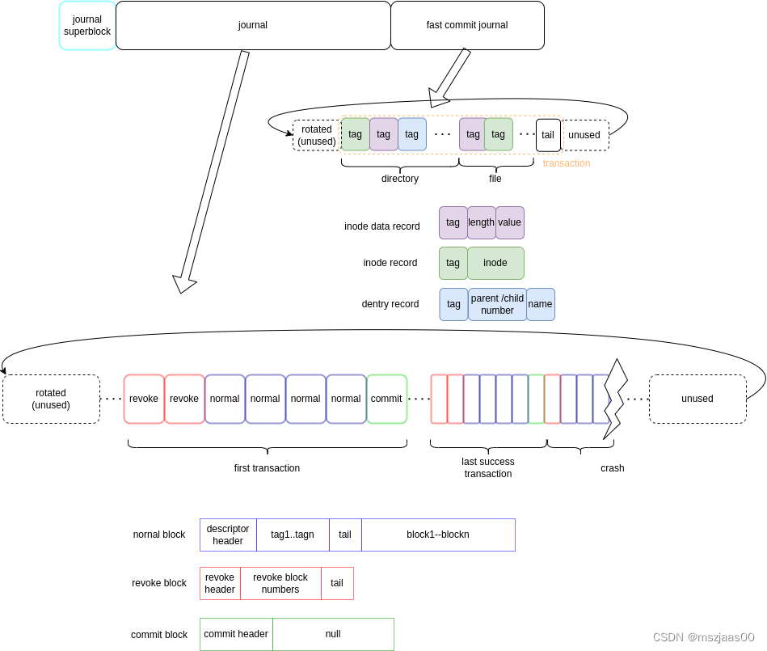

# ext4文件系统

## 在存储设备上的布局

在ext4文件系统中，将多个块划分为一个块组进行管理。其中块组0中存储了超级块等等文件系统相关的元信息。



由于这些信息非常重要，为了防止其因为意外发生而被毁坏，因此在其他块组中，存在有超级块和GDT的冗余备份。
当该属性被开启时，超级块和GDT备份只出现在3，5，7的幂的块上。

例如假设一共有200个块组，则块组1，3，5，7，9，21，27，49，81，125中皆有备份

下图为每个块组中的结构中的布局


如果既不是主超级块组又不是冗余备份块组，则块组以块位图开头。

### ext4_super_block

`struct ext4_super_block`为ext4文件系统原生的超级块结构。


### ext4_group_desc

`struct ext4_group_desc`为ext4文件系统中的块组描述符表

```c
struct ext4_group_desc
{
	__le32	bg_block_bitmap_lo;	/* Blocks bitmap block */
	__le32	bg_inode_bitmap_lo;	/* Inodes bitmap block */
	__le32	bg_inode_table_lo;	/* Inodes table block */
	__le16	bg_free_blocks_count_lo;/* Free blocks count */
	__le16	bg_free_inodes_count_lo;/* Free inodes count */
	__le16	bg_used_dirs_count_lo;	/* Directories count */
	__le16	bg_flags;		/* EXT4_BG_flags (INODE_UNINIT, etc) */
	__u32	bg_reserved[2];		/* Likely block/inode bitmap checksum */
	__le16  bg_itable_unused_lo;	/* Unused inodes count */
	__le16  bg_checksum;		/* crc16(sb_uuid+group+desc) */
	__le32	bg_block_bitmap_hi;	/* Blocks bitmap block MSB */
	__le32	bg_inode_bitmap_hi;	/* Inodes bitmap block MSB */
	__le32	bg_inode_table_hi;	/* Inodes table block MSB */
	__le16	bg_free_blocks_count_hi;/* Free blocks count MSB */
	__le16	bg_free_inodes_count_hi;/* Free inodes count MSB */
	__le16	bg_used_dirs_count_hi;	/* Directories count MSB */
	__le16  bg_itable_unused_hi;    /* Unused inodes count MSB */
	__u32	bg_reserved2[3];
};
```

## ext4中的块分配机制

当磁盘上的物理存储位置被分散成许多小块，而不是连续存储时会引起一系列性能问题。频繁的磁头移动会增加磁盘寻址时间，减少磁盘寿命...

为了防止磁盘碎片的产生，ext4中引入了一些防范机制

### mballoc多块分配器

* 采取buddy算法管理每个block group
* 采用prellocation机制，分为per-cpu local preallocation（小文件）和per inode preallocation（大文件）
* block分配时，会比请求的分配数量更多，多余的空间会放入preallocation space，这样给write多留些空间，避免concurrent write时候碎片化
* 计算目标goal phsycial block，尽量保持块分配的连续性
