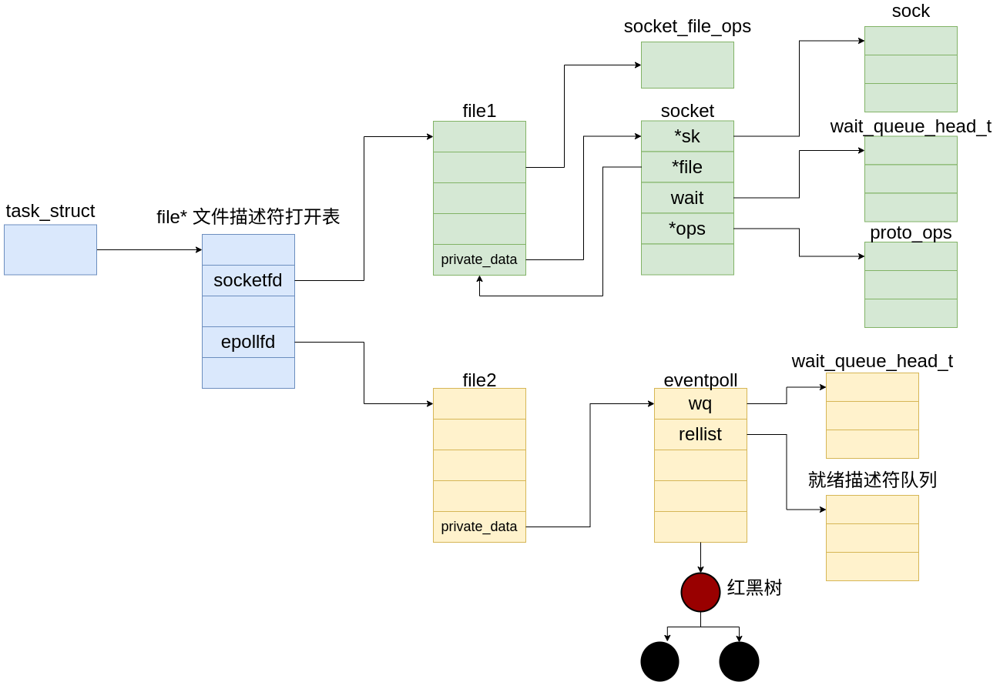
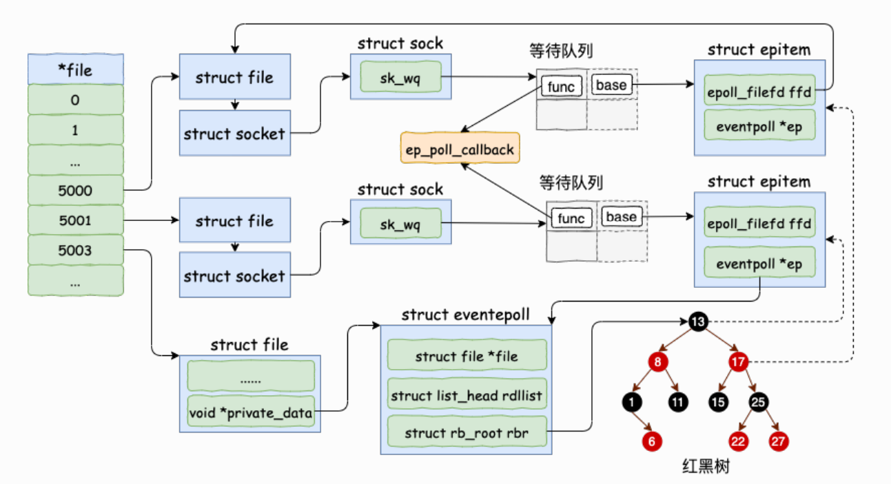
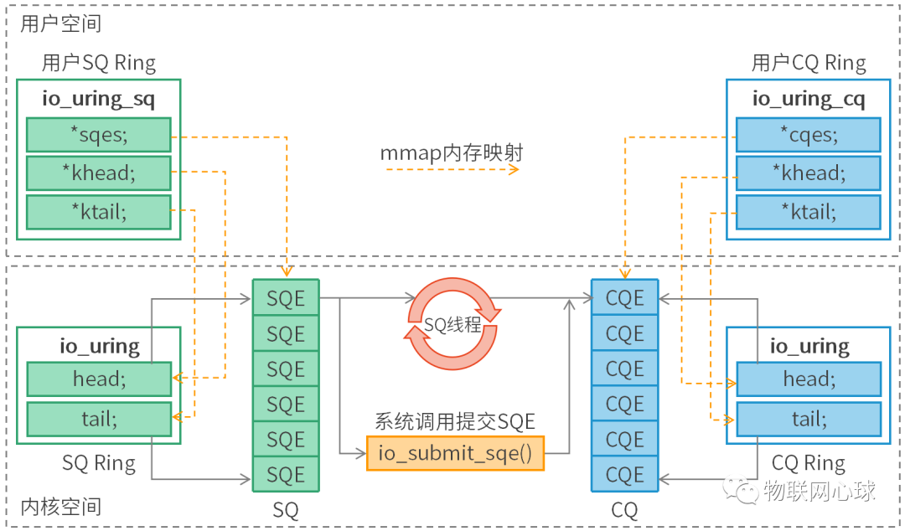

# 异步机制

## epoll

epoll 是 Linux 内核中用于处理大量文件描述符事件的 I/O 多路复用机制，采取时分复用的思想，特别适合高并发场景下的事件驱动网络应用。它通过监控多个文件描述符（如 socket）的 I/O 事件，实现高效的事件通知机制。



对于epoll多路复用机制有三种操作，分别为：

* epoll_create：创建一个 epoll 结构。
* epoll_ctl：向 epoll 中注册/删除一个文件描述符。
* epoll_wait：对文件描述符进行监听。

### socket

一个socket结构被以文件的方式进行打开，对于一个 socketfd 对应的 file 结构中的私有指针会指向socket结构。一个socket文件一般会位于 proc/pid/fd 路径下。

```c
struct socket {
	socket_state		state;//记录socket状态
	kmemcheck_bitfield_begin(type);
	short			type;//socket类型，tcp？udp？
	kmemcheck_bitfield_end(type);
	unsigned long		flags;

	struct fasync_struct	*fasync_list;
	wait_queue_head_t	wait;

	struct file		*file;//socket对应的文件结构
	struct sock		*sk;//指向 `sock` 结构体，表示与 socket 相关联的底层传输层（如 TCP 或 UDP）的具体实现。
	const struct proto_ops	*ops;//对socket所绑定端口的操作方法
};
```

`socket_state`用于记录 socket 的状态

```c
typedef enum {
    SS_FREE = 0,            /* 没有分配。表示 socket 结构体还未分配，处于空闲状态。*/
    SS_UNCONNECTED,         /* 未连接状态。表示 socket 已创建，但尚未与任何远程端点连接。对于服务器，这意味着尚未调用 `listen()`；对于客户端，还没有调用 `connect()`。*/
    SS_CONNECTING,          /* 正在连接中。表示 socket 正在尝试连接到远程主机，对于客户端，可能是正在调用 `connect()` 操作时的状态。*/
    SS_CONNECTED,           /* 已连接状态。表示 socket 已成功连接到远程端点。对于客户端，表示 `connect()` 完成；对于服务器，表示接受了一个客户端连接（通过 `accept()`）。*/
    SS_DISCONNECTING        /* 正在断开连接。表示 socket 正在断开与远程机的连接。该状态通常在调用关闭连接的操作（如 `close()` 或 `shutdown()`）时出现。*/
} socket_state;

```

wait_queue_head_t wait 记录了在此 socket 结构上等待的进程，也就是说多个进程可以使用一个 socket 。

sock sk 该字段是操作 socket 的核心，管理数据传输、连接状态等。

```c
struct sock {
	/*
	 * Now struct inet_timewait_sock also uses sock_common, so please just
	 * don't add nothing before this first member (__sk_common) --acme
	 */
	struct sock_common	__sk_common;
#define sk_node			__sk_common.skc_node
#define sk_nulls_node		__sk_common.skc_nulls_node
#define sk_refcnt		__sk_common.skc_refcnt
#define sk_tx_queue_mapping	__sk_common.skc_tx_queue_mapping

#define sk_copy_start		__sk_common.skc_hash
#define sk_hash			__sk_common.skc_hash
#define sk_family		__sk_common.skc_family
#define sk_state		__sk_common.skc_state
#define sk_reuse		__sk_common.skc_reuse
#define sk_bound_dev_if		__sk_common.skc_bound_dev_if
#define sk_bind_node		__sk_common.skc_bind_node
#define sk_prot			__sk_common.skc_prot
#define sk_net			__sk_common.skc_net
	kmemcheck_bitfield_begin(flags);
	unsigned int		sk_shutdown  : 2,
				sk_no_check  : 2,
				sk_userlocks : 4,
				sk_protocol  : 8,
				sk_type      : 16;
	kmemcheck_bitfield_end(flags);
	int			sk_rcvbuf;
	socket_lock_t		sk_lock;
	/*
	 * The backlog queue is special, it is always used with
	 * the per-socket spinlock held and requires low latency
	 * access. Therefore we special case it's implementation.
	 */
	struct {
		struct sk_buff *head;
		struct sk_buff *tail;
		int len;
		int limit;
	} sk_backlog;
	wait_queue_head_t	*sk_sleep;
	struct dst_entry	*sk_dst_cache;
#ifdef CONFIG_XFRM
	struct xfrm_policy	*sk_policy[2];
#endif
	rwlock_t		sk_dst_lock;
	atomic_t		sk_rmem_alloc;
	atomic_t		sk_wmem_alloc;
	atomic_t		sk_omem_alloc;
	int			sk_sndbuf;
	struct sk_buff_head	sk_receive_queue;
	struct sk_buff_head	sk_write_queue;
#ifdef CONFIG_NET_DMA
	struct sk_buff_head	sk_async_wait_queue;
#endif
	int			sk_wmem_queued;
	int			sk_forward_alloc;
	gfp_t			sk_allocation;
	int			sk_route_caps;
	int			sk_gso_type;
	unsigned int		sk_gso_max_size;
	int			sk_rcvlowat;
	unsigned long 		sk_flags;
	unsigned long	        sk_lingertime;
	struct sk_buff_head	sk_error_queue;
	struct proto		*sk_prot_creator;
	rwlock_t		sk_callback_lock;
	int			sk_err,
				sk_err_soft;
	atomic_t		sk_drops;
	unsigned short		sk_ack_backlog;
	unsigned short		sk_max_ack_backlog;
	__u32			sk_priority;
	struct ucred		sk_peercred;
	long			sk_rcvtimeo;
	long			sk_sndtimeo;
	struct sk_filter      	*sk_filter;
	void			*sk_protinfo;
	struct timer_list	sk_timer;
	ktime_t			sk_stamp;
	struct socket		*sk_socket;
	void			*sk_user_data;
	struct page		*sk_sndmsg_page;
	struct sk_buff		*sk_send_head;
	__u32			sk_sndmsg_off;
	int			sk_write_pending;
#ifdef CONFIG_SECURITY
	void			*sk_security;
#endif
	__u32			sk_mark;
	/* XXX 4 bytes hole on 64 bit */
	void			(*sk_state_change)(struct sock *sk);
	void			(*sk_data_ready)(struct sock *sk, int bytes);
	void			(*sk_write_space)(struct sock *sk);
	void			(*sk_error_report)(struct sock *sk);
  	int			(*sk_backlog_rcv)(struct sock *sk,
						  struct sk_buff *skb);  
	void                    (*sk_destruct)(struct sock *sk);
};
```

* __sk_common: 通用的 socket 信息，包括节点、哈希值、协议族、状态等。
* sk_shutdown: 关闭标志，表示 socket 的关闭状态。
* sk_rcvbuf 和 sk_sndbuf: 分别表示接收和发送缓冲区的大小。
* sk_receive_queue 和 sk_write_queue: 分别用于存储接收到的数据包和待发送的数据包。
* sk_err: 表示当前 socket 的错误状态。
* sk_state_change、sk_data_ready、sk_write_space、sk_error_report: 一些回调函数，用于处理状态变化、数据准备就绪、写空间可用和错误报告等事件。
* sk_mark: 用于标记信息，通常在路由选择时使用。

在2.6版本的代码中sock中并无sk_wq成员。但该成员也有重要的作用。

```c
struct socket_wq {
	/* Note: wait MUST be first field of socket_wq */
	wait_queue_head_t	wait;           // 等待队列头，用于同步和等待事件（如读写操作）。
	struct fasync_struct	*fasync_list;   // 用于异步通知（fasync）的链表，常用于信号机制来通知进程异步 I/O 事件。
	unsigned long		flags;          // 标志位，表示 socket 的异步状态，如 %SOCKWQ_ASYNC_NOSPACE 等。
	struct rcu_head		rcu;            // RCU (Read-Copy-Update) 头部，用于在高并发环境中安全更新 socket_wq 结构。
} ____cacheline_aligned_in_smp;           // 在多处理器 (SMP) 系统中，强制将结构体对齐到缓存行边界，避免多核访问冲突，提高性能。
```

该成员与socket结构中的 wait 成员都为等待队列，那么他们之间又有什么区别与联系？

在 Linux 内核网络子系统中，sock 结构和 socket 结构分别对应于不同层次的抽象对象，而它们中的 socket_wq 和 wait 成员都是用于处理异步事件和进程等待机制的，但它们的用途、层次以及与系统组件的交互方式有所不同。

sock 结构体是内核中的低层结构，负责管理与传输协议、网络栈相关的细节，sock 结构体中的 socket_wq 负责处理与 socket 相关的所有异步 I/O 事件和通知，包括通过 fasync 机制通知进程异步事件。而 socket 结构中的 wait 则是面向用户，主要用于记录等待着在该 socket 上的进程线程，负责用户空间的等待和同步。

proto_ops  *ops 是一个指向操作函数指针表的指针。这个字段定义了 socket 的操作行为，比如`connect`、`accept`、`sendmsg` 和 `recvmsg` 等操作。这是 socket API 的核心，不同协议栈（如 TCP、UDP）会有不同的实现。

```c
struct proto_ops {
	int		family;
	struct module	*owner;
	int		(*release)   (struct socket *sock);
	int		(*bind)	     (struct socket *sock,struct sockaddr *myaddr,int sockaddr_len);
	int		(*connect)   (struct socket *sock,struct sockaddr *vaddr,int sockaddr_len, int flags);
	int		(*socketpair)(struct socket *sock1,struct socket *sock2);
	int		(*accept)    (struct socket *sock,struct socket *newsock, int flags);
	int		(*getname)   (struct socket *sock,struct sockaddr *addr,int *sockaddr_len, int peer);
	unsigned int	(*poll)	     (struct file *file, struct socket *sock,struct poll_table_struct *wait);
	int		(*ioctl)     (struct socket *sock, unsigned int cmd,unsigned long arg);
#ifdef CONFIG_COMPAT
	int	 	(*compat_ioctl) (struct socket *sock, unsigned int cmd,unsigned long arg);
#endif
	int		(*listen)    (struct socket *sock, int len);
	int		(*shutdown)  (struct socket *sock, int flags);
	int		(*setsockopt)(struct socket *sock, int level,int optname, char __user *optval, unsigned int optlen);
	int		(*getsockopt)(struct socket *sock, int level,int optname, char __user *optval, int __user *optlen);
#ifdef CONFIG_COMPAT
	int		(*compat_setsockopt)(struct socket *sock, int level,int optname, char __user *optval, unsigned int optlen);
	int		(*compat_getsockopt)(struct socket *sock, int level,int optname, char __user *optval, int __user *optlen);
#endif
	int		(*sendmsg)   (struct kiocb *iocb, struct socket *sock,struct msghdr *m, size_t total_len);
	int		(*recvmsg)   (struct kiocb *iocb, struct socket *sock,struct msghdr *m, size_t total_len,int flags);
	int		(*mmap)	     (struct file *file, struct socket *sock,struct vm_area_struct * vma);
	ssize_t		(*sendpage)  (struct socket *sock, struct page *page,int offset, size_t size, int flags);
	ssize_t 	(*splice_read)(struct socket *sock,  loff_t *ppos, struct pipe_inode_info *pipe, size_t len, unsigned int flags);
};
```

### eventpoll

```c
struct eventpoll {
    spinlock_t lock;  
    struct mutex mtx;
    wait_queue_head_t wq;
    wait_queue_head_t poll_wait;//等待队列
    struct list_head rdllist;
    struct rb_root rbr;
    struct epitem *ovflist;
    struct user_struct *user;
};
```

* wq： 等待队列链表。软中断数据就绪的时候会通过 wq 来找到阻塞在 epoll 对象上的⽤户进程。
* rbr： ⼀棵红⿊树。为了⽀持对海量连接的⾼效查找、插⼊和删除，eventpoll 内部使⽤了⼀棵红⿊树。通过这棵树来管理⽤户进程下添加进来的所有 socket 连接。
* rdllist： 就绪的描述符的链表。当有的连接就绪的时候，内核会把就绪的连接放到 rdllist链表⾥。这样应⽤进程只需要判断链表就能找出就绪进程，⽽不⽤去遍历整棵树。

这个 epitem 结构是干什么用的呢？

每当我们调用 epoll_ctl 增加一个 fd 时，内核就会为我们创建出一个 epitem 实例，并且把这个实例作为红黑树的一个子节点，增加到 eventpoll 结构体中的红黑树中，对应的字段是 rbr。这之后，查找每一个 fd 上是否有事件发生都是通过红黑树上的 epitem 来操作。epitem 将监听的 socket 结构与注册的 eventpoll 结构关联到一起，将 epollfd 添加到这三个socket的等待队列中。当被监听的 socket 中有数据来临时，在中断回调程序中会将 socket 添加到epoll的就绪队列中。

```c
struct epitem {
	struct rb_node rbn;  // 红黑树节点，用于将此结构链接到 eventpoll 的红黑树中。
	struct list_head rdllink;  // 链表头，用于将此结构链接到 eventpoll 的就绪列表。
	struct epitem *next;  // 指向下一个 epitem 的指针，与 eventpoll 的 ovflist 协同工作，维护一个单向链表。
	struct epoll_filefd ffd;  // 该项所引用的文件描述符信息。
	int nwait;  // 附加到 poll 操作的活动等待队列数量。
	struct list_head pwqlist;  // 包含 poll 等待队列的链表。
	struct eventpoll *ep;  // 指向包含此项的 eventpoll 结构体的指针。
	struct list_head fllink;  // 链表头，用于将此项链接到 "struct file" 项目列表中。
	struct epoll_event event;  // 描述感兴趣的事件和源文件描述符的结构体。
};
```

由上面的代码可知 epitem 可能被链接在 红黑树 就绪链表 和 ovflist 链表上。那么这三者间又有什么区别与联系？

* struct rb_node rbn
  
  用于将当前 epitem 结构链接到 eventpoll 的红黑树中。
  当有新的文件描述符需要监视或某个文件描述符的事件发生时，相关的 epitem 会被插入红黑树中，确保事件的有序管理。

* struct list_head rdllink
  
  用于将当前 epitem 结构链接到 eventpoll 的就绪列表即 rdllist 中。当一个或多个事件就绪时，这些事件会被添加到就绪列表中，以便在用户调用 epoll_wait() 时，可以高效地返回这些就绪事件。

* struct epitem *next
  
  用于维护一个单向链表，专门处理在将就绪事件传递给用户空间时可能发生的溢出事件。由于一次只能向用户空间传递有限数量的事件，溢出的事件将会链接在这个列表中，以备后续处理。

### epoll_create

在⽤户进程调⽤ epoll_create 时，内核会创建⼀个 struct eventpoll 的内核对象。并同样把它关联到当前进程的已打开⽂件列表中。

在 file 结构的私有指针域中会指向这个被创建的 eventpoll 上。

```c
static int ep_alloc(struct eventpoll **pep)
{
	int error;
	struct user_struct *user;
	struct eventpoll *ep;

	user = get_current_user();
	error = -ENOMEM;
	ep = kzalloc(sizeof(*ep), GFP_KERNEL);
	if (unlikely(!ep))
		goto free_uid;

	spin_lock_init(&ep->lock);
	mutex_init(&ep->mtx);
	init_waitqueue_head(&ep->wq);
	init_waitqueue_head(&ep->poll_wait);
	INIT_LIST_HEAD(&ep->rdllist);
	ep->rbr = RB_ROOT;
	ep->ovflist = EP_UNACTIVE_PTR;
	ep->user = user;
	*pep = ep;
	return 0;
free_uid:
	free_uid(user);
	return error;
}
```

### epoll_ctl

1. 分配⼀个红⿊树节点对象 epitem，
2. 添加等待事件到 socket 的等待队列中，其回调函数是 ep_poll_callback
3. 将 epitem 插⼊到 epoll 对象的红⿊树⾥

通过 epoll_ctl 添加两个 socket 以后，这些内核数据结构最终在进程中的关系图⼤致如下：



以下为等待队列的结构。

```c
struct __wait_queue {
	unsigned int flags;
#define WQ_FLAG_EXCLUSIVE	0x01
	void *private;
	wait_queue_func_t func;//等待队列的回调函数
	struct list_head task_list;
};
```

### epoll_wait

当调用 wait 后，调用 epoll_wait 的进程会进入到休眠状态，直到监听的 socket 即注册在epoll树上的 socket 上因为有操作发生而被回调函数唤醒。

epoll 机制虽然用于时间的异步处理，但就其本身来说是同步的。因为在用户态线程调用epoll_wait之后，就需要将该线程阻塞，来等待事件到来之后再将用户线程唤醒。能实现异步操作是因为有多个线程对一个事件进行处理，对于单个线程本身依旧会被阻塞。

而对于 aio 与 io_uring 来说因为其使用了信号对于用户态进行通知，因此在用户态将事件提交到内核态之后，线程可以继续运行并不会被阻塞。

## aio

## io_uring

### 与 aio 之间的区别

在设计上是真正异步的（truly asynchronous）。只要 设置了合适的 flag，它在系统调用上下文中就只是将请求放入队列， 不会做其他任何额外的事情，保证了应用永远不会阻塞。

支持任何类型的 I/O：cached files、direct-access files 甚至 blocking sockets。

由于设计上就是异步的（async-by-design nature），因此无需 poll+read/write 来处理 sockets。 只需提交一个阻塞式读（blocking read），请求完成之后，就会出现在 completion ring。

灵活、可扩展：基于 io_uring 甚至能重写（re-implement）Linux 的每个系统调用。




