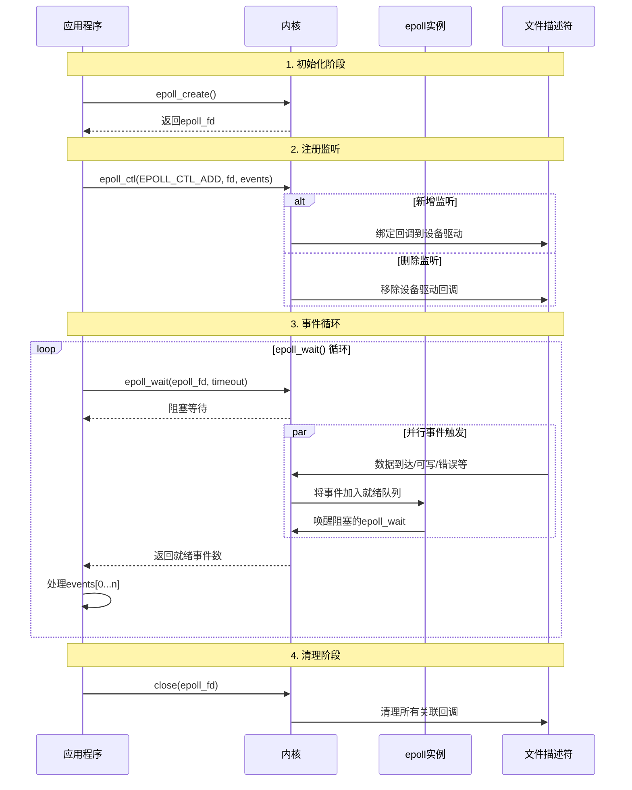
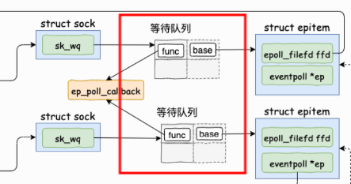
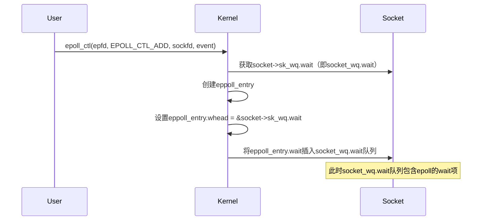
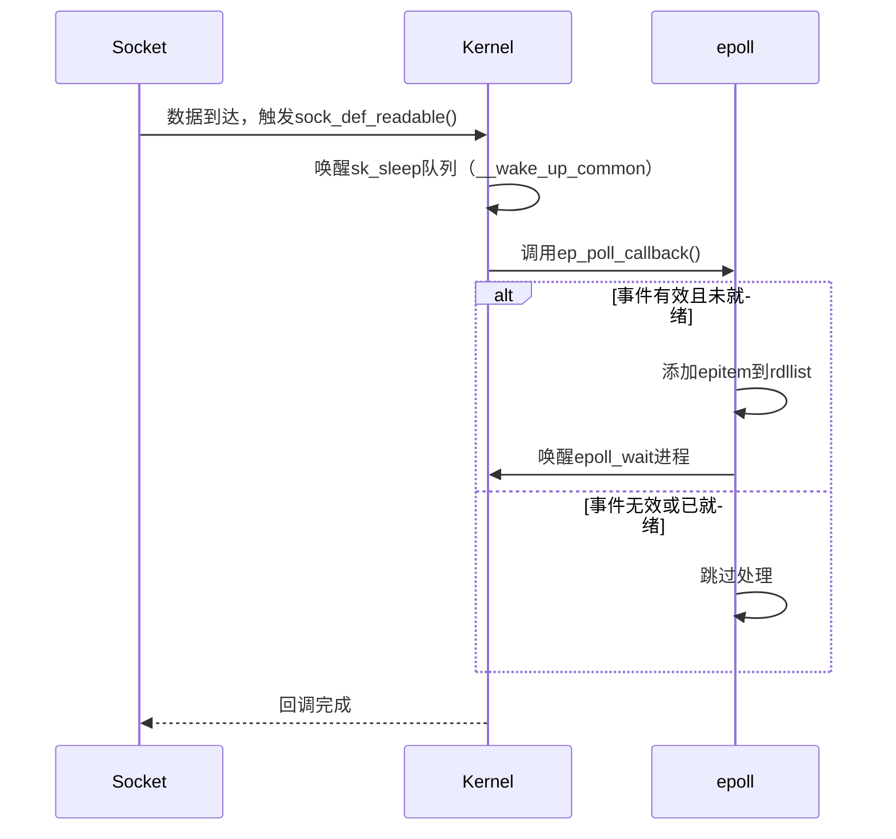
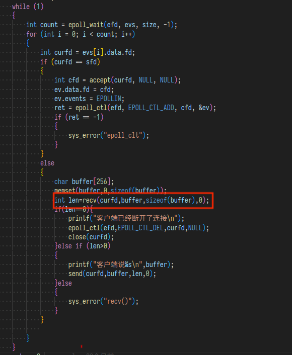
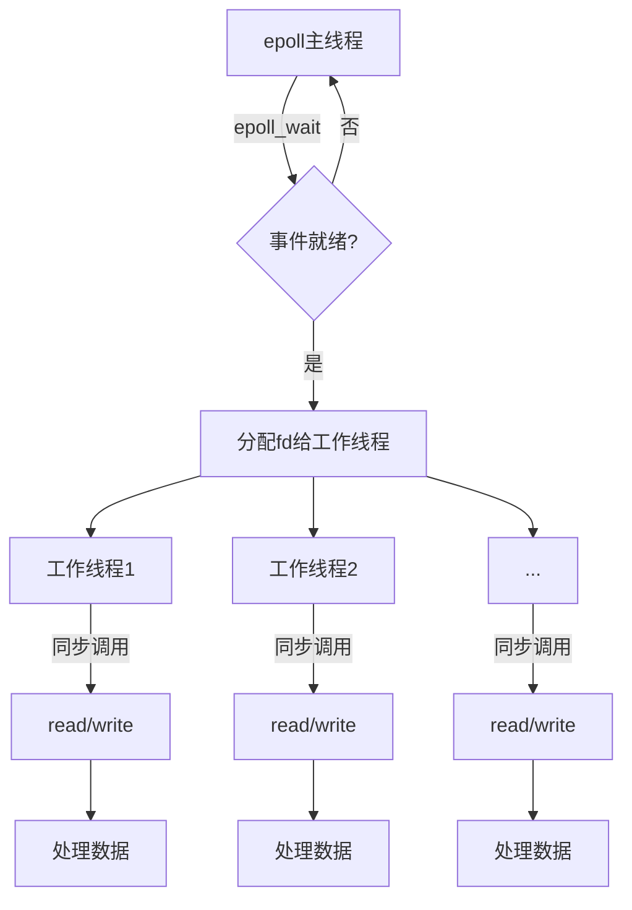
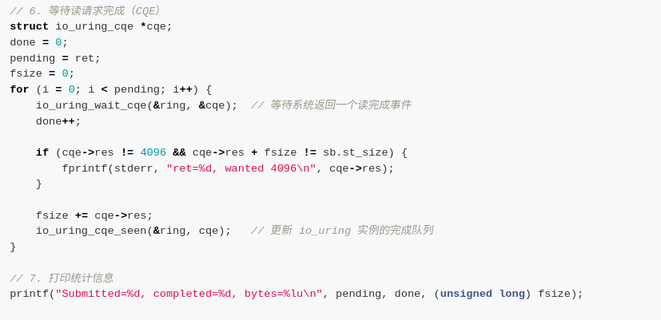
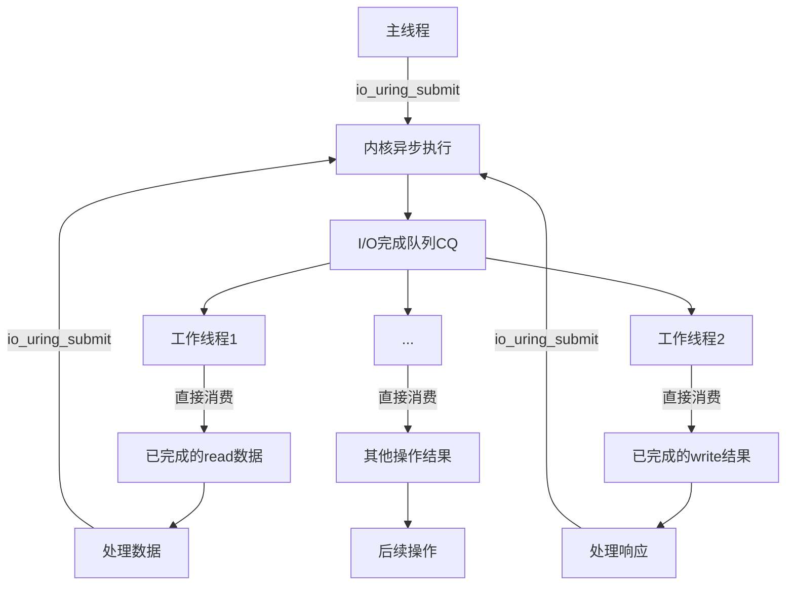

# 异步机制

## epoll

epoll 是 Linux 内核中用于处理大量文件描述符事件的 I/O 多路复用机制，采取时分复用的思想，特别适合高并发场景下的事件驱动网络应用。它通过监控多个文件描述符（如 socket）的 I/O 事件，实现高效的事件通知机制。

从图中可知，epoll 机制大概涉及到两个部分，一个为被监听的 socket/FIFO fd,一个为 epoll 机制本身使用的结构体。

如图为epoll的结构：


对于epoll多路复用机制有三种操作，分别为：

* epoll_create：创建一个 epoll 结构。
* epoll_ctl：向 epoll 中注册/删除一个文件描述符。
* epoll_wait：对文件描述符进行监听。



### 被监听的时间描述符

#### socket

一个socket结构被以文件的方式进行打开，对于一个 socketfd 对应的 file 结构中的私有指针会指向socket结构。一个socket文件一般会位于 proc/pid/fd 路径下。

```c
struct socket {
	socket_state		state;//记录socket状态
	kmemcheck_bitfield_begin(type);
	short			type;//socket类型，tcp？udp？
	kmemcheck_bitfield_end(type);
	unsigned long		flags;

	struct fasync_struct	*fasync_list;
	wait_queue_head_t	wait;

	struct file		*file;//socket对应的文件结构
	struct sock		*sk;//指向 `sock` 结构体，表示与 socket 相关联的底层传输层（如 TCP 或 UDP）的具体实现。
	const struct proto_ops	*ops;//对socket所绑定端口的操作方法
};
```

`socket_state`用于记录 socket 的状态

```c
typedef enum {
    SS_FREE = 0,            /* 没有分配。表示 socket 结构体还未分配，处于空闲状态。*/
    SS_UNCONNECTED,         /* 未连接状态。表示 socket 已创建，但尚未与任何远程端点连接。对于服务器，这意味着尚未调用 `listen()`；对于客户端，还没有调用 `connect()`。*/
    SS_CONNECTING,          /* 正在连接中。表示 socket 正在尝试连接到远程主机，对于客户端，可能是正在调用 `connect()` 操作时的状态。*/
    SS_CONNECTED,           /* 已连接状态。表示 socket 已成功连接到远程端点。对于客户端，表示 `connect()` 完成；对于服务器，表示接受了一个客户端连接（通过 `accept()`）。*/
    SS_DISCONNECTING        /* 正在断开连接。表示 socket 正在断开与远程机的连接。该状态通常在调用关闭连接的操作（如 `close()` 或 `shutdown()`）时出现。*/
} socket_state;

```

wait_queue_head_t wait 记录了在此 socket 结构上等待的进程，也就是说多个进程可以使用一个 socket 。

sock sk 该字段是操作 socket 的核心，管理数据传输、连接状态等。

```c
struct sock {
    /*
     * 现在 struct inet_timewait_sock 也使用 sock_common，
     * 所以请不要在第一个成员(__sk_common)之前添加任何内容 --acme
     */
    struct sock_common    __sk_common;  // 套接字公共部分，包含所有协议族通用的字段
    
    // 以下宏定义将 sock 的成员映射到 __sk_common 中的对应成员
    #define sk_node            __sk_common.skc_node
    #define sk_nulls_node      __sk_common.skc_nulls_node
    #define sk_refcnt          __sk_common.skc_refcnt
    #define sk_tx_queue_mapping __sk_common.skc_tx_queue_mapping
    #define sk_copy_start      __sk_common.skc_hash
    #define sk_hash            __sk_common.skc_hash
    #define sk_family          __sk_common.skc_family
    #define sk_state           __sk_common.skc_state
    #define sk_reuse           __sk_common.skc_reuse
    #define sk_bound_dev_if    __sk_common.skc_bound_dev_if
    #define sk_bind_node       __sk_common.skc_bind_node
    #define sk_prot            __sk_common.skc_prot
    #define sk_net             __sk_common.skc_net
    
    // 位字段定义开始（使用 kmemcheck 工具检查内存访问）
    kmemcheck_bitfield_begin(flags);
    unsigned int        sk_shutdown  : 2,   // 关闭标志（读/写方向）
                        sk_no_check  : 2,   // 是否禁用校验和
                        sk_userlocks : 4,   // 用户锁标志
                        sk_protocol  : 8,   // 协议类型
                        sk_type      : 16;  // 套接字类型（SOCK_STREAM等）
    kmemcheck_bitfield_end(flags);
    
    int            sk_rcvbuf;        // 接收缓冲区大小
    socket_lock_t  sk_lock;          // 套接字锁
    
    /*
     * 积压队列是特殊的，它总是与套接字自旋锁一起使用，
     * 并且需要低延迟访问。因此我们特殊处理它的实现。
     */
    struct {
        struct sk_buff *head;  // 队列头
        struct sk_buff *tail;  // 队列尾
        int len;               // 队列长度
        int limit;             // 队列限制
    } sk_backlog;
    
    wait_queue_head_t    *sk_sleep;         // 等待队列
    struct dst_entry    *sk_dst_cache;      // 目标缓存
#ifdef CONFIG_XFRM
    struct xfrm_policy    *sk_policy[2];    // IPSec策略（输入/输出）
#endif
    rwlock_t        sk_dst_lock;            // 目标缓存锁
    atomic_t        sk_rmem_alloc;          // 接收内存分配计数
    atomic_t        sk_wmem_alloc;          // 发送内存分配计数
    atomic_t        sk_omem_alloc;          // 其他内存分配计数
    int            sk_sndbuf;               // 发送缓冲区大小
    struct sk_buff_head    sk_receive_queue;  // 接收队列
    struct sk_buff_head    sk_write_queue;    // 发送队列
#ifdef CONFIG_NET_DMA
    struct sk_buff_head    sk_async_wait_queue;  // 异步等待队列
#endif
    int            sk_wmem_queued;         // 已排队发送内存
    int            sk_forward_alloc;       // 预分配内存
    gfp_t            sk_allocation;        // 内存分配标志
    int            sk_route_caps;          // 路由能力标志
    int            sk_gso_type;            // GSO类型
    unsigned int    sk_gso_max_size;       // GSO最大分段大小
    int            sk_rcvlowat;            // 接收低水位标记
    unsigned long     sk_flags;            // 套接字标志
    unsigned long        sk_lingertime;    // SO_LINGER超时
    struct sk_buff_head    sk_error_queue; // 错误队列
    struct proto        *sk_prot_creator;  // 创建套接字的协议
    rwlock_t        sk_callback_lock;      // 回调锁
    int            sk_err,                 // 错误代码
                    sk_err_soft;           // 软件错误代码
    atomic_t        sk_drops;              // 丢弃的数据包计数
    unsigned short    sk_ack_backlog;      // 当前已建立的连接数
    unsigned short    sk_max_ack_backlog;  // 最大连接队列长度
    __u32            sk_priority;          // 套接字优先级
    struct ucred        sk_peercred;       // 对端凭证
    long            sk_rcvtimeo;           // 接收超时
    long            sk_sndtimeo;           // 发送超时
    struct sk_filter      *sk_filter;      // 包过滤器
    void            *sk_protinfo;          // 协议特定信息
    struct timer_list    sk_timer;         // 套接字定时器
    ktime_t            sk_stamp;           // 时间戳
    struct socket        *sk_socket;       // 关联的socket结构
    void            *sk_user_data;         // 用户数据
    struct page        *sk_sndmsg_page;    // 发送消息页
    struct sk_buff        *sk_send_head;   // 发送队列头
    __u32            sk_sndmsg_off;        // 发送消息偏移
    int            sk_write_pending;       // 挂起的写操作
#ifdef CONFIG_SECURITY
    void            *sk_security;          // 安全模块数据
#endif
    __u32            sk_mark;              // 套接字标记值
    
    // 回调函数指针
    void            (*sk_state_change)(struct sock *sk);  // 状态改变回调
    void            (*sk_data_ready)(struct sock *sk, int bytes);  // 数据到达回调
    void            (*sk_write_space)(struct sock *sk);   // 写空间可用回调
    void            (*sk_error_report)(struct sock *sk);  // 错误报告回调
    int            (*sk_backlog_rcv)(struct sock *sk,    // 积压接收处理
                          struct sk_buff *skb);  
    void            (*sk_destruct)(struct sock *sk);      // 析构回调
};
```

* __sk_common: 通用的 socket 信息，包括节点、哈希值、协议族、状态等。
* sk_shutdown: 关闭标志，表示 socket 的关闭状态。
* sk_rcvbuf 和 sk_sndbuf: 分别表示接收和发送缓冲区的大小。
* sk_receive_queue 和 sk_write_queue: 分别用于存储接收到的数据包和待发送的数据包。
* sk_err: 表示当前 socket 的错误状态。
* sk_state_change、sk_data_ready、sk_write_space、sk_error_report: 一些回调函数，用于处理状态变化、数据准备就绪、写空间可用和错误报告等事件。
* sk_mark: 用于标记信息，通常在路由选择时使用。

在2.6版本的代码中sock中并无sk_wq成员。但该成员也有重要的作用。

```c
struct socket_wq {
	/* Note: wait MUST be first field of socket_wq */
	wait_queue_head_t	wait;           // 等待队列头，用于同步和等待事件（如读写操作）。
	struct fasync_struct	*fasync_list;   // 用于异步通知（fasync）的链表，常用于信号机制来通知进程异步 I/O 事件。
	unsigned long		flags;          // 标志位，表示 socket 的异步状态，如 %SOCKWQ_ASYNC_NOSPACE 等。
	struct rcu_head		rcu;            // RCU (Read-Copy-Update) 头部，用于在高并发环境中安全更新 socket_wq 结构。
} ____cacheline_aligned_in_smp;           // 在多处理器 (SMP) 系统中，强制将结构体对齐到缓存行边界，避免多核访问冲突，提高性能。
```

该成员与socket结构中的 wait 成员都为等待队列，那么他们之间又有什么区别与联系？

在 Linux 内核网络子系统中，sock 结构和 socket 结构分别对应于不同层次的抽象对象，而它们中的 socket_wq 和 wait 成员都是用于处理异步事件和进程等待机制的，但它们的用途、层次以及与系统组件的交互方式有所不同。

sock 结构体是内核中的低层结构，负责管理与传输协议、网络栈相关的细节，sock 结构体中的 socket_wq 负责处理与 socket 相关的所有异步 I/O 事件和通知，包括通过 fasync 机制通知进程异步事件，在 epoll 中该结构体主要与 epoll 相关的结构进行关联，用于在有网络包来临时使用epollcallback机制将就绪事件加入到 epoll 的就绪事件队列中。而 socket 结构中的 wait 则是面向用户层，主要用于记录等待着在该 socket 上的进程线程，负责用户空间的等待和同步是 poll 与 select 实现的一部分。

proto_ops  *ops 是一个指向操作函数指针表的指针。这个字段定义了 socket 的操作行为，比如`connect`、`accept`、`sendmsg` 和 `recvmsg` 等操作。这是 socket API 的核心，不同协议栈（如 TCP、UDP）会有不同的实现。

```c
struct proto_ops {
	int		family;
	struct module	*owner;
	int		(*release)   (struct socket *sock);
	int		(*bind)	     (struct socket *sock,struct sockaddr *myaddr,int sockaddr_len);
	int		(*connect)   (struct socket *sock,struct sockaddr *vaddr,int sockaddr_len, int flags);
	int		(*socketpair)(struct socket *sock1,struct socket *sock2);
	int		(*accept)    (struct socket *sock,struct socket *newsock, int flags);
	int		(*getname)   (struct socket *sock,struct sockaddr *addr,int *sockaddr_len, int peer);
	unsigned int	(*poll)	     (struct file *file, struct socket *sock,struct poll_table_struct *wait);
	int		(*ioctl)     (struct socket *sock, unsigned int cmd,unsigned long arg);
#ifdef CONFIG_COMPAT
	int	 	(*compat_ioctl) (struct socket *sock, unsigned int cmd,unsigned long arg);
#endif
	int		(*listen)    (struct socket *sock, int len);
	int		(*shutdown)  (struct socket *sock, int flags);
	int		(*setsockopt)(struct socket *sock, int level,int optname, char __user *optval, unsigned int optlen);
	int		(*getsockopt)(struct socket *sock, int level,int optname, char __user *optval, int __user *optlen);
#ifdef CONFIG_COMPAT
	int		(*compat_setsockopt)(struct socket *sock, int level,int optname, char __user *optval, unsigned int optlen);
	int		(*compat_getsockopt)(struct socket *sock, int level,int optname, char __user *optval, int __user *optlen);
#endif
	int		(*sendmsg)   (struct kiocb *iocb, struct socket *sock,struct msghdr *m, size_t total_len);
	int		(*recvmsg)   (struct kiocb *iocb, struct socket *sock,struct msghdr *m, size_t total_len,int flags);
	int		(*mmap)	     (struct file *file, struct socket *sock,struct vm_area_struct * vma);
	ssize_t		(*sendpage)  (struct socket *sock, struct page *page,int offset, size_t size, int flags);
	ssize_t 	(*splice_read)(struct socket *sock,  loff_t *ppos, struct pipe_inode_info *pipe, size_t len, unsigned int flags);
};
```

### epoll机制相关的结构体

#### eventpoll

一个 eventpoll 结构通过文件系统的文件描述符打开表向用户暴露接口使用。一个 eventpoll 对应一个 epollfd 。对应了一个监听事件，一个监听事件可以同时监听多个 socket ，一个 socket 对应一个epoll节点即 epitem。

```c
struct eventpoll {
    spinlock_t lock;  
    struct mutex mtx;
    wait_queue_head_t wq;
    wait_queue_head_t poll_wait;//等待队列
    struct list_head rdllist;
    struct rb_root rbr;
    struct epitem *ovflist;
    struct user_struct *user;
};
```

* wq： 等待队列链表。当 rdllist 中有事件来临时，会唤醒调用了 epoll_wait 而陷入阻塞的进程。也是因为调用 epoll_wait 后会进入阻塞状态，因此说 epoll 本身是同步的。
* rbr： ⼀棵红⿊树。为了⽀持对海量连接的⾼效查找、插⼊和删除，eventpoll 内部使⽤了⼀棵红⿊树。通过这棵树来管理⽤户进程下添加进来的所有 socket 连接。
* rdllist： 就绪的描述符的链表。当有的连接就绪的时候，内核会把就绪的连接放到 rdllist链表⾥。这样应⽤进程只需要判断链表就能找出就绪进程，⽽不⽤去遍历整棵树。
* poll_wait：用于支持 epoll 实例本身被其他 epoll 实例监控（即 ​epoll 嵌套）。如果一个 epoll 实例（比如 epoll_fd1）被另一个 epoll 实例（比如 epoll_fd2）监控，那么 epoll_fd1 的 poll_wait 会被挂入 epoll_fd2 的监听队列。

#### epoll 上的节点 epitem

这个 epitem 结构是干什么用的呢？

每当我们调用 epoll_ctl 增加一个 fd 时，内核就会为我们创建出一个 epitem 实例，并且把这个实例作为红黑树的一个子节点，增加到 eventpoll 结构体中的红黑树中，对应的字段是 rbr。这之后，查找每一个 fd 上是否有事件发生都是通过红黑树上的 epitem 来操作。epitem 将监听的 socket 结构与注册的 eventpoll 结构关联到一起，将 epollfd 添加到这三个socket的等待队列中。当被监听的 socket 中有数据来临时，在中断回调程序中会将 socket 添加到epoll的就绪队列中。

```c
struct epitem {
	struct rb_node rbn;  // 红黑树节点，用于将此结构链接到 eventpoll 的红黑树中。
	struct list_head rdllink;  // 链表头，用于将此结构链接到 eventpoll 的就绪列表。
	struct epitem *next;  // 指向下一个 epitem 的指针，与 eventpoll 的 ovflist 协同工作，维护一个单向链表。
	struct epoll_filefd ffd;  // 该项所引用的文件描述符信息。
	int nwait;  // 附加到 poll 操作的活动等待队列数量。
	struct list_head pwqlist;  // 包含 poll 等待队列的链表。
	struct eventpoll *ep;  // 指向包含此项的 eventpoll 结构体的指针。
	struct list_head fllink;  // 链表头，用于将此项链接到 "struct file" 项目列表中。
	struct epoll_event event;  // 描述感兴趣的事件和源文件描述符的结构体。
};
```

由上面的代码可知 epitem 可能被链接在 红黑树 就绪链表 和 ovflist 链表上。那么这三者间又有什么区别与联系？

* struct rb_node rbn
  
  用于将当前 epitem 结构链接到 eventpoll 的红黑树中。
  当有新的文件描述符需要监视或某个文件描述符的事件发生时，相关的 epitem 会被插入红黑树中，确保事件的有序管理。

* struct list_head rdllink
  
  用于将当前 epitem 结构链接到 eventpoll 的就绪列表即 rdllist 中。当一个或多个事件就绪时，这些事件会被添加到就绪列表中，以便在用户调用 epoll_wait() 时，可以高效地返回这些就绪事件。

* struct epitem *next
  
  用于维护一个单向链表，专门处理在将就绪事件传递给用户空间时可能发生的溢出事件。由于一次只能向用户空间传递有限数量的事件，溢出的事件将会链接在这个列表中，以备后续处理。

#### 连接epoll节点与被监听的文件描述符的桥梁 eppoll_entry

在上图中等待队列 sk_wq 通过结构体 eppoll_entry 与 epitem 联系到一起。属于图中红框这一部分。



```c
/**
 * struct eppoll_entry - epoll 的等待队列挂接结构
 * @next:    指向下一个 eppoll_entry 的指针（用于同一文件描述符被多个 epoll 实例监控的场景）
 * @base:    回指关联的 epitem 结构（包含文件描述符、事件掩码等元数据）
 * @wait:    内嵌的等待队列项，实际挂接到目标文件的等待队列
 * @whead:   目标文件描述符的等待队列头（如 socket->sk_wq）
 *
 * 核心作用：建立 epoll 监控项（epitem）与文件描述符等待队列的桥梁。
 * 当文件描述符事件触发时，内核通过此结构回调到 epoll 子系统。
 */
struct eppoll_entry {
	struct eppoll_entry *next;
	struct epitem *base;
	wait_queue_entry_t wait;
	wait_queue_head_t *whead;
};
```

在这里实现了一个双向绑定的机制

* 文件 → epoll：文件描述符的 socket_wq.wait 队列中插入 eppoll_entry.wait
* ​epoll → 文件：eppoll_entry.whead 指向文件的 socket_wq.wait，确保能正确插入和移除

```c
struct wait_queue_entry {
    unsigned int        flags;      // 标志位，控制等待行为
    void            *private;      // 私有数据指针，通常指向等待的进程
    wait_queue_func_t    func;     // 唤醒时的回调函数
    struct list_head    entry;      // 链表节点，用于链接到等待队列中
};
```

可以通过函数 ep_item_from_wait 从 sk_wq 结构的 wait 成员找到对应的 epitem 结构。

```c
/* Get the "struct epitem" from a wait queue pointer */
static inline struct epitem *ep_item_from_wait(wait_queue_entry_t *p)
{
    eturn container_of(p, struct eppoll_entry, wait)->base;
}
```

### epoll 监听的流程

#### epoll_create

在⽤户进程调⽤ epoll_create 时，内核会创建⼀个 struct eventpoll 的内核对象。并同样把它关联到当前进程的已打开⽂件列表中。

在 file 结构的私有指针域中会指向这个被创建的 eventpoll 上。

```c
static int ep_alloc(struct eventpoll **pep)
{
	int error;
	struct user_struct *user;
	struct eventpoll *ep;

	user = get_current_user();
	error = -ENOMEM;
	ep = kzalloc(sizeof(*ep), GFP_KERNEL);
	if (unlikely(!ep))
		goto free_uid;

	spin_lock_init(&ep->lock);
	mutex_init(&ep->mtx);
	init_waitqueue_head(&ep->wq);
	init_waitqueue_head(&ep->poll_wait);
	INIT_LIST_HEAD(&ep->rdllist);
	ep->rbr = RB_ROOT;
	ep->ovflist = EP_UNACTIVE_PTR;
	ep->user = user;
	*pep = ep;
	return 0;
free_uid:
	free_uid(user);
	return error;
}
```

#### epoll_ctl

1. 分配⼀个红⿊树节点对象 epitem，
2. 添加等待事件到 socket 的等待队列中，其回调函数是 ep_poll_callback
3. 将 epitem 插⼊到 epoll 对象的红⿊树⾥



以下为等待队列的结构。

```c
struct __wait_queue {
	unsigned int flags;
#define WQ_FLAG_EXCLUSIVE	0x01
	void *private;
	wait_queue_func_t func;//等待队列的回调函数
	struct list_head task_list;
};
```

#### epoll_wait

当调用 wait 后，调用 epoll_wait 的进程会进入到休眠状态，直到监听的 socket 即注册在epoll树上的 socket 上因为有操作发生而被回调函数唤醒。

```c
sock_def_readable -> wake_up_interruptible_sync_poll -> __wake_up_sync_key -> __wake_up_common -> ep_poll_callback
```



sock_def_readable 函数会在将包从协议栈转移到用户态的时候被调用 ，最终在 __wake_up_common 调用 ep_poll_callback 将事件加入到

epoll 机制虽然用于时间的异步处理，但就其本身来说是同步的。因为在用户态线程调用epoll_wait之后，就需要将该线程阻塞，来等待事件到来之后再将用户线程唤醒。能实现异步操作是因为有多个线程对一个事件进行处理，对于单个线程本身依旧会被阻塞。

而对于 aio 与 io_uring 来说因为其使用了信号对于用户态进行通知，因此在用户态将事件提交到内核态之后，线程可以继续运行并不会被阻塞。

## io_uring

### io_uring 的基础概念

io_uring 基于


* SQE：提交队列项，表示IO请求。
* CQE：完成队列项，表示IO请求结果。
* SQ：Submission Queue，提交队列，用于存储SQE的数组。
* CQ：Completion Queue，完成队列，用于存储CQE的数组。
* SQ Ring：SQ环形缓冲区，包含SQ，头部索引（head），尾部索引（tail），队列大小等信息。
* CQ Ring：CQ环形缓冲区，包含SQ，头部索引（head），尾部索引（tail），队列大小等信息。
* SQ线程：内核辅助线程，用于从SQ队列获取SQE，并提交给内核处理，并将IO请求结果生成CQE存储在CQ队列。

### io_uring 的三种模式

`io_uring` 的三种主要工作模式如下，基于其设计特性和内核交互方式划分：

1. **默认模式（Basic Mode）**
   触发方式：通过系统调用 `io_uring_enter` 提交任务和收割结果。
   * 特点：
       * 每次提交 I/O 操作需显式调用 `io_uring_enter`，存在系统调用开销。
       * 适用于通用场景，灵活性高，但性能受限于系统调用频率。
       * 用户态需要主动轮询cq队列，内核态是否完成通过中断来通知。

   * 适用场景：常规异步 I/O 需求，如中等并发量的存储或网络操作。

2. **轮询模式（IOPOLL Mode）**

• 触发方式：通过 `IORING_SETUP_IOPOLL` 标志启用，内核主动轮询设备就绪状态。

• 特点：

  • 完全绕过中断机制，内核持续轮询设备状态，减少延迟。

  • 仅支持块设备（如 NVMe SSD），需配合 `O_DIRECT` 使用。

• 适用场景：低延迟、高吞吐的存储 I/O，如数据库或高性能存储系统。

1. **内核线程模式（SQPOLL Mode）**

• 触发方式：通过 `IORING_SETUP_SQPOLL` 标志启用，内核创建专用线程（SQ 线程）轮询提交队列。

• 特点：

  • 零系统调用：用户态直接修改共享队列，内核线程自动处理提交，彻底消除系统调用开销。

  • 可配置空闲超时（`sq_thread_idle`）和 CPU 绑定（`sq_thread_cpu`）。

• 适用场景：超高并发或延迟敏感型应用，如高频交易、实时数据处理。

对比总结
| 模式       | 系统调用开销 | 适用设备       | 性能优势               |
|----------------|------------------|--------------------|----------------------------|
| 默认模式       | 较高（每次提交） | 通用               | 灵活性高                   |
| IOPOLL         | 无（轮询驱动）   | 块设备（O_DIRECT） | 超低延迟                   |
| SQPOLL         | 无（内核线程）   | 通用               | 高吞吐、零系统调用         |


技术原理
• 共享内存机制：通过环形队列（SQ/CQ）和内存映射（`mmap`）实现用户态与内核态零拷贝通信。

• 批处理优化：单次系统调用可提交/收割多个 I/O 请求，显著减少上下文切换。

---

### 与 epoll的区别



epoll 只监听读写事件的发生，但是监听到事件发生之后实际的读写依然需要阻塞等待直到读完/写完，这里依然需要等待时间，即使使用非阻塞可以避免上述需要等待的事件，但是仍然没有做到真正的异步。



原因如下：

1. 系统调用开销无法避免​​
​   ​每次 I/O 仍需系统调用​​：即使是非阻塞的 read()/write()，仍需触发内核态切换（每次约 0.1~1μs）。
​    ​高并发时成为瓶颈​​：例如 10 万 QPS 时，每秒 10 万次系统调用，占用大量 CPU 时间。

2. 功能局限​​ ​状态机维护​​：需手动处理 EAGAIN 和部分读写（如 read() 只返回 100 字节，剩余数据需下次读取）。
​   ​边缘触发（ET）陷阱​​：若未一次性读完数据，且未重新注册 epoll 事件，可能导致事件丢失。

3. 功能局限​​
   ​​仅支持网络 I/O​​：文件 I/O 即使非阻塞，仍可能因元数据操作（如 stat）或底层设备队列阻塞。无法批量提交​​：每个 I/O 需独立系统调用，而 io_uring 可单次提交数百个请求。

而 io_uriong 用户态无需等待 I/O 完成，内核异步处理并直接写入完成队列。

此处只需等待获取最后的结果，不需要再次阻塞读写。

也就是说原先的epoll+多线程模型，由epoll监听到事件发生交给其他线程进行读写等操作进行处理，变为io_uring直接获取到读写的成果，其他线程可以直接使用数据而无需自行的读写。




相比于 epoll 的好处：

1. ​​更低的系统调用开销​​
​​批量提交与收割​​：io_uring 通过共享内存的环形队列（SQ/CQ）实现批量提交 I/O 请求和批量收割结果，单次系统调用可处理多个操作，显著减少上下文切换。
​​零系统调用模式​​：启用 SQPOLL 模式后，内核线程主动轮询用户态提交队列（SQ），彻底消除系统调用。
2. ​​真正的异步 I/O​​
​​全异步支持​​：io_uring 支持文件 I/O、网络 I/O 及其他系统调用（如 accept、open）的异步化，而 epoll 仅能异步通知事件，实际读写仍需同步系统调用。
​​无阻塞延迟​​：用户态无需等待 I/O 完成，内核异步处理并直接写入完成队列（CQ），减少等待时间。
3. ​​更高的吞吐量与更低延迟​​
​​轮询模式优化​​：IOPOLL 模式直接轮询设备状态（如 NVMe SSD），绕过中断机制，适合低延迟存储访问。
​​内存零拷贝​​：通过 mmap 共享队列，避免数据在用户态与内核态间复制。
4. ​​更灵活的编程模型​​
​​统一接口​​：io_uring 统一了文件、网络和其他系统调用的异步接口，而 epoll 仅适用于网络事件通知。
​​多线程友好​​：无锁设计的环形队列支持多线程并发操作，适合高并发场景。
5. ​​性能对比数据​​
​​网络编程​​：实测显示，io_uring 在高并发下系统调用次数仅为 epoll 的 1/10，吞吐量提升 30% 以上。
​​文件 I/O​​：在随机读写场景下，io_uring 性能可达 epoll + 线程池的 5 倍。

---

### 与 aio 之间的区别

在设计上是真正异步的（truly asynchronous）。只要 设置了合适的 flag，它在系统调用上下文中就只是将请求放入队列， 不会做其他任何额外的事情，保证了应用永远不会阻塞。

支持任何类型的 I/O：cached files、direct-access files 甚至 blocking sockets。

由于设计上就是异步的（async-by-design nature），因此无需 poll+read/write 来处理 sockets。 只需提交一个阻塞式读（blocking read），请求完成之后，就会出现在 completion ring。

灵活、可扩展：基于 io_uring 甚至能重写（re-implement）Linux 的每个系统调用。