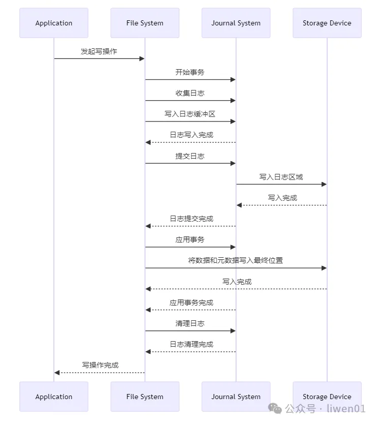
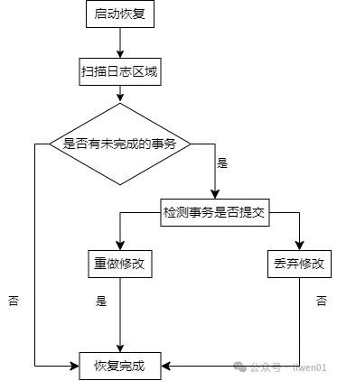
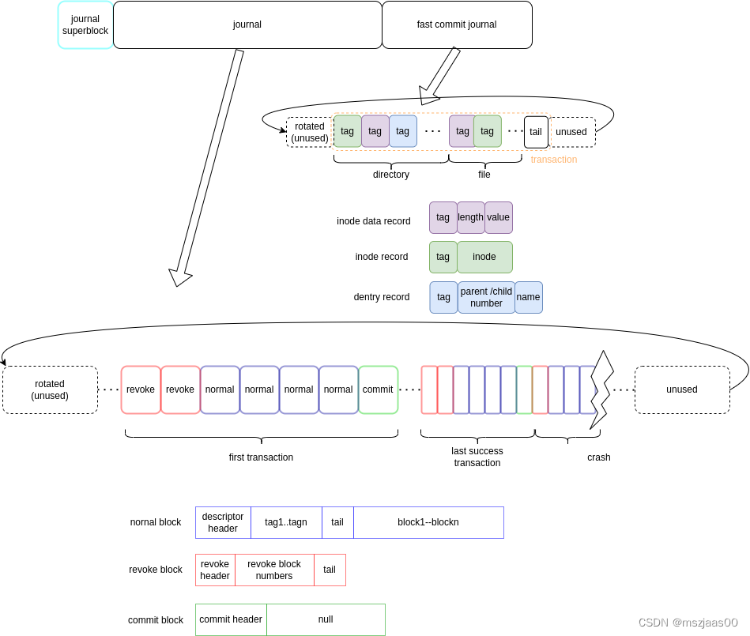
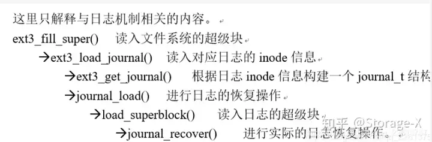

# 文件系统日志

## 文件系统的一致性

在任意两次写入操作期间，文件系统都可能会发生崩溃或者掉电的情况。如果其中一个写请求到达磁盘，但还没写入磁盘，在此时发生了崩溃，就会造成文件系统的不一致问题。

文件系统崩溃一致性(Crash Consistency)是指在文件系统发生崩溃、断电或其它不可预见的故障后，文件系统能够保证数据的一致性和完整性，并能够恢复到一个合法且可操作的状态，确保系统重新启动或恢复之后，数据不会出现损坏、丢失或不一致的情况。

古老的解决方案是通过文件系统检查程序（file system checker）,即fsck。该方案的思想是并不妨碍或者阻止磁盘不一致状态的产生，而是在崩溃后重启时检查并修复不一致状态。需要手动使用 fsck 命令，进行检查，在使用该命令之后，会对超级块中，inode等结构进行检查，检查有没有重复的块。这样每次都需要对磁盘进行遍历的方式就十分低效。在此基础上又产生了文件系统

[fsck原理](https://blog.csdn.net/weixin_29196613/article/details/116907036)

文件系统日志的诞生就是为了防止这一现象的产生。

除了文件系统日志之外还有 写时复制(Copy on Write) 

### 日志工作原理

#### 日志提交

在ext4文件系统中，由 inode 号为 8 的文件对日志数据进行保存。在执行对文件系统写入或修改元数据操作时，会开启一组事务并将事务提交到磁盘的日志数据区中。



* 事务开始:文件系统开始一组更新操作，并开启一个新的事务

* 收集日志:收集所有即将修改的数据(以及在 Journal 模式下的数据)

* 提交日志:更新日志头，标记该事务已经提交(commit)

* 应用事务:将日志中的修改应用到文件系统，将数据和元数据写入最终位置

* 清理日志:事务完成后，日志系统清理已提交的日志记录

#### 日志恢复

在文件系统被挂载时，会对文件系统的日志文件进行扫描，与日志缓冲区中的事务进行对比查看是否有未完成的操作，如果有未完成的操作，则看磁盘的日志数据区中是否有提交。

* 如果有则根据日志对文件系统进行重做与恢复
* 如果没有提交日志则直接放弃本次修改操作



## 日志文件系统中的结构体

### 日志文件系统的核心管理结构 journal_s

`struct journal_s` 日志管理的数据结构这个结构体定义了 journaling 文件系统的核心数据结构，它用于管理文件系统的日志操作。在这里，各种字段负责不同的日志功能，包括事务管理、同步、检查点、设备信息等。这些字段使用锁（如自旋锁和互斥锁）来保护并发访问。对于一个文件系统，使用唯一的 journal_s 结构，他代表了一个文件系统被挂载后直到被卸载这段时间内产生的日志数据。

```c
struct journal_s
{
	/* 日志的一般状态标志位 [受 j_state_lock 保护] */
	unsigned long		j_flags;

	/* 是否有来自先前终止的未清除错误 [受 j_state_lock 保护] */
	int			j_errno;

	/* 日志超级块的缓冲区 */
	struct buffer_head	*j_sb_buffer;
	/* 日志的超级块指针 */
	journal_superblock_t	*j_superblock;

	/* 超级块格式的版本 */
	int			j_format_version;

	/* 用于保护日志的各种标量 [自旋锁] */
	spinlock_t		j_state_lock;

	/* 等待创建屏障锁的进程数量 [受 j_state_lock 保护] */
	int			j_barrier_count;

	/* 屏障锁 */
	struct mutex		j_barrier;

	/* 当前运行的事务 [受 j_state_lock 和调用者持有的 open handle 保护] */
	transaction_t		*j_running_transaction;

	/* 正在推送到磁盘的事务 [受 j_state_lock 和调用者持有的 open handle 保护] */
	transaction_t		*j_committing_transaction;

	/* 所有等待检查点的事务的循环链表 [受 j_list_lock 保护] */
	transaction_t		*j_checkpoint_transactions;

	/* 等待队列，等待事务锁定开始提交，或屏障锁释放 */
	wait_queue_head_t	j_wait_transaction_locked;

	/* 等待队列，等待检查点完成 */
	wait_queue_head_t	j_wait_logspace;

	/* 等待队列，等待提交完成 */
	wait_queue_head_t	j_wait_done_commit;

	/* 等待队列，触发检查点 */
	wait_queue_head_t	j_wait_checkpoint;

	/* 等待队列，触发提交 */
	wait_queue_head_t	j_wait_commit;

	/* 等待队列，等待更新完成 */
	wait_queue_head_t	j_wait_updates;

	/* 保护并发检查点的信号量 */
	struct mutex		j_checkpoint_mutex;

	/* 日志头：标识日志中第一个未使用的块 [受 j_state_lock 保护] */
	unsigned int		j_head;

	/* 日志尾：标识日志中仍在使用的最旧块 [受 j_state_lock 保护] */
	unsigned int		j_tail;

	/* 日志空闲空间：日志中有多少空闲块 [受 j_state_lock 保护] */
	unsigned int		j_free;

	/* 日志开始和结束块号 [受 j_state_lock 保护] */
	unsigned int		j_first;
	unsigned int		j_last;

	/* 存储日志的位置的设备、块大小和起始块偏移量 */
	struct block_device	*j_dev;
	int			j_blocksize;
	unsigned int		j_blk_offset;

	/* 客户文件系统所在的设备。对于内部日志，它将等于 j_dev。 */
	struct block_device	*j_fs_dev;

	/* 日志区域在磁盘上的最大容量（单位：块） */
	unsigned int		j_maxlen;

	/* 保护缓冲区列表和内部缓冲区状态的自旋锁 */
	spinlock_t		j_list_lock;

	/* 存储日志的可选 inode，如果存在，所有日志块号通过 bmap() 映射到此 inode */
	struct inode		*j_inode;

	/* 日志中最旧事务的序列号 [受 j_state_lock 保护] */
	tid_t			j_tail_sequence;

	/* 下一个事务的序列号 [受 j_state_lock 保护] */
	tid_t			j_transaction_sequence;

	/* 最近提交的事务的序列号 [受 j_state_lock 保护] */
	tid_t			j_commit_sequence;

	/* 最近请求提交的事务的序列号 [受 j_state_lock 保护] */
	tid_t			j_commit_request;

	/* 日志的 UUID：标识由此日志支持的对象（文件系统、LVM 卷等） */
	__u8			j_uuid[16];

	/* 指向当前提交线程的指针 */
	struct task_struct	*j_task;

	/* 允许单个复合提交事务中的最大元数据缓冲区数 */
	int			j_max_transaction_buffers;

	/* 提交事务前的最大事务存续时间 */
	unsigned long		j_commit_interval;

	/* 唤醒提交线程的定时器 */
	struct timer_list	j_commit_timer;

	/* 撤销表：维护当前事务中撤销的块列表 [受 j_revoke_lock 保护] */
	spinlock_t		j_revoke_lock;
	struct jbd_revoke_table_s *j_revoke;
	struct jbd_revoke_table_s *j_revoke_table[2];

	/* journal_commit_transaction 中的缓冲头数组 */
	struct buffer_head	**j_wbuf;
	int			j_wbufsize;

	/* 最近执行同步操作的进程的 pid */
	pid_t			j_last_sync_writer;

	/* 提交事务到磁盘的平均时间（纳秒） [受 j_state_lock 保护] */
	u64			j_average_commit_time;

	/* 文件系统私有信息的指针。ext3 将它的超级块指针放在这里。 */
	void *j_private;
};
```

* j_tail_sequence
  
  j_tail_sequence 字段表示当前日志描述符中最旧的事务号。

  j_tail_sequence 在初始化时，会被赋值为 j_transaction_sequence 即文件系统被挂载时的第一个事务号，在检查点函数 `jbd2_cleanup_journal_tail` 中，如果确认数据被写入到文件系统中本身存在的区域，就会更改 j_tail_sequence 将他修改为已经写入磁盘的事务号。

### 日志文件系统的超级块 journal_superblock_s

```c
typedef struct journal_superblock_s
{
    /* 0x0000 */
    journal_header_t s_header;  // 日志超级块的通用头部

    /* 0x000C */
    /* 描述日志的静态信息 */
    __be32  s_blocksize;        // 日志设备的块大小
    __be32  s_maxlen;           // 日志文件中的总块数
    __be32  s_first;            // 日志信息的起始块号

    /* 0x0018 */
    /* 描述当前日志状态的动态信息 */
    __be32  s_sequence;         // 日志中预期的第一个提交 ID
    __be32  s_start;            // 日志起始的块号

    /* 0x0020 */
    /* 通过 journal_abort() 设置的错误值 */
    __be32  s_errno;

    /* 0x0024 */
    /* 剩下的字段仅在版本 2 的超级块中有效 */
    __be32  s_feature_compat;   // 兼容特性集合
    __be32  s_feature_incompat; // 不兼容特性集合
    __be32  s_feature_ro_compat; // 只读兼容的特性集合

    /* 0x0030 */
    __u8    s_uuid[16];         // 日志的 128 位 UUID

    /* 0x0040 */
    __be32  s_nr_users;         // 共享该日志的文件系统数量

    __be32  s_dynsuper;         // 动态超级块副本的块号

    /* 0x0048 */
    __be32  s_max_transaction;  // 每个事务允许的最大日志块数
    __be32  s_max_trans_data;   // 每个事务允许的最大数据块数

    /* 0x0050 */
    __u32   s_padding[44];      // 填充字段，保留以供将来使用

    /* 0x0100 */
    __u8    s_users[16 * 48];   // 共享该日志的所有文件系统的 ID

    /* 0x0400 */
} journal_superblock_t;
```

s_start标志了日志的起始块号，如果s_start为0则说明在文件系统被挂载的过程中的所有事务均已经完成，不需要进行恢复。

s_sequence 代表了预期中的第一个事务号，在每次提交日志时由于检查点函数可能会更改jbd2_cleanup_journal_tail 成员，因此在提交时需要更新 s_sequence 成员。s_sequence 即代表了最后回写到磁盘中的事务号（这里的回写是指将数据写到原有的磁盘位置上），在恢复阶段，会从事务号为 s_sequence 开始恢复。

### 日志缓冲区结构 journal_head

一个 journal_head 底层对应了一个 buffer_head 。该结构是用于缓存日志本身的数据的。会在提交后被写入磁盘中。

```c
struct journal_head {
	struct buffer_head *b_bh;
	int b_jcount;
	unsigned b_jlist;
	// 本journal_head在transaction_t的哪个链表上
	unsigned b_modified;
	// 标志该缓冲区是否以被当前正在运行的transaction修改过
	char *b_frozen_data;
    // 当jbd遇到需要转义的块时，
	// 将buffer_head指向的缓冲区数据拷贝出来，冻结起来，供写入日志使用。
	char *b_committed_data;
	// 目的是防止重新写未提交的删除操作
	// 含有未提交的删除信息的元数据块（磁盘块位图）的一份拷贝，
	// 因此随后的分配操作可以避免覆盖未提交的删除信息。 
	// 也就是说随后的分配操作使用的时b_committed_data中的数据，
	// 因此不会影响到写入日志中的数据。
	transaction_t *b_transaction;
	// 指向所属的transaction
	transaction_t *b_next_transaction;
	// 当有一个transaction正在提交本缓冲区，
	// 但是另一个transaction要修改本元数据缓冲区的数据，
	// 该指针就指向第二个缓冲区。
 
	/*
	 * Doubly-linked list of buffers on a transaction's data, metadata or
	 * forget queue. [t_list_lock] [jbd_lock_bh_state()]
	 */
	struct journal_head *b_tnext, *b_tprev;
 
	transaction_t *b_cp_transaction;
	// 指向checkpoint本缓冲区的transaction。
	// 只有脏的缓冲区可以被checkpointed。
 
	struct journal_head *b_cpnext, *b_cpprev;
	// 在旧的transaction_t被checkpointed之前必须被刷新的缓冲区双向链表。
 
	/* Trigger type */
	struct jbd2_buffer_trigger_type *b_triggers;
	struct jbd2_buffer_trigger_type *b_frozen_triggers;
};
```

### handle

所谓原子操作，就是内部不再分割的操作，该操作要么完全完成，要么根本没有执行，不存在部分完成的状态。

那么，什么样的操作可以看成对文件系统的原子操作呢？

比如说为文件分配一个磁盘块，就看成一个原子操作就比较合适。分配一个磁盘块，可能需要修改一个inode块、一个磁盘块位图、最多三个间接索引块、块组块、超级块，一共最多7个磁盘块。将分配一个磁盘块看成一个原子操作，意味着上述修改7个磁盘块的操作要么都成功，要么都失败，不可能有第三种状态。

jbd中用handle来表示。一个handle代表针对文件系统的一次原子操作。这个原子操作要么成功，要么失败，不会出现中间状态。在一个handle中，可能会修改若干个缓冲区，即buffer_head。

```c
struct handle_s
{
	/* 此更新所属的复合事务。 */
	transaction_t		*h_transaction;

	/* 该 handle 允许修改的剩余缓冲区数量（表示缓冲区配额）。 */
	int			h_buffer_credits;

	/* handle 的引用计数，用于管理并发使用。 */
	int			h_ref;

	/* 调用者用于跟踪大型文件系统操作中的错误状态。 */
	int			h_err;

	/* Flags 标志位 [无需加锁] */
	unsigned int	h_sync:		1;	/* 在关闭时同步数据到磁盘 */
	unsigned int	h_jdata:	1;	/* 强制数据日志记录（数据也被记录到日志中） */
	unsigned int	h_aborted:	1;	/* handle 遇到致命错误并被中止 */

#ifdef CONFIG_DEBUG_LOCK_ALLOC
	struct lockdep_map	h_lockdep_map; /* 锁调试相关的映射 */
#endif
};
```

### 事务transaction_s

实现日志文件系统时，可以将一个原子操作就作为一个事务来处理，但是这样实现的效率比较低。于是ext3将若干个原子操作组合成一个事务，对磁盘日志以事务为单位进行管理，以提高读写日志的效率。

对于一个 journal_s 只能有一个正在运行的 transaction_s。

transaction_s 结构表示一个事务。一个事务一共会有六种状态，使用一个枚举来表示。

事务状态逻辑上可以分为：运行、生成日志、日志块刷盘、数据块刷盘四种类型（实际状态划分更细，见commit阶段描述）journal_head转移到事务的相应队列为：t_buffers、t_shadow_list、t_forget、t_checkpoint_list

* T_RUNNING：事务正在接受操作和修改。
* T_LOCKED：事务已锁定，不再接受新操作，准备提交。
* T_FLUSH：事务正在将修改的数据同步到磁盘。
* T_COMMIT：事务进入提交过程，写入提交日志。
* T_COMMIT_RECORD：事务的提交记录正在被写入。
* T_FINISHED：事务已完成，所有操作和日志记录均已结束。

对于状态的的转换操作，无需加锁，因为只有 kjournald2 进程会修改此字段。


```c
struct transaction_s
{
	journal_t		*t_journal;	// 指向所属的jounal
	tid_t			t_tid;		// 本事务的序号
	enum {
		T_RUNNING,
		T_LOCKED,
		T_FLUSH,
		T_COMMIT,
		T_COMMIT_RECORD,
		T_FINISHED
	} t_state;  // 事务的状态
 
	unsigned int		t_log_start;
	// log中本transaction_t从日志中哪个块开始
	int			t_nr_buffers;
	// 本transaction_t中缓冲区的个数
	
	struct journal_head	*t_reserved_list;
// 被本transaction保留，但是并未修改的缓冲区组成的双向循环队列。
	struct journal_head	*t_locked_list;
	// 由提交时所有正在被写出的、被锁住的数据缓冲区组成的双向循环链表。
	struct journal_head	*t_buffers;
	// 元数据块缓冲区链表
	// 这里面可都是宝贵的元数据啊，对文件系统的一致性至关重要！
	struct journal_head	*t_sync_datalist;
	// 本transaction_t被提交之前，
	// 需要被刷新到磁盘上的数据块（非元数据块）组成的双向链表。
	// 因为在ordered模式，我们要保证先刷新数据块，再刷新元数据块。
	struct journal_head	*t_forget;
	// 被遗忘的缓冲区的链表。
	// 当本transaction提交后，可以un-checkpointed的缓冲区。
	// 这种情况是这样：
	// 一个缓冲区正在被checkpointed，但是后来又调用journal_forget(),
	// 此时以前的checkpointed项就没有用了。
// 此时需要在这里记录下来这个缓冲区，
	// 然后un-checkpointed这个缓冲区。
	struct journal_head	*t_checkpoint_list;
	// 本transaction_t可被checkpointed之前，
	// 需要被刷新到磁盘上的所有缓冲区组成的双向链表。
	// 这里面应该只包括元数据缓冲区。
	struct journal_head	*t_checkpoint_io_list;
	// checkpointing时，已提交进行IO操作的所有缓冲区组成的链表。
	struct journal_head	*t_iobuf_list;
	// 进行临时性IO的元数据缓冲区的双向链表。
	struct journal_head	*t_shadow_list;
	// 被日志IO复制（拷贝）过的元数据缓冲区组成的双向循环链表。
	// t_iobuf_list 上的缓冲区始终与t_shadow_list上的缓冲区一一对应。
	// 实际上，当一个元数据块缓冲区要被写到日志中时，数据会被复制一份，
	// 放到新的缓冲区中。
	// 新缓冲区会进入t_iobuf_list队列，
	// 而原来的缓冲区会进入t_shadow_list队列。
	struct journal_head	*t_log_list;
	// 正在写入log的起控制作用的缓冲区组成的链表。
	spinlock_t		t_handle_lock;
	// 保护handle的锁
	int			t_updates;
	// 与本transaction相关联的外部更新的次数
	// 实际上是正在使用本transaction的handle的数量
	// 当journal_start时，t_updates++
	// 当journal_stop时，t_updates--
	// t_updates == 0，表示没有handle正在使用该transaction，
	// 此时transaction处于一种可提交状态！
	int			t_outstanding_credits;
	// 本事务预留的额度
	transaction_t		*t_cpnext, *t_cpprev;	
	// 用于在checkpoint队列上组成链表
	unsigned long		t_expires;
	ktime_t			t_start_time;
	int t_handle_count;	
	// 本transaction_t有多少个handle_t
	unsigned int t_synchronous_commit:1;
	// 本transaction已被逼迫了，有进程在等待它的完成。
};
```

## 日志文件系统日志模式与实现

日志文件系统底层有三种日志模式

jbd2有三种模式：

1. 日志（journal）
   文件系统所有数据块和元数据块的改变都记入日志。 这种模式减少了丢失每个文件所作修改的机会，但是它需要很多额外的磁盘访问。例如，当一个新文件被创建时，它的所有数据块都必须复制一份作为日志记录。这是最安全和最慢的ext3日志模式。
2. 预定（ordered）
   只对文件系统元数据块的改变才记入日志，这样可以确保文件系统的一致性，但是不能保证文件内容的一致性。然而，ext3文件系统把元数据块和相关的数据块进行分组，以便在元数据块写入日志之前写入数据块。这样，就可以减少文件内数据损坏的机会；例如，确保增大文件的任何写访问都完全受日志的保护。这是缺省的ext3 日志模式。
3. 写回（writeback）
   只有对文件系统元数据的改变才记入日志，不对数据块进行任何特殊处理。这是在其他日志文件系统发现的方法，也是最快的模式。

在挂载文件系统时，可通过data=journal等修改日志模式。如果不做特殊说明，下文中将默认介绍预定（ordered）模式，这是ext3默认的日志模式，也是实现最复杂的一种模式。

## 日志文件系统的存储格式



### normal块

normal块由一个descriptor块 + 多个数据/元数据块组成。用于存储文件系统数据或元数据的日志块。它们记录了对文件系统状态的实际修改。在事务过程中，所有对文件系统进行的写操作都会先记录在正常块中。这些块在成功提交后会更新到实际的文件系统。在一个文件被写入时，写入的数据会首先存储在正常块中，确保在事务未提交时，数据的完整性和一致性。

descriptor块上有header, tags, tail：

第 0 个 tag 是 jbd2 的 uuid，它是makefs时就确定的，只有tune2fs系统会用到它，ext4 会忽略。后面的 tag 表示由对应数据块的内容与事务号计算的 checksum，如果发现哪个数据块计算的 checksum 与 tag 不一致，则不恢复这个数据块。如果某个事务在写入日志时对数据块进行了校验（通过计算 checksum），那么在恢复时，系统会读取日志中的数据块并重新计算它的 checksum。若 checksum 与日志中的 tag（即预先记录的 checksum）不一致，说明日志文件中的数据块可能在某个时刻被破坏，系统便不会使用该数据块进行恢复，避免引入错误。

### revoke块

撤销块用于记录那些在事务提交时需要被撤销的块。这些块的内容不再被视为有效。在进行文件系统的恢复时也会忽略掉这部分块。

假设有一个缓冲区，对应着一个磁盘块，内核多次修改该缓冲区，于是磁盘日志中就会有该缓冲区的若干个版本的数据。假设此时要从文件中删除该磁盘块，那么，一旦包含该删除操作的transaction提交，那么，再恢复时，已经存放在磁盘日志中的该磁盘块的若干个版本的数据就不必再恢复了，因为到头来还是要删除的。revoke就是这样一种加速恢复速度的方法。当本transaction包含删除磁盘块操作时，就会在磁盘日志中写一个revoke块，该块中包含<被revoked的块号blocknr，提交的transaction的ID>，表示恢复时，凡是transaction ID小于等于ID的所有写磁盘块blocknr的操作都可以取消了，不必进行了。

通过函数 jbd2_journal_revoke 对块进行撤销，而该函数在ext4文件系统中只在inode被删除与块被释放时调用

如果一个事务修改了某个文件，但由于某种原因需要回滚，那么与这些修改相关的正常块的编号将被记录在撤销块中。

```c
typedef struct jbd2_journal_revoke_header_s
{
    journal_header_t r_header;          // 日志头部，包含日志的基本信息
    __be32 r_count;                     // 撤销记录所使用的字节数
} jbd2_journal_revoke_header_t;

```

revoke块的信息是删掉的块号，表示在当前事务会将这块的内容删掉并且不再更新，在恢复时没必要恢复这之前事务的日志中这块的内容。当一个事务的所有操作完成并准备提交时，系统会写入一个提交块，包含该事务的序列号、时间戳等信息，以便在恢复时检查。

### commit块

它的内容只有32字节，但要占用一整块，表示本事务的提交成功。在所有的正常块和撤销块写入日志后，提交块用于标记该事务已成功完成。这确保在故障恢复时，系统可以准确知道哪些事务已经提交，哪些需要被撤销。

```c
struct commit_header {
	__be32		h_magic;
	__be32          h_blocktype;
	__be32          h_sequence;
	unsigned char   h_chksum_type;
	unsigned char   h_chksum_size;
	unsigned char 	h_padding[2];
	__be32 		h_chksum[JBD2_CHECKSUM_BYTES];
	__be64		h_commit_sec;
	__be32		h_commit_nsec;
};
```

在恢复阶段，如果用descriptor计算的checksum不一致，有四种可能的场景：

1. 对于async commit 的场景，有可能先写出了commit 块再写出了之前的数据块，因而可能发现commit 块checksum 与数据块对不上，遇到这种情况就说明已经读到了journal崩溃时的正在提交的事务日志。

2. checksum 不一致还有一种可能，就是读到了已经失效但还未被覆盖的旧日志。比如读完了下面的t6的事务日志，接着读到t3的descriptor块，发现checksum不一致，这之后正确读到commit块发现原来是读到了已经失效但还未被覆盖的旧日志，这时说明journal是正常退出的，且读到了journal最后的成功日志。

3. 如果用descriptor计算的checksum不一致，但后面不存在commit块，说明与第一种情况一样，找到了journal崩溃时的正在提交的事务日志。

4. 如果commit块存在且不是回卷的旧块，且是sync commit的，则说明日志本身写坏了，或者可能是日志所在块的硬件坏了，这种场景不能正常恢复，会直接报错。

## 文件日志系统的初始化

文件日志系统是作为模块被加载到内核中的，在日志文件系统初始化时会调用 journal_init

```c
//module_init(journal_init);
static int __init journal_init(void) // 定义一个初始化函数，使用 __init 修饰符表示这是一个初始化代码
{
	int ret; // 声明一个整型变量用于存储返回值

	BUILD_BUG_ON(sizeof(struct journal_superblock_s) != 1024); // 编译时检查结构体大小是否为 1024 字节

	ret = journal_init_caches(); // 调用函数初始化日志缓存，并将返回值存储在 ret 中
	if (ret == 0) { // 如果初始化成功（返回值为 0）
		jbd2_create_debugfs_entry(); // 创建调试文件系统条目
		jbd2_create_jbd_stats_proc_entry(); // 创建用于统计的 proc 条目
	} else { // 如果初始化失败
		jbd2_journal_destroy_caches(); // 销毁已经创建的缓存
	}
	return ret; // 返回初始化结果
}
```

journal_init 主要用于初始化日志文件系统中的一些缓存内容。

## ext4文件系统日志初始化

在 ext4 文件系统被挂载是，探测函数会调用 ext4_fill_super 函数读取ext4的超级块并作出处理。在该函数中会对super中的内容进行检测是否开启日志模式，如果开启了日志模式则将对日志系统进行加载。

```c
	if (!test_opt(sb, NOLOAD) &&
	    EXT4_HAS_COMPAT_FEATURE(sb, EXT4_FEATURE_COMPAT_HAS_JOURNAL)) {
		if (ext4_load_journal(sb, es, journal_devnum))
			goto failed_mount3;
	}
```

在ext4_load_journal中会对日志对象进行初始化。

```c
if (journal_inum) {
		// 使用 inode 号获取日志
		if (!(journal = ext4_get_journal(sb, journal_inum)))
			return -EINVAL; // 如果获取失败，返回无效参数错误
	} else {
		// 使用设备号获取日志
		if (!(journal = ext4_get_dev_journal(sb, journal_dev)))
			return -EINVAL; // 如果获取失败，返回无效参数错误
	}
```

在 Ext4 文件系统中，**inode 日志**和**设备日志**不能共存的原因在于它们表示了两种完全不同的日志管理模式，且同时存在会导致日志管理的冲突和不一致。

1. **inode 日志**
   - **inode 日志**（journal in inode）指的是日志数据存储在文件系统的某个特殊 inode 中。此时，日志是文件系统的一部分，日志操作与文件系统的其他文件类似，使用文件系统本身管理日志的存储和操作。

   - **使用场景**：这种方式主要用于单一设备的文件系统（即文件系统和日志都存储在同一个设备上）。在这种情况下，日志记录的所有元数据更容易与文件系统的状态保持一致。

2. **设备日志**

   - **设备日志**（external journal device）指的是日志数据存储在一个独立的设备上（通常是不同于文件系统数据存储的设备）。该日志设备专门用于存储文件系统的日志操作。

   - **使用场景**：这种方式主要用于提升性能或分离存储负载的场景。将日志操作与文件系统数据分开，可以减少文件系统设备上的写入压力，尤其在高并发场景下。

我们选择以 inode 日志的方式进行分析。在 ext4_get_journal 函数中吗，首先会获取到用来存放日志文件的对应的 inode 。在ext4文件系统中日志文件对应的inode 号为8。

```c
/*
 * 获取并初始化文件系统的日志对象。
 *
 * @param sb: 超级块指针，表示当前文件系统的超级块。
 * @param journal_inum: 日志 inode 号，表示存储日志的 inode 编号。
 * 
 * 返回值：
 * - 返回指向日志结构体的指针，如果获取日志失败，则返回 NULL。
 */
static journal_t *ext4_get_journal(struct super_block *sb, unsigned int journal_inum)
{
    struct inode *journal_inode; // 指向日志 inode 的指针
    journal_t *journal;          // 指向日志结构体的指针

    // 保证文件系统启用了具有日志功能的兼容特性
    BUG_ON(!EXT4_HAS_COMPAT_FEATURE(sb, EXT4_FEATURE_COMPAT_HAS_JOURNAL));

    /*
     * 首先检查磁盘上是否存在有效的日志 inode。
     * 如果获取到的是无效 inode（如未使用），在 iput() 过程中
     * 将尝试删除该 inode，可能导致系统异常。
     */
    journal_inode = ext4_iget(sb, journal_inum); // 根据 inode 号获取 inode
    if (IS_ERR(journal_inode)) { // 检查获取 inode 是否失败
        ext4_msg(sb, KERN_ERR, "no journal found"); // 打印错误信息，未找到日志 inode
        return NULL; // 返回 NULL 表示获取日志失败
    }

    // 检查日志 inode 的链接计数是否为 0（已删除的 inode）
    if (!journal_inode->i_nlink) {
        make_bad_inode(journal_inode); // 标记该 inode 为坏 inode
        iput(journal_inode); // 释放该 inode
        ext4_msg(sb, KERN_ERR, "journal inode is deleted"); // 打印错误信息，日志 inode 已被删除
        return NULL; // 返回 NULL 表示获取日志失败
    }

    // 打印调试信息，输出日志 inode 地址及其大小
    jbd_debug(2, "Journal inode found at %p: %lld bytes\n", journal_inode, journal_inode->i_size);

    // 检查日志 inode 的类型是否为常规文件（日志文件必须是常规文件）
    if (!S_ISREG(journal_inode->i_mode)) {
        ext4_msg(sb, KERN_ERR, "invalid journal inode"); // 打印错误信息，日志 inode 类型无效
        iput(journal_inode); // 释放该 inode
        return NULL; // 返回 NULL 表示获取日志失败
    }

    // 初始化 inode 作为日志并获取日志对象
    journal = jbd2_journal_init_inode(journal_inode);
    if (!journal) { // 如果日志初始化失败
        ext4_msg(sb, KERN_ERR, "Could not load journal inode"); // 打印错误信息，无法加载日志 inode
        iput(journal_inode); // 释放 inode
        return NULL; // 返回 NULL 表示获取日志失败
    }

    // 设置日志对象的私有数据为超级块
    journal->j_private = sb;

    // 初始化日志参数
    ext4_init_journal_params(sb, journal);

    return journal; // 返回初始化后的日志对象
}
```

基于 inode 初始化日志。该函数通过 inode 对象初始化一个 journal_t 类型的日志对象。它会设置日志的各种属性，包括设备名、块大小等。如果成功会返回 journal_t 指针否则返回 NULL 。

```c
journal_t * jbd2_journal_init_inode (struct inode *inode)
{
	struct buffer_head *bh;
	journal_t *journal = journal_init_common(); // 初始化一个通用的 journal 结构
	char *p;
	int err;
	int n;
	unsigned long long blocknr;

	// 如果 journal 初始化失败，直接返回 NULL
	if (!journal)
		return NULL;

	// 设置日志设备和文件系统设备为 inode 所在的块设备
	journal->j_dev = journal->j_fs_dev = inode->i_sb->s_bdev;
	// 将 inode 与日志关联
	journal->j_inode = inode;
	// 获取块设备名称
	bdevname(journal->j_dev, journal->j_devname);
	// 将设备名中的 '/' 替换为 '!'，防止路径字符的冲突
	p = journal->j_devname;
	while ((p = strchr(p, '/')))
		*p = '!';
	// 添加 inode 号到设备名的结尾
	p = journal->j_devname + strlen(journal->j_devname);
	sprintf(p, "-%lu", journal->j_inode->i_ino);

	// 输出调试信息，日志的 inode 信息及其大小、块大小等
	jbd_debug(1,
		  "journal %p: inode %s/%ld, size %Ld, bits %d, blksize %ld\n",
		  journal, inode->i_sb->s_id, inode->i_ino,
		  (long long) inode->i_size,
		  inode->i_sb->s_blocksize_bits, inode->i_sb->s_blocksize);

	// 计算日志的最大长度（单位：块数）
	journal->j_maxlen = inode->i_size >> inode->i_sb->s_blocksize_bits;
	// 设置日志的块大小
	journal->j_blocksize = inode->i_sb->s_blocksize;
	// 初始化日志的统计信息
	jbd2_stats_proc_init(journal);

	// 计算日志描述符能够存储的块数
	n = journal->j_blocksize / sizeof(journal_block_tag_t);
	journal->j_wbufsize = n;
	// 为写缓冲区分配内存
	journal->j_wbuf = kmalloc(n * sizeof(struct buffer_head*), GFP_KERNEL);
	if (!journal->j_wbuf) {
		printk(KERN_ERR "%s: Cant allocate bhs for commit thread\n",
			__func__);
		goto out_err;
	}

	// 获取日志的超级块（第 0 块）的物理块号
	err = jbd2_journal_bmap(journal, 0, &blocknr);
	// 如果映射失败，记录错误并退出
	if (err) {
		printk(KERN_ERR "%s: Cannnot locate journal superblock\n",
		       __func__);
		goto out_err;
	}

	// 获取日志超级块所在的缓冲区
	bh = __getblk(journal->j_dev, blocknr, journal->j_blocksize);
	if (!bh) {
		printk(KERN_ERR
		       "%s: Cannot get buffer for journal superblock\n",
		       __func__);
		goto out_err;
	}
	// 设置日志的超级块缓冲区和超级块指针
	journal->j_sb_buffer = bh;
	journal->j_superblock = (journal_superblock_t *)bh->b_data;

	// 返回初始化好的 journal 对象
	return journal;

out_err:
	// 错误处理：释放已分配的资源并返回 NULL
	kfree(journal->j_wbuf);
	jbd2_stats_proc_exit(journal);
	kfree(journal);
	return NULL;
}
```

### jbd2_journal_load 加载日志文件系统

jbd2_journal_load 函数用于加载和初始化 JBD2 日志（journal），包括验证日志超级块中的信息、检查日志的特性、恢复日志中的数据以及重置日志的内部状态。

```c
ext4_load_journal load_superblock jbd2_journal_load
```

加载日志文件系统的超级块
```c
jbd2_journal_load  journal_get_superblock
```

日志超级块在日志文件的第一个块中被保存。

初始化 日志描述符结构：
```c
void journal_reset(journal_t *journal)
{
	/* 将日志头、尾指针重置为初始状态 */
	journal->j_tail = journal->j_head = journal->j_first;

	/* 空闲块数重置为日志的最大容量 */
	journal->j_free = journal->j_last - journal->j_first;

	/* 将事务序列号重置 */
	journal->j_transaction_sequence = journal->j_commit_sequence + 1;//这里将下一个事务序列号（j_transaction_sequence）设置为最近提交的事务号（j_commit_sequence）加 1。
	journal->j_tail_sequence = journal->j_commit_sequence + 1;//j_tail_sequence 也被重置为该值，表示最旧的事务与下一个事务相同。

	/* 初始化日志的标志位 */
	journal->j_flags = 0;

	/* 重置撤销表状态 */
	journal->j_revoke = journal->j_revoke_table[0];
	journal_revoke_init(journal->j_revoke);
	journal_revoke_init(journal->j_revoke_table[1]);

	/* 日志提交定时器初始化，重置 commit interval */
	init_timer(&journal->j_commit_timer);
	journal->j_commit_interval = DEFAULT_COMMIT_INTERVAL;
}

```

## 对文件元数据进行修改的流程

1. 创建一个原子操作描述符

   调用journal_start()函数
2. 取得在jbd中的写权限
   这个针对不同的元数据缓冲区，调用的函数是不同的：
   * 新创建的：journal_get_create_access()、
   * 文件系统中已经存在的： journal_get_write_access()、
   * 磁盘块位图：journal_get_undo_access()
3. 修改缓冲区的数据

   这里文件系统可以根据自己的需要随意修改
4. 将缓冲区设置为脏

   调用journal_dirty_metadata()函数。
5. 关闭原子操作符
调用journal_stop()函数

## 开启一个原子操作 journal_start

在函数 `ext4_da_writepages` 中，对于每一个页面在真正的执行对页面的写入之前，会调用 `ext4_journal_start` 开启一个事务。

```c
while (!ret && wbc->nr_to_write > 0) {
		BUG_ON(ext4_should_journal_data(inode));//检查该文件日志记录的模式
		needed_blocks = ext4_da_writepages_trans_blocks(inode);

		// 开启一个新的事务
		handle = ext4_journal_start(inode, needed_blocks);
		
		......

		ret = write_cache_pages(mapping, wbc, __mpage_da_writepage, &mpd);//执行回写的操作

		......

		ext4_journal_stop(handle);
		......
	}

```

```c
__mpage_da_writepage mpage_da_submit_io mapping->a_ops->writepage ext4_writepage
```

对于 ext4_writepage 在四种情况下被调用

* ext4_da_writepages 在持有页面锁后（有 journal handle）
* journal_submit_inode_data_buffers（无 journal handle）
* shrink_page_list 通过 pdflush 调用（无 journal handle）
* grab_page_cache 在执行 write_begin 时（有 journal handle）

在函数 ext4_writepage 中会判断页面是否有 buffer_head ，对于没有 buffer_head 的页面调用 __ext4_journalled_writepage ，在__ext4_journalled_writepage 中会开启一组事务，并将元数据写入到日志中。因为这些页面也没有 journal handle 因此并不会冲突。

对于有 buffer_head 的页面则直接将页面设置为脏后返回，并在之后结束此次事务。

以下为开启一个事务的函数调用流程：

```c
ext4_journal_start ext4_journal_start_sb jbd2_journal_start start_this_handle
```

在函数 jbd2_journal_start 会检查当前线程有没有正在进行的日志原子操作。如果有则对引用计数加一后就返回。若没有则创建一个 handle_t 结构并将其初始化之后返回。

使用 start_this_handle 对 handle_t 结构的初始化。在 start_this_handle 函数中，会将一个原子操作与一个事务进行关联，如果没有正在运行的事务，就创建一个新的事务。

## 结束一个原子操作jbd2_journal_stop

```c
ext4_journal_stop __ext4_journal_stop jbd2_journal_stop
```

该函数的主要作用是将该handle与transaction断开链接，调整所属transaction的额度。如果该原子操作时同步的，则设置事务的t_synchronous_commit标志。在事务提交时，会根据该标志决定缓冲区的写方式。

```c
int jbd2_journal_stop(handle_t *handle)
{
    transaction_t *transaction = handle->h_transaction; // 获取句柄所属的事务
    journal_t *journal = transaction->t_journal; // 获取事务所属的日志
    int err;
    pid_t pid;

    J_ASSERT(journal_current_handle() == handle); // 断言当前正在处理的是正确的句柄

    if (is_handle_aborted(handle)) // 如果句柄被中止
        err = -EIO; // 返回 I/O 错误码
    else {
        J_ASSERT(transaction->t_updates > 0); // 确保事务有更新
        err = 0; // 正常情况，错误码为 0
    }

    if (--handle->h_ref > 0) { // 递减句柄的引用计数
        jbd_debug(4, "h_ref %d -> %d\n", handle->h_ref + 1, handle->h_ref);
        return err; // 如果引用计数不为 0，返回，继续保留该句柄
    }

    jbd_debug(4, "Handle %p going down\n", handle); // 输出调试信息，句柄的引用计数已经为 0

    /*
     * 实现同步事务批处理：如果句柄是同步的，不立即强制提交事务，
     * 而是通过让步让其他线程可以加入当前事务。这样做的开销不大，
     * 因为事务即将提交，并且我们会在 I/O 上等待，这样可以大大加快
     * 多线程、多目录的操作速度。
     *
     * 通过测量提交事务所需的时间，将其与当前事务的运行时间进行比较，
     * 如果运行时间小于提交时间，则等待剩余的时间再提交。
     * 这样可以显著提高在超高速存储设备上的性能，避免多个线程同时调用
     * fsync 造成的性能下降。
     *
     * 但是，如果当前进程是最近执行同步写入的进程，则不进行延迟，
     * 以避免单个进程进行同步写入时不必要的等待。
     */
    pid = current->pid;
    if (handle->h_sync && journal->j_last_sync_writer != pid) { // 检查是否允许批处理
        u64 commit_time, trans_time;

        journal->j_last_sync_writer = pid; // 更新最后一次进行同步写入的进程 ID

        spin_lock(&journal->j_state_lock);
        commit_time = journal->j_average_commit_time; // 获取日志的平均提交时间
        spin_unlock(&journal->j_state_lock);

        trans_time = ktime_to_ns(ktime_sub(ktime_get(), transaction->t_start_time)); // 计算事务的运行时间

        // 限制最小和最大的提交时间
        commit_time = max_t(u64, commit_time, 1000 * journal->j_min_batch_time);
        commit_time = min_t(u64, commit_time, 1000 * journal->j_max_batch_time);

        if (trans_time < commit_time) { // 如果事务的运行时间小于提交时间
            ktime_t expires = ktime_add_ns(ktime_get(), commit_time); // 设置事务的到期时间
            set_current_state(TASK_UNINTERRUPTIBLE); // 将当前任务设置为不可中断
            schedule_hrtimeout(&expires, HRTIMER_MODE_ABS); // 等待指定的时间
        }
    }

    if (handle->h_sync) // 如果句柄是同步的，则标记事务为同步提交
        transaction->t_synchronous_commit = 1;

    current->journal_info = NULL; // 清除进程的日志信息
    spin_lock(&journal->j_state_lock);
    spin_lock(&transaction->t_handle_lock);
    
    // 更新事务的状态，减少缓冲区和更新计数
    transaction->t_outstanding_credits -= handle->h_buffer_credits;
    transaction->t_updates--;

    if (!transaction->t_updates) { // 如果事务没有任何更新操作
        wake_up(&journal->j_wait_updates); // 唤醒等待更新的线程
        if (journal->j_barrier_count)
            wake_up(&journal->j_wait_transaction_locked); // 唤醒等待事务锁的线程
    }

    /*
     * 如果句柄是同步的，或者事务使用了过多的日志空间，或者事务已过期，
     * 则需要发起提交事务的操作。
     */
    if (handle->h_sync || 
        transaction->t_outstanding_credits > journal->j_max_transaction_buffers ||
        time_after_eq(jiffies, transaction->t_expires)) {

        tid_t tid = transaction->t_tid;

        spin_unlock(&transaction->t_handle_lock); // 解锁事务句柄锁
        jbd_debug(2, "transaction too old, requesting commit for handle %p\n", handle);
        __jbd2_log_start_commit(journal, transaction->t_tid); // 请求提交事务
        spin_unlock(&journal->j_state_lock);

        /*
         * 如果句柄是同步的，并且当前进程不在内存分配路径中，
         * 则等待事务提交完成。
         */
        if (handle->h_sync && !(current->flags & PF_MEMALLOC))
            err = jbd2_log_wait_commit(journal, tid); // 等待提交完成
    } else {
        spin_unlock(&transaction->t_handle_lock); // 解锁事务句柄锁
        spin_unlock(&journal->j_state_lock); // 解锁日志状态锁
    }

    lock_map_release(&handle->h_lockdep_map); // 释放句柄的锁映射

    jbd2_free_handle(handle); // 释放句柄资源
    return err; // 返回错误码（如果有的话）
}

```

在journal_stop()函数调用了__jbd2_log_start_commit函数，该函数的主要作用是设置journal的j_commit_request域，标明申请进行提交的事务ID的最大值，并唤醒等待在j_wait_commit等待队列上的内核线程kjournald。开始对事务的提交。

jbd2_log_wait_commit 与 __jbd2_log_start_commit 不同点在于他需要一直等待ID为tid的transaction结束。

```c
int __log_start_commit(journal_t *journal, tid_t target)
{
	if (!tid_geq(journal->j_commit_request, target)) {
		journal->j_commit_request = target;
		jbd_debug(1, "JBD: requesting commit %d/%d\n",
			  journal->j_commit_request,
			  journal->j_commit_sequence);
		wake_up(&journal->j_wait_commit);
		return 1;
	}
	return 0;
}
```

## 申请原子操作日志的写权限

在通过 jbd2_journal_start 获取到原子操作描述符之后，如果要日志缓冲区进行修改等操作时，需要先获取到日志缓冲区的操作权限。

jbd2_journal_get_write_access jbd2_journal_get_create_access jbd2_journal_get_undo_access 这三个函数都是用于获取缓冲区写权限的函数。

### jbd2_journal_get_create_access

元数据缓冲区的内容可能来自磁盘块，也可能是先在内存中产生数据，然后写回到磁盘块上的。典型的是文件的索引块。如果在写文件中，分配了新的磁盘块，对于一个新创建的元数据块，必须通过 jbd2_journal_get_create_access() 函数取得该缓冲区的写权限。

```c
int jbd2_journal_get_create_access(handle_t *handle, struct buffer_head *bh)
{
    transaction_t *transaction = handle->h_transaction;   // 获取当前句柄对应的事务
    journal_t *journal = transaction->t_journal;          // 获取该事务所属的日志
    struct journal_head *jh = jbd2_journal_add_journal_head(bh); // 为传入的 buffer_head 添加 journal_head
    int err;

    jbd_debug(5, "journal_head %p\n", jh);  // 调试信息，输出 journal_head 指针
    err = -EROFS;
    if (is_handle_aborted(handle))           // 检查句柄是否已被中止
        goto out;                            // 如果句柄被中止，则返回只读文件系统错误
    err = 0;

    JBUFFER_TRACE(jh, "entry");              // 调试信息，记录进入的 journal_head
    /*
     * 该缓冲区可能已经由于文件系统中 new_block 代码中的预置零行为而属于该事务。
     * 它也可能属于前一个提交的事务列表，但在这种情况下它必须处于“Forget”状态：
     * 事务必须已删除缓冲区以便在此重用它。
     */
    jbd_lock_bh_state(bh);                   // 锁定 buffer_head 的状态
    spin_lock(&journal->j_list_lock);         // 锁定日志的列表锁
    J_ASSERT_JH(jh, (jh->b_transaction == transaction ||   // 确保该缓冲区要么属于当前事务，
                     jh->b_transaction == NULL ||          // 或者未分配给任何事务，
                     (jh->b_transaction == journal->j_committing_transaction &&  // 或者属于正在提交的事务，并且处于 BJ_Forget 状态
                      jh->b_jlist == BJ_Forget)));

    J_ASSERT_JH(jh, jh->b_next_transaction == NULL);   // 确保没有下一个事务
    J_ASSERT_JH(jh, buffer_locked(jh2bh(jh)));         // 确保缓冲区已锁定

    if (jh->b_transaction == NULL) {
        /*
         * 之前的 jbd2_journal_forget() 可能会因为缓冲区正在被提交而留下 jbddirty 位。
         * 提交完成后，我们已将缓冲区归档以供检查并将其标记为脏的。现在我们重新分配该缓冲区，
         * 因此释放该缓冲区的事务必须已经提交，因此可以安全地清除脏位。
         */
        clear_buffer_dirty(jh2bh(jh));    // 清除缓冲区的脏位
        jh->b_transaction = transaction;  // 将该缓冲区分配给当前事务

        /* 第一次被该事务访问 */
        jh->b_modified = 0;               // 标记为未修改

        JBUFFER_TRACE(jh, "file as BJ_Reserved");  // 调试信息，记录缓冲区作为 BJ_Reserved 文件
        __jbd2_journal_file_buffer(jh, transaction, BJ_Reserved);  // 将缓冲区文件到事务的 BJ_Reserved 列表中
    } else if (jh->b_transaction == journal->j_committing_transaction) {
        /* 第一次被该事务访问 */
        jh->b_modified = 0;               // 标记为未修改

        JBUFFER_TRACE(jh, "set next transaction");  // 调试信息，记录设置下一个事务
        jh->b_next_transaction = transaction;  // 将缓冲区标记为下一个事务
    }
    spin_unlock(&journal->j_list_lock);    // 释放日志的列表锁
    jbd_unlock_bh_state(bh);               // 释放 buffer_head 状态锁

    /*
     * akpm：我添加了此部分。ext3_alloc_branch 可能会获取包含已释放但随后被撤销的元数据的新间接块。
     * 我们需要取消撤销，以防我们再次释放它并将其重新分配为数据 - 这会导致第二次撤销，进而触发断言错误。
     */
    JBUFFER_TRACE(jh, "cancelling revoke");  // 调试信息，记录正在取消撤销
    jbd2_journal_cancel_revoke(handle, jh);  // 取消对缓冲区的撤销操作
    jbd2_journal_put_journal_head(jh);       // 释放 journal_head 引用
out:
    return err;  // 返回错误码
}
```

其中 jbd2_journal_add_journal_head 函数将一个缓冲区描述符 buffer_head 与 一个 journal_head 结构进行关联。

### jbd2_journal_get_write_access

```c
int jbd2_journal_get_write_access(handle_t *handle, struct buffer_head *bh)
{
	struct journal_head *jh = jbd2_journal_add_journal_head(bh);
	int rc;
	rc = do_get_write_access(handle, jh, 0);
	jbd2_journal_put_journal_head(jh);
	return rc;
}
```

### jbd2_journal_get_undo_access

这个函数是处理一种特殊的元数据块的----磁盘块位图。

考虑一个场景（这个场景与上面描述revoke块内容时相同）：在事务T1中，从bitmap块中分配了一个块a，在T2中释放掉了，那么当T2处于committing阶段的时候，当前事务T3能不能重新分配这个块a呢？不可以，因为不能保证上T2事务commit成功，如果T2事务提交失败了，块a还是已经被分配了的状态，但此时又在T3中分配了它并修改，那么块a的数据将会不一致。

在 ext3 中使用备份 bitmap 来解决

先看内存中磁盘块位图中该块对应位的值，如果为1，表示不可分配；
（注意，此时虽然内存中该位为1，可能磁盘上该位为0，但是，没说的，无论如何不分配这样的块。）

如果内存中磁盘块位图中该块对应位的值为0，再检查b_committed_data中该块对应位的值。如果为0，表示可以分配；如果为1，表示不可分配！

ext3_test_allocatable()函数返回值：

返回0：第nr位已经被置为1，表示不可分配。
返回1：第nr位没有被置为1，表示可以分配。

在T2释放块时，不是马上修改bitmap，而是将free的块先记录在super_block_info->s_freed_data_list中，当T2事务commit成功时，通过ext4_journal_commit_callback->ext4_process_freed_data->ext4_free_data_in_buddy->mb_free_blocks回调来真正修改bitmap（ext4_mb_clear_bb），因而没有依赖b_committed_data字段。不过这个解决方法只用于ordered与journal模式，在writeback模式的语义下，还是会发生上面的问题，因此ext3中的方案没有被完全放弃。

在 jbd2_journal_get_undo_access 函数中，如果 b_committed_data 没有分配，则尝试为其分配内存。用作磁盘bitmap的备份

```c
int jbd2_journal_get_undo_access(handle_t *handle, struct buffer_head *bh)
{
    int err;
    struct journal_head *jh = jbd2_journal_add_journal_head(bh); // 为传入的 buffer_head 添加 journal_head
    char *committed_data = NULL;

    JBUFFER_TRACE(jh, "entry");  // 调试信息，记录进入的 journal_head

    /*
     * 首先执行此操作——它可以释放日志锁，因此我们希望确保获取 committed_data
     * 是在任何未完成提交完成时原子执行的。
     */
    err = do_get_write_access(handle, jh, 1); // 获取写访问权限
    if (err)   // 如果获取写访问权限失败，则跳转到 out
        goto out;
repeat:  // 重复尝试获取 committed_data
    if (!jh->b_committed_data) {  // 如果没有已提交的数据
        committed_data = jbd2_alloc(jh2bh(jh)->b_size, GFP_NOFS); // 为已提交数据分配内存
        if (!committed_data) {     // 如果分配失败，输出错误信息并返回内存不足的错误码
            printk(KERN_EMERG "%s: No memory for committed data\n", __func__);
            err = -ENOMEM;
            goto out;
        }
    }
    jbd_lock_bh_state(bh);   // 锁定 buffer_head 的状态
    if (!jh->b_committed_data) {  // 如果仍没有已提交的数据
        /*
         * 复制当前缓冲区内容到保留的已提交副本中。
         */
        JBUFFER_TRACE(jh, "generate b_committed data");  // 调试信息，记录生成已提交数据
        if (!committed_data) {  // 如果没有已分配的已提交数据，解锁并再次尝试
            jbd_unlock_bh_state(bh);
            goto repeat;
        }
        jh->b_committed_data = committed_data;  // 将已分配的已提交数据关联到 journal_head
        committed_data = NULL;  // 清除局部变量以避免重复释放
        memcpy(jh->b_committed_data, bh->b_data, bh->b_size);  // 复制当前缓冲区的数据到已提交数据
    }
    jbd_unlock_bh_state(bh);  // 释放 buffer_head 状态锁
out:
    jbd2_journal_put_journal_head(jh);  // 释放 journal_head 引用
    if (unlikely(committed_data))  // 如果 committed_data 仍不为空，释放内存
        jbd2_free(committed_data, bh->b_size);
    return err;  // 返回错误码
}
```

## 提交一个事务commit

日志的提交操作是由一个内核线程实现的，该线程称为kjournald，Kjournald 线程保证运行中的事务会在一个特定间隔后被提交。

对应的函数：[journal_commit_transaction(journal object)]

Kjournald 线程保证运行中的事务会在一个特定间隔后被提交。事务提交的代码分成了如下八个不同阶段。简单来说要对几个目标进行操作：事务，事务的缓冲，事务的元数据。事务和事务的元数据都要通过日志，只有缓冲是直接写入磁盘。

### journal_commit_transaction

在 kjournald 线程中会调用 journal_commit_transaction()函数，长达600多行，是事务提交的主要函数。

```c
302 void journal_commit_transaction(journal_t *journal)
303 {
304     transaction_t *commit_transaction;
305     struct journal_head *jh, *new_jh, *descriptor;
306     struct buffer_head **wbuf = journal->j_wbuf;
307     int bufs;
308     int flags;
309     int err;
310     unsigned int blocknr;
311     ktime_t start_time;
312     u64 commit_time;
313     char *tagp = NULL;
314     journal_header_t *header;
315     journal_block_tag_t *tag = NULL;
316     int space_left = 0;
317     int first_tag = 0;
318     int tag_flag;
319     int i;
320     int write_op = WRITE;

		// 将当前正在运行的transaction设置为正在提交的transaction，然后进行提交。
344     commit_transaction = journal->j_running_transaction;
349 
350     spin_lock(&journal->j_state_lock);
		// 将transaction的状态设置为T_LOCKED，
// 表示不能再向其中加入新的原子操作了。
351     commit_transaction->t_state = T_LOCKED;
358     if (commit_transaction->t_synchronous_commit)
359         write_op = WRITE_SYNC_PLUG;
360     spin_lock(&commit_transaction->t_handle_lock);
361     while (commit_transaction->t_updates) {
			// 因为此时，可能仍有handle在修改此transaction，
// 故361-374行等所有的handle结束。
374     }
375     spin_unlock(&commit_transaction->t_handle_lock);
396     while (commit_transaction->t_reserved_list) {
			// t_reserved_list队列上的缓冲区是本transaction已管理的、但是未修改的缓冲区。既然未修改，则不必提交。
397         jh = commit_transaction->t_reserved_list;
			// 将该jh从本transaction中移除。
411         journal_refile_buffer(journal, jh);
412     }

419     spin_lock(&journal->j_list_lock);
		// 先遍历journal中所有已提交的事务，依次处理其中的checkpoint队列
420     __journal_clean_checkpoint_list(journal);
421     spin_unlock(&journal->j_list_lock);
422 
		// 提交阶段1
423     jbd_debug (3, "JBD: commit phase 1\n");
424 
		// 切换一下revoke hash table。
		// 这样就不会发生该表以便被提交，一边被修改的情况。
428     journal_switch_revoke_table(journal);
429 
		//将transaction的状态设置为T_FLUSH，
430     commit_transaction->t_state = T_FLUSH;
431     journal->j_committing_transaction = commit_transaction;
432     journal->j_running_transaction = NULL;
433     start_time = ktime_get();
434     commit_transaction->t_log_start = journal->j_head;
435     wake_up(&journal->j_wait_transaction_locked);
436     spin_unlock(&journal->j_state_lock);
437 
// 提交阶段2
// 将与本transaction相关联的数据块缓冲区先写回磁盘，
// ordered模式就是这样实现的。
// 这些数据块缓冲区原来在BJ_SyncData队列上，
// journal_submit_data_buffers()会将它们移动到BJ_Locked队列上。
438     jbd_debug (3, "JBD: commit phase 2\n");
444     err = journal_submit_data_buffers(journal, commit_transaction,
445                       write_op);
446 
		// 等待数据块缓冲区写入完成。
450     spin_lock(&journal->j_list_lock);
451     while (commit_transaction->t_locked_list) {
			// 等待bh写回完成       
			……
			// 将jh从transaction中删除
480         if (buffer_jbd(bh) && bh2jh(bh) == jh &&
481             jh->b_transaction == commit_transaction &&
482             jh->b_jlist == BJ_Locked) {
483             __journal_unfile_buffer(jh);
484             jbd_unlock_bh_state(bh);
485             journal_remove_journal_head(bh);
486             put_bh(bh);
487         } 
492     }
493     spin_unlock(&journal->j_list_lock);

505 	// 将revoke hash table中的记录写到日志中。
		// 这就是取消块。
506     journal_write_revoke_records(journal, commit_transaction, write_op);
507 
// 提交阶段3
// 将元数据块缓冲区写到日志中
516     jbd_debug (3, "JBD: commit phase 3\n");

523     spin_lock(&journal->j_state_lock);
// 将transaction的状态设置为T_COMMIT，
524     commit_transaction->t_state = T_COMMIT;
525     spin_unlock(&journal->j_state_lock);

530     descriptor = NULL;
531     bufs = 0;
532     while (commit_transaction->t_buffers) {
			// 532-685将BJ_Metadata队列(即t_buffers)中的元数据缓冲区写到日志中。
			// 这里只是启动所有缓冲区的写操作，第四阶段会等待写操作完成。
536         jh = commit_transaction->t_buffers;
556 		
			// 元数据块缓冲区写入日志的格式是：描述符块、数据块、提交块
			// 这里的descriptor表示一个描述符块。
557         if (!descriptor) {
558             struct buffer_head *bh;
				// 从日志空间新分配一个块，用作描述符块
564             descriptor = journal_get_descriptor_buffer(journal);
570             bh = jh2bh(descriptor);
573             header = (journal_header_t *)&bh->b_data[0];
				// 设置描述符块
574             header->h_magic     = cpu_to_be32(JFS_MAGIC_NUMBER);
575             header->h_blocktype = cpu_to_be32(JFS_DESCRIPTOR_BLOCK);
576             header->h_sequence  = cpu_to_be32(commit_transaction->t_tid);
				
// tagp用于指示新的journal_block_tag_t的起点
578             tagp = &bh->b_data[sizeof(journal_header_t)];
579             space_left = bh->b_size - sizeof(journal_header_t);
580             first_tag = 1;
581             set_buffer_jwrite(bh);
582             set_buffer_dirty(bh);
				// wbuf[]数组记录要写到日志的所有缓冲区。
583             wbuf[bufs++] = bh;
584 
				// 将描述符块的缓冲区加入BJ_LogCt链表，下面会写出到日志。
588             journal_file_buffer(descriptor, commit_transaction,
589                     BJ_LogCtl);
590         }
591 
			// 计算日志中下一个空间块的块号，保存在blocknr中。
594         err = journal_next_log_block(journal, &blocknr);
608         commit_transaction->t_outstanding_credits--;
609 
613         atomic_inc(&jh2bh(jh)->b_count);

			// journal_write_metadata_buffer()函数从字面意思上看是写一个元数据缓冲区，
			// 但是实际上它并未完成真正的写操作。
			// 它主要的作用是根据已存在的元数据块缓冲区（jh对应的那个），
// 创建一个新的缓冲区（new_jh对应的那个），供jbd写入到日志时使用。
// jh此时会从BJ_Metadata队列上移动到BJ_Shadow队列上，
// 而new_jh则会链入到BJ_IO队列上。
			// journal_write_metadata_buffer()函数也会处理转义问题。
627         flags = journal_write_metadata_buffer(commit_transaction,
628                               jh, &new_jh, blocknr);
629         set_bit(BH_JWrite, &jh2bh(new_jh)->b_state);

			// 记录下来，后面一起写出。
630         wbuf[bufs++] = jh2bh(new_jh);
				
			// 635-652，将刚写出的缓冲区信息记录在描述符块中。
635         tag_flag = 0;
636         if (flags & 1)
637             tag_flag |= JFS_FLAG_ESCAPE;
638         if (!first_tag)
639             tag_flag |= JFS_FLAG_SAME_UUID;
640 
641         tag = (journal_block_tag_t *) tagp;
			// 记录块号和标志。
642         tag->t_blocknr = cpu_to_be32(jh2bh(jh)->b_blocknr);
643         tag->t_flags = cpu_to_be32(tag_flag);
644         tagp += sizeof(journal_block_tag_t);
645         space_left -= sizeof(journal_block_tag_t);
646 
647         if (first_tag) {
				// 第一个journal_block_tag_t会记录一个UUID
648             memcpy (tagp, journal->j_uuid, 16);
649             tagp += 16;
650             space_left -= 16;
651             first_tag = 0;
652         }

			// 如果达到了journal一次允许写出的缓冲区个数，
			// 或者BJ_Metadata队列已经为空，
			// 或者描述符块已被journal_block_tag_t记录填满了
			// 则需进行提交
657         if (bufs == journal->j_wbufsize ||
658             commit_transaction->t_buffers == NULL ||
659             space_left < sizeof(journal_block_tag_t) + 16) {
				// 最后一个journal_block_tag_t要设置JFS_FLAG_LAST_TAG标志。
667             tag->t_flags |= cpu_to_be32(JFS_FLAG_LAST_TAG);
668 
669 start_journal_io:
670             for (i = 0; i < bufs; i++) {
					// 启动写操作。
671                 struct buffer_head *bh = wbuf[i];
672                 lock_buffer(bh);
673                 clear_buffer_dirty(bh);
674                 set_buffer_uptodate(bh);
675                 bh->b_end_io = journal_end_buffer_io_sync;
676                 submit_bh(write_op, bh);
677             }
678             cond_resched();
679 
				// 如果描述符块已被journal_block_tag_t记录填满了，则重新分配一个。
682             descriptor = NULL;
683             bufs = 0;
684         }
685     }
// 提交阶段4
// 等待元数据块缓冲区写入日志。
698     jbd_debug(3, "JBD: commit phase 4\n");
704 wait_for_iobuf:
705     while (commit_transaction->t_iobuf_list != NULL) {
			// 705-753循环，等待每个元数据块缓冲区写入日志。
706         struct buffer_head *bh;
707 
708         jh = commit_transaction->t_iobuf_list->b_tprev;
709         bh = jh2bh(jh);
710         if (buffer_locked(bh)) {
711             wait_on_buffer(bh);
712             goto wait_for_iobuf;
713         }
714         if (cond_resched())
715             goto wait_for_iobuf;
716 
720         clear_buffer_jwrite(bh);
723         journal_unfile_buffer(journal, jh);
730         journal_put_journal_head(jh);
731         __brelse(bh);
733         free_buffer_head(bh);
734 
735         /* We also have to unlock and free the corresponding
736                    shadowed buffer */
			// BJ_IO队列上的缓冲区与BJ_Shadow队列上的缓冲区是一一对应的。
			// 每处理完一个BJ_IO队列上的缓冲区，都会将其从transaction中删除，
			// 并且要将在BJ_Shadow队列上对应的缓冲区移到BJ_Forget队列上。
			// (后便checkpoint还要处理BJ_Forget队列)
737         jh = commit_transaction->t_shadow_list->b_tprev;
738         bh = jh2bh(jh);
739         clear_bit(BH_JWrite, &bh->b_state);
747         journal_file_buffer(jh, commit_transaction, BJ_Forget);
750         wake_up_bit(&bh->b_state, BH_Unshadow);
752         __brelse(bh);
753     }

// 提交阶段5
// 等待取消块和描述符块写入日志。
// 取消块和描述符块都可视为jbd的控制块，都在BJ_LogCtl队列上。
// 参考上面的588行。
757     jbd_debug(3, "JBD: commit phase 5\n");
760  wait_for_ctlbuf:
761     while (commit_transaction->t_log_list != NULL) {
// 等待每一个控制块都写入日志
762         struct buffer_head *bh;
763 
764         jh = commit_transaction->t_log_list->b_tprev;
765         bh = jh2bh(jh);
766         if (buffer_locked(bh)) {
767             wait_on_buffer(bh);
768             goto wait_for_ctlbuf;
769         }
770         if (cond_resched())
771             goto wait_for_ctlbuf;
772 
773         if (unlikely(!buffer_uptodate(bh)))
774             err = -EIO;

			// 控制块已经写到日志中了，则可以从transaction中删除了。
777         clear_buffer_jwrite(bh);
778         journal_unfile_buffer(journal, jh);
779         journal_put_journal_head(jh);
780         __brelse(bh);       /* One for getblk */
782     }

// 提交阶段6
// 描述符块和数据块都写到日志中了，
// 现在我们写一个提交块。
787     jbd_debug(3, "JBD: commit phase 6\n");
788 
790     spin_lock(&journal->j_state_lock);
		//将transaction的状态设置为T_COMMIT_RECORD
792     commit_transaction->t_state = T_COMMIT_RECORD;
793     spin_unlock(&journal->j_state_lock);
794 
		// 将提交块同步地写到日志中。
795     if (journal_write_commit_record(journal, commit_transaction))
796         err = -EIO;

// 提交阶段7
806     jbd_debug(3, "JBD: commit phase 7\n");
807 	// 确保下列队列都为空了！
808     J_ASSERT(commit_transaction->t_sync_datalist == NULL);
809     J_ASSERT(commit_transaction->t_buffers == NULL);
810     J_ASSERT(commit_transaction->t_checkpoint_list == NULL);
811     J_ASSERT(commit_transaction->t_iobuf_list == NULL);
812     J_ASSERT(commit_transaction->t_shadow_list == NULL);
813     J_ASSERT(commit_transaction->t_log_list == NULL);
814 
815 restart_loop:
820     spin_lock(&journal->j_list_lock);
821     while (commit_transaction->t_forget) {
			// 这里实现checkpoint机制的地方。
			// 此时，对元数据块缓冲区而言，
// 或者它已被内核按照原有的方式写回到磁盘的原始位置(update状态)，
// 那么直接从transaction中删除即可；
			// 或者未被内核写回到磁盘的原始位置(dirty状态)，
// 这样我们就要把它加入到本transaction德checkpoint队列上，
// 本函数的420行会处理该队列。
822         transaction_t *cp_transaction;
823         struct buffer_head *bh;
824 
825         jh = commit_transaction->t_forget;
826         spin_unlock(&journal->j_list_lock);
827         bh = jh2bh(jh);
828         jbd_lock_bh_state(bh);

854         spin_lock(&journal->j_list_lock);
855         cp_transaction = jh->b_cp_transaction;
856         if (cp_transaction) {
				// 如果该jh已经在旧的transaction的checkpoint队列上了，
				// 则从旧的transaction的checkpoint队列上删除，
				// 因为我们会把它加入到本transaction的checkpoint队列上。
858             __journal_remove_checkpoint(jh);
859         }

880         if (buffer_jbddirty(bh)) {
				// 如果该缓冲区仍为脏，则加入到本transaction的checkpoint队列上。
882             __journal_insert_checkpoint(jh, commit_transaction);
				// 该jh除了在本transaction的checkpoint队列上之外，
// 不需要在其他队列上了。
// 从transaction的队列上移除。
886             __journal_refile_buffer(jh);
887             jbd_unlock_bh_state(bh);
888         } else {
				// 该缓冲区已处于update状态，
				// 直接从transaction中删除即可。
898             __journal_refile_buffer(jh);
899             if (!jh->b_transaction) {
900                 jbd_unlock_bh_state(bh);
902                 journal_remove_journal_head(bh);
903                 release_buffer_page(bh);
904             } else
905                 jbd_unlock_bh_state(bh);
906         }
907         cond_resched_lock(&journal->j_list_lock);
908     }
909     spin_unlock(&journal->j_list_lock);


916     spin_lock(&journal->j_state_lock);
917     spin_lock(&journal->j_list_lock);

		// 如果因为加锁过程中BJ_Forget队列上又有缓冲区了，
		// 转到815行继续处理
922     if (commit_transaction->t_forget) {
923         spin_unlock(&journal->j_list_lock);
924         spin_unlock(&journal->j_state_lock);
925         goto restart_loop;	// 815行
926     }
927 
// 提交阶段8
// 事务提交已经完成了，
// 将本事务加入journal->j_checkpoint_transactions队列
930     jbd_debug(3, "JBD: commit phase 8\n");
		//将transaction的状态设置为T_FINISHED。
934     commit_transaction->t_state = T_FINISHED;
935     J_ASSERT(commit_transaction == journal->j_committing_transaction);
936     journal->j_commit_sequence = commit_transaction->t_tid;
937     journal->j_committing_transaction = NULL;
938     commit_time = ktime_to_ns(ktime_sub(ktime_get(), start_time));
939 
944     if (likely(journal->j_average_commit_time))
945         journal->j_average_commit_time = (commit_time*3 +
946                 journal->j_average_commit_time) / 4;
947     else
948         journal->j_average_commit_time = commit_time;
949 
950     spin_unlock(&journal->j_state_lock);
951 
952     if (commit_transaction->t_checkpoint_list == NULL &&
953         commit_transaction->t_checkpoint_io_list == NULL) {
			// 本事务的checkpoint已经为空，则本事务可从内存中直接删除了。
954         __journal_drop_transaction(journal, commit_transaction);
955     } else {
			// 头插法
956         if (journal->j_checkpoint_transactions == NULL) {
957             journal->j_checkpoint_transactions = commit_transaction;
958             commit_transaction->t_cpnext = commit_transaction;
959             commit_transaction->t_cpprev = commit_transaction;
960         } else {
961             commit_transaction->t_cpnext =
962                 journal->j_checkpoint_transactions;
963             commit_transaction->t_cpprev =
964                 commit_transaction->t_cpnext->t_cpprev;
965             commit_transaction->t_cpnext->t_cpprev =
966                 commit_transaction;
967             commit_transaction->t_cpprev->t_cpnext =
968                 commit_transaction;
969         }
970     }
971     spin_unlock(&journal->j_list_lock);
976     wake_up(&journal->j_wait_done_commit);
977 }
```

在该函数中将事务分为了八个阶段。

具体分析几个阶段：

阶段0：将事务的状态从运行（T_RUNNING）变为锁定（T_LOCKED），这样，这个事务就不能再添加新的 handle 了。事务会等待所有的 handle 都完成的。当事务初始化的时候，会预留一部分缓冲区。在这一阶段，有些缓冲区可能没有使用，就被释放了。到这里，所有事务都完成了之后，事务就已经准备好了可以被提交了。

阶段1：事务进入到写入状态（T_FLUSH）。事务被标记为正在向日志提交的事。这一阶段中，也会标记该日志没有运行状态的事务存在；这样，新的 handles 请求将会导致新的事务的初始化。

阶段2：事务实际使用的缓冲们被写入到磁盘上。

阶段3：这时所有的数据缓冲都已经写入到磁盘上了，但它们的元数据还在内存之中。日志描述块以标签（tag）的形式存储日志中的每个元数据缓存到它的实际位置的映射。

阶段4 和阶段5：这两个阶段分别在等元数据缓冲和日志描述符的 I/O 描述通告。一旦收到 I/O 完成消息，内存链表中对应的缓冲就可以释放掉了。

阶段6：现在所有数据和元数据都已经安全地保存着 了，数据就在它们的实际位置，而元数据在日志中。现在，事务要被标记为已提交，这样就表明所有的更新都妥善保存在日志之中了。因此，日志描述块再次分配。 一个标签会被写入，以示事务已经被成功提交，这个块是同步写入到到日志之中的。这之后，事务便进入了已提交状态，T_COMMIT。

阶段7：当很多事务被写入到日志中但还没有写入到磁盘中的时候。当前事务中的一些元数据缓存可能是一些之前的事务的一部分。这就不需要保存之前的事务了，因为我们的当前提交的事务已经有了更新的版本了。这些缓冲于是就被从老的事务中删除了。

阶段8：事务被标记为完成状态，T_FINISHED。日志结构被更新以将当前事务标记为最新提交的事务。同时也将自己标到要被 checkpoint 的事务列表中去。

### journal_update_superblock

在每次提交日志时，需要调用 journal_update_superblock 函数对日志文件系统的超级块中的字段进行更新。j_tail_sequence 为日志文件系统中最旧的事务号，在日志恢复中，会将该号之后的事务全部进行恢复。

```c
    // 更新超级块中的事务序列号、起始位置和错误码
    sb->s_sequence = cpu_to_be32(journal->j_tail_sequence);
    sb->s_start    = cpu_to_be32(journal->j_tail);
    sb->s_errno    = cpu_to_be32(journal->j_errno);
```

### __journal_clean_checkpoint_list

__journal_clean_checkpoint_list() 函数的作用是处理 journal->j_checkpoint_transactions 队列。在对日志进行提交时，分为向日志缓冲区中提交日志和向磁盘中提交。当一个事务完成（被标记为 committed），其修改内容并不会立即被写回磁盘，而是会进入 j_checkpoint_transactions 队列，等待 checkpoint 刷盘，之后才会被写入磁盘中。

如果某个transaction的checkpoint队列上的缓冲区已经处于update状态即已经回写到了磁盘中，则从该transaction的checkpoint队列上删除；如果某个transaction的checkpoint队列已经为空，则从journal->j_checkpoint_transactions队列上删除。

### journal_submit_data_buffers

journal_submit_data_buffers()函数将与本transaction相关联的数据块缓冲区先写回磁盘，ordered模式就是这样实现的。这些数据块缓冲区原来在BJ_SyncData队列上，现在会移动到BJ_Locked队列上。
本函数只是提出了写缓冲区的申请，但是并不保证缓冲区同步地写回磁盘。

```c
174 static void journal_do_submit_data(struct buffer_head **wbuf, int bufs,
175                    int write_op)
176 {
177     int i;
178 
179     for (i = 0; i < bufs; i++) {
180         wbuf[i]->b_end_io = end_buffer_write_sync;
181         /* We use-up our safety reference in submit_bh() */
182         submit_bh(write_op, wbuf[i]);
183     }
184 }
```

## 中止一个原子操作

如果一个原子操作在执行过程中发生了错误，会使用 jbd2_journal_abort_handle 设置原子操作描述符的 h_aborted 。

```c
ext4_journal_abort_handle jbd2_journal_abort_handle
```

```c
static inline void jbd2_journal_abort_handle(handle_t *handle)
{
	handle->h_aborted = 1;
}
```

## 日志恢复操作

日志恢复在文件系统被挂载时进行。



其中用到的核心函数为 jbd2_journal_recover

```c
int jbd2_journal_recover(journal_t *journal)
{
    int err, err2;
    journal_superblock_t *sb;

    // 用于存储恢复信息的结构体，包含已重放的事务范围和统计信息。
    struct recovery_info info;

    // 初始化恢复信息结构体。
    memset(&info, 0, sizeof(info));
    sb = journal->j_superblock;

    /*
     * 日志超级块中的 s_start 字段表示当前日志头的起始位置。
     * 如果 s_start 为 0，则表示文件系统被干净地卸载，不需要进行恢复。
     */
    if (!sb->s_start) {
        jbd_debug(1, "No recovery required, last transaction %d\n",
                  be32_to_cpu(sb->s_sequence));
        // 设置下一个事务的序列号，并返回 0 表示无恢复操作。
        journal->j_transaction_sequence = be32_to_cpu(sb->s_sequence) + 1;
        return 0;
    }

    // 第一遍扫描日志中的事务，收集信息 (PASS_SCAN)。
    err = do_one_pass(journal, &info, PASS_SCAN);
    if (!err)
        // 第二遍进行撤销操作 (PASS_REVOKE)，标记不应重放的事务。
        err = do_one_pass(journal, &info, PASS_REVOKE);
    if (!err)
        // 第三遍重放事务 (PASS_REPLAY)，应用未完成的修改。
        err = do_one_pass(journal, &info, PASS_REPLAY);

    // 打印调试信息，输出恢复的事务范围和统计信息。
    jbd_debug(1, "JBD: recovery, exit status %d, "
              "recovered transactions %u to %u\n",
              err, info.start_transaction, info.end_transaction);
    jbd_debug(1, "JBD: Replayed %d and revoked %d/%d blocks\n",
              info.nr_replays, info.nr_revoke_hits, info.nr_revokes);

    /*
     * 将事务日志的头部设置为下一个事务的ID，这样可以使现有的提交记录失效，
     * 因此任何之前的日志记录都会被视为无效。
     */
    journal->j_transaction_sequence = ++info.end_transaction;

    // 清除撤销表，以确保之前的撤销信息不再影响后续操作。
    jbd2_journal_clear_revoke(journal);

    // 同步文件系统设备，确保所有修改被写入磁盘。
    err2 = sync_blockdev(journal->j_fs_dev);
    if (!err)
        err = err2;

    return err;
}
```

在该函数中主要完成了以下工作

检查日志是否干净：

检查日志超级块的 s_start 字段，如果其为 0，表示上一次卸载文件系统时没有未完成的事务，日志干净，不需要恢复。
如果日志不干净（s_start 不为 0），则需要进行事务恢复。

扫描和重放事务：

do_one_pass() 函数执行三遍扫描：

第一遍 (PASS_SCAN)：扫描日志，收集有关事务的基本信息。

第二遍 (PASS_REVOKE)：撤销已经被标记为撤销的块，确保它们不被重放。

第三遍 (PASS_REPLAY)：实际重放事务，将未完成的修改应用到文件系统。

更新事务ID：

恢复结束后，更新日志的事务序列号，使得之前的提交记录失效，避免重复使用旧的日志条目。
清理撤销表和同步设备：

清除撤销表并同步设备，确保所有的恢复操作已经被持久化到磁盘。

### do_one_pass

do_one_pass 函数实现了在 JBD2 中恢复文件系统事务日志的过程。日志恢复分为多个遍历“通过”（pass），每一遍通过不同的方式处理日志中的数据。`do_one_pass` 函数遍历日志，并根据传入的参数类型执行不同的操作。以下是对该函数恢复过程的详细分析：

#### 主要恢复步骤

1. **初始化与准备工作**：
   - 函数接收三个参数：`journal_t *journal`（日志结构）、`struct recovery_info *info`（恢复信息结构体），以及 `enum passtype pass`（表示当前通过类型）。
   - 它首先从日志超级块 (`journal_superblock_t`) 中读取 `s_sequence`（下一个事务 ID） 和 `s_start`（日志起始块位置）。
   - `MAX_BLOCKS_PER_DESC` 计算了每个描述符块（`descriptor block`）中能够容纳的元数据描述符数量。

2. **遍历日志事务**：
   - 使用 `next_commit_ID` 表示当前要处理的事务 ID，`next_log_block` 表示当前要处理的日志块。
   - 函数通过 `jread` 函数读取下一个日志块，并根据日志块的类型执行相应的操作。
   - 三种可能的日志块类型：
     1. **JBD2_DESCRIPTOR_BLOCK（描述符块）**：
        - 描述符块记录事务相关的块信息。它的主要任务是在 REPLAY 阶段将这些块重放到文件系统中。
        - 对于 `PASS_SCAN` 类型，函数仅扫描这些块，并根据日志中的校验和验证数据的完整性。
        - 对于 `PASS_REPLAY` 类型，函数会根据描述符中的块信息读取数据块，并将它们写回到文件系统中。
     2. **JBD2_COMMIT_BLOCK（提交块）**：
        - 提交块标识事务的提交操作，表明该事务已经完成。恢复过程中通过验证校验和来判断提交块的有效性。如果提交块无效，系统可能会认为这是一次“中断的提交”。
        - 对于 `PASS_SCAN` 类型，提交块的校验和会被验证。如果校验和不匹配，则可能出现日志损坏或提交中断的情况。
     3. **JBD2_REVOKE_BLOCK（撤销块）**：
        - 撤销块记录了哪些日志中的数据块应该被忽略或撤销。在 `PASS_REVOKE` 类型下，撤销块会被处理并记录在撤销表中。
   
3. **处理描述符块**：
   - 当遇到 `JBD2_DESCRIPTOR_BLOCK` 时，函数会根据描述符中的信息恢复数据块。每个描述符记录了要重放的块的信息，以及是否该块需要被撤销。
   - 如果该数据块未被撤销，它会被读取并写入文件系统，标记为已更新。对于那些被标记为撤销的块，恢复过程会跳过这些块。
   
4. **处理提交块**：
   - 提交块标志着一个事务的结束，表示该事务已经完整提交。当函数遇到提交块时，会验证其校验和，以确认该事务是否完整。
   - 如果校验和验证成功，则函数会继续处理下一个事务；否则，系统可能会中断恢复，认为日志已经损坏。

5. **处理撤销块**：
   - 在 `PASS_REVOKE` 阶段，撤销块中的信息会被提取，用于标记哪些块已经被撤销，后续的重放操作将跳过这些块。

6. **终止条件**：
   - 如果到达了日志的末尾，或者当前事务超出了应恢复的范围，函数会终止循环并返回。
   - 每个遍历阶段都会检查当前事务 ID 和 `info->end_transaction` 的值，如果在不同阶段结束的位置不同，可能会报告错误。

#### 恢复过程的不同类型
- **PASS_SCAN**：
  - 主要用于扫描日志，收集事务的起始和结束信息，同时校验数据块的完整性（如果启用了校验和）。
  - 如果启用了校验和，`PASS_SCAN` 阶段将会验证提交块和描述符块的校验和。
  
- **PASS_REVOKE**：
  - 处理撤销块，记录哪些块需要被撤销。被撤销的块在后续的重放过程中会被跳过。
  
- **PASS_REPLAY**：
  - 这是恢复的关键阶段。在该阶段，事务日志中的有效块将被重放，写入文件系统，确保所有的未完成事务被恢复。

#### 恢复的总体流程
1. 通过 `PASS_SCAN` 阶段收集日志中的事务信息，并验证事务的完整性。
2. 通过 `PASS_REVOKE` 阶段处理撤销块，确保某些块在重放时不会被恢复。
3. 通过 `PASS_REPLAY` 阶段将事务的有效数据重放到文件系统中。

#### 恢复过程中的错误处理
- 如果在读取日志块时发生 IO 错误，函数会跳过出错的块，并尝试恢复其他事务。
- 在每个阶段结束时，如果不同的阶段到达了不同的事务 ID，则函数会报告一致性错误。

## 日志的清除

JBD2 采用的是循环日志的机制，日志文件中的数据不再需要时，会被标记为不再需要，再由后面写入的日志进行覆盖。日志文件中的内容在文件系统**正常退出时**不会被主动清除，而是会被标记为无效。后续的事务会继续使用日志空间，并覆盖之前的内容。日志只会在新的事务写入时被覆盖，或在文件系统下一次挂载时视情况清除无效部分。

处理过程：

1. **日志标记为清理**：
   - 在文件系统正常退出时，最后一个事务会被正常**提交并写入磁盘**，并且**标记日志为干净状态**（即所有的日志事务都已提交并同步到磁盘，文件系统处于一致状态）。此时，日志中仍然可能包含先前的事务记录，但它们被标记为无效，不会再被用于恢复。

2. **循环使用日志空间**：
   - JBD2 使用循环日志的方式管理日志文件。日志区域并不直接清空，而是随着新的事务的产生，逐步覆盖旧的日志。文件系统启动时，首先会检查日志的超级块（`journal_superblock`），如果检测到文件系统是**正常关闭**的状态（即日志头 `s_start` 为 0），则认为日志是干净的，不需要恢复。接下来的事务可以复用旧日志区域。

3. **日志清理机制**：
   - 在文件系统正常卸载时，会确保所有挂起的事务都已经被提交，并且同步到主存储设备上。此时，日志中的事务不再需要用于恢复，因此在文件系统下一次挂载时，JBD2 会从日志的头部开始记录新的事务，旧的日志会被逐渐覆盖。
   
4. **清理触发的条件**：
   - 如果文件系统崩溃或者在挂载时发现日志不干净，JBD2 会进行日志恢复，将未完成的事务重新应用到文件系统中。
   - 一旦恢复完成或日志空间不足时，旧的事务记录会被覆盖，而不是清除。

```c
jbd2_journal_flush jbd2_log_do_checkpoint jbd2_cleanup_journal_tail
```