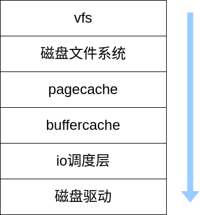
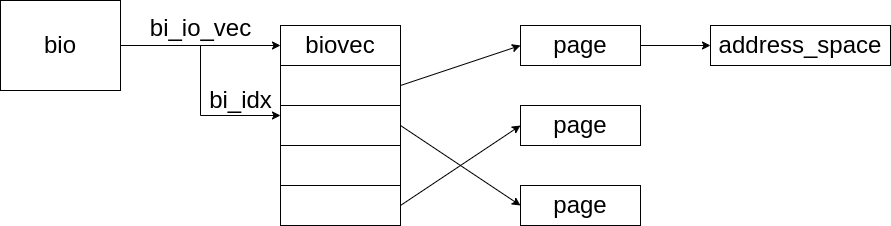
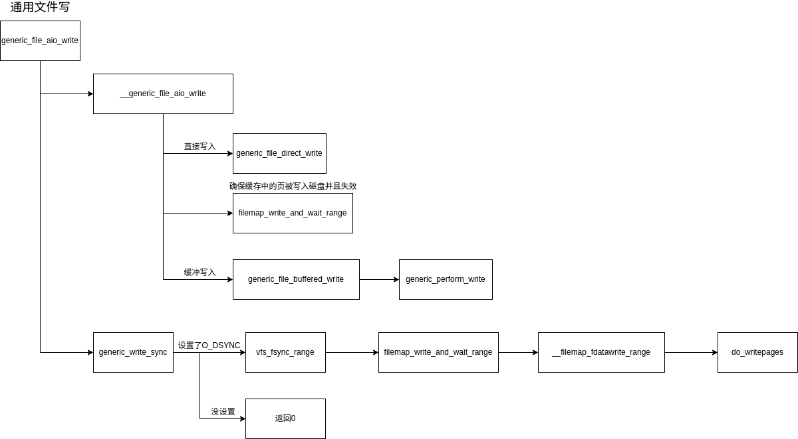
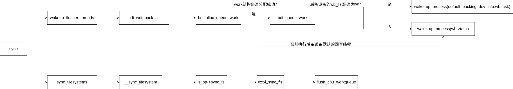
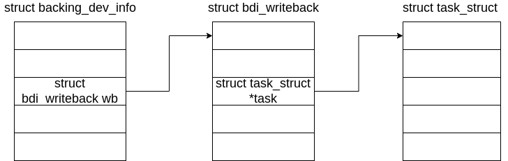
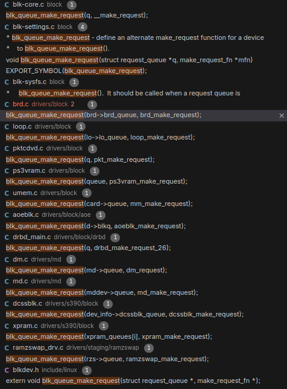
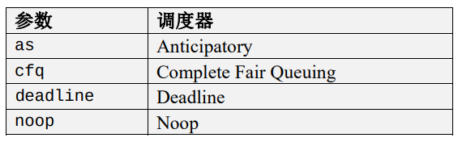
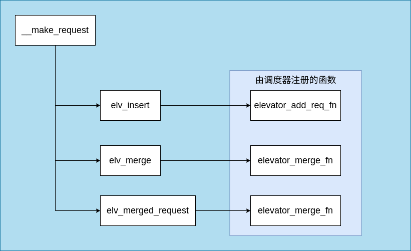
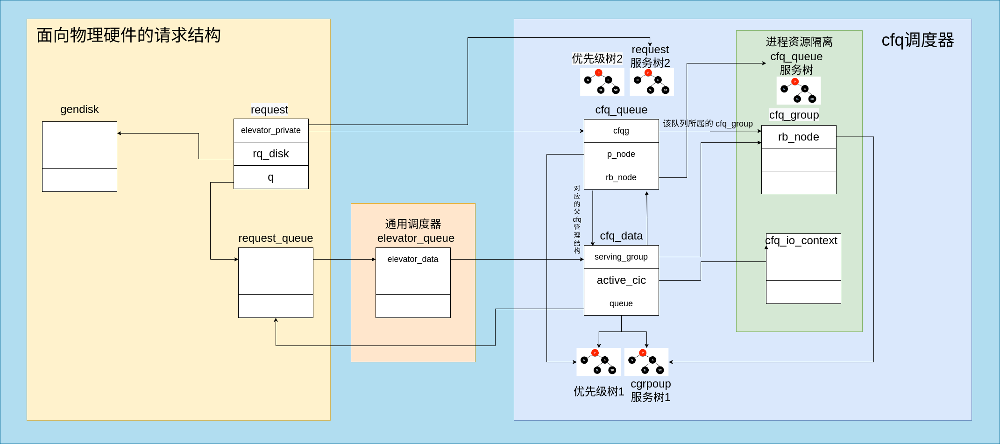

# 文件的写入

Linux 内核对于文件的写入有多种不同的写入机制，针对磁盘与内存来说有直接写入与延迟写入两种。

大体上可以分为两部分，分别为由用户进程写入到 pagechae ，与从 pagecache 写入到磁盘两部分。

下图为文件写入需要经过的层级。



## pagechae 与 buffercache

### 为什么需要缓存策略

1. 磁盘相对cpu来说是一个低速设备
2. 对于磁盘数据的写入并不是立即写入的，还需要等待io调度的流程。

### 概念

磁盘的操作有逻辑级（文件系统）和物理级（磁盘块），这两种Cache就是分别缓存逻辑和物理级数据的。

* page cache :页缓存,负责缓存逻辑数据。

* buffer cache : 块缓存,负责缓存物理数据。

### 数据结构

#### page cache

与 page cache 相关的核心数据结构即为 address_space。

```c
struct address_space {
	/* 所属的 inode 或块设备 */
	// 通常address_space会和索引节点(inode)关联，此时host指向此inode
	// 如果address_space不是和索引节点关联，比如和swapper关联，则host域是NULL。
	struct inode		*host;		/* owner: inode, block_device */
	/* 包含全部页面的 radix 树 */
	struct radix_tree_root	page_tree;	/* radix tree of all pages */
	/* 保护基数树的自旋锁 */
	spinlock_t		tree_lock;	/* and lock protecting it */
	/* 可写的 VM_SHARED 映射的计数 */	
	unsigned int		i_mmap_writable;/* count VM_SHARED mappings */
	/* 私有和共享映射的优先级树 */
	// imap是一个优先搜索树，它的搜索范围包含了在address_space范围内所有共享的和私有的映射页面。
	// 优先搜索树是将堆和radix结合形成的快速检索树。可以帮助内核高效找到关联的被缓存文件
	// i_mmap - 根据 vm_area_struct，能够快速的找到关联的缓存文件(即 address_space)，
	struct prio_tree_root	i_mmap;		/* tree of private and shared mappings */
	/* VM_NONLINEAR 映射列表 */
	struct list_head	i_mmap_nonlinear;/*list VM_NONLINEAR mappings */
	/* 保护映射树、计数和列表的自旋锁 */	/* 保护 i_map 的自旋锁 */
	spinlock_t		i_mmap_lock;	/* protect tree, count, list */
	/* 用于处理与截断操作相关的竞态条件 */
	// 截断计数
	unsigned int		truncate_count;	/* Cover race condition with truncate */
	/* 总页数 */
	// address_space页面总数
	unsigned long		nrpages;	/* number of total pages */
	/* 从这里开始回写 */
	// 回写的起始偏移
	pgoff_t			writeback_index;/* writeback starts here */
	/* 方法操作集 */
	const struct address_space_operations *a_ops;	/* methods */
	/* 错误位/内存分配标志 */
	// gfp_mask掩码（内存分配时使用）与错误标识
	unsigned long		flags;		/* error bits/gfp mask */
	/* 后备设备信息，如预读取等 */
	// 预读信息
	struct backing_dev_info *backing_dev_info; /* device readahead, etc */
	// 私有address_space锁
	spinlock_t		private_lock;	/* for use by the address_space */
	// 私有address_space链表
	struct list_head	private_list;	/* ditto */
	// 相关的缓冲
	struct address_space	*assoc_mapping;	/* ditto */
} __attribute__((aligned(sizeof(long))));	/* 确保结构体按长整型大小对齐 */
// 确保结构体按长整型大小对齐，这在大多数架构上已经是默认行为，但在一些架构如CRIS上需要显式声明。
	/*
	 * On most architectures that alignment is already the case; but
	 * must be enforced here for CRIS, to let the least signficant bit
	 * of struct page's "mapping" pointer be used for PAGE_MAPPING_ANON.
	 */
```

`address_space_operations` 结构被记录在address_space中，该结构中的函数在文件系统中被注册。

```c
struct address_space_operations {
	// 写入页面到磁盘
	int (*writepage)(struct page *page, struct writeback_control *wbc);
	// 从磁盘读取页面到内存
	int (*readpage)(struct file *, struct page *);
	// 同步页面（确保页面完全写入磁盘）
	void (*sync_page)(struct page *);

	/* Write back some dirty pages from this mapping. */
	/* 从这个映射写回一些脏页面 */
	int (*writepages)(struct address_space *, struct writeback_control *);

	/* Set a page dirty.  Return true if this dirtied it */
	/* 设置页面为脏。如果此操作让页面变脏则返回true */
	int (*set_page_dirty)(struct page *page);

	// 批量读取多个页面
	int (*readpages)(struct file *filp, struct address_space *mapping,
			struct list_head *pages, unsigned nr_pages);

	// 开始写操作前的处理
	int (*write_begin)(struct file *, struct address_space *mapping,
				loff_t pos, unsigned len, unsigned flags,
				struct page **pagep, void **fsdata);
	// 完成写操作之后的处理
	int (*write_end)(struct file *, struct address_space *mapping,
				loff_t pos, unsigned len, unsigned copied,
				struct page *page, void *fsdata);

	/* Unfortunately this kludge is needed for FIBMAP. Don't use it */
	/* 不幸地，这个替代品是FIBMAP所需要的。请勿使用它 */
	sector_t (*bmap)(struct address_space *, sector_t);
	// 使页面无效
	void (*invalidatepage) (struct page *, unsigned long);
	// 释放一个页面
	int (*releasepage) (struct page *, gfp_t);
	// 执行直接I/O操作
	ssize_t (*direct_IO)(int, struct kiocb *, const struct iovec *iov,
			loff_t offset, unsigned long nr_segs);
	// 获取执行内存的地址
	int (*get_xip_mem)(struct address_space *, pgoff_t, int,
						void **, unsigned long *);
	/* migrate the contents of a page to the specified target */
	/* 迁移一个页面的内容到指定的目标 */
	int (*migratepage) (struct address_space *,
			struct page *, struct page *);
	// 清洗页面，通常用于清除页面的缓存状态
	int (*launder_page) (struct page *);
	// 检查页面的部分区域是否是最新的
	int (*is_partially_uptodate) (struct page *, read_descriptor_t *,
					unsigned long);
	// 错误移除页面处理
	int (*error_remove_page)(struct address_space *, struct page *);
};
```

#### buffer cache

在 buffer cache 中用到有三种结构体。

其中 buffer_head 用于对磁盘块的管理。一个 buffer_head 可能对应了多个物理扇区。

其中成员 `b_data` 指向用于存放缓冲数据的内存。

```c
struct buffer_head {
	// 缓冲区的状态标志，在bh_state_bits的enum中
	unsigned long b_state;		/* buffer state bitmap (see above) */
	// 页面中的缓冲区
	// b_this_page 字段链接了同一物理页的所有缓冲区头，形成一个循环链表。
	// 因为一个页4K，如果一个块1K，那么一页就可以有4个缓冲区，b_this_page将这4个缓冲区连在一起
	struct buffer_head *b_this_page;/* circular list of page's buffers */
	// 存储缓冲区的页面（与缓冲区对应的内存物理页）
	struct page *b_page;		/* the page this bh is mapped to */

	// 起始块号，是b_bdev域所对应的设备的逻辑块号
	sector_t b_blocknr;		/* start block number */
	// 映像的大小
	size_t b_size;			/* size of mapping */
	// 页面内的数据指针，直接指向相应的块（它位于b_page域所指明的页面中的某个位置上）
	// 块大小是b_size，所以块在内存中的起始位置是b_data，结束位置是b_data+b_size
	/*
	 * buffer_head中的b_data指向对应的缓冲区地址。注意：如果page是high mem,b_data
	 * 存放的缓冲区业内的偏移量，比如第一个缓冲区b_data = 0，第二个是1K，第三个是2K。
	 * 如果page在非high mem，b_data指向对应缓冲区的虚拟地址。
	 */
	char *b_data;			/* pointer to data within the page */
	
	// 相关联的块设备
	struct block_device *b_bdev;
	// I/O完成方法
	bh_end_io_t *b_end_io;		/* I/O completion */
	// 为 b_end_io 保留的私有数据
 	void *b_private;		/* reserved for b_end_io */
	// 相关的映射链表
	struct list_head b_assoc_buffers; /* associated with another mapping */
	// 相关的地址空间
	struct address_space *b_assoc_map;	/* mapping this buffer is
						   associated with */
	// 缓冲区使用计数，通过get_bh和put_bh增加或减少引用计数。
	atomic_t b_count;		/* users using this buffer_head */
};
```

`bio` 中则记录对于io请求的信息。

```c
struct bio {  
   sector_t bi_sector; /*我们想在块设备的第几个扇区上进行io操作（起始扇区），此处扇区大小是按512计算的*/
   struct bio *bi_next;
   struct block_device *bi_bdev; /*指向块设备描述符的指针，该io操作是针对哪个块设备的*/
   unsigned long bi_rw; /*该io操作是读还是写*/
   unsigned short bi_vcnt; /* bio的bio_vec数组中段的数目 */
   unsigned short bi_idx; /* bio的bio_vec数组中段的当前索引值 */
   unsigned short bi_phys_segments; //合并之后bio中（内存）物理段的数目
   unsigned int bi_size; /* 需要传送的字节数 */
   bio_end_io_t *bi_end_io; /* bio的I/O操作结束时调用的方法 */
   void *bi_private; //通用块层和块设备驱动程序的I/O完成方法使用的指针
   unsigned int bi_max_vecs; /* bio的bio vec数组中允许的最大段数 */
   atomic_t bi_cnt; /* bio的引用计数器 */
   struct bio_vec *bi_io_vec; /*指向bio的bio_vec数组中的段的指针 */
   struct bio_set *bi_pool;
   struct bio_vec bi_inline_vecs[0];/*一般一个bio就一个段，bi_inline_vecs就可满足，省去了再为bi_io_vec分配空间*/
}
```

一个bio可能有很多个bio段，这些bio段在内存是可能不连续，位于不同的页，但在磁盘上对应的位置是连续的。一般上层构建bio的时候都是只有一个bio段。(新的DMA支持多个不连续内存的数据传输)

```c
struct bio_vec {
   struct page *bv_page; //指向段的页框对应页描述符的指针 
   unsigned int bv_len; //段的字节长度，长度可以超过一个页
   unsigned int bv_offset; //页框中段数据的偏移量
};
```



bio 与 buffer_head 间的关系在函数 `submit_bh` 中被联系到一起。

```c
// submit_bh初始化和提交bio结构以进行I/O操作。它处理缓冲头状态，确定是否添加写屏障，并在完成后释放bio。
int submit_bh(int rw, struct buffer_head * bh)
{
	struct bio *bio;
	int ret = 0;

	// 检查缓冲头的一致性
	BUG_ON(!buffer_locked(bh));
	BUG_ON(!buffer_mapped(bh));
	BUG_ON(!bh->b_end_io);
	BUG_ON(buffer_delay(bh));
	BUG_ON(buffer_unwritten(bh));

	/*
	 * Mask in barrier bit for a write (could be either a WRITE or a
	 * WRITE_SYNC
	 */
	// 对写入操作添加写屏障
	if (buffer_ordered(bh) && (rw & WRITE))
		rw |= WRITE_BARRIER;

	/*
	 * Only clear out a write error when rewriting
	 */
	// 清除写错误标记以重新写入
	if (test_set_buffer_req(bh) && (rw & WRITE))
		clear_buffer_write_io_error(bh);

	/*
	 * from here on down, it's all bio -- do the initial mapping,
	 * submit_bio -> generic_make_request may further map this bio around
	 */
	// 分配bio结构，设置其字段，为数据传输做准备
	bio = bio_alloc(GFP_NOIO, 1);

	// 设置扇区号和设备
	bio->bi_sector = bh->b_blocknr * (bh->b_size >> 9);
	bio->bi_bdev = bh->b_bdev;
	bio->bi_io_vec[0].bv_page = bh->b_page;
	bio->bi_io_vec[0].bv_len = bh->b_size;
	bio->bi_io_vec[0].bv_offset = bh_offset(bh);

	bio->bi_vcnt = 1;
	bio->bi_idx = 0;
	bio->bi_size = bh->b_size;

	bio->bi_end_io = end_bio_bh_io_sync;
	bio->bi_private = bh;

	// 提交bio进行I/O操作
	bio_get(bio);
	submit_bio(rw, bio);

	// 检查是否支持该操作
	if (bio_flagged(bio, BIO_EOPNOTSUPP))
		ret = -EOPNOTSUPP;

	// 释放bio结构
	bio_put(bio);
	return ret;
}
EXPORT_SYMBOL(submit_bh);
```

### page cache 与 buffer cache 的联系

## 由用户进程写入到 pagechae

在这一部分中经历了如下过程：

```c
sys_write() -> vfs_write() -> f_op->write() -> do_sync_write() -> f_op->aio_write() -> ext4_file_write() -> generic_file_aio_write() -> __generic_file_aio_write() generic_file_buffered_write() -> generic_perform_write()
```



在函数 `__generic_file_aio_write` 中处理了缓冲写入与直接写入的情况。对于直接写入会调用页面回写，将文件页的映射回写至磁盘中再返回结果。而对于缓冲写入，在将文件内容写入到页缓存中就会返回结果。

在函数 `generic_file_aio_write` 中对 O_DSYNC 参数进行了处理。对于有设置 O_DSYNC 的文件，会将文件页的映射回写至磁盘中再返回结果。如果没有设置，则直接返回 0 。

最终在函数 `generic_perform_write` 中通过对结构体 address_space 的操作完成对于页缓存的写操作。

```c
static ssize_t generic_perform_write(struct file *file,
				struct iov_iter *i, loff_t pos)
{
	// 获取文件的地址空间
	struct address_space *mapping = file->f_mapping;
	// 地址空间操作集
	const struct address_space_operations *a_ops = mapping->a_ops;
	long status = 0;	// 状态变量，用于记录操作的结果
	ssize_t written = 0;	// 已写入的字节数
	unsigned int flags = 0;	// 标志位

	// 如果当前上下文是内核数据段，则设置不可中断标志
	if (segment_eq(get_fs(), KERNEL_DS))
		flags |= AOP_FLAG_UNINTERRUPTIBLE;

	do {
		// 页面指针
		struct page *page;
		// 当前页在页缓存中的索引
		pgoff_t index;		/* Pagecache index for current page */
		// 页内偏移
		unsigned long offset;	/* Offset into pagecache page */
		// 要写入的字节数
		unsigned long bytes;	/* Bytes to write to page */
		// 实际从用户空间拷贡的字节数
		size_t copied;		/* Bytes copied from user */
		// 文件系统相关数据，由write_begin返回
		void *fsdata;

		// 计算页内偏移
		offset = (pos & (PAGE_CACHE_SIZE - 1));
		// 计算页索引
		index = pos >> PAGE_CACHE_SHIFT;
		// 计算此次操作的最大字节数
		bytes = min_t(unsigned long, PAGE_CACHE_SIZE - offset,
						iov_iter_count(i));

again:

		// 检查是否有足够的用户空间可以读取
		if (unlikely(iov_iter_fault_in_readable(i, bytes))) {
			status = -EFAULT;	// 地址错误
			break;
		}

		// 开始写操作之前的准备，可能包括锁定页等
		status = a_ops->write_begin(file, mapping, pos, bytes, flags,
						&page, &fsdata);
		if (unlikely(status))
			break;

		// 如果地址空间被映射为可写，则刷新页面缓存
		if (mapping_writably_mapped(mapping))
			flush_dcache_page(page);

		pagefault_disable();	// 禁用页错误
		// 从用户空间拷贡数据
		copied = iov_iter_copy_from_user_atomic(page, i, offset, bytes);
		pagefault_enable();	// 启用页错误
		flush_dcache_page(page);	// 刷新页面缓存，x86中为空实现

		mark_page_accessed(page);	// 标记页面为已访问
		// 完成写操作，解锁页等
		status = a_ops->write_end(file, mapping, pos, bytes, copied,
						page, fsdata);
		if (unlikely(status < 0))
			break;
		copied = status;

		// 条件调度，允许其他进程运行
		cond_resched();

		// 推进迭代器
		iov_iter_advance(i, copied);
		if (unlikely(copied == 0)) {
			/*
			 * If we were unable to copy any data at all, we must
			 * fall back to a single segment length write.
			 *
			 * If we didn't fallback here, we could livelock
			 * because not all segments in the iov can be copied at
			 * once without a pagefault.
			 */
			bytes = min_t(unsigned long, PAGE_CACHE_SIZE - offset,
						iov_iter_single_seg_count(i));
			// 如果未拷贡任何数据，尝试更小的单片段写入
			goto again;
		}
		pos += copied;	 // 更新位置
		written += copied;	// 更新写入字节数

		// 平衡脏页，按需写入
		balance_dirty_pages_ratelimited(mapping);

		// 如果还有数据未写入，则继续循环
	} while (iov_iter_count(i));

	// 返回写入的字节数或错误状态
	return written ? written : status;
}
```

## pagecache 的回写

### 回写的时机

Page cache 回写的时机主要由内核中的写回机制（writeback mechanism）控制，用于将脏页（dirty pages）从内存中的 page cache 写回到磁盘，以确保数据持久化。这些回写操作可以基于多种触发条件，下面是一些常见的时机：

1. 内存压力（Memory Pressure）

   当系统的可用内存不足时，内核会通过 kswapd 或直接内存回收路径启动回写操作，将 page cache 中的脏页写回磁盘，以释放内存空间。
   - 触发条件：可用内存不足，系统需要回收内存以应对内存需求。
   - 执行者：kswapd 线程或直接回收路径中的进程。

2. 定期的写回（Periodic Writeback）
   Linux 内核有一个后台线程 flush 或 pdflush（旧内核）负责定期扫描 page cache 中的脏页并将它们写回磁盘。这个定期写回过程是为了防止脏页长期堆积在内存中。
   - 触发条件：后台线程根据系统配置的时间间隔，定期扫描并回写脏页。典型的配置值为 30 秒。
   - 执行者：flush 线程。

3. 脏页超过阈值（Dirty Page Thresholds）
   当系统中的脏页数量超过了设定的阈值时，内核会主动触发写回操作。这些阈值可以通过 /proc/sys/vm/ 下的参数进行调整，例如 dirty_ratio 和 dirty_background_ratio。
   
   dirty_ratio：内存中脏页占总内存的比例，当达到这个比例时，会强制所有进程进行同步回写。dirty_background_ratio：当脏页占用的内存比例超过这个值时，后台写回线程会启动写回操作。

   - 触发条件：脏页数量超过了设定的阈值。
   - 执行者：flush 线程或触发写回操作的用户进程。

4. 显式同步调用（Explicit Sync Calls）

   当用户进程调用 sync(), fsync(), 或 msync() 系统调用时，会触发脏页的同步回写。这些操作是用户显式要求数据持久化到磁盘。
   - 触发条件：用户进程调用 sync, fsync, 或 msync 系统调用。
   - 执行者：用户进程。

5. 文件关闭（File Close）

   当进程关闭文件描述符时，特别是使用 O_SYNC 或 O_DIRECT 打开的文件，在文件关闭时，内核会确保相关的脏页被同步写回到磁盘。
   - 触发条件：进程关闭文件。
   - 执行者：用户进程。

6. 设备卸载（Device Unmount）

   在卸载文件系统或设备时，内核会触发写回操作，以确保所有脏页在设备卸载前被同步到存储介质中。
   - 触发条件：设备或文件系统的卸载。
   - 执行者：内核的文件系统管理代码。

7. 进程内存映射的同步（Memory Mapped File Sync）

   使用 mmap() 映射到用户空间的文件，当映射的内存区域被修改时，脏页可能会在适当的时机通过 msync() 或 munmap() 被写回磁盘。
   - 触发条件：调用 msync() 或 munmap()。
   - 执行者：用户进程

在本文中针对系统调用主动要求回写这种情况进行分析。

### sync

sync 系统调用的功能是将所有系统中的已修改的文件数据同步到磁盘上。它会确保文件系统的元数据和文件数据（例如文件内容、目录、索引节点等）被写回到持久存储设备（如硬盘）。

对于 sync 的处理分为两部分，其中一部分为对于已经写入到 pagecache 中的内容，另一部分则为文件系统原生的数据如 super_block 等的回写。



在上图中 `wakeup_flusher_threads` 函数这一路进行对于页的回写。

在函数 `bdi_writeback_all` 遍历后备设备列表，并为后备设备列表中有脏数据的设备安排回写任务。

最终会调用后备设备中注册的回写线程进行回写。



对于没有注册的设备，则使用通用的回写策略 `default_backing_dev_info.wb` 中注册的回写线程。

而对于 wb->task 则在函数 `bdi_register` 中先被统一注册为 `bdi_forker_task`

```c
    if (bdi_cap_flush_forker(bdi)) {
		struct bdi_writeback *wb = &bdi->wb;

		// 启动 bdi_forker_task 线程
		wb->task = kthread_run(bdi_forker_task, wb, "bdi-%s",
						dev_name(dev));
		if (IS_ERR(wb->task)) {	// 如果线程启动失败
			wb->task = NULL;
			ret = -ENOMEM;	// 内存错误

			bdi_remove_from_list(bdi);	// 移除 bdi
			goto exit;
		}
	}
```

而在函数 `bdi_forker_task` 中则会再次创建线程执行 `bdi_start_fn` 函数。

回写线程中的执行流

```c
bdi_forker_task() -> bdi_start_fn() -> bdi_writeback_task() -> wb_do_writeback() -> wb_writeback() - writeback_inodes_wb() -> writeback_sb_inodes() -> writeback_single_inode() -> mapping->a_ops->writepages() -> mpage_writepages() -> write_cache_pages()
```

回写任务的参数会通过 fs/fs-writeback.c 的 writeback_sb_inodes 函数传递给 struct writeback_control wbc。

后续在 mm/page-writeback.c 中 write_cache_pages 就会根据 wbc 的 tagged_writepages 字段进行判断，配置不同的 tag，以及是否需要快速遍历脏页并标记。

最终在函数 write_cache_pages() 完成对文件页面的回写。

### fsync

fsync 的函数调用流程

```c
do_fsync() -> vfs_fsync() -> vfs_fsync_range() -> fop->fsync() -> simple_fsync() -> writeback_single_inode() -> mapping->a_ops-> writepages() -> mpage_writepages() -> write_cache_pages()
```


## 由 page cache 到 buffer cache

无论是fsync还是sync，在文件页的回写流程都会调用pagecache中的接口。

在前文中自 `mapping->a_ops-> writepages()` 开始，则进入到了 pagecache 的层次中。

在函数 `mpage_writepages` 中完成了对于 `mpage_data` 结构的填写。


并将 `__mpage_writepage` 作为回调函数在 `write_cache_pages` 中被调用。

```c
//ext2 文件系统中的 mapping->a_ops-> writepages() 中调用 mpage_writepages 传递的参数
return mpage_writepages(mapping, wbc, ext2_get_block);
```

```c
int mpage_writepages(struct address_space *mapping,
		struct writeback_control *wbc, get_block_t get_block)
{
	int ret;

	// 如果没有提供特定的块映射函数，使用通用的writepages方法
	if (!get_block)
		ret = generic_writepages(mapping, wbc);
	else {
		struct mpage_data mpd = {
			.bio = NULL,	// 初始化bio结构为NULL
			.last_block_in_bio = 0,	// 最后一个bio块的索引初始化为0
			.get_block = get_block,	// 设置块映射函数
			.use_writepage = 1,			// 设置使用writepage的标志
		};

		// 执行具体的页面写操作
		ret = write_cache_pages(mapping, wbc, __mpage_writepage, &mpd);
		// 如果bio不为空，则提交bio
		if (mpd.bio)
			mpage_bio_submit(WRITE, mpd.bio);
	}
	return ret;
}
```

最终调用 `mpage_bio_submit` 将bio请求提交。在这里则进入到了 buffercache 中。

## 块io调度层

### request_queue

对于块io请求的操作，主要围绕 request_queue 结构展开。

```c
struct request_queue {
	/*
	 * 与 queue_head 一起用于缓存行共享
	 */
	struct list_head	queue_head;     /* 请求队列头 */
	struct request		*last_merge;    /* 最后一个被合并的请求 */
	struct elevator_queue	*elevator;      /* I/O 调度器 */

	/*
	 * 请求队列的空闲列表，分别为读取和写入请求
	 */
	struct request_list	rq;             /* 管理空闲请求的列表 */

	request_fn_proc		*request_fn;    /* 处理请求的函数 */
	make_request_fn		*make_request_fn; /* 直接创建请求的函数 */
	prep_rq_fn		*prep_rq_fn;    /* 准备请求的函数 */
	unplug_fn		*unplug_fn;     /* 设备插拔函数 */
	merge_bvec_fn		*merge_bvec_fn; /* 合并 bio 向量的函数 */
	prepare_flush_fn	*prepare_flush_fn; /* 准备刷新的函数 */
	softirq_done_fn		*softirq_done_fn; /* 处理完软中断后的函数 */
	rq_timed_out_fn		*rq_timed_out_fn; /* 请求超时处理函数 */
	dma_drain_needed_fn	*dma_drain_needed; /* 需要 DMA drain 的函数 */
	lld_busy_fn		*lld_busy_fn;    /* 低级设备忙碌的函数 */

	/*
	 * 调度队列排序
	 */
	sector_t		end_sector;      /* 结束扇区 */
	struct request		*boundary_rq;    /* 边界请求 */

	/*
	 * 自动插拔状态
	 */
	struct timer_list	unplug_timer;    /* 插拔计时器 */
	int			unplug_thresh;   /* 触发插拔的请求阈值 */
	unsigned long		unplug_delay;    /* 插拔延迟，以 jiffies 计 */
	struct work_struct	unplug_work;     /* 插拔工作结构 */

	struct backing_dev_info	backing_dev_info; /* 后端设备信息 */

	/*
	 * 队列所有者可以使用这个字段做任何他们喜欢的事情。
	 * ll_rw_blk 不会接触它。
	 */
	void			*queuedata;      /* 队列数据，供所有者使用 */

	/*
	 * 队列需要反弹页用于高于此限制的页面
	 */
	gfp_t			bounce_gfp;      /* 分配反弹缓冲区的 GFP 标志 */

	/*
	 * 各种队列标志，见下面的 QUEUE_*
	 */
	unsigned long		queue_flags;     /* 队列标志位 */

	/*
	 * 保护队列结构免受重入。->__queue_lock 应该 _永远_ 不被直接使用，
	 * 它是队列私有的。总是使用 ->queue_lock。
	 */
	spinlock_t		__queue_lock;    /* 队列的内部锁 */
	spinlock_t		*queue_lock;     /* 队列的锁指针 */

	/*
	 * 队列 kobject
	 */
	struct kobject kobj;               /* 队列的内核对象 */

	/*
	 * 队列设置
	 */
	/* 请求的最大数目 */
	unsigned long		nr_requests;	/* Max # of requests */
	unsigned int		nr_congestion_on; /* 启动拥塞的请求数 */
	unsigned int		nr_congestion_off; /* 停止拥塞的请求数 */
	unsigned int		nr_batching;    /* 批处理数 */

	void			*dma_drain_buffer; /* DMA drain 缓冲区 */
	unsigned int		dma_drain_size; /* DMA drain 缓冲区大小 */
	unsigned int		dma_pad_mask;   /* DMA 填充掩码 */
	unsigned int		dma_alignment;  /* DMA 对齐 */

	struct blk_queue_tag	*queue_tags;    /* 队列标签 */
	struct list_head	tag_busy_list;  /* 繁忙标签列表 */

	unsigned int		nr_sorted;      /* 已排序的数目 */
	unsigned int		in_flight[2];   /* 飞行中的请求数 */

	unsigned int		rq_timeout;     /* 请求超时时间 */
	struct timer_list	timeout;        /* 超时计时器 */
	struct list_head	timeout_list;   /* 超时列表 */

	struct queue_limits	limits;         /* 队列限制 */
	//sg 相关
	unsigned int		sg_timeout;	/* sg 超时 */
	unsigned int		sg_reserved_size;	/* 预留 sg 大小 */
	int			node;		/* NUMA 节点 */
#ifdef CONFIG_BLK_DEV_IO_TRACE
	struct blk_trace	*blk_trace;	/* I/O 跟踪 */
#endif
	/*
	 * reserved for flush operations
	 */
	/*
	 * 保留用于刷新操作
	 */
	unsigned int		ordered, next_ordered, ordseq;
	int			orderr, ordcolor;
	struct request		pre_flush_rq, bar_rq, post_flush_rq;
	struct request		*orig_bar_rq;	/* 原始刷新请求 */

	struct mutex		sysfs_lock;			/* sysfs 锁 */

#if defined(CONFIG_BLK_DEV_BSG)
	struct bsg_class_device bsg_dev;		/* 块存储管理设备 */
#endif
};

```

### 提交流程

```c
mpage_bio_submit() -> submit_bio() -> generic_make_request() -> __generic_make_request() -> q->make_request_fn()
```

```c
void generic_make_request(struct bio *bio)
{
	struct bio_list bio_list_on_stack;

	/* 当前任务中make_request已激活 */
	// 如果当前线程的bio_list不为空，说明generic_make_request正在处理另一个请求。
	// 在这种情况下，将新的bio添加到当前线程的bio_list中，并返回。
	if (current->bio_list) {
		/* make_request is active */
		bio_list_add(current->bio_list, bio);
		return;
	}
	// 如果bio_list为空，说明当前没有活跃的make_request，
	// 则初始化一个本地的bio_list，并将其设置为当前线程的bio_list。
	BUG_ON(bio->bi_next);
	bio_list_init(&bio_list_on_stack);
	current->bio_list = &bio_list_on_stack;
	// 使用do...while循环来处理bio列表。每次循环调用__generic_make_request函数处理一个bio，
	// 然后从bio_list中取出下一个bio进行处理，直到列表为空。
	do {
		__generic_make_request(bio);
		bio = bio_list_pop(current->bio_list);
	} while (bio);
	/* 停用make_request标志 */
	// 将current->bio_list设置为NULL，标志着make_request处理结束。
	current->bio_list = NULL; /* deactivate */
}
EXPORT_SYMBOL(generic_make_request);
```

在 `request_queue` 结构中的make_request_fn函数经过函数`blk_queue_make_request`，由不同的底层驱动注册。

下图为注册 `make_request_fn`



针对普通的 block 设备在 /block/blk-core.c 中被 `blk_init_queue_node` 注册为 `__make_request`。

```c
blk_queue_make_request(q, __make_request);
```

__make_request（）主要的操作如下：

1. **屏障检查与处理**:
   - 检查是否存在屏障标记（`BIO_RW_BARRIER`），若队列不支持有序请求（`QUEUE_ORDERED_NONE`），则直接结束请求并返回不支持的错误 (`-EOPNOTSUPP`)。

2. **内存页反弹处理**:
   - 使用 `blk_queue_bounce` 检查并处理需要反弹到低内存的页面。这通常适用于处理高端内存或 DMA 的情况。

3. **队列锁定与请求合并**:
   - 使用自旋锁保护请求队列的访问。
   - 如果队列为空或 `bio` 被标记为屏障，跳转到获取新请求的步骤。
   - 尝试将新的 `bio` 请求与现有的请求合并：
     - **后向合并**（`ELEVATOR_BACK_MERGE`）：将新请求的数据追加到现有请求的后面。
     - **前向合并**（`ELEVATOR_FRONT_MERGE`）：将新请求的数据插入到现有请求的前面。
     - **不合并**（`ELV_NO_MERGE`）：当电梯算法决定不进行合并时。

4. **请求分配**:
   - 如果不能合并，调用 `get_request_wait` 分配一个新的请求。此操作可能会睡眠等待可用请求，但不会失败。
   - 初始化新请求，并将其与 `bio` 相关联。

5. **请求插入队列**:
   - 再次锁定队列并配置请求的 CPU 亲和性。
   - 如果队列需要插入一个新请求，则将其添加到请求队列中。

6. **队列解锁与处理结束**:
   - 检查是否需要解除队列阻塞，并释放队列锁定。

__elv_add_request 将bio插入到一个新的请求中。

__blk_run_queue 函数调用块设备驱动服务例程q->request_fn（）来直接处理请求，
进行数据读写。

处理请求的函数执行流：

```c
__make_request() -> add_request() -> __elv_add_request() -> elv_insert()
```

在函数 elv_insert 中会根据不同的位置插入标志对请求进行处理

1. ELEVATOR_INSERT_FRONT 在队列前部插入，设置软障碍标志

   对于插入队头的操作，直接插入到 q->queue_head。

2. ELEVATOR_INSERT_BACK 在队列尾部插入，设置软障碍标志
   
   对于插入队尾的操作，插入到 q->queue_head，插入后则直接调用 __blk_run_queue 处理请求队列。

3. ELEVATOR_INSERT_SORT 按顺序插入，设置已排序标志
   
   对于排序的顺序插入方式，则需要使用调度器底层提供的请求插入函数

4. ELEVATOR_INSERT_REQUEUE 重排插入，通常由于设备繁忙等原因将请求重新插入队列

对请求进行调度的函数执行流：

```c
__make_request() -> elv_merged_request() -> e->ops->elevator_merged_fn()
```

其中函数被记录在结构体 `elevator_type` 的 `elevator_ops` 成员中，该结构体用于对I/O调度器进行表示。

### 处理读写请求

```c
__blk_run_queue() -> q->request_fn()
```

请求队列处理例程通常是在空的请求队列上插入新的请求后启动。一旦处理例程被激
活，块设备驱动程序就会处理请求队列中的请求，直到队列为空。

在 `request_queue` 结构中记录了函数指针 `request_fn` 。所有请求均由函数 request_fn 处理。

request_fn 函数由底层的驱动程序进行注册。

## I/O 调度器类与调度算法

I/O调度器的工作是管理块设备的请求队列。它决定队列中的请求排列顺序及在什么时
候派发请求到块设备。这样做有利于减少磁盘寻址时间，从而提高全局吞吐量。注意“全局”
的的含义，I/O调度器可能为了提高系统整体性能，而对某些请求不公。

I/O调度器主要通过合并与排序两种策略来减少磁盘寻道的时间。通过请求的合并如果这时队列中已经
前请求访问的磁盘扇区相邻，那么这两个请求就可以合并为一个对单个或多个相邻磁盘扇区
操作的新请求。通过合并请求，I/O调度器将多次请求的开销压缩为一次请求的开销。更重
要的是，请求合并后只需要传递给磁盘一条寻址命令，就可以访问到请求合并前必须多次寻
址才能访问完的磁盘区域了，因此合并请求显然能减少系统开销和磁盘寻址次数。

在使用调度器进行调度前，都会先进行电梯合并处理`elv_merge`函数尝试合并，并通过其返回结果来选择不同的调度器进行处理。

结构体 `elevator_type` 记录了调度器的信息。

```c
struct elevator_type
{
	struct list_head list;                // 链表头，用于将多个elevator_type连接起来，形成链表
	struct elevator_ops ops;              // 该电梯类型的操作集，定义了具体电梯算法的行为
	struct elv_fs_entry *elevator_attrs;  // 指向电梯调度器属性的指针，这些属性可能会暴露给sysfs，用于配置或监控
	char elevator_name[ELV_NAME_MAX];     // 电梯调度器的名称，作为标识
	struct module *elevator_owner;        // 指向该电梯算法所属模块的指针，用于模块化管理
};
```

其中成员 `elevator_ops` 则定义了方法集。

```c
struct elevator_ops
{
	elevator_merge_fn *elevator_merge_fn;            // 合并请求的函数
	elevator_merged_fn *elevator_merged_fn;          // 请求合并后的回调函数
	elevator_merge_req_fn *elevator_merge_req_fn;    // 处理合并请求的函数
	elevator_allow_merge_fn *elevator_allow_merge_fn;// 检查是否允许合并的函数

	elevator_dispatch_fn *elevator_dispatch_fn;      // 调度请求的函数
	elevator_add_req_fn *elevator_add_req_fn;        // 添加请求到队列的函数
	elevator_activate_req_fn *elevator_activate_req_fn; // 激活请求的函数
	elevator_deactivate_req_fn *elevator_deactivate_req_fn; // 取消激活请求的函数

	elevator_queue_empty_fn *elevator_queue_empty_fn;// 检查队列是否为空的函数
	elevator_completed_req_fn *elevator_completed_req_fn;  // 请求完成的回调函数

	elevator_request_list_fn *elevator_former_req_fn;// 获取前一个请求的函数
	elevator_request_list_fn *elevator_latter_req_fn;// 获取后一个请求的函数

	elevator_set_req_fn *elevator_set_req_fn;        // 设置请求处理的函数
	elevator_put_req_fn *elevator_put_req_fn;        // 移除请求的函数

	elevator_may_queue_fn *elevator_may_queue_fn;    // 检查是否可以加入请求的函数

	elevator_init_fn *elevator_init_fn;              // 初始化电梯调度器的函数
	elevator_exit_fn *elevator_exit_fn;              // 退出电梯调度器的函数
	void (*trim)(struct io_context *);               // 可能用于清理IO上下文的函数
};
```

调度队列结构

```c
struct elevator_queue
{
	struct elevator_ops *ops;            // 指向电梯操作结构的指针，定义了电梯调度器的行为
	void *elevator_data;                 // 电梯调度器的数据，可以用于存储特定调度器的内部状态或数据
	struct kobject kobj;                 // 内核对象，用于在sysfs文件系统中表示电梯调度器
	struct elevator_type *elevator_type; // 电梯类型，指向描述电梯调度器类型的结构
	struct mutex sysfs_lock;             // 互斥锁，用于控制对sysfs条目的并发访问
	struct hlist_head *hash;             // 哈希表头指针，可能用于管理调度器中的请求队列或其他散列数据结构
};
```

在2.6内核中有四种不同的I/O调度器，对应四种I/O调度算法。





### CFQ 调度器

如下为 CFQ 中方法集的定义。

```c
// 定义cfq IO 调度
static struct elevator_type iosched_cfq = {
	.ops = {
		.elevator_merge_fn = 		cfq_merge,
		.elevator_merged_fn =		cfq_merged_request,
		.elevator_merge_req_fn =	cfq_merged_requests,
		.elevator_allow_merge_fn =	cfq_allow_merge,
		.elevator_dispatch_fn =		cfq_dispatch_requests,
		.elevator_add_req_fn =		cfq_insert_request,
		.elevator_activate_req_fn =	cfq_activate_request,
		.elevator_deactivate_req_fn =	cfq_deactivate_request,
		.elevator_queue_empty_fn =	cfq_queue_empty,
		.elevator_completed_req_fn =	cfq_completed_request,
		.elevator_former_req_fn =	elv_rb_former_request,
		.elevator_latter_req_fn =	elv_rb_latter_request,
		.elevator_set_req_fn =		cfq_set_request,
		.elevator_put_req_fn =		cfq_put_request,
		.elevator_may_queue_fn =	cfq_may_queue,
		.elevator_init_fn =		cfq_init_queue,
		.elevator_exit_fn =		cfq_exit_queue,
		.trim =				cfq_free_io_context,
	},
	.elevator_attrs =	cfq_attrs,
	.elevator_name =	"cfq",
	.elevator_owner =	THIS_MODULE,
};

```

#### CFQ 中的数据结构

在cfq中有两大关键结构：

1. cfq_data
   cfq_data是管理和调度cfq_queue的结构

2. cfq_queue
   cfq_queue是管理io request的结构

cfq_data 通过选择 cfq_queue 来下发对应的 io request 到设备的 request_queue 中

在引入了io的cgroup之后，cfq_data 通过 cgroup 服务树选择 cfq_group 来先确定服务的对象，而 cfq_group 中的用红黑树管理的 cfq_queue 为二级对象，cfq_queue 中红黑树管理的 request 为三级对象。

各个结构间的关系：



#### 优先级确定

在 CFQ 调度器中分为三种优先级：

- IOPRIO_CLASS_RT

  描述：IOPRIO_CLASS_RT 代表实时优先级（Real-Time Priority）。它用于对需要保证响应时间的 I/O 操作赋予最高优先级。实时优先级的请求会被优先处理，以确保实时任务可以及时完成其 I/O 操作。

  适用场景：适用于对 I/O 响应时间有严格要求的任务，例如高优先级的实时应用程序或系统组件。

- IOPRIO_CLASS_BE

  描述：IOPRIO_CLASS_BE 代表最佳努力优先级（Best-Effort Priority）。它是默认的优先级类别，用于一般的 I/O 操作。最佳努力优先级的请求会根据其优先级和调度策略进行处理，但不会像实时优先级那样保证优先级处理。

  适用场景：适用于常规的 I/O 操作和大多数应用程序，它们不需要特别的实时性能保证。
  
- IOPRIO_CLASS_IDLE

  描述：IOPRIO_CLASS_IDLE 代表空闲优先级（Idle Priority）。它用于将 I/O 请求标记为低优先级，仅在系统处于空闲状态时才处理。空闲优先级的请求不会对系统的整体 I/O 性能造成影响，它们会在其他更高优先级的请求之后被处理。

  适用场景：适用于不急于完成的 I/O 操作或后台任务，这些任务可以在系统空闲时进行处理。

```c
//初始化优先级的步骤
cfq_insert_request() -> cfq_init_prio_data()

//cfq_init_prio_data()中针对不同优先级的处理
	case IOPRIO_CLASS_NONE://当没有设置 I/O 优先级时
		cfqq->ioprio = task_nice_ioprio(tsk);//对于没有设置优先级的io请求，将根据其进程优先级来计算nice值
		cfqq->ioprio_class = task_nice_ioclass(tsk);
		break;
	case IOPRIO_CLASS_RT://当 I/O 优先级类为实时（IOPRIO_CLASS_RT）
		cfqq->ioprio = task_ioprio(ioc);
		cfqq->ioprio_class = IOPRIO_CLASS_RT;
		break;
	case IOPRIO_CLASS_BE://当 I/O 优先级类为后台（IOPRIO_CLASS_BE）时
		cfqq->ioprio = task_ioprio(ioc);
		cfqq->ioprio_class = IOPRIO_CLASS_BE;
		break;
	case IOPRIO_CLASS_IDLE://当 I/O 优先级类为闲置（IOPRIO_CLASS_IDLE）时
		cfqq->ioprio_class = IOPRIO_CLASS_IDLE;
		cfqq->ioprio = 7;
		cfq_clear_cfqq_idle_window(cfqq);
```

nice值的计算：

```c
#define PRIO_TO_NICE(prio)	((prio) - MAX_RT_PRIO - 20)
#define TASK_NICE(p)		PRIO_TO_NICE((p)->static_prio)
```

在优先级设置完之后会将io请求分别加入到队列与红黑树之中。

