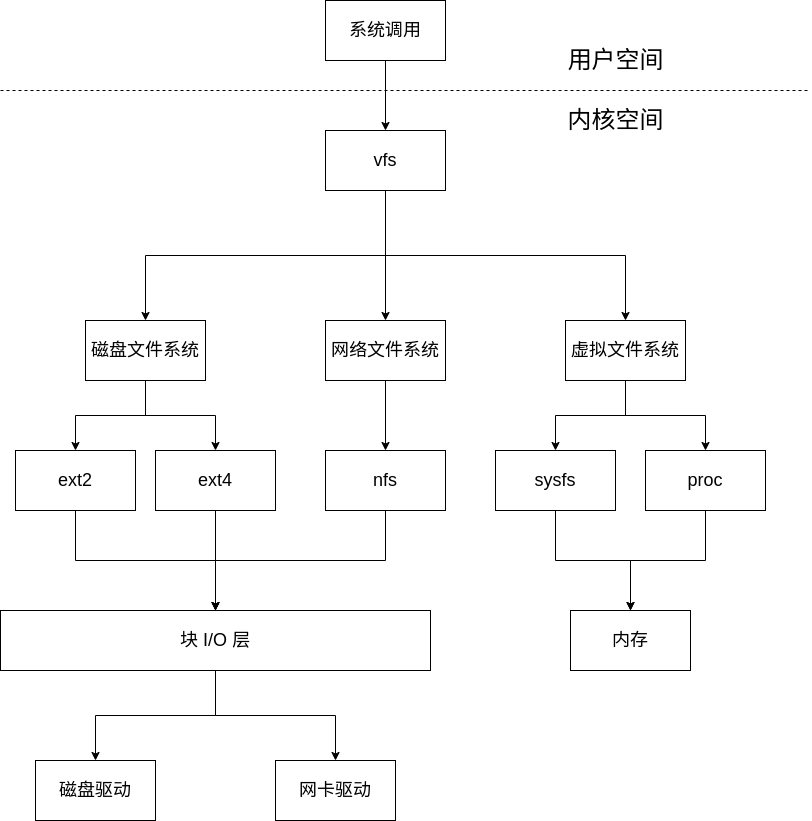
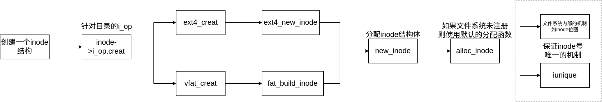
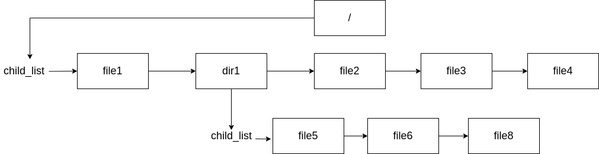
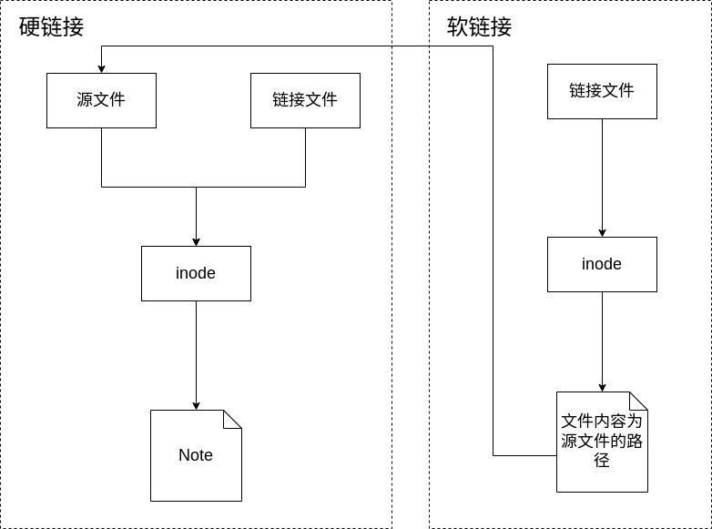

# 文件系统

## 一切皆文件的构想

在 Linux 的设计中秉持着“一切皆文件的构想”。无论是普通的文件还是设备进程等，都可以被视作文件。通过文件系统提供的系统调用对其进行操作。

文件系统依据存储介质的不同可以分为3类。

1. 依托于磁盘的磁盘文件系统
2. 依托于网卡的网络文件系统
3. 依托于内存的虚拟文件系统



虽然具体的文件系统各有不同，但在用户态下无需考虑文件系统的具体操作。无论是什么文件系统都可以通过例如read()，write()这样的系统调用对文件系统进行操作。

那么 Linux 内核如何将各类文件系统的操作向用户屏蔽，只向用户提供统一的系统调用？

由此引入虚拟文件系统 VFS ，VFS 中采取面向对象的设计思想。提供一个基类，再由具体的文件系统实现。从而达到向用户层屏蔽细节的目的。

## VFS 中的结构体

文件系统中面向对象的思想通过诸多类型的结构体，联合体相互关联实现。

### superblock

超级块中存储着文件系统的元信息，包括块大小、文件系统的大小、最大文件大小、根目录的位置等。以供操作系统识别文件系统类型，并对其内部的数据进行处理。

```c
struct super_block {
	struct list_head s_list;		/* 用于将超级块添加到超级块链表中，必须放在结构体的第一个位置 */
	dev_t s_dev;				/* 设备号，用于标识文件系统所关联的设备 */
	unsigned char s_dirt;			/* 标志文件系统是否有脏数据（需要写回磁盘） */
	unsigned char s_blocksize_bits;		/* 块大小的位数，用于计算块大小 */
	unsigned long s_blocksize;		/* 文件系统的块大小（以字节为单位） */
	loff_t s_maxbytes;			/* 文件系统中文件的最大大小 */
	struct file_system_type *s_type;	/* 文件系统类型 */
	const struct super_operations *s_op;	/* 超级块操作函数指针，定义文件系统特定的操作 */
	const struct dquot_operations *dq_op;	/* 磁盘配额操作函数指针 */
	const struct quotactl_ops *s_qcop;	/* 磁盘配额控制操作函数指针 */
	const struct export_operations *s_export_op; /* 导出操作函数指针（用于网络文件系统） */
	unsigned long s_flags;			/* 文件系统标志，用于记录文件系统的状态 */
	unsigned long s_magic;			/* 魔数，用于标识文件系统类型 */
	struct dentry *s_root;			/* 文件系统的根目录入口 */
	struct rw_semaphore s_umount;		/* 读写信号量，用于卸载文件系统的同步控制 */
	struct mutex s_lock;			/* 互斥锁，用于保护超级块的访问 */
	int s_count;				/* 引用计数，表示文件系统被引用的次数 */
	int s_need_sync;			/* 标志是否需要同步 */
	atomic_t s_active;			/* 活动计数，用于引用计数 */
#ifdef CONFIG_SECURITY
	void *s_security;			/* 安全模块的私有数据（如果启用了安全模块） */
#endif
	struct xattr_handler **s_xattr;		/* 扩展属性处理程序数组 */
	struct list_head s_inodes;		/* 文件系统中的所有 inode 的链表 */
	struct hlist_head s_anon;		/* 匿名 dentry 链表（用于 NFS 导出） */
	struct list_head s_files;		/* 文件系统中的所有文件的链表 */
	struct list_head s_dentry_lru;		/* 未使用的 dentry 的 LRU 链表 */
	int s_nr_dentry_unused;			/* 未使用的 dentry 数量 */
	struct block_device *s_bdev;		/* 关联的块设备 */
	struct backing_dev_info *s_bdi;		/* 后备设备信息 */
	struct mtd_info *s_mtd;			/* 关联的 MTD（内存技术设备）信息 */
	struct list_head s_instances;		/* 超级块实例链表 */
	struct quota_info s_dquot;		/* 磁盘配额特定信息 */
	int s_frozen;				/* 文件系统是否被冻结 */
	wait_queue_head_t s_wait_unfrozen;	/* 用于等待文件系统解冻的等待队列 */
	char s_id[32];				/* 文件系统的标识符名称 */
	void *s_fs_info;			/* 文件系统的私有信息 原生的文件系统超级块信息如 ext4_sb_info*/
	fmode_t s_mode;				/* 文件系统的模式 */
	u32 s_time_gran;			/* c/m/atime 的时间粒度（以纳秒为单位） */
	struct mutex s_vfs_rename_mutex;	/* 用于 VFS 重命名的互斥锁（仅供 VFS 使用） */
	char *s_subtype;			/* 文件系统的子类型 */
	char *s_options;			/* 保存挂载选项 */
};
```

### inode

inode 是文件系统中使用的通用名称,用于描述保存给定文件的元数据的结构,例如其长度、权限以及其组成块的位置。在底层文件系统内 inode 是文件的唯一标识。

```c
struct inode {
    struct hlist_node i_hash;                   // 用于将 inode 插入到哈希链表中的节点
    struct list_head i_list;                    // 支持设备 IO 的链表
    struct list_head i_sb_listi_ino;                 // 超级块 (super block) 的链表
    struct list_head i_dentry;                  // 目录项 (dentry) 链表
    unsigned long ;                        // inode 号码
    atomic_t i_count;                           // 引用计数
    unsigned int i_nlink;                       // 硬链接计数
    uid_t i_uid;                                // 所有者用户 ID
    gid_t i_gid;                                // 所有者组 ID
    dev_t i_rdev;                               // 设备 ID（对于设备文件）
    unsigned int i_blkbits;                     // 块大小的比特数
    u64 i_version;                              // inode 版本号
    loff_t i_size;                              // 文件大小（以字节为单位）
#ifdef __NEED_I_SIZE_ORDERED
    seqcount_t i_size_seqcount;                 // 顺序计数，用于确保 i_size 的一致性
#endif
    struct timespec i_atime;                    // 最后访问时间
    struct timespec i_mtime;                    // 最后修改时间
    struct timespec i_ctime;                    // 最后状态改变时间
    blkcnt_t i_blocks;                          // 占用的块数
    unsigned short i_bytes;                     // 占用的字节数
    umode_t i_mode;                             // 文件类型和权限
    spinlock_t i_lock;                          // 自旋锁，用于保护 i_blocks、i_bytes 和可能的 i_size
    struct mutex i_mutex;                       // 互斥锁
    struct rw_semaphore i_alloc_sem;            // 读写信号量
    const struct inode_operations *i_op;        // inode 操作函数指针
    const struct file_operations *i_fop;        // 文件操作函数指针（之前是 i_op->default_file_ops）
    struct super_block *i_sb;                   // 所属的超级块
    struct file_lock *i_flock;                  // 文件锁
    struct address_space *i_mapping;            // 关联的地址空间（主地址空间）
    struct address_space i_data;                // 数据地址空间
#ifdef CONFIG_QUOTA
    struct dquot *i_dquot[MAXQUOTAS];           // 与 inode 关联的磁盘配额信息
#endif
    struct list_head i_devices;                 // 设备链表
    union {
        struct pipe_inode_info *i_pipe;         // 管道信息
        struct block_device *i_bdev;            // 块设备信息
        struct cdev *i_cdev;                    // 字符设备信息
    };
    __u32 i_generation;                         // inode 生成号
#ifdef CONFIG_FSNOTIFY
    __u32 i_fsnotify_mask;                      // inode 关注的所有事件掩码
    struct hlist_head i_fsnotify_mark_entries;  // fsnotify 标记条目链表
#endif
#ifdef CONFIG_INOTIFY
    struct list_head inotify_watches;           // 这个 inode 上的 inotify 监视列表
    struct mutex inotify_mutex;                 // 保护 inotify 监视列表的互斥锁
#endif
    unsigned long i_state;                      // inode 状态
    unsigned long dirtied_when;                 // 第一次被弄脏的时间（以 jiffies 为单位）
    unsigned int i_flags;                       // inode 标志
    atomic_t i_writecount;                      // 写计数
#ifdef CONFIG_SECURITY
    void *i_security;                           // 安全模块使用的指针
#endif
#ifdef CONFIG_FS_POSIX_ACL
    struct posix_acl *i_acl;                    // POSIX ACL
    struct posix_acl *i_default_acl;            // 默认的 POSIX ACL
#endif
    void *i_private;                            // 文件系统或设备私有指针
};
```

1. VFS 中的 inode 如何与具体的文件系统建立联系？

   以 ext4 文件系统为例：

   ```c
   struct ext4_inode_info {
   	__le32	i_data[15];	/* unconverted */
   	/*......省略掉中间部分*/
   	struct inode vfs_inode;		// 一个vfs_inode节点
   	struct jbd2_inode jinode;
   	/*......省略掉中间部分*/
   };
   ```

   VFS 中的 inode 结构体被内嵌到底层文件系统具体的  *_inode_info 中，而  *_inode_info 中的信息则由底层文件系统中的inode提供。如果底层文件系统不支持 inode 机制，则由其他结构中的内容填入。

   

2. inode 如何记录文件所在的扇区？

   在文件系统原生的结构体中的 i_data 记录了存储着文件内容的磁盘扇区号。早期文件系统中经常使用多级索引结构，如今文件的尺寸越来越大，传统的多级索引结构已经不满足需求。面对这样的现状，诸如 ext4、xfs 等底层的文件系统也给出了自己不同的解决方案。

3. 若底层文件系统（如 Fat 文件系统）不支持 inode 机制又该怎么办？

   - 如果底层的文件系统支持 inode 会将 inode 回写至后备的文件设备中。

   - 如果底层的文件系统不支持 inode 机制的文件系统，会调用系统默认的 alloc_inode 函数，使用 slab 分配器分配出一片内存用来存储 inode 结构中的内容。

4. inode 号如何分配？

   在函数 new_inode 中维护了一个名为 last_ino 的静态变量，在分配 inode 结构时，会将 i_no 赋值为 last_ino 

   - 对于支持 inode 机制的文件系统，底层文件系统会有自身的分配方式，如ext系列中使用 inode 位图的方式分配新的 i_no 号

   - 对于不支持 inode 机制的文件系统，会使用 iunique 函数为 inode 分配 inode 号
   

```c
/**
*max_reserved：该数字来自于 new_inode 函数中的静态变量static unsigned int last_ino
*/
ino_t iunique(struct super_block *sb, ino_t max_reserved)
{
	/*
	 * 对于32位非大文件系统（LFS）的stat()调用，如果st_ino不能适应目标结构字段，
	 * glibc将生成一个EOVERFLOW错误。这里使用32位计数器试图避免这种情况。
	 */
	static unsigned int counter;
	struct inode *inode;
	struct hlist_head *head;
	ino_t res;

	// 获取inode_lock锁，保证唯一inode号生成的原子性
	spin_lock(&inode_lock);
	do {
		// 如果计数器小于等于最大保留值，则将计数器设为最大保留值加1
		if (counter <= max_reserved)
			counter = max_reserved + 1;

		// 生成一个新的inode号，并递增计数器
		res = counter++;
		
		// 计算哈希值，找到对应哈希桶
		head = inode_hashtable + hash(sb, res);
		
		// 快速查找该inode号是否已存在
		inode = find_inode_fast(sb, head, res);
	} while (inode != NULL); // 如果已存在，则重新生成新的inode号

	// 释放inode_lock锁
	spin_unlock(&inode_lock);

	// 返回生成的唯一inode号
	return res;
}
```

### dcache与dentry

dentry 结构体主要用于维护文件系统中文件目录树结构。

在图1中，每访问一次诸如磁盘这样的存储设备，都需要经过 I/O 调度层的操作，且访问磁盘这项操作本身也会花费大量时间。若每次打开文件都需要在磁盘中搜索花费时间太多。因此为了优化查询，在文件系统初始化时会在内存中构建目录树的缓存。

但由于内存大小有限，并不会将文件系统中的所有 dentry 缓存在内存中。在缓存未命中时会由 VFS 调用 lookup 接口向底层文件系统查找获取 inode 信息，以此建立 dentry 和其对应的 inode 结构。

```c
/* 目录项对象结构 */
struct dentry {
	/**
	 * 每个目录项对象都有3种状态：被使用，未使用和负状态
	 * 被使用：对应一个有效的索引节点（d_inode指向相应的索引节点），并且该对象由一个或多个使用者(d_count为正值)
	 * 未使用：对应一个有效的索引节点，但是VFS当前并没有使用这个目录项(d_count为0)
	 * 负状态：没有对应的有效索引节点（d_inode为NULL），因为索引节点被删除或者路径不存在了，但目录项仍然保留，以便快速解析以后的路径查询。
	 */
	// 目录项对象引用计数器  
	atomic_t d_count;		/* 使用计数 */
	unsigned int d_flags;		/* protected by d_lock */		/* 目录项标识 */
	spinlock_t d_lock;		/* per dentry lock */		/* 单目录项锁 */
	/* 表示dentry是否是一个挂载点，如果是挂载点，该成员不为0 */
	int d_mounted;		/* 是否是挂载点 */
	// inode节点的指针，便于快速找到对应的索引节点
	struct inode *d_inode;		/* Where the name belongs to - NULL is
					 * negative */		/* 相关联的索引节点 */
	/*
	 * The next three fields are touched by __d_lookup.  Place them here
	 * so they all fit in a cache line.
	 */
	/* 链接到dentry_hashtable的hash链表 */
	// dentry_hashtable哈希表维护在内存中的所有目录项，哈希表中每个元素都是一个双向循环链表，
	// 用于维护哈希值相等的目录项，这个双向循环链表是通过dentry中的d_hash成员来链接在一起的。
	// 利用d_lookup函数查找散列表，如果该函数在dcache中发现了匹配的目录项对象，则匹配对象被返回，
	// 否则，返回NULL指针。
	struct hlist_node d_hash;	/* lookup hash list */		/* 散列表 */
	/* 指向父dentry结构的指针 */  
	struct dentry *d_parent;	/* parent directory */		/* 父目录的目录项对象 */
	// 文件名  
	struct qstr d_name;		/* 目录项名称 */

	struct list_head d_lru;		/* LRU list */	/* 未使用的链表 */
	/*
	 * d_child and d_rcu can share memory
	 */
	union {
		struct list_head d_child;	/* child of parent list */	/* 目录项内部形成的链表 */
	 	struct rcu_head d_rcu;		/* RCU加锁 */
	} d_u;
	/* 是子项的链表头，子项可能是目录也可能是文件，所有子项都要链接到这个链表， */ 
	// 某目录的d_subdirs与该目录下所有文件的d_child成员一起形成一个双向循环链表，
	// 将该目录下的所有文件连接在一起，目的是保留文件的目录结构，即一个d_subdirs和
	// 多个d_child一起形成链表，d_subdirs对应文件在d_child对应文件的上一层目录。
	struct list_head d_subdirs;	/* our children */		/* 子目录链表 */
	// d_alias会插入到对应inode的i_dentry链表中
	struct list_head d_alias;	/* inode alias list */	/* 索引节点别名链表 */
	unsigned long d_time;		/* used by d_revalidate */	/* 重置时间 */
	// 指向dentry对应的操作函数集
	const struct dentry_operations *d_op;	/* 目录项操作相关函数 */
	// 指向对应超级块的指针
	struct super_block *d_sb;	/* The root of the dentry tree */	/* 文件的超级块 */
	void *d_fsdata;			/* fs-specific data */	/* 文件系统特有数据 */

	unsigned char d_iname[DNAME_INLINE_LEN_MIN];	/* small names */	/* 短文件名 */
};
```

1. 如何构建目录树？

   在结构体中有成员 struct dentry *d_parent 与 struct list_head d_child 。通过该这两个成员记录了父目录与子目录，以此维护了缓存在内核中的目录树

   !

2. 与 inode 建立连接

   在该结构体中有成员 struct inode *d_inode 指向被引用的 inode 结构体。而在 inode 结构体中则有成员 struct list_head i_dentry 用来记录引用该 inode 的 dentry 结构。

   

   对于硬链接来说并不需要进行多余的处理，通过 dirent 就能找到对应的 inode 。

   对于软链接来说，内核在路径解析中有专门的处理函数。

3. 如何回写缓存在内存中的 dentry ？

### file

file 是操作系统对于文件信息的一种抽象结构。用于记录进程与打开的文件在交互时产生的一些信息。

```c
struct file {
	// 系统级的打开文件表是由所有内核创建的FILE对象通过其fu_list成员连接成的双向循环链表。
	// 即系统级打开文件表中的表项就是FILE对象，FILE对象中有目录项成员dentry，
	// dentry中有指向inode索引节点的指针，即通过打开文件表中的表项，就能找到对应的inode。
	union {
		struct list_head	fu_list;		// 文件对象链表，用于将所有的打开的FILE文件连接起来形成打开文件表
		struct rcu_head 	fu_rcuhead;	// RCU(Read-Copy Update)是Linux 2.6内核中新的锁机制
	} f_u;
	struct path		f_path;						// 包含dentry和mnt两个成员，用于确定文件路径
#define f_dentry	f_path.dentry		// f_path的成员之一，当前文件的dentry结构
#define f_vfsmnt	f_path.mnt			// 表示当前文件所在文件系统的挂载根目录
	const struct file_operations	*f_op;	// 与该文件相关联的操作函数
	spinlock_t		f_lock;  /* f_ep_links, f_flags, no IRQ */	// 单个文件结构锁
	// 文件的引用计数(有多少进程打开该文件)
	atomic_long_t		f_count;		// 文件对象的使用计数，当有进程打开时+1
	// 对应于open时指定的flag
	unsigned int 		f_flags;		// 打开文件时所指定的标志
	// 读写模式：open的mod_t mode参数
	fmode_t			f_mode;					// 文件的访问模式
	// 当前文件指针位置
	loff_t			f_pos;					// 文件当前的位移量(文件指针)
	// 该结构的作用是通过信号进行I/O时间通知的数据。
	struct fown_struct	f_owner;		// 拥有者通过信号进行异步I/O数据传送
	const struct cred	*f_cred;			// 文件的信任状
	// 在linux/include/linux/fs.h中定义，文件预读相关
	struct file_ra_state	f_ra;			// 预读状态

	// 记录文件的版本号，每次使用之后递增
	u64			f_version;		// 版本号
#ifdef CONFIG_SECURITY
	void			*f_security;		// 安全模块
#endif
	/* needed for tty driver, and maybe others */
	/*tty 驱动程序需要，也许其他驱动程序需要*/
	void			*private_data;		// tty设备驱动的钩子

#ifdef CONFIG_EPOLL
	/* Used by fs/eventpoll.c to link all the hooks to this file */
	struct list_head	f_ep_links;		// 事件池链表
#endif /* #ifdef CONFIG_EPOLL */
	struct address_space	*f_mapping;		// 页缓存映射
#ifdef CONFIG_DEBUG_WRITECOUNT
	unsigned long f_mnt_write_state;		// 调试状态
#endif
};
```

当一个进程进行读写操作时会先通过文件描述符找到 file 结构，并通过该结构中的 f_dentry 成员找到对应的 dirent 对象并对其进行操作。

在记录进程信息的结构体 task_struct 中有指针 files 。该成员记录了进程所打开的文件。

```c
task_struct{
	...
	struct files_struct *files;
	...
}

struct files_struct {
  /*
   * read mostly part
   */
	atomic_t count;		// 结构的使用计数
	struct fdtable *fdt;		// 指向其他fd表的指针
	struct fdtable fdtab;		// 基fd表
  /*
   * written part on a separate cache line in SMP
   */
	spinlock_t file_lock ____cacheline_aligned_in_smp;
	int next_fd;		// 缓存下一个可用的fd
	struct embedded_fd_set close_on_exec_init;	// exec()时关闭的文件描述符链表
	struct embedded_fd_set open_fds_init;		// 打开的文件描述符链表
	// fd_array数组指向已打开的文件对象。如果一个进程打开的文件对象超过NR_OPEN_DEFAULT，那么内核就会重新分配一个数组，
	// 并且将fdt指针指向它。如果有大量的进程打开的文件描述符都超过NR_OPEN_DEFAULT，那么为了减少内存分配次数，
	// 提高性能，可以适当的提高NR_OPEN_DEFAULT的值。
	struct file * fd_array[NR_OPEN_DEFAULT];	// 缺省的文件对象数组，默认是64
};
```


### 操作函数

在上文中提到的结构体中有指针 s_op ，i_op等，他们起到了类似于面向对象语言中虚函数的作用。

此类结构体中定义了对该结构体所有操作的函数指针，在文件系统初始化时由各个文件系统自行注册该文件系统中所需要用到的操作。

#### super_operations

该结构体在 include/fs.h 中给出。

```c
struct super_operations {
	/* 分配一个新的 inode */
	struct inode *(*alloc_inode)(struct super_block *sb);
	/* 销毁一个 inode */
	void (*destroy_inode)(struct inode *);

	/* 标记 inode 为脏 */
	void (*dirty_inode) (struct inode *);
	/* 将 inode 写入磁盘 */
	int (*write_inode) (struct inode *, struct writeback_control *wbc);
	/* 删除 inode 的引用 */
	void (*drop_inode) (struct inode *);
	/* 删除 inode */
	void (*delete_inode) (struct inode *);
	/* 卸载文件系统时调用，释放超级块资源 */
	void (*put_super) (struct super_block *);
	/* 写入超级块信息 */
	void (*write_super) (struct super_block *);
	/* 同步文件系统 */
	int (*sync_fs)(struct super_block *sb, int wait);
	/* 冻结文件系统 */
	int (*freeze_fs) (struct super_block *);
	/* 解冻文件系统 */
	int (*unfreeze_fs) (struct super_block *);
	/* 获取文件系统状态 */
	int (*statfs) (struct dentry *, struct kstatfs *);
	/* 重新挂载文件系统 */
	int (*remount_fs) (struct super_block *, int *, char *);
	/* 清除 inode */
	void (*clear_inode) (struct inode *);
	/* 卸载开始时调用 */
	void (*umount_begin) (struct super_block *);

	/* 显示挂载选项 */
	int (*show_options)(struct seq_file *, struct vfsmount *);
	/* 显示文件系统统计信息 */
	int (*show_stats)(struct seq_file *, struct vfsmount *);
#ifdef CONFIG_QUOTA
	/* 读取配额 */
	ssize_t (*quota_read)(struct super_block *, int, char *, size_t, loff_t);
	/* 写入配额 */
	ssize_t (*quota_write)(struct super_block *, int, const char *, size_t, loff_t);
#endif
	/* 尝试释放页面 */
	int (*bdev_try_to_free_page)(struct super_block*, struct page*, gfp_t);
};

```

ext2的操作函数在 fs/ext2/super.c 中注册。

```c
static const struct super_operations ext2_sops = {
	.alloc_inode	= ext2_alloc_inode,
	.destroy_inode	= ext2_destroy_inode,
	.write_inode	= ext2_write_inode,
	.delete_inode	= ext2_delete_inode,
	.put_super	= ext2_put_super,
	.write_super	= ext2_write_super,
	.sync_fs	= ext2_sync_fs,
	.statfs		= ext2_statfs,
	.remount_fs	= ext2_remount,
	.clear_inode	= ext2_clear_inode,
	.show_options	= ext2_show_options,
#ifdef CONFIG_QUOTA
	.quota_read	= ext2_quota_read,
	.quota_write	= ext2_quota_write,
#endif
};
```

那如果有些文件系统并没有将里面的函数指针全部注册又该怎么办？

在处理系统调用时会判断函数指针是否为NULL，如果为 NULL 则使用 VFS 中默认的处理函数。

除了 super_operations 之外还有 inode_operations 与 file_operations 均定义在 fs/fs.h 中。
