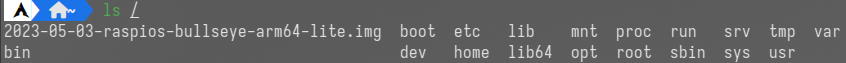

 # 文件系统初始化过程

## 根文件系统

### rootfs

- rootfs（也叫根文件系统） 它本质上就是一个 Linux 系统中基本的文件目录组织结构，也就是 Linux 系统中 / 根目录下的结构。并将rootfs 中的 / 

- 例如，/boot 目录下存放的是启动内核相关的文件，/etc 目录中存放的则是一些系统配置文件，/dev 目录下存放的则是系统的设备文件，/bin 目录下存放的则是一些可执行的二进制文件等等

- 这里 rootfs 指的是`initrd`,`initramfs`的文件目录结构，与最终系统使用的根分区高度相似

- 根目录结构
  

### ramfs

ramfs 是 rootfs 的实例化

- Ramfs 是一个`空间大小动态可变`的基于 RAM 的文件系统，它是Linux 用来实现磁盘缓存（page cache and dentry cache）的文件系统。
- ramfs 是一个仅存在与内存中文件系统，它没有后备存储（例如磁盘），也就是说 ramfs 文件系统所管理的文件都是存放在内存中，而不存放在磁盘中。
- **initramfs是init ramfs的缩写**

### initrd 与 initramfs

1. initrd的概念

   initrd 是一在 ramdisk（由内存虚拟出的磁盘）临时文件系统，由 bootload 负责加载到内存中，里面包含了基本的可执行程序和驱动程序。在 linux 初始化的初级阶段，它提供了一个基本的运行环境。当成功加载磁盘文件系统后，系统将切换到磁盘文件系统并卸载 initrd。

2. initramfs的概念

   - initramfs 是一种以 cpio 格式压缩后的 rootfs 文件系统，在编译内核时，该文件会作为内核的一个段被编译进内核中。并在内核初始化时被解析。

   - cpio格式的文件结构：

     

   ```asm
   /*链接脚本中定义initramfs文件起止地址*/
   .init.ramfs : {
   		__initramfs_start = .;
   		*(.init.ramfs)
   		__initramfs_end = .;
   	}
   ```

3. 二者的区别与联系

   - initrd 是由 bootloader 单独加载，而 initramfs 则是与内核编译到一起之后被加载
   - 基于ramfs开发initramfs，取代了initrd

## 构建根文件系统


图中由两条调用链组成。其中rest_init这一条的作用是解析initrd文件，而mnt_init这一条则是设置一个 / 目录为文件系统提供根挂载点。

### 初始化根文件系统

初始化根目录的主要目的是为 VFS 创建一个供文件系统挂载的根目录。

为了保证所有设备都被 sysfs 所记录，因此为了保证信息记录完全，因此 sysfs 要先于 rootfs 被注册。

在 init_roots 中会注册 rootfs 与 其操作函数。

对于 Linux 来说，每个进程都有自己的当前工作目录与根目录。因此在 `init` 中初始化后的根目录会被记录在 `task_struct` 中。此后   fork 而来的进程如果不对其进行任何操作将与 `init` 保持一致。

```c

static void __init init_mount_tree(void)
{
	struct vfsmount *mnt;/*挂载点信息*/
	struct mnt_namespace *ns;/**/
	struct path root;/**/

	// 挂载根文件系统
	mnt = do_kern_mount("rootfs", 0, "rootfs", NULL);
	if (IS_ERR(mnt))
		panic("Can't create rootfs");
	// 创建一个新的挂载命名空间，即分配并初始化结构体mnt_namespace
	ns = create_mnt_ns(mnt);
	if (IS_ERR(ns))
		panic("Can't allocate initial namespace");

	init_task.nsproxy->mnt_ns = ns;
	get_mnt_ns(ns);//增加 mnt_namespace 的引用计数
	// 设置根路径
	root.mnt = ns->root;
	root.dentry = ns->root->mnt_root;
	// 设置当前进程的工作目录和根目录
	set_fs_pwd(current->fs, &root);
	set_fs_root(current->fs, &root);
}

```

初始化之后文件系统的布局：


### 解析initramfs文件

在链接脚本中定义了 initramfs 在内存中的起始地址

```c
extern char __initramfs_start[], __initramfs_end[];
```

Linux内核中由 populate_rootfs() 解析 initrd 文件，其被注册在 initcall 段中。由do_initcalls()函数隐式调用

```c
extern initcall_t __initcall_start[], __initcall_end[], __early_initcall_end[];
static void __init do_initcalls(void)
{
	initcall_t *fn;

	for (fn = __early_initcall_end; fn < __initcall_end; fn++)
		do_one_initcall(*fn);

	/* Make sure there is no pending stuff from the initcall sequence */
	flush_scheduled_work();
}

```

在函数populate_rootfs() 中调用解压函数unpack_to_rootfs()。

```c
/*函数unpack_to_rootfs()中执行解压功能的代码*/ 
while (!message && len) {//如果在范围内且没有报错
        loff_t saved_offset = this_header;

		/*解压cpio格式*/
        // 如果数据以'0'开头且this_header为4的倍数，重置状态为Start
        if (*buf == '0' && !(this_header & 3)) {
            state = Start;
            written = write_buffer(buf, len);  // 写入缓冲区中的数据
            buf += written;
            len -= written;
            continue;
        }

        // 如果数据为0，跳过并更新缓冲区和长度
        if (!*buf) {
            buf++;
            len--;
            this_header++;
            continue;
        }

		/*其他格式*/
        // 重置this_header，根据数据调用相应的解压缩方法
        this_header = 0;
        decompress = decompress_method(buf, len, &compress_name);//寻找格式对应的解压函数
        if (decompress) {
            res = decompress(buf, len, NULL, flush_buffer, NULL,
                            &my_inptr, error);  // 调用解压缩函数解压数据
            if (res)
                error("decompressor failed");  // 解压失败，触发错误处理
        } else if (compress_name) {
            if (!message) {
                snprintf(msg_buf, sizeof msg_buf,
                         "compression method %s not configured",
                         compress_name);
                message = msg_buf;  // 记录未配置的压缩方法错误消息
            }
        } else
            error("junk in compressed archive");  // 压缩归档中有无效数据，触发错误处理

        if (state != Reset)
            error("junk in compressed archive");  // 压缩归档中有无效数据，触发错误处理

        this_header = saved_offset + my_inptr;  // 更新this_header偏移量
        buf += my_inptr;  // 更新缓冲区指针
        len -= my_inptr;  // 更新剩余长度
    }
```

以下为内核中注册的解析压缩文件的函数：

```c
/**
 * compressed_formats - 预定义的压缩格式数组
 *
 * 这个数组包含了多种压缩格式的定义，每一项包括压缩格式的魔数、名称和解压缩函数指针。
 * 当解压缩函数需要根据输入数据的前缀判断压缩格式时，会使用这个数组进行匹配。
 */
static const struct compress_format {
	unsigned char magic[2];     // 压缩格式的魔数（前两个字节）
	const char *name;           // 压缩格式的名称
	decompress_fn decompressor; // 解压缩函数指针
} compressed_formats[] = {
	{ {037, 0213}, "gzip", gunzip },   // gzip 格式，对应的解压缩函数为 gunzip
	{ {037, 0236}, "gzip", gunzip },   // gzip 格式，对应的解压缩函数为 gunzip
	{ {0x42, 0x5a}, "bzip2", bunzip2 },// bzip2 格式，对应的解压缩函数为 bunzip2
	{ {0x5d, 0x00}, "lzma", unlzma },  // lzma 格式，对应的解压缩函数为 unlzma
	{ {0x89, 0x4c}, "lzo", unlzo },    // lzo 格式，对应的解压缩函数为 unlzo
	{ {0, 0}, NULL, NULL }             // 数组结束标志，magic 为 {0, 0} 表示结尾
};
```

在这里我们只讨论如何解析 cpio 格式文件。内核使用状态机来解析cpio格式的文件。

状态转移图


```c
/*执行解压cpio文件的状态机*/
static int __init write_buffer(char *buf, unsigned len)
{
	count = len;
	victim = buf;

	while (!actions[state]())
		;
	return len - count;
}
```

在状态机中注册的状态函数。

```c
static __initdata int (*actions[])(void) = {
	[Start]		= do_start,
	[Collect]	= do_collect,
	[GotHeader]	= do_header,
	[SkipIt]	= do_skip,
	[GotName]	= do_name,
	[CopyFile]	= do_copy,
	[GotSymlink]	= do_symlink,
	[Reset]		= do_reset,
};
```

## 从磁盘中加载文件系统

在磁盘中存在的文件系统由 1 号进程 kernel_init 加载。


在函数 mount_block_root 中将遍历注册的所有文件系统，调用 sys_mount 直到挂载成功

```c
    for (p = fs_names; *p; p += strlen(p)+1) {
        int err = do_mount_root(name, p, flags, root_mount_data); // 尝试挂载根文件系统
        switch (err) {
            case 0:
                goto out; // 挂载成功，退出
            case -EACCES:
                flags |= MS_RDONLY; // 如果权限不足，则以只读模式重新尝试
                goto retry;
            case -EINVAL:
                continue; // 无效参数，尝试下一个文件系统
        }
        /*
         * 允许用户区分根设备上的 sys_open 失败和超级块错误
         * 并向他们提供可用设备的列表
         */
#ifdef CONFIG_BLOCK
        __bdevname(ROOT_DEV, b); // 获取块设备名称
#endif
        printk("VFS: Cannot open root device \"%s\" or %s\n",
               root_device_name, b);
        printk("Please append a correct \"root=\" boot option; here are the available partitions:\n");

        printk_all_partitions(); // 打印所有分区信息
#ifdef CONFIG_DEBUG_BLOCK_EXT_DEVT
        printk("DEBUG_BLOCK_EXT_DEVT is enabled, you need to specify "
               "explicit textual name for \"root=\" boot option.\n");
#endif
        panic("VFS: Unable to mount root fs on %s", b); // 挂载失败，触发内核恐慌
    }
```

```c
SYSCALL_DEFINE5(mount, char __user *, dev_name, char __user *, dir_name,
                char __user *, type, unsigned long, flags, void __user *, data)
```

最终调用 vfs_kern_mount 函数挂载磁盘文件系统：

```c
struct vfsmount *vfs_kern_mount(struct file_system_type *type, int flags, const char *name, void *data)
{
	struct vfsmount *mnt; // 用于存储挂载信息的结构体指针
	char *secdata = NULL; // 用于存储安全数据的指针
	int error; // 存储错误代码的变量

	if (!type)
		return ERR_PTR(-ENODEV); // 如果文件系统类型为空，返回错误指针，表示没有此设备

	error = -ENOMEM;
	mnt = alloc_vfsmnt(name); // 分配一个 vfsmount 结构体
	if (!mnt)
		goto out; // 如果分配失败，跳转到 out 标签

	if (flags & MS_KERNMOUNT)
		mnt->mnt_flags = MNT_INTERNAL; // 如果挂载标志包含 MS_KERNMOUNT，设置 mnt_flags 为 MNT_INTERNAL

	if (data && !(type->fs_flags & FS_BINARY_MOUNTDATA)) {
		secdata = alloc_secdata(); // 分配安全数据
		if (!secdata)
			goto out_mnt; // 如果分配失败，跳转到 out_mnt 标签

		error = security_sb_copy_data(data, secdata); // 复制安全数据
		if (error)
			goto out_free_secdata; // 如果复制失败，跳转到 out_free_secdata 标签
	}

	error = type->get_sb(type, flags, name, data, mnt); // 调用文件系统类型的 get_sb 函数获取超级块
	if (error < 0)
		goto out_free_secdata; // 如果获取失败，跳转到 out_free_secdata 标签
	BUG_ON(!mnt->mnt_sb); // 检查 mnt_sb 是否为空，如果为空，触发 BUG
	WARN_ON(!mnt->mnt_sb->s_bdi); // 检查 mnt_sb->s_bdi 是否为空，如果为空，发出警告

	error = security_sb_kern_mount(mnt->mnt_sb, flags, secdata); // 调用安全子系统进行挂载安全检查
	if (error)
		goto out_sb; // 如果检查失败，跳转到 out_sb 标签

	/*
	 * 文件系统不应将 s_maxbytes 设置为超过 MAX_LFS_FILESIZE 的值
	 * 但 s_maxbytes 在许多版本中是一个无符号长整型。为了捕捉
	 * 违反此规则的文件系统，这里添加了一个警告。在 2.6.34 版本
	 * 中应移除或转换为 BUG()。
	 */
	WARN((mnt->mnt_sb->s_maxbytes < 0), "%s set sb->s_maxbytes to "
		"negative value (%lld)\n", type->name, mnt->mnt_sb->s_maxbytes);

	mnt->mnt_mountpoint = mnt->mnt_root; // 设置挂载点
	mnt->mnt_parent = mnt; // 设置父挂载点为自身
	up_write(&mnt->mnt_sb->s_umount); // 释放超级块的卸载锁
	free_secdata(secdata); // 释放安全数据
	return mnt; // 返回挂载信息结构体指针

out_sb:
	dput(mnt->mnt_root); // 释放目录项
	deactivate_locked_super(mnt->mnt_sb); // 停用并解锁超级块
out_free_secdata:
	free_secdata(secdata); // 释放安全数据
out_mnt:
	free_vfsmnt(mnt); // 释放挂载信息结构体
out:
	return ERR_PTR(error); // 返回错误指针
}
```

最终完成后的文件系统格局：


## 文件系统的注册

在 Linux 中使用内核模块来注册文件系统

```c
/*内核模块的注册与销毁*/
module_init()
module_exit()
```

而文件系统正真的初始化函数会作为回调函数在上述两个函数内被调用。一般文件系统初始化的函数都会包含函数`register_filesystem` 该函数用于文件系统的注册。

```c
static int __init init_ext2_fs(void)
{
	int err = init_ext2_xattr();
	if (err)
		return err;
	err = init_inodecache();
	if (err)
		goto out1;
        err = register_filesystem(&ext2_fs_type);
	if (err)
		goto out;
	return 0;
out:
	destroy_inodecache();
out1:
	exit_ext2_xattr();
	return err;
}
```

该函数会调用 `find_filesystem`在全局文件结构链表`file_systems`中寻找空闲的文件系统结构体。

```
int register_filesystem(struct file_system_type * fs)
{
	int res = 0;
	struct file_system_type ** p;

	BUG_ON(strchr(fs->name, '.'));
	if (fs->next)
		return -EBUSY;
	INIT_LIST_HEAD(&fs->fs_supers);
	write_lock(&file_systems_lock);//加锁
	p = find_filesystem(fs->name, strlen(fs->name));//寻找一个空闲的文件系统结构体
	if (*p)
		res = -EBUSY;
	else
		*p = fs;
	write_unlock(&file_systems_lock);//解锁，多核
	return res;
}
