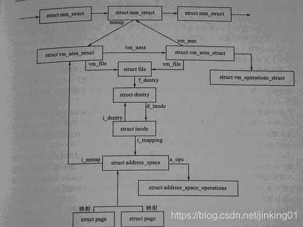
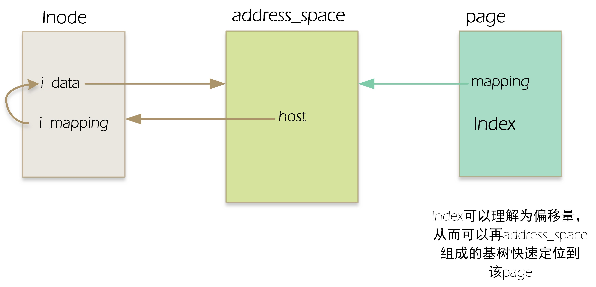

# 文件系统的缓存结构

## 为什么需要缓存策略

1. 磁盘相对cpu来说是一个低速设备
2. 对于磁盘数据的写入并不是立即写入的，还需要等待io调度的流程。

## 概念

磁盘的操作有逻辑级（文件系统）和物理级（磁盘块），这两种Cache就是分别缓存逻辑和物理级数据的。

* page cache :页缓存,负责缓存逻辑数据。

* buffer cache : 块缓存,负责缓存物理数据。

page cache是VFS的一部分，buffer cache是块设备驱动的一部分。page cache是面向用户IO的cache，buffer cache是面向块设备IO的cache。

## 数据结构

### page cache



与 page cache 相关的核心数据结构即为 address_space。在很多时候，内核在读写磁盘时都引用页高速缓存，新页被追加到页高速缓存以满足用户态进程的读请求。如果页不在高速缓存中，新页就被追加到高速缓存。这样作的目的就是为了更快的效率，比如有一些页，经常被访问，那么此时，如果内存空间允许的话，可以考虑让它们长期驻留在页高速缓存中，这样要比从磁盘访问它们效率更高。而address_space结构体就是嵌入在页所有者的索引节点对象中的数据结构。而页描述符与它的联系是通过其中的字段mapping和index来完成的。前者指向拥有页的索引节点的address_space对象，index字段表示在所有者的地址空间中以页大小为单位的偏移量，即在所有者的磁盘映像中页中数据的位置。在页高速缓存中查找页时使用这两个字段。



```c
struct address_space {
	/* 所属的 inode 或块设备 */
	// 通常address_space会和索引节点(inode)关联，此时host指向此inode
	// 如果address_space不是和索引节点关联，比如和swapper关联，则host域是NULL。
	struct inode		*host;		/* owner: inode, block_device */
	/* 包含全部页面的 radix 树 */
	struct radix_tree_root	page_tree;	/* radix tree of all pages */
	/* 保护基数树的自旋锁 */
	spinlock_t		tree_lock;	/* and lock protecting it */
	/* 可写的 VM_SHARED 映射的计数 */	
	unsigned int		i_mmap_writable;/* count VM_SHARED mappings */
	/* 私有和共享映射的优先级树 */
	// imap是一个优先搜索树，它的搜索范围包含了在address_space范围内所有共享的和私有的映射页面。
	// 优先搜索树是将堆和radix结合形成的快速检索树。可以帮助内核高效找到关联的被缓存文件
	// i_mmap - 根据 vm_area_struct，能够快速的找到关联的缓存文件(即 address_space)，
	struct prio_tree_root	i_mmap;		/* tree of private and shared mappings */
	/* VM_NONLINEAR 映射列表 */
	struct list_head	i_mmap_nonlinear;/*list VM_NONLINEAR mappings */
	/* 保护映射树、计数和列表的自旋锁 */	/* 保护 i_map 的自旋锁 */
	spinlock_t		i_mmap_lock;	/* protect tree, count, list */
	/* 用于处理与截断操作相关的竞态条件 */
	// 截断计数
	unsigned int		truncate_count;	/* Cover race condition with truncate */
	/* 总页数 */
	// address_space页面总数
	unsigned long		nrpages;	/* number of total pages */
	/* 从这里开始回写 */
	// 回写的起始偏移
	pgoff_t			writeback_index;/* writeback starts here */
	/* 方法操作集 */
	const struct address_space_operations *a_ops;	/* methods */
	/* 错误位/内存分配标志 */
	// gfp_mask掩码（内存分配时使用）与错误标识
	unsigned long		flags;		/* error bits/gfp mask */
	/* 后备设备信息，如预读取等 */
	// 预读信息
	struct backing_dev_info *backing_dev_info; /* device readahead, etc */
	// 私有address_space锁
	spinlock_t		private_lock;	/* for use by the address_space */
	// 私有address_space链表
	struct list_head	private_list;	/* ditto */
	// 相关的缓冲
	struct address_space	*assoc_mapping;	/* ditto */
} __attribute__((aligned(sizeof(long))));	/* 确保结构体按长整型大小对齐 */
```


在现代操作系统中，很多文件系统都支持 TB 甚至 PB 级的数据。如果采用为了加速对于页面的查找，在2.6中引入了基数树的结构，将一个页的页索引

`address_space_operations` 结构被记录在address_space中，该结构中的函数在文件系统中被注册。

```c
struct address_space_operations {
	// 写入页面到磁盘
	int (*writepage)(struct page *page, struct writeback_control *wbc);
	// 从磁盘读取页面到内存
	int (*readpage)(struct file *, struct page *);
	// 同步页面（确保页面完全写入磁盘）
	void (*sync_page)(struct page *);

	/* Write back some dirty pages from this mapping. */
	/* 从这个映射写回一些脏页面 */
	int (*writepages)(struct address_space *, struct writeback_control *);

	/* Set a page dirty.  Return true if this dirtied it */
	/* 设置页面为脏。如果此操作让页面变脏则返回true */
	int (*set_page_dirty)(struct page *page);

	// 批量读取多个页面
	int (*readpages)(struct file *filp, struct address_space *mapping,
			struct list_head *pages, unsigned nr_pages);

	// 开始写操作前的处理
	int (*write_begin)(struct file *, struct address_space *mapping,
				loff_t pos, unsigned len, unsigned flags,
				struct page **pagep, void **fsdata);
	// 完成写操作之后的处理
	int (*write_end)(struct file *, struct address_space *mapping,
				loff_t pos, unsigned len, unsigned copied,
				struct page *page, void *fsdata);

	/* Unfortunately this kludge is needed for FIBMAP. Don't use it */
	/* 不幸地，这个替代品是FIBMAP所需要的。请勿使用它 */
	sector_t (*bmap)(struct address_space *, sector_t);
	// 使页面无效
	void (*invalidatepage) (struct page *, unsigned long);
	// 释放一个页面
	int (*releasepage) (struct page *, gfp_t);
	// 执行直接I/O操作
	ssize_t (*direct_IO)(int, struct kiocb *, const struct iovec *iov,
			loff_t offset, unsigned long nr_segs);
	// 获取执行内存的地址
	int (*get_xip_mem)(struct address_space *, pgoff_t, int,
						void **, unsigned long *);
	/* migrate the contents of a page to the specified target */
	/* 迁移一个页面的内容到指定的目标 */
	int (*migratepage) (struct address_space *,
			struct page *, struct page *);
	// 清洗页面，通常用于清除页面的缓存状态
	int (*launder_page) (struct page *);
	// 检查页面的部分区域是否是最新的
	int (*is_partially_uptodate) (struct page *, read_descriptor_t *,
					unsigned long);
	// 错误移除页面处理
	int (*error_remove_page)(struct address_space *, struct page *);
};
```

#### buffer cache

在 buffer cache 中用到有三种结构体。

其中 buffer_head 用于对磁盘块的管理。一个 buffer_head 可能对应了多个物理扇区。

其中成员 `b_data` 指向用于存放缓冲数据的内存。

```c
struct buffer_head {
	// 缓冲区的状态标志，在bh_state_bits的enum中
	unsigned long b_state;		/* buffer state bitmap (see above) */
	// 页面中的缓冲区
	// b_this_page 字段链接了同一物理页的所有缓冲区头，形成一个循环链表。
	// 因为一个页4K，如果一个块1K，那么一页就可以有4个缓冲区，b_this_page将这4个缓冲区连在一起
	struct buffer_head *b_this_page;/* circular list of page's buffers */
	// 存储缓冲区的页面（与缓冲区对应的内存物理页）
	struct page *b_page;		/* the page this bh is mapped to */

	// 起始块号，是b_bdev域所对应的设备的逻辑块号
	sector_t b_blocknr;		/* start block number */
	// 映像的大小
	size_t b_size;			/* size of mapping */
	// 页面内的数据指针，直接指向相应的块（它位于b_page域所指明的页面中的某个位置上）
	// 块大小是b_size，所以块在内存中的起始位置是b_data，结束位置是b_data+b_size
	/*
	 * buffer_head中的b_data指向对应的缓冲区地址。注意：如果page是high mem,b_data
	 * 存放的缓冲区业内的偏移量，比如第一个缓冲区b_data = 0，第二个是1K，第三个是2K。
	 * 如果page在非high mem，b_data指向对应缓冲区的虚拟地址。
	 */
	char *b_data;			/* pointer to data within the page */
	
	// 相关联的块设备
	struct block_device *b_bdev;
	// I/O完成方法
	bh_end_io_t *b_end_io;		/* I/O completion */
	// 为 b_end_io 保留的私有数据
 	void *b_private;		/* reserved for b_end_io */
	// 相关的映射链表
	struct list_head b_assoc_buffers; /* associated with another mapping */
	// 相关的地址空间
	struct address_space *b_assoc_map;	/* mapping this buffer is
						   associated with */
	// 缓冲区使用计数，通过get_bh和put_bh增加或减少引用计数。
	atomic_t b_count;		/* users using this buffer_head */
};
```

`bio` 中则记录对于io请求的信息。

```c
struct bio {  
   sector_t bi_sector; /*我们想在块设备的第几个扇区上进行io操作（起始扇区），此处扇区大小是按512计算的*/
   struct bio *bi_next;
   struct block_device *bi_bdev; /*指向块设备描述符的指针，该io操作是针对哪个块设备的*/
   unsigned long bi_rw; /*该io操作是读还是写*/
   unsigned short bi_vcnt; /* bio的bio_vec数组中段的数目 */
   unsigned short bi_idx; /* bio的bio_vec数组中段的当前索引值 */
   unsigned short bi_phys_segments; //合并之后bio中（内存）物理段的数目
   unsigned int bi_size; /* 需要传送的字节数 */
   bio_end_io_t *bi_end_io; /* bio的I/O操作结束时调用的方法 */
   void *bi_private; //通用块层和块设备驱动程序的I/O完成方法使用的指针
   unsigned int bi_max_vecs; /* bio的bio vec数组中允许的最大段数 */
   atomic_t bi_cnt; /* bio的引用计数器 */
   struct bio_vec *bi_io_vec; /*指向bio的bio_vec数组中的段的指针 */
   struct bio_set *bi_pool;
   struct bio_vec bi_inline_vecs[0];/*一般一个bio就一个段，bi_inline_vecs就可满足，省去了再为bi_io_vec分配空间*/
}
```

一个bio可能有很多个bio段，这些bio段在内存是可能不连续，位于不同的页，但在磁盘上对应的位置是连续的。一般上层构建bio的时候都是只有一个bio段。(新的DMA支持多个不连续内存的数据传输)

```c
struct bio_vec {
   struct page *bv_page; //指向段的页框对应页描述符的指针 
   unsigned int bv_len; //段的字节长度，长度可以超过一个页
   unsigned int bv_offset; //页框中段数据的偏移量
};
```


bio 与 buffer_head 间的关系在函数 `submit_bh` 中被联系到一起。

```c
// submit_bh初始化和提交bio结构以进行I/O操作。它处理缓冲头状态，确定是否添加写屏障，并在完成后释放bio。
int submit_bh(int rw, struct buffer_head * bh)
{
	struct bio *bio;
	int ret = 0;

	// 检查缓冲头的一致性
	BUG_ON(!buffer_locked(bh));
	BUG_ON(!buffer_mapped(bh));
	BUG_ON(!bh->b_end_io);
	BUG_ON(buffer_delay(bh));
	BUG_ON(buffer_unwritten(bh));

	/*
	 * Mask in barrier bit for a write (could be either a WRITE or a
	 * WRITE_SYNC
	 */
	// 对写入操作添加写屏障
	if (buffer_ordered(bh) && (rw & WRITE))
		rw |= WRITE_BARRIER;

	/*
	 * Only clear out a write error when rewriting
	 */
	// 清除写错误标记以重新写入
	if (test_set_buffer_req(bh) && (rw & WRITE))
		clear_buffer_write_io_error(bh);

	/*
	 * from here on down, it's all bio -- do the initial mapping,
	 * submit_bio -> generic_make_request may further map this bio around
	 */
	// 分配bio结构，设置其字段，为数据传输做准备
	bio = bio_alloc(GFP_NOIO, 1);

	// 设置扇区号和设备
	bio->bi_sector = bh->b_blocknr * (bh->b_size >> 9);
	bio->bi_bdev = bh->b_bdev;
	bio->bi_io_vec[0].bv_page = bh->b_page;
	bio->bi_io_vec[0].bv_len = bh->b_size;
	bio->bi_io_vec[0].bv_offset = bh_offset(bh);

	bio->bi_vcnt = 1;
	bio->bi_idx = 0;
	bio->bi_size = bh->b_size;

	bio->bi_end_io = end_bio_bh_io_sync;
	bio->bi_private = bh;

	// 提交bio进行I/O操作
	bio_get(bio);
	submit_bio(rw, bio);

	// 检查是否支持该操作
	if (bio_flagged(bio, BIO_EOPNOTSUPP))
		ret = -EOPNOTSUPP;

	// 释放bio结构
	bio_put(bio);
	return ret;
}
EXPORT_SYMBOL(submit_bh);
```

### page cache 与 buffer cache 的联系