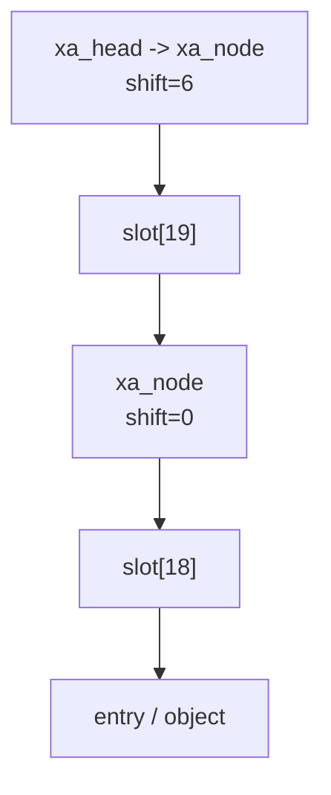
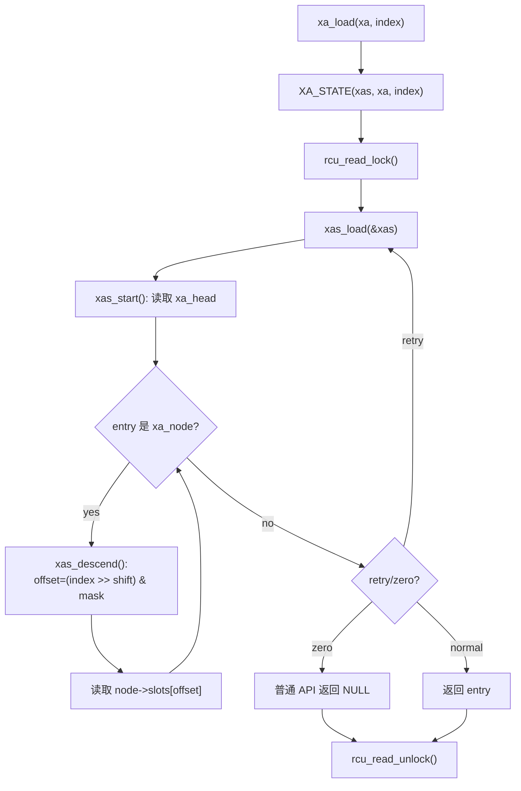
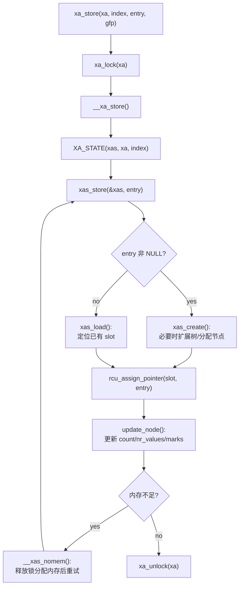
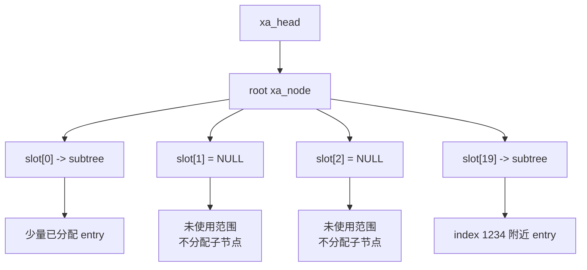
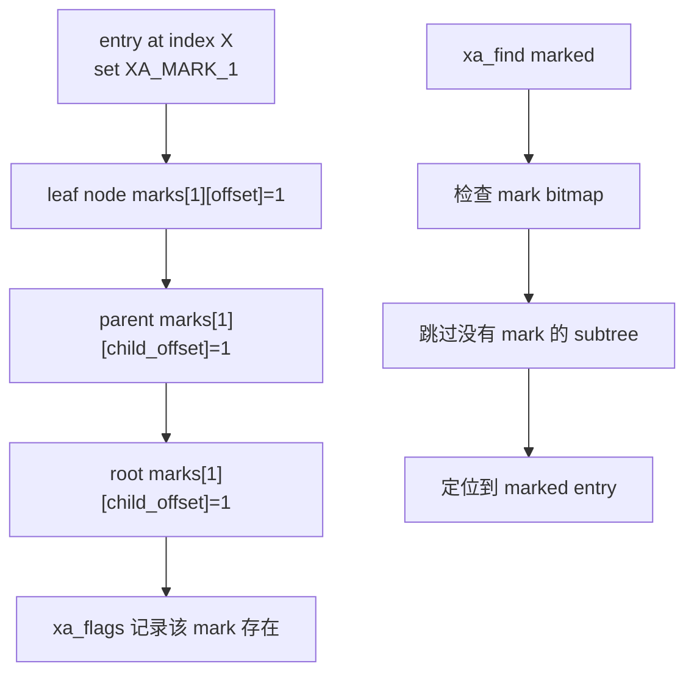
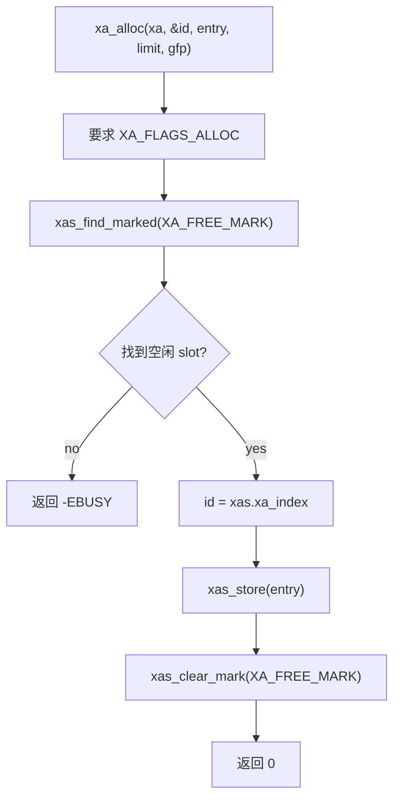
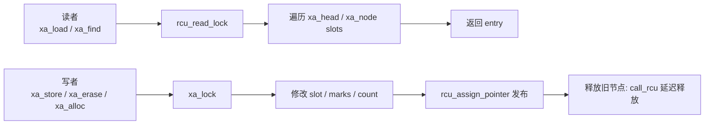
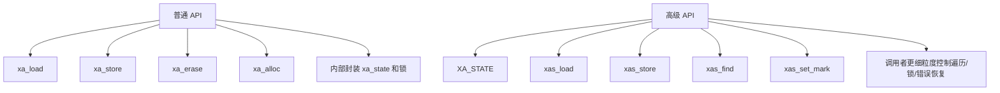

# Linux 内核 XArray 技术文档

本文结合 Linux 6.6 源码，对 XArray 的结构、查找流程、更新流程、并发语义和常用 API 做一份偏实现视角的说明。核心源码位置：

- `include/linux/xarray.h`：公开 API、核心结构、entry 编码、`xa_state`。
- `lib/xarray.c`：查找、插入、删除、marks、ID 分配等实现。
- `Documentation/core-api/xarray.rst`：官方使用文档。

## 1. 概述

XArray 是 Linux 内核中用于管理“无符号长整型索引 -> 对象”的映射结构。它可以理解为 radix tree 的现代化继任者，但它对 API、并发、迭代、marks、ID 分配和多索引 entry 做了更系统的设计。

官方文档将 XArray 描述为一个行为类似“巨大指针数组”的抽象数据类型。它不像普通数组那样需要连续分配内存，也不像哈希表那样难以按索引顺序查找下一个或上一个 entry。它特别适合管理稀疏但局部密集的索引空间，最重要的使用者之一是页缓存，见 `Documentation/core-api/xarray.rst:12` 和 `Documentation/core-api/xarray.rst:26`。

XArray 适合：

- 页缓存：`address_space->i_pages`。
- ID 分配：使用 `XA_FLAGS_ALLOC` 的 XArray。
- 文件、设备、上下文、IRQ descriptor 等“整数 ID 到对象”的映射。
- 需要按索引范围查找、迭代或标记对象的场景。

不适合：

- 索引完全随机且没有局部性的数据集。官方文档明确提到，用对象哈希值作为 XArray index 效果不好，见 `Documentation/core-api/xarray.rst:21`。
- index 大于 `ULONG_MAX` 的场景。

## 2. 与 radix tree 的关系


XArray 保留了 radix tree 的核心思想：把 index 按固定宽度切成多段，每一层根据其中一段位选择 slot。Linux 6.6 中默认每层使用 6 位 index，因此每个节点有 64 个 slot：

```c
#define XA_CHUNK_SHIFT		(CONFIG_BASE_SMALL ? 4 : 6)
#define XA_CHUNK_SIZE		(1UL << XA_CHUNK_SHIFT)
#define XA_CHUNK_MASK		(XA_CHUNK_SIZE - 1)
```

位置：`include/linux/xarray.h:1143`。

但 XArray 不是简单换名的 radix tree。它提供了：

- 更明确的普通 API 与高级 `xas_*` API。
- RCU 读侧并发支持。
- 内部 spinlock 写侧保护。
- marks 机制，用于快速查找带标记 entry。
- allocating XArray，用 mark 追踪空闲 ID。
- multi-index entry，一个 entry 可以覆盖一段连续 index。
- 特殊 entry 编码，例如 value entry、internal entry、retry entry、zero entry、sibling entry。

## 3. 核心结构

### 3.1 `struct xarray`

XArray 的锚点是 `struct xarray`：

```c
struct xarray {
	spinlock_t	xa_lock;
	gfp_t		xa_flags;
	void __rcu *	xa_head;
};
```

位置：`include/linux/xarray.h:296`。

三个字段含义：

- `xa_lock`：保护 XArray 内容的内部 spinlock。普通写 API 会自动持有它。
- `xa_flags`：记录 lock 类型、alloc 模式、mark 汇总等 flags。
- `xa_head`：顶层入口。它可以是 `NULL`、直接存储的 entry，或者指向 `xa_node` 的内部 entry。

一个容易误解的点是：XArray 顶层不一定马上有“根节点对象”。源码注释说明：

- 如果所有 entry 都是 `NULL`，`xa_head` 是 `NULL`。
- 如果唯一非空 entry 在 index 0，`xa_head` 直接保存该 entry。
- 如果存在其他非空 index，`xa_head` 才指向 `xa_node`。

位置：`include/linux/xarray.h:290`。

也就是说，XArray 对小规模数据有根部直接存储优化。

### 3.2 `struct xa_node`

真正的树节点是 `struct xa_node`：

```c
struct xa_node {
	unsigned char	shift;
	unsigned char	offset;
	unsigned char	count;
	unsigned char	nr_values;
	struct xa_node __rcu *parent;
	struct xarray	*array;
	union {
		struct list_head private_list;
		struct rcu_head	rcu_head;
	};
	void __rcu	*slots[XA_CHUNK_SIZE];
	union {
		unsigned long	tags[XA_MAX_MARKS][XA_MARK_LONGS];
		unsigned long	marks[XA_MAX_MARKS][XA_MARK_LONGS];
	};
};
```

位置：`include/linux/xarray.h:1158`。

关键字段：

- `shift`：该节点的 slot 覆盖 index 的哪一段位。计算 slot offset 时使用 `(index >> shift) & XA_CHUNK_MASK`。
- `offset`：该节点在父节点中的 slot 下标。
- `count`：`slots[]` 中非空元素数量，包括指针、value、retry、sibling、子节点等。
- `nr_values`：value entry 或 value sibling 的数量。
- `parent`：父节点，RCU 保护。
- `slots[XA_CHUNK_SIZE]`：固定大小 slot 数组，默认 64 个。
- `marks`：每个 mark 一张 bitmap，用于按标记快速查找。

slot 中可以存：

- 用户对象指针。
- value entry。
- 指向下一级 `xa_node` 的 internal entry。
- sibling entry，用于 multi-index entry。
- retry entry、zero entry 等内部 entry。

### 3.3 entry 编码

XArray 通过指针低两位区分 entry 类型。

这里说的“指针低两位”，指的是 **XArray slot 里保存的那个 `void *entry` 值的低两位**。

也就是：

```c
struct xa_node {
    void __rcu *slots[XA_CHUNK_SIZE];
};
```

里面每个：

```c
slots[i]
```

保存的都是一个 `void *entry`。XArray 会检查这个 `entry` 数值本身的最低 2 个 bit。

不是 `slots[i]` 这个数组元素地址的低两位，也不是 `struct xa_node *node` 变量地址的低两位，而是：

```text
slots[i] 里面存放的那个值的低两位
```

例如：

```text
slots[0] = 0xffff888012340000
                         ^^
                         低两位是 00
```

XArray 判断：

```text
低两位 00: 普通指针 entry
低两位 10: internal entry
低一位 x1: value entry 或 tagged pointer
```

内核里绝大多数要存进 XArray 的对象指针都是对齐的，低几位天然为 0，不携带有效地址信息。所以这里最低的两位用来做标记信息

**1. 普通指针 entry：低两位 00**

这是最普通的对象指针，例如：

```c
struct page *
struct kvm_vcpu *
struct irq_desc *
```


**2. value entry：低位为 1**

value entry 是把一个整数塞进 `void *entry` 里：

```c
xa_mk_value(v) = (void *)((v << 1) | 1)
```

所以它不是普通指针，也不能解引用。

例如：

```text
整数 5
-> (5 << 1) | 1
-> 0b1011
```

取回时：

```c
xa_to_value(entry) = (unsigned long)entry >> 1
```

所以 value entry 存的是“编码后的整数”。

**3. tagged pointer：也是低位带 tag 的指针**

tagged pointer 是另一种用法。它确实基于原始指针地址加 tag：

```c
xa_tag_pointer(p, tag) = (void *)((unsigned long)p | tag)
```

但这里要注意：tagged pointer 和 value entry 共用了低位标记空间，所以一个 XArray 使用者要自己决定是存 value entry，还是存 tagged pointer，不能混着不加区分地用。

tagged pointer 取回原始指针时要：

```c
xa_untag_pointer(entry)
```

**4. internal entry：低两位 10**

internal entry 是 XArray 内部使用的特殊 entry。它包括但不限于：

```text
xa_node 指针
sibling entry
retry entry
zero entry
error entry
```

其中 `xa_node` 确实通常表示树的内部节点，也就是继续往下一层走：

```c
xa_mk_node(node) = (void *)((unsigned long)node | 2)
```

除此之外：

```c
XA_RETRY_ENTRY = xa_mk_internal(256)
XA_ZERO_ENTRY  = xa_mk_internal(257)
```

这些也是 internal entry。

位置：`include/linux/xarray.h:23`。

几个重要 helper：

- `xa_mk_value()`：把整数编码为 value entry，见 `include/linux/xarray.h:54`。
- `xa_to_value()`：从 value entry 取回整数，见 `include/linux/xarray.h:67`。
- `xa_is_value()`：判断 value entry，见 `include/linux/xarray.h:79`。
- `xa_mk_internal()`：构造 internal entry，见 `include/linux/xarray.h:145`。
- `xa_is_internal()`：判断 internal entry，见 `include/linux/xarray.h:169`。
- `xa_mk_node()`：把 `xa_node *` 编码为 internal entry，见 `include/linux/xarray.h:1246`。
- `xa_to_node()`：从 internal entry 解回 `xa_node *`，见 `include/linux/xarray.h:1252`。

特殊 internal entry：

- `0-62`：sibling entries。
- `256`：retry entry。
- `257`：zero/reserved entry。

位置：`include/linux/xarray.h:132`。

这也是为什么普通指针必须至少 4 字节对齐。官方文档在 `Documentation/core-api/xarray.rst:28` 说明，普通指针可以直接存入 XArray，但需要 4-byte aligned。

## 4. 索引到 slot 的映射

XArray 每层默认消耗 6 位 index。给定节点 `node`，slot offset 的计算是：

```c
static unsigned int get_offset(unsigned long index, struct xa_node *node)
{
	return (index >> node->shift) & XA_CHUNK_MASK;
}
```

位置：`lib/xarray.c:143`。

因此查找过程就是：

1. 从 `xa_head` 开始。
2. 如果当前 entry 是 `xa_node`，根据 `node->shift` 取 index 的对应 6 位作为 slot offset。
3. 进入 `node->slots[offset]`。
4. 重复直到遇到非节点 entry 或到达叶层。

示例：假设每层 6 位，查找 index `1234`。

```text
1234 十进制 = 0b 010011 010010
高 6 位: 19
低 6 位: 18
```

如果树高两层：



如果树更高，例如根节点 `shift=12`，则会按 `index >> 12`、`index >> 6`、`index >> 0` 分别选 slot。

需要注意：具体层数由当前最大 index 和树扩展情况决定，不是固定三层。

## 5. 查找流程

普通查找 API 是：

```c
void *xa_load(struct xarray *xa, unsigned long index)
```

位置：`lib/xarray.c:1454`。

`xa_load()` 的实现步骤：

1. 在栈上声明 `XA_STATE(xas, xa, index)`。
2. 进入 RCU read-side critical section。
3. 调用 `xas_load(&xas)`。
4. 如果遇到 retry 或 zero entry，则通过 `xas_retry()` 重试或转换。
5. 退出 RCU 并返回 entry。

源码见 `lib/xarray.c:1459`。

高级查找函数 `xas_load()` 位于 `lib/xarray.c:235`。它先通过 `xas_start()` 取得 `xa_head`，然后只要 entry 是 node，就不断：

```c
entry = xas_descend(xas, node);
```

`xas_descend()` 的核心是：

```c
offset = get_offset(xas->xa_index, node);
entry = xa_entry(xas->xa, node, offset);
xas->xa_node = node;
xas->xa_offset = offset;
```

位置：`lib/xarray.c:203`。

查找路径图：



查找复杂度与树高相关。因为每层消耗 6 位，树高大致与 index 的有效位数成正比，但对 64-bit index 最多也就十几层。由于每层是固定数组 slot 直接定位，局部性和缓存行为较好。

## 6. 存储流程

普通存储 API 是：

```c
void *xa_store(struct xarray *xa, unsigned long index, void *entry, gfp_t gfp)
```

位置：`lib/xarray.c:1575`。

`xa_store()` 会自动持有 `xa_lock`：

```c
xa_lock(xa);
curr = __xa_store(xa, index, entry, gfp);
xa_unlock(xa);
```

位置：`lib/xarray.c:1579`。

内部 `__xa_store()` 做：

1. 创建 `XA_STATE`。
2. 检查 entry 是否为普通 API 禁止存储的 advanced entry。
3. 如果是 allocating XArray 且存储 `NULL`，可能使用 `XA_ZERO_ENTRY`。
4. 调用 `xas_store()`。
5. 如果内存不足，调用 `__xas_nomem()` 分配节点后重试。

位置：`lib/xarray.c:1538`。

`xas_store()` 是实际更新 slot 的高级函数，位置：`lib/xarray.c:775`。它会：

- 如果要存入非空 entry，先调用 `xas_create()` 确保路径和 slot 存在。
- 如果删除 entry，则调用 `xas_load()` 定位现有 slot。
- 使用 `rcu_assign_pointer(*slot, entry)` 发布更新。
- 更新 `count`、`nr_values`。
- 必要时释放旧子树。

`xas_create()` 位于 `lib/xarray.c:639`，负责必要时扩展树和分配中间节点。树扩展由 `xas_expand()` 完成，见 `lib/xarray.c:560`。当目标 index 超出当前树能覆盖的范围时，`xas_expand()` 会在顶部增加新的 `xa_node`，并把旧 head 放入新节点的 `slot[0]`。

存储路径图：



## 7. 删除流程

删除普通 API：

```c
void *xa_erase(struct xarray *xa, unsigned long index)
```

位置：`lib/xarray.c:1511`。

它持有 `xa_lock`，然后调用：

```c
__xa_erase(xa, index)
```

位置：`lib/xarray.c:1492`。

`__xa_erase()` 本质上是：

```c
xas_store(&xas, NULL)
```

也就是说删除就是把对应 slot 存成 `NULL`，同时清理 marks、更新节点计数，并在必要时释放无用节点。节点释放通过 RCU 延迟完成：

```c
call_rcu(&node->rcu_head, radix_tree_node_rcu_free);
```

位置：`lib/xarray.c:254`。

这保证 RCU 读者不会在仍可能访问节点时看到被立即释放的内存。

## 8. 稀疏特性与树扩展

XArray 的稀疏性来自两个方面：

1. 未使用的 index 不分配 slot 路径。
2. slot 为 `NULL` 时代表没有 entry。

当查找不存在的 index 时，查找路径上只要遇到 `NULL`，就返回空值；如果 index 超出当前树覆盖范围，`xas_start()` 会设置 bounds 并返回 `NULL`，见 `lib/xarray.c:181`。

当存储一个较大 index 时，XArray 不是一次性创建从 0 到该 index 的所有节点，而是只创建到目标 index 所需的路径。`xas_expand()` 根据目标 index 计算需要的 `shift`，必要时逐层增加顶层节点，见 `lib/xarray.c:566`。

稀疏示意：



## 9. marks 机制

XArray 支持 3 个 marks：

```c
#define XA_MARK_0
#define XA_MARK_1
#define XA_MARK_2
```

位置：`include/linux/xarray.h:250`。

每个 `xa_node` 有：

```c
marks[XA_MAX_MARKS][XA_MARK_LONGS]
```

位置：`include/linux/xarray.h:1171`。

mark 是按 slot 记录的 bitmap。更重要的是，mark 会向上汇总到父节点甚至 `xa_flags` 中。这样查找“下一个带某个 mark 的 entry”时，可以跳过整棵没有该 mark 的子树。

设置 mark：

```c
void xas_set_mark(const struct xa_state *xas, xa_mark_t mark)
```

位置：`lib/xarray.c:876`。

它会从当前节点一路向父节点设置对应 offset 的 mark bit，直到发现上层已经有该 mark 或到达 head。

清除 mark：

```c
void xas_clear_mark(const struct xa_state *xas, xa_mark_t mark)
```

位置：`lib/xarray.c:905`。

它会清除当前 slot 的 mark；如果该节点仍有其他 slot 设置同一 mark，则停止；否则继续向父节点清除。

查找 marked entry：

- 普通 API：`xa_find(..., filter)`，见 `lib/xarray.c:2017`。
- 高级 API：`xas_find_marked()`，见 `lib/xarray.c:1306`。
- 快速迭代 helper：`xas_next_marked()`，见 `include/linux/xarray.h:1745`。

mark 传播示意：



## 10. allocating XArray 与 ID 分配

如果 XArray 用 `DEFINE_XARRAY_ALLOC()` 或 `XA_FLAGS_ALLOC` 初始化，就会变成 allocating XArray：

```c
#define XA_FLAGS_ALLOC	(XA_FLAGS_TRACK_FREE | XA_FLAGS_MARK(XA_FREE_MARK))
```

位置：`include/linux/xarray.h:276`。

此时 `XA_FREE_MARK`，也就是 `XA_MARK_0`，被保留用于追踪空闲 slot。官方文档也说明 allocating XArray 不能再把 `XA_MARK_0` 当普通 mark 使用，见 `Documentation/core-api/xarray.rst:164`。

分配 ID 的 API：

```c
int xa_alloc(struct xarray *xa, u32 *id, void *entry,
	     struct xa_limit limit, gfp_t gfp)
```

内部核心函数是 `__xa_alloc()`，位置：`lib/xarray.c:1813`。它会：

1. 要求 XArray 开启 `XA_FLAGS_ALLOC`。
2. 从 `limit.min` 开始。
3. 调 `xas_find_marked(..., XA_FREE_MARK)` 找到空闲 slot。
4. 把 entry 存进去。
5. 清除该 slot 的 `XA_FREE_MARK`。

源码关键位置：`lib/xarray.c:1826`。

ID 分配流程：



`xa_alloc_cyclic()` 则从 `next` 指定位置开始寻找，必要时回绕，核心实现见 `lib/xarray.c:1865`。

## 11. 并发模型

XArray 的并发模型可以简单分成：

- 读侧：普通查找 API 通常使用 RCU。
- 写侧：普通更新 API 自动持有 `xa_lock`。
- 高级 `__xa_*` API：要求调用者已经持有 `xa_lock`。

官方文档在 locking 部分列出：

- `xa_load()`、`xa_find()` 等获取 RCU read lock。
- `xa_store()`、`xa_erase()`、`xa_alloc()` 等获取 `xa_lock`。
- `__xa_store()`、`__xa_erase()`、`__xa_alloc()` 等要求调用者已持锁。

位置：`Documentation/core-api/xarray.rst:183`。

源码中 `xa_load()` 明确：

```c
rcu_read_lock();
entry = xas_load(&xas);
rcu_read_unlock();
```

位置：`lib/xarray.c:1459`。

`xa_store()` 明确：

```c
xa_lock(xa);
curr = __xa_store(...);
xa_unlock(xa);
```

位置：`lib/xarray.c:1579`。

注意：RCU 保护的是 XArray 节点和 slot 指针的并发访问，不自动保护用户对象的生命周期。如果读者从 XArray 中取出对象后要解引用对象内部字段，通常还需要引用计数、对象锁或自己的 RCU 规则。官方文档在 `Documentation/core-api/xarray.rst:236` 提到，可以在持 `xa_lock` 时查找并增加对象 refcount，以避免对象被并发删除。

并发模型图：



## 12. 普通 API 与高级 API

普通 API 适合大多数使用者：

- `xa_init()` / `DEFINE_XARRAY()`
- `xa_load()`
- `xa_store()`
- `xa_erase()`
- `xa_insert()`
- `xa_cmpxchg()`
- `xa_alloc()` / `xa_alloc_cyclic()`
- `xa_find()` / `xa_find_after()`
- `xa_set_mark()` / `xa_clear_mark()` / `xa_get_mark()`

高级 API 以 `xas_*` 为主，围绕 `struct xa_state` 工作。`xa_state` 定义在 `include/linux/xarray.h:1344`，里面记录当前 XArray、目标 index、当前节点、offset、multi-index 范围、预分配节点等状态。

高级 API 适合：

- 需要在一次遍历中多次操作。
- 需要处理 multi-index entry。
- 需要自己控制锁。
- 页缓存、swap cache 这类对性能和语义要求很细的场景。

示意：



## 13. multi-index entry 与 sibling entry

XArray 支持一个 entry 覆盖连续多个 index。官方文档称其为 multi-index entries，见 `Documentation/core-api/xarray.rst:51`。

例如一个 entry 覆盖 `[64, 127]`。XArray 不会在每个 slot 都复制完整 entry，而是使用 sibling entry 表示“这个 slot 属于某个 multi-index entry 的兄弟位置”。相关 helper：

- `xa_mk_sibling()`：构造 sibling entry，见 `include/linux/xarray.h:1264`。
- `xa_is_sibling()`：判断 sibling entry，见 `include/linux/xarray.h:1281`。
- `xas_advance()`：跳过 sibling entries，见 `include/linux/xarray.h:1630`。

在 `xas_descend()` 中，如果读到 sibling entry，会转向 canonical slot：

```c
while (xa_is_sibling(entry)) {
	offset = xa_to_sibling(entry);
	entry = xa_entry(xas->xa, node, offset);
}
```

位置：`lib/xarray.c:203`。

multi-index entry 常见于页缓存的大 folio 场景。

## 14. 典型使用场景

### 14.1 页缓存

页缓存使用 `address_space->i_pages`，很多路径会通过 XArray 查找 folio/page。例如：

- `mm/swap_state.c:76` 使用 `xa_load(&address_space->i_pages, idx)`。
- `mm/readahead.c:230` 使用 `xa_load(&mapping->i_pages, index + i)`。
- `mm/huge_memory.c:2535` 使用 `__xa_store(&head->mapping->i_pages, ...)`。

页缓存也是 XArray 最重要的用户之一。

### 14.2 KVM vCPU 数组

KVM 通过 XArray 管理 vCPU 数组，`include/linux/kvm_host.h:927` 中有：

```c
return xa_load(&kvm->vcpu_array, i);
```

这类场景是典型的 index 到对象指针映射。

### 14.3 trace syscall metadata

trace 子系统中也有稀疏映射示例：

- `kernel/trace/trace_syscalls.c:34` 定义 `syscalls_metadata_sparse`。
- `kernel/trace/trace_syscalls.c:107` 使用 `xa_load()`。
- `kernel/trace/trace_syscalls.c:537` 使用 `xa_store()`。

### 14.4 IRQ MSI descriptor

MSI 代码使用 `xa_alloc()` 和 `xa_load()` 管理 descriptor：

- `kernel/irq/msi.c:99`
- `kernel/irq/msi.c:450`

## 15. XArray 与 radix tree 对比

| 特性 | radix tree | XArray |
| --- | --- | --- |
| 核心用途 | 稀疏 index 到对象映射 | 稀疏 index 到对象映射 |
| 节点组织 | radix tree node | `xa_node`，固定 `slots[XA_CHUNK_SIZE]` |
| 顶层优化 | radix root | `xa_head` 可直接存 index 0 entry |
| 普通 API | radix tree API | `xa_load`、`xa_store`、`xa_erase` 等 |
| 高级遍历状态 | 较分散 | `struct xa_state` |
| 并发 | 使用者需理解锁/RCU | 普通 API 明确封装 RCU 或 `xa_lock` |
| marks/tags | radix tree tags | XArray marks，API 更统一 |
| ID 分配 | IDR/IDA 相关历史接口 | allocating XArray 支持 `xa_alloc` |
| multi-index | 支持大页相关能力 | 明确支持 multi-index entry/sibling |

XArray 的优势不只是“节点数组化”，还包括 API 语义、并发封装和 advanced API 的统一。

## 16. 总结

XArray 可以从三层理解：

1. 对使用者：它是一个巨大、稀疏、可并发访问的 index 到 pointer/value 的映射。
2. 对实现者：它是一个按 `XA_CHUNK_SHIFT` 分层的 radix 树，每个 `xa_node` 有固定 slot 数组和 mark bitmaps。
3. 对并发语义：读路径依靠 RCU，写路径依靠 `xa_lock`，旧节点通过 RCU 延迟释放。

一句话：

```text
XArray = radix-style sparse indexed tree + fixed slot node + tagged entry encoding + RCU read path + xa_lock write path + marks/alloc/multi-index API。
```

