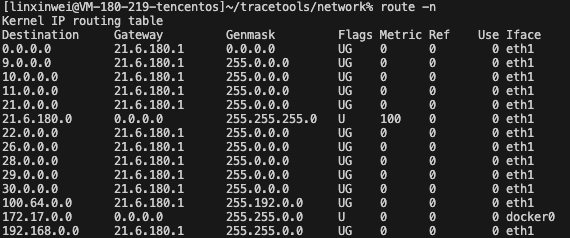
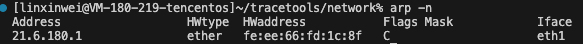

# ip 层的表及其作用

## 路由表

路由表用来决定数据包如何从源地址转发到目标地址。在路由表中会记录目标网络，以及目标网络对应的一些信息



* Destination：目标网络，当目标网络为default（0.0.0.0）时，表示这个是默认网关，所有数据都发到这个网关。
* Gateway：网关地址，即下一跳要转发到的路由器对应的ip，0.0.0.0 表示当前记录对应的 Destination 跟本机在同一个网段，不需要进行转发。
* Flags	
  * U - Up表示有效
  * G - Gateway表示连接路由，若无这个字段表示直连目的地址
  * H - Host表示目标是具体主机，而不是网段
  * R 恢复动态路由产生的表项
  * D 由路由的后台程序动态地安装
  * M 由路由的后台程序修改
  * ! 拒绝路由
* Metric：路由距离，到达指定网络所需的中转数，是大型局域网和广域网设置所必需的 （不在Linux内核中使用。）
* Ref：路由项引用次数 （不在Linux内核中使用。）
* Use：此路由项被路由软件查找的次数
* Iface：网卡名字，表示数据包会从哪个网卡上发出。

### linux路由的种类

主机路由：路由表中指向单个 IP 地址或主机名的路由记录，其 Flags 字段为 H。以下面的这条规则为例，说明这条路由规则只服务于发送到 10.0.0.10 的数据包。

```
Kernel IP routing table
Destination     Gateway         Genmask         Flags Metric Ref    Use Iface
10.0.0.10       10.139.128.1    255.255.255.255 UGH   0      0        0 eth0
```

网络路由，主机可以到达的网络。如示例中目的IP的网络号为 9.0.0.0 都要转发到 21.6.180.1。

```
Kernel IP routing table
Destination     Gateway         Genmask         Flags Metric Ref    Use Iface
9.0.0.0         21.6.180.1      255.0.0.0       UG    0      0        0 eth1
```
默认路由，当目标主机的 IP 地址或网络不在路由表中时，数据包就被发送到默认路由（默认网关）上。默认路由的 Destination 是 default 或 0.0.0.0。

```
Kernel IP routing table
Destination     Gateway         Genmask         Flags Metric Ref    Use Iface
0.0.0.0         21.6.180.1      0.0.0.0         UG    0      0        0 eth1
```

### 路由表的配置

**静态路由**

​静态路由​​无协议开销​​，不会占用带宽和计算资源。但需要管理员​手动配置​​无自动更新机制。使用于​​简单稳定的小型网络或固定路径。

**动态路由**

​动态路由的优点是可以​自动学习​​，路由器通过协议交换路由信息，实时更新路由表。​自适应拓扑​​，自动选择最优路径，支持故障切换。

​​协议分类​​：
​​内部网关协议（IGP）​​：用于同一自治系统内部，如：​RIP​​、​OSPF​​。
​​外部网关协议（EGP）​​：用于不同AS间，如 ​​BGP​​。

### 路由涉及的内核函数


## 邻居表
邻居表维护 IP 地址与 MAC 地址的映射（IPv4 用 ARP，IPv6 用 NDP）。



* Address​​：目标设备的 ​​IPv4 或 IPv6 地址
* HWtype：网络接口的​​硬件类型，图中为
* HWaddress：目标设备的 ​​MAC 地址​​即物理地址。
* Flags
  * C	​​Complete​​	条目有效且已确认（收到过ARP响应）
  * M	​​Manual​​	静态配置（手动 arp -s 绑定）
  * P	​​Publish​​	本机可响应此IP的ARP请求（代理ARP）
  * S	​​Stale​​	条目可能失效（需重新验证）
  * R	​​Router​​	目标是一台路由器（IPv6 NDP专用）
  * D	​​Dynamic​​	动态学习（非静态）

Mask：表示子网掩码，仅在某些系统​​中显示，这里在 Linux 上就没有显示
Iface：网卡名字，表示数据包会从哪个网卡上发出。

### 邻居表的配置

邻居表中的表项可以通过静态的配置或者动态的学习。

**静态配置**

静态配置管理员可以手动添加ARP条目。

```sh
sudo arp -s 192.168.1.200 00:1a:2b:3c:4d:02
```
静态条目的特点​​是​永久有效​​：除非手动删除或重启网络服务，​Flags 为 M​。
**动态学习**

当主机需要与目标IP通信但不知道其MAC地址时，会触发ARP协议自动学习。

当主机A需要和B进行通信时，如果但ARP表中无主机B的MAC地址。主机A会发送 ​ARP 请求广播包。​当​交换机收到广播帧后，会将其​​泛洪​到除接收端口外的所有端口。主机 B 收到广播后，回复 ​ARP 响应包​。其他主机则会将这个包丢弃。当主机 A 收到主机 B 的响应消息会 MAC。如果主机 A 和主机 B 不在一个子网下那么学到的则是网关的 MAC 地址。

​动态学习的特点
* Flags C 表示动态学习（Complete）。
* ​​老化机制​​：条目默认保留 ​​15-30分钟​​（可配置），超时后删除。
* ​广播风暴控制​​：ARP请求会广播到整个局域网，但频率有限制。

### 内核函数

## Netfilter

Netfilter 表​​ 是 Linux 内核中用于实现​防火墙和​网络地址转换的核心机制，它通过一系列规则表和链来控制数据包的流动。这里会用 iptable 命令来进行操作。

### Netfilter 中的表

iptables 使用 table 来组织规则，根据不同的作用，将规则分为不同 table。例如，如果规则是处理网络地址转换的，那会放到 nat table，如果是判断是否允许包继续向前，那可能会放到 filter table。

在 Netfilter 有以下的表：

**1.filter table：** 

filter table 是最常用的 table 之一，用于判断是否允许一个包通过（放行/拒绝）。这个 table 提供了防火墙 的一些常见功能。

**2.nat table：**

网络地址转换nat table 用于实现网络地址转换规则。当包进入协议栈的时候，这些规则决定是否以及如何修改包的源/目的地址，以改变包被 路由时的行为。nat table 通常用于将包路由到无法直接访问的网络。例如公网 IP 与私网 IP 的转换。

```
Chain PREROUTING (policy ACCEPT 0 packets, 0 bytes)
 pkts bytes target     prot opt in     out     source               destination         
   10   640 DNAT       tcp  --  eth0   *       0.0.0.0/0            203.0.113.1         tcp dpt:80 to:192.168.1.100:80

Chain POSTROUTING (policy ACCEPT 0 packets, 0 bytes)
 pkts bytes target     prot opt in     out     source               destination         
  100  6400 MASQUERADE  all  --  *      eth1    192.168.1.0/24       0.0.0.0/0      
```

第一条用于接收数据时，对于从 eth0 网卡进入的流量，destination=203.0.113.1 即目标为公网 IP 的数据包。按照  to:192.168.1.100:80：DNAT 规则将目标地址改为内网 IP 和端口。

第二条用于发送数据时，对于从 out=eth1：流量从 eth1 网卡发出，source=192.168.1.0/24：即源IP为私网的数据包。自动使用 eth1 的当前公网 IP 做 SNAT（MASQUERADE）标志。

**3.mangle table** 

修改 IP 头，mangle table 用于修改包的 IP 头。例如，可以修改包的 TTL，增加或减少包可以经过的跳数。

这个 table 还可以对包打只在内核内有效的“标记”（internal kernel “mark”），后 续的 table 或工具处理的时候可以用到这些标记。标记不会修改包本身，只是在包的内核 表示上做标记。

**4.raw table** 

raw table用于跟踪网络连接状态 NAT、状态防火墙。

建立在 netfilter 之上的连接跟踪（connection tracking）特性使得 iptables 将包看作已有的连接或会话的一部分，而不是一个由独立、不相关的包组成的流。 数据包到达网络接口之后很快就会有连接跟踪逻辑判断。

raw table 定义的功能非常有限，其唯一目的就是提供一个让包绕过连接跟踪的框架。

**5.security table**
打 SELinux 标记
security table 的作用是给包打上 SELinux 标记，以此影响 SELinux 或其他可以解读 SELinux 安全上下文的系统处理包的行为。这些标记可以基于单个包，也可以基于连接。

表中字段的含义：

target	DNAT	对数据包进行目标地址转换（Destination NAT）。
prot	tcp	仅匹配 TCP 协议的数据包。
in	eth0	数据包从 eth0 网卡进入（通常为公网接口）。
source	0.0.0.0/0	匹配任意源 IP（即所有外部客户端）。
destination	203.0.113.1

### 默认的 hook 点与 chain

在每个 table 内部，规则被进一步组织成 chain，内置的 chain 是由内置的 hook 触发 的。chain 基本上能决定（basically determin）规则何时被匹配。

hook点：

NF_IP_PRE_ROUTING: 接收到的包进入协议栈后立即触发此 hook，在进行任何路由判断之前
NF_IP_LOCAL_IN: 接收到的包经过路由判断，如果目的是本机，将触发此 hook
NF_IP_FORWARD: 接收到的包经过路由判断，如果目的是其他机器，将触发此 hook
NF_IP_LOCAL_OUT: 本机产生的准备发送的包，在进入协议栈后立即触发此 hook
NF_IP_POST_ROUTING: 本机产生的准备发送的包或者转发的包，在经过路由判断之后， 将触发此 hook

内置的 chain 名字和 netfilter hook 名字是一一对应的：

PREROUTING: 由 NF_IP_PRE_ROUTING hook 触发
INPUT: 由 NF_IP_LOCAL_IN hook 触发
FORWARD: 由 NF_IP_FORWARD hook 触发
OUTPUT: 由 NF_IP_LOCAL_OUT hook 触发
POSTROUTING: 由 NF_IP_POST_ROUTING hook 触发

除了默认的链之外，用户也可以自己定义链。

```sh
iptables -N MY_CHAIN  # 创建自定义链
iptables -A INPUT -j MY_CHAIN  # 将流量跳转到自定义链
iptables -A MY_CHAIN -s 192.168.1.100 -j DROP  # 添加规则
```

这里如果将默认的链上的流量跳转到自定义的链上则不需要自己单独写内核模块规定新的 hook 点。如果想要高度定制化的效果则需要自行编写内核模块。

### 触发hook的位置

Netfilter Hook 点被嵌入到内核网络协议栈的关键路径中，通过 NF_HOOK 宏触发。

**(1) NF_IP_PRE_ROUTING**

触发位置：在 ip_rcv()（IPv4 接收入口）中调用 nf_hook。

• 源码路径：net/ipv4/ip_input.c
  int ip_rcv(struct sk_buff *skb, struct net_device *dev, struct packet_type *pt, struct net_device *orig_dev) {
      return NF_HOOK(NFPROTO_IPV4, NF_INET_PRE_ROUTING, 
                     dev_net(dev), NULL, skb, dev, NULL,
                     ip_rcv_finish); // 路由前处理
  }
  
• 作用：在路由决策前处理（如 DNAT、包过滤）。

**(2) NF_IP_LOCAL_IN**

• 触发位置：路由判断目的为本机后，在 ip_local_deliver() 中调用。

• 源码路径：net/ipv4/ip_input.c
  int ip_local_deliver(struct sk_buff *skb) {
      return NF_HOOK(NFPROTO_IPV4, NF_INET_LOCAL_IN,
                     dev_net(skb->dev), NULL, skb, skb->dev, NULL,
                     ip_local_deliver_finish); // 本机接收处理
  }
  
• 作用：处理目标为本机的包（如防火墙规则）。

**(3) NF_IP_FORWARD**

• 触发位置：路由判断为转发后，在 ip_forward() 中调用。

• 源码路径：net/ipv4/ip_forward.c
  int ip_forward(struct sk_buff *skb) {
      return NF_HOOK(NFPROTO_IPV4, NF_INET_FORWARD,
                     dev_net(skb->dev), NULL, skb, skb->dev, NULL,
                     ip_forward_finish); // 转发处理
  }
  
• 作用：处理需要转发的包（如 FORWARD 链规则）。

**(4) NF_IP_LOCAL_OUT**

• 触发位置：本机发出的包在 __ip_local_out() 中调用。

• 源码路径：net/ipv4/ip_output.c
  int __ip_local_out(struct net *net, struct sock *sk, struct sk_buff *skb) {
      return NF_HOOK(NFPROTO_IPV4, NF_INET_LOCAL_OUT,
                     net, sk, skb, NULL, skb->dev,
                     dst_output); // 本机发送处理
  }
  
• 作用：处理本机生成的包（如 OUTPUT 链规则）。

**(5) NF_IP_POST_ROUTING**

• 触发位置：在 ip_output() 或 ip_finish_output() 中调用。

• 源码路径：net/ipv4/ip_output.c
  int ip_output(struct net *net, struct sock *sk, struct sk_buff *skb) {
      return NF_HOOK(NFPROTO_IPV4, NF_INET_POST_ROUTING,
                     net, sk, skb, NULL, skb->dev,
                     ip_finish_output); // 发送前最后处理
  }
  
• 作用：处理即将发出的包（如 SNAT、MASQUERADE）。

Hook 优先级与处理顺序

Netfilter 模块通过 nf_hook_ops 结构体注册处理函数，并指定优先级。内核通过链表管理同一 Hook 点的多个处理函数，按优先级排序执行。

(1) 注册示例（内核模块）

static struct nf_hook_ops my_hook_ops = {
    .hook     = my_hook_function,  // 处理函数
    .pf       = NFPROTO_IPV4,      // 协议族
    .hooknum  = NF_INET_PRE_ROUTING, // Hook 点
    .priority = NF_IP_PRI_FIRST,   // 优先级（整数，越小越先执行）
};

// 注册 Hook
nf_register_net_hook(net, &my_hook_ops);

(2) 内核预定义优先级

优先级定义在 include/uapi/linux/netfilter_ipv4.h：
enum nf_ip_hook_priorities {
    NF_IP_PRI_FIRST = INT_MIN,
    NF_IP_PRI_CONNTRACK = -200,   // conntrack 模块
    NF_IP_PRI_MANGLE = -150,      // mangle 表
    NF_IP_PRI_NAT_DST = -100,     // DNAT
    NF_IP_PRI_FILTER = 0,         // filter 表
    NF_IP_PRI_NAT_SRC = 100,      // SNAT
    NF_IP_PRI_LAST = INT_MAX,
};


(3) 执行逻辑

当 NF_HOOK 被触发时，内核遍历该 Hook 点的处理函数链表：
1. 按优先级从高到低（数值从小到大）依次调用。
2. 每个处理函数返回 NF_DROP、NF_ACCEPT、NF_STOLEN 等结果。
3. 若返回 NF_DROP，则终止处理并丢弃包；若 NF_ACCEPT，则继续下一个处理函数。

关键数据结构与函数：

(1) struct nf_hook_ops

struct nf_hook_ops {
    struct list_head list;       // 链表节点
    nf_hookfn *hook;             // 处理函数
    int priority;                // 优先级
    unsigned int hooknum;        // Hook 点（如 NF_INET_PRE_ROUTING）
    u_int8_t pf;                // 协议族（如 NFPROTO_IPV4）
};


(2) nf_hookfn 函数原型

unsigned int my_hook_function(
    void *priv,                  // 私有数据
    struct sk_buff *skb,         // 数据包
    const struct nf_hook_state *state // Hook 状态（设备、协议等）
);


(3) NF_HOOK 宏展开

#define NF_HOOK(pf, hook, net, sk, skb, indev, outdev, okfn) \
    nf_hook(pf, hook, net, sk, skb, indev, outdev, okfn)


5. 性能影响与调试

(1) 查看已注册的 Hook

cat /proc/net/netfilter/nf_hook_list


(2) 动态跟踪 Hook 调用（BPF）

sudo bpftrace -e 'kprobe:nf_hook { printf("Hook: %d, dev: %s\n", arg2, kdevname(arg3->in)); }'


(3) 性能优化建议

• 减少高优先级模块的处理耗时（如 conntrack 开启 nf_conntrack_timestamp 会增加延迟）。

• 避免在 NF_IP_PRE_ROUTING 或 NF_IP_LOCAL_OUT 中注册复杂逻辑（这些路径对延迟敏感）。

总结

Netfilter 的 Hook 机制通过 协议栈嵌入点 + 优先级调度 实现模块化包处理。理解其执行流程需要结合：
1. 协议栈路径（如 ip_rcv() → ip_forward()）。
2. Hook 触发时机（路由前、路由后等）。
3. 优先级竞争（如 NAT 规则优先于过滤规则）。

​​路由表​​：struct fib_table (在 net/ipv4/fib_frontend.c)
​​邻居表​​：struct neigh_table (在 net/core/neighbour.c)
​​Netfilter​​：struct nf_table (在 net/netfilter/core.c)
​​连接跟踪​​：struct nf_conn (在 net/netfilter/nf_conntrack_core.c)