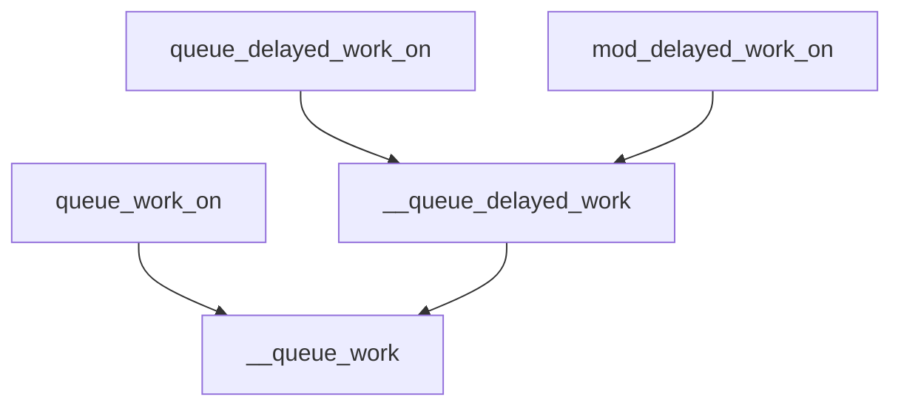

# 工作队列

## 作用

工作队列（Workqueue）是 Linux 内核中用于 ​​异步任务处理​​ 的核心机制，它将任务托管给内核线程定时执行。

当需要这样一个异步执行上下文时，一个描述将要执行的函数的工作项（work， 即一个待执行的任务）被放在队列中。一个独立的线程作为异步执行环境。该队 列被称为workqueue，线程被称为工作者（worker，即执行这一队列的线程）。

当工作队列上有工作项时，工作者会一个接一个地执行与工作项相关的函数。当 工作队列中没有任何工作项时，工作者就会变得空闲。当一个新的工作项被排入 队列时，工作者又开始执行。

​​典型应用场景​​：
* 中断下半部处理​​（替代 tasklet/softirq）
* ​异步文件系统操作​​
* ​CPU 频率调控​​（如 ondemand 调速器）
* ​设备驱动中的延迟任务​

## 结构体

### work_struct

work_struct 用来记录工作项的信息

```c
struct work_struct {
    atomic_long_t data; // 工作项的状态和标志位
    struct list_head entry; // 链表节点，用于将工作项加入队列
    work_func_t func; // 工作项的回调函数指针
#ifdef CONFIG_LOCKDEP
    struct lockdep_map lockdep_map; // 用于锁依赖检测的映射
#endif
};
```

### workqueue_struct

workqueue_struct 用来记录工作队列的信息

```c
struct workqueue_struct {
    struct list_head	pwqs;		/* WR: 当前工作队列的所有 pwq（工作池队列） */
    struct list_head	list;		/* PR: 所有工作队列的链表 */

    struct mutex		mutex;		/* 保护该工作队列的互斥锁 */
    int			work_color;	/* WQ: 当前工作项的颜色（用于同步） */
    int			flush_color;	/* WQ: 当前刷新操作的颜色 */
    atomic_t		nr_pwqs_to_flush; /* 正在进行的刷新操作计数 */
    struct wq_flusher	*first_flusher;	/* WQ: 第一个刷新器 */
    struct list_head	flusher_queue;	/* WQ: 刷新等待队列 */
    struct list_head	flusher_overflow; /* WQ: 刷新溢出列表 */

    struct list_head	maydays;	/* MD: 请求救援的 pwq 列表 */
    struct worker		*rescuer;	/* MD: 救援工作者线程 */

    int			nr_drainers;	/* WQ: 正在进行的排空操作计数 */

    /* alloc_workqueue() 函数注释中有关于 min/max_active 的详细信息 */
    int			max_active;	/* WO: 最大活动工作项数 */
    int			min_active;	/* WO: 最小活动工作项数 */
    int			saved_max_active; /* WQ: 保存的最大活动工作项数 */
    int			saved_min_active; /* WQ: 保存的最小活动工作项数 */

    struct workqueue_attrs	*unbound_attrs;	/* PW: 仅用于非绑定工作队列 */
    struct pool_workqueue __rcu *dfl_pwq;   /* PW: 仅用于非绑定工作队列 */

#ifdef CONFIG_SYSFS
    struct wq_device	*wq_dev;	/* I: 用于 sysfs 接口 */
#endif
#ifdef CONFIG_LOCKDEP
    char			*lock_name;	/* 锁的名称 */
    struct lock_class_key	key;		/* 锁类键值 */
    struct lockdep_map	__lockdep_map;	/* 锁依赖映射 */
    struct lockdep_map	*lockdep_map;	/* 锁依赖映射指针 */
#endif
    char			name[WQ_NAME_LEN]; /* I: 工作队列名称 */

    /*
     * workqueue_struct 的销毁操作受 RCU 保护，以允许在不获取 wq_pool_mutex 的情况下遍历工作队列列表。
     * 这用于通过 sysrq 转储所有工作队列。
     */
    struct rcu_head		rcu;

    /* 在命令发出期间使用的热字段，按缓存行对齐 */
    unsigned int		flags ____cacheline_aligned; /* WQ: WQ_* 标志 */
    struct pool_workqueue __rcu * __percpu *cpu_pwq; /* I: 每 CPU 的 pwq */
    struct wq_node_nr_active *node_nr_active[]; /* I: 每节点的活动计数 */
};
```

## 接口

### 创建工作项

```c
/* 
 * INIT_DELAYED_WORK - 初始化一个标准的延迟工作项（delayed_work）
 * @_work:  要初始化的struct delayed_work结构体指针
 * @_func:  工作项回调函数指针
 * 注：使用普通定时器，延迟时间包含系统休眠时间
 */
#define INIT_DELAYED_WORK(_work, _func) \
	__INIT_DELAYED_WORK(_work, _func, 0)

/*
 * INIT_DELAYED_WORK_ONSTACK - 初始化栈上分配的延迟工作项
 * @_work:  栈上分配的struct delayed_work结构体
 * @_func:  工作项回调函数指针
 * 注：避免动态内存分配，适合生命周期短的临时任务
 */
#define INIT_DELAYED_WORK_ONSTACK(_work, _func) \
	__INIT_DELAYED_WORK_ONSTACK(_work, _func, 0)

/*
 * INIT_DEFERRABLE_WORK - 初始化可推迟的延迟工作项
 * @_work:  struct delayed_work结构体指针
 * @_func:  工作项回调函数指针
 * 注：使用TIMER_DEFERRABLE标志，系统休眠时不累计延迟时间
 */
#define INIT_DEFERRABLE_WORK(_work, _func) \
	__INIT_DELAYED_WORK(_work, _func, TIMER_DEFERRABLE)

/*
 * INIT_DEFERRABLE_WORK_ONSTACK - 初始化栈上分配的可推迟工作项
 * @_work:  栈上分配的struct delayed_work结构体
 * @_func:  工作项回调函数指针
 * 注：结合栈分配和可推迟特性，适合节能敏感场景
 */
#define INIT_DEFERRABLE_WORK_ONSTACK(_work, _func) \
	__INIT_DELAYED_WORK_ONSTACK(_work, _func, TIMER_DEFERRABLE)

/*
 * INIT_RCU_WORK - 初始化RCU保护的工作项
 * @_work:  struct rcu_work结构体指针
 * @_func:  工作项回调函数指针
 * 注：回调函数在RCU读临界区内执行，可安全访问RCU保护数据
 */
#define INIT_RCU_WORK(_work, _func) \
	INIT_WORK(&(_work)->work, (_func))

/*
 * INIT_RCU_WORK_ONSTACK - 初始化栈上分配的RCU工作项
 * @_work:  栈上分配的struct rcu_work结构体
 * @_func:  工作项回调函数指针
 * 注：避免动态内存分配，同时保持RCU保护特性
 */
#define INIT_RCU_WORK_ONSTACK(_work, _func) \
	INIT_WORK_ONSTACK(&(_work)->work, (_func))
```

核心宏：

```c
/**
 * __INIT_WORK_KEY - 初始化工作队列项的宏定义
 * @param _work: 指向工作队列项的指针
 * @param _func: 工作队列项的回调函数
 * @param _onstack: 指示工作队列项是否在栈上的标志
 * @param _key: 锁类的键值，用于锁依赖分析
 *
 * 根据是否启用了 CONFIG_LOCKDEP，初始化工作队列项的锁依赖映射。
 * 如果启用了 CONFIG_LOCKDEP，会调用 lockdep_init_map 初始化锁依赖映射。
 * 同时初始化工作队列项的其他成员，包括 data、entry 和 func。
 */

/**
 * __INIT_WORK - 初始化工作队列项的宏定义
 * @param _work: 指向工作队列项的指针
 * @param _func: 工作队列项的回调函数
 * @param _onstack: 指示工作队列项是否在栈上的标志
 *
 * 使用静态的锁类键值 __key 调用 __INIT_WORK_KEY 宏来初始化工作队列项。
 * 该宏封装了工作队列项的初始化逻辑。
 */
```c
#ifdef CONFIG_LOCKDEP
#define __INIT_WORK_KEY(_work, _func, _onstack, _key)			\
	do {								\
		__init_work((_work), _onstack);				\
		(_work)->data = (atomic_long_t) WORK_DATA_INIT();	\
		lockdep_init_map(&(_work)->lockdep_map, "(work_completion)"#_work, (_key), 0); \
		INIT_LIST_HEAD(&(_work)->entry);			\
		(_work)->func = (_func);				\
	} while (0)
#else
#define __INIT_WORK_KEY(_work, _func, _onstack, _key)			\
	do {								\
		__init_work((_work), _onstack);				\
		(_work)->data = (atomic_long_t) WORK_DATA_INIT();	\
		INIT_LIST_HEAD(&(_work)->entry);			\
		(_work)->func = (_func);				\
	} while (0)
#endif

#define __INIT_WORK(_work, _func, _onstack)				\
	do {								\
		static __maybe_unused struct lock_class_key __key;	\
									\
		__INIT_WORK_KEY(_work, _func, _onstack, &__key);	\
	} while (0)
// 在 delayed 中
#define __INIT_DELAYED_WORK(_work, _func, _tflags)			\
	do {								\
		INIT_WORK(&(_work)->work, (_func));			\
		__init_timer(&(_work)->timer,				\
			     delayed_work_timer_fn,			\
			     (_tflags) | TIMER_IRQSAFE);		\
	} while (0)

```

### 创建工作队列

工作项和工作队列的初始化并不是同步的。对于工作队列需要使用方自行创建自己专属的工作队列，也可以使用内核定义好的工作队列。

#### 提前定义好的工作队列
在 Linux 内核中，预定义的工作队列（workqueue_struct）针对不同场景进行了优化，每种队列有其特定的用途和行为特征。

```c
extern struct workqueue_struct *system_wq;
extern struct workqueue_struct *system_highpri_wq;
extern struct workqueue_struct *system_long_wq;
extern struct workqueue_struct *system_unbound_wq;
extern struct workqueue_struct *system_freezable_wq;
extern struct workqueue_struct *system_power_efficient_wq;
extern struct workqueue_struct *system_freezable_power_efficient_wq;
extern struct workqueue_struct *system_bh_wq;
extern struct workqueue_struct *system_bh_highpri_wq;
```

|队列名称|优先级 |CPU绑定 |关键特性 |典型场景
| ------ | ------ | ------ | ------ | ------ |
|system_wq| 普通| 绑核| 默认队列| 通用后台任务|
|system_highpri_wq| 高| 绑核| 低延迟| 中断下半部、定时器|
|system_long_wq| 普通| 绑核| 长耗时任务| 文件系统操作|
|system_unbound_wq| 普通| 未绑核| 负载均衡| 计算密集型任务|
|system_freezable_wq| 普通| 绑核| 可冻结| 电源管理相关任务|
|system_power_efficient_wq| 普通| 未绑核| 节能模式| 网络心跳、后台同步|
|system_freezable_power_efficient_wq| 普通| 未绑核| 可冻结 + 节能| 低功耗后台任务|
|system_bh_wq| 普通| 绑核| 软中断上下文| 快速中断处理|
|system_bh_highpri_wq| 高| 绑核| 软中断上下文 + 高优先级| 实时性要求高的中断处理|

* 默认选择：system_wq（除非有特殊需求）。  

* 实时性要求：system_highpri_wq 或 system_bh_highpri_wq。  

* 节能需求：system_power_efficient_wq。  

* 跨 CPU 负载均衡：system_unbound_wq。  

* 系统休眠敏感：system_freezable_wq。  

#### 创建工作队列的流程

```c
struct workqueue_struct *alloc_workqueue(const char *fmt, unsigned int flags, int max_active, ...)
    |
    |——kzalloc(sizeof(*wq) + tbl_size, GFP_KERNEL) //申请一个workqueue_struct，赋值到局部变量wq，用于函数返回
    |
    |——alloc_workqueue_attrs() //创建默认的非绑定属性，赋值到 wk->unbound_attrs
    |
    |——vsnprintf(wq->name, sizeof(wq->name), fmt, args) //格式化队列名称
    |
    |——wq_clamp_max_active(max_active, flags, wq->name) //判断最大支持线程数，赋值到wq->saved_max_active
    |
    |——“/* init wq */” //初始化workqueue_struct结构体其它变量：互斥体、锁、各个链表……
    |
    |——alloc_and_link_pwqs(wq) //申请线程池(pwq)并链接到wq
    |
    |——workqueue_sysfs_register(wq) //创建工作队列设备，并注册进文件系统
    |
    |——pwq_adjust_max_active(pwq) //为每个工作者线程池调整最大线程数
```

### 加入队列

所有



唤醒流程：

```c
bool queue_work_on(int cpu, struct workqueue_struct *wq, struct work_struct *work)
    |
    |——test_and_set_bit(WORK_STRUCT_PENDING_BIT, work_data_bits(work)) //将工作任务标记为PENDING
    |
    |——__queue_work(cpu, wq, work) //把工作任务加入到工作队列中
        |
        |——pwq = unbound_pwq_by_node(wq, cpu_to_node(cpu)) //获取到对应工作队列对应CPU的工作者线程池
        |
        |——last_pool = get_work_pool(work) //如果此工作上一次在某工作者线程运行过，则继续排队到该线程，保证工作函数不被重入
        |——worker = find_worker_executing_work(last_pool, work)
        |
        |——insert_work(pwq, work, worklist, work_flags) //将工作任务入队
            |
            |——set_work_pwq(work, pwq, extra_flags) //设置WORK_STRUCT_PWQ标志
            |
            |——list_add_tail(&work->entry, head) //将work的链表节点，加入到pwq->inactive_works中
            |
            |——get_pwq(pwq) //增加pwq的引用
            |
            |——kick_pool(pool) //如果需要则唤醒多一个工作者线程
                |
                |——worker = first_idle_worker(pool) //找到首个空闲工作者线程
                |
                |——wake_up_process(worker->task) //唤醒这个工作者线程 绘制执行流程
```

### 同步与取消

cancel_work_sync(&work)	取消普通工作项并等待完成
cancel_delayed_work_sync(&dwork)	先取消定时器，再取消工作项，确保任务不会执行
flush_workqueue(wq)	阻塞直到工作队列中所有任务完成

