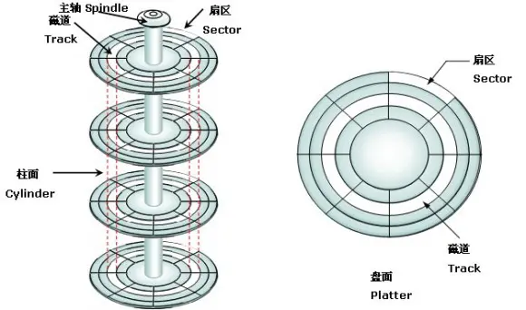
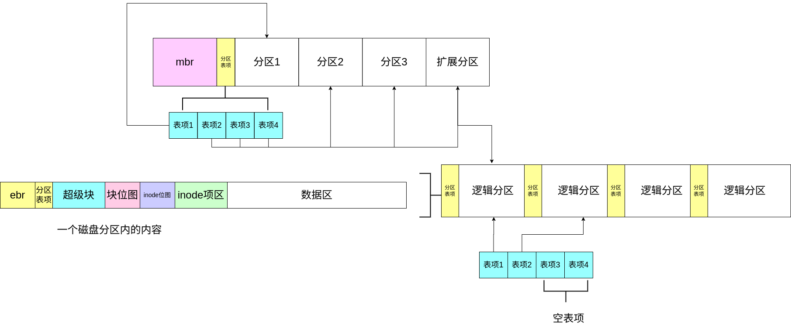

# 文件系统
## 磁盘
提到文件系统自然离不开作为存储介质的磁盘设备。
### 磁盘的物理结构
磁盘中内部有很多个盘片，上面充满了磁性物质用来储存信息。\
每个盘面都被划分为数目相等的磁道，并从外缘开始编号（即最边缘的磁道为0磁道，往里依次累加）。一般512字节为一个扇区\
如此磁盘中具有相同编号的磁道会形成一个圆柱，此圆柱称为磁盘的柱面。磁盘的柱面数与一个盘面上的磁道数是相等的。由于每个盘面都有一个磁头，因此，盘面数等于总的磁头数。\
  
在读写磁盘时，要先找到指定的扇区号再向其中写入内容，这两个步骤都会花费较长的时间，因此磁盘相对于内存是一种低速存储设备。
### 磁盘中断
作为外设磁盘的活动需要通过中断通知给cpu。\
在此过程中还有一个名为通道的设备。磁盘通过通道向cpu发出中断。\
一个通道对应两块磁盘。每个通道有自己对应的端口基址和中断引脚。
  
代码实现：
```c
//通道结构体
struct ide_channel {
    char name[8];
    uint32_t port_base;//起始端口号
    uint8_t inr_no;//中断号
    struct lock c_lock;//通道锁，一个通道上有两个磁盘吗，为了保证操作原子信，需要锁
    bool expect_intr;//是否等待中断
    struct semaphore disk_down;//信号量
    struct disk devices[2];//两个磁盘
};
//磁盘结构体
struct disk {
    char name[8];
    struct ide_channel* mychannel;//磁盘的通道
    uint8_t dev_no;//标记是主盘还是从盘
    struct partition mian_parts[4];//四个主分区
    struct partition logic_parts[4];//八个逻辑分区

};
```
### 磁盘端口
磁盘的端口有3类，分别是读写端口，控制端口，状态端口。
#### 读写端口
跟读写相关的端口有磁盘选择端口，扇区选择端口，数据端口\
一个通道对应了两个磁盘。分别为从盘和主盘。\
扇区选择端口一共有四个，共32位。前28位填写的是待操作的扇区号,后四位则是读写时的标志位。
  

#### 控制端口
通过向磁盘的控制端口中写入指令，可以设置磁盘的读写或获取磁盘信息
```c
#define CMD_IDENTIFY	   0xec	    // identify指令获取磁盘信息
#define CMD_READ_SECTOR	   0x20     // 读扇区指令
#define CMD_WRITE_SECTOR   0x30	    // 写扇区指令
```
#### 状态端口
  

磁盘状态端口中的八位分别对应着磁盘的状态。通过读取磁盘状态端口中的内容来判断磁盘当前的状态。
### 磁盘读写控制流程
在前文中提到了磁盘io需要时间\
  
读和写的信号量down操作时间并不相同，读的down操作是在选择读磁盘之前，当发出读命令时磁盘就会开始工作\
而写的down是在写磁盘之后，将内容写入端口中之后磁盘才会开始工作
### 磁盘的逻辑结构
  
以下两个结构体对应了图中引导扇区和引导扇区中的分区表项
```c
/* 引导扇区,mbr或ebr所在的扇区 */
struct boot_sector {
   uint8_t  other[446];		 // 引导代码
   struct   partition_table_entry partition_table[4];       // 分区表中有4项,共64字节
   uint16_t signature;		 // 启动扇区的结束标志是0x55,0xaa,
} __attribute__ ((packed));
```
磁盘分区表项：
```c
struct partition_table_entry {
   uint8_t  bootable;		 // 是否可引导	
   uint8_t  start_head;		 // 起始磁头号
   uint8_t  start_sec;		 // 起始扇区号
   uint8_t  start_chs;		 // 起始柱面号
   uint8_t  fs_type;		 // 分区类型
   uint8_t  end_head;		 // 结束磁头号
   uint8_t  end_sec;		 // 结束扇区号
   uint8_t  end_chs;		 // 结束柱面号
/* 更需要关注的是下面这两项 */
   uint32_t start_lba;		 // 本分区起始扇区的lba地址
   uint32_t sec_cnt;		 // 本分区的扇区数目
} __attribute__ ((packed));	 // 保证此结构是16字节大小
```
磁盘分区信息：
```C
struct partition {
   uint32_t start_lba;		 // 起始扇区
   uint32_t sec_cnt;		 // 扇区数
   struct disk* my_disk;	 // 分区所属的硬盘
   struct list_node part_tag;	 // 用于队列中的标记
   char name[8];		 // 分区名称
   struct super_block* sb;	 // 本分区的超级块
   struct bitmap block_bitmap;	 // 块位图
   struct bitmap inode_bitmap;	 // i结点位图
   struct list open_inodes;	 // 本分区打开的i结点队列
};
```
### 磁盘的信息的初始化
上面提到partition中包含诸多磁盘相关的信息，那么这些信息又从何而来？
内核中的partition中的信息在系统初始化之时，会由磁盘初始化程序将信息从磁盘分区表中读出。这些信息被记录在磁盘内部，需要读取后再填写到partition之中。
```c
static void partition_scan(struct disk* hd, uint32_t ext_lba) {
    struct boot_sector* bs = sys_malloc(sizeof(struct boot_sector));
    ide_read(hd, ext_lba, bs, 1);
    uint8_t part_idx = 0;   //用于遍历主分区的变量
    struct partition_table_entry* p = bs->partition_table;

    /* 遍历分区表4个分区表项 */
    while (part_idx++ < 4) {
        if (p->fs_type == 0x5) {	 // 若为扩展分区
            if (ext_lba_base != 0) { 
                /* 子扩展分区的start_lba是相对于主引导扇区中的总扩展分区地址 */
                partition_scan(hd, p->start_lba + ext_lba_base);
            } 
            else { // ext_lba_base为0表示是第一次读取引导块,也就是主引导记录所在的扇区
            /* 记录下扩展分区的起始lba地址,后面所有的扩展分区地址都相对于此 */
                ext_lba_base = p->start_lba;
                partition_scan(hd, p->start_lba);//递归调用直到最后一个扩展分区
            }
        } 
        else if (p->fs_type != 0) { // 若是有效的分区类型
            if (ext_lba == 0) {	 // 此时全是主分区
                hd->prim_parts[p_no].start_lba = ext_lba + p->start_lba;
                hd->prim_parts[p_no].sec_cnt = p->sec_cnt;
                hd->prim_parts[p_no].my_disk = hd;
                list_append(&partition_list, &hd->prim_parts[p_no].part_tag);
                sprintf(hd->prim_parts[p_no].name, "%s%d", hd->name, p_no + 1);
                p_no++;
                ASSERT(p_no < 4);	    // 0,1,2,3
            } 
            else {
                hd->logic_parts[l_no].start_lba = ext_lba + p->start_lba;
                hd->logic_parts[l_no].sec_cnt = p->sec_cnt;
                hd->logic_parts[l_no].my_disk = hd;
                list_append(&partition_list, &hd->logic_parts[l_no].part_tag);
                sprintf(hd->logic_parts[l_no].name, "%s%d", hd->name, l_no + 5);	 // 逻辑分区数字是从5开始,主分区是1～4.
                l_no++;
                if (l_no >= 8)    // 只支持8个逻辑分区,避免数组越界
                return;
            }
        } 
        p++;
    }
    sys_free(bs);
}
```


## 文件系统的概念
### 一切皆文件的思想
### 虚拟文件系统
>虚拟文件系统（Virtual File System，简称VFS）是Linux内核的子系统之一，它为用户程序提供文件和文件系统操作的统一接口，屏蔽不同文件系统的差异和操作细节。借助VFS可以直接使用open()、read()、write()这样的系统调用操作文件，而无须考虑具体的文件系统和实际的存储介质。\
Linux用户程序可以通过read() 来读取ext3、NFS、XFS等文件系统的文件，也可以读取存储在SSD、HDD等不同存储介质的文件，无须考虑不同文件系统或者不同存储介质的差异。


一般一个文件系统（除去分布式文件系统）只能挂载在一个磁盘分区中。


在实际应用的操作系统中分区信息结构体中还记录着文件系统的操作函数等，由于在此是简单实现因此并没有这个成员。

## 文件相关的数据结构
### 结构关系
   
普通文件与目录文件都被认为是文件，二者在系统层面的操作并无太大区别。普通文件中保存着文件内容，而目录文件中保存的则是目录项。
### 目录结构

### inode
inode 是许多文件系统中使用的通用名称,用于描述保存给定文件的元数据的结构,例如其长度、权限以及其组成块的位置，并且inode是文件系统中文件的唯一标识。\
为什么需要inode？\
文件系统中会存储着许多文件，文件的大小，属主等等都有所不同，通过inode可以将这些信息组织到一起
* 通过使用inode，文件系统可以更快地定位和访问文件的元数据信息，从而提高文件访问的效率。
* inode可以帮助文件系统更有效地管理磁盘空间，允许存储更多的文件和目录。
```c
struct inode {
  uint32_t i_no;    // inode编号
  uint32_t i_size;  // 文件大小(若为目录，是指目录项大小之和)
  uint32_t i_open_cnts;  // 记录此文件被打开的次数
  bool write_deny;  // 写文件不能并行，进程写文件前检查此标识
  uint32_t i_sectors[13];  // 块的索引表，前12项为直接块，后1项为间接块
  struct list_node inode_tag;//用于将结构体挂上内核中inode打开队列
};
```
除此之外inode中还存储了文件的扇区号。因为文件有大有小，连续的存储会导致磁盘内的扇区碎片化。因此一份文件并不会被存储到连续的区域中。上图中的块位图就是标记哪片扇区是被使用过的。哪片是没被使用过的。\
块指针的前12个块都是直接指针，存储了扇区号，第13个则是间接指针，指向一个扇区，而该扇区中则存储着真正文件所在的扇区号\
  
inode中并没有存储文件名，对于系统来说inode号没有什么意义。对于inode来说，无论是普通文件还是目录文件，在inode这里都一视同仁。\
而用户使用的文件名/路径名和inode号会在file和dir结构中被联系起来。
### super_block
超级块中存储这这片磁盘分区以及挂载文件系统相关信息。其中包含了块位图，inode位图，数据区的起始地址与尺寸以及文件系统的操作接口。
```c
struct super_block {
    uint32_t magic;          // 文件系统的标识类型
    uint32_t sec_cnt;        // 该磁盘分区的总扇区数
    uint32_t inode_cnt;      // 该分区的inode数量
    uint32_t part_lba_base;  // 本分区的lba地址

    uint32_t block_bitmap_lba;    // 块位图的起始地址
    uint32_t block_bitmap_sects;  // 扇区位图本身占用的扇区数量

    uint32_t inode_bitmap_lba;    // i结点位图起始扇区lba地址
    uint32_t inode_bitmap_sects;  // i结点位图占用的扇区数量

    uint32_t inode_table_lba;    // i结点表起始扇区lba地址
    uint32_t inode_table_sects;  // i结点表占用的扇区数量

    uint32_t data_start_lba;  // 数据区开始的第一个扇区号
    uint32_t root_inode_no;   // 根目录所在的I结点号
    uint32_t dir_entry_size;  // 目录项大小

    uint8_t pad[460];  // 加上460字节,凑够512字节1扇区大小
}__attribute__ ((packed));//对齐512字节
```
在初始化时会遍历链表上先前的所有分区，若该尚未挂载文件系统，则会为其挂载对应的文件系统。\
而在某一时刻，操作系统只使用一个文件系统内的信息。
```c
struct partition* cur_part;//记录了当前正在使用的磁盘
```
### file
file结构体保存了一个普通文件的信息。
```c
struct file
{
    uint32_t fd_pos; // 记录当前文件操作的偏移地址,以0为起始,最大为文件大小-1
    uint32_t fd_flag;//文件类型
    struct inode *fd_inode;//inode号
};
```
### dir与dir_entry
dir类型保存的是一个打开的目录文件的信息，目录文件在这里被与一个inode号对应起来。
```c
struct dir {
    struct inode* inode;   //dir对应的inode号
    uint32_t dir_pos;	  // 记录在目录内的偏移
    uint8_t dir_buf[512];  // 目录的数据缓存
};
```
dir_entry保存的是一个目录项的信息，与dir要注意区分
```c
struct dir_entry {
    char filename[MAX_FILE_NAME_LEN];  // 普通文件或目录名称
    uint32_t i_no;		      // 普通文件或目录对应的inode编号
    enum file_types f_type;	      // 文件类型
};
```
## 初始化文件系统
初始化文件系统包含两个内容，一个为计算超级块中的内容并将其写入磁盘中一个为挂载分区。

## 文件相关的系统调用
### 
