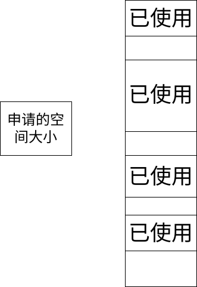
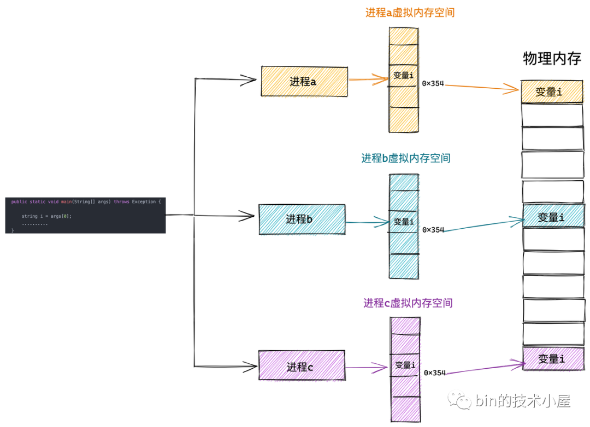
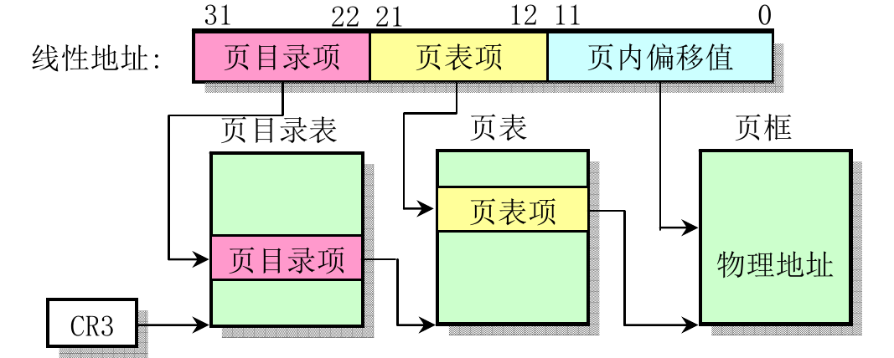
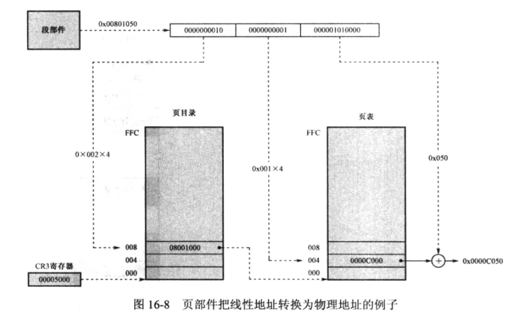
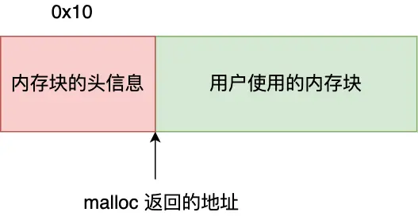
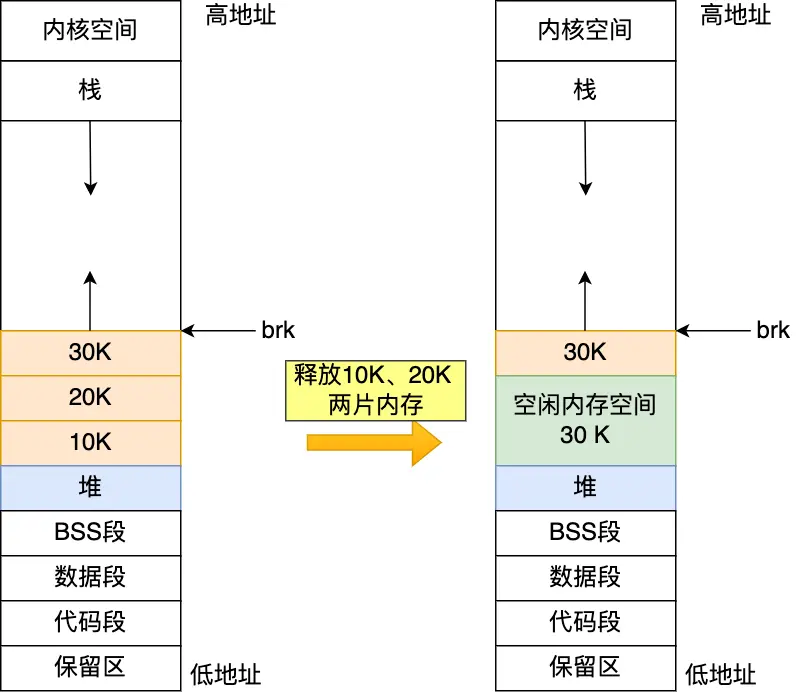
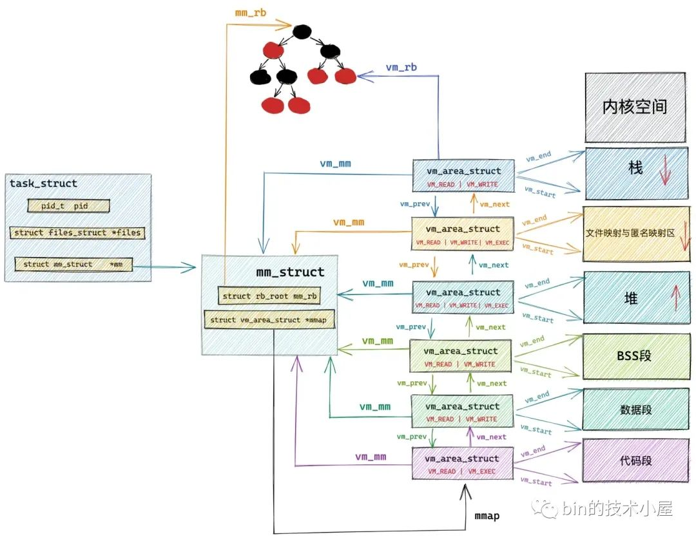
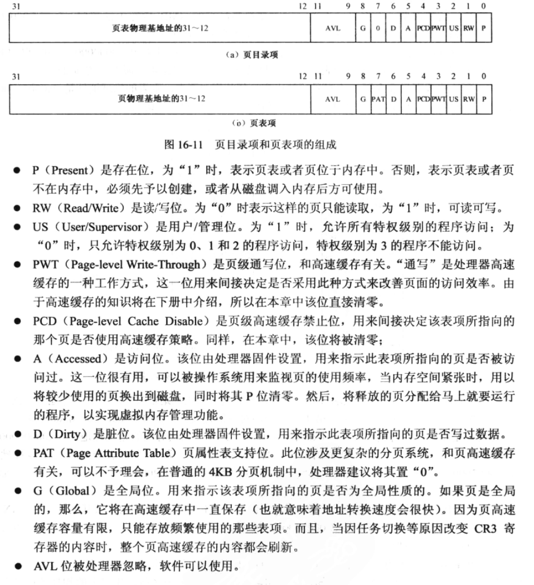
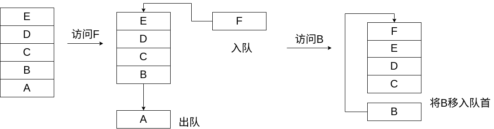

# 虚拟内存

## 为什么需要虚拟内存技术
早期计算机中，并未引入虚拟内存的概念。\
明明直接访问物理地址简单快捷为何又要使用虚拟内存？
### 计算机硬件资源有限
早期计算机中只运行单一或几个简单的程序。\
但在当今时代，人们对计算机的性能要求越来越高，为了打破硬件的限制。发展出许多虚拟化技术。虚拟内存技术就是其中之一。
### 内存碎片化
每次一个程序的指令总是渴望放在一片连续的空间内。但直接分配内存可能会导致内存的碎片化。\
  
例如上图，虽然此时内存总量大于申请的空间。但是因为碎片化的分布，导致无法为程序分配出相应的空间。
### 进程间的隔离
  

若直接使用物理内存，电脑上诸多进程都要小心翼翼的记住其他进程的领地。如果不小心触碰到其他进程的领地就会导致数据的错乱甚至程序的崩溃。虚拟地址的出现将进程之间彻底隔离开由操作系统统一管理。\
同时进程间的隔离也会使你的电脑更安全，可以更好的防止软件获取你物理内存中的关键信息。
  
在使用了虚拟内存之后，进程就以为自己独占了整个内存空间资源，给进程产生了所有内存资源都属于它自己的幻觉，这其实是 CPU 和操作系统使用的一个障眼法罢了，任何一个虚拟内存里所存储的数据，本质上还是保存在真实的物理内存里的。只不过内核帮我们做了虚拟内存到物理内存的这一层映射，将不同进程的虚拟地址和不同内存的物理地址映射起来。
## 硬件支持
虚拟内存技术的实现并非只需要软件的空中楼阁，还需要硬件层面提供的支持。
### MMU
MMU用于将虚拟内存地址转化为物理内存地址。
### TLB
倘若每次都计算虚拟内存地址，不仅非常麻烦MMU，还会占用一定量的资源。\
因此，TSL的存在可以将常用的虚拟地址与物理地址一一对应并将他们储存起来，这样就会大大减轻MMU的工作量。\
  
### 寄存器cr3
MMU只负责计算，那么谁来帮助他记住页目录项的物理地址？\
cr3在寄存器中存储了页目录的物理地址。这样MMU就可以直接通过他获取到页目录的虚拟地址进行运算了。
## 寻址方式
### 什么是页
我们人为规定一页的大小对应了物理内存中4096字节\
32位架构下，将一个32位的地址分为高10位，中间10位，与低12位。
* 高十位对应了页表物理地址的索引。
* 中间十位对应了页物理地址的索引。
* 低12位对应了在物理页内的偏移。\
   
<u><big>页目录与页表也会占用一个自然页的空间！！！</big></u>\
  

计算物理地址与虚拟地址对应关系的方式例如:\
  

64位下的寻址更加复杂，引入了更多级别的页表，但是思想和简单的32位还是一样，只不过是又多绕了几个层级的路\
  

## 进程内存布局
如图在32位架构下，进程的虚拟内存空间中低3G被作为用户空间使用，而高1GB作为内核空间被使用。\
其中操作系统部分的代码与数据是被不同进程间共享的。\
  
这样做的原因是为了更好的利用本就不充沛的内存空间。如果为每一个用户进程都需要拷贝一份内核相关的数据和代码放进物理内存之中，早就将物理内存占满了。\
这样的布局方式又是如何实现的？\
要想实现如图中这样的内存布置格局其实十分简单，只用将第769之后的位置（换算成虚拟地址即为0xc0000000）中填入存放内核相关的信息的物理地址就行。
## 分页机制软件层面的实现思路
  
<u><big>图中1M只是举例，实际有多大的一对一映射区取决于操作系统的设计者</big></u>

### 为什么存在一一对应的映射区域
在还未开启分页机制前，就存在很多老程序通过物理地址直对内存进行访问。\
为了使老东西能适应分页机制的新制度，操作系统只能将一部分内存割让出来，让虚拟地址和物理地址一一对应起来以便老东西住的舒服。
### 为什么要将最后一项填为页目录本身的虚拟地址
最后一项的作用可以理解为指向自己的指针。这样做是为了更加方便的获取页表或者某一页的物理地址。\
这对于用户程序或许没有太大作用，但是在操作系统中很多时候某些功能的实现需要借助这项功能。

## 内存的分配
内存的分配分为物理地址的分配和虚拟地址的分配。
### 位图
如何标记这块内存有没有被使用过?\
如果一块内存就使用一个字节甚至更多来记录难免有些太过奢侈。在这里为了节省计算机中的资源，我们引入了位图的概念。只需要一个比特位就能记录一大块内存是否被使用过。非常的简单便捷。
  
在分配虚拟地址时只用使用位运算找到一片连续的0就可以了。而物理地址每次都是一页一页分配。

### 写时分配
为了节省内存，虚拟内存在分配之后并未分配对应的物理内存。只有在向内存中写入内容时，才会引发缺页中断，提醒操作系统为虚拟内存分配对应的物理内存。\
要为虚拟地址分配物理内存，同样要通过位图查找到没有被使用过的物理内存页。\
当找到未被使用的物理页时，要将物理地址填入到对应的页表内。此时判断页表是否存在，如果页表不存在，先为页表分配一个物理页。再将分配的物理地址能填入页表内。
### 虚拟内存的分配
  

### malloc与内存池
malloc函数
  
malloc函数只是一层封装，它的底层包含了brk()函数和mmap()函数。
* 如果用户分配的内存小于 128 KB，则通过 brk() 申请内存；
* 如果用户分配的内存大于 128 KB，则通过 mmap() 申请内存；
  
free()释放内存：
* malloc 通过 brk() 方式申请的内存，free 释放内存的时候，并不会把内存归还给操作系统，而是缓存在 malloc 的内存池中，待下次使用；
* malloc 通过 mmap() 方式申请的内存，free 释放内存的时候，会把内存归还给操作系统，内存得到真正的释放。
#### 封装malloc的原因
brk()与mmap()函数都是系统调用，从用户态切换到内核态需要消耗时间与计算机资源。\
malloc在实现时使用池化的理念。先申请一大块内存，然后将内存分成不同大小的内存块，然后用户申请内存时，直接从内存池中选择一块相近的内存块即可。
#### malloc的实现


malloc将内存大小分为大小不同的块，将相同大小的块使用结构体记录其信息，例如起始地址等等。并将大小相同的块组织到一条链表上。\
  
  

malloc一共维护了128个bin，并使用一个数组来存储这些bin。\
* unsorted bin:\
数组中第一个为unsorted bin。
* small bin：\
数组从2开始编号，前64个bin为small bins，同一个small bin中的chunk具有相同的大小，两个相邻的small bin中的chunk大小相差8bytes。
* large bin：\
small bins 后面的 bin 被称作 large bins。large bins中的每一个 bin 分别包含了一个给定范围内的chunk，其中的chunk按大小序排列。large bin的每个bin相差64字节。
* fast bins：\
除了在数组中存储的结构之外，还有一个名为fast bins,将一些零散的内存小块（小于64B）组织到一起。在某个特定的时候,malloc 会遍历 fast bins 中的 chunk,将相邻的空闲 chunk 进行合并,并将合并后的 chunk 加入 unsorted bin 中,然后再将 usorted bin 里的 chunk 加入 bins 中。\
glibc中用于维护空闲内存的结构体是malloc_state:
```c
struct malloc_state {
    mutex_t mutex; // 并发编程下锁的竞争
    mchunkptr        top; // top chunk
    unsigned int     binmap[BINMAPSIZE]; // bitmap，加快bins中chunk判定
    mchunkptr        bins[NBINS * 2 - 2]; // bins，上文所述
    mfastbinptr      fastbinsY[NFASTBINS]; // fastbins，类似bins，维护的chunk更小(80字节的chunk链表)
...
}
```
### brk()
  
brk系统调用通过将堆顶指针向高地址推动从而实现为malloc内存池中增加内存的效果。\
释放时若最顶层的一块内存则会直接释放，若不是则会将下层的内存块并入顶层之中，等到顶层内存被释放时再一起释放。\
存在的问题：这样的实现倘若顶层的内存一直得不到释放，则会发生内存泄漏。\
  

### mmap()

```c
void* mmap(void* addr, size_t length, int prot, int flags, int fd, off_t offset);
```
* addr：映射的起始地址。通常传入 NULL，让系统自动选择合适的地址。

* length：映射的长度，以字节为单位。

* prot：指定映射区域的保护方式，可以是以下几个值的按位或（|）组合：

    PROT_READ：可读。\
PROT_WRITE：可写。\
PROT_EXEC：可执行。\
PROT_NONE：无权限。\
* flags：标志位，指定映射的一些特性，可以是以下几个值的按位或：

    MAP_SHARED：共享映射，多个进程可以共享映射的同一段内存。\
MAP_PRIVATE：私有映射，每个进程都有一份独立的映射。\
MAP_FIXED：强制使用指定的地址，如果这个地址已经被占用，mmap 会失败。\
MAP_ANONYMOUS：映射匿名内存，不和任何文件关联。\
MAP_GROWSDOWN：用于堆栈，使得堆栈可以向下扩展。
* fd：文件描述符，如果映射的是文件，则传入文件的描述符。如果是匿名映射，则传入 -1。

* offset：文件映射的偏移量，表示从文件的哪个位置开始映射。对于匿名映射，通常设置为 0。

MAP_PRIVATE | MAP_ANONYMOUS 表示私有匿名映射，我们常常利用这种映射方式来申请虚拟内存。\
  
当mmap分配虚拟地址时，会根据用户系统调用的需求，在映射区寻找一块虚拟地址，将他们的信息通过结构体vm_area_struct组织起来，将其加入队列和红黑树之中。
```c
struct vm_area_struct {
    struct mm_struct *vm_mm;    /* 我们所属的地址空间 */
    unsigned long vm_start;     /* 在 vm_mm 中的起始地址 */
    unsigned long vm_end;       /* 在 vm_mm 中结束地址后的第一个字节 */
    /* ... 用于内存区域各种属性的其他字段 ... */
    struct vm_area_struct *vm_next; /* 任务的内存区域的链表，按地址排序 */
};
```
这样做同样也存在一定的风险，不停在映射区中寻找内存会导致虚拟内存的碎片化。同时若是第一次访问该虚拟地址可能会引发缺页中断。消耗计算的性能。
## 如果物理页不够了怎么办——Swap
虽说虚拟地址可以让内存空间达到高效的利用。但这一切还是障眼法。毕竟物理内存的大小是有限的。总有一天会被用完，这时我们又该怎么办？\
当物理内存不够时，会触发swap机制。
>Swap机制是一种利用磁盘空间来扩展内存的方法。 当系统的物理内存不足时，可以把一些不常用的内存数据写入到磁盘上的Swap分区，从而释放出更多的内存给其他需要的进程。 当这些内存数据再次被访问时，系统会把它们从磁盘读回到内存中，这个过程称为换入(swap in)。

简单来说就是通知cpu说地方不够了，把没用的东西从内存里丢出去。\
 
### Swap所需要软硬件支持
Swap机制的实现首先要在磁盘中分配一块专门的位置用于作为交换区。\
怎样知道要访问的页是否存在？\
在前文中我们提到了可以在页目录项和页表项中填入物理地址。由于这些地方填入的都是一整页一整页的地址。所以这些物理地址中只有高20位有效。本着不浪费的原则，低12位则成为了描述该页的标志位。\
  
当要访问的物理地址存在位为0时便会引发页错误，并转到相应的中断程序进行处理，将缺失的页从swap中再次取出。
### Swap的流程
#### 交换的发生
>为了保证有少量的空闲内存,大多数操作系统会设置高水位线(High Watermark,HW)
和低水位线(Low Watermark,LW),来帮助决定何时从内存中清除页。原理是这样:当操
作系统发现有少于 LW 个页可用时,后台负责释放内存的线程会开始运行,直到有 HW 个
可用的物理页。这个后台线程有时称为交换守护进程(swap daemon)或页守护进程(page
daemon)1,它然后会很开心地进入休眠状态,因为它毕竟为操作系统释放了一些内存。\
——《操作系统导论》
#### 内存回收机制
* 快速内存回收：处于get_page_from_freelist()函数中，在遍历zonelist过程中，对每个zone都在分配前进行判断，如果分配后zone的空闲内存数量 < 阀值 + 保留页框数量，那么此zone就会进行快速内存回收。其中阀值可能是min/low/high的任何一种，因为在快速内存分配，慢速内存分配和oom分配过程中如果回收的页框足够，都会调用到get_page_from_freelist()函数，所以快速内存回收不仅仅发生在快速内存分配中，在慢速内存分配过程中也会发生。
* 直接内存回收：处于慢速分配过程中，直接内存回收只有一种情况下会使用，在慢速分配中无法从zonelist的所有zone中以min阀值分配页框，并且进行异步内存压缩后，还是无法分配到页框的时候，就对zonelist中的所有zone进行一次直接内存回收。注意，直接内存回收是针对zonelist中的所有zone的，它并不像快速内存回收和kswapd内存回收，只会对zonelist中空闲页框不达标的zone进行内存回收。在直接内存回收中，有可能唤醒flush内核线程。
* kswapd内存回收：发生在kswapd内核线程中，每个node有一个swapd内核线程，也就是kswapd内核线程中的内存回收，是只针对所在node的，并且只会对分配了order页框数量后空闲页框数量 < 此zone的high阀值 + 保留页框数量的zone进行内存回收，并不会对此node的所有zone进行内存回收。\
其中kswapd回收为异步回收，而直接内存回收为同步回收。
#### 如何选择被踢出的页
* FIFO\
FIFO采取先进先出的方式将先进入的页换入磁盘中。\
这种方式虽然简单但是效率太低，若下一次要执行的就是队首的页的内容，就会导致。\
同时这种情况也无法确定到底哪页更重要，就算首页已经被多次访问也依然会被踢出。
* 随机\
随机和FIFO的特点并无不同，只是随机选择页。同样比较低效。
* LUR\
LUR会将“最不经常使用”的，或“最少最近使用”的移出到Swap中。\
  
* 考虑脏页\
  当发生替换时，如果页已被修改(modified)并因此变脏(dirty),则踢出它
就必须将它写回磁盘,会导致资源的消耗。如果是干净的页则直接被踢出，并不需要多余I/O操作

