# 进程与线程
## 进程与线程的概念
我们先看线程与进程各自的定义\
进程：
>进程（Process）是计算机中的程序关于某数据集合上的一次运行活动，是系统进行资源分配的基本单位

线程：
>计算机科学中的线程是同时运行多个任务或程序的执行。 每个能够执行代码的单元称为线程。

这样看来好像并不能清楚的认识到进程和线程究竟是什么。
## 执行流
对于cpu来讲，它根本不知道线程和进程到底是什么。它只负责从内存中取出指令执行，并将结果存入对应的内存中。无论是进程还是线程在cpu的眼中只有一段一段的指令。一段指令就是一段执行流。\
而进程与线程则是人在实际生产生活中在执行流的基础上划分出的概念。\
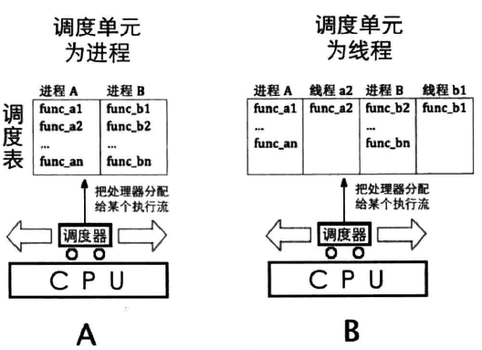  
## 为什么需要执行流
为什么可以直接执行一个程序，却还要搞出进程线程这些不同的概念？
>引入进程的目的是为了更好地使多道程序并发执行，提高资源利用率和系统吞吐量，增加并发程序；\
 引入线程的目的是为了减少程序在并发执行时所付出的时空开销，提高操作系统的并发性能。

现代计算机在被使用时总是非常忙碌的。电脑使用者可能一边要播放音乐，一边聊天，一边使用办公软件。\
然而cpu就只有那么多，那又该如何在有限的硬件资源的基础上实现对于性能的无限的扩展？\
进程线程的诞生便是为了解决这个问题。\
cpu通过调度来保证每一段程序都能得到运行，进而造成一种所有程序在同时执行。但实际上在那一瞬间只有特定的一段指令被执行。单核cpu并不存在真正的并行。
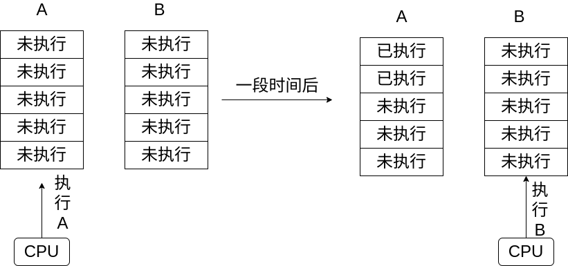  
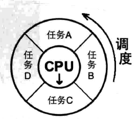  
## 进程与线程的区别
那二者之间又存在什么区别？
>线程是什么?具有能动性、执行力、独立的代码块。\
进程是什么?进程=线程+资源。根据进程内线程的数量,进程可分为。\
(1 )单线程进程:如果厨房中只有一个工作人员,即配菜、炒菜、洗涮厨具等这几样工作都是一个人做,那么厨房的工作效率必然会很低,因为此时厨房中就一个线程。\
(2 )多线程进程 z 厨房人手多了,工作才更高效,因此为配菜、炒菜、洗涮厨具专门配备了 3 个工作人员,也就是说进程内的线程多了。\
——《操作系统真相还原》

进程是在内核线程的基础上实现的。两者间唯一的区别是是否有自己独立的虚拟地址空间。进程有自己的虚拟地址空间。\
  
可以将线程想象为一个流水线，一直在执行。而进程则是一间工厂，虚拟地址空间就是厂房，里面有正在执行的流水线。

## 硬件基础
上文中提到了通过时间片轮转使得cpu能够雨露均沾，执行不同的程序，而不是等待一个程序全部执行完毕后再去执行另一个程序。\
那么便引出以下三个问题:
* 时间由谁来计算？
* 怎样将正在执行中的任务叫停？
* 被切换任务的状态的任务状态由谁来保存？
### 8253
8253为时钟芯片\
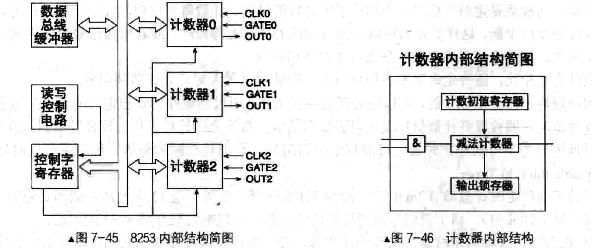  
该芯片通过时钟脉冲来计算时间的流逝。\
当达到人为他设置好的时间后便会发出中断，告诉cpu说：“时间到了，该下一个了。”\
这块芯片是可以通过人为编程来控制的，只需将相应的控制字写入对应的端口中便可完成模式的选择。
### 8259A
8259A为中断控制芯片\
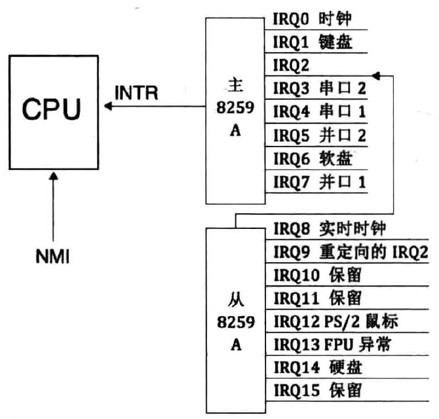
任务的叫停便是通过他来完成。当计时器8253向8259A发出中断说时间到。cpu便会转向这条中断对应的处理程序来执行。\
而在时钟中断的处理程序中会调用调度器相关的函数，从而达到切换执行流的目的。
### TR寄存器与TSS
第三个问题的解决较为复杂，不管是硬件还是软件都有自己的解决方式。在硬件方面，硬件的设计者给出了tss段与tr寄存器来解决。\
tss是一段内存，其中记录了进入中断前的状态。这段内存通过描述符的形式安装在GDT描述符表中。而tr寄存器中则储存了当前任务的描述符的内存地址。\
TSS段中记录了中断发生时任务执行的状态\
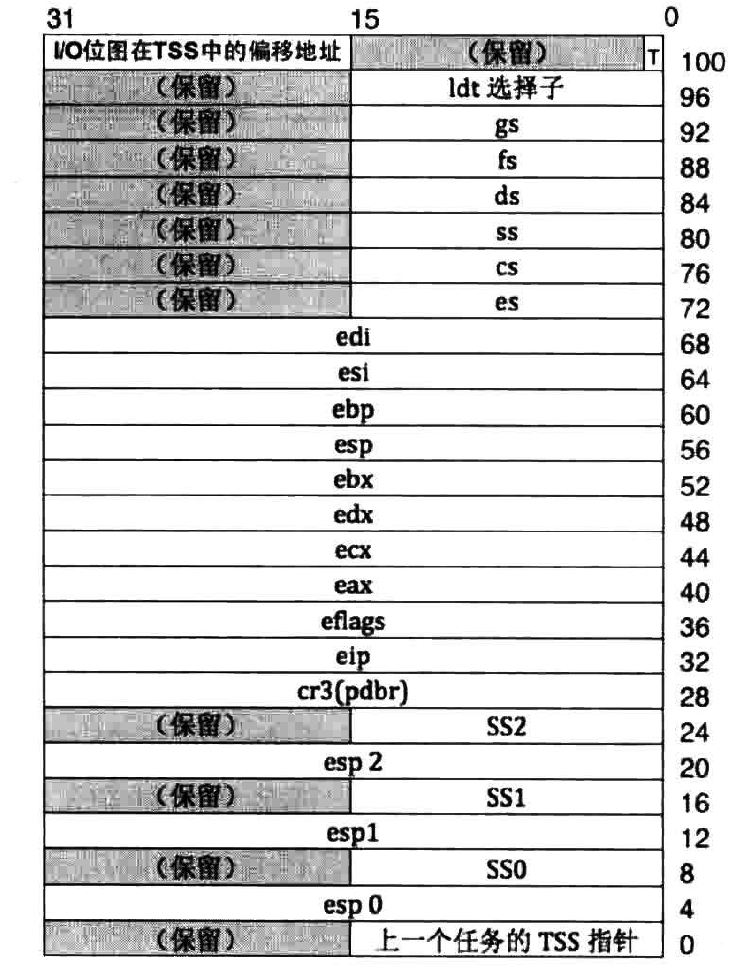  
TR寄存器中存储着当前的任务对应的TSS段：\
  
当任务被嵌套调用时，存在任务调用链。\

## 任务特权级
在tss段中看到了esp0,esp1等的字样。esp寄存器只有一个，那这些esp0都是什么？\
在现代操作系统中引入特权级的概念。电脑中有许多在运行中的程序，如果每个程序都能访问硬件资源，就会在一定程度上引起危机。\
因此为了限制程序的权限让他们不能随意使用硬件资源，所以设计者们将重要程度不同的程序划分了不同的特权等级。\
而在不同的特权级也有自己对应的特权栈。这便是esp0等字样的来历。\
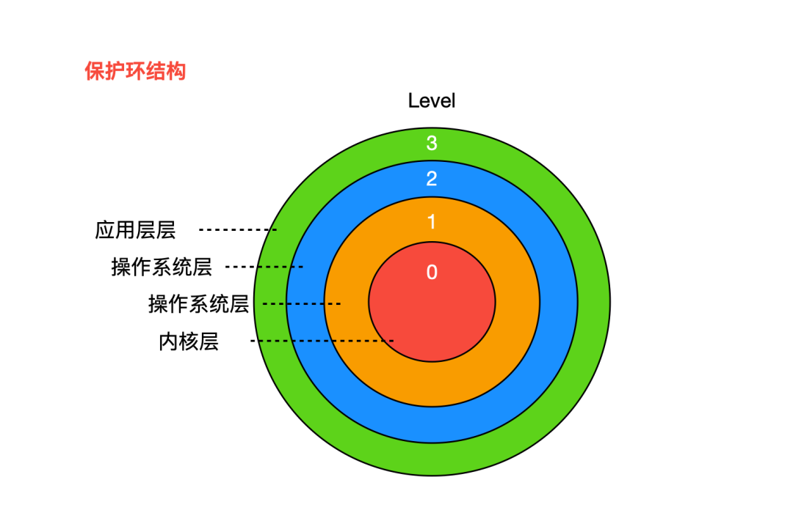  
由于本文只是简单的实现，所以只有0级和3级，分别对应了内核态和用户态。
## 内核线程的实现
### 理论
内核线程的实现概括来说并不难理解,大体过程如图所示\
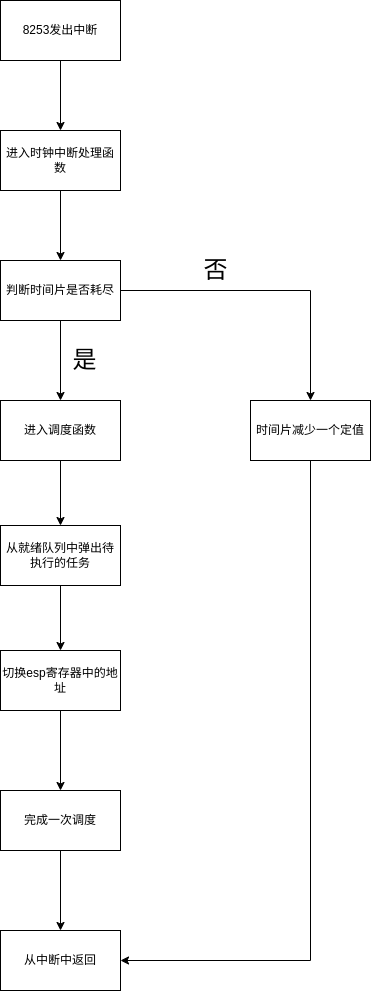
### pcb任务控制块
由上图我们可以看出，线程调度需要在任务队列中找到线程。那么这一操作的依据是什么？\
pcb相当于是线程的身份证，其中记录了线程的相关信息，上图中找到待执行的任务，切换esp中的内容都是根据pcb中存储的信息进行操作的。\
以下为一个简单的pcb结构体示例。在真实的操作系统源码中pcb中包含着更多的内容。
```c
struct task_struct {
  uint32_t* self_kstack;  // 各内核线程都用自己的内核栈
  pid_t pid;//进程号
  enum task_status status;//当前任务状态
  char name[16];
  uint8_t priority;        // 线程优先级
  uint8_t ticks;           // 每次在处理器上执行的时间嘀嗒数
  uint32_t elapsed_ticks;  // 运行时间嘀嗒总数（总运行时间）

  int32_t fd_table[MAX_FILES_OPEN_PER_PROC];  // 文件描述符数组

  struct list_elem general_tag;  // 用于线程在一般的队列(就绪/等待队列)中的结点
  struct list_elem all_list_tag;  // 总队列(所有线程)中的节点

  uint32_t* pgdir;                     // 进程自己页表的虚拟地址
  struct virtual_addr userprog_vaddr;  // 放进程页目录表的虚拟地址
  struct mem_block_desc u_block_desc[DESC_CNT];  // 用户进程内存块描述符
  uint32_t cwd_inode_nr;  // 进程所在的工作目录的inode编号
  int16_t parent_pid;     // 父进程的pid
  int8_t exit_status;     // 进程结束时自己调用exit传入的返回值
  uint32_t stack_magic;   // 栈的边界标记,用于检测栈的溢出
};
```
#### thread_stack线程栈
前文中的三个问题中，最后一个问题是由软件和硬件共同解决的。软件中由内核栈（用于内核空间的交换）和中断栈（用于用户空间之间的交换）来存储被切换前的状态。\
pcb中有指针self_kstack，他指向的内存空间中存储了待切换的esp内容。在切换时只需将指向的地址写入到esp中，便会cpu便会按照栈顶地址返回，进而跳转待切换后函数执行的地址。\
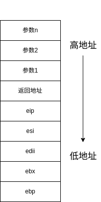
```c
struct thread_stack
{
    //根据ABI的约定，将寄存器压栈保存
    uint32_t ebp;
    uint32_t ebx;
    uint32_t edi;
    uint32_t esi;
    //以下是线程第一次被调度上cpu时需要初始化的信息
    void (*eip)(thread_func* func, void* func_arg);//函数指针，第一次被调度时指向kernel_thread函数，再由kernel_thread函数调用线程执行的目的函数
    void (*unused_retaddr);//用来占位，充当调用kernel_thread的函数的返回地址
    thread_func* function;   // 由Kernel_thread所调用的函数名
    void* func_arg;    // 由Kernel_thread所调用的函数所需的参数
};
```
因为第一次上调度时，并没有任何函数调用kernel_thread，它是直接从栈顶中作为switch的值返回的。为了保持栈中内容的整齐，因此使用unused_retaddr来占位。\
一个正在执行的函数栈中的内容。\
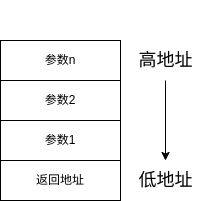

### 多线程环境的初始化
在操作系统刚被载入时便会完成多线程环境的初始化。\
要支持多线程环境，根据上文中的分析首先要初始化中断和定时器两个调度所依赖的基石。\
其次还需要初始化任务队列。其中有一个队列用于记录所有的线程。其余队列用于记录不同状态的线程。\
最后将正在执行的线程初始化为主线程。（此时操作系统中只有这一个线程）
```c
void thread_init(void) {
    put_str("thread_init start\n");
    list_init(&general_list);
    list_init(&all_list);
    lock_init(&lock_pid);
    pid_pool_init();
    /* 先创建第一个用户进程:init */
    process_execute(init, "init");
    /* 将当前 main 函数创建为线程 */
    /* 将当前main函数创建为线程 */
    make_main_thread();
    idle_thread = thread_start("idle", 10, idle, NULL);
    put_str("thread_init done\n");
}
```
### 内核线程初始化
内核线程的初始化比较简单，只需将pcb结构体中的各项内容填入对应的值就好了。
```c
void init_thread(struct task_pcb* pthread, char* name, int prio) {
    memset(pthread, 0, sizeof(*pthread));
    pthread->pid = allocate_pid();
    strcpy(pthread->name, name);

    if (pthread == main_thread) {
        /* 由于把main函数也封装成一个线程,并且它一直是运行的,故将其直接设为TASK_RUNNING
         */
        pthread->status = TASK_RUNNING;
    } else {
        pthread->status = TASK_READY;
    }

    /* self_kstack是线程自己在内核态下使用的栈顶地址 */
    pthread->self_kstack = (uint32_t*)((uint32_t)pthread + PG_SIZE);
    pthread->priority = prio;
    pthread->ticks = prio;
    pthread->elapsed_ticks = 0;
    pthread->pgdir = NULL;
    // 为标准输入标准输出和
    pthread->fd_table[0] = 0;
    pthread->fd_table[1] = 1;
    pthread->fd_table[2] = 2;
    uint8_t fd_idx = 3;
    while (fd_idx < MAX_FILES_OPEN_PER_PROC) {
        pthread->fd_table[fd_idx] = -1;
        fd_idx++;
    }
    pthread->cwd_inode_nr = 0;
    pthread->parent_pid = -1;
    pthread->stack_magic = 0x12345678;  // 自定义的魔数
}

```
## 用户进程的实现
用户进程的实现是基于内核线程的。
### 创建虚拟地址空间
前文中我们将线程比作流水线，将进程比作工厂。实现进程就是要在线程的基础上建房子。\
  
* 分配页目录\
要为进程创建虚拟地址空间地址，首先要为该进程分配一页物理内存作为页目录表。作为用户进程本身是无权对该页目录内容操作更改的，因此页目录的虚拟地址是要在内核虚拟位图中分配的。\
当页目录被分配好后地址被存入pcb中。当该进程上调度时，激活页目录即可。\
* 激活页目录
激活页目录其实就是通过更改寄存器cr3中的内容从而将前一个任务的页目录修改为下一个任务的页目录。
### 任务特权级的转换
如果在系统中只存在内核线程，那么他们的特权级都是0,在切换时并没有涉及到任务特权级的问题。但是当我们开始创建用户线程，问题也随之而来。\
用户进程一般处于3特权级。那么当特权级发生转换时cpu中的硬件如何操作，又由谁来保存之前的状态信息？\
在此我们分为两个部分来讨论。
* 由内核空间向用户空间转换\
  由内核空间向用户空间转换时，cpu并不会自动记录此时内核栈的地址，因此需要操作系统设计者完成tss段的更新。将此时esp寄存器中的地址更新到esp0中。\
  在进入中断返回函数时，cpu会从当前内核栈的顶部读出esp3中储存的进入中断前用户空间的旧的栈信息，并将其写入寄存器esp与ss中。\
  由中断返回时便会跳转到esp3存储的地址执行。
* 由用户空间向内核空间转换\
任务的切换依赖于中断。若前一个被运行的任务为用户进程，由中断进入内核空间时，cpu会先临时保存此时esp和ss的值，记作 SS_old 和 ESP_old。\
在此之后找到tss段中记录的esp0，并将该地址写入到esp寄存器中。同时会将旧栈信息压入新栈（esp0）顶保存。\
这样就回到了存储内核空间执行状态的内核栈。
#### intr_stack中断栈
```c
struct intr_stack
{
    uint32_t vec_no;	 // kernel.S 宏VECTOR中push %1压入的中断号
    uint32_t edi;
    uint32_t esi;
    uint32_t ebp;
    uint32_t esp_dummy;	 // 虽然pushad把esp也压入,但esp是不断变化的,所以会被popad忽略
    uint32_t ebx;
    uint32_t edx;
    uint32_t ecx;
    uint32_t eax;
    uint32_t gs;
    uint32_t fs;
    uint32_t es;
    uint32_t ds;
    uint32_t err_code;		 // err_code会被压入在eip之后
    void (*eip) (void);//指令指针
    uint32_t cs;
    uint32_t eflags;
    void* esp;//特权级更换时需要切换特级栈
    uint32_t ss;
};
```
### init进程
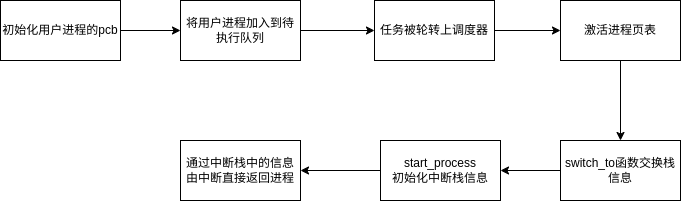\
在系统中，除了init进程是这样被创建出来的。其余的进程都是通过fork init 得到。
### sys_fork
### sys_execv
### sys_wait与sys_exit
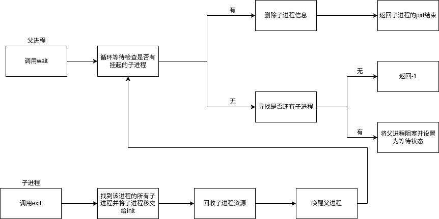
## 用户线程的实现

## 调度器与调度过程