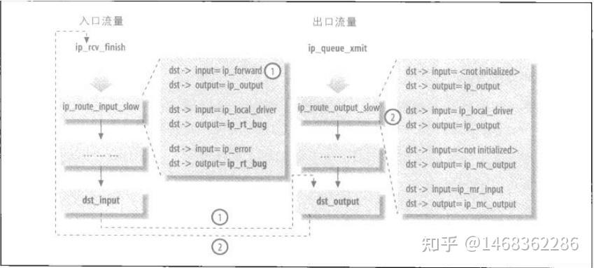

# Netfilter

Netfilter 表​​ 是 Linux 内核中用于实现​防火墙和​网络地址转换的核心机制，它通过一系列规则表和链来控制数据包的流动。这里会用 iptable 命令来进行操作。

## Netfilter 中的表

iptables 使用 table 来组织规则，根据不同的作用，将规则分为不同 table。例如，如果规则是处理网络地址转换的，那会放到 nat table，如果是判断是否允许包继续向前，那可能会放到 filter table。当数据包流经多个表时，会按照优先级进行处理。处理的优先级如下：

​​raw → mangle → nat → filter → security​

**1.filter table：** 

filter table 是最常用的 table 之一，用于判断是否允许一个包通过（放行/拒绝）。这个 table 提供了防火墙 的一些常见功能。

**2.nat table：**

网络地址转换nat table 用于实现网络地址转换规则。当包进入协议栈的时候，这些规则决定是否以及如何修改包的源/目的地址，以改变包被 路由时的行为。nat table 通常用于将包路由到无法直接访问的网络。例如公网 IP 与私网 IP 的转换。

```
Chain PREROUTING (policy ACCEPT 0 packets, 0 bytes)
 pkts bytes target     prot opt in     out     source               destination         
   10   640 DNAT       tcp  --  eth0   *       0.0.0.0/0            203.0.113.1         tcp dpt:80 to:192.168.1.100:80

Chain POSTROUTING (policy ACCEPT 0 packets, 0 bytes)
 pkts bytes target     prot opt in     out     source               destination         
  100  6400 MASQUERADE  all  --  *      eth1    192.168.1.0/24       0.0.0.0/0      
```

第一条用于接收数据时，对于从 eth0 网卡进入的流量，destination=203.0.113.1 即目标为公网 IP 的数据包。按照  to:192.168.1.100:80：DNAT 规则将目标地址改为内网 IP 和端口。

第二条用于发送数据时，对于从 out=eth1：流量从 eth1 网卡发出，source=192.168.1.0/24：即源IP为私网的数据包。自动使用 eth1 的当前公网 IP 做 SNAT（MASQUERADE）标志。

**3.mangle table** 

修改 IP 头，mangle table 用于修改包的 IP 头。例如，可以修改包的 TTL，增加或减少包可以经过的跳数。

这个 table 还可以对包打只在内核内有效的“标记”（internal kernel “mark”），后 续的 table 或工具处理的时候可以用到这些标记。标记不会修改包本身，只是在包的内核 表示上做标记。

**4.raw table** 

raw table用于跟踪网络连接状态 NAT、状态防火墙。

建立在 netfilter 之上的连接跟踪（connection tracking）特性使得 iptables 将包看作已有的连接或会话的一部分，而不是一个由独立、不相关的包组成的流。 数据包到达网络接口之后很快就会有连接跟踪逻辑判断。

raw table 定义的功能非常有限，其唯一目的就是提供一个让包绕过连接跟踪的框架。

**5.security table**
打 SELinux 标记
security table 的作用是给包打上 SELinux 标记，以此影响 SELinux 或其他可以解读 SELinux 安全上下文的系统处理包的行为。这些标记可以基于单个包，也可以基于连接。

### 表中字段的含义**

**pkts：** 匹配该规则的数据包数量，统计有多少个数据包命中这条规则。

**bytes：** 匹配该规则的数据包总字节数，统计命中规则的数据包的总流量大小。

**target：** 规则的目标动作（即 -j 参数指定的动作），定义匹配规则的数据包应该如何处理。

|目标	|含义|
|---|---|
|ACCEPT	|允许数据包通过|
|DROP	|丢弃数据包（无响应）|
|REJECT	|丢弃数据包并返回错误（如 ICMP port-unreachable）|
|DNAT	|目标地址转换（修改目标 IP 和端口）|
|SNAT	|源地址转换（修改源 IP 和端口）|
|MASQUERADE	|动态 SNAT（适用于拨号网络等动态 IP 场景）|
|LOG  |记录日志（通常发送到 syslog）|
|RETURN	|返回上一级链（类似函数 return）|

**prot：** 匹配的协议类型（tcp udp ...）​，限制规则仅对特定协议生效。

**opt：** IP 包选项，匹配 IP 头的特殊标志（如分片、服务类型等）。

|选项	|含义|
|---|---|
|df	|禁止分片（Don't Fragment）|
|!df	|允许分片|
|tos|	|匹配服务类型（TOS）|


**in：** 数据包的输入网络接口（如 eth0），限制规则仅对从特定网卡进入的数据包生效。    

**out：** 数据包的输出网络接口，限制规则仅对从特定网卡出去的数据包生效。

**source：** 源IP，限制规则仅对特定来源的流量生效。

**destination：** 目的IP，限制规则仅对发往特定目标的流量生效。

## 默认的 hook 点与 chain

在每个 table 内部，规则被进一步组织成 chain，内置的 chain 是由内置的 hook 触发 的。chain 基本上能决定（basically determin）规则何时被匹配。

hook点：

* NF_IP_PRE_ROUTING: 接收到的包进入协议栈后立即触发此 hook，在进行任何路由判断之前
* NF_IP_LOCAL_IN: 接收到的包经过路由判断，如果目的是本机，将触发此 hook
* NF_IP_FORWARD: 接收到的包经过路由判断，如果目的是其他机器，将触发此 hook
* NF_IP_LOCAL_OUT: 本机产生的准备发送的包，在进入协议栈后立即触发此 hook
* NF_IP_POST_ROUTING: 本机产生的准备发送的包或者转发的包，在经过路由判断之后， 将触发此 hook

内置的 chain 名字和 netfilter hook 名字是一一对应的：

* PREROUTING: 由 NF_IP_PRE_ROUTING hook 触发
* INPUT: 由 NF_IP_LOCAL_IN hook 触发
* FORWARD: 由 NF_IP_FORWARD hook 触发
* OUTPUT: 由 NF_IP_LOCAL_OUT hook 触发
* POSTROUTING: 由 NF_IP_POST_ROUTING hook 触发


除了默认的链之外，用户也可以自己定义链。

```sh
iptables -N MY_CHAIN  # 创建自定义链
iptables -A INPUT -j MY_CHAIN  # 将流量跳转到自定义链
iptables -A MY_CHAIN -s 192.168.1.100 -j DROP  # 添加规则
```

这里如果将默认的链上的流量跳转到自定义的链上则不需要自己单独写内核模块规定新的 hook 点。如果想要高度定制化的效果则需要自行编写内核模块。

## 触发hook的位置

Netfilter Hook 点被嵌入到内核网络协议栈的关键路径中，通过 NF_HOOK 宏触发。



**(1) NF_IP_PRE_ROUTING**

* 触发位置：在 ip_rcv()（IPv4 接收入口）中调用 nf_hook。
* 作用：在路由决策前处理（如 DNAT、包过滤）。

**(2) NF_IP_LOCAL_IN**

* 触发位置：路由判断目的为本机后，在 ip_local_deliver() 中调用。
* 作用：处理目标为本机的包（如防火墙规则）。

**(3) NF_IP_FORWARD**

* 触发位置：路由判断为转发后，在 ip_forward() 中调用。
* 作用：处理需要转发的包（如 FORWARD 链规则）。

**(4) NF_IP_LOCAL_OUT**

* 触发位置：本机发出的包在 __ip_local_out() 中调用。
  
* 作用：处理本机生成的包（如 OUTPUT 链规则）。

**(5) NF_IP_POST_ROUTING**

* 触发位置：在 ip_output() 或 ip_finish_output() 中调用。

* 作用：处理即将发出的包（如 SNAT、MASQUERADE）。

## Netfilter 的底层实现

### Netfilter 中相关的结构体

**struct nf_hook_ops**

nf_hook_ops 用于定义一个钩子操作。并在其中指定了这个钩子的优先级和属于的协议族等等。

```c
struct nf_hook_ops {
    struct list_head list;       // 链表节点
    nf_hookfn *hook;             // 处理函数
    int priority;                // 优先级
    unsigned int hooknum;        // Hook 点（如 NF_INET_PRE_ROUTING）
    u_int8_t pf;                // 协议族（如 NFPROTO_IPV4）
};
```

**nf_hookfn**

nf_hookfn 是一个函数指针类型，这里用来指向行为链的回调函数

```c
typedef unsigned int nf_hookfn(void *priv,
			       struct sk_buff *skb,
			       const struct nf_hook_state *state);
```

### 注册表的处理函数

#### 分配 nf_hook_ops 结构

nat 表直接使用静态数组进行分配：

```c
static const struct nf_hook_ops nf_nat_ipv4_ops[] = {
	{
		.hook		= ipt_do_table,
		.pf		= NFPROTO_IPV4,
		.hooknum	= NF_INET_PRE_ROUTING,
		.priority	= NF_IP_PRI_NAT_DST,
	},
	{
		.hook		= ipt_do_table,
		.pf		= NFPROTO_IPV4,
		.hooknum	= NF_INET_POST_ROUTING,
		.priority	= NF_IP_PRI_NAT_SRC,
	},
	{
		.hook		= ipt_do_table,
		.pf		= NFPROTO_IPV4,
		.hooknum	= NF_INET_LOCAL_OUT,
		.priority	= NF_IP_PRI_NAT_DST,
	},
	{
		.hook		= ipt_do_table,
		.pf		= NFPROTO_IPV4,
		.hooknum	= NF_INET_LOCAL_IN,
		.priority	= NF_IP_PRI_NAT_SRC,
	},
};
```

其他的表则是通过 xt_hook_ops_alloc 函数对 nf_hook_ops 进行分配：


```c
struct nf_hook_ops *
xt_hook_ops_alloc(const struct xt_table *table, nf_hookfn *fn)
{
	unsigned int hook_mask = table->valid_hooks;
	uint8_t i, num_hooks = hweight32(hook_mask);
	uint8_t hooknum;
	struct nf_hook_ops *ops;

	if (!num_hooks)
		return ERR_PTR(-EINVAL);

	ops = kcalloc(num_hooks, sizeof(*ops), GFP_KERNEL);
	if (ops == NULL)
		return ERR_PTR(-ENOMEM);

	for (i = 0, hooknum = 0; i < num_hooks && hook_mask != 0;
	     hook_mask >>= 1, ++hooknum) {
		if (!(hook_mask & 1))
			continue;
		ops[i].hook     = fn;
		ops[i].pf       = table->af;
		ops[i].hooknum  = hooknum;
		ops[i].priority = table->priority;
		++i;
	}

	return ops;
}
EXPORT_SYMBOL_GPL(xt_hook_ops_alloc);
```

这里指定的处理函数都是 ipt_do_table。

#### 注册

ipt_register_table nf_register_net_hooks nf_register_net_hook
nf_register_net_hook(net, &my_hook_ops);

最终这些 nf_hook_ops 会被记录在一个全局变量

### 执行逻辑

当 NF_HOOK 被触发时，内核遍历该 Hook 点的处理函数链表：

1. 按优先级从高到低（数值从小到大）依次调用。
2. 每个处理函数返回 NF_DROP、NF_ACCEPT、NF_STOLEN 等结果。
3. 若返回 NF_DROP，则终止处理并丢弃包；若 NF_ACCEPT，则继续下一个处理函数。

函数调用链：

NF_HOOK -> nf_hook -> nf_hook_slow -> nf_hook_entry_hookfn -> entry->hook（ipt_do_table）

#### NF_HOOK 

```c
// 定义一个内联函数 NF_HOOK，用于调用 netfilter 钩子
static inline int
NF_HOOK(uint8_t pf, unsigned int hook, struct net *net, struct sock *sk, struct sk_buff *skb,
	struct net_device *in, struct net_device *out,
	int (*okfn)(struct net *, struct sock *, struct sk_buff *))
{
	// 调用 nf_hook 函数，执行指定的 netfilter 钩子
	int ret = nf_hook(pf, hook, net, sk, skb, in, out, okfn);

	// 如果钩子返回值为 1，表示数据包被允许通过，则调用 okfn 函数
	if (ret == 1)
		ret = okfn(net, sk, skb);

	// 返回最终结果
	return ret;
}
```

#### nf_hook

在 nf_hook 这里会检查钩子是否有效。对于有效的钩子函数列表，这里会获取协议的钩子条目，并调用 nf_hook_slow 对钩子进行处理。

```c
static inline int nf_hook(u_int8_t pf, unsigned int hook, struct net *net,
			  struct sock *sk, struct sk_buff *skb,
			  struct net_device *indev, struct net_device *outdev,
			  int (*okfn)(struct net *, struct sock *, struct sk_buff *))
{
	struct nf_hook_entries *hook_head = NULL;
	int ret = 1;

#ifdef CONFIG_JUMP_LABEL
	// 如果协议族和钩子是常量，并且不需要钩子，则直接返回 1
	if (__builtin_constant_p(pf) &&
		__builtin_constant_p(hook) &&
		!static_key_false(&nf_hooks_needed[pf][hook]))
		return 1;
#endif

	rcu_read_lock();
	switch (pf) {
	case NFPROTO_IPV4:
		// 获取 IPv4 协议的钩子条目
		hook_head = rcu_dereference(net->nf.hooks_ipv4[hook]);
		break;
	case NFPROTO_IPV6:
		// 获取 IPv6 协议的钩子条目
		hook_head = rcu_dereference(net->nf.hooks_ipv6[hook]);
		break;
	case NFPROTO_ARP:
#ifdef CONFIG_NETFILTER_FAMILY_ARP
		// 检查 ARP 钩子索引是否超出范围
		if (WARN_ON_ONCE(hook >= ARRAY_SIZE(net->nf.hooks_arp)))
			break;
		// 获取 ARP 协议的钩子条目
		hook_head = rcu_dereference(net->nf.hooks_arp[hook]);
#endif
		break;
	case NFPROTO_BRIDGE:
#ifdef CONFIG_NETFILTER_FAMILY_BRIDGE
		// 获取桥接协议的钩子条目
		hook_head = rcu_dereference(net->nf.hooks_bridge[hook]);
#endif
		break;
	default:
		// 未知协议族，发出警告
		WARN_ON_ONCE(1);
		break;
	}

	if (hook_head) {
		struct nf_hook_state state;

		// 初始化钩子状态
		nf_hook_state_init(&state, hook, pf, indev, outdev,
				   sk, net, okfn);

		// 调用慢路径钩子处理函数
		ret = nf_hook_slow(skb, &state, hook_head, 0);
	}
	rcu_read_unlock();

	return ret;
}
```
#### nf_hook_slow

在 nf_hook_slow 中会按照表的优先级依次注册的钩子函数。

每个钩子函数返回一个判决（verdict），通过 verdict & NF_VERDICT_MASK 提取判决类型。根据判决类型，代码会采取不同的操作：

* NF_ACCEPT：继续执行下一个钩子。
* NF_DROP：丢弃数据包并返回错误。
* NF_QUEUE：将数据包放入队列，等待用户空间处理。
* NF_STOLEN：数据包被“偷走”，不再继续处理。
* 其他未知判决：发出警告并返回。

```c
int nf_hook_slow(struct sk_buff *skb, struct nf_hook_state *state,
		 const struct nf_hook_entries *e, unsigned int s)
{
	unsigned int verdict;
	int ret;

	// 遍历钩子条目，从索引 s 开始
	for (; s < e->num_hook_entries; s++) {
		// 调用钩子函数，获取判决结果
		verdict = nf_hook_entry_hookfn(&e->hooks[s], skb, state);
		switch (verdict & NF_VERDICT_MASK) {
		case NF_ACCEPT:
			// 如果判决为接受，继续下一个钩子
			break;
		case NF_DROP:
			// 如果判决为丢弃，释放 skb 并返回错误码
			kfree_skb_reason(skb,
					 SKB_DROP_REASON_NETFILTER_DROP);
			ret = NF_DROP_GETERR(verdict);
			if (ret == 0)
				ret = -EPERM;
			return ret;
		case NF_QUEUE:
			// 如果判决为队列，调用 nf_queue 处理
			ret = nf_queue(skb, state, s, verdict);
			if (ret == 1)
				continue; // 继续处理下一个钩子
			return ret;
		case NF_STOLEN:
			// 如果判决为偷取，返回错误码
			return NF_DROP_GETERR(verdict);
		default:
			// 如果判决为未知，发出警告并返回 0
			WARN_ON_ONCE(1);
			return 0;
		}
	}

	// 所有钩子处理完成，返回 1 表示 okfn() 需要被调用
	return 1;
}
```

#### ipt_do_table。

最终的处理函数为 ipt_do_table 。在 ipt_do_table 中会对行为链进行规则的匹配即对 target 的配置进行匹配。

这里对 target 的处理分为两类。

**标准目标**

这里标准目标包含等等 ACCEPT、DROP、RETURN。其 target 字段为 NULL（即 t->u.kernel.target->target == NULL）。

在这里 verdict 是负数，表示这是预定义的判决。

|verdict 值|	宏定义|	含义|
|---|---|---|
|-NF_ACCEPT - 1|	XT_RETURN|	从自定义链返回到调用链（类似函数返回）。|
|-NF_DROP - 1|	XT_DROP|	丢弃数据包。|
|-NF_QUEUE - 1|	XT_QUEUE|	将数据包发送到用户空间（配合 libnetfilter_queue）。|
|-NF_STOLEN - 1|	XT_STOLEN|	告知内核“偷取”数据包（由 Target 接管，协议栈不再处理）。|
|-NF_REPEAT - 1|	XT_REPEAT|	重新执行当前钩子函数（极少使用）。|

如果 verdict 为正数，则表示跳转到规则表中的另一个规则。这里利用这一点来实现自定义链。

**扩展目标**

扩展目标包含DNAT、SNAT、LOG等等。对于扩展目标需要自己实现规则的处理函数。

verdict = t->u.kernel.target->target(skb, &acpar);

```c
unsigned int
ipt_do_table(void *priv,
		 struct sk_buff *skb,
		 const struct nf_hook_state *state)
{
	const struct xt_table *table = priv;
	unsigned int hook = state->hook;
	static const char nulldevname[IFNAMSIZ] __attribute__((aligned(sizeof(long))));
	const struct iphdr *ip;
	/* 初始化 verdict 为 NF_DROP 以满足 gcc 的要求。 */
	unsigned int verdict = NF_DROP;
	const char *indev, *outdev;
	const void *table_base;
	struct ipt_entry *e, **jumpstack;
	unsigned int stackidx, cpu;
	const struct xt_table_info *private;
	struct xt_action_param acpar;
	unsigned int addend;

	/* 初始化 */
	stackidx = 0;
	ip = ip_hdr(skb);
	indev = state->in ? state->in->name : nulldevname;
	outdev = state->out ? state->out->name : nulldevname;
	/* 我们通过将第一个片段视为普通数据包来处理片段。
	 * 所有其他片段将被正常处理，但它们永远不会匹配
	 * 我们无法确定的规则，例如 TCP SYN 标志或端口。
	 * 如果规则是片段特定规则，非片段将无法匹配。 */
	acpar.fragoff = ntohs(ip->frag_off) & IP_OFFSET;
	acpar.thoff   = ip_hdrlen(skb);
	acpar.hotdrop = false;
	acpar.state   = state;

	WARN_ON(!(table->valid_hooks & (1 << hook)));
	local_bh_disable();
	addend = xt_write_recseq_begin();
	private = READ_ONCE(table->private); /* 地址依赖性。 */
	cpu        = smp_processor_id();
	table_base = private->entries;
	jumpstack  = (struct ipt_entry **)private->jumpstack[cpu];

	/* 如果通过 TEE 调用，则切换到备用 jumpstack。
	 * TEE 在原始 skb 上发出 XT_CONTINUE 判决，因此我们不能覆盖 jumpstack。
	 *
	 * 对于通过 REJECT 或 SYNPROXY 的递归，堆栈将被覆盖，
	 * 但这不是问题，因为这些会发出绝对判决。 */
	if (static_key_false(&xt_tee_enabled))
		jumpstack += private->stacksize * __this_cpu_read(nf_skb_duplicated);

	e = get_entry(table_base, private->hook_entry[hook]);

	do {
		const struct xt_entry_target *t;
		const struct xt_entry_match *ematch;
		struct xt_counters *counter;

		WARN_ON(!e);
		if (!ip_packet_match(ip, indev, outdev,
			&e->ip, acpar.fragoff)) {
 no_match:
			e = ipt_next_entry(e);
			continue;
		}

		xt_ematch_foreach(ematch, e) {
			acpar.match     = ematch->u.kernel.match;
			acpar.matchinfo = ematch->data;
			if (!acpar.match->match(skb, &acpar))
				goto no_match;
		}

		counter = xt_get_this_cpu_counter(&e->counters);
		ADD_COUNTER(*counter, skb->len, 1);

		t = ipt_get_target_c(e);
		WARN_ON(!t->u.kernel.target);

#if IS_ENABLED(CONFIG_NETFILTER_XT_TARGET_TRACE)
		/* 数据包被跟踪：记录日志 */
		if (unlikely(skb->nf_trace))
			trace_packet(state->net, skb, hook, state->in,
					 state->out, table->name, private, e);
#endif
		/* 标准目标？没有注册target回调函数的是标准目标 */
		if (!t->u.kernel.target->target) {
			int v;

			v = ((struct xt_standard_target *)t)->verdict;
			if (v < 0) {
				/* 从堆栈弹出？ */
				if (v != XT_RETURN) {
					verdict = (unsigned int)(-v) - 1;
					break;
				}
				if (stackidx == 0) {
					e = get_entry(table_base,
						private->underflow[hook]);
				} else {
					e = jumpstack[--stackidx];
					e = ipt_next_entry(e);
				}
				continue;
			}
			if (table_base + v != ipt_next_entry(e) &&
				!(e->ip.flags & IPT_F_GOTO)) {
				if (unlikely(stackidx >= private->stacksize)) {
					verdict = NF_DROP;
					break;
				}
				jumpstack[stackidx++] = e;
			}

			e = get_entry(table_base, v);
			continue;
		}

		acpar.target   = t->u.kernel.target;
		acpar.targinfo = t->data;

		verdict = t->u.kernel.target->target(skb, &acpar);
		if (verdict == XT_CONTINUE) {
			/* 目标可能已更改内容。 */
			ip = ip_hdr(skb);
			e = ipt_next_entry(e);
		} else {
			/* 判决 */
			break;
		}
	} while (!acpar.hotdrop);

	xt_write_recseq_end(addend);
	local_bh_enable();

	if (acpar.hotdrop)
		return NF_DROP;
	else return verdict;
}
```

## target

### 与target相关的结构体

struct xt_target 用于定义和管理 ​​iptables/nftables 规则中的 target。通过函数指针指定如何处理匹配规则的数据包。内核通过该结构体将目标扩展注为钩子，供 iptables/nftables 调用。

```c
struct xt_target {
	struct list_head list;

	// 扩展名称
	const char name[XT_EXTENSION_MAXNAMELEN];
	// 修订版本号
	u_int8_t revision;

	/* 返回判决结果。参数顺序自 2.6.9 起发生变化，
	   因为现在必须处理非线性 skbs，使用 skb_copy_bits 和 skb_ip_make_writable。 */
	unsigned int (*target)(struct sk_buff *skb,
				   const struct xt_action_param *);
	/* 当用户尝试插入此类型的条目时调用：
	   hook_mask 是可以调用的钩子的位掩码。 */
	/* 成功时返回 0，否则返回错误代码 (-Exxxx)。 */
	int (*checkentry)(const struct xt_tgchk_param *);
	// 当此类型的条目被删除时调用。
	void (*destroy)(const struct xt_tgdtor_param *);
#ifdef CONFIG_NETFILTER_XTABLES_COMPAT
	/* 当用户空间对齐与内核空间对齐不同时调用 */
	void (*compat_from_user)(void *dst, const void *src);
	int (*compat_to_user)(void __user *dst, const void *src);
#endif
	/* 如果是模块，请将此设置为 THIS_MODULE，否则为 NULL */
	struct module *me;
	// 表名
	const char *table;
	// 目标扩展的大小
	unsigned int targetsize;
	// 用户空间数据的大小
	unsigned int usersize;
#ifdef CONFIG_NETFILTER_XTABLES_COMPAT
	// 兼容模式下的大小
	unsigned int compatsize;
#endif
	// 可用的钩子
	unsigned int hooks;
	// 协议
	unsigned short proto;
	// 地址/协议族
	unsigned short family;
};
```

struct xt_entry_target - 表示netfilter框架中的目标条目结构

此结构用于定义netfilter规则中的目标信息。它包含用户空间和内核空间用的不同字段，以及目标数据的存储。

```c
struct xt_entry_target {
	union {
		struct {
			__u16 target_size;//目标结构的大小。

			/* Used by userspace */
			char name[XT_EXTENSION_MAXNAMELEN];//目标结构的名称
			__u8 revision;//目标的修订版本。
		} user;//对于用户态
		struct {
			__u16 target_size;//目标结构的大小。

			/* Used inside the kernel */
			struct xt_target *target;//指向内核中目标的指针。
		} kernel;

		/* Total length */
		__u16 target_size;
	} u;

	unsigned char data[0];
};
```

xt_standard_target继承自 xt_entry_target ，在此基础上增加了 verdict 通常用于定义标准目标。

```c
struct xt_standard_target {
	struct xt_entry_target target;
	int verdict;
};
```

### 定义标准的目标结构

下面这段代码用于定义 iptable 中的标准目标

```c
/* 标准条目结构体 */
struct ipt_standard {
	struct ipt_entry entry; // IP 表条目
	struct xt_standard_target target; // 标准目标
};

/* 错误条目结构体 */
struct ipt_error {
	struct ipt_entry entry; // IP 表条目
	struct xt_error_target target; // 错误目标
};

/* 初始化 IP 表条目宏 */
#define IPT_ENTRY_INIT(__size)						       \
{									       \
	.target_offset	= sizeof(struct ipt_entry),			       /* 目标偏移量 */ \
	.next_offset	= (__size),					       /* 下一个条目的偏移量 */ \
}

/* 初始化标准条目宏 */
#define IPT_STANDARD_INIT(__verdict)					       \
{									       \
	.entry		= IPT_ENTRY_INIT(sizeof(struct ipt_standard)),	       /* 初始化条目 */ \
	.target		= XT_TARGET_INIT(XT_STANDARD_TARGET,		       /* 初始化标准目标 */ \
					 sizeof(struct xt_standard_target)),   \
	.target.verdict	= -(__verdict) - 1,				       /* 设置判决值 */ \
}

/* 初始化错误条目宏 */
#define IPT_ERROR_INIT							       \
{									       \
	.entry		= IPT_ENTRY_INIT(sizeof(struct ipt_error)),	       /* 初始化条目 */ \
	.target		= XT_TARGET_INIT(XT_ERROR_TARGET,		       /* 初始化错误目标 */ \
					 sizeof(struct xt_error_target)),      \
	.target.errorname = "ERROR",					       /* 设置错误名称 */ \
}
```

### 注册扩展 

xt_register_targets -> xt_register_target

以 NAT 为例，在 xt_nat_target_reg 结构中会注册对于 NAT 的处理函数

```c

static struct xt_target xt_nat_target_reg[] __read_mostly = {
	{
		.name		= "SNAT",
		.revision	= 0,
		.checkentry	= xt_nat_checkentry_v0,
		.destroy	= xt_nat_destroy,
		.target		= xt_snat_target_v0,
		.targetsize	= sizeof(struct nf_nat_ipv4_multi_range_compat),
		.family		= NFPROTO_IPV4,
		.table		= "nat",
		.hooks		= (1 << NF_INET_POST_ROUTING) |
				  (1 << NF_INET_LOCAL_IN),
		.me		= THIS_MODULE,
	},
	{
		.name		= "DNAT",
		.revision	= 0,
		.checkentry	= xt_nat_checkentry_v0,
		.destroy	= xt_nat_destroy,
		.target		= xt_dnat_target_v0,
		.targetsize	= sizeof(struct nf_nat_ipv4_multi_range_compat),
		.family		= NFPROTO_IPV4,
		.table		= "nat",
		.hooks		= (1 << NF_INET_PRE_ROUTING) |
				  (1 << NF_INET_LOCAL_OUT),
		.me		= THIS_MODULE,
	},
	{
		.name		= "SNAT",
		.revision	= 1,
		.checkentry	= xt_nat_checkentry,
		.destroy	= xt_nat_destroy,
		.target		= xt_snat_target_v1,
		.targetsize	= sizeof(struct nf_nat_range),
		.table		= "nat",
		.hooks		= (1 << NF_INET_POST_ROUTING) |
				  (1 << NF_INET_LOCAL_IN),
		.me		= THIS_MODULE,
	},
	{
		.name		= "DNAT",
		.revision	= 1,
		.checkentry	= xt_nat_checkentry,
		.destroy	= xt_nat_destroy,
		.target		= xt_dnat_target_v1,
		.targetsize	= sizeof(struct nf_nat_range),
		.table		= "nat",
		.hooks		= (1 << NF_INET_PRE_ROUTING) |
				  (1 << NF_INET_LOCAL_OUT),
		.me		= THIS_MODULE,
	},
	{
		.name		= "SNAT",
		.revision	= 2,
		.checkentry	= xt_nat_checkentry,
		.destroy	= xt_nat_destroy,
		.target		= xt_snat_target_v2,
		.targetsize	= sizeof(struct nf_nat_range2),
		.table		= "nat",
		.hooks		= (1 << NF_INET_POST_ROUTING) |
				  (1 << NF_INET_LOCAL_IN),
		.me		= THIS_MODULE,
	},
	{
		.name		= "DNAT",
		.revision	= 2,
		.checkentry	= xt_nat_checkentry,
		.destroy	= xt_nat_destroy,
		.target		= xt_dnat_target_v2,
		.targetsize	= sizeof(struct nf_nat_range2),
		.table		= "nat",
		.hooks		= (1 << NF_INET_PRE_ROUTING) |
				  (1 << NF_INET_LOCAL_OUT),
		.me		= THIS_MODULE,
	},
};
```