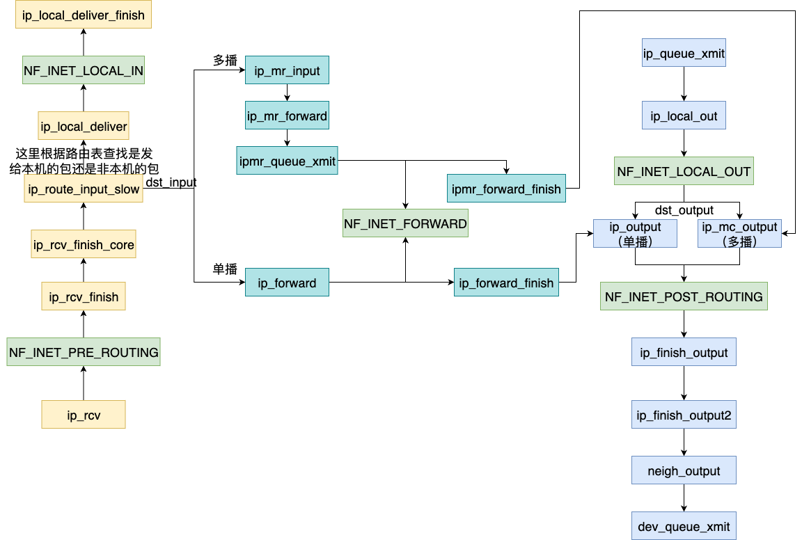
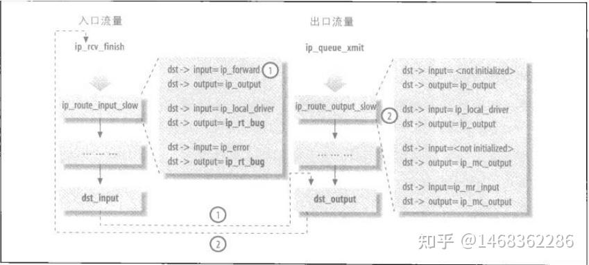

# ip 层收包流程



## 进入ip层的路径

当一个网卡上收到包后，会触发一个中断进行处理。这里硬件中断不足以完成完整的收包流程。因此再将网卡上的包转移到内存中之后就会进入到软中断进行处理。

在对网络包的处理中软中断的入口函数为 net_rx_action。在这里有两类入口的方法。

对于单个的 sk_buff 来说最终进入 ip 层的函数是 ip_rcv。

```c
net_rx_action napi_poll __napi_poll n->poll process_backlog __netif_receive_skb  __netif_receive_skb_one_core ip_rcv 
```

对于 sk_buff 链表来说最终进入ip层的函数是 ip_list_rcv。

```c
net_rx_action napi_poll __napi_poll gro_normal_list netif_receive_skb_list_internal __netif_receive_skb_list __netif_receive_skb_list_core __netif_receive_skb_list_ptype ip_list_rcv 
```

|特性​​ |ip_rcv |ip_list_rcv|
|---|---|---|
​|​调用入口​​ |netif_receive_skb()|netif_receive_skb_list()
|​处理单位​​|单个 sk_buff|sk_buff链表
|​性能优化​​|逐包处理|批量处理，减少上下文切换
|​典型使用者​​|普通驱动（如虚拟网卡）|高性能驱动（如 Intel igb/ixgbe）
|​Netfilter 钩子​​|完整执行|可能合并钩子执行（依赖实现）
|​适用流量​​|所有 IPv4 数据包|高吞吐量流量（如视频流、存储同步）

## ip_rcv

ip_rcv 为 ip 层的入口函数。

```c
int ip_rcv(struct sk_buff *skb, struct net_device *dev, struct packet_type *pt,
	   struct net_device *orig_dev)
{
	struct net *net = dev_net(dev);

	skb = ip_rcv_core(skb, net);
	if (skb == NULL)
		return NET_RX_DROP;

	return NF_HOOK(NFPROTO_IPV4, NF_INET_PRE_ROUTING,
		       net, NULL, skb, dev, NULL,
		       ip_rcv_finish);
}
```

在这里首先会调用函数 ip_rcv_core 进行一个对数据包进行预处理。这里主要进行以下内容。

**​​1.数据包合法性检查​​**

​​检查项​​|失败动作​​|​统计指标​​|
|---|---|---|
|目标地址是否为本机 (PACKET_OTHERHOST)|立即丢弃|dev_core_stats_rx_otherhost_dropped_inc
|IP 头长度是否合法 (ihl < 5)|标记为头部错误 (inhdr_error)|IPSTATS_MIB_INHDRERRORS
|IP 版本是否为 IPv4 (version != 4)|同上|同上|
|校验和是否正确 (ip_fast_csum)|标记为校验和错误 (csum_error)|IPSTATS_MIB_CSUMERRORS
|数据包长度是否匹配 (skb->len < len)|丢弃（包过小）|IPSTATS_MIB_INTRUNCATEDPKTS

​​**2.数据包预处理​​**

​​共享检查​​ (skb_share_check)确保 skb未被其他路径修改，必要时克隆一个新副本

​​长度修正​​ (pskb_trim_rcsum)移除可能的填充数据，确保 skb->len == iph->tot_len

​​传输层头定位​​设置 skb->transport_header = network_header + ihl*4

​​控制块清理​​重置 IPCB(skb)中的临时数据（如输入接口索引 iif）

**3.统计信息更新​​**

​​基础统计​​IPSTATS_MIB_IN（接收字节数）、IPSTATS_MIB_NOECTPKTS（非ECN包计数）

​​错误统计​​CSUMERRORS（校验和错误）、INHDRERRORS（头部错误）等

处理完后先会调用 Netfilter 框架对 NF_INET_PRE_ROUTING 事件进行处理。并在处理完成后调用后续的 ip_rcv_finish 函数。

## ip_rcv_finish 

在 ip_rcv_finish 函数中核心的函数为 ip_rcv_finish_core 函数。在这里会对路由表的进行查询，并决定下一步数据包的流向。

```c
static int ip_rcv_finish(struct net *net, struct sock *sk, struct sk_buff *skb)
{
	struct net_device *dev = skb->dev;
	int ret;

	/* if ingress device is enslaved to an L3 master device pass the
	 * skb to its handler for processing
	 */
	skb = l3mdev_ip_rcv(skb);
	if (!skb)
		return NET_RX_SUCCESS;

	ret = ip_rcv_finish_core(net, skb, dev, NULL);
	if (ret != NET_RX_DROP)
		ret = dst_input(skb);
	return ret;
}
```

在 ip_rcv_finish_core 函数中，主要进行了路由表的查询，并对查询后得到的结果进行解析和处理。
 
### 路由查询

这里的路由查询有使用路由提示进行查询和慢查询两种.

#### 使用路由提示快速查询

```c
if (ip_can_use_hint(skb, iph, hint)) {
    drop_reason = ip_route_use_hint(skb, iph->daddr, iph->saddr,
                    ip4h_dscp(iph), dev, hint);
    if (unlikely(drop_reason))
        goto drop_error;
}
```
在该函数中会直接获取前一个数据包的路由结构用于下一个数据包的路由结构。

这一功能只有对通过 ip_list_rcv 函数进入 IP 层的数据包有用。对于单个的数据包，和链表的第一个包无法使用这个机制。

#### 完整路由表查询（主路径）

if (!skb_valid_dst(skb)) {
    drop_reason = ip_route_input_noref(skb, iph->daddr, iph->saddr,
                       ip4h_dscp(iph), dev);
    if (unlikely(drop_reason))
        goto drop_error;
}

核心函数：ip_route_input_noref  

这是 IPv4 路由子系统的主入口，会依次查询：

  1. 路由缓存（fib_table 的快速路径）
  2. FIB（Forwarding Information Base）：完整路由表查找
  3. 策略路由（如配置了 ip rule 规则）

函数调用流程：

ip_rcv_finish_core --> ip_route_input_noref --> ip_route_input_rcu --> ip_route_input_slow

在 ip_route_input_slow 首先会调用 fib_lookup 在路由表中查询数据包最终要去往的目的地。然后根据 fib_lookup 返回的结果跳转到对应的处理分支去。

```c
/* 慢速路由查找函数，处理输入数据包的路由 */
static enum skb_drop_reason
ip_route_input_slow(struct sk_buff *skb, __be32 daddr, __be32 saddr,
		    dscp_t dscp, struct net_device *dev,
		    struct fib_result *res)
{
	/* 初始化默认的丢弃原因 */
	enum skb_drop_reason reason = SKB_DROP_REASON_NOT_SPECIFIED;
	/* 获取网络设备的IPv4配置 */
	struct in_device *in_dev = __in_dev_get_rcu(dev);
	/* 流键（用于路由决策） */
	struct flow_keys *flkeys = NULL, _flkeys;
	/* 获取网络命名空间 */
	struct net    *net = dev_net(dev);
	/* 隧道信息 */
	struct ip_tunnel_info *tun_info;
	int		err = -EINVAL;
	unsigned int	flags = 0;
	u32		itag = 0;
	struct rtable	*rth;
	/* 路由查找的流信息 */
	struct flowi4	fl4;
	bool do_cache = true;

	/* 检查设备是否启用了IP */
	if (!in_dev)
		goto out;

	/* 检查最奇怪的非正常数据包（这些可能无法通过fib_lookup检测到） */
	tun_info = skb_tunnel_info(skb);
	if (tun_info && !(tun_info->mode & IP_TUNNEL_INFO_TX))
		fl4.flowi4_tun_key.tun_id = tun_info->key.tun_id;
	else
		fl4.flowi4_tun_key.tun_id = 0;
	skb_dst_drop(skb);

	/* 检查源地址是否为多播或有限广播 */
	if (ipv4_is_multicast(saddr) || ipv4_is_lbcast(saddr)) {
		reason = SKB_DROP_REASON_IP_INVALID_SOURCE;
		goto martian_source;
	}

	res->fi = NULL;
	res->table = NULL;
	/* 检查目标地址是否为有限广播或全零地址 */
	if (ipv4_is_lbcast(daddr) || (saddr == 0 && daddr == 0))
		goto brd_input;

	/* 检查源地址是否为全零地址 */
	if (ipv4_is_zeronet(saddr)) {
		reason = SKB_DROP_REASON_IP_INVALID_SOURCE;
		goto martian_source;
	}

	/* 检查目标地址是否为全零地址 */
	if (ipv4_is_zeronet(daddr)) {
		reason = SKB_DROP_REASON_IP_INVALID_DEST;
		goto martian_destination;
	}

	/* 检查环回地址的路由规则 */
	if (ipv4_is_loopback(daddr)) {
		if (!IN_DEV_NET_ROUTE_LOCALNET(in_dev, net)) {
			reason = SKB_DROP_REASON_IP_LOCALNET;
			goto martian_destination;
		}
	} else if (ipv4_is_loopback(saddr)) {
		if (!IN_DEV_NET_ROUTE_LOCALNET(in_dev, net)) {
			reason = SKB_DROP_REASON_IP_LOCALNET;
			goto martian_source;
		}
	}

	/* 准备路由查找的流信息 */
	fl4.flowi4_l3mdev = 0;
	fl4.flowi4_oif = 0;
	fl4.flowi4_iif = dev->ifindex;
	fl4.flowi4_mark = skb->mark;
	fl4.flowi4_tos = inet_dscp_to_dsfield(dscp);
	fl4.flowi4_scope = RT_SCOPE_UNIVERSE;
	fl4.flowi4_flags = 0;
	fl4.daddr = daddr;
	fl4.saddr = saddr;
	fl4.flowi4_uid = sock_net_uid(net, NULL);
	fl4.flowi4_multipath_hash = 0;

	/* 尝试进行流解析 */
	if (fib4_rules_early_flow_dissect(net, skb, &fl4, &_flkeys)) {
		flkeys = &_flkeys;
	} else {
		fl4.flowi4_proto = 0;
		fl4.fl4_sport = 0;
		fl4.fl4_dport = 0;
	}

	/* 执行FIB（转发信息库）查找 */
	err = fib_lookup(net, &fl4, res, 0);
	if (err != 0) {
		if (!IN_DEV_FORWARD(in_dev))
			err = -EHOSTUNREACH;
		goto no_route;
	}

	/* 处理广播路由 */
	if (res->type == RTN_BROADCAST) {
		if (IN_DEV_BFORWARD(in_dev))
			goto make_route;
		/* 如果启用了广播转发，则不缓存 */
		if (IPV4_DEVCONF_ALL_RO(net, BC_FORWARDING))
			do_cache = false;
		goto brd_input;
	}

	err = -EINVAL;
	/* 处理本地路由 */
	if (res->type == RTN_LOCAL) {
		reason = fib_validate_source_reason(skb, saddr, daddr, dscp,
						    0, dev, in_dev, &itag);
		if (reason)
			goto martian_source;
		goto local_input;
	}

	/* 检查设备是否支持转发 */
	if (!IN_DEV_FORWARD(in_dev)) {
		err = -EHOSTUNREACH;
		goto no_route;
	}
	/* 检查是否为单播路由 */
	if (res->type != RTN_UNICAST) {
		reason = SKB_DROP_REASON_IP_INVALID_DEST;
		goto martian_destination;
	}

make_route:
	/* 创建路由 */
	reason = ip_mkroute_input(skb, res, in_dev, daddr, saddr, dscp,
				  flkeys);

out:
	return reason;

brd_input:
	/* 处理广播输入 */
	if (skb->protocol != htons(ETH_P_IP)) {
		reason = SKB_DROP_REASON_INVALID_PROTO;
		goto out;
	}

	if (!ipv4_is_zeronet(saddr)) {
		reason = fib_validate_source_reason(skb, saddr, 0, dscp, 0,
						    dev, in_dev, &itag);
		if (reason)
			goto martian_source;
	}
	flags |= RTCF_BROADCAST;
	res->type = RTN_BROADCAST;
	RT_CACHE_STAT_INC(in_brd);

local_input:
	/* 处理本地输入 */
	if (IN_DEV_ORCONF(in_dev, NOPOLICY))
		IPCB(skb)->flags |= IPSKB_NOPOLICY;

	do_cache &= res->fi && !itag;
	if (do_cache) {
		/* 尝试使用缓存路由 */
		struct fib_nh_common *nhc = FIB_RES_NHC(*res);

		rth = rcu_dereference(nhc->nhc_rth_input);
		if (rt_cache_valid(rth)) {
			skb_dst_set_noref(skb, &rth->dst);
			reason = SKB_NOT_DROPPED_YET;
			goto out;
		}
	}

	/* 分配路由缓存项 */
	rth = rt_dst_alloc(ip_rt_get_dev(net, res),
			   flags | RTCF_LOCAL, res->type, false);
	if (!rth)
		goto e_nobufs;

	rth->dst.output= ip_rt_bug;
#ifdef CONFIG_IP_ROUTE_CLASSID
	rth->dst.tclassid = itag;
#endif
	rth->rt_is_input = 1;

	RT_CACHE_STAT_INC(in_slow_tot);
	/* 处理不可达路由 */
	if (res->type == RTN_UNREACHABLE) {
		rth->dst.input= ip_error;
		rth->dst.error= -err;
		rth->rt_flags	&= ~RTCF_LOCAL;
	}

	if (do_cache) {
		/* 缓存路由 */
		struct fib_nh_common *nhc = FIB_RES_NHC(*res);

		rth->dst.lwtstate = lwtstate_get(nhc->nhc_lwtstate);
		if (lwtunnel_input_redirect(rth->dst.lwtstate)) {
			WARN_ON(rth->dst.input == lwtunnel_input);
			rth->dst.lwtstate->orig_input = rth->dst.input;
			rth->dst.input = lwtunnel_input;
		}

		if (unlikely(!rt_cache_route(nhc, rth)))
			rt_add_uncached_list(rth);
	}
	skb_dst_set(skb, &rth->dst);
	reason = SKB_NOT_DROPPED_YET;
	goto out;

no_route:
	/* 处理无路由情况 */
	RT_CACHE_STAT_INC(in_no_route);
	res->type = RTN_UNREACHABLE;
	res->fi = NULL;
	res->table = NULL;
	goto local_input;

martian_destination:
	/* 处理异常目标地址 */
	RT_CACHE_STAT_INC(in_martian_dst);
#ifdef CONFIG_IP_ROUTE_VERBOSE
	if (IN_DEV_LOG_MARTIANS(in_dev))
		net_warn_ratelimited("martian destination %pI4 from %pI4, dev %s\n",
				     &daddr, &saddr, dev->name);
#endif
	goto out;

e_nobufs:
	/* 处理内存不足情况 */
	reason = SKB_DROP_REASON_NOMEM;
	goto out;

martian_source:
	/* 处理异常源地址 */
	ip_handle_martian_source(dev, in_dev, skb, daddr, saddr);
	goto out;
}
```

这里的数据包类型可以分为三种：发往本地的数据包、转发一个单播包、转发一个多播包。

不同的包类型会注册不同的 input 和 output 的函数。

static inline int dst_input(struct sk_buff *skb)
{
	return INDIRECT_CALL_INET(skb_dst(skb)->input,
				  ip6_input, ip_local_deliver, skb);
}

dst->input指向的函数列表如下：

|函数|	描述|
|---|---|
|ip_local_deliver|	向本地传递的封包|
|ip_forward|	转发一个单播封包|
|ip_mr_input|	转发一个多播封包|
|ip_error|	处理一个不可达目的|
|dst_discard_in|	简单丢弃任何输入封包|

dst->input指向的函数列表如下：

|函数	|描述|
|---|---|
|ip_output	|包含ip_finish_output的包裹函数|
|ip_mc_output	|处理带有多播地址的出口封包|
|ip_rt_error	|打印一个告警信息|
|dst_discard_out	|简单丢弃任何输入封包|



## 对不同路径的包的处理

### 发往本机

对发往本机的包，会调用 ip_local_deliver 进行处理。

在 ip_local_deliver 中会判断在IP层是否有分片，如果有分片的现象会在这里调用函数 ip_is_fragment 重组分片。

```c
int ip_local_deliver(struct sk_buff *skb)
{
	/*
	 *	重新组装 IP 分片。
	 */
	struct net *net = dev_net(skb->dev);

	if (ip_is_fragment(ip_hdr(skb))) {
		// 如果数据包是分片，则尝试重新组装分片
		if (ip_defrag(net, skb, IP_DEFRAG_LOCAL_DELIVER))
			return 0;
	}

	// 调用 Netfilter 钩子处理本地传入的数据包
	return NF_HOOK(NFPROTO_IPV4, NF_INET_LOCAL_IN,
			   net, NULL, skb, skb->dev, NULL,
			   ip_local_deliver_finish);
}
EXPORT_SYMBOL(ip_local_deliver);
```

### 单播转发

### 多播转发

