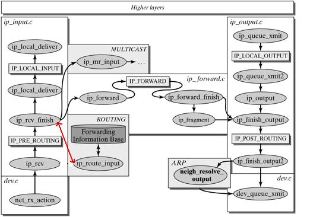

驱动
软中断
net_rx_action napi_poll __napi_poll n->poll process_backlog  __netif_receive_skb __netif_receive_skb_one_core ip_rcv 

```c
static int __netif_receive_skb_one_core(struct sk_buff *skb, bool pfmemalloc)
{
	struct net_device *orig_dev = skb->dev;
	struct packet_type *pt_prev = NULL;
	int ret;

	ret = __netif_receive_skb_core(&skb, pfmemalloc, &pt_prev);
	if (pt_prev)
		ret = INDIRECT_CALL_INET(pt_prev->func, ipv6_rcv, ip_rcv, skb,
					 skb->dev, pt_prev, orig_dev);
	return ret;
}
```

ip 层处理

ip_rcv ip_rcv_finish ip_rcv_finish_core

static inline int dst_input(struct sk_buff *skb)
{
	return INDIRECT_CALL_INET(skb_dst(skb)->input,
				  ip6_input, ip_local_deliver, skb);
}

注册 skb_dst(skb)->input 

dst->input指向的函数列表如下：

|函数|	描述|
|---|---|
|ip_local_deliver|	向本地传递的封包|
|ip_forward|	转发一个单播封包|
|ip_mr_input|	转发一个多播封包|
|ip_error|	处理一个不可达目的|
|dst_discard_in|	简单丢弃任何输入封包|



ip_rcv_finish_core ip_route_input_noref ip_route_input_rcu ip_route_input_slow ip_mkroute_input __mkroute_input

skb_dst(skb)->input（）ip_forward

ip_rcv_finish dst_input ip_local_deliver 

int ip_rcv(struct sk_buff *skb, struct net_device *dev, struct packet_type *pt,
	   struct net_device *orig_dev)
{
	struct net *net = dev_net(dev);

	skb = ip_rcv_core(skb, net);
	if (skb == NULL)
		return NET_RX_DROP;

	return NF_HOOK(NFPROTO_IPV4, NF_INET_PRE_ROUTING,
		       net, NULL, skb, dev, NULL,
		       ip_rcv_finish);
}

ip_rcv NF_INET_PRE_ROUTING

static inline int
NF_HOOK(uint8_t pf, unsigned int hook, struct net *net, struct sock *sk, struct sk_buff *skb,
	struct net_device *in, struct net_device *out,
	int (*okfn)(struct net *, struct sock *, struct sk_buff *))
{
	int ret = nf_hook(pf, hook, net, sk, skb, in, out, okfn);
	if (ret == 1)
		ret = okfn(net, sk, skb);
	return ret;
}

ip_rcv_finish_core 是IP层处理的核心函数

(1) 路由决策​​
​​输入​​：数据包（skb）、源/目标 IP（saddr/daddr）、网络设备（dev）。
​​输出​​：填充路由结果（fib_result *res），决定数据包是​​本地接收​​、​​转发​​还是​​丢弃​​。
​​关键逻辑​​：
检查源/目标 IP 的合法性（如 Martian 地址、广播地址等）。
通过 fib_lookup查询路由表（FIB），确定下一跳。
根据路由结果（RTN_LOCAL、RTN_UNICAST等）选择处理路径。
​​(2) 异常处理​​
​​非法源/目标地址​​：如组播源地址（ipv4_is_multicast(saddr)）、零地址（ipv4_is_zeronet）等，直接丢弃并记录原因（SKB_DROP_REASON_*）。
​​Martian 地址​​：不符合路由规则的地址（如私有地址出现在公网），触发日志和丢弃。
​​(3) 路由缓存管理​​
​​缓存复用​​：若找到有效的缓存路由（nhc->nhc_rth_input），直接使用。
​​新建路由表项​​：若无缓存，创建新的 rtable并设置输入/输出方法（如 dst.input = ip_forward）。

