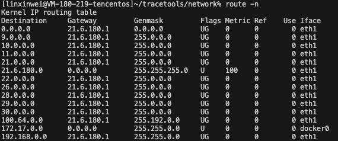
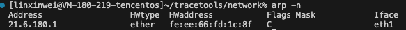

# ip 层的表及其作用

## 路由表

路由表用来决定数据包如何从源地址转发到目标地址。在路由表中会记录目标网络，以及目标网络对应的一些信息



* Destination：目标网络，当目标网络为default（0.0.0.0）时，表示这个是默认网关，所有数据都发到这个网关。
* Gateway：网关地址，即下一跳要转发到的路由器对应的ip，0.0.0.0 表示当前记录对应的 Destination 跟本机在同一个网段，不需要进行转发。
* Flags	
  * U - Up表示有效
  * G - Gateway表示连接路由，若无这个字段表示直连目的地址
  * H - Host表示目标是具体主机，而不是网段
  * R 恢复动态路由产生的表项
  * D 由路由的后台程序动态地安装
  * M 由路由的后台程序修改
  * ! 拒绝路由
* Metric：路由距离，到达指定网络所需的中转数，是大型局域网和广域网设置所必需的 （不在Linux内核中使用。）
* Ref：路由项引用次数 （不在Linux内核中使用。）
* Use：此路由项被路由软件查找的次数
* Iface：网卡名字，表示数据包会从哪个网卡上发出。

### linux路由的种类

主机路由：路由表中指向单个 IP 地址或主机名的路由记录，其 Flags 字段为 H。以下面的这条规则为例，说明这条路由规则只服务于发送到 10.0.0.10 的数据包。

```
Kernel IP routing table
Destination     Gateway         Genmask         Flags Metric Ref    Use Iface
10.0.0.10       10.139.128.1    255.255.255.255 UGH   0      0        0 eth0
```

网络路由，主机可以到达的网络。如示例中目的IP的网络号为 9.0.0.0 都要转发到 21.6.180.1。

```
Kernel IP routing table
Destination     Gateway         Genmask         Flags Metric Ref    Use Iface
9.0.0.0         21.6.180.1      255.0.0.0       UG    0      0        0 eth1
```
默认路由，当目标主机的 IP 地址或网络不在路由表中时，数据包就被发送到默认路由（默认网关）上。默认路由的 Destination 是 default 或 0.0.0.0。

```
Kernel IP routing table
Destination     Gateway         Genmask         Flags Metric Ref    Use Iface
0.0.0.0         21.6.180.1      0.0.0.0         UG    0      0        0 eth1
```

### 路由表的配置

**静态路由**

​静态路由​​无协议开销​​，不会占用带宽和计算资源。但需要管理员​手动配置​​无自动更新机制。使用于​​简单稳定的小型网络或固定路径。

**动态路由**

​动态路由的优点是可以​自动学习​​，路由器通过协议交换路由信息，实时更新路由表。​自适应拓扑​​，自动选择最优路径，支持故障切换。

​​协议分类​​：
​​内部网关协议（IGP）​​：用于同一自治系统内部，如：​RIP​​、​OSPF​​。
​​外部网关协议（EGP）​​：用于不同AS间，如 ​​BGP​​。

### 路由涉及的内核函数


## 邻居表
邻居表维护 IP 地址与 MAC 地址的映射（IPv4 用 ARP，IPv6 用 NDP）。



* Address​​：目标设备的 ​​IPv4 或 IPv6 地址
* HWtype：网络接口的​​硬件类型，图中为
* HWaddress：目标设备的 ​​MAC 地址​​即物理地址。
* Flags
  * C	​​Complete​​	条目有效且已确认（收到过ARP响应）
  * M	​​Manual​​	静态配置（手动 arp -s 绑定）
  * P	​​Publish​​	本机可响应此IP的ARP请求（代理ARP）
  * S	​​Stale​​	条目可能失效（需重新验证）
  * R	​​Router​​	目标是一台路由器（IPv6 NDP专用）
  * D	​​Dynamic​​	动态学习（非静态）

Mask：表示子网掩码，仅在某些系统​​中显示，这里在 Linux 上就没有显示
Iface：网卡名字，表示数据包会从哪个网卡上发出。

### 邻居表的配置

邻居表中的表项可以通过静态的配置或者动态的学习。

**静态配置**

静态配置管理员可以手动添加ARP条目。

```sh
sudo arp -s 192.168.1.200 00:1a:2b:3c:4d:02
```
静态条目的特点​​是​永久有效​​：除非手动删除或重启网络服务，​Flags 为 M​。
**动态学习**

当主机需要与目标IP通信但不知道其MAC地址时，会触发ARP协议自动学习。

当主机A需要和B进行通信时，如果但ARP表中无主机B的MAC地址。主机A会发送 ​ARP 请求广播包。​当​交换机收到广播帧后，会将其​​泛洪​到除接收端口外的所有端口。主机 B 收到广播后，回复 ​ARP 响应包​。其他主机则会将这个包丢弃。当主机 A 收到主机 B 的响应消息会 MAC。如果主机 A 和主机 B 不在一个子网下那么学到的则是网关的 MAC 地址。

​动态学习的特点
* Flags C 表示动态学习（Complete）。
* ​​老化机制​​：条目默认保留 ​​15-30分钟​​（可配置），超时后删除。
* ​广播风暴控制​​：ARP请求会广播到整个局域网，但频率有限制。

## MAC 地址表

MAC 地址表游交换机来维护，记录了 MAC 地址与端口之间的映射关系。


这里路由表一开始也是空的。需要在通信的过程中进行学习。

比如主机 A 想要给 主机C 发送消息，就需要用到 mac 表。

但是，注意一下，一开始交换机的 MAC 地址表是空的，交换机并不知道 C 的端口号，因此 A 发送的消息将会被广播， 同时，A 的 MAC 地址和它对应的端口号会被记录到 MAC 地址表中。