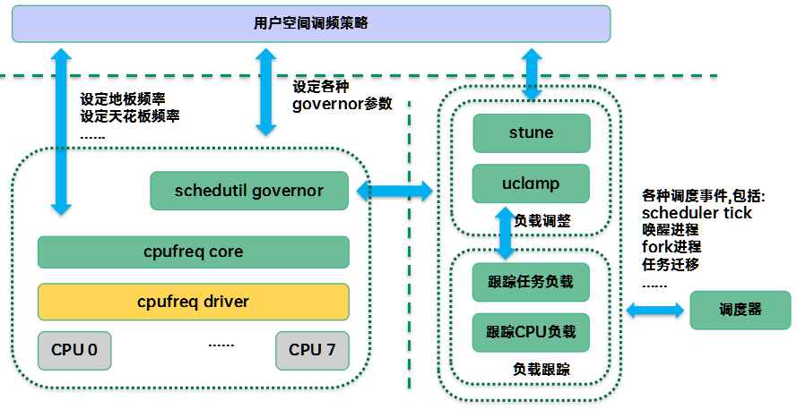

# schedutil

schedutil 是 Linux 内核中一种 ​​基于调度器实时利用率反馈的动态调频策略，直接利用调度器（CFS）计算的 ​​实时 CPU 利用率来决定目标频率，无需额外的采样或预测算法。

核心思想：
* ​“需要多少算力，就给多少频率”​​，避免静态频率策略的保守或激进问题。
* 通过减少调频延迟和消除中间层（如 ondemand 的采样周期）来提升能效和性能。



schedutil 在初始化时会注册回调函数到调度器的负载跟踪模块。当调度器的负载发生变化时，就会调用回调函数。在回调函数中会检查当前 CPU 频率与 CPU 负载是否匹配，如果不匹配则需要重新调整 CPU 的频率。

## 数据结构

在 cpu 调频子系统中会使用 cpu_dbs_info 来记录

```c
struct cpu_dbs_info {
	u64 prev_cpu_idle;
	u64 prev_update_time;
	u64 prev_cpu_nice;
	/*
	 * Used to keep track of load in the previous interval. However, when
	 * explicitly set to zero, it is used as a flag to ensure that we copy
	 * the previous load to the current interval only once, upon the first
	 * wake-up from idle.
	 */
	unsigned int prev_load;
	struct update_util_data update_util;
	struct policy_dbs_info *policy_dbs;
};
```

## 接口

### 初始化

在初始化过程中会对回调函数进行注册。在 sugov_start 中会调用 cpufreq_add_update_util_hook 将回调函数注册到percpu的结构体当中。

```c
static int sugov_start(struct cpufreq_policy *policy)
{
    struct sugov_policy *sg_policy = policy->governor_data; // 获取当前CPU策略的schedutil私有数据（sg_policy）
    void (*uu)(struct update_util_data *data, u64 time, unsigned int flags); // 声明回调函数指针，用于后续选择具体的调频更新函数
    unsigned int cpu; // CPU核心编号变量

    /* 初始化策略参数 */
    // 将用户配置的rate_limit_us（微秒）转换为纳秒级延迟
    sg_policy->freq_update_delay_ns = sg_policy->tunables->rate_limit_us * NSEC_PER_USEC;
    sg_policy->last_freq_update_time = 0; // 清零上次频率更新时间戳
    sg_policy->next_freq = 0; // 初始化下一个目标频率为0（表示未设置）
    sg_policy->work_in_progress = false; // 标记当前没有正在进行的频率更新工作
    sg_policy->limits_changed = false; // 标记频率限制未发生变化
    sg_policy->cached_raw_freq = 0; // 缓存原始频率值为0

    /* 检查是否需要更新频率限制 */
    // 测试CPU驱动是否需要动态更新频率限制
    sg_policy->need_freq_update = cpufreq_driver_test_flags(CPUFREQ_NEED_UPDATE_LIMITS);

    /* 选择调频更新函数 */
    if (policy_is_shared(policy)) {
        // 如果是多核共享调频策略（如Intel Turbo Boost），使用共享更新函数
        uu = sugov_update_shared;
    } else if (policy->fast_switch_enabled && cpufreq_driver_has_adjust_perf()) {
        // 如果支持快速频率切换和性能调整接口，使用单核性能模式更新
        uu = sugov_update_single_perf;
    } else {
        // 默认使用标准单核频率更新函数
        uu = sugov_update_single_freq;
    }

    /* 为每个CPU核心注册调频回调 */
    for_each_cpu(cpu, policy->cpus) {
        // 获取当前CPU的schedutil私有数据
        struct sugov_cpu *sg_cpu = &per_cpu(sugov_cpu, cpu);

        // 清零初始化CPU数据
        memset(sg_cpu, 0, sizeof(*sg_cpu));
        
        // 记录CPU编号
        sg_cpu->cpu = cpu;
        
        // 关联到策略数据
        sg_cpu->sg_policy = sg_policy;
        
        // 关键步骤：将回调函数注册到调度器
        // 当调度器需要更新CPU利用率时，会调用uu指向的函数
        cpufreq_add_update_util_hook(cpu, &sg_cpu->update_util, uu);
    }
    return 0;
}
void cpufreq_add_update_util_hook(int cpu, struct update_util_data *data,
			void (*func)(struct update_util_data *data, u64 time,
				     unsigned int flags))
{
	if (WARN_ON(!data || !func))
		return;

	if (WARN_ON(per_cpu(cpufreq_update_util_data, cpu)))
		return;

	data->func = func;
	rcu_assign_pointer(per_cpu(cpufreq_update_util_data, cpu), data);
}
```

### 更新频率

在不同的调度器中更新频率时都会调用 cpufreq_update_util 函数来更新频率。

以 cfs 中的调用为例：

```c
static inline void cfs_rq_util_change(struct cfs_rq *cfs_rq, int flags)
{
	struct rq *rq = rq_of(cfs_rq);

	if (&rq->cfs == cfs_rq) {
		/*
		 * There are a few boundary cases this might miss but it should
		 * get called often enough that that should (hopefully) not be
		 * a real problem.
		 *
		 * It will not get called when we go idle, because the idle
		 * thread is a different class (!fair), nor will the utilization
		 * number include things like RT tasks.
		 *
		 * As is, the util number is not freq-invariant (we'd have to
		 * implement arch_scale_freq_capacity() for that).
		 *
		 * See cpu_util_cfs().
		 */
		cpufreq_update_util(rq, flags);
	}
}
```

再该函数中 cpufreq_update_util 会调用提前注册好的函数。

```c
static inline void cpufreq_update_util(struct rq *rq, unsigned int flags)
{
	struct update_util_data *data;

	data = rcu_dereference_sched(*per_cpu_ptr(&cpufreq_update_util_data,
						  cpu_of(rq)));
	if (data)
		data->func(data, rq_clock(rq), flags);
}
```

在这里注册的函数有 sugov_update_shared sugov_update_single_perf sugov_update_single_freq。

```c
// 更新单个 CPU 的频率
static void sugov_update_single_freq(struct update_util_data *hook, u64 time,
					 unsigned int flags)
{
	// 获取 sugov_cpu 结构体
	struct sugov_cpu *sg_cpu = container_of(hook, struct sugov_cpu, update_util);
	// 获取 sugov_policy 结构体
	struct sugov_policy *sg_policy = sg_cpu->sg_policy;
	// 缓存当前的原始频率
	unsigned int cached_freq = sg_policy->cached_raw_freq;
	// 最大 CPU 容量
	unsigned long max_cap;
	// 下一个频率
	unsigned int next_f;

	// 获取 CPU 的最大容量
	max_cap = arch_scale_cpu_capacity(sg_cpu->cpu);

	// 更新通用逻辑，如果返回 false 则无需更新频率
	if (!sugov_update_single_common(sg_cpu, time, max_cap, flags))
		return;

	// 根据当前利用率和最大容量计算下一个频率
	next_f = get_next_freq(sg_policy, sg_cpu->util, max_cap);

	// 如果需要保持频率，并且下一个频率小于当前频率，且不需要更新频率
	if (sugov_hold_freq(sg_cpu) && next_f < sg_policy->next_freq &&
		!sg_policy->need_freq_update) {
		// 使用当前频率作为下一个频率
		next_f = sg_policy->next_freq;

		// 恢复缓存的原始频率，因为 next_freq 已更改
		sg_policy->cached_raw_freq = cached_freq;
	}

	// 如果频率未改变，则无需更新
	if (!sugov_update_next_freq(sg_policy, time, next_f))
		return;

	/*
	 * 此代码在目标 CPU 的 rq->lock 下运行，因此不会在两个不同的 CPU 上
	 * 并发运行针对同一目标的代码，因此在快速切换情况下不需要获取锁。
	 */
	if (sg_policy->policy->fast_switch_enabled) {
		// 快速切换到下一个频率
		cpufreq_driver_fast_switch(sg_policy->policy, next_f);
	} else {
		// 使用锁保护延迟更新逻辑
		raw_spin_lock(&sg_policy->update_lock);
		sugov_deferred_update(sg_policy);
		raw_spin_unlock(&sg_policy->update_lock);
	}
}

// 更新单个 CPU 的性能
static void sugov_update_single_perf(struct update_util_data *hook, u64 time,
					 unsigned int flags)
{
	// 获取 sugov_cpu 结构体
	struct sugov_cpu *sg_cpu = container_of(hook, struct sugov_cpu, update_util);
	// 保存之前的利用率
	unsigned long prev_util = sg_cpu->util;
	// 最大 CPU 容量
	unsigned long max_cap;

	/*
	 * 如果不支持频率不变性，则回退到“频率”路径，
	 * 因为利用率与性能级别之间的直接映射依赖于频率不变性。
	 */
	if (!arch_scale_freq_invariant()) {
		sugov_update_single_freq(hook, time, flags);
		return;
	}

	// 获取 CPU 的最大容量
	max_cap = arch_scale_cpu_capacity(sg_cpu->cpu);

	// 更新通用逻辑，如果返回 false 则无需更新性能
	if (!sugov_update_single_common(sg_cpu, time, max_cap, flags))
		return;

	// 如果需要保持频率，并且当前利用率小于之前的利用率，则使用之前的利用率
	if (sugov_hold_freq(sg_cpu) && sg_cpu->util < prev_util)
		sg_cpu->util = prev_util;

	// 调整 CPU 的性能
	cpufreq_driver_adjust_perf(sg_cpu->cpu, sg_cpu->bw_min,
				   sg_cpu->util, max_cap);

	// 更新策略的最后一次频率更新时间
	sg_cpu->sg_policy->last_freq_update_time = time;
}

// 计算共享 CPU 的下一个频率
static unsigned int sugov_next_freq_shared(struct sugov_cpu *sg_cpu, u64 time)
{
	// 获取 sugov_policy 和 cpufreq_policy 结构体
	struct sugov_policy *sg_policy = sg_cpu->sg_policy;
	struct cpufreq_policy *policy = sg_policy->policy;
	// 初始化利用率和最大容量
	unsigned long util = 0, max_cap;
	unsigned int j;

	// 获取当前 CPU 的最大容量
	max_cap = arch_scale_cpu_capacity(sg_cpu->cpu);

	// 遍历策略中的所有 CPU
	for_each_cpu(j, policy->cpus) {
		// 获取每个 CPU 的 sugov_cpu 结构体
		struct sugov_cpu *j_sg_cpu = &per_cpu(sugov_cpu, j);
		unsigned long boost;

		// 应用 IO 等待提升
		boost = sugov_iowait_apply(j_sg_cpu, time, max_cap);
		// 获取 CPU 的利用率
		sugov_get_util(j_sg_cpu, boost);

		// 更新最大利用率
		util = max(j_sg_cpu->util, util);
	}

	// 根据最大利用率和最大容量计算下一个频率
	return get_next_freq(sg_policy, util, max_cap);
}

// 更新共享 CPU 的频率
static void
sugov_update_shared(struct update_util_data *hook, u64 time, unsigned int flags)
{
	// 获取 sugov_cpu 结构体
	struct sugov_cpu *sg_cpu = container_of(hook, struct sugov_cpu, update_util);
	// 获取 sugov_policy 结构体
	struct sugov_policy *sg_policy = sg_cpu->sg_policy;
	// 下一个频率
	unsigned int next_f;

	// 加锁保护共享策略的更新
	raw_spin_lock(&sg_policy->update_lock);

	// 更新 IO 等待提升状态
	sugov_iowait_boost(sg_cpu, time, flags);
	// 更新最后一次更新时间
	sg_cpu->last_update = time;

	// 忽略 DL 速率限制
	ignore_dl_rate_limit(sg_cpu);

	// 如果需要更新频率
	if (sugov_should_update_freq(sg_policy, time)) {
		// 计算共享 CPU 的下一个频率
		next_f = sugov_next_freq_shared(sg_cpu, time);

		// 如果频率未改变，则无需更新
		if (!sugov_update_next_freq(sg_policy, time, next_f))
			goto unlock;

		// 如果启用了快速切换，则直接切换到下一个频率
		if (sg_policy->policy->fast_switch_enabled)
			cpufreq_driver_fast_switch(sg_policy->policy, next_f);
		else
			// 否则延迟更新频率
			sugov_deferred_update(sg_policy);
	}

unlock:
	// 解锁
	raw_spin_unlock(&sg_policy->update_lock);
}
```

