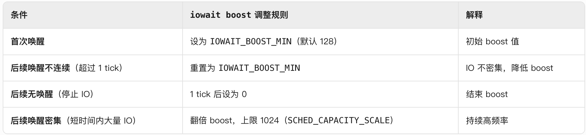

# schedutil

schedutil 是 Linux 内核中一种 ​​基于调度器实时利用率反馈的动态调频策略，直接利用调度器（CFS）计算的 ​​实时 CPU 利用率来决定目标频率，无需额外的采样或预测算法。

核心思想：
* ​“需要多少算力，就给多少频率”​​，避免静态频率策略的保守或激进问题。
* 通过减少调频延迟和消除中间层（如 ondemand 的采样周期）来提升能效和性能。


schedutil 在初始化时会注册回调函数到调度器的负载跟踪模块。当调度器的负载发生变化时，就会调用回调函数。在回调函数中会检查当前 CPU 频率与 CPU 负载是否匹配，如果不匹配则需要重新调整 CPU 的频率。

## 数据结构

在 cpu 调频子系统中会使用 cpu_dbs_info 来记录

```c
struct cpu_dbs_info {
	u64 prev_cpu_idle;
	u64 prev_update_time;
	u64 prev_cpu_nice;
	/*
	 * Used to keep track of load in the previous interval. However, when
	 * explicitly set to zero, it is used as a flag to ensure that we copy
	 * the previous load to the current interval only once, upon the first
	 * wake-up from idle.
	 */
	unsigned int prev_load;
	struct update_util_data update_util;
	struct policy_dbs_info *policy_dbs;
};
```

## 接口

在 schedutil_gov 中注册了如下函数来应对不同的事件

```c
// 定义 schedutil 调速器的 cpufreq_governor 结构体
struct cpufreq_governor schedutil_gov = {
    .name			= "schedutil", // 调速器名称
    .owner			= THIS_MODULE, // 所属模块
    .flags			= CPUFREQ_GOV_DYNAMIC_SWITCHING, // 支持动态切换的标志
    .init			= sugov_init, // 初始化函数
    .exit			= sugov_exit, // 退出函数
    .start			= sugov_start, // 启动函数
    .stop			= sugov_stop, // 停止函数
    .limits			= sugov_limits, // 频率限制更新函数
};
```
### 初始化 sugov

这里根据在初始化过程中的作用分为两个阶段：

```
sugov_init()
├─ 阶段一：基础初始化
│   ├─ 检查 policy->governor_data
│   ├─ 启用 fast_switch
│   ├─ 分配 sg_policy
│   └─ 创建线程（慢速路径）
│       ├─ 成功 → 进入阶段二
│       └─ 失败 → 回滚（free_sg_policy → disable_fast_switch）
│
└─ 阶段二：Tunables 初始化
    ├─ 加全局锁
    ├─ 复用或分配 tunables
    │   ├─ 成功 → 完成初始化
    │   └─ 失败 → 回滚（stop_kthread → 阶段一回滚）
    └─ 释放锁
```

**阶段一：基础资源分配与快速切换启用​**

完成​​策略（policy）的基础初始化​​，包括启用快速切换、分配内存、创建线程等。
若此阶段失败，需回滚已分配的资源（如内存、线程）。

```c
	/* 1.确保此策略尚未初始化调速器 */
	if (policy->governor_data)
		return -EBUSY;

	/* 2.启用策略的快速频率切换 */
	cpufreq_enable_fast_switch(policy);

	/* 3.为 schedutil 策略结构分配内存 */
	sg_policy = sugov_policy_alloc(policy);
	if (!sg_policy) {
		ret = -ENOMEM;
		goto disable_fast_switch;
	}

	/* 4.如果需要，为慢路径更新创建内核线程 */
	ret = sugov_kthread_create(sg_policy);
	if (ret)
		goto free_sg_policy;

```

**1.检查是否有旧的调频策略未卸载** 

struct cpufreq_policy 的 governor_data 会指向当前 governor policy 对象，要把 sugov设置为当前 governor，那么旧的 governor 应该完成 stop 和 exit 动作。如果此时旧的策略已经被卸载那么 governor_data 为空，可以对策略进行初始化。否则说明旧的策略还存在无法对当前策略进行初始化，返回 -EBUSY。

**2.使能 fast switch 功能（快路径更新）** 

调用 cpufreq_enable_fast_switch 来使能 fast switch 功能。​​Fast Switch（快速频率切换）​​ 是一种优化机制，允许 CPU 频率在​​调度器上下文（如任务切换时）直接调整​​，而无需经过传统的异步通知流程。它的核心目标是​​降低频率切换的延迟​​，提高系统的响应速度和能效。
这里的使能只是指 sugov policy 层 enable fast switch，具体是否支持还要看底层 cpufreq 驱动。这里为了标志底层是否支持，引入了 fast_switch_possible 和 fast_switch_enabled。两个参数。

```c
	/*
	 * 快速切换标志：
	 * - fast_switch_possible：如果驱动程序能够保证可以在共享该策略的任何CPU上更改频率，
	 *   并且更改将影响所有策略CPU，则应由驱动程序设置。
	 * - fast_switch_enabled：由支持快速频率切换的调节器设置，
	 *   通过调用 cpufreq_enable_fast_switch() 实现。
	 */
	bool			fast_switch_possible;
	bool			fast_switch_enabled;
```

如果底层驱动支持快速切频功能，那么cpufreq driver必须提供fast_switch的回调函数，这时候cpufreq policy的fast_switch_possible 等于true，表示驱动支持任何上下文（包括中断上下文）的频率切换。只有上下打通（上指governor，下指driver），CPU 频率切换才走 fast switch 路径。

且 fast switch 和 cpufreq transition notifier 之间具有互斥性

cpufreq transition notifier​​：

这是传统的频率切换通知机制。当 CPU 频率即将改变（PRECHANGE）或已完成改变（POSTCHANGE）时，内核会通过通知链（notifier chain）调用其他模块注册的回调函数（callback）。这些回调可能涉及复杂的操作（如调整时钟、电源管理等），且​​可能是阻塞的​​（例如等待硬件响应或持有锁）。

​​fast switch​​：

这是为了快速切换频率而设计的机制，要求切换过程必须是​​非阻塞且原子化​​的（不能睡眠、不能被打断）。因此，它​​无法兼容传统的 notifier 机制​​，因为 notifier 的回调可能阻塞，而 fast switch 不允许等待。

虽然 fast switch 移除了 notifier 机制，但​​频率切换的串行化​​（防止并发修改）仍需保证。因此：

调用 cpufreq_driver_fast_switch 的模块（如 governor）必须​​自行实现同步​​（例如通过锁或原子操作），确保频率切换的原子性和线程安全。

快速路径切换函数的实现：

```c
/**
 * cpufreq_driver_fast_switch - 执行快速 CPU 频率切换。
 * @policy: 要切换频率的 cpufreq 策略。
 * @target_freq: 要设置的新频率（可能是近似值）。
 *
 * 执行快速频率切换，无需进入睡眠状态。
 *
 * 此函数调用的驱动程序的 ->fast_switch() 回调必须适合在 RCU-sched
 * 读取侧临界区内调用，并且应选择大于或等于 @target_freq 的最小可用频率
 * （CPUFREQ_RELATION_L）。
 *
 * 如果 policy->fast_switch_enabled 未设置，则不得调用此函数。
 *
 * 调用此函数的调节器必须保证它不会对同一策略并行调用两次，
 * 并且不会与同一策略的 ->target() 或 ->target_index() 并行调用。
 *
 * 返回为 CPU 设置的实际频率。
 *
 * 如果驱动程序的 ->fast_switch() 回调返回 0 以指示错误条件，
 * 则必须保留硬件配置。
 */
unsigned int cpufreq_driver_fast_switch(struct cpufreq_policy *policy,
					unsigned int target_freq)
{
	unsigned int freq;
	int cpu;

	target_freq = clamp_val(target_freq, policy->min, policy->max);
	freq = cpufreq_driver->fast_switch(policy, target_freq);

	if (!freq)
		return 0;

	policy->cur = freq;
	arch_set_freq_scale(policy->related_cpus, freq,
				arch_scale_freq_ref(policy->cpu));
	cpufreq_stats_record_transition(policy, freq);

	if (trace_cpu_frequency_enabled()) {
		for_each_cpu(cpu, policy->cpus)
			trace_cpu_frequency(freq, cpu);
	}

	return freq;
}
EXPORT_SYMBOL_GPL(cpufreq_driver_fast_switch);
```

该函数会在更新cpu频率时被调用。sugov_update_single_freq/sugov_update_shared -> cpufreq_driver_fast_switch 。

**3.分配内存对象**

调用sugov_policy_alloc分配sugov policy对象，通过其policy成员建立和cpufreq framework的关联。

**4.慢路径更新**


​**​阶段二：Tunables 初始化与全局管理​​**

处理与 ​​tunables（可调参数）​​ 相关的逻辑，包括复用全局参数或创建新参数。此阶段失败需额外回滚线程和全局锁。

这里使用 sugov_tunables 结构体来记录频率调整的信息。

```c
// 定义 schedutil 调速器的 tunables 结构体
struct sugov_tunables {
	struct gov_attr_set	attr_set; // 属性集合，用于 sysfs 接口
	unsigned int		rate_limit_us; // 频率更新的速率限制（以微秒为单位）
};
```

全局 vs 每策略（per-cluster）的 tunables​​

​​(1) 全局 tunables（global_tunables）​​
* ​所有 policy 共享同一组参数​​：系统中所有 CPU 调频域（cluster）共用同一个 global_tunables，修改任一参数会影响所有 policy。
* ​适用场景​​：硬件平台所有 cluster 的调频行为需要完全一致（较少见）。

​​(2) 每策略 tunables（per-policy）​​
* ​每个 policy 有自己的独立参数​​：不同 cluster 可以配置不同的调频参数（例如大核和小核设置不同的 rate_limit_us）。
* ​手机典型场景​​：现代手机通常采用 ​​big.LITTLE 架构​​（如 1+3+4 三簇），不同 cluster 的负载特性和性能需求不同，因此需要独立的 tunables。

```c
	/* 检查全局 tunables 是否已存在 */
	if (global_tunables) {
		if (WARN_ON(have_governor_per_policy())) {
			ret = -EINVAL;
			goto stop_kthread;
		}
		/* 重用现有的全局 tunables */
		policy->governor_data = sg_policy;
		sg_policy->tunables = global_tunables;

		gov_attr_set_get(&global_tunables->attr_set, &sg_policy->tunables_hook);
		goto out;
	}

	/* 为调速器分配新的 tunables */
	tunables = sugov_tunables_alloc(sg_policy);
	if (!tunables) {
		ret = -ENOMEM;
		goto stop_kthread;
	}

	/* 设置频率更新的默认速率限制 */
	tunables->rate_limit_us = cpufreq_policy_transition_delay_us(policy);

	/* 将策略与调速器数据关联 */
	policy->governor_data = sg_policy;
	sg_policy->tunables = tunables;

```

**1.分配tunables结构**

调用 sugov_tunables_alloc 函数分配 sugov_tunables 结构并将分配好的结构体注册到 policy 结构体中。该函数不仅分配内存还会建立 sugov_tunables 与 policy 之间的双向联系

**2.cpufreq_policy_transition_delay_us**

​​关于 CPU 调频间隔的三个控制参数​​
这段描述解释了 Linux 内核中 ​​CPU 频率调节（cpufreq）​​ 的三个关键时间参数，它们共同决定了调频的最小时间间隔，以避免频繁切换频率导致性能或稳定性问题。以下是详细解析：

​​(1) 硬件调频延迟（transition_latency）​​
* ​定义​​：硬件从当前频率（F1）切换到目标频率（F2）并稳定下来所需的时间。
* ​存储位置​​：struct cpufreq_policy → cpuinfo.transition_latency（单位：纳秒 ns）。
* ​作用​​：反映 ​​硬件的物理限制​​。

​​(2) Governor 调频间隔（rate_limit_us / freq_update_delay_ns）​​
* ​定义​​：​sugov（或其他 governor）​​ 设定的最小调频间隔，避免软件层过于频繁地触发调频。
* ​存储位置​​：struct sugov_tunables → rate_limit_us（单位：微秒 µs）。最终会转换freq_update_delay_ns（纳秒 ns）供内核使用。
* ​作用​​：控制 ​​governor 调频的节奏​。
  
​​(3) 驱动调频间隔（transition_delay_us）​​
* ​定义​​：​底层 cpufreq 驱动​​ 建议的最小调频间隔，可能基于硬件特性或经验值。
* ​存储位置​​：struct cpufreq_policy → transition_delay_us（单位：微秒 µs）。
* ​作用​​：驱动可以 ​​覆盖硬件默认值​​，提供更合理的调频间隔。

**3.建立cpufreq framework和sugov的关联（初始化governor_data）**

**4.初始化可调参数的sysfs接口**

### 启动 sugov

在初始化过程中会对回调函数进行注册。在 sugov_start 中会调用 cpufreq_add_update_util_hook 将回调函数注册到percpu的结构体当中。

```c
static int sugov_start(struct cpufreq_policy *policy)
{
    struct sugov_policy *sg_policy = policy->governor_data; // 获取当前CPU策略的schedutil私有数据（sg_policy）
    void (*uu)(struct update_util_data *data, u64 time, unsigned int flags); // 声明回调函数指针，用于后续选择具体的调频更新函数
    unsigned int cpu; // CPU核心编号变量

    /* 初始化策略参数 */
    // 将用户配置的rate_limit_us（微秒）转换为纳秒级延迟
    sg_policy->freq_update_delay_ns = sg_policy->tunables->rate_limit_us * NSEC_PER_USEC;
    sg_policy->last_freq_update_time = 0; // 清零上次频率更新时间戳
    sg_policy->next_freq = 0; // 初始化下一个目标频率为0（表示未设置）
    sg_policy->work_in_progress = false; // 标记当前没有正在进行的频率更新工作
    sg_policy->limits_changed = false; // 标记频率限制未发生变化
    sg_policy->cached_raw_freq = 0; // 缓存原始频率值为0

    /* 检查是否需要更新频率限制 */
    // 测试CPU驱动是否需要动态更新频率限制
    sg_policy->need_freq_update = cpufreq_driver_test_flags(CPUFREQ_NEED_UPDATE_LIMITS);

    /* 选择调频更新函数 */
    if (policy_is_shared(policy)) {
        // 如果是多核共享调频策略（如Intel Turbo Boost），使用共享更新函数
        uu = sugov_update_shared;
    } else if (policy->fast_switch_enabled && cpufreq_driver_has_adjust_perf()) {
        // 如果支持快速频率切换和性能调整接口，使用单核性能模式更新
        uu = sugov_update_single_perf;
    } else {
        // 默认使用标准单核频率更新函数
        uu = sugov_update_single_freq;
    }

    /* 为每个CPU核心注册调频回调 */
    for_each_cpu(cpu, policy->cpus) {
        // 获取当前CPU的schedutil私有数据
        struct sugov_cpu *sg_cpu = &per_cpu(sugov_cpu, cpu);

        // 清零初始化CPU数据
        memset(sg_cpu, 0, sizeof(*sg_cpu));
        
        // 记录CPU编号
        sg_cpu->cpu = cpu;
        
        // 关联到策略数据
        sg_cpu->sg_policy = sg_policy;
        
        // 关键步骤：将回调函数注册到调度器
        // 当调度器需要更新CPU利用率时，会调用uu指向的函数
        cpufreq_add_update_util_hook(cpu, &sg_cpu->update_util, uu);
    }
    return 0;
}
void cpufreq_add_update_util_hook(int cpu, struct update_util_data *data,
			void (*func)(struct update_util_data *data, u64 time,
				     unsigned int flags))
{
	if (WARN_ON(!data || !func))
		return;

	if (WARN_ON(per_cpu(cpufreq_update_util_data, cpu)))
		return;

	data->func = func;
	rcu_assign_pointer(per_cpu(cpufreq_update_util_data, cpu), data);
}
```

### Sugov的停止

sugov_stop执行逻辑大致如下：

A、遍历该sugov policy（cluster）中的所有cpu，调用cpufreq_remove_update_util_hook注销sugov cpu的调频回调函数

B、sugov_stop之后可能会调用sugov_exit来释放该governor所持有的资源，包括update_util_data对象。通过synchronize_rcu函数可以确保之前对update_util_data对象的并发访问都已经离开了临界区，从而后续可以安全释放。

C、在不支持fast switch模式的时候，我们需要把pending状态状态的irq work和kthread work处理完毕，为后续销毁线程做准备

### Sugov的退出

sugov_exit主要功能是释放申请的资源，具体执行逻辑大致如下：

A、断开cpufreq framework中的cpufreq policy和sugover的关联（即将其governor_data设置为NULL）

B、调用sugov_tunables_free释放可调参数的内存（如果是多个policy共用一个可调参数对象，那么需要通过引用计数来判断是否还有sugov policy引用该对象）

C、调用sugov_kthread_stop来消耗用于sugov调频的内核线程（仅用在不支持fast switch场景）

D、调用sugov_policy_free释放sugov policy的内存

E、调用cpufreq_disable_fast_switch来禁止本policy上的fast switch。

### Sugov的限频

Sugov 的限频会在限频参数有修改的时候被触发。这里通过 cpufreq_set_policy -> cpufreq_governor_limits -> governor->limits 最终调到注册的 sugov_limits。

```c
static void sugov_limits(struct cpufreq_policy *policy)
{
	struct sugov_policy *sg_policy = policy->governor_data;

	// 如果未启用快速切换，则加锁更新策略限制
	if (!policy->fast_switch_enabled) {
		mutex_lock(&sg_policy->work_lock);
		cpufreq_policy_apply_limits(policy);
		mutex_unlock(&sg_policy->work_lock);
	}

	/*
	 * 下面的 limits_changed 更新必须在 cpufreq_set_policy() 中
	 * 更新策略限制之前完成，否则可能会错过策略限制的更新。
	 * 使用写内存屏障确保这一点。
	 *
	 * 这与 sugov_should_update_freq() 中的内存屏障配对。
	 */
	smp_wmb();

	// 设置 limits_changed 标志为 true
	WRITE_ONCE(sg_policy->limits_changed, true);
}
```
A、对于不支持fast switch的情况下，立刻调用cpufreq_policy_apply_limits函数使用最新的max和min来修正当前cpu频率，同时标记sugov policy中的limits_changed成员。

B、对于支持fast switch的情况下，仅仅标记sugov policy中的limits_changed成员即可，并不立刻进行频率修正。后续在调用cpufreq_update_util函数进行调频的时候会强制进行一次频率调整。

## 更新负载

在不同的调度器中更新负载时都会调用 cpufreq_update_util 函数来更新负载。

以 cfs 中的调用为例：

```c
static inline void cfs_rq_util_change(struct cfs_rq *cfs_rq, int flags)
{
	struct rq *rq = rq_of(cfs_rq);

	if (&rq->cfs == cfs_rq) {
		/*
		 * There are a few boundary cases this might miss but it should
		 * get called often enough that that should (hopefully) not be
		 * a real problem.
		 *
		 * It will not get called when we go idle, because the idle
		 * thread is a different class (!fair), nor will the utilization
		 * number include things like RT tasks.
		 *
		 * As is, the util number is not freq-invariant (we'd have to
		 * implement arch_scale_freq_capacity() for that).
		 *
		 * See cpu_util_cfs().
		 */
		cpufreq_update_util(rq, flags);
	}
}
```

再该函数中 cpufreq_update_util 会调用提前注册好的函数。

```c
static inline void cpufreq_update_util(struct rq *rq, unsigned int flags)
{
	struct update_util_data *data;

	data = rcu_dereference_sched(*per_cpu_ptr(&cpufreq_update_util_data,
						  cpu_of(rq)));
	if (data)
		data->func(data, rq_clock(rq), flags);
}
```

在这里注册的函数有 sugov_update_shared sugov_update_single_perf sugov_update_single_freq。

```c
// 更新单个 CPU 的频率
static void sugov_update_single_freq(struct update_util_data *hook, u64 time,
					 unsigned int flags)
{
	// 获取 sugov_cpu 结构体
	struct sugov_cpu *sg_cpu = container_of(hook, struct sugov_cpu, update_util);
	// 获取 sugov_policy 结构体
	struct sugov_policy *sg_policy = sg_cpu->sg_policy;
	// 缓存当前的原始频率
	unsigned int cached_freq = sg_policy->cached_raw_freq;
	// 最大 CPU 容量
	unsigned long max_cap;
	// 下一个频率
	unsigned int next_f;

	// 获取 CPU 的最大容量
	max_cap = arch_scale_cpu_capacity(sg_cpu->cpu);

	// 更新通用逻辑，如果返回 false 则无需更新频率
	if (!sugov_update_single_common(sg_cpu, time, max_cap, flags))
		return;

	// 根据当前利用率和最大容量计算下一个频率
	next_f = get_next_freq(sg_policy, sg_cpu->util, max_cap);

	// 如果需要保持频率，并且下一个频率小于当前频率，且不需要更新频率
	if (sugov_hold_freq(sg_cpu) && next_f < sg_policy->next_freq &&
		!sg_policy->need_freq_update) {
		// 使用当前频率作为下一个频率
		next_f = sg_policy->next_freq;

		// 恢复缓存的原始频率，因为 next_freq 已更改
		sg_policy->cached_raw_freq = cached_freq;
	}

	// 如果频率未改变，则无需更新
	if (!sugov_update_next_freq(sg_policy, time, next_f))
		return;

	/*
	 * 此代码在目标 CPU 的 rq->lock 下运行，因此不会在两个不同的 CPU 上
	 * 并发运行针对同一目标的代码，因此在快速切换情况下不需要获取锁。
	 */
	if (sg_policy->policy->fast_switch_enabled) {
		// 快速切换到下一个频率
		cpufreq_driver_fast_switch(sg_policy->policy, next_f);
	} else {
		// 使用锁保护延迟更新逻辑
		raw_spin_lock(&sg_policy->update_lock);
		sugov_deferred_update(sg_policy);
		raw_spin_unlock(&sg_policy->update_lock);
	}
}

// 更新单个 CPU 的性能
static void sugov_update_single_perf(struct update_util_data *hook, u64 time,
					 unsigned int flags)
{
	// 获取 sugov_cpu 结构体
	struct sugov_cpu *sg_cpu = container_of(hook, struct sugov_cpu, update_util);
	// 保存之前的利用率
	unsigned long prev_util = sg_cpu->util;
	// 最大 CPU 容量
	unsigned long max_cap;

	/*
	 * 如果不支持频率不变性，则回退到“频率”路径，
	 * 因为利用率与性能级别之间的直接映射依赖于频率不变性。
	 */
	if (!arch_scale_freq_invariant()) {
		sugov_update_single_freq(hook, time, flags);
		return;
	}

	// 获取 CPU 的最大容量
	max_cap = arch_scale_cpu_capacity(sg_cpu->cpu);

	// 更新通用逻辑，如果返回 false 则无需更新性能
	if (!sugov_update_single_common(sg_cpu, time, max_cap, flags))
		return;

	// 如果需要保持频率，并且当前利用率小于之前的利用率，则使用之前的利用率
	if (sugov_hold_freq(sg_cpu) && sg_cpu->util < prev_util)
		sg_cpu->util = prev_util;

	// 调整 CPU 的性能
	cpufreq_driver_adjust_perf(sg_cpu->cpu, sg_cpu->bw_min,
				   sg_cpu->util, max_cap);

	// 更新策略的最后一次频率更新时间
	sg_cpu->sg_policy->last_freq_update_time = time;
}

// 计算共享 CPU 的下一个频率
static unsigned int sugov_next_freq_shared(struct sugov_cpu *sg_cpu, u64 time)
{
	// 获取 sugov_policy 和 cpufreq_policy 结构体
	struct sugov_policy *sg_policy = sg_cpu->sg_policy;
	struct cpufreq_policy *policy = sg_policy->policy;
	// 初始化利用率和最大容量
	unsigned long util = 0, max_cap;
	unsigned int j;

	// 获取当前 CPU 的最大容量
	max_cap = arch_scale_cpu_capacity(sg_cpu->cpu);

	// 遍历策略中的所有 CPU
	for_each_cpu(j, policy->cpus) {
		// 获取每个 CPU 的 sugov_cpu 结构体
		struct sugov_cpu *j_sg_cpu = &per_cpu(sugov_cpu, j);
		unsigned long boost;

		// 应用 IO 等待提升
		boost = sugov_iowait_apply(j_sg_cpu, time, max_cap);
		// 获取 CPU 的利用率
		sugov_get_util(j_sg_cpu, boost);

		// 更新最大利用率
		util = max(j_sg_cpu->util, util);
	}

	// 根据最大利用率和最大容量计算下一个频率
	return get_next_freq(sg_policy, util, max_cap);
}

// 更新共享 CPU 的频率
static void
sugov_update_shared(struct update_util_data *hook, u64 time, unsigned int flags)
{
	// 获取 sugov_cpu 结构体
	struct sugov_cpu *sg_cpu = container_of(hook, struct sugov_cpu, update_util);
	// 获取 sugov_policy 结构体
	struct sugov_policy *sg_policy = sg_cpu->sg_policy;
	// 下一个频率
	unsigned int next_f;

	// 加锁保护共享策略的更新
	raw_spin_lock(&sg_policy->update_lock);

	// 更新 IO 等待提升状态
	sugov_iowait_boost(sg_cpu, time, flags);
	// 更新最后一次更新时间
	sg_cpu->last_update = time;

	// 忽略 DL 速率限制
	ignore_dl_rate_limit(sg_cpu);

	// 如果需要更新频率
	if (sugov_should_update_freq(sg_policy, time)) {
		// 计算共享 CPU 的下一个频率
		next_f = sugov_next_freq_shared(sg_cpu, time);

		// 如果频率未改变，则无需更新
		if (!sugov_update_next_freq(sg_policy, time, next_f))
			goto unlock;

		// 如果启用了快速切换，则直接切换到下一个频率
		if (sg_policy->policy->fast_switch_enabled)
			cpufreq_driver_fast_switch(sg_policy->policy, next_f);
		else
			// 否则延迟更新频率
			sugov_deferred_update(sg_policy);
	}

unlock:
	// 解锁
	raw_spin_unlock(&sg_policy->update_lock);
}
```

**三个函数的区别与联系**


|函数名|作用对象| 主要功能| 关键区别点|
|----|----|----|----|
|sugov_update_single_freq| 单个CPU| 更新单个CPU的频率（基于利用率计算）| 仅处理频率，不涉及性能调整|
|sugov_update_single_perf| 单个CPU| 更新单个CPU的性能（若支持频率不变性），否则回退到 _freq 逻辑| 支持性能调优，依赖硬件特性|
|sugov_update_shared| 共享CPU簇| 更新整个CPU簇（多核）的频率，基于所有CPU的最大利用率计算频率| 需加锁保护共享策略，避免竞争|

_perf 函数通过 cpufreq_driver_adjust_perf() 直接调整性能级别（如Intel HWP），而 _freq 仅修改频率。

共同目标​​：

* 均用于动态调整CPU频率/性能，响应负载变化（通过 update_util_data 钩子触发）。
* 最终可能调用 cpufreq_driver_fast_switch() 或延迟更新逻辑。
  
​​逻辑复用​​：
* sugov_update_single_perf 在​​不支持频率不变性​​时，直接调用 sugov_update_single_freq。
* 两者共享 sugov_update_single_common() 通用逻辑（检查是否需要更新）。

​​性能与频率的关联​​：
* _perf 函数通过 cpufreq_driver_adjust_perf() 直接调整性能级别（如Intel HWP），而 _freq 仅修改频率。

**频率不变性​​**

频率不变性​​是指 ​​CPU利用率（utilization）的计算与当前CPU运行频率无关​​。换句话说，无论CPU运行在1GHz还是3GHz，相同的实际工作量（如执行固定数量的指令）所计算出的利用率值应保持一致。

在动态调频（DVFS）场景中，CPU频率会随负载变化而升降。若缺乏频率不变性，利用率计算会失真：

1. ​高频时​​：CPU以3GHz运行，完成某任务仅需10ms，利用率计算为30%。
2. ​低频时​​：同一任务在1GHz下需30ms，利用率可能错误计算为90%。

​​结果​​：调度器和调频策略（如sugov）误判负载，导致次优决策（如不必要地升频）。频率不变性通过​​归一化​​处理，确保利用率反映真实负载，而非频率影响。


### Sugov的频率调整间隔

在调整频率前首先会 sugov_update_single_common sugov_should_update_freq 

```c
/**
 * sugov_should_update_freq - 判断是否需要更新 CPU 频率
 * @sg_policy: 指向 sugov_policy 结构体的指针
 * @time: 当前时间戳（以纳秒为单位）
 *
 * 返回值:
 * true  - 需要更新频率。
 * false - 不需要更新频率。
 */
static bool sugov_should_update_freq(struct sugov_policy *sg_policy, u64 time)
{
    s64 delta_ns;

    /* 检查当前 CPU 是否可以更新频率 */
    if (!cpufreq_this_cpu_can_update(sg_policy->policy))
        return false;

    /* 如果频率限制发生变化，强制更新频率 */
    if (unlikely(READ_ONCE(sg_policy->limits_changed))) {
        WRITE_ONCE(sg_policy->limits_changed, false);
        sg_policy->need_freq_update = true;
        smp_mb(); // 写内存屏障，确保标志位更新的可见性

        return true;
    }

    /* 计算当前时间与上次频率更新时间的间隔 */
    delta_ns = time - sg_policy->last_freq_update_time;

    /* 如果时间间隔超过最小更新间隔，则需要更新频率 */
    return delta_ns >= sg_policy->freq_update_delay_ns;
}
```

此函数用于确定是否需要更新 CPU 的频率。它会检查以下条件：
1. 当前 CPU 是否可以更新频率。不同硬件平台有不同的限制，有些平台频率调整寄存器是per-CPU的，只能调整自己所在cluster的频率。 
 ```c
   /**
   * cpufreq_this_cpu_can_update - 检查当前 CPU 是否可以更新 cpufreq 策略。
   * @policy: 要检查的 cpufreq 策略。
   *
   * 如果以下条件满足，则返回 'true'：
   * - 本地和远程 CPU 共享 @policy，
   * - @policy 中设置了 dvfs_possible_from_any_cpu，并且本地 CPU 没有即将离线
   *   （在这种情况下，不再期望它运行 cpufreq 更新）。
   */
  bool cpufreq_this_cpu_can_update(struct cpufreq_policy *policy)
  { 
	return cpumask_test_cpu(smp_processor_id(), policy->cpus) ||
		(policy->dvfs_possible_from_any_cpu &&
		 rcu_dereference_sched(*this_cpu_ptr(&cpufreq_update_util_data)));
  }
```
2. 检查 limits_changed 是否为true，如果为真则绕过后面对时间差限制的检查直接返回true。这一个值通过函数 ignore_dl_rate_limit 来设置。用于​​在 Deadline (DL) 调度类任务增加 CPU 带宽需求时，绕过 CPU 频率调控（sugov）的常规速率限制，强制触发频率更新​​。
3. 计算上次调频到现在的时间差（delta_ns）只有超过预设的延迟时间（freq_update_delay_ns）才允许调频，避免过于频繁的调频操作，平衡性能和功耗。

### 计算更新的频率

```c
// 获取 CPU 的利用率
static void sugov_get_util(struct sugov_cpu *sg_cpu, unsigned long boost)
{
	// 定义最小值、最大值和利用率变量，初始利用率从 SCX 获取
	unsigned long min, max, util = scx_cpuperf_target(sg_cpu->cpu);

	// 如果未切换到 SCX，则增加 CFS 的利用率提升
	if (!scx_switched_all())
		util += cpu_util_cfs_boost(sg_cpu->cpu);

	// 计算 CPU 的有效利用率，同时获取最小和最大值
	util = effective_cpu_util(sg_cpu->cpu, util, &min, &max);

	// 利用率取最大值（当前利用率和 IO 提升值）
	util = max(util, boost);

	// 更新 sugov_cpu 的最小带宽
	sg_cpu->bw_min = min;

	// 计算并更新 sugov_cpu 的有效性能
	sg_cpu->util = sugov_effective_cpu_perf(sg_cpu->cpu, util, min, max);
}
```

#### effective_cpu_util

在 effective_cpu_util 中会逻辑是综合多个调度类（CFS、RT、DL）和干扰因素（IRQ、steal-time）的利用率，最终输出一个 ​​0 ~ scale（最大容量）​​ 之间的值。

```c
unsigned long effective_cpu_util(int cpu, unsigned long util_cfs,
				 unsigned long *min,
				 unsigned long *max)
{
	unsigned long util, irq, scale;
	struct rq *rq = cpu_rq(cpu);

	scale = arch_scale_cpu_capacity(cpu);
    /**1. 初始化与 IRQ 处理​**/
	irq = cpu_util_irq(rq);
	if (unlikely(irq >= scale)) {
		if (min)
			*min = scale;
		if (max)
			*max = scale;
		return scale;
	}
    /**2. 计算最低利用率（min）**/
	if (min) {
		*min = max(irq + cpu_bw_dl(rq), uclamp_rq_get(rq, UCLAMP_MIN));
		if (!uclamp_is_used() && rt_rq_is_runnable(&rq->rt))
			*min = max(*min, scale);
	}
    /**3. 计算实际利用率（util）​**/
	util = util_cfs + cpu_util_rt(rq);
	util += cpu_util_dl(rq);

	if (max)
		*max = min(scale, uclamp_rq_get(rq, UCLAMP_MAX));

	if (util >= scale)
		return scale;
    /**4. 调整 IRQ 影响​ ​**/
	util = scale_irq_capacity(util, irq, scale);
	util += irq;

	return min(scale, util);
}

```

**1. 初始化与 IRQ 处理​**
​​IRQ 饱和检查​​：若 IRQ 利用率超过 CPU 最大容量（可能是跟踪误差），直接返回 scale（避免无效计算）。

**2. 计算最低利用率（min）**

​​DL 带宽（cpu_bw_dl）​​：DL 任务的最小带宽需求（runtime / period）。

​​UCLAMP_MIN​​：用户通过 sched_setattr() 设置的任务利用率下限。

​​RT 任务特殊处理​​：若无 uclamp 且 RT 任务可运行，必须保证 CPU 以最高性能运行（避免 RT 延迟）。

**3. 计算实际利用率（util）​**

​​CFS + RT + DL​​：三者利用率直接相加（因为它们的 PELT 窗口同步，度量一致）。
​​UCLAMP_MAX​​：用户设置的任务利用率上限（可能限制最终频率）。

**4. 调整 IRQ 影响​ ​**

​​IRQ（中断）和 steal-time（如虚拟机中被其他 CPU 偷取的时间）未被统计在任务的运行时间（rq->clock_task）中​​，但实际占用了 CPU 资源。如果不调整，会导致 ​​CPU 利用率被低估​​，进而引发频率选择不足、性能下降的问题。

缩放公式：
$$
U' = \text{irq} + \frac{\text{scale} - \text{irq}}{\text{scale}} \times U_{\text{task}}
$$

物理意义​​：IRQ 占用后剩余的资源按比例分配给任务。

#### 计算簇的更新频率

对于只有一个cpu的cluster，cpu utility就是cluster的utility，对于cluster内有多个cpu的情况，这里需要遍历cluster中的cpu，找到cluster utility（用来映射cluster频率的utility），具体的代码实现在 sugov_next_freq_shared 函数中：

```c
// 更新共享 CPU 的频率
static void
sugov_update_shared(struct update_util_data *hook, u64 time, unsigned int flags)
{
	// 获取 sugov_cpu 结构体
	struct sugov_cpu *sg_cpu = container_of(hook, struct sugov_cpu, update_util);
	// 获取 sugov_policy 结构体
	struct sugov_policy *sg_policy = sg_cpu->sg_policy;
	// 下一个频率
	unsigned int next_f;

	// 加锁保护共享策略的更新
	raw_spin_lock(&sg_policy->update_lock);

	// 更新 IO 等待提升状态
	sugov_iowait_boost(sg_cpu, time, flags);
	// 更新最后一次更新时间
	sg_cpu->last_update = time;

	// 忽略 DL 速率限制
	ignore_dl_rate_limit(sg_cpu);

	// 如果需要更新频率
	if (sugov_should_update_freq(sg_policy, time)) {
		// 计算共享 CPU 的下一个频率
		next_f = sugov_next_freq_shared(sg_cpu, time);

		// 如果频率未改变，则无需更新
		if (!sugov_update_next_freq(sg_policy, time, next_f))
			goto unlock;

		// 如果启用了快速切换，则直接切换到下一个频率
		if (sg_policy->policy->fast_switch_enabled)
			cpufreq_driver_fast_switch(sg_policy->policy, next_f);
		else
			// 否则延迟更新频率
			sugov_deferred_update(sg_policy);
	}

unlock:
	// 解锁
	raw_spin_unlock(&sg_policy->update_lock);
}
```

在 CPU 调频（DVFS）和任务调度中，处理 同构（homogeneous） 和 异构（heterogeneous） CPU 集群时，对 Utility（利用率） 和 Capacity（算力） 的比较逻辑有所不同。以下是分场景的规则和公式说明：

**同构 CPU 集群（相同微架构）**

条件：  
Cluster 内所有 CPU 的微架构相同（如 Arm A55 小核集群）。  

最大算力（capacity）相同，即 arch_scale_cpu_capacity(cpu) 返回值一致。

决策规则：  
直接选择 Utility 绝对值最大 的 CPU 作为调频或任务迁移的目标。  
公式：  
$$
\text{target\_cpu} = \arg\max_{\text{cpu} \in \text{cluster}} \left( \text{util}_{\text{cpu}} \right)
$$
示例：  
CPU0: util = 600（60%）, capacity = 1024  

CPU1: util = 800（80%）, capacity = 1024  

选择 CPU1（因其 util 更高）。

**异构 CPU 集群（不同微架构）**

条件：Cluster 内 CPU 的微架构不同（如 Arm 的 大核（Cortex-X） 和 小核（Cortex-A））。  最大算力（capacity）不同，例如大核 capacity = 1536，小核 capacity = 1024。

决策规则：选择单位算力的利用率（Utility/Capacity）最高的 CPU，以公平比较不同性能的 CPU 负载。  
公式：  
$$
\text{target\_cpu} = \arg\max_{\text{cpu} \in \text{cluster}} \left( \frac{\text{util}_{\text{cpu}}}{\text{capacity}_{\text{cpu}}} \right)
$$
示例：  

大核 CPU0: util = 900, capacity = 1536 → util/capacity = 0.586  

小核 CPU1: util = 700, capacity = 1024 → util/capacity = 0.684  

选择 CPU1（因其单位算力负载更高，更需调频或迁移任务）。

### 将cluster utility映射到具体的频率

```c
static unsigned int get_next_freq(struct sugov_policy *sg_policy,
				  unsigned long util, unsigned long max)
{
	struct cpufreq_policy *policy = sg_policy->policy;
	unsigned int freq;

	// 1.获取参考频率
	freq = get_capacity_ref_freq(policy);
	// 2.根据利用率映射到频率
	freq = map_util_freq(util, freq, max);

	// 如果频率未改变且不需要更新频率，则直接返回当前频率
	if (freq == sg_policy->cached_raw_freq && !sg_policy->need_freq_update)
		return sg_policy->next_freq;

	// 缓存原始频率
	sg_policy->cached_raw_freq = freq;
	// 解析并返回最终频率
	return cpufreq_driver_resolve_freq(policy, freq);
}
```

**(1) 获取参考频率**

如果利用率是频率不变的，则选择新频率与其成比例，即：next_freq = C * max_freq * util / max 否则，利用 util_raw * (curr_freq / max_freq) 来近似频率不变的利用率。

同时在这里我们需要保留 20% 的余量。为了 utility 能够匹配当前算力在计算时令 C = 1.25。这里的 C = 1.25 是 ​​倒数关系​​（1 / 0.8 = 1.25），确保 80% 利用率时频率达到 max_freq。

```c
static __always_inline
unsigned long get_capacity_ref_freq(struct cpufreq_policy *policy)
{
	unsigned int freq = arch_scale_freq_ref(policy->cpu);

	// 如果架构提供了参考频率，则直接返回
	if (freq)
		return freq;

	// 如果频率是频率不变的，则返回 CPU 的最大频率
	if (arch_scale_freq_invariant())
		return policy->cpuinfo.max_freq;

	/*
	 * 应用 25% 的余量，以便在 CPU 完全忙碌之前选择一个高于当前频率的频率：
	 */
	return policy->cur + (policy->cur >> 2);
}
```

这里为什么需要预留？

|原因​​	|​具体表现​​	|​解决方案​​|
|---|---|---|
|突发负载|	瞬时任务导致 util 骤增，可能超出当前频率能力。|	预留 20% 算力缓冲。|
|频率震荡|	高频调频增加功耗和延迟。|	提前升频，减少波动。|
|调度/调频延迟|	从检测到响应需要时间。	|余量覆盖延迟期负载。|
|非线性负载（如内存瓶颈）|	util 可能低估实际需求。|	额外算力补偿潜在误差。|
|能效平衡|	避免长期满载（高耗电）或过度降频（性能差）。|	20% 为经验最优值。

**​​(2) 计算理论目标频率​​**
计算逻辑：

若任务负载是 频率不变型（如纯计算任务）：

$$
\text{freq} = 1.25 \times \text{max\_freq} \times \frac{\text{util}}{\text{max}}
$$

若任务负载是 频率可变型（如内存密集型任务）：
$$
    \text{freq} = 1.25 \times \text{curr\_freq} \times \frac{\text{util\_raw}}{\text{max}}
$$

**(3)解析实际频率档位**

因为硬件频率是离散的（如 [600MHz, 800MHz, 1.2GHz, 1.5GHz]），而计算的 freq 可能是任意值（如 1.1 GHz）。所以这里硬件驱动最终调整到的频率并不是先前计算得到的 freq。在这里还需要对其进行解析

解析策略（由驱动决定）：

* 向上取最小频点：选择 ≥ freq 的最小档位（如 1.1 GHz → 1.2 GHz）。保守策略，优先性能
* 向下取最大频点：选择 ≤ freq 的最大档位（如 1.1 GHz → 800 MHz）。节能策略，可能牺牲性能
* 最接近频点：选择距离 freq 最近的档位（如 1.1 GHz → 1.2 GHz）。平衡策略，通用默认行为

### 计算iowait boost

在轻载场景下，CPU 可能只有一个 ​​重载 IO 任务​​（如数据库查询、文件读写）在运行。一开始 CPU 处于较高频率（如 2.0 GHz），但由于 IO 任务大部分时间在等待磁盘/网络，实际 CPU 计算时间很短，因此 CPU 利用率较低。schedutil 看到 util 很低，会降低 CPU 频率。频率降低后，IO 任务的计算部分运行变慢，导致​​单位时间内下发的 IO 命令减少​​，最终​降低 IO 吞吐量​​。

因此这里需要因为一个专门针对 IO 密集型任务的策略即 iowait boost。在检测到 IO 密集型任务时，临时提升 CPU 频率，避免因降频导致 IO 吞吐量下降。以此作为对 IO 负载压力的补充，而不是只关注 CPU 的负载。

iowait boost 机制通过动态调整 util，使 schedutil 误以为 CPU 很忙，从而维持较高频率。

iowait boost算法过程如下：

当 enqueu e一个处于 iowait 状态任务的时候，通过 cpufreq_update_util 来通知 sugov 模块发生了一次 SCHED_CPUFREQ_IOWAIT 类型的 cpu utility 变化。

在 sugov callback 函数中调用 sugov_iowait_boost 来更新该CPU的 iowait boost状态。具体更新的规则如下表所示：



```c
static void sugov_iowait_boost(struct sugov_cpu *sg_cpu, u64 time,
				   unsigned int flags)
{
	bool set_iowait_boost = flags & SCHED_CPUFREQ_IOWAIT;

	/* 如果 CPU 看起来足够空闲，则重置提升 */
	if (sg_cpu->iowait_boost &&
		sugov_iowait_reset(sg_cpu, time, set_iowait_boost))
		return;

	/* 仅提升在 IO 后唤醒的任务 */
	if (!set_iowait_boost)
		return;

	/* 确保每次请求时提升仅加倍一次 */
	if (sg_cpu->iowait_boost_pending)
		return;
	sg_cpu->iowait_boost_pending = true;

	/* 每次请求时提升加倍 */
	if (sg_cpu->iowait_boost) {
		sg_cpu->iowait_boost =
			min_t(unsigned int, sg_cpu->iowait_boost << 1, SCHED_CAPACITY_SCALE);
		return;
	}

	/* IO 后首次唤醒：从最小提升开始 */
	sg_cpu->iowait_boost = IOWAIT_BOOST_MIN;
}
```

​在调用 sugov_get_util 函数获取 cpu utility 之后，通过调用sugov_iowait_apply 来获取 iowait boost 的 utility 值。如果 iowait boost 的 utility 比较大的话，那么用 iowait boost utility 来替代之前计算的 cpu utility。

```
sugov_next_freq_shared/sugov_update_single_common -> sugov_iowait_apply 
```

```c
static unsigned long sugov_iowait_apply(struct sugov_cpu *sg_cpu, u64 time,
				   unsigned long max_cap)
{
	/* 当前不需要提升 */
	if (!sg_cpu->iowait_boost)
		return 0;

	/* 如果 CPU 看起来足够空闲，则重置提升 */
	if (sugov_iowait_reset(sg_cpu, time, false))
		return 0;
    
	if (!sg_cpu->iowait_boost_pending) {
		/* 没有提升请求；减少提升值。*/
		sg_cpu->iowait_boost >>= 1;
		if (sg_cpu->iowait_boost < IOWAIT_BOOST_MIN) {
			sg_cpu->iowait_boost = 0;
			return 0;
		}
	}
	sg_cpu->iowait_boost_pending = false;

	return (sg_cpu->iowait_boost * max_cap) >> SCHED_CAPACITY_SHIFT;
}
```

在这里使用 iowait_boost_pending 来表示 ​​当前是否有新的 I/O 等待任务请求 CPU 频率提升​​。当没有 IO 在等待 CPU 频率提升时就会对 iowait_boost 的值进行衰减。也就是说只有在 IO 吞吐量较大时 iowait_boost 才能维持一个比较高的水平进而生效。

